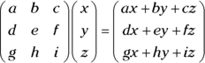
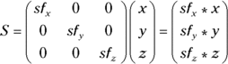

# Parallel Developments in the Film Industry

The need for computer generated images (CGI) drove the film industry to pioneer techniques that underpin modern 3D graphics hardware, from the GRAphics Symbiosis System (GRASS)-based transformations used to model the Death Star for the 1977 release of _Star Wars_, to the 15 minutes of computer-generated animation employing depth-cueing for 1984’s _Tron_, to the 1993 full photorealism of the dinosaurs in _Jurassic Park_. Similar developments for industrial applications were equally groundbreaking; Alan Sutcliffe’s demonstrations of wireframe terrain models using hidden line removal occurred as early as 1979, and Evans and Sutherland’s Picture System series and flight simulators, which employed depth cueing, were capable of manipulating large wireframe models in real time. These technological developments predated their use in gaming and in the personal computer by nearly 15 years, and as such their contribution to 3D graphics standards was hugely significant.

Following are brief descriptions of graphics technologies either attributed to or made famous by the film industry:

- _GRASS_ is a programming language designed to create 2D vector graphics animations, allowing scaling, rotation, translation and colour changes over time. It was first developed by Tom DeFanti in 1974 and was most famously used to rotate and scale the Death Star in the attack sequences of _Star Wars_. - _Hidden line removal_ is an optimisation of wireframe modelling where edges and lines that lie behind other visible surfaces are not drawn. The general principle is to avoid drawing what the eye cannot see, as this is wasteful in terms of performance and power. (A _wireframe_ is a skeletal shape containing none of the detail of the object it represents.) - _Depth-cueing_ is the process by which the eye is given the perception of depth in a scene. The eye makes use of many “cues” or “hints” to place objects within a three-dimensional world. These include _perspective_ (distant objects are smaller than near ones), _occlusion_ (distant objects are blocked from view by near ones) and _distance fog_ (distant objects are duller and more blurred due to light scattering by the atmosphere). _Tron_ employed the most primitive form of distance fog, whereby distant objects were gradually mixed with black to fade them out as they moved away from the scene—so the phrase was coined “if in doubt, black it out!”

Apart from custom-built and hugely expensive hardware that was largely tied to research—graphics and computer animation had been confined to complex algorithms written for general-purpose processors, with, at best, simple video address generators that performed some form of translation between the CPU and the display. It was inevitable that hardware acceleration would follow in order to support the growing processing demands of increasingly complex graphics.

In 1979, Jim Clark, an associate professor of electrical engineering at Stanford University, California, developed what he called a geometry engine, which was the foundation of modern hardware to accelerate 3D modelling. This engine transformed objects from representations in standalone models to a position and orientation on a computer screen. The lighting and shading steps were still handled by the main processor. Clark anticipated commercial success for the engine and formed Silicon Graphics Inc. (SGI) in 1982. The company was instrumental in bringing 3D computer graphics to the mass market.

Around the same time, the home PC market began in earnest with the hugely successful IBM PC and the Apple II, both of which came with graphics cards that supported colour displays. This captured the minds of families and businesses alike, and the first computer with a graphical user interface followed with the Apple Macintosh in 1984. The many competing platforms thrust computing and gaming into the limelight via aggressive advertising campaigns, and this pushed the graphics industry forward still further. Popular cross-platform games such as _Elite_ started to make use of wireframe models and techniques such as hidden line removal; another game, _Alpha Waves,_ provided the first fully immersive 3D experience for gamers, with interaction of 3D objects in a simple 3D world. High-performing 3D graphics would soon become a requirement of personal computers.

Meanwhile, SGI began the development of products for high-performance graphics terminals, beginning with their customised Integrated Raster Imaging System (IRIS) hardware, which could be attached to a general-purpose computer. Developers were exposed to this hardware via SGI’s proprietary application programming interface (API) called the IRIS graphics language (IRIS GL), which was mainly geared toward the provision of efficient floating point mathematics (used to represent an object’s shape by specifying its vertices in three-dimensional space; see the “[Geometry Specification and Attributes](#13_9781119183938-ch10.xhtml#c10-sec-0010)” section later in this chapter) via Clark’s geometry engine. The follow-up IRIS 2000 series formed part of fully functional UNIX workstations, but as systems evolved to accelerate 3D rendering, as well as geometry processing, it became clear that across the host of PCs and consumer devices a standard API was required for cross-platform support. In addition, companies such as IBM and Sun Microsystems were planning releases of 3D hardware that competed directly with IRIS, and so SGI sought to consolidate its market share by releasing a derivation of IRIS GL called OpenGL, which was the first API for 2D and 3D graphics that was not manufacturer-specific. OpenGL allowed developers access to all hardware platforms that supported it, and, critically, any unsupported hardware feature could be offloaded to software running on the main processor.

---

> [!NOTE]

UNIX is a widely used multitasking, multiuser operating system. For additional information about operating systems, see [Chapter 8](#11_9781119183938-ch08.xhtml).

### Two Competing Standards

It is here that we move away from graphics hardware to discuss the development of features through graphics standards. With the release of OpenGL 1.0 in 1992, SGI gained the support of various companies, including Apple, ATI, Sun Microsystems and, initially, Microsoft. To ensure the promotion and development of the open standard, SGI led the formation of the Architecture Review Board (ARB) later that year, and so numerous revisions of OpenGL followed. OpenGL 1.0 introduced the concept of model-space geometry, transformation to screen space, colour and depth information, textures, lighting and materials. Its aim was to provide an abstraction layer above the underlying hardware so that developers could port (transfer) their applications to various platforms without having to rewrite their code. Although well supported, this approach came at a performance cost, and early hardware platforms struggled as a result.

An _abstraction layer_ is used in programming to hide implementation details such that the same code can be used multiple times or on multiple platforms. For example, suppose you made a list of jobs for somebody to do in a day, one of which was washing your clothes. The output from this task would be a clean set of clothes. Sure, you might set some quality guarantees such that nothing is shrunk or the colours don’t run, but at this level you don’t care _how_ the washing is done. Moreover, you could pass the same list to somebody else (subject to the same guarantees) and they could achieve the same result. The mechanics of which machine is used, which cleaning agents, how the clothes are dried and which garments are mixed with others are unimportant details. This is a level of abstraction.

Early in 1993, Microsoft exited the OpenGL working group; in a bid to be competitive in the market, Microsoft bought a company called RenderMorphics to work on 3D graphics for Windows 95. RenderMorphics had developed an API in the field of CAD and medical imaging, and in 1995 Microsoft released the first versions of its own Direct3D API based on the RenderMorphics software: Direct X 2.0 and Direct X 3.0. Whilst developers appreciated the direct control of hardware that the immediate mode provided, it was hard to program, which led to calls for OpenGL to be adopted as the one true standard. In addition, a company called 3Dfx was developing a proprietary API (called Glide) for its Voodoo hardware, and the huge performance advantages of this approach brought the company some success. However, even 3Dfx was forced to adopt a subset of OpenGL features (Mini GL) in 1996 when a company called id Software released _Quake_ and included a Windows port targeting OpenGL.

---

> [!NOTE]

_Immediate mode_ is a rendering style for graphic library APIs that allows for the direct display of graphics objects to the screen.

As processing capabilities improved, proprietary APIs declined in favour of the flexibility provided by Direct 3D and cross-platform support provided by OpenGL. An intense battle ensued. Although OpenGL was the favoured API of many hardware vendors, Direct3D 4 was to prove revolutionary because it allowed rendering to arbitrary surfaces that could be used in subsequent rendering passes. OpenGL had to be extended to provide such a mechanism. Similar advances followed, most notably with the move to programmable processing steps from the old fixed-function pipeline. This led to the first major revision of OpenGL, and although both APIs have since remained independent, feature sets have remained broadly similar between the two standards. However, OpenGL remains the only cross-platform graphics API supported by various operating systems such as Linux, Android and iOS. By contrast, Direct3D is purely targeted at Microsoft Windows. In 2003 OpenGL ES 1.0—a derivative of OpenGL 1.3—was released to target embedded devices (the ES suffix stands for embedded systems). This release was in direct response to the proliferation of smartphones, tablets and mobile platforms. OpenGL ES 1.0 has since undergone several major revisions.

---

> [!NOTE]

A _fixed-function hardware pipeline_ is a collection of processing stages, each of which is tightly mapped to a dedicated set of logic gates (building blocks of a digital circuit). A _programmable hardware pipeline_ is a more loosely defined general-purpose platform on which the same functionality can be achieved with much more flexibility and, unfortunately, a potential degradation of performance. The programming interface is conceptually more complex (as a program needs to be written to perform each task rather than directly calling a specific hardware function), but the scope to achieve more sophisticated techniques means that programmable pipelines now underpin all modern graphics processors.

Before you move on to looking at OpenGL in more detail, we should mention NVIDIA, the company that first coined the phrase “graphics processing unit” (GPU). This term is widely used to describe the single-chip processor dedicated to geometry processing, transform and lighting, texture mapping and shading. NVIDIA first used the term in 1999 for the release of its GeForce 256 core and the first Direct3D 7-compliant hardware accelerator. The Raspberry Pi contains Broadcom’s VideoCoreIV GPU.

## The OpenGL Graphics Pipeline

This section delves deeper into the OpenGL graphics pipeline. All modern computer hardware—from desktop PCs to smartphones—contains some form of GPU specifically designed to accelerate all but the simplest of 3D graphics tasks. We will take a look at the principal stages of the classical graphics pipeline and understand the key concepts before moving on to how modern GPUs accelerate these steps.

OpenGL neither requires that any features be accelerated by special hardware nor specifies any minimum performance targets; it merely sets out requirements that any implementation must meet to comply with the specification. It would therefore be perfectly acceptable, though perhaps undesirable, for the API to be implemented entirely in software running on a general purpose CPU. It is also important to recognise that OpenGL dictates only 3D rendering and not how input data is passed to the pipeline or how these images are to be displayed on screen.

OpenGL is a huge topic in its own right, worthy of several textbooks. As we touch on the basics of the graphics pipeline we will refer to OpenGL ES versions to demonstrate how the standard has evolved to improve flexibility for developers, and in turn has placed greater demands on the hardware itself. For reference, the Raspberry Pi GPU supports both OpenGL ES 1.1 and OpenGL ES 2.0 standards.

Figure 10-3 illustrates a high-level view of a graphics pipeline broken down into the following four stages:

1. **Vertex processing:** Vertices are placed to define the position and shape of an object. 2. **Rasterization:** Primitives (connected vertices) are converted into fragments with each fragment containing the data necessary to generate one pixel of a primitive. 3. **Fragment processing:** Fragments undergo a series of operations, including texturing and blending in preparation of converting them into coloured pixels. 4. **Output merging:** Fragments of primitives in three-dimensional space are combined to render a three-dimensional objects on a two-dimensional screen. For example, if a portion of one object is behind another in three-dimensional space, the pixels of that portion of the object in back will be hidden behind the pixels of the object in front.

 A simple graphics pipeline diagram](./media/images/9781119183938-fg1003.png)

Because the process is linear it is described as a pipeline: data passes through successive stages, where each stage can start only after the previous one has completed. However, many stages may be simultaneously active as the pipeline queues up processing steps in preparation for when the next stage can accept its data. Consider Figure 10-4 in which we represent three stages of cleaning: washing, drying and ironing. We could perform washing and then drying and then ironing for each load, but this only achieves a throughput (one complete cleaning cycle) of one load for every three processes. Given that washing, drying and ironing can be performed in parallel, we can start the next wash load as soon as the previous load is being dried. The same is true of the subsequent drying and ironing steps. Apart from the initial time taken to fill the pipeline (that is, to get to the point in time when washing, drying and ironing are all active), throughput is now one load for every process.

 Visual metaphor of a pipeline, where several steps can be performed in parallel to improve computational efficiency.](./media/images/9781119183938-fg1004.png)

### Geometry Specification and Attributes

Objects in OpenGL ES are composed of points, lines and triangles. Complex shapes are created from these basic building blocks, or _primitives_. The inputs to OpenGL ES are the (three-dimensional) coordinates of the vertices of these building blocks; a point has one vertex, a line has two vertices, and a triangle has three vertices. As described later in this section, vertices may also have other data attached to them apart from their position in the modelview-space. The data associated with each vertex are known as _attributes_.

Three coordinates are required to describe the position of a vertex in a three-dimensional world: x, y and z (see Figure 10-5). These coordinates are grouped as three-component vectors. In the absence of any transformation the default orientation of the coordinate axes are such that x and y represent the horizontal and vertical screen axes, and z the axis perpendicular to the screen. The default range of these axes is from -1 to +1. Any shape that lies inside the cube defined by these axes is projected onto the two-dimensional viewing surface (that is, the screen). If a shape has coordinates that lie outside of this range, it is clipped and may be removed from the scene entirely, as it will not be visible.

 Vertices plotted with x, y, z coordinates can define three-dimensional shapes.](./media/images/9781119183938-fg1005.png)

OpenGL ES supports seven primitives that may be used to construct more complex shapes. These primitives are shown in Figure 10-6:

- A point is a single vertex with a default size of one pixel. The user may change the size of a point primitive. - A line is defined by two connected vertices. - A line strip is formed by connecting three or more vertices without connecting the first and last vertices, thus forming an open shape. - A line loop is a line strip with the first and last vertices connected to form a closed shape. - A triangle is formed by connecting three vertices. - A triangle strip is formed where three vertices are used to describe an initial triangle, and each successive vertex forms a new triangle using two previous vertices and the new vertex. - A triangle fan is similar to a triangle strip except that each triangle has the initial vertex in common.

 Open GL primitive types](./media/images/9781119183938-fg1006.png)

All shapes in OpenGL ES are constructed from these primitive types, with the type specified as an input by the developer. The default format for these coordinates is 32-bit floating point (a format that provides a wide dynamic range of values to support precise positioning) but again, the user may specify different a data type.

In addition to position, other per-input-vertex data may be specified by the user. This is data that will be used in subsequent 3D rendering steps and may include colour, normal vectors (used in lighting calculations) and coordinates of textures (used in texturing). Colour is assigned to each vertex in OpenGL ES. When different colours are set for different vertices, the pipeline automatically blends them for screen pixels that lie inside the shape. Colours are specified with up to four components: red, green, blue and, optionally, alpha, which is used to represent the transparency of the colour. When multiple objects overlay one pixel in a scene, the relative depth of these objects and the alpha colour components determine how colours must be blended to give the illusion of transparency.

---

> [!NOTE]

A _normal vector_ (or _normal_) represents a direction that is perpendicular to the surface of an object.

The definition of additional attributes is well-defined in OpenGL ES 1.1 as it only exposes a fixed function rendering pipeline. Because the OpenGL ES 2.0 pipeline is flexible, these other attributes are essentially any data that may or may not be used by any processing step later in the pipeline. You can read more about how this data may be used in later sections of this chapter.

### Geometry Transformation

Transformations in computer graphics are essentially changes to the coordinate system in which each object exists. Whilst the inputs to OpenGL ES are the abstract object coordinates specific to each component of the scene, each object undergoes several transformations that may change its appearance or remove it entirely from the “screen”. Hardware implementations handle most of the mathematics behind the scenes, but it pays to understand this concept in order to make sense of why GPUs have been designed in such a way to aid the transformation process.

---

> [!NOTE]

We talk about the “screen” here, but the output of rendering need not necessarily end up on the display. Many applications process a scene multiple times before outputting an image to the screen; each intermediate processing step (or render) will not necessarily be visible to the user.

#### Transformation Types

The first vertex processing step is the modelling transformation, which positions and sizes the object in the context of the overall scene. The system of world coordinates is used to define the relative positions of these objects in the 3D world that is being created. Following this, a second transformation occurs to account for what the observer of the scene can actually see. Only the view of the world from the perspective of the observer is what is rendered to the screen. This is the system of _eye coordinates_, having undergone what is termed as the viewing transformation. In practice, OpenGL ES does not separate these two transforms, as it is impossible to distinguish between the two from the output of these two stages. For example, imagine a scene of a woman walking her dog, where the dog is directly in front of the woman. In the next frame, the dog is to the left of the woman. Has this resulted from the dog moving to the (stationary) woman’s left (a modelling transformation of the dog), or from the woman moving to the right of the dog (a viewing transformation from the woman)? The difference is purely conceptual, and so OpenGL ES makes no attempt to distinguish between the two; there is only one modelview transformation (see Figure 10-7).

 OpenGL ES uses a single modelview for modelling and viewing transformations.](./media/images/9781119183938-fg1007.png)

OpenGL ES supports three basic modelview transformations: translation, scaling and rotation:

- Translation simply adds an offset to each component of the position vector, thereby moving it within the new coordinate system. For example, for an offset of `(-off_x, +off_y, +off_z)`, a vector `(x, y, z)` would become `(x-off_x, y+off_y, z+off_z)`. On its own, it does not change the size of the overall object. - Scaling multiplies each component of the position vector by a scale factor, thereby resizing the overall object. For example, for a scale factor of `(sf_x, sf_y, sf_z)`, a vector `(x, y, z)` would become `(sf_x*x, sf_y*y, sf_z*z)`. - Rotation requires a bit more understanding of three-dimensional coordinate systems. Whereas rotation in two dimensions occurs around a point, in three dimensions this must happen around an axis. Once this axis is defined, a convention must then be used to define whether clockwise or anticlockwise rotation occurs for positive values of rotation around this axis. OpenGL ES uses a right-handed coordinate system so the right-hand rule applies: curling the fingers of your right hand as you point your thumb in the air shows you the direction of positive rotation around an axis pointing in the direction of your thumb. For example, an axis defined by the vector `(dx, dy, dz)` with respect to the origin (where at least one of `dx, dy` or `dz` are non-zero) defines an axis about which each vertex can be rotated by a user-defined angle (which we call θ `)`. (See Figure 10-8.)

 Rotation is defined by the axis around which objects rotate and the angle of rotation.](./media/images/9781119183938-fg1008.png)

OpenGL ES 1.1 provides a fixed set of functions to describe these various transformations, namely `glTranslate`</code>, `glScale` and `glRotate`, whereas OpenGL ES 2.0 hands much more control to the developer by providing programmable stages in which to process geometry.

After positioning objects within this imaginary 3D world, the view of this world needs to be projected onto a two-dimensional viewing surface, for which there are two more stages of transformation. The projection transformation first converts from eye coordinates to clip coordinates, and this is necessary for two reasons:

- The observer cannot see the entire three-dimensional world, so the limits within which this 2D scene is viewed (the viewport) must be bound to the set of objects rendered to the display. - The observer can see objects only within a certain range of distances, so limits must be placed on the depths of transformed components.

Objects that lie outside of these ranges are said to be “clipped,” hence the term _clip coordinates_. Rather than a 2D rectangle within which a scene must be displayed, a viewing volume defines the observable region, accounting for the relative depths of objects in the scene.

In theory, this viewing volume might resemble an infinitely “deep” rectangle, with a cross-section equal to the 2D window through which the scene is viewed; in practice the viewing volume does not resemble such a window, for two reasons:

- Perspective: objects further from the observer appear smaller. - The field-of-view extends as distance from the observer increases.

All lifelike images are processed using perspective projection to account for distance from the viewer. Perspective projection would imply an infinitely deep pyramidal viewing volume extending from the observer. However, because it would be impossible to store an infinite range of depth values, the regions of this pyramid within which objects can be observed are limited. In effect, the viewing volume is a truncated pyramid, as shown in Figure 10-9. This is also known as the frustrum, and is discussed later in this chapter.

 OpenGL ES viewing volume, or frustrum. In addition to the viewport boundaries, near and far clip planes must be supplied to fully define the set of valid clip coordinates as a result of the projection transformation. (Clip planes pass through the frustrum; anything closer to the viewport than the near clip plane or farther than the far clip plane are cut out of the scene.)](./media/images/9781119183938-fg1009.png)

The final transformation is to convert the 2D clip coordinates to a set of coordinates scaled to the device on which the scene is being displayed (such as a rectangle of pixels on a screen). The viewport transformation performs this step and is the final stage of vertex processing.

#### The Maths behind Transformations: Transformation Matrices

Now that you have a general understanding of the geometry transformations in the coordinate plane, you are ready to look more closely at the mathematics involved in performing transformations. As stated earlier, the position of vertices in a 3D coordinate space are represented in Cartesian form by a three-component vector, where the magnitude of each component represents the distance of the point from the origin in the x, y and z dimensions respectively. For now we represent each vertex by a triple of numbers in the form `(x,y,z)`.

A transformation results in some change in a graphical object, such as its position (translation), its size (scaling) or its angle relative to a rotational axis. (rotation). To perform such transformations, the object’s vertices must be moved in the coordinate plane in a certain direction and magnitude. To determine the new location of a vertex, mathematical operations are performed on the vertex’s x, y and z values. Matrices facilitate these mathematical operations.

Matrices are rectangular arrays of numbers and are used to represent the modelview transformations described earlier. They are used to pre-multiply each vector by per-component factors to compute an output vector of the same dimension. To be able to multiply two matrices, the number of columns in the first matrix must equal the number of rows in the second matrix. To multiply two matrices, you multiply each value in the first row of the first matrix by its corresponding value in the first column of the second matrix and then sum the results. This is repeated for all rows and columns as shown:

<!--<m:math display="block" overflow="scroll" xmlns:m="http://www.w3.org/1998/Math/MathML"><m:mrow><m:mfenced open="(" close=")"><m:mrow><m:mrow><m:mtable columnalign="center"><m:mtr columnalign="center"><m:mtd columnalign="center"><m:mi>a</m:mi></m:mtd><m:mtd columnalign="center"><m:mi>b</m:mi></m:mtd><m:mtd columnalign="center"><m:mi>c</m:mi></m:mtd></m:mtr><m:mtr columnalign="center"><m:mtd columnalign="center"><m:mi>d</m:mi></m:mtd><m:mtd columnalign="center"><m:mi>e</m:mi></m:mtd><m:mtd columnalign="center"><m:mi>f</m:mi></m:mtd></m:mtr><m:mtr columnalign="center"><m:mtd columnalign="center"><m:mi>g</m:mi></m:mtd><m:mtd columnalign="center"><m:mi>h</m:mi></m:mtd><m:mtd columnalign="center"><m:mi>i</m:mi></m:mtd></m:mtr></m:mtable><m:mi>&#160;</m:mi></m:mrow></m:mrow></m:mfenced><m:mfenced open="(" close=")"><m:mrow><m:mrow><m:mtable columnalign="center"><m:mtr columnalign="center"><m:mtd columnalign="center"><m:mi>x</m:mi></m:mtd></m:mtr><m:mtr columnalign="center"><m:mtd columnalign="center"><m:mi>y</m:mi></m:mtd></m:mtr><m:mtr columnalign="center"><m:mtd columnalign="center"><m:mi>z</m:mi></m:mtd></m:mtr></m:mtable></m:mrow></m:mrow></m:mfenced><m:mo>=</m:mo><m:mfenced open="(" close=")"><m:mrow><m:mrow><m:mtable columnalign="center"><m:mtr columnalign="center"><m:mtd columnalign="center"><m:mrow><m:mi>a</m:mi><m:mi>x</m:mi><m:mo>+</m:mo><m:mi>b</m:mi><m:mi>y</m:mi><m:mo>+</m:mo><m:mi>c</m:mi><m:mi>z</m:mi></m:mrow></m:mtd></m:mtr><m:mtr columnalign="center"><m:mtd columnalign="center"><m:mrow><m:mi>d</m:mi><m:mi>x</m:mi><m:mo>+</m:mo><m:mi>e</m:mi><m:mi>y</m:mi><m:mo>+</m:mo><m:mi>f</m:mi><m:mi>z</m:mi></m:mrow></m:mtd></m:mtr><m:mtr columnalign="center"><m:mtd columnalign="center"><m:mrow><m:mi>g</m:mi><m:mi>x</m:mi><m:mo>+</m:mo><m:mi>h</m:mi><m:mi>y</m:mi><m:mo>+</m:mo><m:mi>i</m:mi><m:mi>z</m:mi></m:mrow></m:mtd></m:mtr></m:mtable></m:mrow></m:mrow></m:mfenced></m:mrow></m:math>-->

Following is an example of how multiplying matrices is used to scale a three-dimensional vector by each of the scale factors `sf_x, sf_y` and `sf_z`:

<!--<m:math display="block" overflow="scroll" xmlns:m="http://www.w3.org/1998/Math/MathML"><m:mrow><m:mi>S</m:mi><m:mo>=</m:mo><m:mfenced open="(" close=")"><m:mrow><m:mrow><m:mtable columnalign="center"><m:mtr columnalign="center"><m:mtd columnalign="center"><m:mrow><m:mi>s</m:mi><m:msub><m:mrow><m:mi>f</m:mi></m:mrow><m:mrow><m:mi>x</m:mi></m:mrow></m:msub></m:mrow></m:mtd><m:mtd columnalign="center"><m:mn>0</m:mn></m:mtd><m:mtd columnalign="center"><m:mn>0</m:mn></m:mtd></m:mtr><m:mtr columnalign="center"><m:mtd columnalign="center"><m:mn>0</m:mn></m:mtd><m:mtd columnalign="center"><m:mrow><m:mi>s</m:mi><m:msub><m:mrow><m:mi>f</m:mi></m:mrow><m:mrow><m:mi>y</m:mi></m:mrow></m:msub></m:mrow></m:mtd><m:mtd columnalign="center"><m:mn>0</m:mn></m:mtd></m:mtr><m:mtr columnalign="center"><m:mtd columnalign="center"><m:mn>0</m:mn></m:mtd><m:mtd columnalign="center"><m:mn>0</m:mn></m:mtd><m:mtd columnalign="center"><m:mrow><m:mi>s</m:mi><m:msub><m:mrow><m:mi>f</m:mi></m:mrow><m:mrow><m:mi>z</m:mi></m:mrow></m:msub></m:mrow></m:mtd></m:mtr></m:mtable><m:mi>&#160;</m:mi></m:mrow></m:mrow></m:mfenced><m:mfenced open="(" close=")"><m:mrow><m:mrow><m:mtable columnalign="center"><m:mtr columnalign="center"><m:mtd columnalign="center"><m:mi>x</m:mi></m:mtd></m:mtr><m:mtr columnalign="center"><m:mtd columnalign="center"><m:mi>y</m:mi></m:mtd></m:mtr><m:mtr columnalign="center"><m:mtd columnalign="center"><m:mi>z</m:mi></m:mtd></m:mtr></m:mtable></m:mrow></m:mrow></m:mfenced><m:mo>=</m:mo><m:mfenced open="(" close=")"><m:mrow><m:mrow><m:mtable columnalign="center"><m:mtr columnalign="center"><m:mtd columnalign="center"><m:mrow><m:mi>s</m:mi><m:msub><m:mrow><m:mi>f</m:mi></m:mrow><m:mrow><m:mi>x</m:mi></m:mrow></m:msub><m:mo>*</m:mo><m:mi>x</m:mi></m:mrow></m:mtd></m:mtr><m:mtr columnalign="center"><m:mtd columnalign="center"><m:mrow><m:mi>s</m:mi><m:msub><m:mrow><m:mi>f</m:mi></m:mrow><m:mrow><m:mi>y</m:mi></m:mrow></m:msub><m:mo>*</m:mo><m:mi>y</m:mi></m:mrow></m:mtd></m:mtr><m:mtr columnalign="center"><m:mtd columnalign="center"><m:mrow><m:mi>s</m:mi><m:msub><m:mrow><m:mi>f</m:mi></m:mrow><m:mrow><m:mi>z</m:mi></m:mrow></m:msub><m:mo>*</m:mo><m:mi>z</m:mi></m:mrow></m:mtd></m:mtr></m:mtable></m:mrow></m:mrow></m:mfenced></m:mrow></m:math>-->

The most powerful feature of using matrices is that multiple transformations can be combined by multiplying matrices. This allows all stages of vertex processing to be reduced to a single matrix multiplication, thus making the whole process more efficient and amenable to dedicated hardware processing.

---

> [!NOTE]

Although the matrix examples show a 3×3 matrix that corresponds to the three axes, x, y and z, you will commonly see a 4×4 matrix. The fourth column accounts for the origin (the point at which the three axes intersect). This fourth column enables you to change the position of the coordinate origin, which is required to perform a translation.

### Lighting and Materials

Lighting and materials contribute directly to the realism of objects displayed in the scene, and this is one area that has undergone significant changes through major revisions of OpenGL ES. This section touches on basic lighting concepts as seen in OpenGL ES 1.1.

> [!NOTE]
> that for OpenGL ES 2.0 onwards, the lighting system (together with the geometric transformation stage discussed in the last section) was replaced by an entirely programmable pipeline allowing for more customization. Previously, only a limited set of fixed-function calls were made available to the application developer.

The interaction of light with objects and their materials is key to the way an observer perceives the world. A mirror looks shiny because it reflects a lot of light; a wool sweater looks fluffy because it absorbs more light and produces diffuse reflections according to the surface contours of the material. For our constructed 3D world to appear lifelike, these effects must be modelled in ways that fit with the properties expected of objects we see every day.

> [!NOTE]
> that lighting is computed per vertex for an object, the properties of which are then interpolated over the entire primitive like other vertex attributes.

OpenGL ES defines a series of properties that must be defined for the light sources and the objects placed in the scene. Two types of reflection are defined: specular reflection and diffuse reflection (see Figure 10-10).

- **Specular reflection:** The rays of light are reflected almost entirely in one direction by a surface, such that the observer views regions that are highly coloured according to the observer’s precise position. A real-world example would be the glare of sunlight from a mirror. This is easily avoided by moving slightly to one side. Areas of an object that are intensely lit in this way are called specular highlights. - **Diffuse reflection:** The propensity of a material to scatter light in all directions, such that it appears fuzzy and dull. The observer views contributions of colour from the whole surface.

 Specular versus diffuse reflection](./media/images/9781119183938-fg1010.png)

These properties together govern how shiny a material appears. OpenGL ES defines a specular colour and a diffuse colour for an object, together with two additional colours. The ambient colour is the colour an object reflects when illuminated by indirect light, and the emission colour is the “glow” emitted from the object without any external illumination.

In addition to the properties of a surface, the colour of an object depends on the angle at which light is emitted or reflected. A flat-shaded curved surface appears to vary in colour, according to the angle at which light is reflected from it. OpenGL ES captures this information by way of a normal vector, which represents a direction perpendicular to an object’s surface. In fact, normal vectors are defined for each vertex, much like colour and texture coordinates, and are transformed and interpolated for a primitive like any other vertex attribute. This is because although a triangle is planar, this may be shaped around a curved surface and so the normal vector gradually changes over the length and breadth of the primitive. As the normal vector varies, the resultant calculations that use this vary, which affects the computed colour we would naturally expect to see. One further detail about normal vectors is the direction in which they point: the direction of a normal vector is governed by whether the primitive is front-facing or back-facing. A front-facing primitive forms the side of an object that faces the viewer so that the normal vector points towards the viewer. A back-facing primitive has a normal vector that points away from the viewer, as its surface points away from them. The way a primitive faces is captured in the geometry specification stage by way of a winding order of vertices. By default, vertices defined in an anticlockwise order form a front-facing primitive, and those defined in a clockwise order form a back-facing primitive. Figure 10-11 shows an example of the winding order for front-facing and back-facing primitives.

 The triangle on the left shows an anticlockwise winding order. Under the standard convention, this would be a forward-facing primitive. The triangle on the right shows a clockwise winding order, which would be a back-facing primitive.](./media/images/9781119183938-fg1011.png)

---

> [!NOTE]

The actual surfaces, especially of CAD models coming from a non-uniform rational basis spline (NURBS) translation, are only approximated by the vertices and triangles in OpenGL. It is the interpolation of the reflections between vertices that gives the model the smooth continuous appearance rather than the tell-tale tessellation (tiling of a surface with geometric shapes) that gives away images as computer generated rather than natural. (NURBS is a mathematical model for generating curves and surfaces.)

With the material and light source properties defined, a set of lighting calculations are performed to derive each vertex colour. Essentially vertex colour is formed from the ambient and emission colours of the material, plus a set of contributions per light source in the scene. These contributions are scaled in intensity according to the direction of the surface with respect to the light source (using the normal vector), the position of the viewer with respect to the surface (for specular contributions) and the distance of the light source and viewer from the surface. For the latter, imagine that the influence of a light is essentially a cone of energy spreading out from the source, such that the relative intensity of light follows the familiar inverse square law, becoming less intense at the edges of the cone’s base. Vertex colour is modified still further by the spectacular colour of the material and the light source, the angle between the reflected ray and the viewer, and the shininess of the material, with shinier materials decreasing the amount of visible light as this angle increases. Diffuse contributions are derived from the diffuse colour components in a similar way, except that the angle between the source ray and surface normal is used; as a result surfaces that are parallel to the source ray do not appear lit.

Because the colour of a vertex is the sum of contributions from all light sources, their combined intensity can easily result in the loss of all colour detail in the scene. This is similar to the concept of a photograph being overexposed. Lighting levels must be carefully tuned to achieve the desired output.

As we explained earlier, for versions of OpenGL ES 2.0 and later, the process of transformation and lighting were made much more flexible. They are now known as _vertex shading_, and they’re entirely programmable by the user. Programs specified in an OpenGL ES–specific shader language called GL Shader Language (GLSL) are submitted to the implementation to perform these transformations, and where hardware is provided this may take the form of a GLSL-specific processor where GLSL programs are compiled as needed to perform all the computation required.

### Primitive Assembly and Rasterisation

Up to this point an application-supplied list of vertex attributes has been transformed into a new list of attributes, converted to the coordinate system of the intended display device. However, these vertices must be used to construct the shapes as we see them on screen. Preparing shapes for display is a two-step process:

1. **Primitive assembly:** Vertices for each shape are grouped allowing the pipeline to compute how all shapes are to appear in the final output image. 2. **Rasterisation:** Shapes are converted to collections of pixels to be displayed on screen or processed in further rendering steps (see Figure 10-12).

During rasterization, all pixels lying inside the boundaries of the shape must be shaded using the data associated with its vertices; those outside should be left unchanged. After these pixels are determined, the attributes associated with each vertex must be interpolated so that each included pixel inherits a weighted average of those belonging to the primitive, depending on its distance from the corners. Attributes such as colour, normal vectors (used in lighting) and texture coordinates may all be interpolated in this way in preparation for per-pixel processing (known as fragment shading in OpenGL ES 2.0). Because these values vary across the shape, at the input to the fragment shading step these are known as _varyings_.

 Rasterisation. The crosses indicate primitive samples that will be shaded during fragment processing.](./media/images/9781119183938-fg1012.png)

Although the rasterisation process is largely hidden from and invisible to an OpenGL ES user, it is helpful to know how this step works. Imagine that the _output frame-buffer_, a part of random access memory (RAM) containing a bitmap with a complete frame of data, is divided into a grid of squares representing each of the pixels to be displayed on screen. Coverage of a pixel by a primitive is determined by one or more sample points within the “square” that the pixel represents. When more than one sample point is used per pixel, it’s called multi-sampling and this may be used to improve the output image quality. When multi-sampling is not enabled, a single sample point at the centre of the pixel is used to represent its exact position. If two primitives share an edge through a particular pixel, this must only result in a single output fragment. A set of rules—called _tie break rules_—determine which primitive is chosen in various cases. These rules ensure consistency in the rasterisation process*.* Also

> [!NOTE]
> that an included pixel at this stage is called a _fragment_ because it contains more than just colour information; texture coordinates, depth and stencil information are also associated with each frame-buffer location.

If multi-sampling is enabled each pixel may have many sample points, allowing for partial coverage to be represented in the frame-buffer. The single coverage value per pixel contains 1 bit per sample point. The colour and texture coordinates for all samples can be the same, but depth and stencil information are stored per sample. In this way, edge anti-aliasing (smoothing jagged edges) may be achieved without compromising performance, as colour computation (including texture sampling) need only be performed per-pixel. The output pixel is simply an average of the number of included sample points.

Having decided which pixels are covered by a particular primitive, it is necessary to compute all the attributes associated with these pixels (known as fragments) from the vertex attributes for the entire primitive. This is done using interpolation and the barycentric coordinates (see Figure 10-13) of each of the primitive’s vertices. By determining the distance of each fragment from the vertices, simple linear interpolation is used to compute colour and texture coordinates, together with any other per-vertex attributes necessary for pixel processing. There is one problem, however. Linear interpolation in device coordinates, post perspective-projection, does not compute consistent results because perspective projection in itself is not a linear transformation. This is where `w` comes in. By dividing each vertex attribute by its respective `w` term, interpolating the `1/w` term and then dividing each interpolated attribute by this interpolated `1/w` perspective-correct interpolation is achieved.

Barycentric coordinates represent the position of a point inside an object relative to the influence of the object’s vertices. This is usually thought of in terms of the size of mass placed at each vertex such that the point lies at the centre of mass for the overall object. For triangles, this can be visualized more easily using areas rather than masses. In [Figure 10-13](#13_9781119183938-ch10.xhtml#c10-fig-0013), the barycentric coordinates of a general point P, inside a triangle ABC, represent the relative ratios of the areas of PBC, PCA and PAB, respectively. By definition, the coordinates of point P add up to one. This makes varyings interpolation easy as the computed output is simply the sum of each vertex attribute multiplied by its barycentric coordinate component. Perspective-correct computation must include 1/w interpolation, which must be divided through once each sample varying has been determined.

 Barycentric coordinates represent the sizes of mass placed at an object’s corners such that the point lies at the centre of mass for the overall object.](./media/images/9781119183938-fg1013.png)

### Pixel Processing (Fragment Shading)

Fragments that are determined to be inside the primitive and have all their interpolated varyings computed are ready for per-pixel processing. However, fragments may still be invisible as they may lie behind other shapes that also overlap the same fragment location; they are said to be _occluded_. Transparency may also mean that the colour value associated with the fragment is not the final colour written to the frame-buffer; it must be blended with the object behind it as this colour is, in part, also visible to the viewer. Such decisions are handled by a series of tests to influence the resultant operation to the frame-buffer. In OpenGL ES 1.1, sample data computation is limited to a series of fixed-function operations, whereas in OpenGL ES 2.0 general purpose fragment shading gives the application writer much more freedom to compute the colour, depth and stencil values associated with each fragment. We focus first on OpenGL ES 1.1 functionality.

Fragments that exit the rasterisation pipeline first make use of any textures that are bound to them. This will be described in more detail in the next section, but essentially a map of a texture stored in memory may be applied directly or used to modify the colour of a fragment sample. Texturing may be used in various ways to achieve lifelike visualisations at low computational cost. OpenGL ES 1.1’s fixed function pipeline then applies a colour sum stage, where a secondary colour may be added to the fragment colour or used to modify the texture colour further (for specular highlights, for example). The final stage in fragment processing is to apply fog*,* which is used to reduce the visibility of objects that are further away from the viewer so that as objects approach the far clip plane, they tend to fade.

Before we deal with how these colour values are updated for a given sample location, we should mention that it is the depth and stencil data that influence whether this colour is even updated at all. The scene depicts objects in three dimensions, so it follows that parts of objects, or even whole objects, may lie behind others and may not be visible in the frame-buffer. One technique for handling this, called the _painter’s algorithm_, might be to change the order of primitives to be drawn from back to front, allowing those in the foreground to be rendered later and thus appear first. However, not only does the painter’s algorithm fail when different parts of objects intersect and overlap in different portions of the image, but every time the viewing position changes this order would need to be recomputed.

Instead, OpenGL ES uses a depth buffer to store the position of each visible frame-buffer sample in the scene. For each primitive, the depth of a sample to be updated is compared with that in the frame-buffer; if it is occluded, the colour value is not updated; otherwise, the colour is written to the frame-buffer and the depth value is also updated. There is one further wrinkle with this technique. Following transformation and rasterisation it is possible that two primitives lie in the same plane, but the interpolation of depth is not consistently computed. This can lead to depth fighting, where pixels of one object can “bleed” into those of another co-planar object, which is particularly obvious during animation where the transformations are likely to change subtly from frame to frame. OpenGL ES provides a mechanism called _polygon offset_ to set displacements of primitives based on their slope and/or bias. However, care from the application writer together with consistent varyings interpolation can ensure that these effects are minimised.

The depth test is one example of a fragment test—an operation that may be used to control the update of a sample in the final frame-buffer. There are other tests, but the general principle is to perform a comparison of a computed value against the existing value in the frame-buffer; based on the outcome the value may be updated or not.

Other fragment tests include the alpha test and the stencil test. The alpha test performs the fragment test on the alpha channel of a given sample, and depending on the test result may be used to discard portions of a primitive pixel by pixel. The stencil test may also be used to eliminate fragments based on a comparison of a reference value and a stored frame-buffer value. However, it may also modify the contents of the stencil buffer for a sample, depending on the outcome of the depth and stencil tests.

Following the fragment tests, the final colour in the frame-buffer may be replaced directly or modified further according to the configuration specified by the user. Blending is one of these stages, which derives an output pixel colour as a linear combination of the sample and existing frame-buffer colours. Blend factors are individually applied to the source (sample) and destination (frame-buffer) colours before addition or subtraction to form the new colour to be written to the frame-buffer.

In addition to blending, a set of logical operations is available to the user. These provide a set of bitwise operations that can be used to modify the frame-buffer contents using source and destination colours. Each operation is separately applied to each colour component and can be disabled to allow the sample colour to be written straight to the frame-buffer.

Again, OpenGL ES 2.0 completely transformed the fragment processing pipeline by providing a general-purpose platform on which processing could be performed on each sample. An additional set of GLSL functions completely replace the fixed-function texture environment, colour sum and fog components of the pipeline. For hardware implementations these GLSL functions are again compiled as needed to run on custom shader processor cores, part of the process now called _fragment shading._

### Texturing

Texture mapping is a fundamental resource used extensively to compute the colours of rendered surfaces, either directly from an image in memory or via additional processing that may depend on image or geometry data. With texture mapping, coordinates of vertices are matched up with coordinates of a texture. The functionality available to the OpenGL ES programmer has improved dramatically over the years, but the fundamental concepts remain the same.

A _texture_ is a digital image stored in memory. It can be sampled as part of fragment processing in order to derive a colour for each sample or each pixel to be written to the frame-buffer. In its simplest form, texturing is a computationally cheap way of adding detail to the surface of an object. Consider rendering a three-dimensional model of a brick-built house. The walls could be constructed brick by brick, each brick transformed and lit individually, together with its surrounding mortar. The quality of the resulting scene would be high, but this would be at the expense of complex geometry and a high number of calculations to be computed as the scene is animated. The wall itself is a complete entity; each brick does not move in relation to the others. All that is required is a repeatable pattern of bricks and mortar to be pasted onto a model of a complete wall. This is where texturing comes in. An image of bricks and mortar is stored in memory, and as pixels are rendered across a primitive spanning the whole wall they simply sample the next colour stored in memory. In effect, the image stored in memory is copied to the surface of the object in the frame-buffer. As the wall is transformed in the scene, this image may need to be scaled and filtered, but this is all possible via texture mapping. Textures may be used to colour objects, to apply effects to existing object surfaces or purely as a general source of data to the more recent OpenGL ES 2.0 fragment shaders.

Textures are stored in memory as rectangular arrays of image data in much the same way as image data is stored in the frame-buffer. Each element is known as a _texel_. Originally, the dimensions of textures were restricted to power-of-two sizes (for example, 32, 64 or 2*n* texels in width/height) to simplify the sampling calculations, but in OpenGL ES 2.0 these restrictions have been lifted. Texture images are referenced via texture coordinates—per-vertex attributes that detail where in each dimension to sample the texture. The whole texture can be referenced by a coordinate in the range \[0,1\]; individual texels may be accessed by multiplying the coordinates by the appropriate dimensions of the image. If the coordinates lie outside the range \[0,1\] one of several things may happen. If wrapping is enabled, the texture may repeat (by ignoring the whole part of the coordinate and sampling using the fractional part), or it may be clamped so that the outermost texel is sampled (clamp-to-edge) or a border texel is sampled (clamp-to-border). This is configurable by the application writer, depending on the desired output.

The sampling of textures may also vary depending on the specified filtering mode. Texture coordinates specify an exact location at which to sample the image stored in memory, but this is highly unlikely to fall in the centre of a specific texel. If nearest filtering is selected, the nearest texel to the sampling point is chosen, which is cheap and simple to implement. A more precise result may be obtained (in two dimensions) by choosing the four texels that are nearest to the sampling point and taking a weighted average of these according to the distance of the sampling point from each of them. This is known as _bilinear filtering_ because a simple 2×2 box filter is used to derive the appropriate texel colour, as shown in Figure 10-14.

 The dark grey dot indicates the sample position against the texture in memory. If nearest filtering is selected, texel A will be chosen. If bilinear filtering is selected, the colour data from texels A, B, C and D will be blended together linearly, using the fractional distances α and β.](./media/images/9781119183938-fg1014.png)

Texture images may be applied to objects that are large and close to the viewer or small objects that are much further away. The texel sampling rate for distant objects can cause noticeable visual artefacts (distortions): two adjacent screen pixels of an object far in the distance may correspond to texels spaced a long way apart in the same texture. Simply applying bilinear filtering for successive pixels can result in a huge loss of detail and undesirable moiré patterns. The correct process would be to compute the average of all the texels surrounding each sample point such that successive samples capture all the image data. At full resolution this could result in averaging hundreds of texels at huge computational cost. The solution is called _mipmapping_. Mipmaps are a sequence of precomputed down-filtered textures stored with the original image. Each mipmap is half the width and half the height of the previous image. (See Figure 10-15.) A complete set of mipmaps is computed, right down to an image of just 1×1 texel. The cost of storing a full set of quarter-size images is 33%, but the improved quality in texturing and reduction in filtering computation more than makes up for this.

 A collection of mipmaps, each half the width and half the height of the previous level.](./media/images/9781119183938-fg1015.png)

To take advantage of mipmaps, it is necessary to compute a suitable size at which to sample the texture. This is known as the correct _level-of-detail_ (_LOD_)_._ The most detailed image is level 0; as the level increases the image size shrinks and less detail is visible. To work out a suitable LOD, we pick adjacent screen space pixels of a primitive and compute the spacing of their texture coordinates in each dimension.

> [!NOTE]
> that these texture coordinates have been interpolated from the original texture coordinates of the constituent vertices. The LOD is then increased until the spacing of texels most closely matches the spacing of adjacent pixels. As each level increases, adjacent texels contain information from all of the pixels of the original image through successive averaging, thereby reducing the likelihood of visual artefacts. Bilinear filtering can now be performed at the chosen LOD.

However, bilinear filtering also has its limitations. Transitions in LOD as an object moves away from the viewer can lead to obvious changes in the sharpness of the sampled image. This is alleviated by a method called _trilinear filtering_. Instead of choosing the LOD that most closely matches the pixel spacing, we choose the levels directly below and directly above the optimal spacing, perform a bilinear filter at each level and then blend these two results. This ensures smooth transitions between chosen mipmaps.

So far we have described the texturing process for simple two-dimensional lookups. Using the texture coordinates for a pixel and its neighbours, we choose an appropriate LOD, from which sample points are derived for texels that must be fetched from the image stored in memory. Once fetched, they may be blended according to the filtering mode specified by the user.

OpenGL ES 2.0 also adds support for cube-map textures. A cube map is six-sided block with a different image of the same scene on each side (face). The cube structure is especially useful for creating light and reflection maps that are applied to surfaces to control their brightness. Three texture coordinates (`s`, `t` and `r`) are used to describe a normalised vector pointing from the cube’s centre towards a particular face. The magnitude of the largest component is used to select a face, with the remaining two coordinates used to reference a sample point in the desired 2D image. Although the edges (or seams) of the cube faces can result in undesirable visual effects, the computational efficiency of building reflection and complex light maps have cemented cube-mapping as a valuable tool for developers.

In OpenGL ES 1.1, when the fetch and filtering of texels is complete, this data is supplied to the fragment processing pipeline by way of a texture environment. In this final step the (untextured) fragment colour is combined with the filtered texel value and an optional environment colour according to one of a set of fixed-function combination functions. These range from modulation of the existing fragment colour to an alpha blended value or complete replacement with the textured colour.

> [!NOTE]
> that OpenGL ES 1.1 also permits multi-texturing, where more than one texture can be independently sampled and used to compute the output colour for a given fragment. Although these texture pipelines are conceptually separate, the combination of textured colours is performed in ascending order of texture units under one texture environment. However, the limited number of units, together with the inability to move data between texture stages, forces a multi-pass approach to achieve complex texturing effects.

In OpenGL ES 2.0 there is full flexibility in the combination of textured colours through the generic fragment shading pipeline. Texture units are accessed via fragment shaders and texture results are combined as part of the user-defined program supplied by the developer.

## Modern Graphics Hardware

Now that you have an understanding of the OpenGL ES graphics pipeline, you’re in a position to see how various stages are candidates for specialised hardware acceleration. In order for hardware acceleration to be possible, a layer of software must exist between the standard OpenGL ES API and the GPU; this is called the _driver_, and it runs on the main CPU. In addition to implementing features on the CPU, which aren’t accelerated by graphics hardware, the driver interprets API calls and translates them into a set of controls that are used to configure and initiate the GPU to perform rendering. Vertex-attribute buffers, textures and programs must be derived and positioned in memory, where they are accessible to the graphics core before any instruction is given to begin processing.

As with features at the API level there are competing requirements in terms of performance and cost that drive the decision to offload functionality to specialised hardware, but OpenGL ES is specified loosely enough to allow implementers some freedom to choose different approaches.

At the end of this section we review in more detail Raspberry Pi’s graphics hardware: the VideoCore IV GPU.

### Tiled Rendering

One of the key questions facing graphics hardware architects is how to deal with the immense amount of data transferred to and from memory. Considering the frame-buffer traffic alone, rendering to a 1080p resolution, 4× multi-sampled buffer with 32 bits of colour and 32 bits of depth-stencil data constitutes approximately 64 megabytes (MB) of data. Updating this buffer at 60 frames per second (smooth user-interface transitions demand such a frame rate) requires a bandwidth to main memory of more than 3.6 gigabytes per second (GB/s). However, this assumes that each and every fragment sample is rendered only once. Transparent objects or occluded objects that can’t be discarded earlier in the pipeline mean that even for 2× overdraw (that is, each sample is rendered twice per frame), it would be necessary to read each sample from memory once and write to each sample twice. The required bandwidth would exceed 10GB/s without accounting for reading of the vertex attributes and textures necessary to compute the desired fragment data.

Immediate mode renderers store frame-buffer data in off-chip memory (memory that’s not built into the processor), such that as each draw call (request to the GPU to render an image) is processed, the colour, depth and stencil data is immediately updated. In order for this to be efficient, a huge _bandwidth_ between graphics hardware (GPU) and graphics memory must be provided, which is expensive in terms of cost and power. In the PC and console domain, graphics cards contain large configurations of dedicated dynamic random access memory (DRAM), with up to 8GB of addressable memory accessible at up to 32GB/s. Such configurations are impractical for mobile devices, however. To cope with reduced bandwidth and a smaller power envelope, _tile-based rendering_ was devised.

---

> [!NOTE]

Bandwidth is the capacity of a link through which information is provided.

Tiled renderers divide the output frame-buffer into an array of squares or rectangles (called tiles), each containing a subset of the pixels to be rendered for the scene. Tiles are typically small (approximately 16×16 or 32×32 pixels) and need not be square. Each tile is then rendered separately but only once for all primitives that contribute to that particular portion of the image. To do this the GPU must first work out which primitives contribute to each tile in the image. This process is known as _tile binning_ (see Figure 10-16). The hardware calculates the position of each primitive in device coordinates, and if any part lies within a tile boundary it is appended to the list of primitives to be rendered for that tile. Rendering then proceeds tile-by-tile, focusing only on the geometry that contributes to the output image for that tile. The immediate bandwidth can be provided by local on-chip memory and the main frame-buffer need only be written to once, reducing the power associated with accessing off-chip DRAM.

 Tile binning. The set of primitives that overlap each tile is recorded in memory. Rendering is processed on a tile-by-tile basis for each overlapping primitive.](./media/images/9781119183938-fg1016.png)

The amount of processing performed during the binning step may also vary between architectures. By sorting incoming primitives from front to back it is also possible to remove occluded objects entirely from the rendering step, thus saving further processing power and memory bandwidth later in the pipeline. This technique is known as _tile-based deferred rendering_. Other similar techniques are described in the next section.

### Geometry Rejection

In additional to the large amount of data associated with 3D rendering, the increased complexity of geometry meshes, lighting and fragment processing means that the computation required for each output pixel can limit the achievable frame-rates for modern applications. It is therefore highly advantageous to discard objects that are invisible to the viewer as early as possible in the pipeline. Rejection of objects is achieved through a selection process commonly referred to as culling.

One of the key requirements of a modern hardware GPU is to accelerate the lighting and transformation parts of the pipeline efficiently, which is done using a process known as _vertex shading_ in OpenGL ES 2.0. To achieve this, primitive data in the form of vertex references must be supplied to the hardware, together with the addresses in memory of the attributes associated with these vertices. These must be processed to determine the position of an object in the scene; for tiled renderers this is essential for tile binning. A dedicated memory fetch engine accumulates these attributes, which may be spread across more than one array structure in memory depending on how these have been set up via the OpenGL ES API.

> [!NOTE]
> that some form of caching is probably sensible at this stage; depending on the order of vertex references and primitive type, some reuse of vertex attributes is expected as they are likely to be referenced more than once in the primitive stream. The references themselves follow a convention to specify whether the surface is facing towards or away from the viewer. If an anticlockwise winding order is used to define front facing polygons then any primitive that has been specified with clockwise-ordered vertices in screen space may not be visible. This information is particularly useful for opaque objects where the back-facing primitives are occluded by the front-facing ones. The hardware can spot this by computing the surface normal vector of the primitive and working out its direction with respect to the position of the viewer. If the shape faces away from the viewer it may be discarded from the pipeline; this is known as back-face culling. By doing this, the rasterisation and fragment processing steps are avoided, which improves performance without having any effect on the output image.

There are also other ways in which invisible geometry may be discarded. Recall the viewing volume mentioned earlier; this is the three-dimensional region that is visible to the observer and is approximated by a truncated pyramid known as the frustrum, which determines which objects are included and which are cut out of a scene*.* Objects that undergo geometric transformations may end up completely outside of the frustrum and can be discarded entirely prior to rasterisation.

> [!NOTE]
> that objects may also lie so far into the distance that they do not influence the colour of any pixels, despite lying inside the far clip plane.

Of course, objects may lie only partially outside of the viewing volume. In this case only the visible portions of the primitive should be rendered and the rest discarded. This process is known as _clipping_. When a primitive is clipped it cannot be represented as a triangle by the original vertices. One or two new triangles may be required (see Figure 10-17), with two new vertices containing attributes interpolated from the original unclipped primitive. These are fed into the pipeline in place of the original primitive so that the rasteriser need only fill visible samples in preparation for fragment processing. Care must be taken to ensure that the varyings are consistent along the newly created edge.

 The top image shows a triangle that lies partially outside of the viewing volume. Clipping creates two new vertices on the frustrum boundary, and one triangle now becomes two.](./media/images/9781119183938-fg1017.png)

Rasterisation is largely a fixed-function task, which lends itself to dedicated hardware acceleration of vector arithmetic to compute the included pixels for primitives being passed through the pipeline. Following transformation, the depth value associated with each vertex is interpolated as the polygon is rasterised, thus providing a per-sample value for the position of the primitive in the scene. Samples that lie behind other opaque objects can be discarded as they will not be visible, but it’s desirable to reject these prior to fragment processing to reduce memory traffic and improve performance. As long as fragment processing does not update the depth of the sample, and the existing object in the scene is opaque, samples may be discarded early if their depth value is smaller than that of the sample currently occupying the frame-buffer; this is known as _early depth rejection_ or _early-z._ There is an obvious latency (delay) issue here; the depth buffer may yet be updated by fragments already being processed in the hardware pipeline, but these are known to lie closer to the viewer than the existing sample. Anything that lies behind the existing sample is safely rejected, but reducing the time between the early depth test and the depth update improves the efficacy of early-z.

> [!NOTE]
> that implementations may choose to perform the early-z test using bounded objects to improve rejection throughput at the expense of accuracy. Some hardware architectures make use of a multi-pass approach where the depth component of all samples for all primitives is computed before any fragment processing takes place. The second pass then only processes fragments for the nearest pixels, reducing the workload significantly. This technique is known as _deferred rendering._

### Shading

As we’ve already discussed, OpenGL ES 2.0 introduced much more flexible transform, lighting and pixel processing pipelines with the introduction of programmable vertex and fragment shaders. These programs are designed to run on general purpose processors, derived from the native GL shading language (GLSL). Hardware implementations of the OpenGL ES 2.0 pipeline typically contain custom digital signal processors (DSPs), which are closely coupled to the pipeline functions that give or receive (source or sink) data from these stages. Vertex shaders receive vertex positions and properties, known as attributes, and a set of matrix multiplication coefficients and lighting model constants, known as _uniforms_. They output interpolants used later in fragment shading, known as _varyings_. Fragment shaders receive varyings and via built-in texture lookup functions can access textures in memory, outputting colour, depth and stencil data to the frame-buffer. Since both shader types are derived from the same underlying language, they can be targeted at the same DSP allowing for dynamic partitioning of shading resources across different workloads. This is known as _unified shader architecture_ and is common to many GPU shader processors. The lack of required integer support also means that these DSPs, at least initially, are hardened single precision floating-point processors, highly optimised for vector and matrix operations whilst remaining small and low power.

Perhaps the most distinctive property of graphics processing, and specifically shading, is the way in which many operations can be performed in parallel. Vertex shaders run independently for each vertex, and fragment shaders run independently for each sample, which has led to highly parallelised architectures where the same operation is applied to many different inputs at the same time. These are known as single-instruction, multiple data (SIMD) architectures. For every element (that is, a vertex or a fragment sample), these SIMD DSPs possess a huge amount of compute capability for relatively modest instruction bandwidths because the same instruction can be executed many times across different data. It is for this reason that GPUs have become highly desirable platforms for non-graphics related computation, as you will see later in this chapter.

Given the highly parallel nature of shading, the performance bottlenecks are frequently the result of accesses to shared resources, such as special functions or textures in memory. Multithreading is used to hide the latency associated with such accesses, so when a program stalls on an access, a task switch ensures that another program can make progress, thus hiding the latency. Take a look at the example in Figure 10-18.

> [!NOTE]
> how thread 0 issues a texture request midway through the program. Once the request is issued, we switch to thread 1 to make use of the processor while thread 0 is stalled, only to return either when thread 1 stalls or ends. When we return to thread 0 the texture access has completed and the latency has been “hidden”. It is common for shader processors to have many more than two threads, trading off complexity with enough parallelism to keep the processor cores busy. Similarly, given the very high number of samples involved in fragment shading there are typically many instances of these SIMD processor cores, all operating simultaneously. The Raspberry Pi GPU has 12 shader processor cores in total; typical PC graphics cards have many hundreds of cores.

 A threaded shader is divided into two sections (X and Y), which can take turns processing data in order to reduce or hide latency issues related to the need to access the same data for different processes.](./media/images/9781119183938-fg1018.png)

### Caching

Graphics processing is a memory-intensive task that involves frequently moving large amounts of data into and out of memory. Memory resources are further strained by fluctuating demand and limited bandwidth (restrictions inherent in the pipeline through which data travels in and out of memory). Modern GPUs make extensive use of a hierarchy of caches to meet the immediate bandwidth requirements at the lowest level, whilst providing enough local memory so that the stress on the main system memory is reduced. Due to multithreaded shaders and highly parallel architectures, GPUs are fairly tolerant to high system-memory latencies.

A fully hardware-accelerated OpenGL ES pipeline must read from and write to various data streams during each frame. Many of these streams are backed by a cache in hardware. Vertex positions and properties must be fetched from main memory into the core, and depending on the order in which primitives have been specified these may be reused as the primitive stream is processed. For OpenGL ES 2.0 cores, transformation and lighting are performed through vertex shading, requiring program instructions and uniforms to be fetched from main memory. The SIMD nature of these programs makes caching of this data extremely worthwhile.

The extensive use of textures during fragment processing and its inherent nature as a shading bottleneck mean that sizing and tuning texture caching is also critical to the performance of the system. Textures (and even regions of textures) are likely to have only a finite context, which is very much dependent on the locality of specific objects in the scene. For example, when rendering the wall of a house it is highly likely that, given the correct LOD selection, adjacent frame-buffer samples will correspond to adjacent texture samples. For this reason hardware designers commonly optimise the efficiency of 2D access patterns or create 2D blocks of data to map to consecutive addresses in memory. This improves texture cache efficiency and thus reduces the impact on system memory bandwidth, and therefore power.

Immediate mode renderers may also implement a cache between the frame-buffer and main memory, again to reduce the load on the main memory system. However, due to the increasing resolution of images and colour depths this caching has become less effective; it is more common to dedicate many megabytes of local frame-buffer memory to facilitate these architectures. Various seventh-generation consoles, such as the Xbox 360 and Playstation 3, use embedded DRAM for this purpose.

### Raspberry Pi GPU

The Raspberry Pi is built on Broadcom’s BCM2835 application processor (BCM2836 for Raspberry Pi 2), which both contain the VideoCore IV GPU—a highly optimised hardware graphics engine for embedded systems. This GPU supports hardware acceleration of OpenGL ES 1.1 and OpenGL ES 2.0, and makes use of various techniques and optimisations discussed earlier in this section.

The VideoCore IV GPU (also known as V3D) is split into a single _core_ module (single processing entity), comprised of the main vertex and primitive pipeline, rasteriser and tile memory, together with a number of compute units called slices, which contain up to four custom 32-bit floating point processors, caches, a special functions unit and up to two dedicated texture fetch and filtering engines. BCM2835 and BCM2836 contain a V3D with three of these slices, each containing four floating point shader processors and two texture units.

Also

> [!NOTE]
> that VideoCore IV is a tile-based renderer with deferred vertex shading, which means that full vertex shading only takes place per-tile after binning has occurred. In fact, in order to work out which primitives lie in each tile, a streamlined vertex shader is used to compute just the position of the transformed vertices. This information, along with the other vertex attributes, is then recomputed during rendering in the subsequent pass, minimising the amount of data stored to (and loaded from) memory. This position-only computation during binning is called _coordinate shading_. The front end of the hardware is divided into two distinct pipelines (perhaps confusingly called _threads_): one for binning and one for rendering. To keep things simple we will describe the binning pipeline followed by the rendering pipeline, but these are capable of running simultaneously and dynamically sharing the resources available to them throughout the graphics core.

The Control List Executor (CLE) is the entry point to the hardware, and it fetches the list of control items from memory that is required to configure the core. It dispatches this configuration information to other hardware blocks within the GPU, ensuring that every state set up via the OpenGL ES API is reflected in the hardware processes that follow.

> [!NOTE]
> the distinction between control items and instructions; for clarity, the information used to configure the GPU pipeline as a whole is communicated through control items, whereas information compiled from GLSL shaders and used in vertex and fragment shading is composed of instructions.

The first few hardware modules in the binning pipeline are concerned with loading vertex attributes from memory in preparation for coordinate shading. References to vertex attributes are fed to the hardware via the CLE in the form of a list of indices—essentially pointers to attributes within the set of arrays set up via the OpenGL ES driver. These indices are fed to the Vertex Cache Manager (VCM), which, in conjunction with the Vertex Cache Direct Memory Access engine (VCD), fetches the vertex attributes from GPU memory and stores them in the Vertex Pipeline Memory (VPM). The VCM caches these pointers to vertex attributes because vertices are often reused in triangle strips and fans, and this caching reduces the number of accesses to the same vertex information in GPU memory, which therefore reduces power and memory bandwidth requirements. The VCM also gathers the vertex attributes into SIMD batches for shading on the custom shader processor (known as the Quad Processing Unit or QPU).

> [!NOTE]
> that the same coordinate shader may be run many times for different vertices, hence the ability to group the vertex data into batches that share a single instruction stream. We will cover the QPU in more detail later. The VPM is a 12 kilobyte (KB) block of on-chip SRAM, which can be accessed in two dimensions. All the information associated with a *vert*ex is stored *vert*ically in a single column, such that a batch is stored as a series of VPM columns. Individual attributes, such as an individual colour component or texture coordinate, can be accessed via a specific _row_ of the memory. This is particularly helpful during coordinate and vertex shading, which computes per-attribute data across the whole SIMD batch of vertices.

After all vertex attributes are present in the VPM, coordinate shading can commence. Coordinate shading is performed on one of the QPUs and is initiated via the QPU Scheduler (QPS), which assumes control of all shading tasks, ensuring a fair distribution of coordinate, vertex and fragment shaders across all available processors (remember that binning and rendering can occur in parallel). The driver is responsible for compiling and linking shader programs to be run on the QPU; locations of the specific instructions and data for the coordinate shader associated with this batch are provided via the CLE. Coordinate shading computes the transformed position of the batch of vertices, which are then used to work out which tiles each primitive intersects. This vertex information is stored in another area (or segment) of the VPM, which can be accessed directly by the Primitive Tile Binner (PTB). The PTB is responsible for tile binning, essentially generating a list of configuration data and primitives that must be processed when rendering each tile. Because it has access to the position data it also performs the first stage of clipping, removing primitives that are completely outside the viewing volume and generating new vertices for primitives that intersect the clip boundaries. The PTB stores tile lists to GPU memory, which contain per-tile control items and primitives that can be read directly by the rendering thread of the CLE. Once this data has been written to memory, rendering can begin for each tile in turn; the core may also begin binning for the next frame simultaneously.

The first stages of the rendering pipeline operate very much like binning. The CLE has a separate hardware thread to process the per-tile control list and fetch the indices for the set of primitives that lie in each tile. Vertex attribute data is refetched from memory via a separate VCM and the single, shared VCD. When all vertex attributes (now including all the vertex data and not just the position components) have been fetched into the VPM, the QPS schedules vertex shading on one of the 12 available QPUs. Vertex shading computes the transformed vertex positions and other attributes, including texture coordinates and lighting, storing this data in a separate VPM segment. However, instead of the PTB, the Primitive Setup Engine (PSE) reads this shaded vertex data from the VPM and begins primitive assembly. Using the indices fetched by the CLE and the associated vertex data in the VPM, the PSE computes the equations for the edges of each input primitive, as well as the plane equations necessary for later interpolation steps. If necessary the PSE also performs the second stage of clipping by fetching the PTB-generated vertices that have been clamped to the viewing volume and preparing associated attributes for subsequent interpolation. The Front-End Pipe (FEP) performs rasterisation, generating a series of 2×2 fragments (or quads) that relate to pixels within the frame-buffer that are covered by the primitive. Quads are chosen to simplify the LOD calculations that may be necessary for texturing during the subsequent fragment shading step. The FEP also stores the depth of each fragment in a buffer so that any later rasterised primitive whose fragments lie behind another visible object may be discarded early in the pipeline. This saves needless computation during fragment shading, and therefore improves performance and saves power.

Quads are gathered into SIMD-sized batches for fragment shading, whilst their positions with respect to the original primitive vertices are used to compute the interpolated attributes or varyings, ready for use by the fragment shader. This is done by the Varyings Interpolator (VRI), one of which exists for each slice, shared between four QPUs. Once a batch is ready to be shaded, the QPS allocates a QPU on which to process the samples. The fragment shader itself is a collection of instructions and data compiled and linked by the driver and placed in GPU memory; the locations of these are again made available to the QPU via the CLE.

> [!NOTE]
> also that the fragment shader may be threaded; that is to say it may be run in parallel (but not simultaneously with) another fragment shader on the same QPU. As we discussed earlier, this allows the latency of accesses to memory to be hidden and improves utilisation of the processors.

Fragment shading essentially computes the colour (and optionally depth and stencil) components for each sample in the frame-buffer. Each shader may access a shared special functions unit (SFU) for complex mathematical expressions such as logarithms, exponents and reciprocals, together with a specialised texture and memory fetch unit (TMU) for retrieving and filtering texture data.

Once complete, the fragment information is written to the tile buffer (TLB), which tests each fragment and performs additional operations prior to updating the sample data. Here, the sample data may be discarded or used to modify the existing frame-buffer contents according to the depth and stencil tests. After all the primitives for the tile are processed and fragment shading is complete, the full tile is flushed to GPU memory. Multisampled outputs simply average the four samples together per output-pixel, which is done seamlessly as the tile data is written to main memory. Tiles are 64×64 pixels in size on the Raspberry Pi (32×32 pixels in multisample mode). After the tile has been flushed, the next tile is processed.

> [!NOTE]
> that when transparent objects are rendered on top of one another the order in which fragments are shaded affects the blended output colour; a hardware scoreboard (SCB) is used to ensure fragments that are being shaded in parallel update the TLB in their specified order.

At the heart of both vertex and fragment processing on VideoCore IV’s GPU is the Quad Processing Unit or QPU. This is a multithreaded, 16-way SIMD, 32-bit floating point processor with a customised instruction set for graphics programs. The QPU is physically a four-way SIMD (hence the term quad), designed so that it operates on 2×2 fragments simultaneously and performs the same instruction over four successive clock cycles, thus appearing to the programmer as a 16-way SIMD engine. This allows floating point arithmetic to be performed over multiple cycles, thereby reducing power consumption. Each QPU possesses 32 general purpose registers, which may be split between two threads for fragment shading where latency tolerance is specifically desired. The QPU also has access to a number of closely coupled hardware peripherals, such as the single, shared SFU and VRI units, together with a TMU for every two QPUs. Specific instructions are used to access these units, and results from these peripherals are mapped into two of five temporary working registers (accumulators), which are also shared between threads. There are two ALU pipelines (one for addition and one for multiplication), so that in total, the VideoCore IV GPU can process 24 billion floating point operations per second (24 GFLOPs). It is this immense compute power that software developers want to unlock by way of APIs dedicated to general-purpose computing, such as OpenCL.

The general philosophy behind the VideoCore IV architecture is to offload as much as possible from software and minimise the interaction between the driver and the hardware itself. As a result, interfaces to the rest of the chip infrastructure are limited to a simple programming interface to communicate with the core, a memory access interface to read from and write to GPU memory, and an interrupt for notifying the CPU when binning and rendering jobs are complete. The extensive use of parallelism and low-power techniques mean that the V3D is a highly efficient GPU for mobile devices, proving very effective in accelerating the OpenGL ES pipeline and bringing high-quality GUIs and immersive gaming to embedded systems.

## Open VG

Until now we have focused on OpenGL and the dawn of specialised hardware to accelerate 3D graphics rendering. However, efficient implementation of 2D graphics is also highly desirable. The advent of web browsing has increased the importance of scalable font rendering such that a user can pan and zoom page content at little or no performance cost. Similarly, being able to cheaply compute smooth curves and edges is necessary in a wide array of applications, such as the display of maps and navigation aids in modern smartphones or more directly in graphic design software. A separate open standard was devised for vector graphics, principally aimed at achieving cross-vendor support for exactly these cases: Open Vector Graphics (Open VG). The Raspberry Pi GPU supports OpenVG 1.1.

Vector graphics is built upon several key concepts: paths, stroking and filling. A path is comprised of one or more line segments, connected by two or more anchor points. These line segments need not be straight. Curved segments may join two points, described by mathematical equations and the path’s associated control points (see Figure 10-19). These curved segments are known as Bézier curves and are named after the French mathematician Pierre Bézier. The areas between curves may be filled with flat-shaded or gradient colour. Open paths consist of start and end points that don’t meet; closed paths join start and end points together. Path definitions include jumps between points, quadratic and cubic equations to join points and methods to obtain the interpolated position along a path, a path bounding box or a tangent to the path at a particular location.

 In OpenVG shapes are constructed from points linked by paths described by Bézier curves.](./media/images/9781119183938-fg1019.png)

Stroking is the process by which outlines are defined around the path, such as the line width, joining style at the corner of two edges (such as a bevel*,* round or mitre) and the end caps of all lines. These outlines, coupled with the path definitions form objects that are ready to be transformed and rasterised in a similar way to OpenGL ES. However, the purpose of rasterisation is to compute a filtered alpha value for each pixel depending on the coverage of the surrounding geometry. This effectively provides a weighting factor for the subsequent paint stages. The geometry may be windowed using clip rectangles prior to painting, to limit the regions over which colour is applied. This may be further modified by a per-pixel mask, much like the stencil buffer in OpenGL ES, via a series of fixed-function operations such as explicit clearing or adding to or subtracting from application-supplied values.

Painting is the process by which colour is applied to the geometry, either via flat shading, linear gradients or radial gradients, or by sampling and tiling an image from memory. Blending the painted colour values with the output of rasterisation results in a per-pixel colour to be output to the frame-buffer. Filling is the application of paint to any area within a path.

> [!NOTE]
> that stroking and filling may both incur painting; these are done via separate objects in separate processing steps.

OpenVG was defined with hardware acceleration in mind, together with an API that resembled OpenGL ES. Although completely separate, the similarities mean that the same hardware (with a few simple additions) can be repurposed to support OpenVG. The OpenVG driver must first assemble a list of OpenVG-specific control items to configure the GPU via the existing CLE. The Bézier curve for each path segment is split into a series of straight-line sections using a QPU program generated by the driver. In doing this, the geometry regions that are required to be painted are then covered by a series of triangles in a fan with one common, central vertex. The vertices of these triangles are stored in the VPM.

> [!NOTE]
> that tile binning is still applicable—having computed the position of each triangle, the set of these primitives covering each tile is stored so that rendering can proceed on per-tile basis.

Rendering is performed as a second step, with the set of transformed vertices processed as a triangle fan by the rasteriser. However, depending on the path, multiple triangles may overlay each other indicating whether the pixel lies inside or outside the fill region. A compressed coverage buffer accumulates the count at each pixel location, thereby providing a mask of which fragments must be shaded during painting. This coverage accumulation pipe (CAP) is only present for OpenVG use. Painting and frame-buffer modifications are mapped to the fragment shading process of OpenGL ES 2.0, which provides sufficient flexibility to achieve all required colour effects. One aspect of this, the tiling of image data within a fill region, is supported via an additional child image mode in the TMU. This allows the user to supply an arbitrary window within a texture from which to sample in memory.

OpenVG is able to be supported with little additional hardware cost due to the flexibility of the hardware architecture required to support OpenGL ES 2.0. Although OpenVG is not as popular as it once was, it remains a good example of how thoughtful architecture can provide a valuable platform for functionality beyond the primary requirements, something that we also find with the advent of general purpose computing on GPUs, discussed next.

## General Purpose GPUs

As the demands of graphics APIs have increased, GPU hardware architectures have evolved to provide large numbers of general purpose processors on which to perform vertex and fragment shading in parallel. This has resulted in huge floating-point computation potential, which application developers and researchers want to utilise for non-graphics functionality. The Raspberry Pi GPU, with 12 QPUs and 3 SFUs, provides a compute platform of up to 27 billion floating point operations per second. PC graphics cards contain GPUs with hundreds of shader processors and more than 1 teraflop (1 trillion floating point operations per second) of 32-bit floating point performance. Such computation is already used for complex physics simulations and to implement high-quality image processing algorithms on platforms that don’t already contain specialised hardware for this purpose.

### Heterogeneous Architectures

To leverage the available compute power, system architectures must be designed to make offloading tasks to the GPU simple. Architectures that aim to make use of compute elements beyond just the CPU (most commonly the CPU and GPU together) are known as _heterogeneous architectures_. The aim of these systems is to ensure the passing of data between the CPU and GPU is efficient, usually via shared memory.

Traditional computer architectures require an algorithm designer to set up data structures in CPU memory (accessible only by the CPU) and copy them to a region of memory accessible only by the GPU. The GPU operates on the data and writes the results back to GPU memory. These results are then copied from GPU memory back to CPU memory for the program to continue. The problem with this is that complex algorithms with large data sets require a lot of data to be moved around, which is prohibitively slow and expensive in terms of memory bandwidth and power.

A far better solution is to allow the CPU and GPU access to a shared region of memory so that copying of data is no longer required. A couple of features are required to make this realisable. The first is virtual memory. Virtual memory is a technique whereby the locations of data structures referenced by processing units are translated before being used to access the physical locations in the memory itself. As a result, the address space in which the CPU or GPU operates does not directly correspond to the address space of the data structures in memory. This address translation is performed by a memory management unit (MMU)_._ The CPU and GPU address virtual memory and each MMU maps virtual memory addresses to physical addresses in main memory. Conceptually, blocks of memory may be shared by providing the same MMU mappings to the CPU and GPU. Pointers to memory are effectively passed between units rather than the data itself. The second feature is memory coherence. Although the CPU and GPU may be given the same view of main memory, each contains a hierarchy of caches to take advantage of data reuse. If both have a copy of the same data in their local caches and one of them updates the data, how does the other unit know to update their copy? Either a hardware broadcast must be sent to all users to inform them that the data must be refetched from main memory (thus guaranteeing coherence in the system), or the developer must track buffer usage and explicitly flush caches that contain stale copies of the data. Both issues are non-trivial to solve.

Now that the CPU and GPU share access to the same memory, we must decide what tasks to offload and how these should be managed. Shader processors are designed with parallelism in mind, so it is common for software to split computation into independent groups, allowing them to run simultaneously. Groups of work are usually sized to match the SIMD width of each shader core to make full use of the parallelism on offer. Image processing naturally lends itself to GPU acceleration as filter kernels must operate on many pixels simultaneously; these kernels benefit greatly from the texture caching hardware used in graphics, as each image sample may be used by multiple kernels at the same time. However, it is not always possible to dispatch groups of work where each element is independent. It may be necessary to ensure that all elements of a group have completed before beginning the next stage of a program. Synchronisation primitives are provided to handle this very case. A barrier is a point in a program that all elements must reach before execution is allowed to continue. This may be achieved in many ways, but dedicated hardware to handle these cases is becoming increasingly common to reduce overhead of the driver software.

---

> [!NOTE]

Allowing the CPU and GPU to share access to memory is only one solution for addressing issues related to limited bandwidth and processing power. Other solutions focus on bypassing bottlenecks. For example, direct memory access (DMA) is a method that allows input/output (I/O) devices to exchange data directly with the main memory, bypassing the CPU, which frees up the CPU for other tasks while streamlining communications between the I/O devices and memory. Another solution enables the GPU to communicate directly a field programmable gate array (FPGA, an integrated circuit that developers can configure) through a PCI Express (PCIe) bus to bypass system memory.

### OpenCL

The Open Computing Language (OpenCL) was first released by Apple in 2009 as a vendor-independent framework through which programs could be executed across heterogeneous systems, including CPUs, GPUs, FPGAs, and DSPs. In short, it provides a standard interface for parallel computing. It also defines a four-level memory hierarchy: global memory, read-only memory (writeable by the CPU only), local memory (shared by processing elements) and private memory (per processing element). However, it is not required that each level in the memory hierarchy is implemented in hardware, and shared memory between the CPU and GPU is not explicitly mandated. These relaxations have allowed OpenCL portability between platforms, at the expense of performance guarantees due to the range of permissible implementations. However, such is the popularity of exposing general compute capability that OpenGL ES has introduced the concept of compute shaders in version 3.1 of the API; these now coexist with vertex and fragment shaders in the standard graphics pipeline.

Although the Raspberry Pi GPU does not natively support OpenCL, it does provide a mechanism for executing general-purpose shaders, known in VideoCore IV as _user shaders._ These are programs written for execution on the QPU, which can be directly issued to the hardware by programming start addresses for the data and instructions to be fetched from memory. User shaders have been used to write a fast-fourier transform (FFT) library for the VideoCore IV V3D, available through the Raspberry Pi website at [`https://www.raspberrypi.org/blog/accelerating-fourier-transforms-using-the-gpu/`](https://www.raspberrypi.org/blog/accelerating-fourier-transforms-using-the-gpu/).
