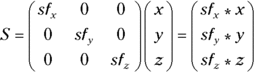

# Introduction

**WHEN I WAS** 10 years old, one of my teachers sat me down in front of
a computer at school. Now, this isn’t what you think. I wasn’t about to
be inducted into the mysteries of computer programming, even though it
was a BBC Micro (the most programmable and arguably the most
architecturally sophisticated of the British 8-bit microcomputers, on
which I would subsequently cut my teeth in BASIC and assembly language).
Instead, I was faced with a half-hour barrage of multiple choice
questions about my academic interests, hobbies and ambitions, after
which the miraculous machine spat out a diagnosis of my ideal future
career: microelectronic chip designer.

This was a bit of a puzzler, not least because what I really wanted to
be was a computer game programmer (okay, okay, astronaut) and there was
nobody in my immediate environment who had any idea what a 10-year-old
should do to set him on the path to the sunlit uplands of
microelectronic chip design. Over the next few years, I studied a *lot*
of maths and science at school, learned to program (games) at home,
first on the BBC Micro and then the Commodore Amiga, and made repeated,
not particularly successful, forays into electronics. As it turned out,
and more by luck than judgment, I’d happened on a plausible road to my
destination, but it wasn’t until I arrived at Cambridge at the age of 18
that I started to figure out where the gaps were in my understanding.

## Cambridge

Cambridge occupies a special place in the history of computer science,
and particularly in the history of practical or applied computing. In
the late 1930s, the young Cambridge academic Alan Turing demonstrated
that the halting problem (the question “Will this computer program ever
terminate, or halt?”) was not computable; in essence, you can’t write a
computer program that will analyse another arbitrary computer program
and determine if it will halt. At the same time, working independently,
Alonzo Church proved the same result, which now shares their names: the
Church-Turing thesis. But it is telling that while Church took a purely
mathematical approach to his proof, based on recursive functions,
Turing’s proof cast computation in terms of sequential operations
performed by what we now know as *Turing machines*: simple gadgets that
walk up and down an infinite tape, reading symbols, changing their
internal state and direction of travel in response, and writing new
symbols. While most such machines are specialised to a single purpose,
Turing introduced the concept of the *universal* machine, which could be
configured via commands written on the tape to emulate the action of
*any* other special-purpose machine. This was the first appearance of a
now commonplace idea: the general-purpose programmable computer.

After the outbreak of the Second World War, Turing
would go on to play a central role in the Allied code-breaking effort at
Bletchley Park, where he was involved (as a member of a team—don’t
believe everything you see at the movies) in the development of a number
of pieces of special-purpose hardware, including the electromechanical
*bombe*, which automated the process of breaking the German Enigma
cipher. None of these machines used the specific “finite state automaton
plus infinite tape” architecture of Turing’s original thought
experiment; this turned out to be better suited to mathematical analysis
than to actual implementation. And not even the purely electronic
Colossus—which did to the formidably sophisticated Lorentz stream cipher
what the bombe had done to Enigma—crossed the line into general-purpose
programmability. Nonetheless, the experience of developing large-scale
electronic systems for code-breaking, radar and gunnery, and of
implementing digital logic circuits using thermionic valves, would prove
transformative for a generation of academic engineers as they returned
to civilian life.

One group of these engineers, under Maurice Wilkes at the University of
Cambridge’s Mathematical Laboratory, set about building what would
become the Electronic Delay Storage Automatic Calculator, or EDSAC. When
it first became operational in 1949, it boasted a 500kHz clock speed, 32
mercury delay lines in two temperature-controlled water baths for a
total of 2 kilobytes of volatile storage. Programs and data could be
read from, and written to, paper tape. Many institutions in the U.S. and
UK can advance narrow claims to having produced the first
general-purpose digital computer, for a particular value of “first”.
Claims have been made that EDSAC was the first computer to see
widespread use outside the team that developed it; academics in other
disciplines could request time on the machine to run their own programs,
introducing the concept of computing as a service. EDSAC was followed by
EDSAC II, and then Titan. It was only in the mid-1960s that the
University stopped building its own computers from scratch and started
buying them from commercial vendors. This practical emphasis is even
reflected in the current name of the computer department: Cambridge
doesn’t have a computer science faculty; it has a computer laboratory,
the direct descendant of Wilkes’ original mathematical laboratory.

This focus on the practical elements of computer engineering has made
Cambridge fertile ground for high-technology startups, many of them spun
out of the computer laboratory, the engineering department or the
various maths and science faculties (even our mathematicians know how to
hack), and has made it a magnet for multinational firms seeking
engineering talent. Variously referred to as the Cambridge Cluster, the
Cambridge Phenomenon or just Silicon Fen, the network of firms that has
grown up around the University represents one of the few bona fide
technology clusters outside of Silicon Valley. The BBC Microcomputer
that told me I should become a chip designer was a Cambridge product, as
was its perennial rival, the Sinclair Spectrum. Your cell phone (and
your Raspberry Pi) contains several processors designed by the
Cambridge-based chip firm ARM. Seventy years after EDSAC, Cambridge
remains the home of high technology in the UK.

## Cut to the Chase

One of the biggest missing pieces from my haphazard computing education
was an idea of how, underneath it all, my computer worked. While I’d
graduated downwards from BASIC to assembly language, I’d become “stuck”
at that level of abstraction. I could poke my Amiga’s hardware registers
to move sprites around the screen but I had no idea how I might go about
building a computer of my own. It took me another decade, a couple of
degrees and a move out of academia to work for Broadcom (a U.S.
semiconductor company that came to Cambridge for the startups and stayed
for the engineering talent) for me to get to the point where I woke up
one morning with “microelectronic chip designer” (in fact the fancier
equivalent, “ASIC architect”) on my business card. During this time,
I’ve had the privilege of working with, and learning from, a number of
vastly more accomplished practitioners in the field, including Sophie
Wilson, architect (with Steve Furber) of the BBC Micro and the original
ARM processor, and Tim Mamtora of Broadcom’s 3D graphics hardware
engineering team, who has graciously provided the chapter on graphics
processing units (GPUs) for this book.

To a great degree, my goal in writing this book was to produce the “how
it works” title that I wish I’d had when I was 18. We’ve attempted to
cover each major component of a modern computing system, from the CPU to
volatile random-access storage, persistent storage, networking and
interfacing, at a level that should be accessible to an interested
secondary school student or first-year undergraduate. Alongside a
discussion of the current state of the art, we’ve attempted to provide a
little historical context; it’s remarkable that most of the topics
covered (though not, obviously, the fine technical details) would have
been of relevance to Wilkes’ EDSAC engineering team in 1949. You should
reach the end with at least a little understanding of the principles
that underpin the operation of your computer. I firmly believe that you
will find this understanding valuable even if you’re destined for a
career as a software engineer and never plan to design a computer of
your own. If you don’t know what a cache is, you’ll be surprised that
your program’s performance drops off a cliff when your working set ends
up larger than your cache, or when you align your buffers so that they
exhaust the cache’s associativity. If you don’t know a little about how
Ethernet works, you’ll struggle to build a performant network for your
datacentre.

It’s worth dwelling for a moment on what this book isn’t, and what it
won’t tell you. It isn’t a comprehensive technical reference for any of
the topics covered. You could write (and people have written) whole
volumes on the design of caches, CPU pipelines, compilers and network
stacks. Instead, we try to provide a primer for each topic, and some
suggestions for further study. It is concerned primarily with the
architecture of conventional general-purpose computers (in essence,
PCs). There is limited coverage of topics like digital signal processing
(DSP) and field-programmable gate arrays (FPGAs), which are primarily of
interest in special purpose, application-specific domains. Finally,
there is little coverage of the quantitative decision-making process
that is the heart of good computer architecture: how do you trade off
the size of your cache against access time, or decide whether to allow
one subsystem coherent access to a cache that forms
part of another component? We can’t teach you to think like an
architect. For the advanced reader, Hennessy and Patterson’s *Computer
Architecture: A Quantitative Approach* remains an indispensable
reference on this front.

## The Knee in the Curve

With that last disclaimer in mind, I’d like to share a couple of guiding
principles that I have found useful over the years.

In computer architecture, as in many things, there is a law of
diminishing returns. There are, of course, hard limits to what can be
accomplished at any given moment, whether in terms of raw CPU
performance, CPU performance normalised to power consumption, storage
density, transistor size, or network bandwidth over a medium. But it is
often the case that well before we reach these theoretical limits we
encounter diminishing returns to the application of engineering effort:
each incremental improvement is increasingly hard won and exacts a
growing toll in terms of cost and, critically, schedule. If you were to
graph development effort, system complexity (and thus vulnerability to
bugs) or cash spent against performance, the curve would bend sharply
upward at some point. To the left of this “knee”, performance would
respond in a predictable (even linear!) fashion to increasing
expenditure of effort; to the right, performance would increase only
slowly with added effort, asymptotically approaching the “wall” imposed
by fundamental technical limitations.

Sometimes there is no substitute for performance. The Apollo lunar
project, for example, was an amazing example of engineering that was so
far to the right of the “knee” (powered by the expenditure of several
percent of the GDP of the world’s largest economy) that it fundamentally
misled onlookers about the maturity of aerospace technology. It is only
now—after 50 years of incremental advances in rocketry, avionics and
material science—that the knee has moved far enough to permit access to
space, and maybe even a return to the Moon, at reasonable cost.
Nonetheless, I have observed that teams that have the humility to
accurately locate the knee bring simple, conservatively engineered
systems to market in a timely fashion and then iterate rapidly, tend to
win over moon-shot engineering.

Conservatism and iteration are at the heart of my own approach to
architecture. The three generations of Raspberry Pi chips that we’ve
produced to date use *exactly* the same system infrastructure, memory
controller and multimedia, with changes confined to the ARM core
complex, a small number of critical bug fixes and an increase in clock
speed. There is a tension here: engineers (myself included) are
enthusiasts and want to push the boundaries. The job of a good architect
is to accurately assign a cost to the risks associated with radical
change, and to weigh this against the purported benefits.

## Forward the Foundation

We founded the Raspberry Pi Foundation in 2008, initially with the
simple aim of addressing a collapse in the number of students applying
to study Computer Science at Cambridge. We’re seeing encouraging signs
of recovery, both at Cambridge and elsewhere, and applicant numbers are
now higher than they were at the height of the dotcom boom in the late
1990s.

Perhaps the most striking aspect of the change we’ve witnessed is that
the new generation of young people is far more interested in hardware
than we were in the 1980s. Writing an assembly language routine to move
a sprite around on the screen clearly isn’t quite as much fun as it used
to be, but moving a robot around the floor is much more exciting. We see
12-year-olds today building control and sensing projects that I would
have been proud of in my mid-20s. My hope is that when some of these
young people sit down in front of the distant descendants of the BBC
Micro careers program of my childhood, some of them will be told that
they’d make great microelectronic chip designers, and that this book
might help one or two of them make that journey.

—Eben Upton, Cambridge, May 2016

Chapter 1

# The Shape of a Computer Phenomenon

**THAT OLD SAYING** about good things coming in small packages describes
the Raspberry Pi perfectly. It also highlights an advance in computer
architecture—the system-on-a-chip (SoC), a tiny package with a rather
large collection of ready-to-use features. The SoC isn’t so new—it’s
been around a long time—but the Raspberry Pi’s designers have put it
into a small, powerful package that is readily available to students and
adults alike. All for a very low price.

A tiny piece of electronics about the size of a credit card, the
Raspberry Pi single-board computer packs very respectable computing
power into a small space. It provides tons of fun and many, many
possibilities for building and controlling all sorts of fascinating
gizmos. When something is small, after all, it fits just about anywhere.
The Raspberry Pi does things conventional computers just can’t do in
terms of both portability and connectivity. Things you will find inspire
your creativity—fun things!

What’s not to like? Get ready for some truly exciting computer
architecture.

In this chapter introducing the truly phenomenal Raspberry Pi line of
computer boards, we look first at the Raspberry Pi’s goals and history.
We include the history of the Raspberry Pi’s development and the
visionary people at the Raspberry Pi Foundation who dreamed up the
concept and achieved the reality, and we look at the advantages this
tiny one-board computer has over much larger computers. We then take a
tour of the Raspberry Pi board.

## Growing Delicious, Juicy Raspberries

As significant advances in computing go, the Raspberry Pi’s primary
innovation was the lowering of the entry barrier into the world of
embedded Linux. The barrier was twofold—price and complexity. The Raspberry Pi’s low price solved the
price problem (cheap is good!) and the SoC reduced circuit complexity
rather dramatically, making a much smaller package possible.

The road to the development of the Raspberry Pi originated at a
surprising point—through a registered charity in the UK, which continues
to operate today.

The Raspberry Pi Foundation, registered with the Charity Commission for
England and Wales, first opened its doors in 2009 in Caldecote,
Cambridgeshire. It was founded for the express purpose of promoting the
study of computer science in schools. A major impetus for its creation
came from a team consisting of Eben Upton, Rob Mullins, Jack Lang and
Alan Mycroft. At the University of Cambridge’s Computer Laboratory, they
had noted the declining numbers and low-level skills of student
applicants. They came to the conclusion that a small, affordable
computer was needed to teach basic skills in schools and to instill
enthusiasm for computing and programming.

Major support for the Foundation’s goals came from the University of
Cambridge Computer Laboratory and Broadcom, which is the company that
manufactures the SoC—the Broadcom 2835 or 2836, depending on the
model—that enables the Raspberry Pi’s power and success. Later in this
chapter you will read more on that component, which is the heart and
soul of the Raspberry Pi.

The founders of the Raspberry Pi had identified and acted on the
perceived need for a tiny, affordable computer. By 2012, the Model B had
been released at a price of about £25. The fact that this represented
great value for money was recognised immediately, and first-day sales
blasted over 100,000 units. In less than two years of production, more
than two million boards were sold.

The Raspberry Pi continued to enjoy good sales and wide acceptance
following the highly successful release of the Model B+ (in late 2014).
And in 2015, the fast, data-crunching Raspberry Pi 2 Model B with its
four-core ARM processor and additional onboard memory sold more than
500,000 units in its first two weeks of release. Most recently, the
Raspberry Pi Zero, a complete computer system on a board for £4—yes,
£4—was released. It’s an awesome deal if you can get one—the first batch
sold out almost immediately.

In 2016, the Raspberry Pi Model 3 Model B arrived. It sports a 1.2GHz
64-bit quad-core ARMv8 CPU, 1 GB RAM, and built-in wireless and
Bluetooth! All for the same low price.

The original founders of the Raspberry Pi Foundation included:

-   Eben Upton
-   Rob
    Mullins
-   Jack Lang
-   Alan
    Mycroft
-   Pete Lomas
-   David
    Braben

The organisation now consists of two parts:

-   Raspberry Pi
    (Trading) Ltd. performs engineering and sales, with Eben Upton as
    CEO.
-   The Raspberry Pi
    Foundation is the charitable and educational part.

The Raspberry Pi Foundation’s website at [`www.raspberrypi.org`](https://www.raspberrypi.org)
(see <a href="#04_9781119183938-ch01.xhtml#c01-fig-0001"
id="04_9781119183938-ch01.xhtml#rc01-fig-0001">Figure 1-1</a>) presents
the impetus that resulted in the Raspberry Pi. This is what they say on
the About Us page:

> 
>
> *The idea behind a tiny and affordable computer for kids came in 2006,
> when Eben Upton, Rob Mullins, Jack Lang and Alan Mycroft, based at the
> University of Cambridge’s Computer Laboratory, became concerned about
> the year-on-year decline in the numbers and skills levels of the A
> Level students applying to read Computer Science. From a situation in
> the 1990s  class="pagebreak" title="10">where most of the kids applying
> were coming to interview as experienced hobbyist programmers, the
> landscape in the 2000s was very different; a typical applicant might
> only have done a little web design.*

 The Raspberry
Pi official website](./media/images/9781119183938-fg0101.png)

As a result, the founders’ stated goal was “to advance the education of
adults and children, particularly in the field of computers, computer
science and related subjects”.

Their answer to the problem, of course, was the Raspberry Pi, which was
designed to emulate in concept the hands-on appeal of computers from the
previous decade (the 1990s). The intention behind the Raspberry Pi was
to be a “catalyst” to inspire students by providing affordable,
programmable computers everywhere.

The Raspberry Pi is well on its way to achieving the Foundation’s goal
in bettering computer education for students. However, another
significant thing has happened; a lot of us older people have found the
Raspberry Pi exciting. It’s been adopted by generations of hobbyists,
experimenters and many others, which has driven sales into new millions
of units.

While the sheer compactness of the Raspberry Pi excites, resonates and
inspires adults as well as youngsters, what truly prompted its success
was its low price and scope of development. Embedded Linux has always
been a painful subject to learn, but the Pi makes it simple and
inexpensive. Continuing education in computers gets just as big a boost
as initial education in schools.

## System-on-a-Chip

An SoC or system-on-a-chip is an integrated circuit (IC) that has the
major components of a computer or any other electronic system on a
single chip. The components include a central processing unit (CPU), a
graphics processing unit (GPU) and various digital, analogue and mixed
signal circuits on just one chip.

This SoC component makes highly dense computing possible, such as all
the power that is shoehorned into the Raspberry Pi.
<a href="#04_9781119183938-ch01.xhtml#c01-fig-0002"
id="04_9781119183938-ch01.xhtml#rc01-fig-0002">Figure 1-2</a> shows the
Crodcom chip on the Raspberry Pi 2 Model B. It’s a game-changing advance
in computer architecture, enabling single-card computers that rival and
often exceed the capabilities of machines that are many times their
size. [Chapter 8](#11_9781119183938-ch08.xhtml), “Operating Systems”,
covers these small but mighty chips in detail.

 Broadcom chip
on the Raspberry Pi 2 Model B](./media/images/9781119183938-fg0102.png)

The Raspberry Pi features chips that are developed and manufactured by
Broadcom Limited. Specifically, the older models as well as the latest
(the £4 Raspberry Pi Zero) come with the Broadcom BCN2835 and the
Raspberry Pi 2 has the Broadcom BCM2836, and the new Model 3 uses the
Broadcom BCM2837. The biggest difference between these two SoC ICs is
the replacement of the single-core CPU in the BCM2835 with a four-core
processor in the BCM2836. Otherwise, they have essentially the same
architecture.

Here’s a taste of the low-level components,
peripherals and protocols provided by the Broadcom SoCs:

-   **CPU:** Performs
    data processing under control of the operating system (a CPU with a
    single core on most of the Raspberry Pi models and a CPU with four
    cores on the Raspberry Pi 2 and Raspberry Pi 3).
-   **GPU:** Provides
    the operating system desktop.
-   **Memory:**
    Permanent memory used as registers for CPU and GPU operation,
    storage for bootstrap software, the small program which starts the
    process of loading the operating system and activating it.
-   **Timers:** Allow
    software to be time-dependent for scheduling, synchronising and so
    on.
-   **Interrupt
    controller:** Interrupts allow the operating system to control all
    the computer resources, know when the CPU is ready for new
    instructions and much more (this is covered in [Chapter
    8](#11_9781119183938-ch08.xhtml)).
-   **General purpose
    input output (GPIO):** Provides layout and enables control of
    connections, input, output and alternative modes for the GPIO pins
    that enable the Raspberry Pi to manage circuits, devices, machines
    and so on. In short, it turns the Raspberry Pi into an embeddable
    control system.
-   **USB:** Controls
    the USB services and provides the Universal Serial Bus protocols for
    input and output, thus allowing peripherals of all types to connect
    to the Raspberry Pi’s USB receptacles.
-   **PCM/I2S:**
    Provides pulse code modulation (PCM, which converts digital sound to
    analogue sound such as speakers and headphones require) and known as
    Inter-IC Sound, Integrated Interchip Sound, or IIS, a high-level
    standard for connecting audio devices).
-   **Direct memory access (DMA) controller:** Direct
    memory access control that allows an input/output device to bypass
    the CPU and send or receive data directory to the main memory for
    purposes of speed and efficiency.
-   **I2C
    master:** Inter-integrated circuit often employed for connecting
    lower-speed peripheral chips to control processors and
    microcontrollers.
-   **I2C/SPI
    (Serial Peripheral Interface) slave:** The reverse of the preceding
    bullet point. Allows outside chips and sensors to control or cause
    the Raspberry Pi to respond in certain ways; for example, a sensor
    in a motor detects it’s running hot and the controller chip causes
    the Raspberry Pi to make a decision on whether to reduce the motor’s
    speed or stop it.
-   **SPI
    Interface:** Serial interfaces, accessed via the GPIO pins and
    allowing the daisy chaining of several compatible devices by the use
    of different chip-select pins.
-   **Pulse width
    modulation (PWM):** A method of generating an analogue waveform from
    a digital signal.
-   **Universal
    asynchronous receiver/transmitter (UART0, UART1):** Used for serial
    communication between different devices.

## An Exciting Credit Card-Sized Computer

Just how powerful is the Raspberry Pi compared to a desktop PC?
Certainly, it has far more computational ability, memory and storage
than the first personal computers. That said, the Raspberry Pi cannot
match the speed, high-end displays, built-in power supplies and
hard-drive capacity of the desktop boxes and laptops of today.

However, you can easily overcome any disadvantages by hanging the
appropriate peripherals on your Raspberry Pi. You can add large hard
drives, 42-inch HDMI screens, high-level sound systems and much more.
Simply plug your peripherals into the USB receptacles on the board or
via other interfaces that are provided, and you’re good to go. Finish it
off by clicking an Ethernet cable into the jack on the Raspberry Pi or
sliding in a wireless USB dongle, and worldwide connectivity goes live.

You can duplicate most features of conventional computers when you
attach peripherals to a Raspberry Pi, such as in
<a href="#04_9781119183938-ch01.xhtml#c01-fig-0003"
id="04_9781119183938-ch01.xhtml#rc01-fig-0003">Figure 1-3</a>, and you
also gain some distinct advantages over large computers, including:

-   The Raspberry Pi
    is *really* cheap—£25 retail or just £4 for the Raspberry Pi
    Zero.
-   It’s *really*
    small—all models are credit-card sized or smaller.
-   You can replace the operating system in seconds
    simply by inserting a new SD or microSD card for almost instant
    reconfiguration.
-   The Broadcom SoC
    gives the Raspberry Pi more interfaces, communications protocols and
    other features out of the box than conventional computers that sell
    for many times the price.
-   The GPIO pins
    (see <a href="#04_9781119183938-ch01.xhtml#c01-fig-0004"
    id="04_9781119183938-ch01.xhtml#rc01-fig-0004">Figure 1-4</a>) allow
    the Raspberry Pi to control real-world devices that have no other
    method of computer input/output.

 Peripherals
attached to a Raspberry Pi 2 Model
B](./media/images/9781119183938-fg0103.png)

 GPIO pins
enable control of real world
devices.](./media/images/9781119183938-fg0104.png)

## What Does the Raspberry Pi Do?

The Raspberry Pi excels as the brains for all sorts of projects. Here
are some examples randomly picked from the many thousands of documented
projects on the Internet. This list may inspire you in choosing some
projects of your own:

-   Home
    automation
-   Home
    security
-   Media
    centre
-   Weather
    station
-   Wearable
    computer
-   Robot
    controller
-   Quadcopter
    (drone) controller
-   Web server
-   Email
    server
-   GPS
    tracker
-   Web camera
    controller
-   Coffee
    maker
-   Ham radio
    EchoLink server and JT65 terminal
-   Electric motor
    controller
-   Time-lapse
    photography manager
-   Game
    controller
-   Bitcoin
    mining
-   Automotive
    onboard computer

This list just scratches the surface of possible uses for the Raspberry
Pi. There’s not enough room to list everything you could do, but this
book gives you the information you need to come up with your own ideas.
Let your own desires, interests and imagination guide you. The Raspberry
Pi does the rest.

## Meeting and Greeting the Raspberry Pi Board

This section begins with an introduction to the features, components and
layout of the Raspberry Pi board. We show contrasts between the various
models but with an emphasis on the Raspberry Pi 2. Reading this section
and examining the Raspberry Pi board is like looking at a map before
setting off on a journey—it gives you the lay of the land. If you know
where the various important parts of the board are and how they work, it
makes imagining and creating projects a lot easier because you
understand the board better.

We begin with the Raspberry Pi 2 Model B (there was no Model A in the 2
series or the new 3 series). After introducing you to the Raspberry Pi
2, we’ll look at the other versions, including the Raspberry Pi 3 Model,
which includes more processor speed, onboard Wi-Fi and Bluetooth.

If you want to follow along with your own board,
orient it as shown in
<a href="#04_9781119183938-ch01.xhtml#c01-fig-0005"
id="04_9781119183938-ch01.xhtml#rc01-fig-0005">Figure 1-5</a>, with the
two rows of GPIO pins at the upper left.

### GPIO Pins

The GPIO pins—the row of pins at the top of the board as it’s oriented
in [Figure 1-5](#04_9781119183938-ch01.xhtml#c01-fig-0005)—perform magic
in tying the Raspberry Pi to the real world. Through these pins, you
program the Raspberry Pi to control all sorts of devices. [Chapter
12](#15_9781119183938-ch12.xhtml), “Input/Output”, looks at programming
the Raspberry Pi and helps you understand inputs and outputs and shows
methods of controlling various devices. Let’s examine these pins and get
an understanding of how simple and powerful they are.

 The Raspberry
Pi 2 board with the GPIO pins at the upper
left](./media/images/9781119183938-fg0105.png)

Real-world devices—doorbells, light bulbs, model aircraft controls, lawn
mowers, robots, thermostats, electric coffeepots and motors of all
sorts, to name a few things—cannot normally connect to a computer or
follow its orders. Through GPIO, the Raspberry Pi can do neat stuff with
these real-world objects! That’s why we’re emphasising the GPIO pins;
the pins enable you to do things with the Raspberry Pi that you can’t do
with conventional computers.

<aside>

------------------------------------------------------------------------

NOTE

Being able to interface with real-world devices is not a distinction
that’s unique to the Raspberry Pi; embedded computers are able to bridge
this gap whereas conventional computers can’t.

</aside>

We have 40 pins—two rows of 20. The bottom row of pins (left to right)
consists of odd numbers: 1, 3, 5, 7, 9, 11, 13, 15, 17, 19, 21, 23, 25,
27, 29, 31, 33, 35, 37 and 39. The top are numbered 2, 4, 6, 8, 10, 12,
14, 16, 18, 20, 22, 24, 26, 28, 30, 32, 34, 36, 38 and 40.

These pins are programmable; you can even change the layout of most of
the pins! The power pins cannot be rerouted.

When you add simple external circuits, it becomes possible for the
Raspberry Pi to switch all sorts of things on or off. It can also sense
input from devices and respond accordingly. Thanks to the Raspberry Pi’s
ability to communicate in various ways—such as by wireless, by Bluetooth
or on the Internet—inputs and outputs do not even have to be local. With
some additional hardware, you can control devices, programs and so forth
from anywhere in the world.

<aside>

------------------------------------------------------------------------

NOTE

Read [Chapter 12](#15_9781119183938-ch12.xhtml) to learn about the
several modes of operation for GPIO pins. The majority of the pins can
be input, output or one of six special modes.

</aside>

### Status LEDs

The status light-emitting diodes (LEDs) are to the lower left of the
GPIO pins. These tiny babies put out a good deal of light. On the
Raspberry Pi 2, they are labelled (from top to bottom) PWR (power) and
ACT (activity); PWR lights red and ACT lights green.

Whenever power is present to the board (that is, a micro USB plug
provides 5 volts direct current (VDC) from a USB source or a wall
adapter), the PWR light glows red. The ACT LED indicates that a microSD
card is available, and only lights up when the Raspberry Pi accesses the
card.

The Model B+ has the same arrangement as on the Model
B except that the LED status lights are located on the opposite side of
the board, and there are five LEDs:

-   **ACT**
    (activity, green): Indicates an SD card is plugged in and
    accessible
-   **PWR** (power,
    red): Indicates power is present
-   **FDX** (full
    duplex, green): Indicates a full duplex local area network (LAN) is
    connected
-   **LNK** (link,
    flashing green): Indicates activity is happening on the LAN
-   **100** (yellow):
    Indicates a 100-Mbit/s LAN is connected (as opposed to a 10-Mbit
    network)

With the Model B+, the last three LEDs functions were moved to the
Ethernet jack, with the FDX and 100 being combined into one LED. So
flashing green on the jack shows network activity on the right LED and
either solid green or yellow on the left, showing a 10-Mbits/s (megabits
per second) or 100-Mbits/s network connections, respectively.

<aside>

------------------------------------------------------------------------

NOTE

All the Raspberry Pi models actually have five status lights; it’s just
that on the B+ and Raspberry Pi 2 there are two LEDs (PWR and ACT) on
one side of the board, and the network indicators are on the other side
as part of the Ethernet jack.

</aside>

The status LEDs give you a quick picture of what transpires on your
Raspberry Pi board, especially during the boot-up process. It goes like
this:

1.  When you plug in
    the microUSB connector (there’s no on/off switch), the PWR LED
    lights red to show that power is present. The PWR LED stays lit so
    long as power is flowing to the board.
2.  The ACT LED
    flashes green a couple of times or so, indicating an SD card is
    present and readable. After boot-up, this green light flashes
    whenever SD card access occurs.
3.  As the
    powering-up process continues, the green light on the right of the
    Ethernet jack (Model B+ and later) come on if a network is present.
    The light flashes whenever there is traffic on the network. The left
    LED flashes green for a slow network and is solid yellow if you are
    connected to a 100Mbit/s network.

So, at a glance, the status LEDs tell us the board has power, the SD
card is working and the network is active.

### USB Receptacles

On the right-hand side of the board are the Raspberry PI 2 Model B’s
four USB 2.0 ports, as shown in
<a href="#04_9781119183938-ch01.xhtml#c01-fig-0006"
id="04_9781119183938-ch01.xhtml#rc01-fig-0006">Figure 1-6</a>.

 USB 2.0 ports
and Ethernet port](./media/images/9781119183938-fg0106.png)

<aside>

------------------------------------------------------------------------

NOTE

The ports appear in the same way on the Model B+ but the older Model B
provides only two USB receptacles.

</aside>

USB receptacles—or ports, as some people incorrectly call them—allow you
to plug in and run a keyboard, mouse and all sorts of other devices—even
big hard drives!

### Ethernet Connection

All sorts of Raspberry Pi tasks require a connection to both your local
network and the Internet itself. Upgrading the operating system and the
Raspberry Pi’s firmware requires Internet access. Networking is a
necessity for downloading and installing programs, web surfing, using
the Raspberry Pi as a media centre to deliver movies to your humungous
flat-screen TV and many more reasons.

Fortunately, you have two ways of achieving network connectivity with
the Raspberry Pi. The first is a wired connection using the Ethernet
socket on the lower-right corner (as the board is oriented in [Figure
1-5](#04_9781119183938-ch01.xhtml#c01-fig-0005)). Refer to [Figure
1-6](#04_9781119183938-ch01.xhtml#c01-fig-0006) to see what this socket
looks like.

The second way of connecting involves the USB
receptacles. You can use a wireless USB dongle (a dongle being a plug-in
device) or a USB-to-Ethernet adapter. If you use the latter method, you
can connect the Raspberry Pi to more than one network. One reason for
doing this would be a typical server setup where the Raspberry Pi
connects to both the Internet and a more secure local network. Using
Raspbian, for example, you can turn your Raspberry Pi into a classic
LAMP (standing for Linux, Apache, mySQL, PHP) server. The Raspberry Pi
serves up websites with database back ends and so on, just like on much
larger servers using the same software.

Using a wireless USB dongle comes in handy if you want your Raspberry Pi
to be portable. With an external battery power supply and wireless
access, you can carry it anywhere! Or at least anywhere with wireless
access, which is true of more and more places these days.

### Audio Out

On the bottom of the board is the 3.5 millimetre (mm) audio input/output
jack (see <a href="#04_9781119183938-ch01.xhtml#c01-fig-0007"
id="04_9781119183938-ch01.xhtml#rc01-fig-0007">Figure 1-7</a>). Here you
can plug in headphones, a computer sound card, speakers or anything
thing else that takes and plays audio input.

<aside>

------------------------------------------------------------------------

NOTE

The Model A and Model B did not have this feature but instead had
separate connectors for video and audio.

</aside>

The plug that goes into the socket on the Raspberry Pi board is a
four-pole plug—in this case, a tip with three rings. However, it also
accepts and works with a standard three-pole mini plug like those often
found on headphones and computer speakers.

<aside>

------------------------------------------------------------------------

NOTE

Poles are the tip and rings of conductors. Four-pole had a tip and three
rings; three-pole a tip and two rings.

</aside>

[Figure 1-7](#04_9781119183938-ch01.xhtml#c01-fig-0007) shows how the
connector appears on the Model B+ and later, and
<a href="#04_9781119183938-ch01.xhtml#c01-fig-0008"
id="04_9781119183938-ch01.xhtml#rc01-fig-0008">Figure 1-8</a> shows the
connector’s wiring.

 The audio
output socket](./media/images/9781119183938-fg0107.png)

 Connector for
audio socket](./media/images/9781119183938-fg0108.png)

Another of the Raspberry Pi limitations concerns quality of sound. The
audio out from this connector is 11-bit (for truly good sounding music
you’d want 16-bit). The High-Definition Multimedia Interface (HDMI)
connector, which is described later in this chapter, has better audio
but, of course, you have to have an HDMI device (like a big-screen TV)
that has good speakers attached.

No worries, folks—like the limitations in Raspberry Pi power, solutions
abound. For example, Adafruit sells a USB audio adapter, which works on
the Raspberry Pi, for a very low price. It puts out better sound and
allows for microphone input as well. This lets you use the Pi as a voice
or music recorder or teach it to work via voice commands. Various
computer soundboards designed specifically for the Raspberry Pi are also
available

Even better, you can obtain high-quality sound using the I2S
interface into an external digital-to-analogue convertor (DAC). [Chapter
11](#14_9781119183938-ch11.xhtml), “Audio”, covers all that good stuff.

### Composite Video

Using the same 3.5mm socket described in the last section, old-style
composite video is also available.

When it boots up and finds a composite video device attached, the
Raspberry Pi attempts to select the right resolution. Mostly it gives a
usable display but sometimes it gets things wrong.

Having video composite output may seem old school in light of the modern
era’s profusion of HDMI devices hanging off every wall, but it fits in
with the design philosophy Raspberry Pi Foundation co-founder Eben Upton
recently described. He said, “It’s a very cheap Linux PC device in the
spirit of the 1980s, a device which turns your TV into a computer; plug
in to TV, plug a mouse and a keyboard in, give it some power and some
kind of storage, an operating system and you’ve got a PC”.

### CSI Camera Module Connector

Camera modules for the Raspberry Pi give you 5-megapixel stills and 1080
high-definition video for about £16. The Camera Serial Interface (CSI)
connector shown in <a href="#04_9781119183938-ch01.xhtml#c01-fig-0009"
id="04_9781119183938-ch01.xhtml#rc01-fig-0009">Figure 1-9</a> (located
between the HDMI socket and the 3.5mm audio socket) provides a place to
plug the camera module into the Pi.

 CSI and HDMI
connectors](./media/images/9781119183938-fg0109.png)

CSI connects the camera module via a 15-conductor flat flex cable.
Getting this cable connected and the camera module working is a bit
tricky sometimes. You can find a how-to video on the Raspberry Pi
website at [`https://www.raspberrypi.org/help/camera-module-setup/`](https://www.raspberrypi.org/help/camera-module-setup/).

However, after the cable sits in the socket properly, the camera works
great. You can program it to do all sorts of neat stuff, such as take
time-lapse photos and motion-triggered shots or record video footage.

### HDMI

There’s nothing as fine as a nice big display showing the colourful
graphical user interface (GUI) of the Raspberry Pi. A display enables
you to surf the web, watch videos, play games—all the stuff you expect a
computer to do. The best solution for that involves HDMI.

High-Definition Multimedia Interface (HDMI) allows the transfer of video
and audio from an HDMI-compliant display controller (in our case, the
Raspberry Pi) to compatible computer monitors, projectors, digital TVs
or digital audio devices.

HDMI’s higher quality provides a marked advantage over composite video
(such as what comes out of the audio socket on the Raspberry Pi board).
It’s much easier on the eyes and provides higher resolution instead of
composite video’s noisy and sometimes distorted video.

The HDMI connector on the Raspberry Pi Model B is approximately centred
on the lower edge of the Raspberry Pi board (as we have it positioned in
[Figure 1-5](#04_9781119183938-ch01.xhtml#c01-fig-0005)). See [Figure
1-9](#04_9781119183938-ch01.xhtml#c01-fig-0009) for what it looks like.

### Micro USB Power

The micro USB power connector is on the bottom left edge of the
Raspberry Pi, as shown in
<a href="#04_9781119183938-ch01.xhtml#c01-fig-0010"
id="04_9781119183938-ch01.xhtml#rc01-fig-0010">Figure 1-10</a>.

 Micro USB
connector used for obtaining
power](./media/images/9781119183938-fg0110.png)

The micro USB adapter brings power into the Raspberry Pi board. You
might know that most smartphones use this connector type, which means
you can find usable cables and wall adapters all over the place. (This
is one example of how the Raspberry Pi Foundation takes users’ need for
inexpensive operation into consideration.)

<aside>

------------------------------------------------------------------------

NOTE

You can also get a mobile version of a micro USB charging cable with an
automotive power adaptor so you can power your Raspberry Pi in a car,
using the built-in car power socket.

</aside>

The micro USB cable supplies 5VDC to the Raspberry Pi at about 1 ampere
(1A) of current for the model B. Some recommendations for the B+ mention
1.5A, but if you’re pushing heavy current through the USB ports
(remember, four instead of two on the B+ and later), a 2A supply is
smarter. For the Raspberry Pi 2, get at least a 2.4A supply.

Remember, there’s no switch for turning the Raspberry Pi on and off
(another saving to keep the price down). You just plug and unplug the
micro USB connector. Of course, with a bit of tinkering and soldering,
you could add a switch to the power cable easily enough.

### Storage Card

Applying power to the Raspberry Pi causes a bit of computer code stored
on the board, the bootloader, to check for the presence of the SD or (in
newer Raspberry Pi versions) microSD card in its slot (see
<a href="#04_9781119183938-ch01.xhtml#c01-fig-0011"
id="04_9781119183938-ch01.xhtml#rc01-fig-0011">Figure 1-11</a>) and look
for code on the card telling it how to start and what to load into its
RAM. If no card is there or that card has no information on it (because
it’s blank or corrupted) the Raspberry Pi does not start. Read more on
the boot process in [Chapter 8](#11_9781119183938-ch08.xhtml).

 The micro SD
slot on the bottom side of the Raspberry Pi
2](./media/images/9781119183938-fg0111.png)

<aside>

------------------------------------------------------------------------

WARNING

*Do not* insert or remove an SD card while the Raspberry Pi has power
attached. Doing so has a very good chance of corrupting the SD card,
causing you to lose the data and programs on it.

</aside>

The usual minimum size recommended for earlier editions of the Raspberry
Pi was 8 gigabytes (8GB), although the original recommendation was 4GB.
However, a number of people on the Internet report using 32GB cards, and
at least one person even boasted of using a 128GB card. It seems,
though, that any card larger than 32GB, under Raspbian at least,
requires partitioning (using a software to specially format the SD).

Of course, you can hang just about any size of USB drive from one of the
USB receptacles, if you use an external power supply. A terabyte would
be a good start. The SD card is still needed to boot.

### DSI Display Connection

Just right of the SD card slot but on top of the board is the Display
Serial Interface (DSI) display connector. The DSI connector’s design
accommodates a flat 15-conductor cable that drives liquid crystal
display (LCD) screens.
<a href="#04_9781119183938-ch01.xhtml#c01-fig-0012"
id="04_9781119183938-ch01.xhtml#rc01-fig-0012">Figure 1-12</a> shows the
connector.

 DSI display
connection](./media/images/9781119183938-fg0112.png)

### Mounting Holes

It might seem minor, but the Model B+ and later models have four
mounting holes—those reinforced holes in the board. The Model B only has
two. Mounting holes come in handy when you want to secure the Raspberry
Pi inside a box or case with other devices.

When you add four standoff insulators, you can use these insulted holes
for fastening the board with screws to the standoffs to have a nice,
safe installation.

### The Chips

There are two large chips situated roughly on the centre of the left of
the board (when the board is oriented with the GPIO pins at the top
left; see <a href="#04_9781119183938-ch01.xhtml#c01-fig-0013"
id="04_9781119183938-ch01.xhtml#rc01-fig-0013">Figure 1-13</a>). The
larger one shown is the Broadcom BCM2835 or BCM2836 on the Raspberry Pi
2 or BCM2037 on the Raspberry Pi 3. The other chip provides the Ethernet
protocols for networking. You’ll find more information about the what
these systems-on-a-chip do in [Chapter
12](#15_9781119183938-ch12.xhtml).

 The SoC and
USB/Ethernet chips](./media/images/9781119183938-fg0113.png)

## The Future

From its inception, the guiding principle of the Raspberry Pi was to
enable and revolutionise the teaching of computer science by providing
affordable, accessible hardware. It is certainly achieving this goal
successfully through the widespread adoption of the Raspberry Pi as a
teaching tool in schools worldwide.

The inspiration and excitement young people find, the lessons they learn
and the experiments and projects they complete are significant. We are
seeing the birth of a new generation of computer experts.

Something else has also happened. Those of us from
prior generations—sometimes called “adults” and sometimes not—discovered
the Raspberry Pi. Millions of us enthusiastically explore its incredible
power and build various projects using its control functions. We, too,
are learning things from this tiny computer, which takes the term
“microcomputer” to a much smaller scale than those now-huge old
desktops. Consequently, we are setting an example for our children. If
adults can have so much fun with the Raspberry Pi, younger people
realise they can as well, and so they do.

So the Raspberry Pi not only inspires the younger, student generation;
it makes older generations better and more computer literate. That’s
quite a gift.

What happens next? The next great movement, already in progress, is the
Internet of Things. Using the Raspberry Pi, your refrigerator, your
car—just about every device you can think of—can become wireless and be
controlled by small, easily embedded computerised controls. More and
more people will continue to adopt and adapt the means of making this
automation a reality. With every new release, demand grows for the
Raspberry Pi and the things it can do.

In the next few years, computer architecture will continue to shrink
while it grows more capable. We yearn for a thumb drive–sized device
that has a 24-core CPU running at 15GHz with 10GB of fast memory and a
terabyte solid state drive, all on an SoC.

We anticipate that such a device will sport a purple Raspberry logo. It
won’t be long now. The future rushes toward us.

Chapter 2

# Recapping Computing

***NOTE: YOU MAY** already know the material in this chapter. Anyone
who’s taken any coursework in computing, or played around with computers
and programming on their own, has at least a modest grasp of what we
present here. This chapter is a broad and very high-level overview of
what computers do and what parts of the computer are used to do it.
You’ll know within a few pages whether it’s useful for you or not. If it
isn’t, feel free to skip directly to* [*Chapter*
*3*](#06_9781119183938-ch03.xhtml)*.*

Although we created computers to do calculations, computers are not
calculators. We’ve had calculators for a very long time. The abacus is
known to have been used by the Persians as early as 600 BCE, and it was
probably in use earlier than that. The precursor to the slide rule,
called “Napier’s Bones”, was invented by John Napier in 1617. The very
first mechanical calculator, the Pascaline, was invented by Blaise
Pascal in 1642—when he was only 19! Better and more elaborate mechanical
calculators were devised over the years until very recently, when
digital calculators shoved mechanical and analogue calculators onto
history’s high shelf.

Charles Babbage is usually credited with the idea of programmability in
calculation. He was too poor and his “analytical engine” too complex for
him to construct it in 1837, but his son built and demonstrated a more
modest version of the machine in 1888. However, it wasn’t until the
1930s that the ideas underlying modern computing began to be understood
fully. Alan Turing laid the theoretical groundwork for fully
programmable computers in 1936. In 1941, Konrad Zuse built a
programmable electromechanical computer, called the Z3 machine, that
understood binary encoding and floating point numbers. Zuse’s machine
was later proven to be “Turing complete”—that is, capable of
implementing Turing’s principles of general-purpose computing.

Zuse’s Z3 had been created to perform statistical analysis of the German
air force’s wing designs. World War II accelerated the development of
digital computers on many fronts, driven first by the need to calculate artillery
trajectories, and later to handle the complex mathematics used by the
developers of the nuclear bomb. By 1944, the Colossus computers at
Bletchley Park were in daily service aiding the cryptanalysis of German,
Italian and Japanese wartime ciphers.

Not all calculation is done in a single step, as are basic arithmetic
operations like addition and multiplication. Some calculation requires
iterative operations that run in sequence until some limiting condition
is reached. There are calculations so complex that the calculator must
inspect its own operations and results as it goes along, to determine
whether it has completed its job or must repeat some tasks or take up
new ones. This is where programmability comes in, and where a calculator
takes the fateful step away from calculation into true computing.

It’s this simple: computers are not calculators. Computers follow
recipes.

## The Cook as Computer

In some respects, we’ve been computing since long before we were
calculating. Homo sapiens broke away from the rest of the primate pack
through the ability to pass along knowledge verbally from one generation
to the next. Much of this transmitted knowledge was “how-to” in nature,
such as how to shape an axe head from a piece of stone. Following
step-by-step instructions is now such a pervasive part of life that,
most of the time, we don’t even realize we’re doing it. Watch yourself
work the next time you cook anything more complex than a toasted cheese
sandwich. You’re not just cooking. You’re computing.

### Ingredients as Data

All recipes begin with a list of ingredients. The list is very specific,
in terms of both the ingredients and their quantities: For example, the
ingredients for *carré d’agneau dordonnaise* are:

2 racks of lamb

½ cup shelled walnuts

1 small onion

1 3 oz can of liver pâté

½ cup bread crumbs

2 tablespoons parsley

1 tsp salt

2 tbsp lemon juice

½ tsp finely ground black pepper

The goal in cooking is to combine and process these
ingredients to make something that doesn’t already exist in your
refrigerator. In computing, there are also ingredients: text, numbers,
images, symbols, photos, videos and so on. A computer program can take
these ingredients and combine and process them into something new: a PDF
document, a web page, an e-book or a PowerPoint presentation.

Recipes are step-by-step instructions for going from the ingredients to
*carré d’agneau dordonnaise*. Some recipes may be absurdly simple, but
most are very explicit and usually done in a specified order:

1.  Remove the bones
    from both racks.
2.  Trim the fat off
    the meat.
3.  Finely chop the
    walnuts.
4.  Grate the
    onion.
5.  Stir the liver
    pâté until smooth.
6.  Beat the walnuts
    and onion into the pâté.
7.  Mix the
    breadcrumbs and parsley together.
8.  Season the
    stuffing mix with salt, lemon juice and pepper.

…and so on. Granted, you could grate the onion before you chopped the
walnuts; in many cases order doesn’t matter. However, it does matter
sometimes—you can’t beat the chopped walnuts into the pâté before you’ve
chopped the walnuts.

Just like recipes, computer programs are sequences of steps that start
at the beginning, do something with the data and then pause or stop
after all the steps have been performed. You can see simple programs
called scripts running in a terminal window on the Raspberry Pi as they
do exactly that: they start, they run and they stop when their job is
completed. You can see each step in the “recipe” scroll by as it is
performed.

With more complex programs, like word processors, the recipe isn’t as
linear and the steps aren’t reported onscreen. A word processor is a
little like a cook in a café. At the counter you ask for a lunch
special, the cook nods and then disappears into the heart of the kitchen
to put your meal together. When it’s done, the cook hands the lunch
special over the counter to you through the window and waits for another order. When
you’re not typing or selecting commands from the menu, a word processor
is like the cook waiting at the counter. When you type a character, the
word processor takes the character and integrates it with the current
document, then waits for another. Regardless of whether you can see the
steps happen, each time you type a character, a whole long list of
things happen in order, for example, to display the letter “y” at the
end of the word “Raspberry”.

### Basic Actions

In both recipes and computer programs, individual steps may contain
lists of other steps. The step of grating the onion, for example, is
performed in several, smaller steps: first you have to grab the onion in
one hand, then pick up the grater with the other hand, and then rub the
onion against the face of the grater while allowing the grated onion to
fall into a bowl.

In recipes, these internal steps are not called out every time. Most
people who have done some cooking know how to grate an onion, and
providing detailed directions for grating an onion is unnecessary.
However, you follow steps when you grate an onion, whether the steps are
spelled out explicitly in the recipe or not. This can happen only
because you, the cook, already knew how to grate an onion.

That’s an important point. Cooks use a large number of specific, named
actions to complete a recipe. Expert cooks know them all and they can
use them without explanation: peel, grate, mix, fold, zest, chop, dice,
sift, skim, simmer, bake and so on. Some of these actions are commoner
than others, while some—like acidulate—are used so rarely that recipes
typically do spell them out in simpler terms, in this case, “Add vinegar
or lemon juice to make the sauce more acidic”.

Computers, like cooks, understand a moderate list of fairly simple
actions. These simple actions are combined into larger and more complex
actions, which in turn are combined into complete operational programs.
The simple, basic steps that a computer understands are called *machine
instructions*. Machine instructions can be combined into more complex
actions called *subprograms*, *functions* or *procedures*. Here’s an
example of a machine instruction:

`MOV PlaceB, PlaceA`

The `MOV`</code>
instruction moves a single piece of data from one place to another place
inside the computer. Machine instructions may be combined into functions
that do a great deal more. Here, for example, is a function:

`capitalize(streetname)`

The `capitalize()` function does what you
probably expect: the name of a street is a short string of text
characters, which the previous statement in the program placed in a
named data item called `streetname`. The function capitalizes
the words within the street name according to standard rules for
capitalization. This is how a computer turns the text “garden of the
gods road” into “Garden of the Gods Road.” Inside the `capitalize()` function may be dozens or
hundreds of machine instructions, just as in a cooking task the
instruction to “reduce” involves a fair bit of fussy adding, simmering,
stirring and testing.

## The Box That Follows a Plan

That’s about as far as we can take the recipe metaphor, and perhaps a
little further than we should. Computers are indeed a little like cooks
following recipes. Cooks also improvise, try weird things and sometimes
make a mess. Computers don’t improvise unless we tell them to, and when
they make a mess it’s because we have made some kind of mistake, not
them. A metaphor that is closer to reality is author Ted Nelson’s
description of a computer as “a box that follows a plan”. A computer is
a box, and inside the box are the plan, the machinery that follows the
plan and the data upon which the plan acts.

### Doing and Knowing

One more metaphor and we’ll let it rest: programs are what a computer
*does* and data are what a computer *knows*. (This description is
credited to computer author Tom Swan.) The part that “does” is called
the *central processing unit* (CPU). The part that “knows” is called
*memory*. This “knowing” is done by encoding numbers, characters and
logical states using the binary numeric notation discovered by Gottfried
Leibniz in 1679. It wasn’t until 1937 that Claude Shannon systematized
the use of binary numbers into the maths and logic that computers use to
this day. A *bit* is a binary digit, an irreducible atom of meaning that
expresses either 1 or 0. As we explain a little later, bits are
represented in computers by on/off electrical states.

Today, both the CPU and memory are made out of large numbers of
transistors etched onto silicon chips. (A transistor is simply an
electrical switch made out of exotic metals called semiconductors.) This
wasn’t always the case; before silicon chips, computers were built out
of individual transistors and even vacuum tubes. (Zuse’s seminal Z3
machine used electromechanical relays.)

Whatever they were made of, early computers followed the general plan
shown in <a href="#05_9781119183938-ch02.xhtml#c02-fig-0001"
id="05_9781119183938-ch02.xhtml#rc02-fig-0001">Figure 2-1</a>. A central
control console monitored several different subsystems, each of which
was generally in its own cabinet or cabinets. There was the CPU, a
punched tape or magnetic tape storage unit and two different memory
units. One of the memory units held a series of machine instructions
that comprised a computer program. The other memory unit held the data
that the program manipulated. This is sometimes called the
Harvard architecture, because the Mark I, a very early electromechanical
computer developed at Harvard University in 1944, stored data and
instructions separately.

 A pre-von
Neumann computer](./media/images/9781119183938-fg0201.png)

Not only were the data memory and the instruction memory of the Mark I
physically separate, but they were also, generally, nothing like one
another. Data memory might consist of vacuum tubes, dots on a phosphor
screen or even sound pulses traveling through columns of mercury. (You
can read more on the evolution of memory in [Chapter
3](#06_9781119183938-ch03.xhtml).) Early instruction memory consisted of
rows of mechanical switches and wire jumpers that could be moved from
one point on a terminal bar to another. Technicians had to set each
individual machine instruction by hand, using switches or jumpers,
before the program could be run. (As you might imagine, there weren’t a
lot of machine instructions in early programs.)

### Programs Are Data

The protean genius John von Neumann worked in many different fields,
from mathematics to fluid dynamics, but computer people remember him for
a remarkable insight: that *programs are data* and should be stored in
the same memory system as data, using the same memory address space as
data. It took some work to redesign computers to read machine instructions from data memory but once it was done,
computing was changed forever. Instructions could be entered through a
single panel of switches and stored in data memory, one-by-one. Later
they could be written out from memory onto lengths of tape punched with
patterns of holes, so that they wouldn’t have to be entered by hand
every time they were run.

Von Neumann’s insight simplified computing greatly, and led straight to
the explosion of computer power that occurred during the 1950s.
<a href="#05_9781119183938-ch02.xhtml#c02-fig-0002"
id="05_9781119183938-ch02.xhtml#rc02-fig-0002">Figure 2-2</a> is a
highly simplified schematic of how modern computers operate. The figure
shows no particular model or family of computer, and omits many of the
more advanced features that we explain in later chapters.

 A simplified
modern computer](./media/images/9781119183938-fg0202.png)

### Memory

In the simplest possible terms, *system memory* is a long row of storage
compartments for data. Each location in the row has a unique numeric
*address*. All locations are the same size; in modern computers this is
generally the 8-bit byte (see
<a href="#05_9781119183938-ch02.xhtml#c02-fig-0003"
id="05_9781119183938-ch02.xhtml#rc02-fig-0003">Figure 2-3</a>). However,
computers read data from system memory in multi-byte chunks.
Thirty-two-bit systems like the Raspberry Pi access memory 32 bits (4
bytes, generally called a word) at a time, and perform most of their
internal operations on 32-bit quantities. In larger 64-bit desktops and
laptops, system memory is accessed 64-bits (8 bytes) at a time. Note
that nearly all modern computers allow operations to be performed on
single bytes or 2-byte *halfwords*, though there is sometimes a speed penalty for doing so. However, the
“bitness” of a computer is the size of its internal data word and
operations, *not* the size of individual memory locations.

 Memory
locations and their addresses](./media/images/9781119183938-fg0203.png)

Memory addresses are ordered in numeric sequence beginning with 0. There
is a little disconnect in having the first memory location at address 0
rather than 1, but think of number lines in mathematics, which start at
0. The maths of memory addresses is much easier when the addresses begin
at 0.

The CPU locates its data for reading and writing by using memory
addresses. It uses machine instructions to fetch data words from
specified addresses in the system memory and place them in its registers
for calculation or testing. It uses other machine instructions to write
values stored in its registers to the system memory.

As mentioned earlier, computer programs themselves are stored in system
memory, as sequences of machine instructions, each of which is (usually)
a single data word. The difference between a program file and a data
file lies almost entirely in how the CPU interprets the data in the
file.

Memory is a very complicated business, and we treat it in depth in
[Chapter 3](#06_9781119183938-ch03.xhtml).

### Registers

All CPUs contain a certain limited number of storage locations called
*registers*. Registers are right on the silicon of the CPU, and the
digital logic that executes machine instructions is not only near them but literally all around them. Each
register holds a single value. Some registers have no single job and can
be put to many different kinds of work. These *general-purpose
registers* are named or numbered. Other registers have special jobs
within the CPU. A few registers fall somewhere in between, in that they
have specific jobs to do when certain machine instructions are executed,
but in other cases may be used, like general- purpose registers, as a
sort of silicon shirt pocket where the CPU can tuck values that will be
needed again soon. Writing to registers and reading from them is
fast—faster than accessing any other type of memory, especially system
memory that lies outside the silicon on some other part of the
computer’s main circuit board.

There are many kinds of special-purpose registers. Some of the most
common are:

-   **Program
    counter:** A program counter register holds the address of the next
    machine instruction to be brought in from memory for execution. It
    “keeps the place” in a computer program.
-   **Status:** A
    status register (sometimes called a flags register) holds a value
    divided into single bits or groups of bits. Each bit or group is
    updated with the status of something the CPU has just done. When the
    CPU compares the values in two registers, a single-bit “equal” flag
    will be set to either 1 (if the values were equal) or 0 (if the
    values were not equal). This allows an instruction that follows the
    comparison to know which way the comparison went.
-   **Stack
    pointer:** A stack pointer holds an address in memory where a data
    structure called a last-in-first-out stack is stored. Stacks are
    fundamental to CPU operation; we describe them in more detail in
    [Chapter 4](#07_9781119183938-ch04.xhtml) in the section “[Inside
    the CPU](#07_9781119183938-ch04.xhtml#c04-sec-0009)”.
-   **Accumulator:**
    The accumulator is a register that holds the result of arithmetic
    and logical operations. (It is so named because it was used to
    accumulate intermediate values during calculations in very early
    computers.) In modern computers, no single register is the sole
    location for arithmetic results, and the accumulator’s job has been
    redistributed to some or all of the general-purpose registers.
    However, some older machine instructions assume that a single
    register will hold the results of their operations, which is why the
    term has survived.

The ARM11 processor at the heart of the original Raspberry Pi has a
total of 16 registers available to ordinary programs, of which three
have special jobs. An additional two registers act as status registers.
We have more to say about this in [Chapter
3](#06_9781119183938-ch03.xhtml).

Registers are “valuable” because they are inside the CPU itself and
therefore extremely fast. The more registers a CPU has, the less it must
access system memory to store intermediate results. A universal rule in
computing is that memory access is slow. A great deal of engineering has
been done in recent years to reduce the number of times system memory
must be accessed in order to get a given amount of work done.

### The System Bus

One of the fundamental challenges of computing is getting values between
system memory and the CPU as quickly as possible. Data values are stored
in memory at locations that have specific numeric addresses. To access a
value in the memory, the CPU must present the value’s address in the
memory to the memory system. The value will then be copied from memory
and sent back to the CPU.

There is a pathway between the CPU and memory called the *system bus*.
The system bus is a side-by-side group of electrical conductors called
*lines*, each of which carries one bit of information. The number of bus
lines varies depending on the type of computer and the chips it uses.
The system bus carries three things:

-   Memory
    addresses
-   Data
    values
-   Control signals
    that allow the CPU and system memory to coordinate traffic over the
    bus

In simple terms, the CPU places the address of a memory location on the
bus. It also places one or more signals on the control lines, to tell
the memory electronics whether the address is to be read from or written
to. The CPU then either places a value on the bus to be written to the
specified memory location, or waits for the system memory to place the
value at the specified address on the bus to be sent back to the CPU.

Computer programs and program data are stored in different locations in
memory but, except for how the CPU interprets them, there is no
difference between a data word and a machine instruction. For this
reason, the term “data values” embraces both data and instructions.
We’ll have more to say about this in the next two chapters.

### Instruction Sets

There are a host of different CPU models in the world. Each has its own
way of talking to memory and to other parts of the computer system. What
sets the models apart most clearly are the individual operations that
the CPU can perform. These are the machine instructions and, taken as a
group, they are called an *instruction set*.

An instruction set is specific to a specific family of CPUs. Intel’s
CPUs represent one such family; ARM is another. Most individual CPUs
understand only a single instruction set. The original Raspberry Pi’s
ARM11 processor actually has two instruction sets, though only one of
them is actually used by the Raspberry Pi software. (There will be more
on this in [Chapter 4](#07_9781119183938-ch04.xhtml).)

The machine instructions in an instruction set are
grouped by their general function: instructions that move data from or
to memory and between registers; instructions that perform arithmetic
calculations; instructions that perform logical operations; instructions
that read status bits or set control bits; and so on. Early CPUs might
have had as few as a dozen machine instructions. Modern CPUs can have a
hundred or more.

Although it’s useful to have a big-picture view of CPU instruction sets,
you don’t need to memorize them. Programmers rarely write programs by
stringing together machine instructions. (This is done sometimes, but
it’s slow, specialized work.) Instead, programmers write lists of action
statements that read more like human languages. These lists of action
statements are then given to programs that translate them into lists of
machine instructions. The translator programs are called *compilers* or
*interpreters*, depending on how they operate. We cover these in much
more detail in [Chapter 5](#08_9781119183938-ch05.xhtml).

## Voltages, Numbers and Meaning

It’s common to say that computers don’t really deal with text; they deal
with numbers. Strictly speaking, even that isn’t true. Down inside the
silicon of the CPU where things happen, computers deal only with
electrical voltage levels. The actual operation of computer chips
entails a constant storm of electrical activity in which voltage levels
change back and forth between two—and only two—values. One level is no
voltage at all (0 volts) and the other is a single higher voltage level
that may vary from computer to computer. It could be 5V or 3V or 3.6V or
(on many mobile computers, as well as the Raspberry Pi) 1.2V or less. It
could be some other value entirely, as long as it’s always the same
inside any given computer. We use 3V in the following discussion.

Computers do deal with numbers, but those numbers are encoded as voltage
levels. By convention we say that a voltage level of 0V means the number
0 and a voltage level of 3V (or whatever level it is in the computer
being discussed) means the number 1. Only two voltage levels are used in
computer chip circuitry, so computers really only understand the two
numeric digits, 0 and 1. That’s all, and it doesn’t sound like much.
What can you do with only 0 and 1?

Everything.

### Binary: Counting in 1s and 0s

Humans understand just 10 numeric digits: 0, 1, 2, 3, 4, 5, 6, 7, 8 and
9. Yet with those 10 digits we perform mind-bogglingly complex
mathematical operations and express numbers that literally have no
maximum value. We can express very large numbers with only a couple of
different digits: a good approximation of the number of atoms in the
entire observable universe can be stated as 1 followed by
eighty 0s. Obviously, it’s not about the number of numeric digits we
have; it’s about how we arrange them and (more to the point) the meaning
that we assign to them.

The decimal notation that we just call numbers*,* which we learned when
we were little, is less about numeric digits than columns. Multidigit
numbers are digits arranged in columns, with each column having a value
10 times that of the column to its right. In a decimal number like
72,905, each column has a value and a digit in the column to tell us how
many times that value is present in the number as a whole. In 72,905,
there are 7 ten-thousands, 2 thousands, 9 hundreds, 0 tens and 5 ones.

This concept is easier to understand as a picture; see
<a href="#05_9781119183938-ch02.xhtml#c02-fig-0004"
id="05_9781119183938-ch02.xhtml#rc02-fig-0004">Figure 2-4</a>.

 How decimal
numbers are evaluated](./media/images/9781119183938-fg0204.png)

We’re so used to thinking in terms of powers of ten that it seems odd to
imagine column values other than powers of ten. However, it doesn’t just
work; columnar notation using other column values is essential to
understanding computing. So consider what numbers would look like if
each column had a value *two* times the value of the column on its
right, rather than ten. Instead of columns of ones, tens, hundreds,
thousands and ten thousands, we would have columns of ones, twos, fours,
eights, sixteens and so on. How many different digits would such a
columnar system need?

Two: 0 and 1. In other words, instead of decimal
notation with columnar multiples of ten, we have a *binary* notation
with columnar multiples of two. See
<a href="#05_9781119183938-ch02.xhtml#c02-fig-0005"
id="05_9781119183938-ch02.xhtml#rc02-fig-0005">Figure 2-5</a>, which
dissects the binary number 11010. In 11010, there is 1 sixteen, 1 eight,
0 fours, 1 two and 0 ones. (Commas are not used in binary columnar
notation.)

 How binary
numbers are evaluated](./media/images/9781119183938-fg0205.png)

There is an alien look about numbers without the digits 2 to 9, but the
numbers are real. To see what the binary number’s value actually is in
decimal terms we have to add up the values represented by all the
columns: 16 + 8 + 0 + 2 + 0 = 26. The two numbers 11010 and 26 have the
same value. They’re expressed in different notation, but the numbers are
precisely equal. To recast a (very) old joke: there are only 10 kinds of
people in the world: those who understand binary and those who don’t.

The value of column multiples in a system of numeric notation is the
base of the system. If the columnar multiple is 10, the system is *base
10*. If the columnar multiple is two, the system is base 2. (The small
subscript numbers in the figures specify the number bases of the numbers
beside them.) Theoretically, column multiples may be any integer value
at all: base 3, base 4, base 8, base 11, base 16, anything. There’s only
one problem, which is explained in the next section.

### The Digit Shortage

Our ingrained decimal notation is called base 10, and uses 10 digits.
Base 2 uses two digits. Base 8 uses eight digits. Base 16 uses 16
digits—except that there are only ten digits. Zero to 9 is all we have.
What about the other six digits? If we had evolved with eight fingers on
each hand, there would doubtless be 16 digits, each a single, distinct
symbol. Any symbols will do, as long as we agree on what each symbol
means. We could use the symbols @, %, \*, &, \# and $. However, there is
an ordering problem. These symbols have no universally understood order.
Does \* come before &? Only when they’re typed in that order. Confusion
would result without an agreed-upon ordering. So let’s use six symbols
that *do* have an agreed-upon order: A, B, C, D, E and F. Counting to 10
in our familiar decimal notation and symbols looks like this:

`1, 2, 3, 4, 5, 6, 7, 8, 9, 10.`

To count to 16 with an expanded digit set, we could say:

`1, 2, 3, 4, 5, 6, 7 8, 9, A, B, C, D, E, F, 10.`

In a scheme like this, the digit A represents decimal 10, B represents
decimal 11, C represents decimal 12 and so on. A value is a value,
irrespective of base. The differences between number bases is one of
notation, not value. Base 16 is called *hexadecimal* notation, and it is
crucial in understanding modern computers.

### Counting and Numbering and 0

Before we go on, it’s worth exploring a famous little weirdness from the
computer world. Counting to 10, as we learned as kids, we begin with the
digit 1. In computer technology, however, we start counting with the
digit 0. When a computer person is counting memory locations, he or she
starts at the first memory location and says, “0, 1, 2, 3, 4, 5…”.
What’s going on here? It’s actually a misunderstanding. Counting memory
locations like this really isn’t counting them. It’s numbering them. And
just as a number line from mathematics begins at 0, numbering entities
in computer science begins with 0. A person would say, “There are six
memory locations, numbered 0 to 5”. A count (here, six) is how many
entities are out there. Numbering them gives them both names and an
order. The first memory location can be called “location 0”. Having
given that first memory location the name “location 0”, it’s clear that
the name of the second location is “location 1” and so on.

When memory locations are numbered in this way, counting from 0, the
numbers we give them are called *addresses*. The first address in an
address space is always 0.

### Hexadecimal as a Shorthand for Binary

Hexadecimal notation is a columnar notation, just as decimal and binary
notations are. Each column has a value 16 times the value of the column
to its right. The numbers look odd because the 16-digit symbols are a
mixture of letters and numbers, but the notation works the same way as
decimal and binary. The values of the columns mount up fast: by the
fifth column, the value of the column is 65,536.

<a href="#05_9781119183938-ch02.xhtml#c02-fig-0006"
id="05_9781119183938-ch02.xhtml#rc02-fig-0006">Figure 2-6</a> shows
this. The hexadecimal number 3C0A9 is equivalent to the decimal number
245,929. Both numbers are equivalent to the binary value
111100000010101001. This is a clue as to why hexadecimal notation is
important.

 How hexadecimal
numbers are evaluated](./media/images/9781119183938-fg0206.png)

So why does hexadecimal notation even exist? Computers don’t really use
hexadecimal numbers. They use binary numbers, period, encoded as
electrical voltage levels. “Hex” (as we say informally) is used by all
of us who have trouble interpreting long strings of 1s and 0s. It’s a
sort of shorthand, allowing us to express binary numbers in a much more
accessible form. 111100000010101001 is the same value as 3C0A9. Which
would you prefer to work with?

<a href="#05_9781119183938-ch02.xhtml#c02-fig-0007"
id="05_9781119183938-ch02.xhtml#rc02-fig-0007">Figure 2-7</a> summarizes the use of hexadecimal as
shorthand and also binary numbers are represented by a series of
different voltage levels on electrical conductors like the system bus.
The system bus shown is 16 bits wide. Each line in the system bus might
be a copper trace on a circuit board or a microscopic wire inside a
chip, with one of either two voltages on each of the copper traces. The
digit 1 represents a 3V reading on a bus line. The digit “0” represents
a 0V reading on a bus line.

 Bus lines,
voltages, binary bits and hexadecimal
numbers](./media/images/9781119183938-fg0207.png)

Each digit in a hexadecimal number can represent values from 0 to 15. It
takes four bits to represent values up to 15. This is why each digit in
a hexadecimal number represents four binary digits of either 1 or 0.

It’s possible to lose track of which base a given value is written in.
The number 11 is a binary number. It’s also a decimal number, and a
hexadecimal number as well. The three values are of course different,
but the two digits—11—look precisely the same. Different typographical
conventions are used to explicitly specify the number base of a given
number:

-   For binary, the
    letter b or B is often used after the number; for example,
    011010B.
-   For binary, the
    prefix 0b is often used, as in 0b011010.
-   You may also
    sometimes see the prefix *%* in front of binary numbers; for
    example, %011010.
-   For hexadecimal,
    use the letter h or H after the number; for example, F2E5H.
-   The prefixes $
    and 0x are also used to designate hexadecimal notation; for example,
    $F2E5 and 0xF2E5.

In printed material, such as books and documentation,
a subscript suffix is sometimes used to indicate the number base, as in
F2E516. Subscripts are difficult to do in editors used for
programming, so even in printed work, one of the previously mentioned
conventions is used.

### Doing Binary and Hexadecimal Arithmetic

Binary and hexadecimal are simply different forms of notation. All the
laws of arithmetic still apply. It’s possible to do addition,
subtraction, multiplication and division on paper in either binary or
hexadecimal. The methods are identical; you simply have to remember
things like the fact that, in binary, 1 + 1 = 10. In hex, A + 2 = C and
A + C = 16 (just not the 16 you’re used to—16H is 22 decimal). Carries
and borrows work the same way irrespective of base. Performing long
division on paper in hex is a little surreal, but it can be done.

Yes, it can be done, and it may be good practice, but with a software
calculator app on virtually every computer with a graphical shell it may
not be the best use of your time. We’re not going to explain how to do
manual binary or hex maths here. Instead, we suggest you become familiar
with a software calculator capable of number bases other than decimal.
On the Raspberry Pi under the Raspbian operating system, the calculator
is called Galculator. It’s listed in the start menu in the Accessories
group. If you haven’t yet used any operating system (Raspbian is only
one of many, as are Windows and OS X), hold that thought; we’ll cover
operating systems in the next section.

By default, Galculator works in decimal only, in Basic mode. To use
Galculator for calculation in other number bases, first select View and then Scientific mode. The keys for
hex digits A–F are greyed out. To change the number base used, select
Calculator from the main menu, then Number bases from the pull-down (see
<a href="#05_9781119183938-ch02.xhtml#c02-fig-0008"
id="05_9781119183938-ch02.xhtml#rc02-fig-0008">Figure 2-8</a>). Click
the radio button for the base of your choice. (Galculator also supports
octal, which is base 8, but octal is increasingly uncommon and we don’t
mention it further here.) For binary, all digits except 0 and 1 are
greyed out. For hex, all digits become active.

 Changing number
bases in Galculator](./media/images/9781119183938-fg0208.png)

When you’re in scientific mode with your base of choice selected,
Galculator works just as a calculator works in decimal.

<aside>

------------------------------------------------------------------------

TIP

Here’s a tip: to convert a value from one base to another, enter the
value in its original base and then select Calculator ⇒ Number bases and click the
button for the base to which you want to convert the value. The
conversion is done instantly, just by changing the base.

</aside>

## Operating Systems: The Boss of the Box

There is a great deal of digital machinery baked into the silicon of
modern CPUs. They do not, however, run completely by themselves.
Factories need managers and if a CPU and its memory system represent a
factory, the factory manager is called an *operating system* (OS). There
have been thousands of operating systems throughout computer history,
but at the time of writing only a handful have any significant market
share: Windows, GNU/ Linux, Android, OS X and iOS. None of these arose
in a vacuum. Windows has its roots in IBM’s OS/2, as well as an older
“big iron” operating system called VAX VMS. All the others have deep
roots in Unix, another big-system OS created by Bell Labs in the late
1960s.

Operating systems are programs, and like all programs they’re ultimately
sequences of machine instructions. Unlike word processors and video
games, operating systems have special powers that enable them to manage
a computer system. Many of these powers depend on special machine
instructions that are designed to be used only by operating systems.
Operating systems are loaded and run first, through a boot-up process
controlled by a computer’s bootloader, which is a special program tasked
with getting the operating system from storage into memory and then
running it. Once an OS has loaded and configured itself, the computer is
“open for business” and the OS can begin management of the machine.

### What an Operating System Does

A high-level definition of an operating system is that it stands between
a computer user and the computer hardware, enabling the user to use the
computer’s various resources without interfering with other users or
with computer operation itself. Its major jobs can be broken down this
way: 

-   **Process
    management:** The OS launches individual threads of execution for
    its own needs and the needs of users. It allocates execution time on
    the CPU among executing threads. If the CPU has multiple cores, it
    distributes processes among the cores. (More on this later.)
-   **Memory
    management:** The OS allocates memory to running processes, in most
    cases as separate memory spaces that are protected from interference
    by other processes. Through a technology called virtual memory, the
    OS allows the computer literally to use more memory than it actually
    has, by writing the least-used process memory out to disk when more
    memory is needed. (Much more on this in [Chapter
    3](#06_9781119183938-ch03.xhtml).)
-   **File
    management:** The OS maintains one or more file systems, which
    allocate file storage space on disks and other mass-storage devices
    and manage the reading of data from files and the writing to and
    deletion of files.
-   **Peripheral
    management:** The OS manages access to system peripherals like
    keyboards, mice, printers, scanners, graphics coprocessors and (in
    cooperation with file systems) mass storage devices. This is
    generally done through specialised software interfaces called device
    drivers, which are written for specific peripherals and may be
    installed separately, much like user applications.
-   **Network
    management:** The OS manages the computer’s access to external
    networks (like local area networks and the Internet) through a
    collection of standard methods called networking protocols. The
    protocols are implemented in one or more pieces of software that,
    taken together, are called the network stack.
-   **User account
    management:** All modern operating systems allow different users to
    have their own accounts on the computer. An account includes a
    unique login, a set of security rules called privileges and a
    private file space protected from manipulation by other
    users.
-   **Security:**
    Scattered throughout an OS are mechanisms to keep running processes
    from interfering with one another and with the OS itself. Much of OS
    security is done by defining rules that specify what processes and
    users can and cannot do. Certain users called administrators or
    super users have powers that ordinary users do not have, in order to
    control the way the OS does its work.
-   **User interface
    management:** The OS manages user interaction with the computer
    through software mechanisms called shells. A shell may be as simple
    as a text command line in a terminal window, or it can be a
    full-blown windowed graphical environment like those used in
    Windows, Mac OS X and desktop implementations of Linux, including
    Raspbian on the Raspberry Pi.

### Saluting the Kernel

The issue of user shells highlights the question of what is and what is
not actually a part of the operating system. We’re used to Microsoft
Windows, in which the user interface is tightly bound to the operating
system as a whole and cannot be changed except in small ways via
configuration options. In Linux (including the Raspbian OS) the user
interface is an installable module, not much different in nature from a
pure application like a word processor. There are textual shells like
bash and ksh, and many different graphical shells, including GNOME, KDE,
Xfce, Cinnamon and others. These shells can be installed and uninstalled
by users with administrator privileges.

Linux has a long history of modular design. Many of its elements may be
changed, within certain limitations. At its heart, however, is a
monolithic block of code called a kernel. The Linux kernel has full
control over the computer’s hardware. It adapts to differences in
hardware through *loadable kernel modules* (LKMs) that extend the kernel
with device-specific code. LKMs include things like device drivers and
file systems.

### Multiple Cores

Modern CPUs often have more than a single execution core. A *core* is a
separate and almost entirely independent engine that executes machine
instructions. (In silicon design circles, core has a broader meaning, as
we explain in [Chapter 4](#07_9781119183938-ch04.xhtml).) At the time of
writing, CPUs with two, four and six cores are common in the personal
computing world, and units with eight cores are beginning to appear.
Each core executes processes independently, but all cores share system
resources like memory. The operating system controls the use of all
cores in a system, just as it controls everything else. The OS typically
runs in one core, and parcels processes out to the other core(s) as
needed.

The ARM11 CPU in the Raspberry Pi has only one core. Other ARM
processors have as many as four. However, the nature of ARM hardware
allows chip designers to create custom CPUs, and the latest ARM
CPU—Cortex-A15—supports arbitrary numbers of cores in clusters of four
if designers want them.

We’ll have more to say about how ARM CPUs and ARM-based single-chip
systems are created in [Chapter 3](#06_9781119183938-ch03.xhtml).

Chapter 3

# Electronic Memory

**COMPUTING AS WE** know it today is a wild dance between the central
processing unit (CPU) and memory. Instructions in memory are fetched,
and the CPU executes them. In executing instructions, the CPU reads data
from memory, changes it and then writes it back. Data and instructions
that are used a lot are pulled in closer, via cache. Data and
instructions that aren’t needed for the time being are swapped out of
virtual memory onto disk.

To understand this dance you need an understanding of both the CPU and
memory. Which, then, to study first? In most cases, the CPU is
considered the star of the show and always begins the parade. That’s a
mistake. There are multitudes of CPU designs out there, all of them
different and all stuffed to the gills with tricks to make their own
parts of the dance move more quickly. Memory, on the other hand, is a
simpler and less diverse technology. Its moves in the dance are fairly
simple: store data from the CPU and hand it back when requested, as
quickly as possible. To a great extent, memory dictates the speed at
which the dance proceeds. The designs of our CPUs are heavily influenced
by the speed limitations of system memory.

That being the case, it makes sense to study memory first. If you
understand memory technology thoroughly, you’re halfway to understanding
anything else in a modern computer system.

## There Was Memory Before There Were Computers

For a long time, computers were really special-purpose haywire
calculators. What passed for programs were lashed up by hand with
switches and jumper wires representing 1s and 0s. Then John von Neumann
and others proposed that programs be stored as digital patterns on the
machine, right in with the data that the programs were written to
process. The first generation of these stored-program
computers used single-bit storage circuits (colloquially called
*flip-flops*) constructed from vacuum tubes to store programs and data.
Imagine for a moment storing a 1 or a 0 in something the size of your
fist! Apart from being enormous, hot and power-hungry, vacuum tube data
storage was *volatile*—when the computer was powered down, the
electronic states of the vacuum tubes vanished as the tubes went dark.

To keep programs and data permanently, vacuum-tube data was written to
strips of paper tape or cardboard Hollerith punch cards. (Hollerith
cards were used in mechanical tabulation of census data. They predate
digital computers by 50 years.) The machines to read tape or cards into
a computer were electromechanical and very slow. Sending intermediate
results out to electromechanical paper storage was even slower and
wasted most of the speed that electronic computing offered. A better way
to record code on data than punching holes in pulped trees was
desperately needed.

## Rotating Magnetic Memory

In those early, crazy days of computing, many things were tried.
Mercury-based delay-line memory units stored bits as mechanical
pulses—sound waves, basically—travelling through linear columns of
mercury in sealed tubes. Like modern dynamic computer memory, delay-line
memory had to be refreshed every time a bit (encoded as a pulse) arrived
at the far end of the tube. Strings of pulses representing code and data
marched endlessly through the mercury, read and written by quartz
piezoelectric crystals as needed. Mercury memory systems were huge, hot,
heavy and full of toxic heavy metal. They were also very touchy to
adjust and keep in operation.

Another early memory storage scheme encoded bits as dots of light on the
surface of a cathode-ray tube (CRT) with long-persistence phosphor, much
like the tubes used in early radar displays. The dots, once written,
would linger in the phosphor for a few seconds and could be read by a
plate placed against the face of the tube. As with delay-line memory,
CRT memory had to be refreshed periodically. Nonetheless, each of the
tubes could store 1,024 bits in a fraction of the space required by
delay-line storage. Known as Williams tubes, these were used as memory
in the famous IBM 701 commercial computers, introduced in 1952. They
were the first widely used *random-access memory* (RAM)—so-called
because bits could be accessed at any time from anywhere on the face of
the tube. The term *RAM* is still used today, even though we’ve mostly
forgotten that there was ever any other kind of computer memory. The
preferred term is read/write memory, but terms like *RAM*, *SRAM*,
*DRAM* and *SDRAM* are so universally used that we use them in this
book.

Both of these memory technologies, like vacuum-tube memory, were
volatile. A memory technology that would retain its data even when the
computer was powered down would make many things easier, and new things
would be possible. Encoding information as tiny regions of magnetic alignment on a moving magnetic
surface dates back to the early 1930s. The Germans invented magnetic
sound recording, which wrote sound waveforms to spools of plastic tape
coated with iron-oxide powder. By 1950, this technology had been adapted
to store digital data instead of audio waveforms, and it was
incorporated in the legendary UNIVAC machine to replace paper tape and
Hollerith cards.

Magnetic tape was a faster storage medium than paper tape and cards, and
it had the advantage of being rewritable. After a hole was punched in
paper tape, the hole was permanent. However, magnetic pulses on tape
could be written and erased again and again. Unfortunately, tape was
still too slow to be used as computer system memory.

The solution was again invented by the Germans: a metal drum the size of
a small wastepaper basket, coated with iron oxide powder, spun on its
axis as quickly as the motor and bearing technology of the time would
allow. Tiny magnetic sensor heads were attached to the drum’s housing,
with each head aligned over a separate narrow “stripe” on the drum’s
surface. The magnetic heads could write bits to a track by passing
electrical pulses through the heads. A pulse aligned the magnetic poles
of oxide particles on the drum surface, creating a tiny magnetised
region. This magnetic region would induce a tiny current in the same
head when it passed beneath the head. A bit was encoded as a 1 or a 0 by
the presence or absence of magnetic alignment in a small region of
oxide.

In a way similar to delay-line memory, bits written onto tracks circled
endlessly beneath the read/write heads as the drum rotated. The bits
could only be read or written sequentially. If a value written onto a
drum track was needed by the computer, the computer had to wait until
that value came around again in order to read it. This slowed access
down, but the drums were being spun very quickly. Access was thus faster
than any earlier memory technology except for electronic flip-flops
inside the CPU itself.

Programmers learned how to finesse the sequential delays inherent in
drum memory by synchronising their programs to the rotation of the drum.
The programs knew when a particular sequence of values would appear
under the heads, and did other things during the latency period. This
sounds foolish today but in 1953 it was a mainstream technique and made
drum memory the fastest computer memory technology available.

One final advance in rotating magnetic memory foreshadowed modern
hard-drive technology: *fixed-head magnetic memory*, which consisted of
a magnetic disk with concentric tracks, each track aligned with its own
stationary magnetic read/write head. Disks could be spun much faster
than drums, so although a drum could hold more code and data, a disk
could provide access more quickly. Apart from the shape of the storage
medium, magnetic disk memory and drum memory were the same. Magnetic
disk storage units of this sort were used as fast “swap memory” for
virtual memory systems until the early 1970s, when moving-head magnetic
disk units replaced them.

## Magnetic Core Memory

Moving parts can be bad news, and parts moving very quickly can be very
bad news. Rotating magnetic memory was loud and prone to vibration.
Worse, if a drum or bearing failed, the device would generally destroy
itself beyond repair. So the world was ready for fast computer memory
without moving parts. In 1955 it arrived. Unlike earlier memory
technologies, magnetic core memory is still used in certain “legacy”
(that is, ancient) computers and a small number of industrial process
controllers.

Magnetic core memory systems use tiny *toroidal* (ring-shaped) magnetic
beads called *cores.* The cores are made of an exotic iron oxide with
high *remanance* (the ability to retain a magnetic field over time) and
low *coercitivity* (the energy required to change the magnetic field).
One core is capable of storing 1 bit. The state of any given bit is
represented not by the presence or absence of a magnetic field but by
its orientation. A core’s magnetic field can exist in two different
orientations, which by convention are called clockwise and
counterclockwise. The state of a bit is changed by “flipping” its core’s
magnetic field from clockwise to counterclockwise, or vice versa.

The toroidal cores are woven into a rectangular matrix of very fine wire
supported by a sheet of circuit board material. Each assembly is called
a *plane*. Four wires pass through the centre hole of every core (see
<a href="#06_9781119183938-ch03.xhtml#c03-fig-0001"
id="06_9781119183938-ch03.xhtml#rc03-fig-0001">Figure 3-1</a>):

-   An *x* wire,
    which provides one dimension to select a core from a plane
-   A *y* wire, which
    provides the second dimension to select a core from a plane
-   A sense wire,
    which allows the system to read the magnetic state of a core
-   An inhibit wire,
    which allows the system to set the state of a core

 The structure
of a core memory plane](./media/images/9781119183938-fg0301.png)

In [Figure 3-1](#06_9781119183938-ch03.xhtml#c03-fig-0001), the cores
are shown edge-on. By sending carefully controlled electric currents
through the four wires in various combinations, the magnetic field
orientation in selected cores may be sensed or changed. Cores may be
selected singly and at random as the computer requires. Like the earlier
Williams tubes, magnetic core memory is random-access memory. It’s also
non-volatile, and the cores retain their magnetic fields (and thus their
data) when the computer is powered down.

### How Core Memory Works

Electrical conductors generate magnetic fields when current passes
through them. The strength of this magnetic field is proportional to the
strength of the current. If a wire running through the centre hole of a
core generates a sufficiently strong magnetic field, the magnetic field
in the core aligns itself with the direction of the current flowing
through the wire.

The *x* and *y* wires are used to select one core from
the grid of cores in a plane, just as *x* and *y* values select one
point in a Cartesian plane from geometry. A current is passed through
the *x* and *y* wires that both pass through the core to be selected.
Each of the two wires carries enough current to generate half of the
magnetic field required to flip the core. Thus, the core through which
both wires pass is given enough of a magnetic pulse to change its
orientation. The direction of the current passing through the *x* and
*y* wires determines the orientation. Passing the current one way
imposes a 0-state on the core. Passing the current the other way imposes
a 1-state on the core.

This sounds simpler than it is. The problem is that the computer must
read a core before writing to it. And reading the core involves an
attempt to write to it. The process of reading a core is easier to
follow as a list of steps:

1.  The computer
    attempts to force the state of the selected core to a 0-state by
    sending current of the appropriate direction to the *x* and *y*
    wires that intersect at the core of interest.
2.  If the selected
    core was already at the 0-state, nothing happens.
3.  If the selected
    core was originally in the 1-state, the core state changes to 0. The
    state change induces a small current in the sense wire. The presence
    of a current on the sense wire tells the computer that the bit had
    originally been a 1-bit.

The computer now knows whether the core was set to 1
or to 0. Alas, reading the state of a core is like holding a match to
your sweater to see if it’s made of a flammable fabric. If the sweater
catches fire, the material is flammable—and now there’s a big hole in
your sweater. By reading a core’s state, the core is forced to 0. This
kind of operation is called a *destructive read*. To retain the value
that the core had originally expressed requires that the state read must
be written back to the core.

Here’s how writing to a core is done:

1.  The computer
    attempts to read the core’s state. This forces the core to the
    0-state. Whatever state had been present before is discarded by the
    circuitry.
2.  To write a 1-bit,
    current of the proper direction is sent through the *x* and *y*
    wires that intersect at the core. The core’s state changes to
    1.
3.  To write a 0-bit,
    the same current is sent through the same *x* and *y* wires.
    However, this time, an identical current is sent through the inhibit
    wire. This creates a magnetic field that bucks (cancels) the field
    created by the *x* and *y* wires. The inhibit wire prevents
    (inhibits) the change to a 1-bit. Because the bit was originally a 0
    bit, the 0-state remains unchanged.

It sounds a little crazy today, but it does work: to read a bit from a
core, you must read it and then write it back. To write a bit to a core,
you must first clear the core to 0 by reading it and then either write
(1) or inhibit a write (0) by using the inhibit wire.

### Memory Access Time

We’ve gone on about the internals of core memory at some length to make
a point: electronic memory is governed by physics that may be a lot more
subtle and complex than you expect. At some level, even digital devices
operate by analogue physics. This complexity governs the all-important
factor of memory access time. Reading memory takes time. Writing to
memory takes time. From a height, progress towards increasing the speed
of computers is the struggle to make memory fast enough not to slow the
CPU to a crawl.

Core memory was the fastest sort of memory in existence when it was
introduced, and it swept drum and fixed-head disk memory into the sea.
(Disk memory evolved into hard disk mass storage as we know it today
through the use of movable read/write heads.) Early core memory had an
access time of 6 microseconds (μ), which fell to 600 ns nanoseconds (ns;
here, 0.1 microsecond) when the technology was mature in the mid-1970s.
This was comparable to the purely electronic memory in very early
personal computers like the Altair and Apple II.

Core memory was fast for its day, but it was difficult
to manufacture and very expensive. This is why it was used in mainframe
computers and later minicomputers, but never to any extent in personal
computers. By the mid-1970s something else had appeared to change the
nature of computing even more than core memory did.

## Static Random Access Memory (SRAM)

You might wonder where transistors enter our story. Computer memory
built from discrete (individual) transistors did exist, but it was
bulkier and more expensive than magnetic core memory. It was also
volatile. Although discrete transistor flip-flop memory was faster than
core memory, its disadvantages kept it from being a broad commercial
success.

Besides, in the late 1950s, engineers did the obvious and began placing
multiple transistors on a single tiny chip of silicon. Texas Instruments
(TI) engineer Jack Kilby added resistors to the same wafers, allowing
all the necessary elements of computer logic gates to be integrated on
one silicon wafer. The *integrated circuit* (IC) was born. The famous
7400-series of transistor-transistor logic (TTL) devices was introduced
in 1966 and they were used to build new generations of computers that
were faster and more compact than ever before.

Although TTL computer memory appeared along with gates and counters, it
was not until 1969 that Intel’s TTL 64-bit 3101 chip became the first
commercial IC computer memory device. Intel’s 256-bit 1101, introduced
only a few months later, was slower but contained more bits and was less
expensive. The 1101’s use of metal-oxide semiconductor (MOS) technology
was a watershed. MOS transistors are field-effect devices, in which
electron flow is controlled by electric fields, as in vacuum tubes,
whereas TTL chips use the older bipolar junction transistor (BJT)
technology. BJTs operate by using small current flows to control larger
current flows, with total current flows many times that of MOS
transistors. MOS techniques could put many more transistors on a single
chip while reducing power dissipation and waste heat. Except in very
specialised applications, MOS soon drove TTL out of the memory market.

The 1101 and 3101 were static random access memory (SRAM) devices. They
were random-access because a single bit could be accessed “at random”
without any need to wait on sequential access or sift through other
bits. They were static because bits written to the chips would remain in
their written state as long as the chips had power—even if the
computer’s clock was slowed or stopped. Both chips have now been
obsolete for decades, but apart from packing more bits into a package,
today’s SRAM chips work in very much the same way.

The basic logic element in SRAM chips is the flip-flop. A flip-flop is a
logic circuit with an output that can be in one of two states, and that
can be switched from one state to the other by a pulse or voltage change on an input. It
will hold that state until another pulse switches it to its opposite
state, or until power is removed from the circuit. Because it has two
states, and because binary digits have two possible values, a flip-flop
can “remember” a single bit.

SRAM bits are stored in *cells*, each of which is basically a flip-flop
circuit. SRAM cells require at least four transistors. To improve speed
and reliability, some designs use six transistors, at the cost of
additional complexity and a smaller number of bits stored per device.

Technology has moved on quite a bit since SRAM was introduced. Except in
very specialised applications that require the shortest possible access
times, SRAM has been replaced by DRAM, as we’ll explain shortly. But
first, let’s look at what SRAM and DRAM have in common: memory
addressing.

<aside>

------------------------------------------------------------------------

NOTE

Read more about DRAM later in this chapter in the “[Dynamic Random
Access Memory (DRAM)](#06_9781119183938-ch03.xhtml#c03-sec-0010)”
section.

</aside>

## Address Lines and Data Lines

As we saw with core memory, putting multiple bits in a memory device
requires some way of selecting bits within the device to read or write.
Core memory uses an *x/y* addressing scheme very much like a Cartesian
plane in geometry to select one core from all the cores in a core memory
plane. Inside an SRAM or DRAM chip, memory cells are arranged in a
matrix, and they’re selected using a system of *x/y* addressing.
Computers don’t locate cells in a memory system through *x/y*
coordinates. Additional circuitry is needed to convert a binary memory
address to a pair of *x/y* values that select one cell from the many.

The job of this circuitry is called *memory addressing*. Think of a
computer memory system as a black box. On one side is a group of wires
called address lines. On the other side is a group of wires called *data
lines*. The number of wires in each group varies, depending on how much
memory the system contains and how it’s organised. The address lines are
used to select which memory location is to be read or written to. The
data lines carry data either out of the system, when a value is read, or
into the system, when a value is written. There are also a smaller
number of wires called *control lines*. These have various functions,
the most important of which is to specify whether a selected memory
location is to be read from or written to.

In reality, although memory systems may consist of a single memory chip
(as the Raspberry Pi’s does—more on that later) memory systems are
generally put together from smaller units, either chips or groups of
chips mounted on small circuit boards.

The best way to begin is to look at a very simple
memory chip and how it works internally. The chip shown in
<a href="#06_9781119183938-ch03.xhtml#c03-fig-0002"
id="06_9781119183938-ch03.xhtml#rc03-fig-0002">Figure 3-2</a> doesn’t
actually exist, but the general principles apply to nearly all memory
chips of whatever size.

 How a memory
chip addresses cells](./media/images/9781119183938-fg0302.png)

At the heart of the chip are 64 memory cells, arranged in a matrix of
eight cells by eight cells. Each cell holds a single binary digit, which
may be either a 1 or a 0. There are six address lines on the chip. Six
is enough, because a six-digit binary number can express 64 different
values, from 0 to 63.

Inside the chip are two decoders. A decoder is a logic element that
accepts a binary number as an input value and uses it to select one, and
only one, of several output lines. There is one output line for every
binary value that the input lines can express. In our example, each
decoder accepts a 3-bit binary number and selects one of eight output
lines. A 3-bit binary number can express eight values, from 0 to 7. The
decoder’s output lines are numbered 0 to 7. Put the binary value 101
(equivalent to 5 in our everyday decimal notation) on the input lines,
and output line 5 is selected. (In [Figure
3-2](#06_9781119183938-ch03.xhtml#c03-fig-0002), this is shown for the
*y* decoder.)

Each of the two decoders handles one of the two axes
(*x* and *y*) in the matrix. The 6-bit binary address is split into two
3-bit parts. One 3-bit value is applied to the *x* decoder and the other
to the *y* decoder. The cell at their *x,y* intersection is the cell
selected for reading or writing. The state of the read/write control
line determines whether the selected cell will be read from or written
to. When the control line is set to 0, a read is performed and whatever
value is stored in the selected cell is placed on the data line. When
the control line is set to 1, a write is performed and whatever value is
on the data line is written to the selected cell.

## Combining Memory Chips into Memory Systems

The imaginary memory chip in [Figure
3-2](#06_9781119183938-ch03.xhtml#c03-fig-0002) can store and retrieve 1
bit at a time. Since the 1972 appearance of Intel’s ground-breaking 8008
CPU, however, computers use at least 8 bits at a time. Pulling an 8-bit
byte out of a memory chip with a single data line can be done, but it
would require eight memory-read operations to gather the whole 8 bits. A
memory system like that would reduce the speed of any CPU to a crawl.

One common solution is to distribute 8 bits of data across eight
physically separate chips.
<a href="#06_9781119183938-ch03.xhtml#c03-fig-0003"
id="06_9781119183938-ch03.xhtml#rc03-fig-0003">Figure 3-3</a> shows how
this is done. This time, the scenario is real. The memory chips are the
classic 2102 device, which was manufactured by several firms and was
very popular in the 1970s. Each 2102 chip stores 1,024 bits. The 2102’s
10 address lines are connected in parallel, so all 10 address lines
connect to all eight chips. An address placed on the address lines will
select the corresponding bit in each chip. That bit will be delivered to
each chip’s data pin. Because the chips work in parallel, a full 8-bit
byte will be available on the row of 10 data pins with only one read
from memory.

 A 1,024 × 8
memory system](./media/images/9781119183938-fg0303.png)

In [Figure 3-3](#06_9781119183938-ch03.xhtml#c03-fig-0003), eight chips,
each containing 1,024 bits, are combined into the equivalent of a single
memory chip holding 8,192 bits. But more to the point, the arrangement
of bits in the memory system shown is 1,024 × 8, and not 8,192 × 1. A
full 8-bit byte can be written to the memory bank with a single memory
access—and read back just as quickly.

Note that the memory system has 10 address lines. To access a single
byte from among the 1,024, the value placed on the address bus must be
able to express values from 0 to 1,023 in binary. 1,023 in binary is
1111111111. Ten binary digits require 10 address bus lines.

A group of digital lines connecting a memory system of any kind to a
computer is called a *bus*. The 10 address lines in [Figure
3-3](#06_9781119183938-ch03.xhtml#c03-fig-0003), taken together, form
the address bus. The eight data lines form the data bus. However many
control lines the memory system may have (the number’s not important in
this example) together make up the control bus.

The old 2102 chip was organised as 1,024 × 1 bit. This
was a common organisation for a long time, but it was far from the only
one. For example, there are SRAM chips that are organised in many other
ways, from 256 × 4 in ancient times, to 1,031,072 × 16 today. (There are
much larger memory chips in modern systems, but they’re all DRAM, which
we get to shortly.)

The number of storage locations in a memory chip or system is called its
*depth*. The number of bits at each storage location is a memory chip’s
or system’s *width.* The size of a memory chip or system is the number
of bits (not bytes!) that it contains. This is defined as the depth
times the width.

Some examples:

-   The old 2102 chip
    has a depth of 1,024 and a width of 1. Its size is 1,024
    bits.
-   The old 6116 chip
    has a depth of 2,048 and a width of 8. Its size is 16,384
    bits.
-   The modern
    Cypress 62167 chip has a depth of 1,048,580 and a width of 16. Its
    size is 16,777,280 bits.

The literal numbers describing a chip’s size become ungainly beyond a
certain point. Powers of 2 do not convert to round numbers in decimal
notation. In talking about memory chips and systems, we use shortcuts,
as shown in <a href="#06_9781119183938-ch03.xhtml#c03-tbl-0001"
id="06_9781119183938-ch03.xhtml#rc03-tbl-0001">Table 3-1</a>.

<figure>
<figcaption>

[Table 3-1](#06_9781119183938-ch03.xhtml#rc03-tbl-0001) Conventional
Terms for Powers of 2

</figcaption>

  ---------------- --------------- ------
  210   1,024           1K
  211   2,048           2K
  212   4,096           4K
  213   8,192           8K
  214   16,384          16K
  215   32,768          32K
  216   65,536          64K
  217   131,072         128K
  218   262,144         256K
  219   524,288         512K
  220   1,048,576       1M
  221   2,097,152       2M
  222   4,194,304       4M
  223   8,388,608       8M
  224   16,777,216      16M
  225   33,554,432      32M
  226   67,108,864      64M
  227   134,217,728     128M
  228   268,436,480     256M
  229   536,870,912     512M
  230   1,073,745,824   1G
  231   2,147,483,648   2G
  232   4,294,967,296   4G
  ---------------- --------------- ------

</figure>

In recent years, there’s been an effort to distinguish
these shortcuts (which refer to powers of 2) from the equivalent ISO
prefixes (which refer to powers of 10) by introducing new shortcuts and
prefixes. One kibibyte (1KiB) is the precise quantity 1,024 bytes,
formerly referred to as a kilobyte (KB); under this scheme a kilobyte is
now 1,000 bytes, just as a kilogram is 1,000 grams. Likewise, 1 mebibyte
(1MiB) is the precise quantity 1,048,576 bytes and 1 gibibyte is the precise quantity 1,073,745,824
bytes. The new terms were defined in IEEE standard 1541, released in
2002. They are not widely used at this writing, but it’s worthwhile to
keep them in mind, especially when reading the scientific and
engineering literature.

## Dynamic Random Access Memory (DRAM)

Each SRAM memory cell is a complete flip-flop circuit that, at a
minimum, consists of four transistors. SRAM is fast, certainly the
fastest mass-market memory technology ever devised. It’s still in use,
when speed is required above all else. (We talk about how speed affects
computer memory systems later in this chapter.) SRAM has two major
disadvantages:

-   It’s big, in
    terms of space per bit on a silicon chip.
-   It doesn’t shrink
    well, at least past a certain point.

These limitations keep SRAM at a certain size and a certain cost per
bit. This was recognised by researchers early on. In 1968, IBM fellow
Robert H. Dennard proposed a radically different memory technology that
did away with flip-flop data storage altogether. His memory technology
stored bits as the presence or the absence of charge in a miniscule
capacitor. The presence of charge represented a binary 1 and the absence
of charge represented a binary 0. (This assignment of meaning is
arbitrary and could be the reverse, as long the memory chip presents the
proper voltage levels on its data lines.)

A Dennard memory cell consists of only one transistor and one capacitor.
Even with early fabrication technologies, this was less than half as
large as an SRAM cell. Dennard also had a hunch that this technology
could be scaled far more easily than SRAM. He meant that the physics of
a Dennard cell would allow future fabrication technology to shrink
individual cells far beyond what was possible with SRAM. He was right,
to an extent that no one, not even Dennard himself, could have predicted
in 1968.

With metal-oxide-semiconductor (MOS) transistors designed specifically
for memory cell use, Dennard’s memory cells used far less power and
generated far less waste heat. (This also helped with scaling—more bits
could be placed on a single chip without fear of the chip “cooking”
itself with its own heat.)

The trade-off lay in the physics of charge stored in a capacitor: even
in the best and purest silicon chip capacitors, over time a stored
charge leaks away. Large capacitors can store so much charge that they
can be used as batteries sometimes. The microscopic capacitors in
Dennard’s scheme were so small that their charge leaked away in mere
hundredths of a second. As with the ancient mercury delay-line memory
systems, capacitor-based memory has to be refreshed (read and then
rewritten) periodically. Thus, this memory technology is dynamic and
goes by the name *dynamic random access memory* (DRAM).

### How DRAM Works

Like both core memory and SRAM, DRAM memory chips are based on
two-dimensional arrays of memory cells. Cells are addressed by *x* and
*y* coordinates, using address decoders (look back at [Figure
3-2](#06_9781119183938-ch03.xhtml#c03-fig-0002)). Each individual cell
consists of a single MOS transistor and a single capacitor, as shown in
<a href="#06_9781119183938-ch03.xhtml#c03-fig-0004"
id="06_9781119183938-ch03.xhtml#rc03-fig-0004">Figure 3-4</a>. The three
connections to the transistor are well known to electronics hobbyists:
the gate is an electrical switch toggle that either connects the source
to the drain or insulates them from each other. (The source and the
drain are different in minor ways that do not affect this description.)

 DRAM
cells](./media/images/9781119183938-fg0304.png)

[Figure 3-4](#06_9781119183938-ch03.xhtml#c03-fig-0004) shows four DRAM
cells within a matrix of identical cells that may number into the
billions. Cells are organised into rows and columns. A row (the
horizontal dimension in [Figure
3-4](#06_9781119183938-ch03.xhtml#c03-fig-0004)) is linked by a common
connection to all cell transistor gates called a *word line.* The word
line is used to select one row from all rows in the memory chip. It
“flips the switch” of all the MOS transistors in a row at once, causing
them to either conduct or not conduct. Cells in each column are linked
by a common connection to all transistor drain leads, called a *bit
line.* At the end of each column’s bit line is a sense amplifier, which
allows an almost unimaginably small unit of charge to be reliably
interpreted as a 1 or a 0. In very general terms, the word lines are
used to select cells and the bit lines are used to read and write data
in cells.

An MOS transistor is a solid-state switch. When the transistor is
switched on, the capacitor is electrically connected to the bit line.
When a cell’s transistor is switched off, the capacitor is isolated and charge (or lack of charge) is retained
inside the capacitor. The charge leaks away in a fraction of a second
unless the cell is refreshed. (More on that shortly.) The general idea
is to select a cell and either read the state of its charge or write a
charge state to the cell depending on whether a 1 or a 0 is to be
written. This is not done individually, but in almost all cases to an
entire row of cells at once.

DRAM operation has a familiar resemblance to the operation of core
memory. DRAM, like core memory, uses destructive reads: the physics of
reading the charge from the cell destroys the charge, which then has to
be written back in a refresh operation. There are crucial differences;
unlike core memory, which is static, DRAM needs to be refreshed
regularly whether it is read or not.

These steps outline how a bit is read from a DRAM cell:

1.  The cell’s bit
    line must be given an initial voltage (a precharge) that places it
    precisely halfway between a full charge on the capacitor and
    complete discharge.
2.  When the
    precharge is complete, the precharge circuitry is disconnected and
    the bit line is switched to the sense amplifier.
3.  The cell’s word
    line is selected. This turns on the MOS transistor of the selected
    cell (as well as all the other cells in the row) and connects the
    capacitor to the bit line.
4.  The capacitor’s
    charge state affects the voltage on the bit line. If the capacitor
    has been charged, the bit line’s voltage goes up slightly. (Very
    slightly!) If the capacitor has been discharged, the bit’s line’s
    voltage goes down slightly. This change in voltage is exceptionally
    small and could amount to the difference of only one million
    electrons.
5.  The sense
    amplifier converts this tiny change in voltage to a digital state of
    either 1 or 0.
6.  The read
    operation destroys charge in the capacitor of the selected cell and
    all the other cells in the row. The state that was read must then be
    refreshed and written back to all cells in the row.

Writing to a DRAM cell is done this way:

1.  The cell’s bit
    line is given a voltage corresponding to the value to be written to
    the cell. Typically, a 1-bit is represented by full voltage and a
    0-bit by no voltage.
2.  The cell’s word
    line is selected. This turns on the MOS transistor and allows the
    voltage applied to the bit line to pass into the cell’s
    capacitor.

Note that DRAM cells are not accessed one at a time. Because they share
a word line, an entire row of cells is accessed at once. We talk about
“opening” a row (reading the values from an entire row of cells into
temporary storage at the edge of the SDRAM chip) and “closing” a row
(writing back any changes from the temporary storage to the cells
themselves). (More on SDRAM later.) This sounds like it
might be a waste of time, but in modern computers, system memory is
almost always read and written in chunks called *cache lines,* which are
maintained in fast memory stores called *cache,* as we explain later in
this chapter.

A row is refreshed under two circumstances:

-   Any time a cell
    in that row is read
-   Every 5 to 50
    milliseconds, to prevent electron leakage from destroying cell
    data

Rows are refreshed simply by reading the state of the cells in the row
and then immediately writing it back to the cells. This reading and
writing is not done through the CPU, or in fact with any involvement of
the CPU at all. A separate subsystem called a *memory controller*
handles the refresh operation and a great many other housekeeping
details that allow the CPU to access memory with as little delay as
possible. Taken together, the memory controller and the DRAM chips that
it manages are called a memory system.

The speed with which data moves between memory systems and the CPU can
dominate the overall performance of the entire computer. Memory system
performance is a complex business, with two different metrics that are
often in tension with one another:

-   **Access time:**
    The time it takes between the moment a memory access is requested by
    the CPU and the time the access is completed
-   **Bandwidth:**
    The amount of data transferred to or from memory per unit
    time

Much of the rest of this chapter addresses issues related to improving
the effective access time and bandwidth experienced by the CPU when
accessing memory.

### Synchronous vs. Asynchronous DRAM

DRAM has dominated computer memory systems since 1980 or so, and
dominates them to this day. Quite apart from scaling (that is, making
DRAM cells smaller), DRAM has been improved in many ways. Perhaps the
most dramatic improvement was the move to synchronous DRAM (SDRAM) in
the late 1990s.

Prior to that time, all DRAM was asynchronous. The operation of
asynchronous DRAM is managed directly from the memory controller. The
controller can open a row by presenting a row address on the
unidirectional data bus and bringing the row address strobe (RAS)
command line low; having done so, it can read or write cells within the
open row by presenting a column address and bringing the column address
strobe (CAS) command line low. A bidirectional data bus is used to
transfer data to or from the DRAM; the direction of travel is determined
by the write enable (WE) and output enable (OE) command lines. An asynchronous DRAM device starts performing an
operation as soon as it detects an RAS or CAS transition, but requires a
finite amount of time (called *latency*) to perform each operation. The
device’s datasheet will typically contain timing parameters indicating
how long (in nanoseconds) we must wait between, for example, opening a
row and starting an access to a column in that row (the RAS to CAS
latency), or starting a read access to a column and expecting to receive
valid data on the data bus (the CAS to valid data out latency, or just
CAS latency). The memory controller must be programmed with these timing
parameters for memory operations to occur reliably.

A critical disadvantage of asynchronous DRAM is that it is only possible
to perform one memory access operation at a time. While we’re waiting
for a row to open, the data bus is completely idle, “wasting” potential
throughput. Fast page mode (FPM) DRAM, which became popular around 1995,
mitigates this problem to some degree by allowing a burst of multiple
accesses to an open row (multiple CAS transitions per RAS transition),
but inefficiency remains when switching between rows.

The eventual solution to the wasted throughput problem was the
introduction of SDRAM. The key innovation in SDRAM is the splitting of
the DRAM cell matrix into multiple independent banks, which can be
thought of almost as separate asynchronous DRAMs. Fine-grained control
of these banks is delegated to logic inside the SDRAM itself, running
off a clock (and therefore “synchronous”) generated by the memory
controller. The memory controller passes commands to the logic inside
the SDRAM using a unidirectional control bus*,* which takes the place of
the address bus and control signals used by asynchronous DRAM. By
maintaining a short queue of upcoming memory access requests from the
CPU and other bus master peripherals, the memory controller is able to
schedule the commands that it issues so as to hide the latency of
precharge and row-open operations, potentially keeping the data bus
completely busy. For example, while receiving the results of a
multi-cycle burst read from an address in bank 0, the controller might
issue a command to open a row in bank 1 and then a command to close the
current row in bank 2, precharging that bank so that it is ready for a
future row-open command. This technique of overlapping operations on
multiple banks is referred to as *pipelining* and it’s the main
contributor to the improved performance of SDRAM over asynchronous DRAM.

To gain more flexibility in how it pipelines memory operations, the
memory controller may, under some circumstances, choose to reorder the
requests in its queue. There is generally a signalling scheme between
the CPU and the memory controller to help the controller understand
which accesses can be reordered safely. The controller typically also
reorders requests to group multiple reads and writes together,
minimising the number of bus turnarounds, where the direction of flow on
the data bus changes, necessitating a small amount of dead time.

Operations on the individual banks inside the SDRAM device have
characteristic latencies, just as with asynchronous DRAM. Once again,
these timing parameters are typically specified in the datasheet for the device; in the case
of SDRAM they’re generally specified as a number of clock cycles at the
device’s maximum supported clock frequency, rather than directly in
nanoseconds. The memory controller programs these parameters into the
SDRAM’s internal logic at boot-up time, and relies on them to know how
many cycles to wait between issuing commands on the bus and receiving
data.

### SDRAM Columns, Rows, Banks, Ranks and DIMMs

In the previous section you saw that an SDRAM device is composed
internally of a collection of equal-sized independent banks. Each bank
is structured as a matrix of a number of rows, and the bits in each row
are grouped into columns of a specific width. A row in a modern SDRAM
chip contains tens of thousands of bits, and a column is typically 8, 16
or 32 bits wide. A row and a column address together specify a starting
point within the bank’s grid of memory cells and the cells beginning at
that starting point are read and written as a unit, out to the width of
the column.

Typically there are 2, 4 or 8 banks on each chip. The banks themselves
may be of different sizes for different chips. A common 128MB SDRAM
memory chip contains 8 banks, each of which contains 16,384 rows of
1,024 columns of 8 bits. The total number of bits in the chip is thus 8
banks × 16,384 rows × 1,024 columns × 8 bits per column = 1,073,745,824
bits. It’s called a 128MB chip because 1,073,745,824 bits divided by 8
bits per byte is 134,217,728 bytes. (Refer to [Table
3-1](#06_9781119183938-ch03.xhtml#c03-tbl-0001) to see why that number
is considered to be 128MB.)

SDRAM chips are organised as they are as a consequence of how the chips
themselves are combined into memory systems. For desktop and
conventional laptop computers, multiple chips are assembled onto small
“stick” printed circuit modules. Until the late 1990s these were single
in-line memory modules (SIMMs) because the corresponding edge connector
contacts on both sides of the printed circuit board were identical and
tied together. (It does not mean, as some think, that memory chips are
present on only one side of the module!) SIMMs can transfer 32 bits to
or from the data bus at one time.

Having the same signals on both sides of the edge connectors on SIMMs
limits the number of electrical connections that can be made between the
SIMM and the data bus. A SIMM typically has 72 connectors on its edge.
Making the two sides of the edge connector independent at least doubles
the number of connections that can be made between a module and the data
bus. With this change, modules became dual in-line memory modules
(DIMMs), which have dominated desktop and laptop memory systems since
2000 or so. DIMMs typically have 168 or more separate connectors, and
transfer 64 bits to or from the data bus at once.

For physical compactness, many laptops and netbooks use a different,
smaller type of DIMM module called a small outline DIMM (SODIMM).
Seventy-two-pin SODIMMs are 32 bits wide and 144-pin SODIMMs are 64 bits
wide.

On a modern DIMM, each side of the module is a
separate bus-addressable memory block called a *rank*. A rank is defined
as a group of memory chips sharing the same chip-select control line. A
rank’s chips thus appear on the data bus together. Each chip within the
rank contributes 8 bits to the 64 bits that the rank reads or writes at
once.

<a href="#06_9781119183938-ch03.xhtml#c03-fig-0005"
id="06_9781119183938-ch03.xhtml#rc03-fig-0005">Figure 3-5</a> shows how
a typical DIMM is organised. Precise numbers aren’t stated because
different modules are built from SDRAM chips of different sizes and
different internal organisation.

 How a typical
DDR SDRAM DIMM is organised](./media/images/9781119183938-fg0305.png)

### DDR, DDR2 DDR3 and DDR4 SDRAM

The first generation of ordinary SDRAM is today referred to as *single
data rate* (SDR) SDRAM. The term only became necessary in the late
1990s, when improvements to SDRAM technology gave us *double data rate*
(DDR) SDRAM. SDR SDRAM is called “single data rate” because it can
transfer a single data word per clock cycle. The size of the data word
depends on the design of a specific memory system (specifically the
number of wires in the data bus linking the memory controller to the
SDRAM). In most modern desktops and laptops, it’s 64 bits. In the early
Raspberry Pi models, it’s 32 bits. For the Raspberry Pi 3, it’s 64 bits.

In DDR SDRAM, two memory transfers occur for each clock cycle. In SDR
technology, a memory transfer happens on the rising edge of each clock
cycle. In DDR, memory transfers happen on both the rising edge and the
falling edge of each clock cycle, essentially doubling the rate at which
memory transfers happen. This is called *double pumping*. See
<a href="#06_9781119183938-ch03.xhtml#c03-fig-0006"
id="06_9781119183938-ch03.xhtml#rc03-fig-0006">Figure 3-6</a>.

 SDR vs. DDR
timing](./media/images/9781119183938-fg0306.png)

Increasing the memory transfer rate by increasing the clock rate causes
various electrical problems. Higher clock rates for anything increase
power usage and waste heat. Reliably driving a high-speed clock across a
board introduces challenging signal integrity issues for chip and PCB
designers; sooner or later you reach a limit in terms of edge rate; that
is, the number of times a wire can change from 0 to 1 or 1 to 0 in a
second. In an SDR system, the clock changes twice per cycle (from 0 to 1
and back again), whereas no data line changes more rapidly than once per
cycle; in such a system you hit the wall on clock edge rate before data
edge rate. By allowing the data lines to change twice per cycle, DDR
signalling makes the most of a given technology’s capabilities.

At around the time of the introduction of DDR SDRAM,
the internal speed at which SDRAM devices operated (as distinct from the
external interface speed) stopped increasing significantly. Why? Well,
the speed at which you can read a row of cells from the array is
dominated by signal propagation time, which is determined by wire length
and the time required for the sense amplifiers to detect the faint
charge on the bit lines. Successive generations of SDRAM devices pack
more storage into the same area, instead of getting smaller, and the
charges stored on the capacitors in the array become smaller and harder
to detect. As a result, process shrinkage, which has done so much to
sustain Moore’s Law for logic devices, has had little effect on the
internal speed of SDRAM.

<aside>

# Moore’s Law

In 1975, Intel computer engineer Gordon E. Moore observed that the
number of transistors on an integrated circuit (IC) doubles every two
years. It was just an observation based solely on the history of
semiconductor fabrication up to that time, but the remark remained
uncannily accurate for literally decades. Although some analysts had
long predicted that Moore’s Law would soon run into some fundamental
physical limitations, it was not until 2015 that Intel confirmed that
progress in shrinking circuit fabrication had slowed down. Moore himself
has stated that Moore’s Law would cease to apply by 2025.

</aside>

Fortunately, the internal bandwidth of SDRAM devices was incredibly high
already. Recall that opening a row involves reading tens of thousands of
bits simultaneously into temporary storage at the edge of the SDRAM
chip. Even with a relatively slow internal speed, say one access every
10 nanoseconds (ns), that’s still a lot of bandwidth, and the results
end up held right where you want them, at the edge of the silicon die
next to the pads. The only question is how to sensibly interface that
data rate to the bus, which may support a transfer every 1ns or less.

The solution adopted by DDR, and its successors DDR2 and DDR3, is to
require that memory accesses occur as short bursts running from a
starting address to some number of adjacent addresses. After the
internal logic in the SDRAM has read the first column, subsequent
columns from the same row are available for “free” without requiring
another time-consuming access to the array. This process is called
*prefetching*. (See <a href="#06_9781119183938-ch03.xhtml#c03-fig-0007"
id="06_9781119183938-ch03.xhtml#rc03-fig-0007">Figure 3-7</a>.) With
32-bit SDR memory you could efficiently read a single 32-bit word,
followed by another 32-bit word from another location in memory, but DDR
forces you to take two adjacent 32-bit words, one on the rising edge and
one on the falling edge of the clock cycle. DDR2 doubles this
requirement to four adjacent words and supports data rates up to 800MHz
(or equivalently clock speeds up to 400MHz). DDR3 doubles the
requirement again to eight words and supports data rates of 1.6GHz or
higher. In each case the faster bus is “fed” from the temporary storage
at the edge of the chip, and the increasing minimum burst requirement is
an acknowledgement that the array simply isn’t nimble enough to keep up
with full-speed demands for random access.

 DDR2
prefetching](./media/images/9781119183938-fg0307.png)

It’s possible, of course, that the CPU does not need those four
consecutive data words, but only the first. If the CPU reads a data word
from DDR memory at some address and then immediately requests another
word from an address somewhere else in memory, the last three data words
are still sent over the bus, but are discarded by the memory controller.
DDR memory had the ability to terminate a burst early, but this feature
was dropped from DDR2 and later generations. This might seem wasteful,
except that most of the time the CPU requests memory words in sequence
starting at some address. This happens because in modern computers, most
reads from system memory are to load cache lines into the CPU’s cache.
(You’ll read more on cache later in this chapter.) Sequential reads are
the norm, and “random” reads are an increasingly uncommon exception, as
CPU cache size increases.

In addition to the protocol changes described earlier,
each DDR generation has included changes to the physical signalling
scheme aimed at increasing transfer speeds and a reduction in operating
voltage, which reduces power draw and waste heat. The improvement is
significant: DDR3 memory uses 30 percent less power than DDR2 memory.

The latest generation of SDRAM appeared in late 2014: DDR4. The
operating voltage has been reduced to 1.2V (as compared to 1.5V for
DDR3) enabling higher-density modules with greater transfer speeds. The
range of operating frequencies increased, to 800 to 1600MHz, compared to
400 to 1067MHz for DDR3. Low-voltage versions of DDR4 memory modules
operate at voltages as low as 1.05V, providing even greater power
efficiency and lower waste heat. DDR4 SDRAM uses up to 40 percent less
power than DDR3 modules. Module density of current devices has increased
to 4GB over DDR3’s 1GB.

### Error-Correcting Code (ECC) Memory

If you look at modern DIMMs, particularly those intended for use in
servers or other high-reliability applications, you may notice that
there are sometimes nine chips on each side. Even if there are only
eight chips, there will probably be an empty space with printed circuit
pads for a ninth chip. The ninth chip has an optional but very useful
function: error correction.

When we talk about computer memory, we generally assume that data
written into memory will remain there, as written, for as long as the
memory system has power. Alas, in reality, bit values in memory
sometimes change “on their own”, without warning. Recall that a bit in
any DRAM memory chip of any type is really nothing more than a
vanishingly small quantity of electrical charge in a minuscule
capacitor. Unavoidable leakage causes this charge to lessen and
dissipate in a very small amount of time, which is why all DRAM must be
refreshed periodically.

Unfortunately, this leakage is not the only way that DRAM memory cells
discharge. The charge itself is so small that subatomic particles from
outside the computer can discharge a memory cell instantly. A fast
neutron generated by a cosmic ray striking the memory hardware somewhere
can discharge a cell and cause a memory error. This doesn’t happen as
often as we once thought (memory cells are small targets and cosmic rays
are relatively uncommon) but when it happens, corrupt memory can bring
the computer to a halt.

A technology called error-correcting code (ECC) memory was developed to
prevent memory corruption from background radiation. The mechanism used
in modern computer memory, called a Hamming code, was developed in 1950
by Richard Hamming. There are many ways to implement a Hamming code in
memory. The scheme used today is capable of detecting two simultaneous
“bad bits” in a 64-bit data word. Better still, the system can correct
single-bit errors within a 64-bit data word. Because of these two
functions, the scheme is called single-error correcting and double-error
detecting (SECDED).

The mathematics behind SECDED Hamming codes is subtle
and beyond the scope of this book. In essence, an additional 8 bits are
stored for every 64-bit word in a memory system. This is the purpose of
the ninth SDRAM chip on ECC memory DIMMs. Every time a new value is
written to a memory location, a new Hamming code for that location is
generated and written to the “extra” 8 bits. Every time a memory
location is read, the memory controller hardware tests the value read
against the Hamming code stored in the extra bits. If the test fails, we
know that an error has occurred in that memory location since the
Hamming code was last calculated. The computer can then take some sort
of action, which may include logging the error, alerting the operating
system or, in some cases (for single-bit errors), transparently
correcting the error.

The extra DRAM chip is not free. Also, hardware that generates the codes
and performs the tests imposes its own overhead, in the order of 2
percent to 3 percent. In systems where reliability is essential, the
cost and overhead are well worth it. Most desktop systems do not support
ECC, which is why the DIMMs used in common desktops and laptops do not
include the ninth SDRAM chip in each memory rank.

## The Raspberry Pi Memory System

The Raspberry Pi board is not an inherently mobile device, but it’s
based on parts created for use in smartphones and other portable devices
like tablets. Small size and low power are the primary virtues in mobile
design. Not many desktop computers can be run from small “wall wart”
power adapters but Raspberry Pi can, because of its use of mobile-device
parts.

The original Raspberry Pi Model B’s memory system is a 400MHz LPDDR2
single-chip device containing 512MB of memory. The memory is organised
as 128M × 32; that is, 134,217,728 32-bit words, or 4,294,967,296 bits.
Internally, the device’s 4 gigabits are divided into 8 banks, each bank
containing 512 megabits in a matrix of 16,384 rows, each of which is
4,096 bytes wide. Like all LPDDR2 memory it has a minimum burst size of
4.

### Power Reduction Features

The primary way to reduce power consumption on SDRAM chips is to reduce
their operating voltage. The low-power LPDDR2 memory chip used in the
Raspberry Pi Model B operates at 1.2V, whereas most modern DDR2 DRAM
operates at 1.8V. This doesn’t sound like a huge difference, but spread
out over time it can have a significant effect on battery life of
devices like smartphones and especially tablets.

Other power reduction features of LPDDR2 include the use of single-ended
(unterminated) buses, which eliminate the power loss in the termination
resistors used by “regular” DDR memory, at the cost of a reduction in
achievable bus speed. Another is the provision of a self-refresh mode, which allows the memory controller
to delegate the task of refreshing the arrays to the SDRAM itself when
the system is idle, in turn allowing the memory controller, CPU and
other system components to go into a deep-sleep mode. The memory chips
used on Raspberry Pi support temperature-controlled self-refresh. When
the temperature of the device falls, charge leaks away less quickly, so
the device adjusts its refresh frequency according to the temperature.
In normal operation the memory controller on the BCM2835 SoC
(system-on-a-chip) performs a similar procedure.

### Ball-Grid Array Packaging

People taking their first look at the early Raspberry Pi boards often
wonder where the RAM is. There are only two ICs on the board. One of
them, obviously, is the Broadcom BCM2835 SoC. The other is a combination
USB and Ethernet controller from SMSC, the LAN9512. So where’s the
memory?

If you look carefully at the larger of the two ICs with a magnifying
glass, you can see that the chip says Samsung or “Hynix” (or possibly
something else) but not Broadcom. So what’s going on? The DRAM chip sits
right on top of the Broadcom SoC. In fact, the two are soldered together
in a sort of sandwich, with the solder between them. It’s deceptive
because both chips are *extremely* thin. The two-chip stack is only a
little more than a millimetre high.

This trick is made possible by a type of IC packaging called a
*ball-grid array* (BGA). A BGA package has one or more concentric rows
of connections on the package face. Some devices (like the BCM2835
itself) have connections on both faces: one face has tiny balls of
solder that connect to the circuit board beneath it; the other face has
almost equally tiny pads and connects to solder balls on the bottom of
the memory chip piggybacked on top of it. Such a piggyback system is
called *package-on-package* and is used on a great many devices where
small size is paramount, especially smartphones. During assembly, the
two chips are accurately aligned and then the stack is heated to the
point where the solder melts, providing a conductive path between the
chips. The 512MB memory chip in the first-generation Raspberry Pi has
168 connectors on its lower face; it is the equivalent of a 512MB DIMM
in a chip that is smaller than a postage stamp.

More recent Raspberry Pi boards like the Raspberry Pi Zero and Raspberry
Pi 3 have different ICs and still use BGA packaging. However, the RAM IC
is not soldered atop the SoC IC; instead it’s soldered to the circuit
board itself. The method is still the same: solder balls on the lower
surfaces of the ICs are melted to pads on the circuit board.

As you might imagine, the placing of the solder balls and the alignment
of the two chips one atop the other calls for unforgiving precision. The
entire business is done with industrial robots, as is the case for
almost all other circuit-board level assembly on the Raspberry Pi board.

## Cache

No matter how much faster we make our memory systems, our CPUs just seem
to get faster than memory at the same time, and memory never quite
catches up. Memory performance has always been a drag on overall system
performance. Even with brilliant engineering like source-synchronous
clocking and 8-level prefetch buffers, our CPUs always seem to want data
faster than memory can provide it. As impressively as memory speed has
increased over the last 30 years, system memory speed is not the primary
means to speed up the overall interaction between the CPU and its data.
That primary means is, and probably always will be, data caching.

A data cache is a block of fast memory lying between the CPU and system
memory. The advantage of caching is that cache memory is faster—and
sometimes spectacularly faster—than system memory. When the CPU first
reads a block of data from memory, it is placed in the data cache. The
next time the CPU needs to read something from memory, it checks first
to see if what it needs is already in cache. If so, you have a cache
hit. The CPU then takes the data from the cache and not from system
memory. If what the CPU needs is not in cache, you have a cache miss.
The requested data is moved from memory into cache and then to the CPU
on the good chance that the data just fetched will soon be needed again.

### Locality of Reference

How often will the CPU find that the data it needs is already in cache?
The answer may surprise you: it finds what it needs in cache most of the
time. There is a general principle in computer science called *locality
of reference*, which states that computer operations tend to cluster
together. Locality of reference has three facets:

-   The same data
    accessed now will probably be accessed again in the near
    future.
-   Over short spans
    of time, data accesses (both reads and writes) tend to cluster in
    the same general area of memory.
-   Memory locations
    tend to be read from or written to in sequential order.

In essence, when the computer is performing a particular task, its
memory accesses are not all over the map. They tend to be mostly
side-by-side, in one general area of memory. That being the case, it
makes a lot of sense to move the data in the current working area of
system memory somewhere closer (in access time) to the CPU. That
somewhere is cache.

### Cache Hierarchy

Modern cache technology takes this to an extreme: it moves the cache all
the way onto the same silicon as the CPU itself. Cache memory is our old
friend static RAM (SRAM), which is a great deal faster than any generation of DRAM. So,
not only is cache physically close to the CPU but it’s also the fastest
sort of RAM that we can make.

One reason that cache is fast is because it’s small. System memory may
be several gigabytes in size. Cache is miniscule by comparison and
rarely stores more than 1 megabyte. Smaller is faster because there are
fewer address bits to process, and also because it’s easier to determine
whether the data that the CPU needs is already in the cache. (More on
this challenge a little later.) Make cache memory larger, and cache
operations slow down.

What to do? Divide cache into more than one layer and build the layers
into a hierarchy. Modern microprocessors have at least two layers of
cache, and often three. The first layer, called level 1 (L1) cache, is
closest to the CPU. The second layer is level 2 (L2) cache, and so on.
L1 cache is faster (and smaller) than L2 cache, which in turn is faster
(and smaller) than L3 cache. At the bottom of the cache hierarchy is
system memory, which is the largest and also the slowest place to store
data that may be directly accessed by the CPU. Of course, data in system
memory may also be written out to hard disk or SSD storage, which is
still slower and not available by memory address to the CPU (see
<a href="#06_9781119183938-ch03.xhtml#c03-fig-0008"
id="06_9781119183938-ch03.xhtml#rc03-fig-0008">Figure 3-8</a>).

 A multi-level
cache](./media/images/9781119183938-fg0308.png)

The number of layers of cache and the size of each layer vary depending
on the microprocessor. The Intel Core i7 family has a 32KB L1 cache for
each core, a 256 KB L2 cache for each core and a single L3 cache shared
among all cores. The L3 cache is between 4MB and 8MB, depending on the
microprocessor model. The ARM11 processor in the older Raspberry Pi
models contains a pair of 16KB L1 caches: one for instructions and one
for data. A 128KB L2 cache is present in the system-on-a-chip silicon
surrounding the ARM11 CPU, but with a catch: the L2 cache is shared
between the ARM11 CPU and the Video Core IV graphics processor, with the
graphics processor given priority. The Raspberry Pi does not incorporate
an L3 cache.

### Cache Lines and Cache Mapping

[Figure 3-8](#06_9781119183938-ch03.xhtml#c03-fig-0008) looks a little
like a programming flowchart and you might assume the process is slow,
with all those decisions to make. Not so. Determining whether a given
run of memory locations is already present in cache is lightning-quick,
with dedicated logic built into the CPU’s silicon.

There are two general mechanisms for finding out whether a given memory
location is present in cache. One depends on calculation and the other
depends on searching. Both have serious disadvantages. What most modern
computers use is a sort of hybrid of both approaches. Whereas the “pure”
approaches are rarely if ever actually implemented in silicon, you need
to know how both work in order to understand the hybrid compromise that
we do use.

First, here’s some general technical background on caching. Caching is
never done one data word at a time. In part, the reason for this is to
exploit locality of reference, as explained earlier in this section.
Caching also interacts well with a memory controller feature explained
in detail in the previous section on SDRAM: “burst-mode” logic that can
read or write multiple words from system memory in the same amount of
time as a single word. Cache is read and (usually) written in fixed-size
blocks called cache lines. The size of cache lines may vary, but in
modern systems it is usually 32 bytes. This is true of many Intel CPUs,
as well as the ARM11 processor in the Raspberry Pi. The number of cache
lines capable of being stored in cache is thus the size in bytes of the
cache divided by the size in bytes of the cache line. For the Raspberry
Pi’s L1 cache, the 16,384 bytes is divided by the 32-byte size of a
cache line, giving 512 possible cache lines in L1 cache.

Cache memory is not simply a run of very fast memory locations inside
the CPU. Cache has its own very specific structure. In addition to the
32 bytes of data, each location in cache has an additional field called
a *cache tag*, which allows the cache controller to determine where in
system memory the cache line came from. There are also two single-bit
flags stored in each cache line: 

-   **Valid bit:**
    Indicates whether valid data is present in that cache line. When
    cache is initialised, the valid bit for all cache lines is set to
    false, and it only changes to true when a memory block has been read
    into the cache line.
-   **Dirty bit:**
    Indicates that some of the data in the cache line has been changed
    by the CPU and the data needs to be written back to system
    memory.

The cache tag is derived from the address in system memory from which
the cache line was filled. When a memory address is presented to be read
or written, the address is split into three pieces:

-   **Cache tag:**
    Identifies where in memory the cache line came from. These are the
    highest-order bits from the memory address, and uniquely identify a
    cache-line-sized and aligned block of system memory. The tag is
    stored with the cache line itself.
-   **Index:**
    Identifies the cache line where the data from the system memory
    address would reside if it were present in cache. For a
    direct-mapped cache (see the next section), the number of bits is
    the number it takes to specify one cache line from all the lines in
    cache. For a 512-line direct-mapped cache, it would be 9
    bits.
-   **Offset:**
    Specifies which byte within the cache line corresponds to the byte
    specified by the system memory address that generated the tag. These
    are the lowest-order bits in the address. The number of bits is the
    number it takes to specify a byte from all the bytes in a line. In a
    32-byte cache line, it would be 5 bits.

The block field and word field are not stored anywhere. They’re used
during cache access, but once a data word is read from or written to
cache, they’re discarded.

The structure of a cache line and how a system memory address is broken
down for cache access are shown in
<a href="#06_9781119183938-ch03.xhtml#c03-fig-0009"
id="06_9781119183938-ch03.xhtml#rc03-fig-0009">Figure 3-9</a>. Some of
the details of cache line structure vary depending on system specifics
(how large the cache is, how large the cache line is and so on) and the
precise mechanism used by the system to manage caching.

 Cache line
structure](./media/images/9781119183938-fg0309.png)

The lynchpin issue in cache technology is where data from system memory
is placed in cache. This is called *cache mapping* and it determines how
the CPU knows whether a requested address is in cache. As the name
suggests, cache mapping is about how the position of a cache-line-sized
data block in system memory relates to its possible position in cache.

### Direct Mapping

The oldest and simplest cache mapping technique, and the one that we
have been implicitly assuming up to this point, is called *direct
mapping*. In simplified terms: the first block of system memory can be
stored only in the first cache line in cache; the second block in system
memory can be stored only in the second cache line in cache; and so on.
There’s a lot more system memory than cache memory, of course, so when
cache is full, the correspondence “wraps around” and begins again at the
first location in cache.

A visual really helps you understand this, so refer to
<a href="#06_9781119183938-ch03.xhtml#c03-fig-0010"
id="06_9781119183938-ch03.xhtml#rc03-fig-0010">Figure 3-10</a> during
the following discussion.

 Direct cache
mapping](./media/images/9781119183938-fg0310.png)

In the simplified direct mapping example depicted in [Figure
3-10](#06_9781119183938-ch03.xhtml#c03-fig-0010), there are eight
locations in cache, each of which stores a single cache line. (For
simplicity, the cache tags are not shown.) Each cache line holds 8
bytes. The first 24 blocks of system memory are shown. Each block in
system memory is the size of a cache line (that is, 8 bytes). As in all
caching systems, data is read from or written to system
memory in cache-line-sized chunks. The hexadecimal (base 16) numbers
over each column of system memory blocks are the byte address of the
start of each column. Because each column represents 64 bytes, the
address of the second column is 0 + 0x40 (which is 64 in hexadecimal)
and the starting address of the third column is 0x40 + 0x40, or 0x80.
(128 in decimal notation.)

<aside>

------------------------------------------------------------------------

NOTE

Any number you see beginning with “0x” is a *hexadecimal* number,
meaning a number expressed in base 16 rather than our familiar decimal
base 10. This is explained in some detail in [Chapter
2](#05_9781119183938-ch02.xhtml). Both Windows and Linux (including
Raspbian) include calculator apps that can convert hexadecimal values to
decimal and back, and do arithmetic in either number base.

</aside>

The mapping of system memory blocks to cache lines works like this:
block 0 in system memory (starting at address 0x00) is always mapped to
cache line 0; block 1 (starting at address 0x08) is always mapped to
cache line 1; and so on. This is straightforward until you run out of
cache lines (there are only eight lines in cache in the example in
[Figure 3-10](#06_9781119183938-ch03.xhtml#c03-fig-0010)). When this
happens, the sequence “wraps around” and begins again: block 8 (starting
at address 0x40) is mapped to cache line 0, block 9 (starting at address
0x48) is mapped to cache line 1, and so on. This is referred to as
modulo *n* mapping, where *n* is the number of locations within cache.
The location of any given system memory block when mapped to cache will
be the memory block number modulo 8.

The term “modulo” means calculating the remainder after division.
Primary school children are taught that 64 divided by 10 equals 6 with a
remainder of 4. So, 64 modulo 10 is simply 4. If you need to find out
which cache line system memory block 21 maps to in our example,
calculate 21 modulo 8. The answer is 5 (21 ÷ by 8 = 2 with a remainder
5), and memory block 21 will always map to cache line 5. Count memory
blocks in [Figure 3-10](#06_9781119183938-ch03.xhtml#c03-fig-0010) (from
0, of course) to verify that memory block 21 maps to cache line 5.

Direct mapping of system memory blocks to cache lines is mathematically
precise: a given block of system memory is always stored in the same
location in cache. The CPU determines whether the memory address it
needs to fetch is in cache by calculating which position in cache that
memory block always goes to and then comparing the value in the tag
field of the cache tag with the corresponding bits in the system memory
address. If it’s a match, you have a cache hit. If it’s not a match, you
have a cache miss.

CPUs are extremely good at calculation and comparison, and direct cache
mapping is the fastest cache mechanism available. However, there’s a
downside in that there’s no flexibility whatsoever in where blocks from
system memory are stored in cache. This can become an issue when the CPU
is running software performing memory reads that alternate blocks. In
the direct mapping example, system memory block 4 maps to the same cache
location (cache line 4) as block 12, block 20, and so on, modulo 8.
Suppose the software reads an address that falls in block 4; cache line
4 receives the block if it isn’t there already. Then the software may need data from block 12. If block 4 is in cache,
block 12 is not, because they always map to the same cache location, so
block 12 is loaded, and overwrites (we say “evicts”) block 4. Soon
thereafter, perhaps as a program loop is executed, the software again
needs data from block 4, so block 12 must be evicted. If the loop
continues in this fashion, there will be thrashing (that is, repeated
fetches from system memory) in cache that nullifies any of the speed
gains earned by caching. In fact, because of the overhead of the caching
mechanism, memory access is slower in a thrashing situation than it
would be without any caching at all.

### Associative Mapping

More flexibility is needed in cache mapping than direct mapping
provides. Ideally, you want to have as many of the system memory blocks
that software is using available in cache as possible, regardless of the
addresses being accessed. If you could load a given block into any
available line in cache, you could implement a replacement policy (in
essence, deciding which cache line to evict when writing a new memory
block to cache) that makes better use of cache space.

The job of a replacement policy is largely to avoid cache thrashing.
That job is surprisingly difficult, and replacement policies are often
combinations of algorithms that decide which cache line to evict when a
new memory block needs to enter cache. Here are the common replacement
policies:

-   **First in first
    out (FIFO):** Once cache is full, the first cache line that was
    written to cache is the one evicted.
-   **Least recently
    used (LRU):** Cache lines are given timestamps, and the system
    records when a cache line is used. When a new cache line must be
    written, the one that hasn’t been accessed in the longest time is
    evicted. Managing the timestamp takes time and is complex.
-   **Random:** It
    sounds counterintuitive, but one of the cheapest (in terms of logic)
    and most effective replacement policies picks a cache line to evict
    completely at random. Random eviction makes thrashing unlikely. It’s
    also not as sensitive as FIFO and LRU to the algorithms used in
    software.
-   **Not most
    recently used (NMRU):** The line to be evicted is chosen randomly,
    but this is tweaked so that the most recently used line is
    remembered and not chosen. This policy is almost as cheap to
    implement as the random policy and performs slightly better.

ARM processors, like the ones in the Raspberry Pi, can use either FIFO
or random policies, as set by a configuration bit. In most cases, the
replacement policy is random.

The most flexible way to use cache space is to allow
placement of a new cache line anywhere in cache, whatever the
replacement policy directs. The CPU still needs to be able to decide
whether the data it needs is in cache or not and if data blocks can be
stored anywhere in cache that decision can no longer be made by a single
calculation and comparison. Instead, the CPU must search for a given
block in cache.

Compared to calculation and comparison, searching is an extremely
compute-intensive process. Searching cache lines one at a time would eat
up any possible performance gains. The solution is to use a technology
called associative memory. Associative memory, like all memory, stores
data in a series of storage locations. What associative memory does not
have is a conventional numerical addressing system. Instead, storage
locations are addressed by what is stored in them.

In a fully associative cache, a memory access causes a cache tag to be
generated from the system memory address just as before. However,
instead of comparing this tag against the corresponding tag for one
uniquely specified cache line, in this case the associative memory
system compares the generated tag against every tag stored in cache in
parallel. If it finds a match, you have a cache hit and the
corresponding cache line is given to the CPU. If it doesn’t find a
match, it’s a cache miss; a line must be evicted from the cache, as
determined by the replacement policy, and the requested system memory
block is read into the newly vacated cache line.

To people who are used to conventional addressing and sequential
searches, this sounds a little bit like magic. Alas, although parallel
search is fast, associative memory requires a lot of dedicated logic
that takes a significant amount of die space on the CPU. For all but the
smallest or most performance-critical caches, the pattern-matching logic
is too expensive (in transistors, and eventually time delays) to be
practical.

<aside>

------------------------------------------------------------------------

NOTE

*Die space* is the area on a silicon chip (called a “die” during the
fabrication process) that may be used to fabricate the transistors from
which the chip’s digital logic is built. There is only so much area on
any given die to “spend” on transistors, so chip designers have to be
very careful how they use the space that they have. The trade-off
between die space and chip functionality is the oldest single challenge
in large-scale chip design.

</aside>

### Set-Associative Cache

At one extreme, then, is the lightning-fast and compact direct cache
mapping, which is completely inflexible in terms of where data for a new
cache line may be stored. At the other is the completely flexible
associative cache mapping, which takes far too much on-chip logic to be
implemented. The solution, as with so many difficult choices like this,
lies somewhere in the middle.

This compromise is called *set-associative cache*. A
set-associative caching system reorganises cache lines into sets. Each
set contains 2, 4, 8 or 16 cache lines, complete with data block and
tag. <a href="#06_9781119183938-ch03.xhtml#c03-fig-0011"
id="06_9781119183938-ch03.xhtml#rc03-fig-0011">Figure 3-11</a> shows a
simplified diagram of a set-associative cache with four cache lines per
set. With four lines per set, a cache is known as a four-way
set-associative cache. This is the cache scheme used in the Raspberry
Pi, as well as a great many other laptop and desktop computers today.

Set-associative cache mapping](./media/images/9781119183938-fg0311.png)

The memory locations that map to a given set are still determined by
direct mapping. This means that the modulo relationship of system memory
addresses to cache positions still holds, except that now we have a
little flexibility in terms of where we place an incoming block. Recall
the example given earlier of an eight-line direct-mapped cache, which
blocks 2, 10, 18 and 26 from system memory as they would be blocked
under a pure direct-mapping scheme.

The problem remains, though: there are four system memory blocks stored
in cache lines in one set. The computer can easily calculate which set
any given memory address would fall into, but it cannot by simple
calculation determine which cache line within a given set would contain
the requested address. The CPU must search the four cache lines in a set
to see which cache line’s tag matches the requested address. Associative
memory does this search. This is not a sequential search that looks at
each cache tag in turn and stops when it finds a match. Instead,
parallel comparators test the bits from the four tags in the cache line
against the corresponding bits in the generated tag, all simultaneously.
This logic is still complex internally, but because only four locations
are being searched it can be done, and done quickly.

The process works like this: the CPU calculates which
set a memory block must be in, from the system memory address. (This is
done the same way as in direct cache mapping.) It then submits the
address to the associative memory logic, and associative memory either
tells the CPU which line in the set contains the requested block (a
cache hit) or registers a cache miss. The requested block is then read
from system memory and placed in one of the four lines in the set,
according to a replacement policy. To summarise: set-associative cache
divides a cache into sets, which in the case of the ARM11 used in the
Raspberry Pi contain four cache lines. The CPU can determine which set a
given address must be in through a direct mapping scheme and then it
uses the pattern-matching mechanism of associative memory to go right to
the matching cache line within the set—or, if the search fails, register
a cache miss.

### Writing Cache Back to Memory

Up to this point, we’ve discussed caching as though it were entirely
about reading from memory. Of course, what is read is often changed.
When the CPU changes a data word somewhere in a cache line, that cache
line is marked as “dirty” using a single-bit flag. When a cache line’s
dirty bit is set, the line must be written back to the block in memory
from which it was originally read. No matter what else happens, system
memory blocks and their associated cache lines must be consistent. If
changes to cache are not written back to system memory, those changes
will be lost if the replacement policy reads in a new block to the same
cache line where the changes were made.

There are two general approaches to keeping cache and memory consistent.
Taken together, these are called *cache write policies*:

-   **Write-through:**
    Means that any time a data word in a cache line is changed by the
    CPU, the cache line is written to memory immediately. This happens
    every time the line is written to, even if the writes are all
    entirely within the same cache line. As expected, there is time
    wasted writing a single cache line back to memory multiple times,
    but the CPU’s view of memory is consistent with what is actually in
    memory; this is important if a peripheral such as a display
    controller is also accessing this memory.
-   **Write-back:**
    Means that a “dirty” cache line is written back to memory only when
    the replacement policy has chosen to evict the dirty cache line from
    cache. Before a new system memory block is loaded into the cache
    line, the current contents of the line are copied back to its
    original block in system memory. Write-back avoids a lot of
    unnecessary system memory writes at the cost of a more relaxed
    notion of consistency.

## Virtual Memory

Think of computer memory as a sort of pyramid, with the fastest,
smallest blocks of memory at the top. These blocks of memory are the
CPU’s registers. Below the registers is the larger, slower L1 cache and beneath that, the still larger but
still slower L2 cache. Beneath cache is system memory, which is much
larger than cache but much slower. Next is the layer beneath system
memory: virtual memory.

Virtual memory is a technology that can create truly enormous memory
systems by allowing mass storage devices like hard disks to extend
system memory. In a sense, virtual memory extends the cache hierarchy
diagram in [Figure 3-8](#06_9781119183938-ch03.xhtml#c03-fig-0008) past
system memory to a layer of storage limited only by the capacity of hard
drives.

Both cache memory and virtual memory came about due to the limitations
of RAM: cache because RAM is slow and virtual memory because RAM is
scarce. RAM was so bulky and expensive in the mid-1960s that the seminal
PDP-8 computer had a 12-bit address space that could address only 4,096
12-bit words of RAM. For machines in that era to support larger programs
and multiple concurrent tasks required far larger memory spaces. Virtual
memory provided them.

Virtual memory is a cooperative venture between the operating system and
a hardware memory management unit (MMU) that almost always exists on the
same chip as the CPU.

### The Virtual Memory Big Picture

Here’s what happens in virtual memory systems: a process’s virtual
address space (its view of memory) is divided into many small sections
(often as small as 4KB in size) called *pages*. If sufficient system
memory is available then the first time the process accesses an address
in a given page, the operating system allocates an unused frame of
system memory to back the page (that is, to store the content that the
application writes to it). Later you see that the job of the MMU is to
keep track of which pages are backed and to transparently route requests
from the CPU for data from a page to the appropriate frame.

If there’s enough memory for everybody, that’s where the situation
stays. However, as more processes are loaded by the operating system,
and as those processes begin to access memory, you may reach a point
where there are no remaining unused frames to back all of the pages that
are in use in the system. In this case, the operating system must evict
one or more frames, writing their contents to disk and freeing them up
to back some other page. The evicted pages remain stored on disk until
they are needed again. Then some other pages are evicted from system
memory and the formerly evicted pages are loaded again.

This mechanism is called *paging.* The area on disk dedicated to storing
pages is called a pagefile. A page file may be an actual disk file, or
it may be an entire dedicated disk partition that contains nothing other
than pages that have been written to disk. The process of writing a page
to its page file is informally called swapping out and the space on disk
where pages are stored is informally called swap
space. In the Raspbian operating system, swap space exists by default in
the file `/var/swap`</code>*.*

The net effect of virtual memory management is to give each process the
illusion that it has its own private system memory space separate from
that of all other processes, with as much memory as it requires.

### Mapping Virtual to Physical

Does this sound familiar? It should. Virtual memory is indeed a kind of
caching technology, albeit one driven by the need for space rather than
speed. The central trick, as with caching mechanisms, is to relate
addresses in the larger, virtual memory system to addresses in the
smaller physical system memory, and to decide on a policy for evicting
pages when system memory is exhausted.

When a process is launched, the operating system creates a structure in
system memory called a page table, which describes the address space of
the new process. Each entry in the table describes one page belonging to
the process, including what frame (if any) backs the page in system
memory and what operations (for example reading and writing data or
fetching instructions) may be performed on the page. If a page has been
swapped out, it is marked in the table as invalid (unavailable for any
operations). An attempt to access an invalid page results in a page
fault, which the operating system must handle.

Every time the process uses a memory address—for example, the address of
the next machine instruction to be executed—a memory translation
operation is performed. The virtual address requested is translated to
the corresponding physical address in system memory. This happens in two
parts:

1.  The frame
    containing the physical address is located in memory.
2.  The offset into
    the frame to which the physical address “points” is extracted from
    the virtual address. This resolves the physical address to a single
    data word within a frame.

The CPU then accesses the data word at the translated physical address
in system memory. <a href="#06_9781119183938-ch03.xhtml#c03-fig-0012"
id="06_9781119183938-ch03.xhtml#rc03-fig-0012">Figure 3-12</a> shows a
simplified virtual memory system. The process has been given eight pages
of virtual memory. Five of those pages are present in system memory
frames. The other three pages have been swapped out to swap space. Each
virtual memory page has a corresponding entry in the process page table.
The process page table points to frames in physical memory where each
process page resides. We summarise the state of the permission bits as a
single valid bit, which is set to binary 0 for any process page that is
not currently in memory.

 How virtual
memory paging works](./media/images/9781119183938-fg0312.png)

So what happens when the CPU requests an address in process page 3? That
page is not in memory and the request triggers a page fault. The memory
manager must then bring in page 3 from swap space. Note that the process
only has five frames in physical memory and those frames are all in use.
The memory manager has to make room by evicting one of the in-memory
pages to swap space. Only then can the memory manager load page 3 and
allow the CPU to continue on. In reality, the operating system generally
attempts to schedule another independent process while the input/output
(I/O) operations associated with paging occur and may speculatively
write to disk pages that it expects to evict soon, thus speeding up the
paging-out process.

The decision as to which page to evict to make room for page 3 involves
a replacement policy, just as in cache systems, and the policies are
often the very same ones. In a LRU policy, it would be the page that had
not been used for the longest amount of time.

### Memory Management Units: Going Deeper

That’s the view from a height. The key in virtual memory systems is the
memory management unit and to understand how MMUs work and what other
benefits they bring to a computer, you have to dig a little deeper and
see the detailed process of memory access from the eyes of a computer
program.

Consider a process running on a machine that does not
have an MMU. As it executes, it accesses memory to fetch instructions
and to read and write data. It takes the addresses that the CPU has
generated and use them directly to access memory, so if your program
performs a read from address 0, this would automatically read the very
first thing contained in the physical SDRAM connected to your CPU chip.
<a href="#06_9781119183938-ch03.xhtml#c03-fig-0013"
id="06_9781119183938-ch03.xhtml#rc03-fig-0013">Figure 3-13</a> shows the
setup, in which the CPU directly generates physical addresses.

 Direct use of
physical memory addresses](./media/images/9781119183938-fg0313.png)

This is how the earliest single-user computers, early microcomputers and
some current embedded systems operate. However, several things are hard
to implement in such a setup:

-   **Memory
    protection:** One of the functions of a modern operating system is
    to isolate processes running in the CPU from one another. In a
    direct-addressing setup, stability and security suffer, because
    there is nothing to stop one process from reading from or writing to
    a section of memory owned by another process.
-   **Virtual
    memory:** You saw in the preceding section that by allowing
    infrequently used areas of memory to be swapped out to disk, you can
    support programs that need to work on larger amounts of data than
    can fit in the machine’s physical memory. In the simple setup (see
    [Figure 3-13](#06_9781119183938-ch03.xhtml#c03-fig-0013)), there is
    no mechanism to trap accesses to parts of memory that have been
    swapped out.
-   **Defragmentation:**
    When a program has been running for a long time, its view of memory
    often becomes fragmented, with many small memory allocations
    splitting free space into fragments, none of which may be large
    enough to support new allocations above a certain size. In this
    setup there is no way to compact memory to consolidate free space
    without forcing the application to manage its own memory.

The solution to all three of these problems is to introduce a layer of
remapping between the addresses that are generated by the CPU, which
we’ll now refer to as *virtual addresses*, and the physical addresses
that reference external memory. The component that performs this
remapping is the MMU (see
<a href="#06_9781119183938-ch03.xhtml#c03-fig-0014"
id="06_9781119183938-ch03.xhtml#rc03-fig-0014">Figure 3-14</a>).

 An MMU
intermediating virtual and physical
addresses](./media/images/9781119183938-fg0314.png)

The MMU builds a contiguous virtual address space for the CPU by
stitching together noncontiguous pages of physical memory (see
<a href="#06_9781119183938-ch03.xhtml#c03-fig-0015"
id="06_9781119183938-ch03.xhtml#rc03-fig-0015">Figure 3-15</a>).
Different CPUs support various combinations of page sizes; most support
4KB pages and this is the size most commonly used by operating systems
like Linux. We assume this page size, and 32-bit virtual and physical
addresses, in the following discussion.

 Stitching the
virtual address space together out of 4KB blocks of physical
memory](./media/images/9781119183938-fg0315.png)

The MMU dismantles each incoming 32-bit virtual address into a 20-bit
page number and a 12-bit (212; that is, 4K) page offset. The
page number is looked up in the memory-resident page table, to give a
20-bit frame number and a set of permission bits. If the permission bits
indicate that the requested access is valid, the frame number and page
offset are re-combined to form the physical address (see
<a href="#06_9781119183938-ch03.xhtml#c03-fig-0016"
id="06_9781119183938-ch03.xhtml#rc03-fig-0016">Figure 3-16</a>).

 Converting
virtual to physical addresses through lookups in the page
table](./media/images/9781119183938-fg0316.png)

This system addresses the three memory challenges described earlier:

-   Fragmentation may
    be solved trivially by shuffling free pages behind the process’s
    back. The application doesn’t have to manage its own memory.
-   By giving each
    process a separate table pointing to non-overlapping frames, you can
    enforce isolation. This requires that the process not be able to
    write to the page table—a requirement that lies behind the need to create
    processor privilege levels, which is covered in [Chapter
    4](#07_9781119183938-ch04.xhtml). You store the page table in frames
    that aren’t mapped into the process address space and stop the
    process from adjusting the page table base pointer.
-   Virtual memory
    can be implemented by marking pages that have been swapped to disk
    as inaccessible (using the permission bits), catching the page fault
    that occurs when you access the page, and triggering the paging-in
    process.

### Multi-Level Page Tables and the TLB

Page table entries are usually 4 bytes in size, so your page table will
be 232 ÷ 212 × 4 = 4MB in size. If you require a
page table per process (as is required to enforce isolation) this gets
expensive, fast. The solution is to implement a multi-level page table.
Two-level page tables save space by exploiting the sparseness of process
address spaces—very few processes require a full 4GB of virtual address
space. In a typical two-level system, the most significant 10 bits of
the virtual address are used to select an entry in a first-level page
table, which optionally points to a second-level page table that covers
4MB of virtual address space (see
<a href="#06_9781119183938-ch03.xhtml#c03-fig-0017"
id="06_9781119183938-ch03.xhtml#rc03-fig-0017">Figure 3-17</a>). If
there is no valid page in that 4MB window (as shown by an X in the
first-level table entry) you may omit the second-level table, saving
memory.

 A two-level
page table system for translating virtual addresses to physical
addresses](./media/images/9781119183938-fg0317.png)

One last thing: with a two-level page table, you now must perform two
additional accesses to memory every time you access memory! Have you
just crippled your processor by tripling the cost of memory access?
Fortunately, you can fix the problem by caching the most recent few
translations in a fully or highly associative cache inside the
processor, called the translation lookaside buffer (TLB). Due to
locality of reference (described earlier in this chapter) and because
each TLB entry “covers” 4KB of address space, even a small TLB has an
excellent hit rate.

To avoid contention between accesses to the TLB from instruction fetch
and data accesses, the ARM11 core actually has two small micro-TLBs, one
associated with the L1 instruction cache and the other associated with
the L1 data cache, along with a larger (but still relatively small)
central TLB.

### The Raspberry Pi Swap Problem

As good as virtual memory sounds, there is a catch: the Raspberry Pi
lacks a mass storage device appropriate for swap space. There is no hard
drive, as there is on laptops and desktops. SD cards were not designed
for use with filesystems that write to “disk” as frequently as
Raspbian’s. The flash storage medium in an SD card is composed of memory
cells that may be changed only a certain number of times. That number is
large but it is still limited, and every time a cell is written to, it’s
one step closer to failure. (For more on this, see [Chapter
4](#07_9781119183938-ch04.xhtml).) When physical memory is full, a
virtual memory system begins reading and writing to its swap space a lot. To avoid killing the SD card, the
Raspbian OS is configured to use swap space only when absolutely
necessary. Remember that a single SD card contains not only swap space
but also everything else in your Raspberry Pi system, including Raspbian
and all of your installed programs and configuration data. If the SD
card dies, the system could become corrupt and you would have to rebuild
it from scratch on a new card.

A second, less serious problem is that SD cards are not especially fast,
as flash storage devices go. Once Raspbian begins swapping, the
performance of the system could slow to a crawl. Think of virtual memory
on the Raspberry Pi as a safety mechanism to protect against crashes,
and not performance enhancement. If you notice everything getting slow,
you know that you’re out of memory and need to start closing programs to
make swapping unnecessary.

### Watching Raspberry Pi Virtual Memory

It’s possible to run a simple memory monitor utility called vmstat (for
“virtual memory statistics”) in a Raspbian terminal window. The vmstat
utility summarises the current state of the Raspberry Pi virtual memory
system and updates it, either a set number of times or at a set time
interval. The vmstat utility is command-line only, and must be run from
a terminal window, such as the one displayed by LXTerminal.

Open an instance of LXTerminal and type the following command:

`vmstat`

Launched this way, vmstat displays one line of data beneath a two-line
column header. This is the state of the virtual memory system at the
moment the command was issued. You can repeat the command after an
elapsed time interval and limit the number of repeats to a specified
count by using two optional parameters:

`vmstat [interval] [count]`

The interval parameter is given in seconds. If you give an interval
parameter but not a count parameter, vmstat continues to post an update
at each interval as long as you let it run. Output from vmstat may be
redirected to a file if you’d like to keep the data for later analysis.

The meaning of the various columns displayed by vmstat is summarised in
<a href="#06_9781119183938-ch03.xhtml#c03-tbl-0002"
id="06_9781119183938-ch03.xhtml#rc03-tbl-0002">Table 3-2</a>.

<figure>
<figcaption>

[Table 3-2](#06_9781119183938-ch03.xhtml#rc03-tbl-0002) vmstat’s Columns

</figcaption>

  **Column**                                      **Meaning**
  ----------------------------------------------- --------------------------------------------------------------------------
  `r`       The number of processes currently waiting to run
  `b`       The number of processes currently “asleep”
  `swpd`    The number of pages that have been written out to swap space
  `free`    The amount of unallocated memory
  `buff`    The amount of allocated memory in use
  `cache`   The amount of memory that could be reclaimed for use by swapping
  `si`      The amount of memory in KB swapped in per second—usually 0
  `so`      The amount of memory in KB swapped out per second—usually 0
  `bi`      The number of blocks read from block devices per second
  `bo`      The number of blocks written to block devices per second
  `in`      The number of system interrupts per second
  `cs`      The number of context switches per second
  `us`      The percentage of time the CPU is spending on all non-kernel processes
  `sy`      The percentage of time the CPU is spending on kernel processes
  `id`      The percentage of time the CPU is idle
  `wa`      The percentage of time the CPU is waiting for I/O operations to complete

</figure>

Leave vmstat running while you open and close
application windows and watch what happens to the numbers. One thing to
keep in mind is that the `bi` and
`bo` columns are not dedicated to
swap space access. They include it, but they also include ordinary
read/write access to the SD card filesystem. This includes logging and
web caching, so if you see an uptick in `bi` and `bo` while using a web browser like
Midori, remember that network adapters are not block devices and what
you’re seeing is ordinary filesystem traffic between the browser and the
SD card. The `swpd` column reports
total swap space page writes and if it remains at 0, virtual memory has
not begun swapping. The `si` and
`so` columns report the speed of
swap space reads and writes. As with `swapd`, they will usually be zero. If
you start to see nonzero values in `si` and `so`, the Raspberry Pi may have begun to
thrash. Close some apps and see if the swap traffic goes away.

Chapter 4

# ARM Processors and Systems-on-a-Chip

**THIS CHAPTER IS** about central processing units (CPUs), the beating
hearts at the centre of all computers. A great deal of what people call
“computer architecture” is the inner structure of the CPU. More
specifically, this chapter is about the Advanced RISC Machine (ARM)
processors, especially the ARM11 microarchitecture used in the original
Raspberry Pi.

The focus on the ARM11 microprocessor architecture leads to a secondary
topic in this chapter: system-on-a-chip (SoC) devices, which include not
only an ARM CPU but also a graphics processor, a mass-storage controller
for SD card access, a serial port controller and several other
subsystems that have often been implemented as separate chips or chip
sets outside the CPU.

## The Incredible Shrinking CPU

Early computers were enormous because they had to be; at first, digital
logic was based on high-reliability versions of what were essentially
radio tubes, each of which was the size of your thumb. Whole rooms in
specially engineered buildings were needed to house, power and cool
thousands of radio tubes. Imagine a building the size of a modern server
farm—which today would house rack upon rack of multicore blade
servers—containing a *single* CPU.

The arrival of commercially manufactured transistors in 1955 ushered in
the second generation of CPUs. The new developments meant that what had
previously filled whole rooms could now be contained in three or four
cabinets the size of refrigerators. Transistors were one-hundredth the
size of the tubes that they replaced and required one-thousandth of
their power. Printed-circuit technology allowed the mass production of
computers, albeit for small values of “mass”. IBM had made exactly 19 of
their first-generation tube-based 701 systems. Just a few years later, IBM’s transistor-based 1401
sold 10,000 units. The original PDP-8 machines from Digital Equipment
Corporation (DEC) were only half the size of a refrigerator and more
than 50,000 units were sold.

The third generation of computer technology arrived in the mid-1960s
with the development of integrated circuits. By placing first a few, and
eventually many, transistors on a single silicon chip, movement was
allowed in two directions: high-end computers (mainframes) stayed
physically large but increased their compute power enormously; and
lower-end computers (minicomputers) were smaller in size and their price
meant that smaller companies and schools could afford them. By 1970, the
PDP-8 CPU cabinet was half a metre wide by not quite a metre long, and
only 30cm high. Its peripherals (mechanical printers, tape and disk
drives, power supply and so on) made the full system fairly bulky, but
the CPU itself could fit on a desktop and was only a little larger than
the first personal computers. Across its lifetime, the PDP-8 series sold
half a million units.

### Microprocessors

As small as it was, the commercial PDP-8 minicomputer CPU was still
spread out across several circuit boards crammed with individual
integrated circuits. (A special-purpose single-chip version appeared in
the mid-1970s, long after the PDP-8 had begun its fall to obscurity.)
Silicon fabrication techniques continued to improve in the late 1960s,
driven by the mainframe computer industry’s insatiable demand for
solid-state memory chips. By 1970 it was possible to fabricate 2,500
transistors on a single silicon chip. This was enough (barely) to cover
all the necessary logic of a simple CPU. A team led by Intel’s Federico
Faggin designed the 4004 microprocessor, which became the first
commercial mass-produced single-chip CPU.

The 4004 is considered an oddity today because of its 4-bit data word;
its primary use was in desktop calculators. Nonetheless, it had the same
memory addressing capability (4,096 bytes) as the PDP-8. It was the seed
from which Intel grew its CPU empire. The company quickly released the
8008 in 1972 and the 8080 in 1974. The 8080 contained 4,500 transistors,
and its design influenced all successful Intel CPUs from then on. In
1974, the 8080 became the heart of what is recognised as the first truly
useful personal computer, the Altair 8800.

On the heels of the 8080 came dozens of microprocessors, some of which
were quite successful: Motorola’s 6800, Zilog’s Z80, RCA’s COSMAC 1802
series (which in a radiation-hardened silicon-on-sapphire variant was
used in many spacecraft, including Galileo) and MOS Technology’s 6502,
which was used in several very popular personal computers including the
Apple II and the original BBC Microcomputer, which led directly to the
development of the Acorn ARM processors.

Most of those early microprocessors fell into the
shadows of Motorola and Intel before 1980. The 30,000-transistor 8086
(and its budget-priced sibling, the 8088) kicked personal computing into
the business world with the IBM PC. The 50,000-transistor 68000 powered
the first graphical user interface (GUI) computers, including the Sun
and Apollo workstations and later the Apple Lisa and Macintosh.
Motorola’s and Intel’s microprocessor architectures were competitors as
they evolved, but Motorola’s 68000 architecture had a difficult time
competing with Intel CPUs and fell out of use by the mid-1990s. By 2006,
Apple Computer was using Intel processors in its Macintosh line, and
Intel became the dominant player in personal computing. By 2016, Intel’s
Haswell-E CPUs contained 2.6 billion transistors, and the high-end Xeon
server chips could have more than two billion. Intel’s “Knight’s Corner”
Xeon Phi supercomputer component processor contains an astonishing seven
*billion* transistors.

### Transistor Budgets

These numbers aren’t just mind-blowing. Transistor count has affected
the evolution of microprocessor architectures in fundamental ways. For
example, any CPU design begins with an engineering study to indicate how
large the silicon die will be, and at what size the transistors will be
fabricated. This gives a maximum transistor count for the die long
before any of the actual die layout has been performed.

After the total number of transistors is known, those transistors are
parcelled out to the various component functions that make up a CPU: so
many transistors go to cache, so many go to the registers, so many go to
implementing machine instructions and so on. Subsystem design teams
guard these “transistor budgets” as jealously as governments or
corporations guard their financial budgets.

The eventual CPU design is always a compromise between the features the
designers want to “buy” and the limitations of the transistor budget
they are given to shop with. If you ask a CPU designer why one
particular desirable feature didn’t make it into final silicon, the
answer is almost invariably, “We didn’t have the transistor budget for
it”.

## Digital Logic Primer

[Chapter 3](#06_9781119183938-ch03.xhtml) explained that computers store
data as patterns of binary 1s and 0s, expressed as the presence or
absence of a voltage on a wire. A full treatment of digital logic design
is beyond the scope of this book, but we review here a few basic
concepts that are helpful in understanding the internal workings of
CPUs.

### Logic Gates

All computation in digital computers is performed by *logic gates*,
which accept one or more binary inputs and generate (usually) one binary
output. The four most basic logic gates are NOT, AND, OR, and XOR. These
logic gates are shown in
<a href="#07_9781119183938-ch04.xhtml#c04-fig-0001"
id="07_9781119183938-ch04.xhtml#rc04-fig-0001">Figure 4-1</a> with their
truth tables, which summarise what output value is generated for every
possible combination of inputs. Each type of gate is represented by a
symbol, which is used in schematic diagrams of multigate logic circuits.

 The four basic
logic gates](./media/images/9781119183938-fg0401.png)

A chip designer has access to a cell library with which he or she can
construct larger circuits. A modern complementary metal-oxide
semiconductor (CMOS) cell library has hundreds of cells computing a
range of more complex functions that have several inputs, but at their
hearts all of these more complex CMOS functions are constructed using
NMOS (N-channel Metal Oxide Semiconductor) transistors and PMOS
(P-channel Metal Oxide Semiconductor) transistors. NMOS transistors
conduct when their gate input is high (that is, +V, whatever voltage is used in the design) and PMOS transistors
conduct when their gate inputs are low, or 0V (often called *ground*).
NMOS and PMOS transistors are thus *complementary* in how they conduct.
We can use one NMOS and one PMOS transistor to form the basic CMOS NOT
gate (often called an *inverter*), as shown in
<a href="#07_9781119183938-ch04.xhtml#c04-fig-0002"
id="07_9781119183938-ch04.xhtml#rc04-fig-0002">Figure 4-2</a>.

 A CMOS NOT
gate](./media/images/9781119183938-fg0402.png)

When a high voltage level (binary 1) is placed at the input terminal,
the NMOS transistor conducts, pulling the output low (binary 0). When a
low voltage level (binary 0) is placed on the input terminal, the PMOS
transistor conducts, pulling the output high (binary 1).

All logic gates impose a characteristic delay, which is the time
required for the output or outputs to respond to a change in one or more
of the inputs. If you connect simple gates together in sequence (that
is, with the output of one connected to the input of the next) to
compute a more complex function, the delay of the composite circuit is
given by the sum of the delays on the longest path from an input to an
output. This is known as the propagation delay of a logic path.

### Flip-Flops and Sequential Logic

You now know how to build combinatorial functions of arbitrary inputs
(that is, functions created by combining simpler logic gates), but to
build a computer you need to be able to build systems that have *state*
(memory) and can evolve that state over time. [Chapter
3](#06_9781119183938-ch03.xhtml) mentioned the bi-stable flip-flop as
the storage element in simple SRAM (Static Random Access Memory) cells.
The D-type flip-flop is the ideal storage element for saving a state
inside a computer; see
<a href="#07_9781119183938-ch04.xhtml#c04-fig-0003"
id="07_9781119183938-ch04.xhtml#rc04-fig-0003">Figure 4-3</a>.

 How a D-type
flip-flop works](./media/images/9781119183938-fg0403.png)

<aside>

# Flip-Flops: Where Bits Live

A *flip-flop* is an electronic circuit that stores a logical state,
conventionally described as either 1 or 0. Once set to a particular
state by a digital signal on an input (typically a voltage change from 0
volts to 5 volts or 5 to 0) the flip-flop will maintain that state until
another input signal changes it. Because a flip-flop can store one of
two logical states, it is sometimes described as *bistable*. There are
several different types of flip-flop, but the one most used in computer
logic is the *D-type*, where D stands for “data”. The 1 and 0 states
stored in flip-flops may be used to express computer data, hence the
name.

</aside>

A D-type flip-flop takes a snapshot of the D input every time it sees a
low-to-high transition on its clock input (a rising clock edge), and
presents it on the Q output until the next clock edge arrives. You can
build complex systems by combining D-type flip-flops that store state
with a combinatorial logic circuit to compute the next state from the
current state and (optionally) external inputs.

<a href="#07_9781119183938-ch04.xhtml#c04-fig-0004"
id="07_9781119183938-ch04.xhtml#rc04-fig-0004">Figure 4-4</a> presents a
simple example. Assuming you’ve built a piece of combinatorial logic to
add 1 to a four-digit binary number, you can implement a counter that
increments a four-digit value stored in four flip-flops every time the
clock ticks. The maximum clock speed is determined by the longest path
through the cloud of combinatorial logic: you need to respond to a
change in the values in the flip-flops and get the new value ready
before the next clock edge comes along.

 A counter built
from four flip-flops](./media/images/9781119183938-fg0404.png)

Another useful example is a shift register, shown in
<a href="#07_9781119183938-ch04.xhtml#c04-fig-0005"
id="07_9781119183938-ch04.xhtml#rc04-fig-0005">Figure 4-5</a>. A shift
register hands bits down the chain of flip-flops, advancing by one
position every clock edge.

 A shift
register built from four
flip-flops](./media/images/9781119183938-fg0405.png)

Everything you see in this chapter is an elaboration of these
fundamental principles: clouds of combinatorial logic and D-type
edge-triggered flip-flops that store a digital state.

## Inside the CPU

As explained briefly in [Chapter 2](#05_9781119183938-ch02.xhtml), a
computer program is just a long series of *very* small steps. Each of
these very small steps is called a *machine instruction*, and it is an
“atomic” unit of action that cannot be divided
further outside of the CPU. Each family of CPUs has its own unique
roster of machine instructions. They may do similar things, but, in
general, the machine instructions from one family of CPUs will *not*
execute on another family of CPUs. The definition of a CPU’s machine
instructions and what they do is called its *instruction set
architecture* (ISA).

An instruction is represented in memory by a binary value some number of
bytes long. (On many 32-bit CPUs like the ARM11 in the original
Raspberry Pi, this number is four 8-bit bytes.) Within this binary
number are encoded the identity of the instruction (called the
*operation code*, or *opcode*), and one or more operands, which are
values or addresses associated with the instruction. A binary machine
instruction is loaded from memory into the CPU, where the CPU decodes it
(takes it apart to determine what must be done) and then executes it,
during which the actual work of the instruction is accomplished. When an
instruction has been dispatched for execution it’s said to have been
issued, and after it is completely executed it’s said to be retired*.*
The next instruction in the program is loaded into the CPU for
execution. (In modern CPUs, the process is more complicated than that,
as we explain later in this chapter.)

From a height, program execution by the CPU works like this:

1.  Fetch the first
    instruction in the program.
2.  Decode the
    instruction.
3.  Execute the
    instruction.
4.  Fetch the next
    instruction.
5.  Decode the
    instruction.
6.  Execute the
    instruction.

…and so on, for as many instructions as are in the program. The *program
counter* is a pointer inside the CPU that contains the memory address of
the currently executing instruction.

Machine instructions do things like

-   Add, subtract,
    multiply or divide
-   Perform logical
    operations like AND, OR, XOR and NOT on binary values
-   Shift a multi-bit
    binary value to the left or right
-   Copy data from
    one location to another
-   Compare values
    against constants or other values
-   Perform CPU
    control functions

The values on which the machines operate may come
from external memory or from one of a comparatively small number of
registers inside the CPU itself. A *register* is a storage location that
can hold multiple bits at once; typically 16, 32 or 64, depending on the
CPU. Results from machine instruction operations may be stored to memory
or to registers.

In modern CPUs, separate subsystems execute different groups of machine
instructions:

-   **Arithmetic
    logic unit (ALU):** Handles simple integer maths and logical
    operations
-   **Floating point
    unit (FPU):** Handles floating point maths
-   **Single-instruction,
    multiple data (SIMD) unit:** Handles vector maths that performs
    operations on multiple data values at once. This type of maths is
    essential in audio and video applications.

A modern high-performance CPU may have multiple copies of each unit to
support parallel execution of instructions, as we explain a little
later.

### Branching and Flags

As useful as executing a linear sequence of instructions may be, the
real magic of computing lies in the ability of a program to change its
course of execution depending on the results of its work. This is done
using *branch instructions*, which have the power to skip forward or
backward in the sequence of machine instructions that make up a program.
Some branch instructions—called unconditional branch instructions—tell
the CPU to “just go” and load the next instruction from a memory address
included in the branch instruction.

A conditional branch instruction combines a test of some sort with a
branch. These tests generally involve a group of single-bit binary
values called *flags* that are stored somewhere in the CPU, generally in
a group called the flags register or status word. When certain machine
instructions execute, they set (change to binary 1) or clear (change to
binary 0) one or more flags. For example, all CPUs have instructions
that compare the values of two registers. If the values are equal, a
flag (generally called the zero flag) is set to 1. If the values are not
equal, the flag is cleared to zero. The flag is called the “zero” flag
because of the way comparisons work. To compare two registers, the CPU
subtracts one of them from the other. If the result of the subtraction
is zero, they are equal, and the zero flag is set. If the result of the
subtraction is anything but zero, the two registers are not equal, and
the zero flag is cleared.

A machine instruction is just a binary number. Although it is possible
to program directly in machine code, for convenience programmers
generally use an assembler to convert assembly language directly into
machine instructions. Instructions in assembly language are represented
by a short string called a mnemonic, and the various operands are
written in human-readable form. The assembly
language representation of a conditional branch machine instruction
might look like this:

`BEQ [address]`

What the instruction does is to branch if equal (that is, if the zero
flag is set) to the machine instruction stored at the specified memory
address; if the zero flag is clear, execution continues to the next
instruction in memory.

There may be a dozen or more flags in a CPU’s architecture. Some flags
reflect equality or the fact that a register’s value has become zero.
Some indicate whether an arithmetic carry has occurred. Some indicate
whether a register has been set to a positive or negative value. Some
indicate error conditions, like numeric overflow or an attempt to divide
by zero. Some reflect the current state of the CPU’s internal machinery.
For each flag there are one or more conditional branch instructions that
check the value of the flag and branch accordingly.

In addition to supporting conditional branch instructions, the ARM CPUs
used by the Raspberry Pi has a more general conditional execution
feature in its instruction set that is described in some detail later
on.

### The System Stack

There are a fair number of data structures catalogued and described by
computer scientists including arrays, queues, lists, stacks, sets, rings
and bags, among others. A few are used so often that some CPUs have
hardwired support for them in their machine instructions. The most
important of these is the stack.

A *stack* is a last-in-first-out (LIFO) data storage mechanism essential
to the operation of most modern CPUs, including the Raspberry Pi’s
ARM11. The key characteristic of stack operation is that data items are
removed from the stack in the reverse order of how they were stored.

A metaphor captures this well. If you’ve ever eaten in a school
cafeteria, you may have seen a common mechanism for storing plates and
saucers: a spring-loaded platform within a metal cylinder, adjusted to
balance the weight of whatever plates it contains. When you place a
plate in the cylinder the platform moves down just enough to make room
for the next plate. When you need a plate, you simply take one from the
top of the cylinder. With its load lightened, the platform rises just
enough to bring the next plate to the top of the cylinder.

The key to the plate storage cylinder is that the first plate placed in
the cylinder is all the way at the bottom. The last plate placed in the
cylinder is at the top. The last plate stored is the first one taken out
of storage—thus, “last in, first out”.

In a computer system, a stack is an area of memory
set aside for LIFO data storage and managed by machine instructions
designed to implement the stack data structure.
<a href="#07_9781119183938-ch04.xhtml#c04-fig-0006"
id="07_9781119183938-ch04.xhtml#rc04-fig-0006">Figure 4-6</a> shows a
simple stack.

 How a stack
works](./media/images/9781119183938-fg0406.png)

The stack begins at a location in memory specified by a *base pointer*.
(A *pointer* is simply a memory address.) After it’s loaded with an
address, the value of the base pointer doesn’t change. A second pointer,
called the *stack pointer*, indicates the memory location to be accessed
next. It’s sometimes called the “top of the stack”. In [Figure
4-6](#07_9781119183938-ch04.xhtml#c04-fig-0006), the items at the top of
the stack are shaded.

To add an item to a stack, the stack pointer is first incremented so
that it points to the next available memory location in the stack. The
data item is then written to that location. Informally, this is called
pushing an item onto the stack.

To remove an item from the stack, the item at the top of the stack is
first copied to a register or some other place in memory, and then the
stack pointer is decremented so that it points to what had previously
been the top item on the stack. This process is called popping an item
from the stack. If you follow the four stack snapshots in [Figure
4-6](#07_9781119183938-ch04.xhtml#c04-fig-0006), you can see how the
stack grows or shrinks as items are pushed onto it and popped from it.
The last item pushed onto the stack is the first item popped from
it—remember, last in, first out.

There are some variations on how stacks are
implemented in any given architecture. An *ascending stack*, as just
described, grows upwards in memory with each push by incrementing the
stack pointer to the next higher memory location. A *descending stack*
grows downwards in memory with each push by decrementing the stack
pointer to the next lower memory location. The ARM CPU stack can be
configured to work either way, though by convention ARM stacks are
descending. Some architectures assume that the stack pointer points to
the first free memory location on the stack, whereas others assume that
the stack pointer points to the last item pushed onto the stack. If the
stack is empty, the stack pointer always points to the first available
stack location. Again, ARM processors can be configured either way, but,
by default, ARM stacks assume that the stack pointer points to the last
item pushed.

Stacks are used for temporary storage of both data items (often register
values) and memory addresses during subroutine calls. A *subroutine* is
a sequence of actions in a program that is executed as a group and given
a name. Any time the subroutine’s actions need to be executed, some
other part of the program can *call* it, meaning transfer execution to
the subroutine until the subroutine’s work is finished. Then the
subroutine returns execution to the part of the program that called it.
In programming languages like C and Python, subroutines are called
*functions*. We’ll have much more to say about subroutines and their
role in programming in [Chapter 5](#08_9781119183938-ch05.xhtml).

Many computer architectures provide a dedicated instruction for calling
a subroutine, which automatically pushes the program counter value to
the stack before branching to the start address of the subroutine. When
the subroutine is finished, the saved program counter (referred to as
the return address) may be popped back into the program counter by
another dedicated instruction, and the program continues on its way. If
the subroutine wants to use a CPU register (which is likely already in
use by whoever called the subroutine), it can push the existing value to
the stack itself, and pop it back before returning.

Note that although the ARM CPUs can choose to save subroutine return
addresses on the stack manually, there is a faster way that doesn’t
impose the time penalty of accessing system memory. As you see a little
later in this chapter, return addresses are first stored in the link
register (LR), allowing some leaf functions (those functions that do not
call any functions in turn) to avoid stack accesses altogether.

Stacks are useful in that they can manage nested subroutine calls
(subroutine calls made from within subroutines). Each time a new nested
subroutine call is made, another layer of data and return addresses is
added to the stack. Assuming that the stack has room, dozens or even
hundreds of nested calls may be made. If the stack becomes full and no
longer has room for additional values, an attempt to push anything on
the stack causes a stack overflow. If there is no protection in place,
for example from a memory management unit, data stored in memory areas
adjacent to the stack are then overwritten, and program malfunctions
occur.

### System Clocks and Execution Time

As described earlier in the “[Digital Logic
Primer](#07_9781119183938-ch04.xhtml#c04-sec-0005)” section, everything
that goes on inside a sequential circuit like a CPU is synchronised to a
pulse generator called the *clock*. Each pulse from the clock triggers a
*clock cycle*, during which the CPU does some specific work. In very old
CPUs, a single machine instruction might take anywhere from 4 clock
cycles to 40 clock cycles to complete execution. Different instructions
took different times, and some (like multiplication and division
instructions) took a lot more time than others.

Why did different instructions take more time? In the early decades of
computing, machine instructions were implemented within the CPU silicon
as sequences of *microinstructions*, which are very simple mini-steps
from which more complex instructions may be built. (Microinstructions
are not accessible from outside the CPU.) Microinstructions conserved
space on the CPU chip by allowing a large number of machine instructions
to be implemented by combining a far smaller number of
microinstructions. The digital logic that implements instructions is
thus shared across many instructions, reducing the total transistor
count required. The list of microinstructions required to perform each
instruction is called *microcode*.

Executing machine instructions implemented as microcode adds significant
time to instruction execution. Whenever possible, CPU designers hardwire
instructions; that is, they implement each instruction directly with
transistor logic dedicated to that single instruction. This takes more
transistor budget and more room on the chip than microcode, but it
produces *much* faster instructions. As more transistors could be fitted
on a single chip, more and more instructions were hardwired and fewer
relied on microcode. Even so, until fairly recently, the use of
microcode forced some instructions to take more clock cycles to complete
than others. <a href="#07_9781119183938-ch04.xhtml#c04-fig-0007"
id="07_9781119183938-ch04.xhtml#rc04-fig-0007">Figure 4-7</a> shows how
this worked on early computers that had slow instructions due to
microcode.

 Machine
instructions and clock cycles](./media/images/9781119183938-fg0407.png)

Higher transistor budgets allow more hardwired instructions. At some
point, there are enough transistors on a chip to hardwire even
complicated operations like multiplication and division. When all machine instructions are
hardwired, all instructions execute in almost the same amount of time.
The Holy Grail in CPU architecture has always been to execute all
machine instructions in a single clock cycle. By 2000 or so that goal
had mostly been achieved, and the chart of machine instructions versus
clock cycles changed to something like
<a href="#07_9781119183938-ch04.xhtml#c04-fig-0008"
id="07_9781119183938-ch04.xhtml#rc04-fig-0008">Figure 4-8</a>.

 Single-cycle
machine instructions](./media/images/9781119183938-fg0408.png)

[Figure 4-8](#07_9781119183938-ch04.xhtml#c04-fig-0008) might make you
think that instruction execution speed had hit a wall, and the only
thing that could be done to get more instructions executed per second
would be to increase the clock speed. You’d be wrong.

### Pipelining

There’s a misunderstanding about CPU operation and clock speeds: the CPU
does not operate as quickly as the clock speed demands. The clock speed
can only be as fast as the CPU allows. The CPU needs a certain amount of
time to do what it does.

If you look closely at how a CPU executes a single machine instruction,
you see that it happens in a number of relatively distinct stages:

1.  Fetch the
    instruction from memory.
2.  Decode the
    instruction.
3.  Execute the
    instruction.
4.  Write back any
    changes made by the instruction to registers or memory.

When a machine instruction is executed in a single
clock cycle, all four stages happen in one wave of transistor activity.
This wave propagates through the CPU from the logic that deals with
fetching and decoding instructions through the execution stage to the
write-back logic. It’s tough to make that wave proceed more quickly, and
the maximum clock speed will be determined by the time taken to get a
signal down the longest path through all that logic.

However, because the four stages occur in a specific order, you can
treat each stage as a separate action. If you can engineer the logic
that executes machine instructions such that all four stages take
roughly the same amount of time, an interesting possibility opens up:
you can overlap them. See
<a href="#07_9781119183938-ch04.xhtml#c04-fig-0009"
id="07_9781119183938-ch04.xhtml#rc04-fig-0009">Figure 4-9</a>.

 Overlapping
instruction execution](./media/images/9781119183938-fg0409.png)

In [Figure 4-9](#07_9781119183938-ch04.xhtml#c04-fig-0009), each stage
of instruction execution takes one clock cycle. This means that the
clock can be made faster, because executing an instruction now takes
four ticks of the clock rather than one. This sounds like a step back in
performance, even if the clock rate doubles. In fact, it sounds at first
like a paradox: it takes four clock cycles to complete any single
instruction, but one instruction is issued and another retires (that is,
finishes its work) every clock cycle. The net result is that you still
have instructions executing in a single, much faster clock cycle.

To get a sense of this, consider the sort of conveyor-belt pizza ovens
that you see baking pizzas behind some pizza counters. The chef drops a
raw pizza on the conveyor belt at the opening of the oven. Ten minutes
later, the pizza emerges from the oven fully cooked and ready to sell.
It takes 10 minutes to bake a pizza. However, there can be five pizzas
making their way through the oven at any given time, and assuming that
the chef keeps dropping raw pizzas on the belt, a finished
pizza will emerge from the oven every two minutes. The first pizza takes
10 minutes. But once the oven is full, a pizza is finished every two
minutes.

Overlapping the execution of machine instructions in this way is called
*pipelining*. First implemented in supercomputers during the 1980s,
pipelining is now the norm in virtually all CPUs, even Microchip
Technology’s low-cost PIC (Programmable Intelligent Computer)
microcontrollers. Pipelining is second only to memory caching as a
contributor to recent CPU performance improvements.

### Pipelining in Detail

To get a feel for what pipelining involves, take a look at a simple
hypothetical non-pipelined processor, as shown in
<a href="#07_9781119183938-ch04.xhtml#c04-fig-0010"
id="07_9781119183938-ch04.xhtml#rc04-fig-0010">Figure 4-10</a>.
Flip-flops hold the current state of the processor (the current program
counter (PC) and registers), and a cloud of logic calculates the next
state ready to be fed back into the D inputs of the flip-flops in time
for the next clock edge. You can roughly divide this cloud into three
parts: Instruction Fetch (IF), Decode (DC), and Execute (EX). In the IF
part is some logic that works out the next program counter (PC)
value—there are no branches in the hypothetical processor example. The
registers aren’t needed until the EX part. At the start of each cycle
the outputs of some of the flip-flops change, and during the cycle a
wave of activity propagates from left to right through the logic cloud.
The maximum clock speed is determined by the time taken to traverse the
longest path through the cloud’s logic. During the latter parts of the
cycle, the left-hand bits of the cloud have reached a steady state, and
are just supplying the results to the still-changing logic in the
right-hand part. Wouldn’t it be nice to take a snapshot of that steady
state and let the left-hand bits get on with something else, such as
fetching the next instruction? A pipelined processor inserts pipeline
latches (again, flip-flops) into the cloud to do precisely that.

 A simple
non-pipelined processor](./media/images/9781119183938-fg0410.png)

<a href="#07_9781119183938-ch04.xhtml#c04-fig-0011"
id="07_9781119183938-ch04.xhtml#rc04-fig-0011">Figure 4-11</a> shows a
processor with pipeline latches. In the illustration, we split the logic
cloud into three subclouds. The IF cloud just needs to get the
instruction from memory and figure out the next PC value in time for the
first set of pipeline latches to record the result. It can then get on
with fetching the next instruction during the next cycle, while the DC
cloud logic decodes the previous instruction using the pipeline latch
data as its input. The register read/write is all done during the EX
part because we weren’t using the registers until the EX part of the
original cloud, and we want to be able to write a value to the register
file during one cycle and use it in the next cycle.

 Adding latches
to create a pipeline](./media/images/9781119183938-fg0411.png)

The speed of the CPU is again determined by the time required to
traverse the longest path in any part of the cloud, but because we
chopped up the cloud into three parts, what was once the longest path is
bound to be quicker than in the non-pipelined processor shown in [Figure
4-10](#07_9781119183938-ch04.xhtml#c04-fig-0010).

Looking at this, you might imagine that the EX stage
is a bit “full”. All the interesting stuff, in particularly the
arithmetic logic unit (ALU), lives there. If so, you’d be right: in a
simple pipeline like this, the EX stage tends to contain the longest
path, and thus constrains the pipeline. The next logical step, which you
see in the ARM11 in the next section, is to subdivide the EX cloud into
multiple smaller stages. This in turn requires you to cope with the
issues that arise when the register file is read from and written to in
different pipeline stages.

### Deeper Pipelines and Pipeline Hazards

How much overlap you can create in a given CPU depends primarily on how
many stages a CPU’s instruction execution can be broken down to. Early
on, 3- and 4-stage pipelines were state of the art. As you will see
later, the ARM11 CPU inside the original Raspberry Pi has an 8-stage
instruction pipeline, and many of the current Intel processors have
pipelines with 20 stages or more. A challenge for CPU designers
pondering longer pipelines is that the different stages of instruction
execution don’t all take the same amount of time: because it takes one
clock cycle to perform each stage, the length of the clock cycle
governing CPU operation is the time required to complete the slowest
pipeline stage.

Moving instructions through the pipeline at a
continuous, uniform rate is crucial. Certain things can disrupt the
smooth flow of instructions through a CPU pipeline. These are called
pipeline hazards, and they can lead to delays in the pipeline. The
delays are called pipeline stalls. There are three general categories of
pipeline hazard:

-   **Control
    hazards:** Caused by conditional branch instructions
-   **Data hazards:**
    Caused by data dependency between instructions
-   **Structural
    hazards:** Caused by resource conflicts

It’s easy to see how a conditional branch could disrupt a pipeline. If
the first instruction shown in the pipeline in [Figure
4-9](#07_9781119183938-ch04.xhtml#c04-fig-0009) is a conditional branch
instruction, and if (as is generally the case) the logic that resolves
whether a branch is taken is located in the EX stage, you could end up
branching away from sequential instructions that are already in the
pipeline and have been fetched and decoded. Those instructions would no
longer be in the path of program execution. So to preserve the illusion
that you’re executing instructions one at a time they would need to be
discarded and the pipeline would need to be refilled with instructions
starting at the branch target address. Thinking back to the pizza-oven
metaphor, if the order-taker submits an incorrect order to the chef, one
or more pizzas already on their way through the oven may need to be discarded, and
replacements placed on the belt. This leads to a pause before new, valid
pizzas start to emerge from the oven—not to mention a loss of overall
throughput.

One historical approach to control hazards is to abandon the illusion
that you’re executing instructions one at a time and to say that our
branches are delayed: sequential instructions that have entered the
pipeline at the time when the branch is resolved always execute,
regardless of whether the branch is taken. It is then up to the
assembly-language programmer or high-level language compiler to find
useful work to fill these branch delay slots.

This behaviour is uncommon, however. Most architectures attempt to
mitigate the impact of pipeline hazards through two interrelated
mechanisms: *branch prediction* and *speculative execution*. Here, the
CPU’s execution logic attempts to predict which of two possible branch
destinations will be taken. The prediction is based on a cumulative
history of branches taken in that part of the code. The CPU fetches
instructions from the more likely destination before the actual result
of the branch is known, and starts executing them speculatively.
Recovering from an incorrect prediction involves killing the
speculatively executed instructions before they reach a stage of the
pipeline that can affect the outside world, generally by replacing them
with *bubbles* (no-op instructions, which do nothing). Speculative
execution amounts to the CPU doing some guessing, and bad guesses are
expensive. They incur a delay roughly proportional to the depth of the
pipeline, which needs time to refill. A delay of 20 cycles is not
unusual in a modern high-performance processor, so branch predictor
improvements have become a major determinant of CPU performance.

Data dependence is more subtle. Suppose the result value from one
instruction is needed as an operand by the next instruction in the
pipeline. The second instruction may require the value before the first
instruction has finished generating it. If you don’t stop the second
instruction from proceeding through the pipeline it would end up using a
value that is garbage or a leftover from some earlier calculation. This
doesn’t happen in the simple pipelined processor described earlier,
because reading the registers, computing the result and writing it back
all occur in the EX stage. The registers are entirely consistent once
the next instruction arrives at the EX stage. It’s only once you start
to break the over-full EX stage apart (as almost all modern processors,
including the ARM, do) that you need to worry.

Resource conflicts happen when two instructions in the pipeline need to
access some CPU resource at the same time. For example, if two
instructions in different pipeline stages need to access external memory
via the cache system at the same time, one of these instructions must
take priority over the other. A trivial example of this can occur
between the IF stage reading instructions, and some other pipeline stage
(the EX stage in our simple example) reading or writing data. This
particular conflict may be partially resolved by splitting the unified
level 1 cache into two separate caches: one for data and one for machine
instructions. This is called a *modified Harvard architecture*, after
Harvard’s early experimental computers that stored and accessed machine instructions and
data separately. The ARM11 CPUs incorporate a modified Harvard
architecture.

Detecting and resolving data dependence and resource conflict hazards
takes still more transistors on the silicon to solve. The general
approach is for the instruction decode logic to identify when a hazard
is about to occur in the pipeline; the hardware that performs this check
is referred to as an *interlock*. If a fetched instruction represents a
hazard of any kind, a bubble is inserted into the pipeline ahead of the
problematic instruction. This generates a delay that allows earlier
instructions to finish what they’re doing before they conflict with
instructions coming up the pipe.

### The ARM11 Pipeline

The pipeline in the ARM11 CPU is divided into eight stages, as shown in
<a href="#07_9781119183938-ch04.xhtml#c04-fig-0012"
id="07_9781119183938-ch04.xhtml#rc04-fig-0012">Figure 4-12</a>. The
pipeline isn’t quite as simple as the one shown in [Figure
4-9](#07_9781119183938-ch04.xhtml#c04-fig-0009). In addition to the
pipeline being divided into eight different stages, there are three
possible paths through the pipeline. Which path the execution takes
depends on what type of instruction is executing.

 The ARM11
pipeline](./media/images/9781119183938-fg0412.png)

The first four stages are identical, regardless of the instruction.
However, when the instruction is issued, the decode logic chooses one of
the three possible paths. Each category of instructions has its own
pipeline path:

-   **Integer
    execution path:** For most instructions that execute integer
    operations
-   **Multiply-accumulate
    path:** For integer multiply instructions
-   **Load/store
    path:** For load and store instructions

The stages shown in the figure and their
abbreviations are:

-   **FE1:** The
    first fetch stage; the address for the instruction is requested and
    the instruction is received.
-   **FE2:** Branch
    prediction is done in this stage.
-   **Decode:** The
    instruction is decoded.
-   **Issue:** The
    registers are read and the instruction is issued.
-   **Shift:** Any
    required shift operations are done in this stage.
-   **ALU:** Any
    required integer operations are done in the ALU in this
    stage.
-   **Saturate:**
    Integer results are saturated; that is, forced to fall within
    integer range.
-   **MAC1:** The
    first stage for execution of multiply instructions.
-   **MAC2:** The
    second stage for execution of multiply instructions.
-   **MAC3:** The
    third stage for execution of multiply instructions.
-   **WBex:**
    Whatever register data was changed by the instruction is written
    back to the registers. WBex is the last stage on both the integer
    execution path and the multiply-accumulate path.
-   **Address:** Used
    to generate addresses used by the instruction to access
    memory.
-   **DC1:** The
    first stage during which the address is processed by the data cache
    logic.
-   **DC2:** The
    second stage during which the address is processed by the data cache
    logic.
-   **WBls:** The
    final stage in the load/store path writes back any changes made to
    memory locations.

Making things yet more complex is the fact that the integer execution
path and the multiply-accumulate path are handled by the integer
execution unit, and the load/store path is handled by the separate
load/store unit. An *execution unit* is a CPU subsystem that handles the
“work” of an instruction—that is, integer maths or logical operations,
memory access and so on. If a floating point coprocessor is present in
the core, the coprocessor’s own pipeline, not shown here, handles
execution once the instruction is issued. (We’ll explain coprocessors in
more detail later on, in the section
“[Coprocessors](#07_9781119183938-ch04.xhtml#c04-sec-0043).”)

### Superscalar Execution

As it turns out, still more performance can be wrung from the pipelining
idea. A mechanism called *superscalar execution* appeared towards the
end of the 1980s. A superscalar architecture has an instruction pipeline
like the one described in the previous section, as nearly all CPUs do today. However, a superscalar CPU issues more than
one instruction for execution at the same time. Once issued, the
instructions execute simultaneously. With superscalar CPUs, the
execution of instructions goes beyond overlapping, to true parallelism.
A superscalar pipeline is shown in
<a href="#07_9781119183938-ch04.xhtml#c04-fig-0013"
id="07_9781119183938-ch04.xhtml#rc04-fig-0013">Figure 4-13</a>.

 Superscalar
execution](./media/images/9781119183938-fg0413.png)

In a simple case like this, a superscalar CPU fetches two instructions
from memory and examines them to determine whether they can be run in
parallel. If so, the CPU parcels out execution of both instructions to
dual execution units. The execution units are *not* complete processor
cores. They handle the work of the instruction only and specialise in
integer maths and logic, floating point maths and vector maths. The CPU
strives to keep all the execution units busy as much of the time as
possible.

The basic mechanism is the same as with pipelining: the CPU checks for
data dependencies in the instruction stream, such as whether an
instruction provides a data value to the instruction that follows it. If
such a dependency exists, the two instructions cannot be issued at once,
and a pipeline stall occurs. For example, if one instruction adds a
value to Register 4, and the next instruction in sequence multiplies the
contents of Register 4 by still another value, the instructions cannot
be issued together to run in parallel because the second instruction
depends on data calculated by the first.

As with pipelining, the compiler that generates program code has the
power to look for data dependencies and rearrange instructions so that
two consecutive instructions do not depend on one another in ways that
would trigger an interlock; that is, a situation where one instruction
gets ahead of another on which it relies for data. These optimisations
have become less important lately, because recent
superscalar CPUs allow *out-of-order* execution. Such CPUs have the
ability to dynamically reorder the incoming instruction stream to
maximise the amount of achievable parallelism and minimize data
dependencies that cause interlocks.

Superscalar execution, and particularly out-of-order execution, is
expensive in terms of transistor logic. In addition to the burden of
providing duplicate execution units, the logic to implement dependency
checks becomes increasingly complex. In theory it is possible for a CPU
to issue more than four instructions at once, but at around this point
designers generally reach a point of diminishing returns.

The ARM11 microarchitecture does not support superscalar execution.
Superscalar capability was introduced into the ARM family with the
“Cortex A” family of processors, some of which are capable of issuing
four instructions at once. (More on Cortex later in this chapter.)

### More Parallelism with SIMD

Superscalar execution is difficult to implement but easy to describe:
multiple instructions are issued at the same time, and they execute in
parallel. Modern CPUs support another type of parallelism: instructions
that operate on multiple data items at once. As a class, these are
called single-instruction, multiple data (SIMD) instructions. Most
computer architectures have their own SIMD instructions, which are
generally not identical to or even compatible with those of other
architectures.

SIMD is best explained by an example. Ordinary addition instructions in
a 32-bit microarchitecture like ARM11 add one 32-bit value to another
32-bit value in a single operation. Other instructions perform
subtraction in the same way. Certain common tasks in computing require
that a great many additions (or other arithmetic operations) be
performed as quickly as possible. Adjusting colour on a display is one
such challenge. If you have a 1600-×-1200 pixel display, you have to
process almost two million pixels. Each pixel, furthermore, requires
three or four additions or subtractions to adjust colour. That’s a lot
of maths, even if it’s simple and repetitive maths.

With traditional machine instructions, the only way to do all those
additions and subtractions is one at a time (see
<a href="#07_9781119183938-ch04.xhtml#c04-fig-0014"
id="07_9781119183938-ch04.xhtml#rc04-fig-0014">Figure 4-14</a>).
Adjusting the whole group of pixels requires a program loop that takes
one pass to process each value. (We’ll describe program loops in more
detail in [Chapter 5](#08_9781119183938-ch05.xhtml).) Such a loop
requires one branch per value, as well as an instruction to load the
value and another to write the changed value back.

 Processing one
value at a time](./media/images/9781119183938-fg0414.png)

There are tricks to minimise the number of branches required in such a
loop, but tricks save only so much, and they come at the cost of
additional instructions and additional memory. If you have to process
two million pixels, it all adds up, and not in a good way.

SIMD instructions are designed to do the same work on
more than one data value at a time. Whereas regular instructions operate
on scalars (single values), we say that SIMD instructions operate on
*vectors*. A vector is simply a one-dimensional array of data values
arranged such that a given architecture’s SIMD instructions can act on
them. Vectors are typically from two to 16 data values in length, with a
width (the number of bits in each value) varying from architecture to
architecture.

In many computer architectures, a single SIMD instruction performs four
operations (addition, subtraction multiplication and division) at once,
in parallel. In some computer architectures it may be more than four
operations, but the principle is the same: a vector of four values is
loaded from memory into registers. A SIMD instruction performs an
operation on all four values in the vector simultaneously. Then the
entire vector is written back to memory.
<a href="#07_9781119183938-ch04.xhtml#c04-fig-0015"
id="07_9781119183938-ch04.xhtml#rc04-fig-0015">Figure 4-15</a>
illustrates this.

 How SIMD
instructions work](./media/images/9781119183938-fg0415.png)

What would have taken four separate additions or subtractions is now
accomplished with only one, saving three clock cycles. Better yet, in
most architectures there are associated SIMD instructions that load and
save four memory values at once.

Why build SIMD machines instead of increasing the superscalar issue
width of the processor and allowing the programmer to stick with
instructions that operate on scalars? The key benefit of SIMD is that
the cost, in terms of time and energy, of fetching and decoding a SIMD
instruction is shared across several computations. Because the
programmer explicitly declares that the computations are independent by
using a SIMD instruction, there is no need for expensive interlock logic
to detect and work around dependencies that now cannot occur.

It’s not immediately obvious to beginners what SIMD
instructions are used for but, as it turns out, the mathematics of sound
and graphics (especially 3D graphics and video) requires a lot of
repetitive maths on long sequences of values. A SIMD instruction can
perform mathematical operations on long sequences of values at once.
SIMD instructions can radically improve the performance of code that
handles tasks such as encoding and decoding sound and video and managing
3D graphics.

The ARM11 core in the original Raspberry Pi supports SIMD instruction
execution in a limited way: a 32-bit data word is loaded as always, but
the SIMD instructions treat each of the 4 bytes within the word as a
separate value. This obviously limits the size of the values that may be
processed using SIMD, though a great deal in graphics and audio
processing can be done with 8-bit quantities.

In the newer ARM Cortex CPUs, there is a coprocessor called NEON, which
provides SIMD instructions that operate on multiple quantities stored in
special 128-bit registers. This allows throughput over twice that of the
SIMD instructions in the ARMv6 instruction set. You can read more on
NEON a little later, in connection with ARM Cortex.

### Endianness

The first mass-market microprocessors were 8-bit units, which operated
on data 8 bits (1 byte) at a time. They also read from and wrote to
system memory 1 byte at a time. Later CPUs raised this to 16 bits and
then 32 bits, with many architectures now reading and writing 64 bits at
a time. Accessing multiple bytes from memory in a single read or write
raises a non-obvious question: how are those multiple bytes ordered in
memory? If a 4-byte or 8-byte quantity is read from memory, how does the
CPU interpret those bytes?

This issue is called *endianness*, so named because of a bit of sly
satire in Jonathan Swift’s novel *Gulliver’s Travels*, where the
Lilliputians argue bitterly about whether to crack a soft-boiled egg on
the wide (“big”) or narrow (“small”) end. It’s an important issue in
computer architectures, if not in eggs. During this discussion, refer to
<a href="#07_9781119183938-ch04.xhtml#c04-fig-0016"
id="07_9781119183938-ch04.xhtml#rc04-fig-0016">Figure 4-16</a>.

 Big-endian vs.
little-endian architectures](./media/images/9781119183938-fg0416.png)

[Figure 4-16](#07_9781119183938-ch04.xhtml#c04-fig-0016) shows a short
run of computer memory. Each location has an address and stores 1 byte
of data. Address and data values are given in hexadecimal form. A modern
32-bit CPU like the ARM11 core reads or writes 4 bytes during every
memory access. If those 4 bytes represent a 32-bit number, you need to
know the order in which the 4 bytes appear in the number. In a columnar
notation (see [Chapter 2](#05_9781119183938-ch02.xhtml) for a recap) the
least significant column of a number is by convention shown on the
right, and the most significant column is shown on the left. “Most
significant” here means “highest value”. The rightmost column in 32-bit
binary notation has the value of 20, or 1.
The leftmost has a value of 231, or 2,147,483,648. (Refer to
[Table 3-1](#06_9781119183938-ch03.xhtml#c03-tbl-0001) in [Chapter
3](#06_9781119183938-ch03.xhtml).) Order matters!

In a little-endian architecture, the least significant byte of a
multi-byte value is stored at the lowest address of the four in memory.
The most significant byte is stored at the highest address of the four.
In [Figure 4-16](#07_9781119183938-ch04.xhtml#c04-fig-0016), the data at
address 0x10000 is 0xE7. In a little-endian system, the value 0xE7 is
interpreted as the least significant byte. In a big-endian system, the
value 0xE7 would be the most significant byte. This changes the value of
the 32-bit number radically: in a little-endian system, the hexadecimal
value 0x00 11 04 E7 is 1,115,367 in decimal. In a big-endian system, the
hex number changes to 0xE7 04 11 00, which in decimal form is
3,875,803,392.

Although abstruse technical issues favour little-endian architectures
over big-endian ones, for the most part little-endian architecture has
been a convention. Most recent microprocessor architectures, including
Intel’s x86, have been little endian. (Motorola’s 6800 and 68000 and Sun
Microsystems’ SPARC are notable exceptions.) Mainframe architectures
like IBM’s venerable System 360 are often big endian.

By default, the ARM11 core is little endian. However, ARM architectures
since ARMv3 offer an interesting feature: the endianness may be
configured as either little or big as needed. This is called
*bi-endianness*. Because computer networks are by convention big endian,
allowing a CPU to interpret network data as big endian yields
performance improvements, because the bytes of a value do not need to be
re-ordered by the CPU.

The other place endianness matters crucially is in data files.
Applications that operate on byte-resolution binary data in memory need
to know whether a CPU has written that data to disk in big-endian or
little-endian chunks. If a data file is moved to a system using a
different endianness, the CPU may load the data in a different order,
and an application that accesses the file may not be able to interpret
its data correctly.

## Rethinking the CPU: CISC vs. RISC

Around 1980, a new concept, which came to be called *reduced instruction
set computing* (RISC), emerged from labs at IBM’s Thomas J. Watson
Research Center, the University of California at Berkeley and Stanford
University. The results of these research programs would eventually be
developed into the popular POWER (Performance Optimization with Enhanced
RISC), SPARC (Scalable Processor Architecture) and MIPS (Microprocessor
without Interlocked Pipeline Stages) architectures, respectively, and
they embodied a radically different vision of how CPUs should be
designed compared to the state of the art at the time. The term *complex
instruction set computing* (CISC) was coined retroactively to refer to
these prior architectures. The battle between RISC and CISC
architectures has been one of the defining features of the computer
industry over the last three decades.

By the mid-1970s, the design of high-performance CPUs
for use in minicomputers and mainframes had come to focus on two key
goals: increasing code density and bridging the semantic gap with the
high-level programming languages of the day. Both of these goals led
designers to pack more and more functionality into individual machine
instructions. A look at instruction sets from the dawn of computing
shows some wild and peculiar examples: one first-generation CPU had an
instruction that triggered a camera aimed at an early video display;
another had an instruction that raised the protective lid from the
attached system printer. And remember, these weren’t library routines or
utility programs. These were genuine, wired-into-the-CPU machine
instructions.

The requirement for increased code density was driven by the high cost
and low relative speed of memory. As explained in [Chapter
3](#06_9781119183938-ch03.xhtml), for most of the history of computing,
system memory was horribly expensive. When memory was expensive, memory
systems were necessarily small. The total physical address space of the
DEC PDP-8 minicomputer was only 4,096 bytes. Back when the PDP-8 was
designed, this was all the memory that a typical purchaser could afford.
Larger programs could be run, but only after operating systems began to
implement virtual memory (see [Chapter
3](#06_9781119183938-ch03.xhtml)).

Under these conditions, there was obviously an advantage in keeping
programs physically short. Complex, semantically rich instructions help
to reduce instruction count: a snap-the-camera machine instruction
requiring 2 bytes in memory could take the place of a snap-the-camera
subroutine that might require 50 or 100 bytes in memory. By the mid- to
late-1970s, the availability of high-capacity DRAM chips had reduced the
imperative to pursue code density at all costs. (As an aside, it was
inexpensive memory, as much as inexpensive CPUs, that made the first
personal computers possible: a $100 CPU chip won’t help you much if
memory costs $5,000 per kilobyte.)

The term “semantic gap” refers to the difference between the behaviours
expressible in high-level languages (nested loops, function calls,
multidimensional array indexing) and those provided by the underlying
hardware (conditional and unconditional unstructured branches, the
ability to load and store from addresses in memory). Microcoding allowed
designers to create instructions that directly implemented high-level
features at the machine language level, closing the gap. A compiler, or
a careful low-level programmer, could achieve significant performance
gains by using these instructions, but in practice most compilers chose
to ignore them for reasons of simplicity and portability between
architectures. A rough 80/20 rule was observed, in which 20% of
instructions were used 80% of the time, and many were not used at all.
Tantalisingly, the “reduced instruction set” used by compilers bore a
close resemblance to the microinstructions provided inside the CPU.

The earliest experimental RISC machines exploited this insight by
providing only a very small instruction set comprising very simple
instructions; they can be thought of as CPUs that simply exposed their microinstructions to the outside
world. It takes more RISC instructions to implement a program, but
program performance was excellent in comparison with CISC architectures;
because RISC instructions ran very quickly, their simple execution made
it easier to apply techniques like pipelining, and compilers hadn’t been
using the more complex instructions anyway.

One distinguishing feature of RISC CPUs has always been that all or
nearly all of their instructions are implemented in hardwired logic.
Indeed, today microcode has been banished from the internals of even the
main surviving CISC architecture—Intel x86. Since the Netburst
microarchitecture was introduced in 2000, Intel processors have operated
internally on RISC-like micro-ops, with legacy CISC instructions
translated to independently issued micro-ops at the very front of the
pipeline.

At the same time RISC processors have added instruction-set features in
search of incremental performance and, ironically, code density, to the
point that the once-sharp distinction between RISC and CISC has become
thoroughly blurred. Much of the original motivation for simplifying
instruction sets was motivated by a desire to repurpose limited
transistor budgets toward new performance features, such as cache and
greatly expanded register sets. As transistor budgets exploded during
the 1990s, instruction set expansion became possible again. Today, many
RISC architectures (including ARM) have roughly the same number of
instructions as their CISC counterparts.

### RISC’s Legacy

Despite the blurring of the distinction between RISC and CISC, it is
still possible to identify some key characteristics that the RISC
movement brought to the CPU architecture table:

-   Expanded register
    files
-   Load/store
    architecture
-   Orthogonal
    machine instructions
-   Separate caches
    for instructions and data

There is a fifth RISC characteristic that not everyone understands: RISC
was a fresh start. With almost 40 years of experience to draw on,
computer scientists reimagined CPU architecture from scratch.
Assumptions based on the limitations of 20-year-old technology were cast
aside. Requirements to support “legacy” code vanished. Intel’s current
x86 architecture still reflects decisions made to allow easy conversion
of programs for 1974’s 8080 chip to 1980’s 8086. RISC architectures had
no such legacy to support.

Let’s take a closer look at these characteristics.

### Expanded Register Files

Taken as a group, a CPU’s registers are called its *register file* or
*register set*. Machine registers are “expensive” in terms of transistor
budgets. Early CPUs had very few, and those they had were small. The
8080 had seven 8-bit registers that could be used in ordinary
programming. The popular Motorola 6800 and MOS Technology 6502 had only
three each. By contrast, the first ARM CPUs had 13 32-bit
general-purpose registers, and the later POWER RISC processors had 32.

Registers are the fastest data storage locations in the entire computer.
Reading data from memory takes much more time than processing data in
registers. With enough registers to hold operands and intermediate
results, a program can “stay out of memory” (and thus stay inside the
far faster machinery of the CPU) as much as possible. This increases
performance by avoiding round trips to memory (or at least to cache),
and helps modern out-of-order superscalar processors to identify
opportunities for instruction-level parallelism.

### Load/Store Architecture

In most CISC architectures, machine instructions can act directly on
data stored in system memory. This was done because CISC architectures
are old and generally “register-starved”. A typical CISC ADD instruction
can add the contents of a register or an immediate value to a data word
in memory:

`ADD [memory address], 8`

This instruction adds the literal value 8 to the memory location at the
address given in the first operand. Instructions like this are slow
because they require two memory accesses for a simple addition: one to
fetch the original value from memory, and another to write the new value
back. In a real-world program, such an addition would be part of a
longer sequence of actions. If these calculations could all be done
within registers, memory would be accessed much less often. Alas, when
all the registers are busy, there’s no alternative.

With access to a larger register file, RISC architectures generally
remove memory-access powers from most instructions so that they act only
on registers. Accessing memory becomes the speciality of a small cadre
of machine instructions that do nothing else.

Designing a CPU this way results in a *load/store architecture*. Values
are loaded from memory into registers by specialised load instructions,
worked on within the registers and then written from the registers back
to memory by specialised store instructions. The goal (as with almost
everything in modern computer architectures) is to access memory as
little as possible and to simplify the internal working of the pipeline.

### Orthogonal Machine Instructions

Most CISC instructions have deep historical roots. As computer
architectures evolved across the 1950s and 1960s, new instructions were
added to instruction sets in response to new needs. This tended to make
CISC instruction sets hodgepodges of multi-byte instructions of several
lengths. They were not designed as a group; instead they “just grew”.

The second problem with such ad-hoc instruction sets is that many
instructions are special cases, in terms of how they access memory or
registers. Early CPUs, for example, had one register called an
*accumulator*, which held values acted upon by arithmetic and logical
instructions. (The name comes from the fact that some very early
computers and electromechanical tabulators accumulated intermediate
results in a designated register.) Many early instructions had forms
that treated the accumulator as a special case among registers.

Special cases make decoding and executing instructions more involved and
time-consuming than they would be otherwise. So when computer scientists
began designing new RISC instructions sets from scratch, they did away
with special cases and made all instructions the same length. For 32-bit
RISC architectures (including the original Raspberry Pi’s ARM11 CPU)
this length is virtually always one 32-bit word.

An instruction set designed such that instructions are all the same
length and CPU resources are treated without special cases is said to be
*orthogonal*. The internal structure of machine instructions is also
standardised to simplify instruction decoding, as we’ll explain later
on.

### Separate Caches for Instructions and Data

As explained in [Chapter 2](#05_9781119183938-ch02.xhtml), the earliest
computers, like Harvard University’s 1944 Mark I machine, stored machine
instructions and data in entirely separate memory systems. John von
Neumann pointed out that machine instructions are not physically
different from data, and both should reside in a single memory system.

The computer scientists who created the early RISC CPUs backed away from
von Neumann’s principle a little. They demonstrated that although code
and data should be stored in a single memory system, there were
performance advantages in having a separate instruction cache and data
cache. The StrongARM microarchitecture was the first implementation of
the ARM ISA to have separate code and data caches. The contribution of
cache to CPU performance is shown by the fact that out of the 2.5
million transistors on the StrongARM silicon die, the designers chose to
devote 60% to the two caches. The ARM11 microarchitecture also uses this
“modified Harvard architecture” and has separate caches.

The reasons for the improved performance lie in the notion of locality,
as explained in [Chapter 3](#06_9781119183938-ch03.xhtml). Machine
instructions are generally stored in a separate area of memory from
program data. More significantly, instructions in memory are usually
accessed in sequence as a program is executed. Data are
arranged as blocks of memory words that may be accessed in any order as
the program’s needs require. Data access may not be truly random, but
it’s rarely sequential. Separate code and data caches allow the use of
different replacement policies and potentially cache line sizes (see
[Chapter 3](#06_9781119183938-ch03.xhtml)) tailored to the access
patterns of each cache.

Not all RISC architectures are the same, of course. Across RISC’s
35-year history, many things have been tried. It’s a measure of the
success of RISC design principles that most modern CISC architectures
incorporate many RISC characteristics, including the dominant CISC
architecture, Intel’s x86.

The rest of this chapter focuses on a particular family of RISC CPUs:
the ARM processors from ARM Holdings PLC, especially the ARM11 processor
and the ARM CORTEX processors that followed it.

## ARMs from Little Acorns Grow

In early 1981, the British Broadcasting Corporation (BBC) began working
on a project to foster computer skills among its audience, especially
young people. The Computer Literacy Project required a solid and
reasonably inexpensive mass-market computer to serve as a basis for the
program. The project put out specs and asked for bids. The only design
that met their specifications was the Proton from Acorn Computers, which
was based, like the Raspberry Pi Foundation, in Cambridge. The Proton
was based on the same 6502 microprocessor used in the popular Apple II
machine. After its adoption by the BBC, the Proton became known as the
BBC Microcomputer and more than 1.5 million were sold.

Once the IBM PC legitimised personal computers for business use, Acorn
decided to create a higher-end unit to sell to the office market. It
evaluated all the major microprocessors of the time, including the 8086
and the 68000, and found them unsuitable for various reasons. In 1983,
Acorn began an ambitious project to design its own microprocessor for
use in its high-end systems.

A team led by Acorn engineers Sophie Wilson and Steve Furber drew on
research that came out of the Berkeley RISC Project. First silicon for
the Acorn RISC Machine (ARM) CPU came back in mid-1985. ARM1 was a
prototype that was never produced commercially. Production chips
appeared in 1986, as the ARM2. ARM2 microprocessors first served as
coprocessors in the 6502-based BBC Microcomputer to increase machine
performance, particularly in areas like graphics and computer-aided
design (CAD).

The first complete ARM-based microcomputer was
released in 1987, as the Acorn Archimedes. The Archimedes included
something new for Acorn: Arthur, an operating system with a fully
graphical user interface. Arthur was later developed into RISC OS, which
still exists.

<aside>

------------------------------------------------------------------------

NOTE

RISC OS is available as a free download for the Raspberry Pi. You can
learn more about RISC OS (and obtain the release for the Raspberry Pi)
at [`https://www.riscosopen.org/wiki/documentation/show/Welcome to RISC OS Pi`](https://www.riscosopen.org/wiki/documentation/show/Welcome).

</aside>

Development of the ARM CPUs was spun off to a separate company in 1990,
at which time the ARM acronym changed to Advanced RISC Machine. Advanced
RISC Machines became ARM Holdings in 1998.

### Microarchitectures, Cores and Families

The nomenclature ARM uses for its products can be confusing at times.
The instruction set architecture (ISA) of the ARM processors has a
version number. A separate version number is given to the ARM
microarchitecture. The term *microarchitecture* refers to the way that a
CPU designer implements an instruction set architecture in silicon.
Think of it this way: the ISA defines the behaviour of a CPU, and the
microarchitecture defines its structure.

ARM processors are grouped in families, each with its own
microarchitecture version number. The first ARM ISA version was ARMv1,
used only in the prototype ARM1 processor. The ARMv2 ISA was implemented
in the ARM2 and ARM3 families of CPUs. ARMv3 was implemented in the ARM6
and ARM7 families, and so on. The original Raspberry Pi’s CPU belongs to
the ARM11 family, which implements the ARMv6 instruction set. Processors
within an ARM family generally differ in small ways that reflect
emphases rather than significant architectural differences. The ARM11
microarchitecture applies to all four cores in the ARM11 family.

You’ll often hear ARM CPUs referred to as “cores”. The word *core* is
not a precise technical term in the computer industry. Most of the time
it indicates any large independent component that may exist in a
single-chip design containing multiple cores. In the ARM universe, a
“core” is more specifically a CPU that may be incorporated into a custom
device that includes non-CPU logic like USB and network ports, graphics
processors, mass storage controllers, timers, bus controllers and so on.
Such a device is called a *system-on-a-chip* (SoC).

### Selling Licenses Rather Than Chips

The ARM-specific definition of “core” will start to make a little more
sense once you understand the radical difference between the business
models used by ARM Holdings and Intel. Intel designs and manufactures finished chips, each
one in its own plastic or ceramic integrated circuit package, ready to
be plugged or soldered into a computer circuit board. ARM Holdings, by
contrast, is purely a design firm. Its engineers design CPU cores and
other computer logic, and then license the designs to other firms. Firms
that license ARM designs may customise them or integrate them with
in-house logic to create a finished SoC design. They then take the
design to a firm called a *chip foundry* that manufactures integrated
circuits for them.

As long as the computer industry was dominated by mature and mostly
identical laptop and desktop PC designs, Intel’s business model
predominated. However, after smartphones and tablet computers entered
the mass market, customisation became crucial not only to differentiate
products but also to evolve them. Innovation in ARM-powered devices
extends all the way down to the CPU silicon. Most licensees use finished
and certified ARM cores, but ARM has also licensed its ISA to a number
of architecture licensees who then create their own custom cores
representing a non-ARM microarchitecture. The earliest example of this
is the StrongARM core, which was designed by Digital Equipment
Corporation in the 1990s and later sold to Intel as XScale.
StrongARM/XScale implements the ARMv4 ISA in a novel microarchitecture;
it was the first CPU in the ARM line to incorporate separate instruction
and data caches. More recent architecture licensees include Apple, with
their Swift cores, and Qualcomm, with their Scorpion and later Krait
cores.

The Raspberry Pi computers all use SoCs designed by Broadcom. The first
generation boards contain a single ARM11 core. The second and third
generation boards each contain four Cortex family cores. At this point
we’ll turn to a more detailed description of the ARM11
microarchitecture. Later in this chapter, we will explore the Raspberry
Pi’s SoC device and how SoCs are designed.

## ARM11

The ARM11 microarchitecture, announced in 2002, was the first, and so
far the only, ARM family to implement the ARMv6 ISA. It’s a 32-bit
microarchitecture, meaning that all machine instructions are 32 bits
wide and that memory is accessed in 32-bit words. Some ARM machine
instructions are designed to operate on smaller operands, of which there
are two types: 16-bit halfwords and 8-bit bytes.

### The ARM Instruction Set

The ARMv6 ISA includes three separate instruction sets: ARM, Jazelle,
and Thumb. Of these, the ARM instruction set is the most frequently
used.

#### ARM

You’ll see an occasional ARM machine instruction in this chapter (and
elsewhere in this book, including a complete program in [Chapter
5](#08_9781119183938-ch05.xhtml)) so it would be good to take a quick
look at how machine instructions are built. Let’s look at a few
examples.

<aside>

------------------------------------------------------------------------

NOTE

We say “built” advisedly, because ARM machine instructions allow various
options to make them work in different ways, as needed.

</aside>

The easiest machine instructions to understand are those that perform
arithmetic operations on data. Remember from our earlier discussion that
RISC machine instructions don’t access memory directly. All work to be
done on data is done with data stored in registers. Consider the `ADD`</code> instruction, which
adds the contents of two registers and places the sum in a third
register. The general assembly-language form of an `ADD` instruction looks like this:

`ADD{<condition code>} {S} <Rd>, <Rn>, <Rm>`

Instructions are summarised this way in most ARM instruction references.
The notation works like this:

-   Anything enclosed
    by curly brackets (`{}`) is
    optional. Anything not inside curly brackets is required.
-   Anything within
    angle brackets (`< >`) is a
    placeholder for a symbol or a value.
-   `Rd` means destination register.
    When an instruction has a destination register operand, the
    destination operand is the first after the mnemonic. `Rn` and `Rm` name the source register
    operands. The `m` and `n` don’t stand for anything
    specific.

Nearly all ARM instructions may be executed conditionally. (We cover
this in some detail later in this chapter.) The optional `<condition code>` specifies 1 of 15
conditions that must be met before the instruction’s action takes place.
If the condition code is not met, the instruction works its way through
the pipeline but does not take any other action. If no condition code is
specified, the default is “always”, meaning unconditional execution.

The optional `S` suffix directs
the `ADD` instruction to modify
the condition flags based on the result of the addition; these flags
then control any subsequent conditionally executed instructions. Without
the `S` suffix, a machine
instruction does its work without changing the values of the flags. This
means that a series of instructions can perform their work
conditionally, based on an initial operation that sets the flags.

The following instruction handles adding the contents
of register 1 (R1) to register 2 (R2) and placing the sum in register 5
(R5):

`ADD R5, R1, R2`

To build the instruction such that it only executes if the `Zero` flag is set, you’d add the
condition code `EQ` to the
mnemonic:

`ADDEQ R5, R1, R2`

Subtraction works in much the same way. An instruction to subtract R3
from R4 and place the difference in R2 would look like this, assuming
the programmer wants the subtraction to set the flags:

`SUBS R2, R4, R3`

Not all instructions take three operands. The `MOV` instruction copies a value stored
in one register to another, or places a literal value into a register:

`MOV R5, R3MOV R5, #42`

The first instruction copies whatever is in R3 into R5. The second
stores the literal value 42 into R5.

Although it’s no longer generally available, the *ARM Architecture
Reference Manual* is very useful as an introduction to the several ARM
instruction sets. (You can sometimes find available downloads by
performing a Google search on the title.) Writing short assembly
language programs and then inspecting their execution in a debugger is a
good way to see what various instructions do. The GNU Compiler
Collection, which is included with the Raspbian operating system, has a
very good assembler. [Chapter 5](#08_9781119183938-ch05.xhtml) explains
how to assemble and run short assembly language test programs.

#### Jazelle

The Jazelle instruction set allows an ARM11 core to execute Java
bytecodes directly, without software interpretation. ([Chapter
5](#08_9781119183938-ch05.xhtml) explains bytecode languages like Java
and Python.) ARM Holdings deprecated Jazelle in 2011, which means that
the company will not be evolving the technology any further and
recommends that it is not used in new projects. 

<aside>

------------------------------------------------------------------------

NOTE

Computer manufacturers sometimes *deprecate* a feature or a product line
once they feel it has reached the end of its useful life. This does not
mean that they disable it but rather that they advise strongly against
its future use. Many manufacturers add that a deprecated product or
feature may well be withdrawn at some time in the future, or that
support for it will be eliminated in various ways. Deprecated features
and products should not be used in new designs for those reasons.

</aside>

#### Thumb

The Thumb instruction set is a 16-bit implementation of the 32-bit ARM
instruction set. Thumb instructions are 16 bits wide instead of 32 bits
wide. This allows greater *code density*, meaning that more instructions
(and thus more functionality) may be stored in a given quantity of
memory. Some low-end devices have limited memory, and they access that
memory 16 bits at a time over a 16-bit system bus. Thumb instructions
are designed to make more efficient use of such a bus. Thumb
instructions still process 32-bit quantities in registers. Not all
registers are fully available to Thumb instructions, and certain other
hardware resources are available in only limited ways.

The Thumb instruction set is interesting for another reason: after Thumb
instructions are fetched from memory or cache, they’re expanded to
ordinary ARMv6 instructions by dedicated logic inside the CPU. After
they enter the instruction pipeline, they’re no longer Thumb
instructions at all. Thumb instructions are thus a sort of shorthand
that allows more instructions to fit in a given amount of memory. The
Thumb instruction set is generally used in programming *embedded
systems*, which are devices that incorporate microprocessors and
software to do their work but are not general-purpose computers
themselves. The line is not sharp: the Raspberry Pi is often used for
embedded systems, even though it has enough memory and CPU power to
function as a conventional desktop computer.

<aside>

------------------------------------------------------------------------

NOTE

When the ARM11 core is executing Thumb instructions, it’s said to be in
the Thumb state. Similarly, the core is in the Jazelle state while
executing Jazelle instructions. In virtually all cases, the Raspberry Pi
operates in the ARM state, using the full 32-bit ARM instruction set.

</aside>

Don’t confuse the processor *state* with the processor *mode*. Read on.

### Processor Modes

Early desktop operating systems did little or nothing to prevent
applications from misbehaving. CP/M-80 systems, in fact, had so little
memory that much of CP/M-80 basically removed itself from memory after
launching an application and then reloaded itself when the application
terminated. PC-DOS remained in memory, but Windows was a user interface
running over PC-DOS rather than an operating system until Windows NT was
first released in 1993. CP/M-80 and PC-DOS are more correctly considered
system monitors than operating systems. 

<aside>

------------------------------------------------------------------------

NOTE

A *monitor* is system software that loads and runs applications but does
little in terms of managing system resources.

</aside>

Part of the problem was a shortage of memory, but a greater part was
that the CPU chips at the time had no ability to protect system software
from application software. In 1985, Intel’s 386 CPUs were the first
Intel chips to offer a practical *protected mode*, which provides the
operating system kernel with privileged access to system resources
denied to applications (which run in real or User mode) and was a
prerequisite for implementing a true operating system on Intel
processors. All modern CPUs intended for use in general-purpose
computers contain logic to manage system resources and prevent
applications from interfering with the operating system and other
applications.

ARM11 processors provide several different modes to support operating
system management of user apps and the computer’s hardware. These are
summarised in <a href="#07_9781119183938-ch04.xhtml#c04-tbl-0001"
id="07_9781119183938-ch04.xhtml#rc04-tbl-0001">Table 4-1</a>. All but
User mode are considered *privileged* modes, meaning that they have full
access to system resources. Supervisor mode is specifically for use by
operating system kernels and other protected code connected with
operating systems. System mode is basically User mode with full
privileges and access to all the hardware. It is not used much, except
in low-end embedded work; it’s considered obsolete.

<figure>
<figcaption>

[Table
4-1](#07_9781119183938-ch04.xhtml#rc04-tbl-0001) ARM11 Processor Modes

</figcaption>

  **Mode**         **Abbreviation**   **Mode bits**   **Description**
  ---------------- ------------------ --------------- --------------------------------------------------------------------------------------------
  User             usr                10000           For user application execution
  Supervisor       svc                10011           For the operating system kernel
  System           Sys                11111           Now obsolete
  Secure monitor   mon                10110           Used in TrustZone applications
  FIQ              fiq                10001           For “fast interrupt” servicing
  IRQ              irq                10010           For general-purpose interrupt servicing
  Abort            abt                10111           For virtual memory and other memory management
  Undefined        und                11011           For software emulation of undefined machine instructions, as in coprocessors or newer ISAs

</figure>

The FIQ, IRQ, Abort and Undefined modes support interrupts and
exceptions. *Interrupts* are signals from hardware devices outside the
CPU indicating that the device requires attention. *Exceptions* are
anomalous events within the CPU that require special handling by the
CPU, generally in cooperation with the operating system. These include
virtual memory page faults and arithmetic errors like divide-by-zero. We
mention these again in connection with registers.

The System Monitor mode is used with an ARMv6 feature called TrustZone,
which creates isolated memory regions called *worlds* and manages data
transfers between them. TrustZone is used primarily in content digital
rights management (DRM) to prevent programs from “sniffing” decrypted
content in memory and writing it out to storage. TrustZone is not
implemented in all ARM11 processors, and requires special changes to
behaviour of the system data bus used in SoC designs. TrustZone is not
available in the BCM2835 SoC in the Raspberry Pi.

ARM’s Supervisor mode is the mode used by the operating system kernel.
The kernel and the memory it runs in are often called *kernel space*.
When an ARM system is reset, the CPU is placed in Supervisor mode and
the kernel begins executing. In Unix/Linux jargon, *userland* is the
memory and software environment where user applications run. Some
operating systems place noncritical device drivers in userland, along
with software libraries that provide an interface to the OS and certain
hardware resources.

Most of the differences between the several processor modes have to do
with the use of the ARM register file. Let’s take a closer look at the
ARM family’s register riches.

### Modes and Registers

One of the fundamental decisions behind RISC CPU design is to put as
many registers as is practical within the CPU. The more registers a CPU
has, the less often it has to access instruction operands in memory or
save intermediate results out to memory. The more that a CPU can execute
its instructions without accessing memory, the faster that execution
will be.

Compared to almost any non-RISC ISA, ARMv6 has a lot of registers. All
are 32 bits in size. There are 40 registers in all: 33 general-purpose
registers plus 7 status registers. Not all of these registers are
available at all times in all modes. Furthermore, some of the registers
have special functions that place limits on how they may be used.

Untangling ARM register usage requires a chart indicating which
registers are available in which modes. Refer to
<a href="#07_9781119183938-ch04.xhtml#c04-fig-0017"
id="07_9781119183938-ch04.xhtml#rc04-fig-0017">Figure 4-17</a> during
the following discussion.

 The ARM11
register file](./media/images/9781119183938-fg0417.png)

Of the 16 ARM general-purpose registers, only the first 13 are truly
general purpose. Registers R13, R14 and R15 play special roles in
program execution. R15 acts as the program counter (PC), which always
contains the address of the next instruction to be executed. Unlike some
other processor architectures, the ARM program counter may be freely
read and written to even in User mode. Simply writing a new address to
R15 effectively implements an unconditional branch, but doing so is
considered bad programming practice. Hard-coding addresses in software
makes it impossible for operating systems to decide where in memory to
load and run the code, and such code is very likely to malfunction.

R14 is called the *link register* (LR). The LR is used to execute fast
subroutine calls using one of a group of instructions called Branch with
Link. When a `BL` or `BLX` instruction is executed, the CPU stores the return address in the LR and then
branches to the subroutine address. When the subroutine finishes
executing, the return address stored in LR is copied back to the program
counter. The program then continues on its main line of execution,
having “ducked out” to execute the subroutine.

R13 is by convention used as the stack pointer (SP). The ARM SP works
the way SPs work in nearly all CPU architectures. (Refer to [Figure
4-6](#07_9781119183938-ch04.xhtml#c04-fig-0006) and the associated text
earlier in this chapter if you don’t understand how stacks work.) Most
ARM instructions allow you to use R13 as a general-purpose register, but
ARM Holdings has deprecated this use, and for a very good reason: nearly
all operating systems make intensive use of the stack, and without
extreme care, using SP as a general-purpose register can cause crashes.

#### Banked Registers

[Figure 4-17](#07_9781119183938-ch04.xhtml#c04-fig-0017) suggests that
there are a lot more ARM registers than there actually are. Read the
figure carefully: each column represents a processor mode, and beneath
the mode is a list of registers available while the CPU is operating in
that mode. All modes can access registers R0 to R7, and it’s the *same*
R0 to R7 irrespective of mode. There is not a separate group of
registers from R0 to R7 for each mode.

After that it becomes complicated. In Fast Interrupt mode, registers R8
to R14 are private and have their own mode-specific names: R8\_fiq,
R9\_fiq, and so on. Machine instructions that specify one of the R8 to
R14 registers while the CPU is in Fast Interrupt mode access registers
in Fast Interrupt mode’s private bank. Registers R8\_fiq to R14\_fiq are
*banked registers*. There’s more information about Fast Interrupt mode
later in this chapter.

In [Figure 4-17](#07_9781119183938-ch04.xhtml#c04-fig-0017), all shaded
registers are banked registers. Fast Interrupt mode has a lot of them;
the other modes have either two or, in the case of User and System
modes, none at all.

Note that the description of processor modes and registers in [Figure
4-17](#07_9781119183938-ch04.xhtml#c04-fig-0017) applies only to ARMv6
and earlier ISAs.

#### The Current Program Status Registers

Most ARM registers are general-purpose, or almost general-purpose. One
register is definitely not: the current program status register (CPSR)
is a single 32-bit value divided into bits and groups of bits. Each bit
or group stores some information about what the CPU is doing (or has
recently done) at any particular instant.

<a href="#07_9781119183938-ch04.xhtml#c04-fig-0018"
id="07_9781119183938-ch04.xhtml#rc04-fig-0018">Figure 4-18</a> shows
what’s inside the CPSR. Explaining all of it in detail is beyond the
scope of this book, and in any case much of it is mainly of use to
compilers and assemblers who build executable programs. (Read more on
this in [Chapter 5](#08_9781119183938-ch05.xhtml).) The shaded areas
represent bits that are undefined and reserved for use in newer ARM
microarchitectures.

 Inside the
current program status
register](./media/images/9781119183938-fg0418.png)

The part of the CPSR that sees the most use is the group of five bits
called the *condition flags*. Each of the five bits in the group may be
tested by conditional branch instructions. The `N`, `Z`, `C`, and `V` bits may also be tested by a
conditional execution mechanism that can be used to “turn an instruction
off” if one or more of the condition flags match the corresponding flags
inside the instruction itself. (More on this in the section entitled
“[Conditional Instruction
Execution](#07_9781119183938-ch04.xhtml#c04-sec-0042)”.)

-   **`N` (Negative) flag:** Set when the
    result of a calculation is considered negative.
-   **`Z` (Zero) flag:** Set when the
    result operand of an instruction is 0. Because of the way that
    comparisons are calculated, the `Z` flag is also set when two
    compared operands are equal.
-   **`C` (Carry) flag:** Set when an
    addition generates a carry or when a subtraction generates a borrow.
    C is also changed by shift instructions (which shuffle the bits in a
    32-bit value left or right) to the value (1 or 0) of the last bit
    shifted out of the operand.
-   **`V` (Overflow) flag:** Set when a
    signed overflow occurs in the destination operand.
-   **`Q` (Saturation) flag:** Used with
    saturated integer arithmetic instructions to indicate that the
    result of a saturated addition or subtraction was corrected to place
    it within the range of the destination operand. Saturated arithmetic
    is frequently used by digital signal processing (DSP) algorithms and
    is outside the scope of this book.

With the exception of the `Q`
flag, the ARM processor condition flags work very much as condition
flags do in other architectures, including Intel’s.

The `T` and
`J` bits select which of the three
ARMv6 instruction sets is active. If the `T` bit is set, the CPU is in the Thumb
state. If the `J` bit is set, the
CPU is in the Jazelle state. If neither is set, the CPU is in the ARM
state.

The CPU mode bits indicate which mode the CPU is currently using. The
binary values for each mode are included in [Table
4-1](#07_9781119183938-ch04.xhtml#c04-tbl-0001).

Four bits are used as flags indicating a greater than or equal to (`GE`) result after the execution of
certain SIMD instructions.

The `E` bit specifies the
“endianness” of current CPU operations. When set to 1, it indicates
little-endian operation. When cleared to 0, it indicates big-endian
operations. The `E` bit must be
set by two machine instructions specifically for that purpose, `SETEND LE` and `SETEND BE.`

The `A` bit allows system software
to discriminate between a virtual memory page fault and an actual
external memory error.

The `I` bit and `F` bit are interrupt masks. More on
this in the next section.

#### Interrupts, Exceptions, Registers and the Vector Table

Understanding banked registers requires an understanding of the nature
of interrupts and exceptions. These are events that require CPU
attention, irrespective of what the CPU is doing when the event occurs.
When a virtual memory page fault occurs, the CPU *must* handle it to
continue running. When the CPU encounters a machine instruction that it
doesn’t understand, it must “switch gears” for a moment and figure out
what to do next. When one of the computer’s peripherals has data ready
or needs data, the CPU must service the request, often within a short
time frame if correct operation is to be assured.

In every case, when an event happens, the CPU responds by running a
special block of code known as a *handler*. Handlers are not part of
user applications. They’re typically installed and configured by the
operating system. There are several different classes of interrupt and
exception, each with its own processor mode and banked registers. When
an interrupt or exception occurs, the CPU immediately changes the
processor mode, stores the current program counter in the new mode’s
banked version of the link register and the CPSR in the new mode’s saved
program status register (SPSR), and sets the program counter to one of a
small number of addresses within the vector table; the mode and address
chosen depends on the type of event that has occurred. The vector table
is eight 32-bit words in length and resides either at the very bottom or
nearly at the very top of the address map. Each entry is generally a
single 32-bit unconditional branch instruction that directs the CPU to
the appropriate handler elsewhere in memory (see
<a href="#07_9781119183938-ch04.xhtml#c04-fig-0019"
id="07_9781119183938-ch04.xhtml#rc04-fig-0019">Figure 4-19</a>).

 The ARM
exception vector table](./media/images/9781119183938-fg0419.png)

You can now see the value of the banked registers. Interrupts and
exceptions can happen at any time, and the CPU must have room to store
the bare minimum amount of state required to resume the user-mode
program where it left off. It can’t rely on being able to store the
program counter in the user-mode LR, as it would normally do with a
branch with link instruction. What if the interrupted program has just
made a function call and needs the value in LR to know where to return
to? It can’t even rely on being able to push values to the user-mode
stack. What if the stack is nearly full, or the program is using R13 as
a general-purpose register? The sudden appearance of banked copies of LR
(R14) and SP (R13) provides room to store the return address, and a
pointer (generally pre-initialised by the operating system) to a stack
that is guaranteed to be valid and have enough space.

The branch from the vector table takes execution into the appropriate
handler, where the code does what it has to do to satisfy the exception.
Typically the handler will first save some registers to the (known
valid) stack to free up some registers with which to work. Once the
handler is complete, it must explicitly restore these registers from the
stack, and the CPSR from the copy in the SPSR, before returning to User
mode and resuming execution at the address stored in the mode’s banked
copy of LR.

### Fast Interrupts

There are two separate types of interrupt, which we’ll call regular
(IRQ; from Interrupt Request) and fast (FIQ; from Fast Interrupt
Request), corresponding to two physical signals entering the ARM11 from
outside SoC, and two entries in the vector table. Fast interrupts have
two useful properties that help to minimise interrupt servicing latency
compared to regular interrupts.

The FIQ vector table entry is located at the end of the table. Although
it’s perfectly permissible to insert a branch instruction to a handler
in this table entry, as we must do for the IRQ entry and the various
exceptions, it is more common to simply append the handler to the table,
with the first instruction inside the table itself, so that the flow of
control passes smoothly into the handler with no possibility of pipeline
stalls.

While all other processor modes have only banked copies of SP (R13) and
LR (R14), FIQ mode also has banked copies of R8 to R12. FIQ handlers
therefore have five dedicated scratch registers that they can use
without corrupting the registers of the interrupted program or incurring
the time penalty of pushing registers to the stack.

Response to FIQ events is faster and more deterministic than the IRQ
case because we minimise memory access. Indeed, if the exception handler
code is present in cache (see [Chapter
3](#06_9781119183938-ch03.xhtml)), the exception begins and ends without
accessing system memory at all. Under Linux on Raspberry Pi, we use FIQ
to service high-frequency interrupts from the USB core, and IRQ to
service all other system peripherals.

### Software Interrupts

One further type of event deserves mention at this point. Unlike all the
other interrupts and exceptions, a software interrupt (SWI) doesn’t
interrupt what the CPU is doing at some unplanned moment. Instead, it
can be seen as a kind of subroutine call that’s used to enter supervisor
mode in a carefully managed way, generally for the purpose of
communicating with the operating system kernel. The SWI doesn’t include
the address of the subroutine in the call; instead, software interrupts
are numbered, and the number of the software interrupt is included as an
operand to the software interrupt machine instruction, which would be
written like this in ARM assembly language:

`SWI 0x21`

When an SWI instruction is executed, the CPU executes the branch
instruction stored at address 0x0000 0008 in the vector table (refer to
[Figure 4-19](#07_9781119183938-ch04.xhtml#c04-fig-0019)). This branch
takes execution to the SWI handler. The interrupt number included as the
operand to the SWI instruction is generally used by the exception
handler to select yet another branch, to the block of code that handles
the specific software interrupt given in the operand. There may be
dozens or more software interrupts, each with
its own number and each with a subhandler corresponding to that number.

The value of SWIs is that they allow user programs to make managed calls
into the operating system. As mentioned in [Chapter
8](#11_9781119183938-ch08.xhtml), the operating system kernel comprises
code for accessing peripherals, providing a virtual machine abstraction
to individual processes and guaranteeing security properties, including
isolation between processes. The limitations on what applications can do
when in User mode, particularly with respect to configuring the MMU (see
[Chapter 3](#06_9781119183938-ch03.xhtml)), underpin the notion of
process isolation. An SWI is the only way to switch from User to
Supervisor mode; forcing this transition to happen via the vector table
prevents applications from running arbitrary code in a privileged mode.

### Interrupt Priority

So what happens when a second interrupt or exception occurs while an
earlier one is still being handled? Handlers are special in a number of
ways but they’re still code, and they take time to run. Having an
exception occur while an exception handler is running is not only
possible but likely. Sorting this out is done in two general ways:

-   Both kinds of
    interrupt (IRQ and FIQ) may be disabled independently while an
    exception handler is executing. This is done with two disable bits
    in the CPSR: F and I. Setting F to 1 disables fast interrupts.
    Setting I to 1 disables conventional interrupts. Interrupts may be
    disabled within all or part of an exception handler.
-   Each of the
    various classes of exception has a priority (see
    <a href="#07_9781119183938-ch04.xhtml#c04-tbl-0002"
    id="07_9781119183938-ch04.xhtml#rc04-tbl-0002">Table 4-2</a>).
    Priorities work like this: a handler for an interrupt or exception
    of a given priority may be interrupted by one of higher priority,
    but not by one of lower priority. For example, the handler for the
    Reset exception is of Priority 0 and may not be interrupted by
    anything. An IRQ handler may be interrupted by an FIQ exception, but
    not vice versa.

<figure>
<figcaption>

[Table
4-2](#07_9781119183938-ch04.xhtml#rc04-tbl-0002) ARM11 Interrupt
Priorities

</figcaption>

  **Exception**                  **Priority**
  ------------------------------ --------------
  Reset                          1
  Data abort                     2
  Fast interrupt (FIQ)           3
  Conventional interrupt (IRQ)   4
  Prefetch abort                 5
  Software interrupt             6
  Undefined instruction          6

</figure>

When an interrupt handler begins executing, all interrupts of the same
priority are automatically disabled. Thus an IRQ handler cannot be
interrupted by another IRQ exception unless the IRQ handler has the
intelligence to sort out simultaneous interrupts and re-enables IRQ
exceptions.

Interrupts may not be disabled by software running in User mode, because
this would undermine the operating system’s ability to schedule other
processes. Software interrupts may be issued by userland programs, but
because software interrupts have the lowest priority, all other kinds of
exceptions may occur during a software interrupt handler, unless
interrupts are specifically disabled.

The software interrupt exception has the same priority as the undefined
instruction exception because the two cannot occur together. All
software interrupts are generated by the SWI instruction, which is
present in all ARM processors and is thus always defined.

### Conditional Instruction Execution

In most instruction set architectures, conditional branch instructions
are used to alter the flow of program execution. The ARM CPUs have
conditional branch instructions, but they also offer something that in
many cases is even better: conditional instruction execution. All 32-bit
ARM instructions have a 4-bit field inside them expressing condition
codes. The ARM architecture provides 15 condition codes, for conditions
like equal, not equal, greater than, less than, overflow, and so on.
(Four bits are capable of expressing 16 conditions codes, but one of the
values is reserved and not used.) The condition code field is evaluated
while the instruction is being decoded by the CPU.

The codes correspond to various combinations of the four condition flags
maintained in the CPSR: `N`, `Z`, `C`, and `V`. If conditional execution is enabled
for an instruction then that instruction executes *only* if its
condition code agrees with the current state of the condition flags.
Note that this is *not* a bit-by-bit comparison of the condition codes
to the four CPSR flags. Each four-bit binary value has an assigned
meaning—for example:

-   %0000 means that
    the instruction executes if the `Z` flag is set.
-   %0001 means that
    the instruction executes if the `Z` flag is cleared.
-   %1000 means the
    instruction executes if the `C` flag is set and the `Z` flag is cleared.
-   %1100 means that
    the instruction executes if the `Z` flag is cleared, and the `N` flag is equal to the V
    flag.

One of the codes, %1110, means that the flags will be
ignored and that the instruction will always execute. (Recall that the
“%” prefix means that the value shown is in binary notation.)

Condition codes are built into machine instructions by the assembler or
compiler that creates an executable program. For assembly language,
condition codes are specified with a two-character suffix appended to
the mnemonic indicating the condition or conditions under which the
instruction will execute. For example:

<figure>

  ------------------------------------------------------ ---------------------------------------------------------------------
  `MOV R0, #4`     No suffix; always executes
  `MOVEQ R0, #4`   Executes if `Z=1` (Equal)
  `MOVNE R0, #4`   Executes if `Z=0` (Not Equal)
  `MOVMI R0, #4`   Executes if `N=1` (Negative)
  ------------------------------------------------------ ---------------------------------------------------------------------

</figure>

All of these instructions copy the value 4 into R0. The first form lacks
a suffix, and so it executes unconditionally; that is, always. The
second form executes only if the `Z` flag in CPSR is set to 1, indicating
that an earlier comparison (or other operation) generated a result of 0;
for comparisons, a result of 0 indicates that the two values compared
were equal. The third form executes only if an earlier operation cleared
the `Z` flag to 0; for
comparisons, this means that the values compared were not equal. The
fourth form executes only if the `N` flag is set to 1, meaning that a
comparison or other operation generated a negative value. There are 15
possible condition codes, including a code meaning “execute always”.

Why is conditional execution such a useful feature?
<a href="#07_9781119183938-ch04.xhtml#c04-fig-0020"
id="07_9781119183938-ch04.xhtml#rc04-fig-0020">Figure 4-20</a> shows two
ways of doing the same thing in ARM assembly language. The algorithm is
a simple IF/THEN construct: If R0 = R4, then execute the code in Block
A; otherwise, execute the code in Block B. What the code in Block A and
Block B actually does is not important for the example, and the
instruction boxes in those blocks have been deliberately left blank.

 ARM
conditional execution](./media/images/9781119183938-fg0420.png)

The first machine instruction is a comparison that checks to see if two
registers (R0 and R4) are equal. The `CMP` (compare) instruction does that.
If the two registers are found to be equal, `CMP` sets the `Z` flag to 1. If they are not equal,
`CMP` sets the Z flag to 0.

The traditional way of coding this, in ARM or any other architecture, is
on the right. After `CMP`, a
conditional branch instruction tests the `Z` flag for inequality using the `NE` (Not Equal) suffix. If the two
registers are not equal, execution branches to a location labelled
BlockB. If the two registers are equal, the conditional branch lets
execution continue into Block A. At the end of Block A, an unconditional
branch takes execution to whatever code lies after the IF/THEN
construct. Block B begins at the label BlockB, and continues to the end
of the IF/THEN construct.

The sequence of instructions on the left does the
very same thing. This time, however, all of the instructions are subject
to conditional execution. The instructions in Block A have been set to
execute only if the `Z` flag is 1
(condition code set to %0000). The instructions in Block B have been set
to execute only if the `Z` flag is
0 (condition code set to %0001). The other flags are not involved in
this example. In terms of which blocks execute, you can see that it’s
either/or: if Block A is executed, Block B will not be, and vice versa.
No branches are required.

Conditional execution makes two instructions unnecessary: the BNE
conditional branch, and the B unconditional branch. That’s valuable all
by itself. The real win, however, is that mispredicted branches can
disrupt the instruction pipeline and slow down execution. Anything that
can be done to avoid branches will speed up execution.

It’s important to remember that instructions are not
“skipped” when their condition codes are not met. They still move
through the pipeline and consume one clock cycle. However, they do no
work and change nothing. The benefit of conditional execution derives
from the avoidance of branches over small blocks of code, which can cost
much more time than reading (but not executing) the block. There is a
block size threshold (which varies between microarchitectures) above
which the branch implementation of an IF/THEN construct is preferred.
This threshold is not large, and in most microarchitectures it’s as
little as three or four instructions.

## Coprocessors

There’s nothing new about coprocessors, and they are not specific to the
ARM architecture. Understanding how they operate in an ARM11 context
does require an understanding of CPU exceptions, so this is a good point
to take them up.

A *coprocessor* is a separate, specialised execution unit that usually
has an instruction set of its own, distinct from that of the CPU. It
generally has additional registers to support its machine instructions.
Early in microprocessor history, coprocessors were separate chips,
connected to the CPU through an external bus. One of the earliest and
best-known coprocessors was Intel’s 1980-era 8087, which lived in a
separate 40-pin Dual Inline Package (DIP) socket and could be installed
by a careful end user. The 8087 provided floating point maths
instructions to the integer-only 8086 and 8088. It implemented 60 new
instructions and several numeric concepts previously unavailable in
microcomputers, like denormals to express underflow values, and the
not-a-number (NaN) value to hold the results of undefined operations
like divide-by-zero or values outside the domain of real numbers, like
imaginary numbers.

<aside>

# Underflow and Denormal Values

Problems arise in computer maths when software has only a limited number
of bits to express very, very large or very, very small values. When a
value is too large to express in 80 bits (the largest common real-number
format) that value “overflows” the number meant to receive it, and an
error is generated. Less obviously, the reverse is possible: a value so
small (that is, so close to 0) that it cannot be accurately expressed in
80 bits. This is called *underflow*. A special kind of number called a
*denormal* is used to express values resulting from underflows at lower
precision, allowing them to be expressed in 80 bits, and used in further
calculations without generating an error.

</aside>

Later on, another reason for using coprocessors arose when customisable
CPU architectures like those offered by ARM became popular. If the
coprocessor is relatively independent of the CPU, it can be included or
excluded from custom designs as needed.

### The ARM Coprocessor Interface

The ARM family of CPUs supports several different types of closely
coupled coprocessors, including floating point, SIMD, and system control
and cache maintenance. Modern transistor budgets have allowed all of
these to be included on the same silicon with the CPU, sometimes as
optional elements of custom designs. The ARM11 CPUs have a generalised
coprocessor interface allowing as many as 16 coprocessors to cooperate
with the CPU. The CPU uses a dedicated set of coprocessor interface
instructions to communicate with coprocessors. Coprocessor instructions
are compiled or assembled into the stored executable program file on
disk or (in the Raspberry Pi) the SD card. They are part of the ordinary
ARM instruction stream coming in from memory. They aren’t set apart in a
separate memory area or specially treated by the ARM core.

Each coprocessor present in an ARM system has a unique 4-bit ID code.
Coprocessor instructions contain a field for the ID code of the
coprocessor on which they will execute. If the CPU core fetches a
coprocessor instruction that doesn’t match the ID code of any existing
coprocessor, it triggers an undefined instruction exception. (More on
this shortly.)

One of the primary goals of the ARM coprocessor interface is not to slow
down the CPU core. Beyond checking to see if a coprocessor instruction
is coded for an existing coprocessor, the core does not spend time
sorting out coprocessor instructions within its own pipeline. The core
sends all the instructions it fetches from memory directly to all
coprocessors. The coprocessor decodes all incoming instructions, which
include both ordinary ARM instructions as well as coprocessor
instructions. During the decoding stage, the coprocessor rejects any
instructions that are not recognised as its own. This includes both ARM
instructions and instructions coded for other coprocessors. The
coprocessor recognises its own instructions, and adds only those to its
internal execution pipeline. The coprocessor then sends a signal back to
the core indicating that it has accepted an instruction.

The first-generation Raspberry Pi’s ARM1176JZF-S CPU includes two
coprocessors—the System Control Coprocessor and the Vector Floating
Point (VFP) coprocessor—which are described in the next sections.

### The System Control Coprocessor

The ARM11 System Control Coprocessor exposes a large suite of registers
that are used to configure and control the operation of ARM core
mechanisms like cache, direct memory access (DMA), the memory management
unit (MMU), the TrustZone security system, exception handling and system performance, among
others. Where tightly coupled memory (TCM) is present, it is managed by
the system control coprocessor. (TCM is optional, and is not implemented
in the Raspberry Pi’s BCM2835 silicon.)

Two ARM instructions handle communication with the system control
coprocessor: the `MCR` instruction
(from “move from coprocessor to register”) is used to read data from a
coprocessor register; and the `MRC` instruction (from “move from
register to coprocessor”) is used to write data from the core to a
coprocessor register. `MCR` and
`MRC` instructions can be used to
communication with any coprocessor, but they represent the sole means of
access to the system control coprocessor as it does not define any data
processing operations of its own.

### The Vector Floating Point (VFP) Coprocessor

There are excellent reasons for gathering *floating point operations*
(that is, computer mathematics operating on fractional values) into a
dedicated coprocessor. Floating point maths isn’t used much in a large
number of software categories, but scientific and engineering
applications, and games, use it a lot. CPUs designed for certain kinds
of embedded systems work do not necessarily need a full maths
coprocessor. Floating point operations, when required, can be
implemented in library subroutines. Furthermore, floating point maths
must be able to express values that have many significant figures, which
requires registers larger than 32 bits to express.

The ARM11 core includes an extensive floating point maths coprocessor,
the VFP11 Vector Floating Point Coprocessor. As with the ARM core
itself, there is an ARM architecture for floating point machine
instructions, which has evolved over time and has its own version
numbering. VFP11 implements the VFPv2 instruction set architecture,
which in turn implements a large subset of the IEEE 754 standard for
binary floating point arithmetic. VFP11 is accessed by the ARM11 core
through the ARM coprocessor interface, using two dedicated coprocessor
numbers: 10 for single-precision instructions and 11 for
double-precision instructions. Single precision as used in an ARM11
context means values represented in 32 bits. Double-precision values are
represented in 64 bits.

The term *vector* as used here denotes a one-dimensional array (that is,
a series) of same-type data items. (There is more on arrays and other
data structures in [Chapter 5](#08_9781119183938-ch05.xhtml).) This may
sound familiar: vector maths is what SIMD instructions were designed to
perform. The vector-processing features of VFP are relatively slow and
limited and, starting with the Cortex group of ARM architectures, VFP
vector maths has been deprecated in favour of the more powerful NEON
SIMD coprocessor. (More on NEON later on, in connection with ARM
Cortex.)

The VFP architecture provides single- and
double-precision add, subtract, multiply, divide and square root
operations, plus multiply-and-accumulate. This last is a specialised
operation often used in digital signal processing (DSP). Given the
importance of DSP in media software, optimised instructions for use in
DSP work are a big win, performance-wise. Instructions are also provided
for conversions between numeric types, and load/store instructions for
moving floating point data directly between memory and VFP coprocessor
registers. The VFPv2 architecture provides four banks of eight 32-bit
registers. Two consecutive registers may be used to hold 64-bit
double-precision values.

The IEEE 754 standard makes recommendations on how computer logic should
implement transcendental functions (the exponential function, logarithms
and trigonometry) but with VFPv2 these are not implemented in machine
instructions and must be implemented as subroutines in libraries.

### Emulating Coprocessors

Nearly all architectures that support coprocessors provide a way to
handle coprocessor instructions when the coprocessor in question isn’t
present in a system. This is called *instruction emulation*. On the ARM
processors, it’s handled by way of the undefined instruction exception.

Instruction emulation requires one subroutine in memory to perform the
work of each emulated instruction. The core checks each coprocessor
instruction that it fetches to see if the required coprocessor exists on
the system. If not, the core triggers an undefined instruction
exception. The exception handler contains a jump table with branches to
emulation subroutines for all instructions coded for the missing
coprocessor. The exception handler inspects the coprocessor instruction
that triggered the exception, and branches to the appropriate emulation
subroutine. The subroutine does the work that would ordinarily be done
inside the coprocessor, and then returns control to the next instruction
in the core pipeline.

Each instruction coded for a non-existent coprocessor triggers a
separate exception into an emulation subroutine. As you might imagine,
emulating a single-cycle instruction with a subroutine that might
require dozens or hundreds of cycles is very slow. However, it’s
certainly better than halting the current program.

## ARM Cortex

The ARM11 family was followed by a new group of ARM microarchitectures
in 2006: Cortex. Unlike ARM11, which emcompassed only four cores based
on the same microarchitecture, the Cortex brand encompasses many
different core designs, each optimised for a particular application domain and area/performance/energy
trade-off point. The Cortex processors fall into several categories
called *profiles*, denoting broad emphasis:

-   **Cortex-R:**
    Cores optimised for real-time embedded system service in automotive
    and industrial control devices
-   **Cortex-M:**
    Small, inexpensive, low-power cores optimised for use in
    microcontroller applications
-   **Cortex-A:**
    Cores optimised for use in devices like smartphones, tablets, e-book
    readers, digital TV appliances and other applications where a full
    operating system is necessary
-   **SecureCore:**
    Cores optimised for use in high-security financial and communication
    devices like ATMs, mass transit ticketing, pay-per-view media
    controllers, e-voting and ID systems

For space reasons, we’re confining this discussion to the A profile and
sticking to the high points in the evolution of ARM CPUs.

### Multiple-Issue and Out-Of-Order Execution

The ARM11 core is a single-issue processor, which means that it loads
one machine instruction into the pipeline at a time. The Cortex A8
introduced superscalar execution to ARM, and issues two instructions
into its pipeline at once. This is often called dual issue. (See the
“[Superscalar Execution](#07_9781119183938-ch04.xhtml#c04-sec-0017)”
section earlier in this chapter.) The Cortex A9 core can issue two
instructions at once, and the A15 three.

The Cortex A9 adds yet another performance trick new to ARM:
out-of-order execution (OOE). In simple terms, OOE allows the CPU to
determine when a machine instruction has to wait for its operands to be
available and sets it aside until it’s ready to be issued to the
execution units. Other instructions, taken from later in the instruction
stream, can be issued during this time, provided their operands are
available. When the operands of an instruction waiting in the dispatch
queue arrive, the instruction is then issued to the pipeline.

Pre-OOE, the terms dispatch and issue meant the same thing: allowing an
instruction to enter the execution pipeline. With OOE, an instruction
can be dispatched to a queue after it’s been decoded, but the
instruction is not issued to the execution units until its data is known
to be available.

As you might expect, OOE requires yet more smarts (and lots more
transistors) to avoid hazards and perform correctly. Before the
instructions are retired, the CPU must ensure that OOE did not affect
the results of the task being executed. This is a larger version of the
challenge facing pipelined execution generally and superscalar execution
in particular.

### Thumb 2

The Cortex A8 core introduced the Thumb 2 instruction set enhancements.
In simplest terms, Thumb 2 augments the original 16-bit Thumb
instruction set with a selection of 32-bit instructions, with the result
that the Thumb 2 instruction set is nearly feature-equivalent to the
full 32-bit ARM one, and the instruction-count penalty associated with
Thumb is largely absent. Even with the new 32-bit instructions, 16-bit
instructions can be used frequently enough to yield a useful increase in
code density (especially on low-cost embedded systems with limited
memory).

One shortcoming of the Thumb instruction set is the lack of conditional
execution. Thumb 2 provides a partial fix for 16-bit Thumb instructions
using the new `IT` (IF/THEN)
instruction. `IT` provides a
condition code that governs a block of up to four subsequent 16-bit
instructions. Each instruction in the block can be tagged with either
the condition code specified by the `IT` instruction or its complement, and
it executes only if the condition is satisfied.

### Thumb EE

The Cortex A8 core introduced the Thumb-EE execution environment.
Thumb-EE is an instruction architecture incorporating Thumb 2
instructions with features optimised for use with just-in-time (JIT)
compilation of high-level languages like Java, Python, C# and Perl.
Faster cores, larger memory spaces and better JIT compilers have made
Jazelle and Thumb EE less necessary, and ARM Holdings deprecated Thumb
EE in 2011.

### big.LITTLE

Power consumption is a critical issue in mobile computing, and much of
the innovation in new ARM generations has gone to increasing performance
without sacrificing ARM’s traditional advantage in energy efficiency.
One technique introduced with the Cortex family goes by the trademark
big.LITTLE. In devices implementing big.LITTLE there are two ARM cores
(or clusters of cores) working together: a high-performance (out of
order, multi-issue) core like the A15 that emphasises performance over
energy per instruction, and a lower-performance (in order, single-issue)
core like the A7 optimised for much lower energy used per instruction.
The operating system can move individual processes between high- and
low-energy cores on demand, and shut down unused cores, providing a much
broader dynamic range in both processing capability and energy usage
than would be available from a single mid-performance core.

The big.LITTLE technology was intended for use in custom SoC parts. The
paired cores must be architecturally compatible and support
multi-cluster cache coherence for the system to work. The A7/A15 pair was the first; the latest is
the A53/A57 pair, which implements the new ARMv8 instruction set
architecture.

### The NEON Coprocessor for SIMD

The Cortex family of processors introduced a major new coprocessor:
NEON. Prior to the ARMv7 instruction set architecture, SIMD support on
ARM was handled by ARMv6 instructions on the ARM core, and acted on four
8-bit quantities held in ARM general-purpose registers. NEON moves SIMD
instruction execution out to the coprocessor, and adds more than 100
SIMD instructions to ARMv7. This removes dependence on ARM
general-purpose registers, and allows a 128-bit wide SIMD-specific
register set. Each of the 16 128-bit NEON registers is interpreted as
containing multiple values of the same type. Four data types are
supported:

-   Sixteen 8-bit
    quantities
-   Eight 16-bit
    quantities
-   Four 32-bit
    quantities
-   Two 64-bit
    quantities

Which data type is used depends on the form of the SIMD machine
instruction being executed. Underneath it all, the register is just a
block of 128 bits. The instruction divides the source and destination
registers into *lanes*, which are logical groupings of bits that are
treated as separate quantities during SIMD maths (see
<a href="#07_9781119183938-ch04.xhtml#c04-fig-0021"
id="07_9781119183938-ch04.xhtml#rc04-fig-0021">Figure 4-21</a>).

 How NEON SIMD
lanes divide 128-bit registers into logical
quantities](./media/images/9781119183938-fg0421.png)

The 16 128-bit registers may be accessed as 32 64-bit registers. If
calculations don’t require lanes wider than 64 bits, this allows more
calculations to be done in registers without additional load/store
operations.

### ARMv8 and 64-Bit Computing

The Cortex family introduced the ARMv7 instruction set architecture. The
new (at the time of writing) Cortex A50 family introduces a new ISA,
ARMv8. The primary purpose of ARMv8 is to implement 64-bit computation
and memory addressing for the ARM core family. In fact, ARMv8 provides
three different instruction sets:

-   **A32:** The
    32-bit ARM instruction set, essentially unchanged from ARMv6 and
    ARMv7
-   **T32:** The
    Thumb 2 instruction set, essentially unchanged from ARMv7
-   **A64:** The new
    64-bit instruction set

A64 makes significant changes to the Cortex
architecture:

-   The
    general-purpose registers are 64 bits wide instead of 32.
-   Machine
    instructions remain 32 bits in size to retain A32 code
    density.
-   Instructions may
    take either 32-bit or 64-bit operands.
-   The stack pointer
    and program counter are no longer general-purpose registers.
-   An improved
    exception mechanism makes banked registers unnecessary.
-   New optional instructions implement AES (Advanced
    Encryption Standard) encryption and both the SHA-1 and SHA-256
    hashing algorithms in hardware.
-   New features
    support hardware-assisted virtual machine management.

The Raspberry Pi 3 computer, introduced in February 2016, incorporates
an ARMv8 64-bit quad-core CPU. It is thus the first 64-bit Raspberry Pi.

## Systems on a Single Chip

It’s easier to describe the architecture of an Intel chip than an
ARM-based chip, simply because there are so many more different
varieties of the latter “in the wild”. ARM-based chips are custom jobs,
in two senses:

-   The CPU itself
    may be easily customised in terms of cache size, installed
    coprocessors and other significant features like TrustZone
    security.
-   The CPU very
    often shares silicon with peripherals like network controllers,
    graphics processors and even blocks of system memory, to form SoC
    devices.

Some ARM-based SoC parts (for example, the Apple A6X) are
custom-designed and manufactured by a specific firm for its own mobile
device products. Semiconductor manufacturers offer SoC parts of their
own design to device manufacturers that don’t have the in-house
resources to create a custom SoC from scratch.

### The Broadcom BCM2835 SoC

The first-generation Raspberry Pi computers are based on the BCM2835 SoC
chip, designed and sold by Broadcom to manufacturers that want to field
mobile devices like smartphones, tablets and e-book readers. The BCM2835
contains nearly all the digital logic necessary to create a standalone,
graphics-intensive mobile computer. This logic falls into three broad
categories:

-   A single ARM
    core, the ARM1176JZF-S, licensed from ARM Holdings
-   A 1080p30-capable
    graphics processor, the VideoCore IV, developed and owned by
    Broadcom
-   128KB of Level 2
    cache, shared with the CPU but used primarily by the VideoCore IV
    processor
-   A suite of peripherals for the use of the ARM11
    core, including:
    -   An interrupt
        controller
    -   Timers
    -   A pulse-width
        modulator (PWM)
    -   Two universal
        asynchronous receiver-transmitters (UARTs)
    -   A
        general-purpose I/O (GPIO) system providing 54 I/O lines
    -   An inter-IC
        sound (IIS or I2S) system and bus
    -   A serial
        peripheral interface (SPI) master/slave bus mechanism

The BCM2835 does not contain system memory. As described in [Chapter
3](#06_9781119183938-ch03.xhtml), the single SDRAM memory device
piggybacks on top of the BCM2835 device, using package-on-package (POP)
ball-grid array (BGA) packaging.

### Broadcom’s Second- and Third-Generation SoC Devices

The Raspberry Pi 2’s release in February 2015 ushered in the second
generation of Raspberry Pi computers. At the heart of the Raspberry Pi 2
is the BCM2836 SoC, which differs from the BCM2835 primarily in the CPU
and Level 2 (L2) cache. The CPU is a quad-core ARM Cortex A-7 running at
900 MHz. Level 2 cache is 256KB, shared with the VideoCore IV graphics
processor. The Raspberry Pi 2 board has 1 GB RAM, and the
higher-capacity RAM IC is not mounted atop the SoC as in the Raspberry
Pi 1 computers, but elsewhere on the printed circuit board.

The Raspberry Pi 3 computer, released in February 2016, is based on the
BCM2837 SoC, again with a 1GB RAM IC mounted directly to the printed
circuit board and not atop the SoC device itself. The BCM2837 contains a
quad-core 64-bit ARM Cortex A-53 CPU, with 512KB shared L2 cache. The
dual-core VideoCore IV processor now runs at 400 MHz (300 MHz for 3D
graphics) rather than the 250 MHz of the earlier SoCs. Beyond that, it
is almost identical to the original BCM2835.

### How VLSI Chips Happen

It’s beyond the scope of this book to explain very large scale
integration (VLSI) semiconductor fabrication in detail, but some
understanding is necessary so that the jargon and the design challenge
make sense.

VLSI chips are fabricated with a photolithography
process, which uses short-wavelength ultraviolet (UV) light and a set of
photographic masks to chemically impose patterns on a silicon wafer.
These patterns are applied in layers that eventually combine to form
individual transistors, resistors, diodes and capacitors. People who
have made their own printed circuits at home by etching away copper to
form patterns of conductive traces on fibreglass boards will have a
sense for what’s going on. The difference, of course, is that VLSI
fabrication involves patterns that are mere nanometres (billionths of a
metre) in size.

A single masking operation works like this:

1.  A coating of a
    photosensitive chemical called *resist* is applied to the
    wafer.
2.  The mask is
    positioned over the wafer.
3.  UV light is
    allowed to shine through the mask, hardening areas exposed to the
    UV.
4.  The mask is
    removed, and the portions of the resist coating that were not
    exposed to UV are washed from the wafer.
5.  A chemical
    process is applied to the wafer. Only where the unexposed resist was
    washed away can the chemicals reach the wafer.
6.  The hardened
    resist is removed chemically in preparation for the next
    operation.

The chemical process in step 5 can be a number of things. An etchant may
be applied to remove silicon. The wafer may be exposed to various
chemicals for *doping* the silicon—that is, infusing small quantities of
elements like boron and phosphorus to alter the electrical properties of
the silicon. This was originally done by exposing the wafer to dopant
chemicals in gaseous or liquid form. These days, to achieve the
precision required by increasingly smaller chip features, doping is
often done by bombarding the wafer with dopant ions accelerated
electromagnetically. Copper or some other metal (generally aluminium)
may be applied to resist-free areas of the wafer, creating conductive
paths.

Depending on the complexity of the integrated circuit (IC) being
fabricated, there can be 20 or 30 separate masks, and as many as 50
masking steps. Masking must be done with a mind-boggling level of
precision. If even one masking step is performed out of alignment, the
entire wafer will be faulty and must be discarded.

### Processes, Geometries and Masks

The fabrication process described in the preceding section is a very
touchy one. All the elements interact, and none can be changed without
affecting the others. The sizes and shapes of the regions in the masks dictate the electrical
properties of the silicon regions that the masks are used to create. At
the sizes specified in modern IC designs, a difference of just a few
million atoms in a P-N junction (a region where P-type and N-type
semiconductor material are in contact, creating one or more transistors)
can make the difference between a junction that works and one that works
poorly or not at all. Leakage across junctions increases as the junction
size decreases. Waste heat generated per unit area also increases as the
sizes of the devices (transistors, resistors) decrease. All these
factors must be taken into account.

For these reasons, it’s impossible to shrink an IC design just by
optically shrinking the mask patterns used in fabrication. Creating a
chip with smaller circuit elements means re-engineering the entire
fabrication process from scratch. In fact, engineers use the word
*process* to mean a very specific sequence of steps that cannot be
changed in any way. The defining parameter of a fabrication process is
the size of the smallest components created on the silicon die. This is
called the *process geometry*. At the time of writing, the cutting-edge
geometry is 14 nanometres. To put this in perspective, the *lattice
constant* of silicon—the distance between silicon atoms on a smooth
crystalline surface—is .54 nanometres. This means that a 14-nanometre
feature on a silicon die is about 30 to 35 *atoms* wide.

Because the size of the features drawn on a mask dictates their
electrical properties, masks for fabricating a device are process and
geometry specific.

### IP: Cells, Macrocells and Cores

Modern ICs, of whatever function, are almost never created from whole
cloth. In other words, design engineers do not sit down at a CAD
workstation and begin drawing individual transistors and other
components. With hundreds of millions of devices on modern silicon dies,
that would take a very long time. Fortunately, it’s also unnecessary.

Just as program code can be designed as a library of standard
subroutines, digital logic expressed in silicon can be designed as
libraries of standard cells. In a custom IC design context, a *cell* is
a single logic element (for example, a gate, an inverter, a flip-flop
and so on) that has been laid out in mask form and verified for proper
operation. Larger blocks of digital logic (registers, adders, memory
blocks and so on) are called *macrocells*. When designers get to a
subsystem level (processors, caches, coprocessors) the designs are
generally called *cores*.

Libraries of standard cells and macrocells, along with complete and
tested cores, are often sold by design houses and fabricators to groups
wanting to create their own custom designs. The libraries and cores are
licensed as intellectual property (IP), and IC design engineers
idiomatically refer to any licensed digital logic block as “an IP”.

### Hard and Soft IP

Design houses sometimes license logic blocks that have already been
tested and laid out for masks to be used in a specific fabrication
process and geometry. These are called hard IPs, macrocells or cores,
and are basically maps of polygons that may be integrated into CAD
designs for process masks. Hard IPs are compact and reliable, but they
can’t be used in processes other than the ones they were designed for.

Modern IPs are most often delivered as soft cores. These are
descriptions of the logic and electrical behaviour of the IP, but not
the physical layout on silicon. Soft IP is licensed in the form of
source files written in a hardware description language (HDL) expressing
the logic in an abstract form called register-transfer level (RTL). RTL
is a way of describing hardware in terms of registers formed of
flip-flops and combinatorial logic using simple logic gates. The
description is of logic states transferred through clouds of flip-flops
and gates, hence the term. RTL descriptions may be written in any of
several HDLs, the most popular being Verilog and VHDL.

With a description of a design’s RTL logic written in an HDL, an IP may
be synthesised to a matrix of individual gates called a netlist, and
then placed (laid out in two dimensions) and routed (connected to one
another) for a particular process. This essentially converts a soft IP
to a hard IP, and is referred to as hardening an IP. Most IPs today are
delivered as RTL files, and the synthesis and routing are done during
the synthesis and routing of the SoC as a whole.

### Floorplanning, Layout and Routing

The actual physical creation of an SoC begins with a finished netlist
that defines the entire device both logically and electrically. The
challenge of creating SoC parts from a netlist lies in arranging cells
and macrocells on a silicon die and connecting them as the netlist
requires. Creating a tentative layout for an SoC is called
*floorplanning*, and the metaphor is apt: engineers have to parcel out
the area of a silicon die into regions big enough to hold all the parts
of the design, just as architects divide the floor of a building into
offices, lift-shafts, hallways and so on. Floorplanning must be done
within a number of constraints:

-   There is only so
    much area on the die.
-   Many macrocells
    (especially hard IPs licensed from design firms) have a fixed size,
    shape and orientation and thus no “wiggle room” for fitting into a
    layout.
-   There may be a
    maximum number of connection pads on the device package.
-   Some logic blocks (such as line drivers) must be
    physically close to the connection pads that they serve.
-   Data paths must
    not introduce timing problems or *crosstalk,* which is electrical
    interference between adjacent conductors caused by capacitive or
    inductive effects.

Within such constraints, engineers strive to make the layout as small as
possible, not only to maximise the number of devices per wafer, but also
to minimise signal propagation delays. Floorplanning is a sort of
intuitive “first cut” at a layout, to make the later job of the CAD
software tools as easy as possible. With a floorplan in hand, engineers
turn to placement, during which the precise position of elements in the
layout is done using CAD tools. Placement may demand iterative changes
in the floorplan, including the size and aspect ratio, which defines the
proportions of the rectangle embracing the layout.

The final step is *routing*, which encompasses the crucial job of
creating data paths, clock distribution paths and power distribution
paths. Routing is where issues with crosstalk and capacitive coupling
are actually modelled and the resulting timing violations (cases in
which signals arrive at a flip-flop too late, or too soon) are corrected
when found. Towards the end of the chip design process, the team enters
what is termed the timing closure loop: violations are fixed by
adjusting transistor sizes or inserting buffers, which in turn creates a
(hopefully) smaller number of new violations, which are then fixed in
turn until none remain. With routing finished for the desired process,
the SoC design may be “taped out” (written to files in a final version)
and sent to a chip foundry for mask creation and the eventual
fabrication of “first silicon”.

### Standards for On-Chip Communication: AMBA

Integration of IP cores from multiple sources and the construction of a
bus fabric to tie them together into a coherent whole comprise one of
the most challenging steps in the design of any IC. The scale of the
challenge grows with the complexity of the design, the clock rates at
which it operates and the reduction of the size of the process geometry.
Standards can help to simplify the design process by abstracting away
the details of bus implementation, allowing IP cores and infrastructure
components to be reused elsewhere on the chip, or in new projects.

In 1996, ARM Holdings introduced the Advanced Microcontroller Bus
Architecture (AMBA) to do precisely that: provide standards for creating
and reusing IP. ARM later released actual soft IP implementing
AMBA-compliant on-chip data buses for SoCs. In the 20 years since its
introduction, AMBA has gone through four generations; today it’s the de
facto standard for on-chip buses, especially for SoCs that incorporate
ARM processor cores. The AMBA standard is public and may be used without
payment of royalties to ARM Holdings.

The AMBA spec includes several different bus
architecture definitions, which are informally called *protocols*. Each
protocol includes specs for both the physical connections between cores
and the logic that governs data movement over the connections. The
protocol used in the BCM2835 SoC is the Advanced Extensible Interface
(AXI), which is part of the AMBA 3 specification. The version of AXI
used in the Raspberry Pi is thus referred to as AXI 3. An AXI bus may be
configured at design time to be from 8 to 1024 bits wide, in powers of
two. The internal buses in the BCM2835 are between 32 and 256 bits wide,
depending on the bandwidth required.

An AXI bus may be imagined (roughly) as an interconnected network of
utility trenches dug between several buildings in a corporate campus.
Builders lay pipes in the trenches to carry water, electricity, natural
gas, wastewater or steam. The pipes are run side-by-side in the trenches
but are not interconnected. An AXI bus incorporates five channels that
carry data along paths on the SoC silicon, around and between the
various cores on the SoC. Each channel is *unidirectional*, meaning that
data passes only one way through the channel, just as water or natural
gas flows only one way through the pipes that carry it. The flow of data
over each bus is controlled using ready-valid signalling: the upstream
end asserts (sets to high, or logic 1) a valid signal if it has data to
transmit, the downstream end asserts a ready signal if it is able to
accept data, and data is transferred during a clock cycle if, and only
if, both signals are high.

Channels conduct data between two kinds of endpoints: master and slave.
These are roughly equivalent to client and server in the network world.
The master (which could, for example, be a CPU, graphics processor or
video decode engine) requests a transaction, and the slave (which could
be an SDRAM controller or a peripheral such as a UART) complies with the
master’s request. The master may request either a data read or data
write transaction, but in either case the transaction is requested and
controlled by the master.

The five AXI3 channels are:

-   **Read address
    channel:** Carries address and control information from a master to
    a slave endpoint that acts as a data source
-   **Read data
    channel:** Carries the requested data back from the slave to the
    master
-   **Write address
    channel:** Carries address and control information from a master to
    a slave endpoint that stores or otherwise uses data
-   **Write data
    channel:** Carries one or more pieces of data associated with a
    write address from the master to the slave that needs the
    data
-   **Write response
    channel:** Carries acknowledgment signals from the slave to the
    master, indicating that the data had been successfully
    received

Using these five channels, data may be moved very
quickly around the bus (see
<a href="#07_9781119183938-ch04.xhtml#c04-fig-0022"
id="07_9781119183938-ch04.xhtml#rc04-fig-0022">Figure 4-22</a>).

 AXI3 bus
channels](./media/images/9781119183938-fg0422.png)

Three general types of bus component may be inserted into AXI3 channels:

-   **Register
    slices:** “Latch” data moving through a bus channel into temporary
    memory. This allows timing conflicts to be resolved by breaking long
    paths into shorter ones. Metaphorically, a register slice is a way
    to place a “slice” of the bus onto a shelf, where it can wait until
    the other end of the channel signals the register slice that it can
    accept the slice data. Register slices can be combined to allow
    pipelining of data passing along the bus, in a way similar to how
    pipelining works for machine instructions in CPUs.
-   **Arbiters:**
    These merge multiple upstream buses into a single downstream bus.
    This allows multiple masters to interchange data with a single
    slave. The arbiter manages control information to ensure that the
    proper upstream bus receives read data and write responses intended for it. As an example,
    an arbiter is used to allow the ARM, the graphics processor and the
    video decode engine inside BCM2835 to share access to main
    memory.
-   **Splitters:**
    These divide a single upstream bus into multiple downstream buses.
    This allows a single master to exchange data with multiple slaves.
    As an example, a splitter is used to allow the ARM11 to access both
    main memory and the various peripherals on the SoC.

With these three components, an on-chip bus fabric can be made to
connect the various cores making up an SoC in almost any useful
combination. Much of the effort expended in designing an SoC is devoted
to constructing a fabric that is capable of providing real-time masters,
such as camera and display interfaces and video decode engines, with the
bandwidth and latency quality-of-service (QoS) guarantees they require
to meet specified performance goals. This in turn requires us to come up
with policies that determine which port of an arbiter is granted access
to the downstream bus if multiple upstream buses have pending requests,
based on static information (the identity of the requesting master) and
dynamic information (recent traffic history). QoS system design remains
an active area of research in academic and commercial circles.

Chapter 5

# Programming

**COMPUTER HARDWARE AND** computer software are traditionally considered
two separate continents on Planet Computing. The term “computer
architecture” usually means hardware architecture, to the extent that a
great many university-level computer architecture books don’t cover
programming at all, much less cover the higher level discipline of
software architecture and design.

This may be a mistake, especially for pre-university students who have
had no formal instruction in either hardware or programming. Separating
the study of hardware and software into two disciplines is a convenience
only. Anyone who has a serious interest in computing needs to study
both. It’s too glib to say that software wouldn’t exist without
hardware. The truth is that modern hardware requires software to design
and manufacture it, and, more to the point, all computers (which are
hardware) require software to make them operative and useful.

Keep in mind that this book is primarily about hardware. Teaching
programming using specific languages and tools is best done in separate
books, many of which already exist, especially for Python, which is in
some sense the “default” language for the Raspberry Pi. What we’re going
to do in this chapter is present a broad picture of the *idea* of
programming, with an eye towards giving you a head start on choosing a
programming language and an overall approach to the challenge of
building your own software.

## Programming from a Height

By now you should understand that computers do what they do by
performing a very large number of very small steps in carefully arranged
sequences. (Flip back to [Chapter 2](#05_9781119183938-ch02.xhtml),
“Recapping Computing,” if this isn’t clear to you.) The steps are called
*machine instructions*, and we’ve spoken of them informally all along.
They are the “atoms” of a computer program, and cannot be broken down
into smaller units of action (see [Chapter
4](#07_9781119183938-ch04.xhtml)).

What we call *computer programming* is the process of
writing and arranging these steps, verifying that they do what we need
them to do, and keeping them current over time as those needs evolve.
These three components of the programming process are called *coding*,
*testing* and *maintenance*.

Prior to coding, there has to be a design stage. Writing program code
off the top of your head (and observing the consequent error messages)
is useful while you’re learning a new programming language, but
long-term it’s a losing strategy for writing any sort of software that
must do a real job over a period of time. Computer programs of any
significant size must be designed before the programmer writes the first
of those many steps. Different people or groups may do the design work
versus the programming work, especially for large software systems that
span different computers across networks.

Software design is a separate, necessary discipline on which programming
depends. For the sort of simple programs you may write while you’re
first learning programming, the design step may seem almost trivial. For
larger systems, design may become the toughest challenge you’ll face
during the entire project, and inadequate design will likely doom the
project to failure.

### The Software Development Process

Irrespective of what programming language or tools you use, the process
of software development follows a pretty consistent map, which is shown
in <a href="#08_9781119183938-ch05.xhtml#c05-fig-0001"
id="08_9781119183938-ch05.xhtml#rc05-fig-0001">Figure 5-1</a>. It begins
with an idea that solves some sort of problem. An idea is just an idea;
once you begin fleshing it out and taking notes you’ve already stepped
off square one and have begun designing your program.

 A map of the
software development process](./media/images/9781119183938-fg0501.png)

With some sort of design in hand (and there are a multitude of ways of
performing software design) you sit down in front of your programming
tools, open an editor window and begin writing actual program code.
Although purists frown on the notion, it’s true that the design and
coding stages are not completely distinct. It’s in the nature of the
creative process that making an idea concrete generates not only
insights about the idea but also new ideas. Especially while you’re
still building your programming skills, coding may cause you to realise
that something in your design won’t work or doesn’t serve the mission of
the project. Going back to the design process temporarily isn’t exactly
“following the map” but it may keep the entire project from going off
the rails later on, leaving you with hundreds, thousands or (yes, it
happens!) tens of thousands of lines of essentially useless code.

At some point you’ll have one or more files containing program code that
represent a working program. This is called your *source code*. The next
step is to turn your programming language loose on it as you build an
executable program from the textual code files that you’ve written in
your editor. The term “build” contains one or more steps that depend on
the programming language and toolset that you’re using. For some
languages, like Python, much of the build process happens “behind the
scenes”, whereas for others, like C, you are required to explicitly
invoke tools such as compilers and linkers (which are described later in
the “[High-Level Languages](#08_9781119183938-ch05.xhtml#c05-sec-0007)”
section). For now, think of it this way: the build process crunches your
code and either gives it a (qualified) clean bill of health or presents
you with a list of compile-time errors.

<aside>

------------------------------------------------------------------------

NOTE

A *compile-time error* is something in your code that prevents your
toolset from creating an executable program. All programming languages
have *syntax*; that is, a set of rules about what program elements are
called and how they’re put together in your source code files. Violate
that syntax, and you get an error. In statically typed languages, some
errors will be type mismatches, which means a conflict between the type
of data you’ve defined (text, numbers, etc.) and what your code is
trying to do with it. Dynamically typed languages give you more leeway
at compile time: type mismatches make themselves known at runtime, when
the offending statement is executed. This is called a *runtime error*.

</aside>

Error messages provide hints as to what you did wrong, and a line in a
source code text file represents the point at which your toolset noticed
the error. This is not necessarily where the error itself lies! You’ll
have to think a little about what you wrote and how it adheres to or
violates your language’s syntax or type rules. While you’re learning,
you’ll doubtless spend time digging through a syntax chart or reference
on your chosen language. Once you’ve internalised the language, it will
take a lot less time and effort to spot errors.

Fixing errors requires you to return to the text editor, change the
problem source code and save a new version of the file or files. After
that, you build the program again (and probably again, for several or
many more iterations) until your toolset no longer gives you a list of
errors. Done!

Well, not exactly done. Not even close. Once you have
a program that can be run, you have to run it and see what it does. With
that you move to the testing stage, during which you evaluate your
program’s behaviour against what you’ve set out in your design. The
program may run but then crash, and if you’re fortunate your toolset
will give you a run-time error providing some hints as to why. Even if
it runs, the program may do unexpected things. This sort of problem is
known as a *bug*.

<aside>

------------------------------------------------------------------------

NOTE

The first person to use the term bug in the context of computing was
Admiral Grace Hopper of the United States Navy, who found a dead moth
stuck in a relay of an early electromechanical computer in 1947.
Although technically a hardware rather than a software problem, Admiral
Hopper’s moth kept her program from running correctly, and she said she
had to “debug” the computer to make things work again. She taped the
moth itself to her log book, where it remains to this day at the
Smithsonian Institution. Since then, anything that keeps a program from
running correctly is called a bug.

</aside>

Debugging software is an art and a discipline all to itself. Identifying
a bug does not imply understanding what you actually did wrong in your
source code. Working out how to fix a bug takes some study and sometimes
a walk around the block to clear your head. Once you’ve figured out the
problem (or *think* you’ve figured out the problem) you again return to
your code editor, make your changes and then rebuild the program.

Getting the bugs out of a program can take longer than writing the
program itself, especially while you’re still learning the game. There
will come a time when you realise that your list of bugs has all been
repaired, and the program is finally doing useful things in the ways
that you had planned. Now you’re done!

### Waterfall vs. Spiral vs. Agile

But you’re still not really done. One of the tenets of modern software
development is that software is rarely if ever “done” in the sense that
nothing more needs to be changed, now or ever. The programming process
is inherently *iterative*—that is, it’s a series of feedback loops that
take into account a program’s design goals, its bug list, and new
insights about how what needs to be done could be done better.

Programming wasn’t always like this. In its early years, the software
development process was often conceptualised as a sort of construction
task like erecting an office building, in which the entire blueprint
must be complete, fully understood and costed before the first shovel of
dirt is thrown. In this world, user requirements are gathered and a
detailed design document for a piece of software that meets these
requirements is produced; the design is implemented in code and tested;
all known bugs are fixed; and then the implementation phase is deemed
complete and the project is placed into an ongoing maintenance mode.
This linear sequence of steps is now called the
*waterfall model* because it proceeds inexorably from the top to the
bottom. In the model’s purest incarnation, user requirements cannot be
changed after the design document is underway, and the design document
cannot be changed after coding has begun. If the users do not understand
their own needs, or if they cannot communicate their needs to the
designers, what they get in the end might not help them or, in some
cases, can be worse than nothing at all.

After recognising the shortcomings of the waterfall model, software
designers began to explore something a little more like what’s shown in
[Figure 5-1](#08_9781119183938-ch05.xhtml#c05-fig-0001). The insight was
that, realistically, many projects cannot be fully understood by
*anyone* before at least some code has been written. Programmers take
the user requirements and create a simple, feature-limited prototype and
let the users play with it. Based on user feedback, the programmers then
expand the prototype or in some cases scrap it entirely and begin again,
correcting initial misunderstandings even if they were fundamental to
the design. After users see their requirements implemented in software,
they will as often as not update their requirements to reflect the
insights that playing with a prototype have triggered. The requirements,
design and coding steps are visited not once but many times, going
around in a loop much like that in [Figure
5-1](#08_9781119183938-ch05.xhtml#c05-fig-0001). The prototype grows by
increments; these development methodologies, of which Barry Boehm’s
spiral model is the best-known example, are therefore known as
*incremental models*.
<a href="#08_9781119183938-ch05.xhtml#c05-fig-0002"
id="08_9781119183938-ch05.xhtml#rc05-fig-0002">Figure 5-2</a> shows the
waterfall and spiral models side by side.

 Waterfall model
vs. spiral model](./media/images/9781119183938-fg0502.png)

Although traditional incremental models generally represent an
improvement on the waterfall, they are heavyweight, with an emphasis on
up-front planning and top-down management of the development process.
From the mid-1990s onwards, a variety of lightweight incremental models
emerged, which emphasised flexibility and responsiveness. These
approaches came to be known as *agile software development*, or simply
*agile*. The (commendably brief) Agile Manifesto, issued in 2001,
summarises the goals of agile software development:

<aside epub:type="sidebar">

------------------------------------------------------------------------

We are uncovering better ways of developing software by doing it and
helping others do it. Through this work we have come to value:

-   **Individuals and
    interactions** over processes and tools
-   **Working
    software** over comprehensive documentation
-   **Customer
    collaboration** over contract negotiation
-   **Responding to
    change** over following a plan

That is, while there is value in the items on the right, we value the
items on the left \[the bolded items\] more.

<figure>

  ------------------- ---------------- ------------------
  Kent Beck           James Grenning   Robert C. Martin
  Mike Beedle         Jim Highsmith    Steve Mellor
  Arie van Bennekum   Andrew Hunt      Ken Schwaber
  Alistair Cockburn   Ron Jeffries     Jeff Sutherland
  Ward Cunningham     Jon Kern         Dave Thomas
  Martin Fowler       Brian Marick     
  ------------------- ---------------- ------------------

© 2001, the above authors. This declaration may be freely copied in any
form, but only in its entirety through this notice.

</figure>

------------------------------------------------------------------------

</aside>

Agile development is a “big picture” strategy, and the fine details of
how the work is actually done may vary between teams and projects.
Common agile practices include:

-   **Timeboxing:** A
    large project is divided into discrete smaller projects of fixed
    duration, each with its own schedule and deliverables, simplifying
    short-term time management.
-   **Test-driven
    development:** A developer first produces a unit test for a new
    feature, and then writes the simplest good-quality implementation
    that passes the test.
-   **Pair programming:** Two programmers (the driver
    and the observer) work together at a single terminal, providing
    continuous code review and a separation between the strategic and
    tactical aspects of programming.
-   **Frequent or
    continuous integration:** Developers regularly commit their changes
    to the shared code base, avoiding “integration hell”.
-   **Frequent
    stakeholder interaction:** Regular releases are made and feedback
    sought, providing early notice of requirement changes.
-   **Scrum
    meetings:** Short daily team meetings promote team cohesion and
    provide a forum for team members to share progress, plans and
    impediments.

The following are two of the best-known agile methodologies:

-   **Scrum:** A
    framework in which development proceeds as a sequence of sprints,
    each allocated a certain limited amount of time. (This is called
    *timeboxing*.) At the start of each sprint, outstanding tasks from
    the project backlog are prioritised, and a subset is selected to
    form the sprint backlog. Daily scrum meetings are held during the
    sprint. At the end of each sprint, the product should be releasable
    (albeit incomplete if there are tasks remaining on the project
    backlog).
-   **Extreme
    programming:** A variety of practices—including pair programming,
    and continuous integration, testing and deployment—that are, in a
    sense, “extreme” variants of accepted best practices. The
    development process consists of four mutually supporting activities:
    coding, testing, listening (that is, gathering user feedback) and
    designing. The overriding goal is to remain responsive to
    requirement changes.

One way to think about agile development is that it does not so much
design software as evolve it, through continuous feedback from users
triggering continuous improvement by programmers. In a way, the design
emerges from experience. Although old-school programmers sometimes
consider the agile process chaotic, across a range of problem domains it
appears to produce better software faster than either the waterfall or
traditional incremental models.

### Programming in Binary

Programming is an old, hard game. In the very beginning, there were no
tools, and programmers wrote sequences of machine instructions as binary
numbers. These could then be loaded from paper tape or punch cards or,
particularly in the case of “bootstrap” startup code, written into
memory manually through toggle switches on the CPU cabinet front panel.
An “up” toggle indicated a binary 1, and a “down” toggle indicated a
binary 0. Programmers would flip the row of toggles until it reflected a
binary machine instruction, and then push a button to store the binary
pattern in memory. Then they did it again, flipping switches and storing the next instruction, and so on. The rows of
switches you may have seen in movies on the control panels of gigantic
old computers were for exactly this purpose. Front panel switches
lingered until the late 1970s, particularly on cost-sensitive hobbyist
computer systems like the Altair 8800, but better tools have long since
made them unnecessary.

Writing a program in binary was done by first writing a description of a
machine instruction, and then looking up the binary pattern for that
instruction. For simple programs on machines with simple instructions
sets, this was time-consuming but not terribly difficult. The
manufacturers of early single-chip central processing units (CPUs) like
the Motorola 6800 and Zilog Z80 would publish reference cards with
tables showing the hex encoding for all instructions in common forms.
The need to write more complex programs, on CPUs with more complex
instruction sets, quickly turned binary programming into slow, painful
drudgery that cost far more in time and trouble than it was worth.

### Assembly Language and Mnemonics

As early computers came to be used by a broader audience of academic and
commercial users, simple tools were developed to automate the mechanical
aspects of the programming process. As described in [Chapter
4](#07_9781119183938-ch04.xhtml), a typical machine instruction consists
of an *opcode* (literally an operation code, describing what sort of
operation the instruction performs) and zero or more *operands* (which
define where a data processing instruction finds its input data and
stores its result, or where a branch instruction branches to). If you
assign a short, notionally meaningful name called a *mnemonic* to each
opcode, and come up with a textual convention for specifying the
operands, code becomes much easier to write. For example, a machine
instruction that moves data from one place in the computer to another
might use “mov” as the mnemonic for its opcode.

Following is a short sequence of machine instructions expressed as
human-readable opcode mnemonics and operands. The mnemonics are on the
left, and the operands are to the right of the mnemonics. There are
several kinds of operands, including numbers, memory addresses, register
names and qualifiers of various sorts. Any single opcode may have more
than one operand, or none at all.

`mov edx,edi`

`cld`

`repne scasb`

`jnz Error`

`mov byte [edi-1],10`

`sub edi,edx`

A software utility can translate the mnemonics and operand descriptions
directly into binary, saving the programmer the work of doing the
translation manually. This utility is called an *assembler*, as it does the work of assembling a
binary machine instruction from information given in the mnemonic and
operand descriptions; the textual description of a machine code program
is called *assembly language*. ([Chapter
4](#07_9781119183938-ch04.xhtml) briefly mentioned assembly language.)

Although nominally human-readable, assembly language is terse and
reveals little about what the instructions are intended to accomplish.
Programmers often include comments in their assembly language source
code files to describe briefly an instruction’s purpose:

`mov edx,edi            ;Copy starting address into EDX`

`cld                    ;Set search direction to up-memory`

`repne scasb            ;Search for null (0 char) in string at EDI`

`jnz Error              ;REPNE SCASB ended without finding null`

`mov byte [edi-1],10    ;Store an EOL where the NUL used to be`

`sub edi,edx            ;Subtract position of NUL from start address`

Note that comments describe not only the instruction but also its role
within the program. In spite of any marketing hype, *no computer
language is self-explanatory*. All computer languages allow comments,
and you will always need comments to remind yourself what a given line
of code is doing in the larger scheme of things. This is especially true
after you’ve set a program aside long enough that its details are no
longer fresh in your mind.

### High-Level Languages

Assembly language still exists, and you can write assembly language
programs for the Raspberry Pi with the GNU tools that come free with the
Raspbian operating system and all other flavours of Linux. We’ll have
more on this tool set later on, in the section entitled “[A Tour of the
GNU Compiler Collection
Toolset](#08_9781119183938-ch05.xhtml#c05-sec-0056).” Unless you’re
trying to eke every last drop of performance out of a system, however,
it’s a lot more work than it needs to be. Assembly language describes
the behaviour of a program at a low level of abstraction: one line of
assembly language is translated by the assembler directly to one single
machine instruction. Early on, computer scientists developed more
sophisticated, expressive languages in which one textual command
(generally called a *statement*) corresponded to a sequence of machine
instructions. Such languages were called high-level languages because
they allowed the programmer to describe the desired behaviour of a
program at a higher level of abstraction than the very literal assembly
language could.

<aside>

------------------------------------------------------------------------

NOTE

The term GNU refers to a large group of free and open-source software
(FOSS) products, from assemblers to compilers to the Linux operating
system itself, which is formally named GNU Linux. The Term “GNU” is an
acronym, for “GNU’s Not Unix,” which is how the computer scientist
Richard Stallman meant to indicate that he was writing an operating
system called GNU that was similar to Unix, but not a literal
clone.

</aside>

The earliest high-level language to see wide use was FORTRAN, developed
at IBM by a team led by John Backus in the early 1950s, and made
available to IBM’s customers in 1957. FORTRAN (from FORmula TRANslator)
reduced the number of statements necessary in a program by a factor of
20. The classic “Hello, world” program written in early FORTRAN was
simplicity itself:

`PRINT *, "Hello, world!"`

`END`

In addition to the obvious benefit of reducing the textual size of a
program’s source code and making it easier to read, FORTRAN hid the
details of the workings of the computer from the programmer. Programmers
did not need to know how the CPU controlled the various mechanisms of
the system printer, if all they wanted to do was print a line of text.
The word PRINT was translated into a middling number of machine
instructions that moved text across a cable to the printer and told the
printer to print that text to paper. Furthermore, if the machine
instructions for printing text to paper were always the same, it was a
waste of effort to include them in every single program. The machine
instructions for printing were necessary, but they were stored in a
separate file. The utility that translated FORTRAN statements to machine
instructions compiled the machine instructions from several sources
(some of which would later be called libraries) to form the final
executable program. The translator program was thus called a compiler.

FORTRAN was developed and used primarily for mathematical and scientific
computing. It was quickly followed by COBOL, created by a group led by
Admiral Grace Hopper (of “bug” fame) in 1960. Hopper’s COmmon Business
Oriented Language went on to become one of the most-used languages in
the history of computing. The minimal “Hello, world!” in COBOL is a
little more complex than in FORTRAN:

`IDENTIFICATION DIVISION.`

`PROGRAM-ID.HELLO-WORLD.`

`PROCEDURE DIVISION.`

`DISPLAY "Hello, world!"`

`    STOP RUN.`

One of COBOL’s goals was to make program source code easier to read. It
strove to put everything right there in front of the programmer in plain
language. Why? A fair bit of long-horizon thinking went into COBOL,
including the insight that long-term use of COBOL programs would require
maintenance by different programmers over time, each of whom would have
to learn how a program worked so it could be fixed or extended. There
was thus value in making COBOL programs as easy to understand as
possible. Long-horizon thinking definitely worked, and COBOL remained in
common use on mainframe computers (that is, large systems designed for centralised use) for almost 40
years. COBOL still sees occasional use on legacy mainframe systems.

Prior to the mid-1960s, computers were *batch-oriented* systems. This
means that programmers wrote their programs on paper, entered them to a
stack of Hollerith punch cards, and handed the cards to the technicians
who operated the mainframe systems in that era.
(<a href="#08_9781119183938-ch05.xhtml#c05-fig-0003"
id="08_9781119183938-ch05.xhtml#rc05-fig-0003">Figure 5-3</a> shows a
punch card containing a FORTRAN statement.) The technicians would queue
up stacks of cards, and drop them into card readers when a stack’s turn
came. The card readers would read the cards and submit the code they
contained to be compiled and then executed on the mainframe. The
mainframe would either print a list of compiler errors or (if the
program had compiled correctly) the program’s results. The printout
would be stored with the stack of punch cards and handed back to the
programmer some time later, depending on how busy the mainframe was and
how many stacks were waiting their turn.

 A punch card
from a 1970s FORTRAN program](./media/images/9781119183938-fg0503.png)

By the mid-1960s, the price of computers, printers and card punches was
falling to the point where universities and even the occasional
secondary school could afford them. Terminals could be placed outside
the “glass walls” of the computer room itself, allowing people other
than technicians to submit programs. At first, these terminals were
Teletype machines or IBM terminals incorporating their Selectric
printing technology. The Teletypes could punch and read paper tape, and
many of the IBM Selectric terminals had card readers attached. Dozens of
terminals could be attached to a single mainframe computer through a
mechanism called *time sharing*, in which the mainframe would give each
terminal a little slice of time to work in round-robin style. Each slice
might be a fraction of a second, but that was enough time to read a
keystroke or print a character. Unless the system got too busy,
programmers sitting at the terminals had a convincing illusion that they
had the entire machine to themselves.

Selectric terminals with card readers were still used
mostly for submitting batch jobs to mainframes, but the presence of
keyboards allowed something new: interactive computing. A programmer
could type a sequence of lines comprising a simple program, and then
submit them for immediate compilation and execution, without having to
use punch cards. On a good time-sharing system the response time was
almost immediate.

In 1964, two researchers at Dartmouth College, John Kemeny and Thomas
Kurtz, designed a programming language specifically for use by students
at interactive terminals. Their Beginner’s All-Purpose Symbolic
Instruction Code (BASIC) language owed a lot to FORTRAN and could be
used for many of the same things. A BASIC program could consist of a
single line, which reduced the “Hello, world!” test program to something
close to a minimum:

`10 PRINT “HELLO, WORLD!”`

BASIC grew popular at universities, and popularity became ubiquity when
personal computers appeared in the mid-1970s. BASIC was easy to
implement, even on very simple computers, and easy to learn. Through the
end of the 1970s and into the early 1980s, BASIC was often the only
language available to personal computer owners. IBM even put a version
of BASIC in read-only memory (ROM) on its seminal IBM PC in 1981. It may
still be true that more people have been introduced to programming
through BASIC than any other single language.

### Après BASIC, Le Deluge

FORTRAN, COBOL and BASIC represent the deep roots of three cultures
within computing: scientific, business and educational. They were not
the only programming languages within those cultures. Thousands of
programming languages have been designed and tried, nearly all of them
now forgotten or used only by small groups of diehard enthusiasts and
preservationists.

These were not wasted efforts. Most languages are designed around a
specific idea, often a new take on an existing idea and sometimes a new
idea entirely. Here are a few early examples:

-   Lisp (from LISt
    Processor) appeared at MIT in 1958, to explore the use of lambda
    calculus (a mathematical mechanism for expressing computation in
    terms of functions), recursion and tree-structured data.
-   Pascal was
    created by Swiss researcher Niklaus Wirth in 1970 to explore
    structured programming and data structures. Wirth later created the
    similar languages Modula-2 and Oberon to explore his take on modular
    programming.
-   In 1972, Bell Labs computer scientist Dennis
    Ritchie defined the C language (so named because it replaced the
    now-vanished B language, which in turn was based on Martin Richards’
    BCPL, which happily is available on the Raspberry Pi) as a sort of
    CPU-independent higher-level assembly language. A key motivator for
    C was to allow easy implementation of the Unix operating system on
    different hardware architectures, and it remains a popular language
    for system-level programming. The Linux kernel used on the Raspberry
    Pi is written almost entirely in C.
-   Researchers at
    Xerox’s PARC research lab developed the Smalltalk language during
    their exploration of object-oriented programming (OOP) concepts.
    (Read more about OOP in the section entitled “[Object-Oriented
    Programming](#08_9781119183938-ch05.xhtml#c05-sec-0051)”.) First
    released in 1980, Smalltalk lives on today mostly through an
    open-source implementation called Squeak. Squeak may be run on the
    Raspberry Pi.

The insight to be taken from this is that different challenges require
different approaches and, more fundamentally, that you have to try
things to see what works. Computer science, like all science, builds on
and sometimes abandons earlier knowledge. All languages in use today
descend from earlier languages and earlier, simpler versions of
themselves. C++ and Objective C are very nearly supersets of C. Pascal
in 2014 draws on Wirth’s later languages, as well as FORTRAN and C. Ada
was developed as a rigorously robust version of Pascal.

If you intend to be a programming enthusiast, develop the habit of
experimenting with as many different computer languages as you can.
Being multilingual in programming languages has another, more subtle
benefit: you’ll be better able to identify the common ideas used across
languages, which makes learning new languages in the future even easier.

### Programming Terminology

Before we go on, it may be helpful to sketch out what a typical program
looks like conceptually. We can’t cover all current terminology in one
chapter in one book, just as we can’t explain any particular programming
language in detail. Instead, our goal is to define a few terms that
we’re going to use for the rest of this chapter (and elsewhere in this
book). A word of caution: much of what we present here relates
specifically to imperative programming languages such as C and Python,
which model computation as a sequence of discrete steps that modify
state. Functional programming languages, such as Haskell, model
computation in terms of functions, and are beyond the scope of this
chapter. In <a href="#08_9781119183938-ch05.xhtml#c05-fig-0004"
id="08_9781119183938-ch05.xhtml#rc05-fig-0004">Figure 5-4</a> we’ve
sketched out a simple and very generic computer program and its most
important components. There are a lot of details that will have to wait
until later. Objects, for example, are vital in modern programming, but
they don’t summarise well in 25 words or less.

 Fundamental
programming terminology](./media/images/9781119183938-fg0504.png)

Here are the concepts you need to be familiar with right now:

-   **Variable:** A
    named storage location whose value may change during execution. In
    contrast, a constant is a named or unnamed value that cannot be
    changed during execution.

-   **Expressions:**
    These combine the values of one or more variables and constants
    using operators to compute a result. In the expression `a+b*4`, `a` and `b` may be either variables or
    constants (depending on context), `4` is a constant, and `+` and `*` are operators.

-   **Statements:**
    Sequential units of action. The simplest example in most languages
    is an assignment of the result of an expression to a variable; more
    complex statements can be built by concatenating together simpler
    statements, or by using conditional and looping constructs like
    `if`</code> and `while`.

-   **Functions
    (sometimes called procedures or subroutines):** Named blocks of code
    that may or may not return a value. Variables that are defined
    within a function are only accessible from inside
    the function and are said to be *local* to it. Local variables are
    generally stored in the CPU register file or on a stack; the stack
    also stores function return addresses and preserves values for which
    there is no room in the register file. A function can call another
    function, meaning that the flow of control takes a temporary detour
    into the function, returning when it has finished its work.

    Variables that are defined outside any function are said to be
    *global* and are accessible from (almost) anywhere.

    Some languages, including C, require all statements to be inside a
    function. The `main` function,
    which is called by the system when execution starts, marks the entry
    point to the program. Other languages, including Python, allow
    statements outside functions; execution starts with the first such
    statement in the program file.

-   **Arguments:**
    Values passed to a function from its caller. Parameters are
    special-purpose local variables that receive the argument values
    when execution of the function begins. In this Python example: 

    `def foo(a, b, c):`

    `    return a*b+c`

    `` 

    `print foo(1, 2, 3)`

    `a`, `b` and `c` are parameters, whereas `1`, `2` and `3` are arguments.

-   **Heap:** A pool
    of memory where programs may allocate memory to store
    arbitrary-sized data items. *Pointers* are values that describe the
    location of data in the heap, generally as a memory address.

## How Native-Code Compilers Work

The job of a native-code compiler is to take a source code file written
in a high-level language and generate an equivalent object code file
composed of binary machine instructions. (Do not confuse the terms
“object code” and “object,” as used in OOP. The two are unrelated.)

Compilers process their input in several steps or passes. Although
object code is the ultimate goal, the compiler may write one or more
other files to disk along the way, and may delete such temporary files
when they’re no longer needed.

The compilation process can be broken down into the following steps:

-   Preprocessing
    (optional)
-   Lexical
    analysis
-   Parsing
-   Semantic
    analysis
-   Intermediate code
    generation
-   Optimisation
-   Target code
    generation

<aside>

------------------------------------------------------------------------

NOTE

Many of the preceding steps (particularly the first few) are common to
both native-code and bytecode compilers, which are covered later in this
chapter in the “[Bytecode Interpreted
Languages](#08_9781119183938-ch05.xhtml#c05-sec-0028)” section and the
sections that follow it; we’ll refer back to this section during that
discussion.

</aside>

Let’s look at each step in a little more detail. As we do, keep in mind
that we’re not describing any single compiler product, and all compilers
handle compilation a little differently. Some compilers simplify the
process by combining two or more passes into a single pass.

### Preprocessing

Languages that incorporate a preprocessing pass, including C, perform a
stage of text-based manipulation of the incoming source code before
presenting it to the compiler proper. The C preprocessor performs
several tasks:

-   **Removing
    comments:** All text enclosed by comment delimiters (or in some
    other way marked as comments) is removed because it’s for the sake
    of humans reading the source code and is of no use to the compiler.
    There are some exceptions in certain languages that place
    instructions to the compiler within specially marked comment blocks.
    How those are handled is both language and compiler
    dependent.
-   **Defining and
    expanding macros:** Object-like macros provide a way to define
    constants. You might define a macro called `PI` to be `3.14159`; the preprocessor replaces
    each occurrence of `PI` in the
    source code with the literal `3.14159`. Function-like macros
    provide a way to define simple inline functions. You might define a
    macro called `RADTODEG(x)` to
    be `((x)*180/PI)`. The
    preprocessor replaces an occurrence of `RADTODEG(a+b)` in the source code
    with `((a+b)*180/3.14159)`.
-   **Conditional
    compiling:** Sections of code can be conditionally excluded from
    compilation. This is often used to remove debugging code from
    release builds of software or to change behaviour depending on the
    target platform.
-   **Including
    files:** The contents of other files can be incorporated wholesale
    into the source code. A C example is the `stdio.h` include file, which
    defines commonly used C input and output functions.

### Lexical Analysis

During the lexical analysis stage, a part of the compiler called the
*lexer* scans the stream of characters making up the preprocessed source
code and identifies all the various language features in the text. These
include reserved words (also called keywords) like `break`, `begin`, and `typedef`, identifiers like `foo` and `bar`, symbols like `+` and `<<`, string literals like “`foo”` and numeric literals like `5` or `3.14159`. The lexer emits a stream of
tokens, one for each keyword, identifier, symbol or literal. Any text
that can’t be identified as a token understood by the compiler is
flagged as a compilation error.

<aside>

------------------------------------------------------------------------

NOTE

You will see the identifiers “foo,” “bar,” “bas,” and perhaps a few
others come up in code examples within programming tutorials. These are
called *metasyntactic* identifiers because they’re used while describing
programming language syntax in tutorials and demonstrations of language
features. Metasyntactic identifiers are not treated specially by
compilers and are used by convention among programmers, specifically
programmers with roots in Unix and C.

</aside>

The stream of tokens from the lexer is then scanned by the parser, which
checks to see if the tokens follow the structural rules of the language.
The lexer identifies tokens individually; the parser makes sure the
tokens are arranged in a legal fashion. A `do` keyword must have a matching `while` keyword. An opening brace must
have a closing brace, and so on, for the full description of a
language’s syntax. Any deviation from that syntax is flagged as a
compilation error. The output of the parser is a structure called an
*abstract syntax tree* (AST), which represents the structure of the
program. The AST is directly analogous to a sentence diagram for a
natural language that identifies a sentence’s subject, verb, object and
so on.

### Semantic Analysis

During semantic analysis, the compiler checks the AST to be sure that
the syntactically correct program is meaningful. Much of this work
involves creating a symbol table of named items in the program, and then
checking whether variables and constants of supported data types
(numeric, text, Boolean, and so on) are used together in ways that make
sense. A statement written in a statically typed language that adds a
Boolean value to a character might well be correct in terms of syntax:

`junk = true + ‘a’;`

However, what does it mean to add `true` to `‘a’`? Nothing, of course! Although
syntactically correct, the statement is semantically meaningless, and
the compiler will flag it as a type mismatch error. Syntactically
correct but semantically meaningless sentences appear in natural
languages too: Noam Chomsky famously offered “Colourless green ideas
sleep furiously” as an example of a syntactically valid English sentence
that is semantically meaningless.

Keep it straight in your head: Syntax is about *structure*. Semantics is
about *meaning*.

### Intermediate Code Generation

After the compiler verifies that the program is both syntactically
correct and semantically meaningful, it is able to begin generating
intermediate code. Using the parse tree as a guide, the compiler creates
a linear sequence of instructions that expresses the logic of the
program. These instructions are not generally the native machine
instructions of the target CPU architecture. Instead, they are a sort of
“artificial” instruction set belonging to a *virtual machine* (VM) that
acts as an “ideal” CPU that is a notch higher in abstraction than a
real, silicon CPU. For example, a VM may have a great many registers in
its definition—and sometimes, as many registers as the logic of the
program calls for. No CPU has hundreds of registers, so a later pass has
to rewrite the intermediate code to attempt to fit those “virtual
registers” into the limited register set of the real CPU, spilling those
that don’t fit to memory. This process is known as *register
allocation.*

### Optimisation

The intermediate code’s primary role is to simplify the implementation
of one or more *optimisation* passes. During optimisation, the compiler
looks for ways to eliminate code duplication and rearrange intermediate
code instructions to make the program more compact and faster to
execute. The development of optimisation techniques is an area of
ongoing research in both the academic and commercial domains.

### Target Code Generation

With the creation of an optimised intermediate code file, we reach a
fork in the road. Up to this point, the compilation process is close to
the same, whether the compiler is a native code compiler or a bytecode
compiler, and we’ll pick up the discussion again in the next section on
bytecode languages. The next, and final, step in native code compilation
is *target code generation*. During this step, the intermediate code is
converted to a sequence of native machine instructions that can execute
on a specific CPU.

But which CPU? A compiler is not limited to creating code for the
machine on which the compiler is running: a compiler running on an Intel
CPU can be configured to generate code for the one of the ARM
instruction set architectures (ISAs), and vice versa. This is called
*cross-compilation*. A compiler is hosted on a specific CPU, which means
that it is a native-code program compiled to run on that CPU. However,
it may generate code that targets any CPU for which the compiler
incorporates a code generator. Cross-compilation is especially useful
for the creation of software to run on low-power embedded systems that
don’t contain enough memory or disk storage to run the compiler itself.
In your early work with the Raspberry Pi you’ll probably write programs
and compile them right on the Raspberry Pi system itself. Many people
who use the board as an embedded system develop code on Intel PCs by
using a compiler that is hosted on Intel-based Windows or Linux and
targets the ARMv6 ISA, which includes the ARM11
CPU . The generated code is almost always operating system-specific as
well.

With the creation of a native code object file, the compilation process
is complete.

<aside>

------------------------------------------------------------------------

NOTE

A *platform* is the combination of a specific CPU running a specific
operating system. An Intel CPU running Microsoft Windows is a platform.
(It’s commonly called “Wintel.”) An Intel CPU running Linux is an
entirely separate platform, as is an ARMv6 CPU running Linux. The output
of a cross-compilation operation is generally specified as being for a
specific platform.

</aside>

### Compiling C: A Concrete Example

Let’s take a look at the various stages involved in compiling a simple
function, written in C. This section requires close attention, and
perhaps a little experience in the C language itself.

The example function takes three integer arguments `a`, `b` and `c`, and a pointer to an area of memory,
`d`. It writes the ten integers
`b*c`, `a+b*c`, `2*a+b*c` … `9*a+b*c` into memory, starting at
address `d`. The number of
integers written can be changed at compile time by adjusting the
constant `COUNT`, which is set
using the C preprocessor directive `#define`:

`#define COUNT 10`

`` 

`void foo(int a, int b, int c, int *d)`

`{`

`  int i = 0;`

`  do {`

`   d[i++] = i * a + b * c;// fill in table`

`  } while (i < COUNT);`

`}`

#### Preprocessor

The preprocessor discards the comments, and replaces the use of the
macro `COUNT` with its value, 10.
Few modern languages have preprocessors; in this case, constants and
inline functions take the place of macros, and comments would be
discarded by the lexer:

`void foo(int a, int b, int c, int *d)`

`{`

`  int i = 0;`

`  do {`

`   d[i++] = i * a + b * c;`

`  } while (i < 10);`

`}`

#### Lexer

The lexer analyses the character stream that makes up the program, and
groups characters into tokens. Each token may be one or more characters
in length, and represents a reserved word, an identifier (shown as a
double-outlined box in
<a href="#08_9781119183938-ch05.xhtml#c05-fig-0005"
id="08_9781119183938-ch05.xhtml#rc05-fig-0005">Figure 5-5</a>), a symbol
or a literal. Whitespace is not syntactically meaningful in C, and so is
discarded from the token stream at this stage.

 Tokens
generated by a C compiler’s
lexer](./media/images/9781119183938-fg0505.png)

#### Parser

The parser attempts to build an AST out of the stream of tokens from the
lexer. It is powered by a set of rules, often expressed in a descriptive
notation called Backus-Naur Form (BNF). BNF is perhaps the most-used
metasyntactic notation system in computer science. It abstracts the
structure of a programming language into a set of rules called a
*grammar*. A grammar precisely describes the syntax of a programming
language and can be used to determine if a given program is
syntactically correct. The standard GNU utility, bison (derived from the
older UNIX tool yacc—bison is GNU yacc), can automatically generate a
parser for a programming language, given a BNF description. A selection
of BNF grammars for various common programming languages may be found
here: [`www.thefreecountry.com/sourcecode/grammars.shtml`](http://www.thefreecountry.com/sourcecode/grammars.shtml).

As an example, imagine a simple language that consists only of
expressions containing multiplication, addition and identifiers. This
language would have three rules, which might appear in the input file to
bison in roughly this form, using BNF:

`add_expr  : mul_expr         { $$ = $0; }`

`   | add_expr ‘+’ mul_expr;   { $$ = ADD_EXPR($0, $2); }`

`   ;`

`mul_expr  : identifier             { $$ = $0; }`

`   | mul_expr ‘*’ identifier; { $$ = MUL_EXPR($0, $2); }`

`   ;`

`identifier : ID               { $$ = $0; }`

`   ;`

Each rule has three parts:

-   A *name* (in this
    case `add_expr`, `mul_expr` or `identifier`).
-   One or more
    *productions*. A production describes something you might see in the
    token stream that this rule will match.
-   For each
    production, an *action*; this is often used to create a node in the
    AST as a result of matching a rule. In a yacc grammar, actions can
    return values by assigning to the pseudovariable `$$`, and make use of values
    returned by the rule’s children (represented by pseudovariables
    `$0`, `$1` and so on).

<aside>

------------------------------------------------------------------------

NOTE

A *pseudovariable* is a sort of placeholder in a grammar rule. It tells
us where a value may be substituted for the pseudovariable.
Pseudovariables keep a rule abstract and independent of any particular
type, value or values.

</aside>

Our language description says that a valid `mul_expr` can be either an identifier,
like “`a`”, or another (shorter)
valid `mul_expr` followed by a
“`*`”, followed by an identifier.
So “`a`” (being an identifier) is
a valid `mul_expr`, and so is
“`a*b`” (because “`a`” (being an identifier) is a valid
`mul_expr`, and “`b`” is an identifier), and so is “`a*b*c`” (because “`a*b`” is a valid `mul_expr` and “`c`” is an identifier). As the parser
recognises “`a*b*c`”, the actions
first build a `MUL_EXPR` node for
“`a*b`”, and then a `MUL_EXPR` node that refers to the first
node and represents “`(a*b)*c`”.
The final AST could be written as:

`MUL_EXPR(MUL_EXPR(a, b), c)`

Satisfy yourself that the rule for `add_expr` successfully recognises the
expression “`a*b+c*d`” and
produces the following tree:

`ADD_EXPR(MUL_EXPR(a, b), MUL_EXPR(c, d))`

A pleasing side effect of the way that these rules have been written is
that multiplication is more “sticky” (or, more formally, it has higher
precedence) than addition, so `a*b` and `c*d` have been correctly grouped
together according to the precedence rules you remember from school.
Applying a simplified version of the full C grammar to the earlier token
string might yield the following AST:

`FUNC_DEF (`

`          name: foo`

`          params: [(a, INT), (b, INT), (c, INT), (d, INT*)]`

`          returns: VOID`

`          body: SEQ_STMT (`

`                          stmt[0]: AUTO_DECL (`

`                                 name: I`

`                                 type: INT`

`                                 initialize: 0`

`                          )`

`                          stmt[1]: DO_LOOP_STMT (`

`                                 body: EXPR_STMT (`

`                                       expr: ASSIGN_EXPR (`

`                                              lhs: INDEX_EXPR (`

`                                                    array: d`

`                                                    index: i`

`                                              )`

`                                              rhs: ADD_EXPR (`

`                                                    lhs: MUL_EXPR (`

`                                                          lhs: i`

`                                                          rhs: a`

`                                                    )`

`                                              rhs: MUL_EXPR (`

`                                                    lhs: b`

`                                                    rhs: c`

`                                              )`

`                                        )`

`                                 )`

`                          )`

`                          test: LESS_THAN_EXPR (`

`                                 lhs: i`

`                                 rhs: 10`

`                          )`

`                )`

`          )`

`)`

#### Semantic Analysis

Armed with the AST, the compiler can construct a symbol table that
describes the type of each formal parameter and local variable within
function foo:

`a: int`

`b: int`

`c: int`

`d: int*`

`i: int`

From this, it can determine that both `d[i]` and `i * a + b * c` have type `int`, and that `d[i]` is an lvalue. An *lvalue* is a
suitable target for an assignment: `a` and `d[i]` are lvalues, whereas `b * c` is not. The assignment `d[i] = i * a + b * c` is therefore
determined to be semantically valid.

#### Intermediate Code Generation

When we have a semantically valid AST, we can set about converting it
into intermediate code. The intermediate code generator knows how to
convert each type of AST node into one or more intermediate code
instructions, and these rules are applied recursively. For example, to
convert an `ADD_EXPR` node we
first convert its left and right children (called `lhs` and `rhs` in the example from the
“[Parser](#08_9781119183938-ch05.xhtml#c05-sec-0020)” section), and then
emit an `ADD` instruction to
combine the results. To convert a `DO_LOOP_STMT` we emit a label, then
convert the body of the loop and the loop test expression (called `body` and `test` in the example), and finally emit
a conditional branch back to the start of the loop, which is predicated
on the result of the test:

`FUNCTION foo(p0, p1, p2, p3)`

`MOV           t0, #0             ; temporary 0 stores count`

`label:`

`  MUL           t1, t0, p0         ; calculate i * a`

`  MUL           t2, p1, p2         ; calculate b * c`

`  ADD           t3, t1, t2         ; calculate i * a + b * c`

`  MUL           t4, t0, #4         ; index = count * sizeof(int)`

`  ADD           t5, p3, t4         ; calculate address`

`  STW           [t5], t3           ; store i * a + b * c in d[i]`

`  ADD           t0, t0, #1         ; increment loop count`

`  BRANCHLT      t0, #10, label     ; branch if count < 10`

#### Simple Optimisation

Notice that `b * c` is calculated
each time around the loop, when it’s only dependent on the formal
parameters `b` and `c`, which don’t change. We say that
`b * c` is *loop invariant*, and
apply loop-invariant code motion to hoist the computation out of the
loop, saving nine cycles. As we only need one register to store `b * c`, rather than two registers to
store the separate values, we’ve also usefully reduced *register
pressure* (the number of values that need to be remembered at any given
point in the program) by one, which improves the chances of fitting all
the values we need into the target CPU architecture’s registers. If we
had needed `b` and `c` on their own as well as `b * c` then this optimisation would
have required more registers than might be available, and the compiler
would need to apply a heuristic (that is, a mechanism used to solve a
particular code-generation case that might not apply to all cases) to
see whether the trade-off was worth making. 

`FUNCTION foo(p0, p1, p2, p3)`

`  MOV            t0, #0`

`  MUL            t2, p1, p2    ; hoist loop-invariant calculation`

`label:`

`  MUL            t1, t0, p0`

`  ADD            t3, t1, t2`

`  MUL            t4, t0, #4`

`  ADD            t5, p3, t4`

`  STW            [t5], t3`

`  ADD            t0, t0, #1`

`  BRANCHLT       t0, #10, label`

`  RET`

#### More Aggressive Optimisation

A more aggressive optimiser might be able to detect that both the
address, which we’ll denote `a(i)`, and the value stored, which
we’ll denote `v(i)`, change by a
fixed amount each time we go around the loop:

`a(0) = d         a(i+1) = a(i) + 4`

`v(0) = b*c       v(i+1) = v(i) + a`

Also we leave the loop just before we write to address `a(10) = d + 40`. It can therefore
eliminate the potentially costly multiplication instructions, which can
be hard to schedule due to their long pipeline depth, instead keeping a
running value of `a(i)` and `v(i)`, and replace the test `i < 10` with the test `a(i) < a(10)`. This class of
optimisation is known as *induction variable elimination*:

`FUNCTION foo(p0, p1, p2, p3)`

`  MUL            t1, p1, p2`

`  MOV            t2, p3`

`  ADD            t3, t2, #40`

`label:`

`  STW            [t2], t1`

`  ADD            t1, t1, p0`

`  ADD            t2, t2, #4`

`  BRANCHLT       t2, t3, label`

`  RET`

#### Target Code Generation (Register Allocation, Instruction Scheduling)

Now we have an optimised program represented in intermediate code; the
final step is to convert that program into assembly language for our
target platform. The key challenges are finding a machine register to
store each value computed by the program between the point it is defined and the last point at which it is used
(this is called *register allocation*), implementing each intermediate
instruction by using one or more machine instructions, and ordering
those machine instructions so as to avoid triggering interlocks inside
the CPU pipeline (this is called *instruction scheduling*):

`  ; In the ARM EABI calling convention, the first four`

`  ; arguments are in provided r0-r3`

`` 

`  ; r0-r3 may also be used as scratch registers without`

`  ; saving to the stack`

`` 

`foo::`

`  mul            r1, r1, r2     ; r1 = b * c (reuse r1)`

`  add            r2, r3, #40    ; r2 = d + 40 (reuse r2)`

`label:`

`  stw            [r3], r1       ; store v(i) at a(i)`

`  add            r3, r3, #4     ; a(i+1) = a(i) + 4`

`  add            r1, r1, r0     ; v(i+1) = v(i) + a`

`  cmp            r3, r2         ; have we reached a(10) yet?`

`  Blt            label          ; if not, loop`

`  B              lr             ; return to link address`

### Linking Object Code Files to Executable Files

When the compilation process is done and the smoke clears, what you have
is not quite an executable program file. Most modern compilers generate
an object code file that requires one additional step before you can run
it: *linking*. The key to understanding linking lies in these two
points:

-   Nearly all
    workaday programs (as opposed to simple test or learning programs)
    are written in several pieces, each of which is compiled separately
    to an object code file.
-   Nearly all
    programs make use of code libraries that are object code files
    containing useful functions and data definitions that may be
    considered “standard parts” in software development.

Of course, the simple programs you write as you learn a programming
language or toolset will be small enough to create in one piece.
However, whether you realise it or not, even your simple test programs
probably make use of existing code libraries. Nearly all high-level
languages have a runtime library containing standard functions
implementing support for text strings, higher maths, date and time
manipulation, and so on; the runtime library also contains startup code,
which runs before your main function and initialises data structures
used by other library functions. Other libraries may
contain code specific to a particular operating system, for access to
displays, printers and file systems.

What a linker does is combine multiple object code files and functions
from statically linked libraries into a single executable code file that
may be run on the target computer. This requires more than just writing
out the object code files nose-to-tail. Code in one object code file may
call functions, or use data definitions, from libraries and other object
code files. Calling a function requires the memory address of the
function. There’s no way to specify a memory address in another object
code file stored somewhere else on disk or solid-state drive (SSD.)
Instead, the compiler puts a placeholder into the spot where such an
external address needs to go. The placeholder says, in effect, “address
to be determined”.

While the linker is combining separate object code files into a single
executable file, it looks for such placeholders and calculates addresses
that, in most cases, are offsets from the beginning of the executable
file. The long and winding road from source code files to a finished
executable program file is shown in
<a href="#08_9781119183938-ch05.xhtml#c05-fig-0006"
id="08_9781119183938-ch05.xhtml#rc05-fig-0006">Figure 5-6</a>. Note the
way that references to identifiers in one object code file “plug in” to
the actual functions or variables in another object code file.

 How the
compiler and linker create a single executable program
file](./media/images/9781119183938-fg0506.png)

## Pure Text Interpreters

In the preceding section, we briefly mentioned the concept of bytecode
compilation. Before we elaborate on this, it is helpful to take a brief
detour back into programming history. Early versions of the BASIC
language were modelled on FORTRAN and were compiled on mainframes and
minicomputers just as FORTRAN was. In the mid-1970s, the first personal
computers often had too little memory for a real operating system, much
less a compiler. To enable users to learn
programming and write their own software, a different kind of BASIC
language system appeared: the *text interpreter*.

In a text interpreter system, a program is written in the form of a
textual source code file, just as with native code compilation. However,
there is no compilation step at all; when a program is run, the source
code file is opened by a piece of software called an *interpreter*. The
interpreter reads the first line from the source code file and then
performs whatever work that line specifies. When the first line is done,
the interpreter reads the next line, performs the work it specifies and
so on, through the source code file. The key characteristic of text
interpreters is that they process a single line of program source code
at a time. <a href="#08_9781119183938-ch05.xhtml#c05-fig-0007"
id="08_9781119183938-ch05.xhtml#rc05-fig-0007">Figure 5-7</a>
illustrates this process.

 A text
interpreter for the BASIC
language](./media/images/9781119183938-fg0507.png)

A text interpreter takes each line of source code apart after it’s read
from the file. It then calls subroutines to evaluate arithmetic
expressions like `Height * Width`
and process keywords like `INPUT`
and `PRINT`. The text interpreter
creates variables in memory as the source code introduces them, and
manages them while the program runs. Values are read from variables as
needed in calculations, and new values are given to variables when a
program line assigns or recalculates a variable’s value.
The text interpreter handles displaying the program’s output on the
computer monitor, and the reading of text input from the computer
keyboard.

Text interpreters for simple dialects of BASIC were comparatively
straightforward to write and (more importantly) were compact. An
interpreter consisted of a simple line lexer and parser, and then a
collection of functions to execute the various keywords and features of
BASIC. Many early personal computers, from the Commodore VIC-20 up to
the original IBM PC, had a BASIC interpreter stored on read-only memory
(ROM) chips soldered to the motherboard. In many cases, the BASIC
interpreter stood in for a simple operating system, and allowed single
commands to be entered to an interactive command line.

Pure text interpreters for programming languages like BASIC were
everywhere in the 1970s and 1980s, but are nearly extinct today. Where
text interpreters are still used, it is for creating command files for
operating systems, database managers and large, complex applications
that allow commands to be “batched” in text files. This was once called
*scripting*, but that term has broadened to include programming for any
language that incorporates interpretation at any level.

## Bytecode Interpreted Languages

One useful characteristic of text interpreters is that they insulate a
running program from the fine details of the underlying platform. A
BASIC program’s `PRINT` keyword
does the same thing, whether it’s running on DOS, Linux or any other
operating system. The interpreter itself is a native-code
machine-language program, and deals with hardware and operating system
specifics, but a BASIC program will run identically on any text
interpreter, on any platform, that understands the appropriate dialect
of BASIC.

This attribute of BASIC programs is called *portability*; the
portability of applications became an important consideration once
computers grew cheap enough to be commodities, with hundreds and later
thousands of different and often incompatible designs up and down the
market. There were hundreds of different ways to write characters to a
display, to send text to a printer, and to read and write data to
storage devices. Programs had to be written in a slightly different way
on each system, in order to take advantage of that system’s features.
The portability problem plagues us to this day, and the best solution we
now have centres on an evolved form of interpretation.

### P-Code

In the mid-1970s, researchers at the University of California, San Diego
developed a new kind of compiler for the Pascal programming language.
The UCSD Pascal compiler operated in much the same way as the
native-code compilers we described earlier. The resemblance stopped at
the point where UCSD Pascal generated intermediate code. Native code
compilers take their intermediate code and use it as a
guide for generating native code. The UCSD compiler’s intermediate code
was written to a file, and then that file of intermediate code was
executed by an interpreter installed on a computer. As with BASIC’s text
interpreter, the UCSD interpreter insulated the program from the details
of the underlying computer. A program written in the UCSD Pascal syntax
could theoretically be compiled once, and then the intermediate code
could be run in an identical manner on any machine for which an
interpreter had been written. The code was thus extremely portable
between otherwise incompatible computers.

This technology was dubbed the P-System, where the “P” originally stood
for “pseudocode” and later “portability code”. (Both are now-obsolete
terms for “bytecode”, which we will discuss in the next paragraph.) The
intermediate code (p-code) generated by the UCSD compiler was not
textual. It was a sequence of binary instructions that resembled machine
instructions but were actually instructions understood and executed by
the interpreter program. These instructions represented an instruction
set for a virtual machine; that is, a CPU that did not exist in silicon,
but was emulated using a p-code interpreter.

The P-System was the first technology of its kind to win wide
acceptance. The notion of p-code was soon taken up by other researchers
for other languages. The underlying idea of a virtual instruction set
for a virtual machine does not depend on Pascal or any other specific
programming language, and the P-System was later expanded with support
for languages including Modula-2, BASIC, and FORTRAN. The term p-code
was eventually abandoned in favour of bytecode, but the meaning is the
same: bytecodes are synthetic machine instructions generated by a
bytecode compiler and intended to be executed by a bytecode interpreter.
The term comes from the fact that most bytecode systems use 8-bit (1
byte) instructions. However, there is nothing inherent in the bytecode
concept limiting instructions to a single byte. For example, the Dalvik
bytecode technology, which forms part of the Android operating system,
uses 16-bit instructions in its bytecode.

The firm Western Digital introduced an interesting product line in 1979:
the Pascal MicroEngine, which was a custom microprocessor that executed
UCSD p-code as its native instruction set. P-code ran much more quickly
as native code without an interpreter between itself and the CPU, but
the MicroEngine was eclipsed by the release of the IBM PC in 1981 and
never hit critical mass. The concept of “hardware assist” for bytecode
execution is a recurring theme: several vendors have released
microprocessors that directly execute Java bytecode, and some members of
the ARM family of CPUs include special features to execute Java language
bytecode in hardware efficiently. ([Chapter
4](#07_9781119183938-ch04.xhtml) touches on this briefly.)

### Java

Bytecode never went entirely out of use after the P-System was released,
but it was uncommon until the early 1990s, when James Gosling at Sun
Microsystems (now a subsidiary of Oracle) developed the Java programming
language and virtual machine as a bytecode system. The overriding goal with Java was portability:
programs compiled to Java bytecode would run identically on any computer
supporting the Java Runtime Environment (JRE). Sun popularised the
slogan, “Write Once, Run Anywhere” to emphasise Java’s big selling
point.

Even in its first release, the Java system was much more sophisticated
than the P-System ever was. The JRE includes the Java Virtual Machine
(JVM), which implements the Java bytecode interpreter, as well as the
Java runtime code libraries and various software tools that allow Java
code to run inside web browsers and from web servers. Programmers who
want to write Java programs need the Java Development Kit (JDK), which
in addition to the JRE includes the Java language compiler and a number
of other tools supporting software development.

The JVM does more than simply execute Java bytecode. It manages an area
of memory reserved for the use of Java programs, in which data items are
created, used and then destroyed when no longer needed, with their
memory space automatically reclaimed by a utility called a *garbage
collector*. The JVM also monitors data manipulation and watches for
program code that attempts to do undefined things with data that might
potentially crash a program and damage the JRE or other software outside
the JRE, like the operating system. The JRE became a model for similar
bytecode systems created by others, and today such a system is more
generally called a *managed runtime environment* (MRE). The way bytecode
programs are compiled and run in an MRE is shown in
<a href="#08_9781119183938-ch05.xhtml#c05-fig-0008"
id="08_9781119183938-ch05.xhtml#rc05-fig-0008">Figure 5-8</a>.

 Bytecode
executed in an MRE](./media/images/9781119183938-fg0508.png)

An MRE is not by itself an operating system, and there is an operating
system running underneath every MRE. The operating system manages the
physical hardware of the computer on which it runs. To make itself
operating-system independent, the MRE includes an operating system
abstraction layer that gives the bytecode programs executed in the MRE a
standard “view” of the operating system that is always the same,
regardless of what operating system exists below the MRE.

Java was a spectacular success almost immediately. Microsoft soon saw
the value in the Java idea and released its .NET Framework system in
2002 as a competitor. Architected by Anders Hejlsberg (the creator of
Turbo Pascal) it included a new Java-like language, C#, which compiles
to bytecode called the Common Intermediate Language (CIL), which in turn
runs on the Common Language Runtime (CLR) VM.

Many books have been published on programming Java with the JDK. One of
the most popular is *The Java Tutorial: A Short Course on the Basics*,
5th edition, by Sharon Zakhour, Sowmya Kannan and Raymond
Gallardo (Addison-Wesley, 2013). For younger students (aged 10 and up)
*Java for Kids* by Philip Conrod and Lou Tylee (Kidware Software, 2013)
may be more accessible.

### Just-In-Time (JIT) Compilation

Portability and security are the big value-adds in bytecode systems like
Java and .NET, but they come at a cost: execution speed. Interpreted
bytecode, while faster than interpreted source code text in languages
like BASIC (largely due to the elimination of repeated lexing and
parsing) is still significantly slower than native code. One solution to
this problem came out of research involving the Smalltalk language, and
was first widely implemented for Java: *just-in-time* (JIT) compilation.

The idea behind JIT compilation is fairly simple: instead of having the
system interpret bytecode, a JIT compiler (informally called a *jitter*)
compiles bytecode to native code “on the fly”, as it is needed. The
whole file isn’t compiled at once and, on most systems, bytecode that is
never executed isn’t compiled at all. Compilation is usually done in
blocks; a block may be anything from a few consecutive bytecode
instructions to an entire function. Once a block of bytecode is compiled
to a block of native code, the MRE can branch directly to the native
code rather than interpreting the bytecode for the block instruction by
instruction. Because blocks of code are often executed multiple times
during a program session, the native code blocks generated by the jitter
are not discarded, but are stored in a software-managed cache (see
<a href="#08_9781119183938-ch05.xhtml#c05-fig-0009"
id="08_9781119183938-ch05.xhtml#rc05-fig-0009">Figure 5-9</a>).

 How JIT
compilation works](./media/images/9781119183938-fg0509.png)

Due to the initial overhead of JIT compilation, execution of a bytecode
program is slow when the program is first run. As blocks of native code
accumulate in the cache, execution occurs in native code more often, and
performance improves. In general, the performance is never quite as good
as a well-written program compiled with an optimising native-code
compiler, but because much of the work of compilation is done when the
program is first compiled from source code to bytecode, JIT compilation
can be done with surprising speed.

There is a sort of 80/20 effect in code execution, meaning that a
relatively small proportion of program code ends up running the majority
of the time. Newer versions of the Java JIT compiler contain logic that
analyses a compiled Java program to determine where these “hotspots”
are. It then focuses its attention on optimising those hotspots. The
JIT’s analysis is *heuristic*—that is, it compiles statistics on what
elements of a program impact code performance (this is called *tracing*)
and “learns” as execution continues. Such a JIT compiler is called a tracing JIT. As the JIT accumulates trace
data, it applies progressively more sophisticated optimisations to those
code paths that execute most often.

A sophisticated tracing JIT can learn enough about a program during
execution to actually rewrite portions of the code based on the types
and even the values of function arguments. In certain circumstances
these optimisations are so good that hotspots can run faster than an
equivalent native program, which cannot typically be rewritten at
runtime.

### Bytecode and JIT Compilation Beyond Java

Java remains the single most common use of bytecode technology. Since
Java’s appearance, many other languages have either been designed to use
bytecode or converted from pure text interpretation to bytecode,
sometimes with a JIT compiler. Here’s a list of a few of the most
popular:

-   Ruby, inspired by
    Smalltalk, is commonly used with a web-application framework called
    Rails. Ruby and Rails are both available for the Raspberry
    Pi.
-   JavaScript is a
    browser-based language supported by all modern web browsers. The
    current release of Mozilla Firefox includes the IonMonkey JIT
    compiler for JavaScript.
-   Lua is a
    scripting language for control scripts within operating systems and
    applications, especially game engines. A separate implementation of
    the Lua language called LuaJIT uses a trace JIT compiler and
    achieves much higher performance than Lua 5.2. Both Lua 5.2 and
    LuaJIT are now distributed with Raspbian.
-   Python is a
    bytecode language, and a JIT compiler implementation of Python
    called PyPy is now part of the standard Raspbian image.

### Android, Java and Dalvik

Oddly enough, one of the biggest uses of the Java programming language
is not for the JRE at all. The Android operating system for smartphones
and tablets is integrated with and depends on a bytecode MRE called
Dalvik. Native code applications may be run on Android, but the Dalvik
MRE is available on every Android device, without exception. An
application that runs on any instance of Dalvik should run on all of
them.

The recommended way to write applications for Android is first to write
them in Java, and compile them to Java bytecode. The Android Software
Development Kit (SDK) then takes the Java bytecode and compiles it to
the completely different bytecode understood by the Dalvik MRE. Dalvik
contains a JIT compiler that converts Dalvik bytecode to blocks of
native code for whatever CPU the system runs on.

## Data Building Blocks

Earlier in this chapter, [Figure
5-4](#08_9781119183938-ch05.xhtml#c05-fig-0004) showed a simple program
in diagram form to define some common terms. [Chapters
3](#06_9781119183938-ch03.xhtml) and [4](#07_9781119183938-ch04.xhtml)
described the physical mechanisms by which data are stored (memory) and
instructions are executed (the CPU). Now we take a closer look at some
of the features that high-level languages provide to enable programmers
to describe data and code.

The emphasis here is on understanding fundamental concepts, rather than
on the syntax of any one specific language. The same concepts can be
expressed in very different ways in different languages, but a solid
grasp of the underlying principles will be of use regardless of which
language you end up using.

### Identifiers, Reserved Words, Symbols and Operators

In a programming language, an *identifier* is a human-readable name
given to something in the program. Most modern languages share a common
lexical form for identifiers: a sequence of alphanumeric characters and
underscores, where the first character is not a digit. `DelaySinceMidnight`, `Error17`, and `radius` are all identifiers. `2.746` and `42fish` are not. Some sequences of
characters that would otherwise be valid identifiers may be considered
*reserved words* or *keywords*, which have special meaning to the
compiler and can be used only in certain ways within the rules of the
language’s syntax. The words `while` and `if` are reserved words in most
languages, whereas `otherwise` is
a reserved word in some languages but not others. The only way to be
sure whether a word is reserved for a given language is to look in a
language reference manual for that language.

Certain non-alphanumeric characters may have special meaning in a
language. Characters or short groups of characters with special meaning
are called *symbols.* In C, the group `//` is a symbol called a *comment
delimiter*. Anything from the `//`
group to the end of a source code line is a comment that is ignored by
the compiler at the preprocessing stage. (Comments, again, are meant to
be read by programmers and not compilers.) In Pascal, pairs of curly
braces enclose comments. In C, pairs of curly braces group statements
and variable declarations to form compound statements. In C the
semicolon character is a symbol called a *statement terminator*; it
tells the compiler where a statement ends.

Some symbols are used as *operators*, which combine values to generate
new values, exactly as familiar symbols like + and – do in an algebraic
expression. There are operators in most languages: for familiar
operations like addition, subtraction, multiplication, division and
raising to a power; for bitwise and logical operations like AND, OR and
XOR; for manipulation of character strings and sets; and a few odds and
ends like address extraction and modulo maths. Unary operators like
negation (-x in C) and bitwise NOT (~x) take one operand; binary
operators like addition (x+y) and multiplication (x\*y) take two
operands; some languages have ternary operators, which take three
operands.

### Values, Literals and Named Constants

A *value* is a single piece of data used by a program. The numbers 42
and 7.63, and the string “foo” and the Boolean values true and false
(which implement Boolean logic in computer languages) are all values.
Operators operate on values to create new values. In the expression
`42+23`, `42` and `23` are both values (in this case they
are referred to as *literal values* or *literals* because they appear
literally in the expression), as is the result 65, which is created by
the + operator at runtime.

It’s often useful to give names to literals. Many languages provide a
mechanism to define *named constants*, which allow an identifier to be
used in place of a literal for more readable code. For example, you may
be writing a program that compresses its database after more than 10,000
records are written to the database. You can define a named constant
called `CompressionThreshold` with
the value 10,000. This allows you to write a statement like this:

`If RecordCount > CompressionThreshold:`

`   CompressDatabase()`

Named constants allow you to name a value *once* in your program, and
use the named value everywhere in your program (which might be hundreds
or thousands of places) in place of a literal. That way, if necessary,
you can change the definition of the named constant at one place in your
program and the compiler will “plug in” the changed literal value
consistently everywhere you’ve used the constant’s name. It’s either
that or change a literal value at all the necessary spots in your source
code and just hope you don’t miss any!

### Variables, Expressions and Assignment

Literals and named constants are values, and by definition are constant
at runtime. If you need to change one, you must change its definition in
the source code and rebuild. In contrast, *variables* are not values but
containers for values. Your program must fill them at runtime with
either values given as constants or values computed by an expression.
This is called *assigning* a value to a variable, and it’s done with an
assignment statement, as in the following examples:

-   C, C++, Java:
    `TheAnswer = 42;`
-   Python: `TheAnswer = 42`
-   Pascal: `TheAnswer := 42`

Although these examples look very similar, there is a little subtlety
here. In Python and Pascal the assignment statement is a fundamental
syntactic element of the language, whereas in C, C++ and Java assignment is performed as
a side effect of the `=` operator
in an expression.

An *expression* is a formula for the runtime calculation of a value
using a language’s operators and syntax. Expressions may contain
literals, named constants and variables that already contain values. If
variable `R` contains the radius
of a circle, the circle’s area may be computed by using the mathematical
formula pi × radius2. When expressed in a programming
language, such a formula becomes an expression. Precisely how it’s
written depends on a language’s syntax. Some languages, including
Python, have a separate exponentiation operator. C, C++, Java, and
Pascal do not:

-   C, C++, Java,
    Pascal, and many others : `Pi * (R * R)`
-   FORTRAN, Python,
    Ada, and others : `Pi * R**2`

In most languages, parentheses are used to set order of evaluation in
expressions, just as they are in mathematical formulae.

### Types and Type Definitions

Each data item that a program uses is represented in memory as one or
more binary numbers. The meaning of a particular binary number is
context-dependent: the byte 000000012 might represent the
number 1, or the Boolean value `true`; the byte 010000012
might represent the number 65, or the character “A” in ASCII encoding.
Most high-level languages have a type system, which associates a type
with each value. The type allows the compiler or runtime to perform the
appropriate operations when values are used, and to detect operations
that are semantically meaningless (such as adding a Boolean to a
character in many languages, or adding two pointers together in C).

*Primitive types* are the building blocks of a language’s type system.
Common primitive types include:

-   **Booleans:**
    These take two values, true and false. A Boolean value can occupy as
    little as a single bit of storage, though for convenience at least 8
    bits (1 byte) are generally used. Although not a requirement, it is
    common to use zero to represent false, and any non-zero number to
    represent true.

-   **Integers:**
    Whole numbers, like 42 and –12. Unsigned integers must be positive,
    and can be represented as straight binary numbers; signed integers
    may be positive or negative, and are generally stored in two’s
    complement format (which is discussed in more detail in the “[Two’s
    Complement and IEEE 754](#08_9781119183938-ch05.xhtml#c05-sec-0040)”
    section). The range of representable integer values depends on the
    number of bits allocated to the number. C compilers for 32-bit architectures generally allocate 32 bits
    (4 bytes) to store an integer, giving a range of 0 to 4,294,967,295
    for unsigned values.

-   **Floats** (floating-point numbers): Can take on fractional values,
    like 3.4 and –10.77. Floats are often represented in memory as 32 or
    64 bits of data, into which are packed a sign bit `s`, an exponent (the magnitude of
    the value) `e` and a mantissa
    (the value’s significant digits) `m`. The value represented is given
    by the formula:

    `m * 2e` if s == 0 or

    `-m * 2e` if s == 1

    The IEEE 754 standard (which is covered in more detail later in the
    “[Two’s Complement and IEEE
    754](#08_9781119183938-ch05.xhtml#c05-sec-0040)” section) specifies
    ways of packing `s`, `e` and `m` into words of various lengths,
    and rules for performing arithmetic operations on numbers stored in
    this form. Most modern architectures conform to this standard.

-   **Characters:**
    Small (generally 8- or 16-bit) integers, each of which represents a
    character of printed text.

-   **Strings:**
    Sequences of characters. Some languages provide strings as primitive
    types, whereas others implement strings as arrays of characters. C
    strings are null-terminated: the end of the string is marked by
    placing a special null character (with binary representation zero)
    in memory. Other languages store the length of the string separately
    alongside the array of character data or, in the case of Java,
    define a special class of object to represent strings. Even if
    strings are not primitive types, it is common to provide language
    features to make them appear to be. For example, in Java, where each
    string is represented by an instance of the system class `java.lang.String` (we will cover
    objects, instances and methods at the end of this chapter), it is
    legal to write: 

    `String s = “foo” + “bar”;`

    and the compiler silently translates this into a series of calls to
    methods of the `String` class.

    In addition to providing primitive types, most languages provide
    ways of progressively building up more complex composite types by
    combining multiple primitive types or simpler composite types.
    Common varieties of composite types include:

-   **Arrays:**
    Ordered sequences of variables, treated as a unit. Individual
    elements of an array are selected by an index, often specified using
    square brackets as index delimiters; for example, `GradeArray[42]`. Arrays may have
    more than one dimension, and each dimension may be a different
    size.

-   **Structs** (also
    called *records* or *tuples,* depending on the language): Groups of
    non-ordered named variables. Each variable in a struct is called a
    *member* or a *field*. Fields within a struct are selected by name,
    often using the dot (`.`)
    field selection operator. Suppose you have a struct type named `ContactStruct` that includes a
    field named `LastNameField`,
    and a variable with type `ContactStruct` called `contact`. You would then refer to
    that field of `contact` using
    the syntax `contact.LastNameField`.

-   **Sets:**
    Unordered collections of values, with the property that any value
    may not be present more than once. The internal implementation of a
    set is generally optimised to make testing for the presence of a
    particular value cheap, and facilities are provided to compute the
    union, intersection and differences of sets efficiently.

-   **Maps or
    dictionaries:** Provide a mechanism for storing a collection of
    values, each of which is indexed by a key. This can be a seen as a
    generalisation of the array composite type, often using the same
    square bracket notation, but allowing keys of (nearly) arbitrary
    types rather than just integers and eliminating the requirement to
    specify a maximum size when the array is created.

-   **Enumerations:**
    Unordered collections of values, each given an arbitrary name by the
    programmer; the value chosen to represent each member is generally
    chosen automatically by the compiler. They can be used as a
    type-safe alternative to named constants if we have, for example, a
    parameter that controls the behaviour of a function and can take one
    of a small number of distinct values.

-   **Pointers:**
    These specify the location of another value in memory and are
    generally defined to point to an instance of a specific type. When
    we have a pointer, we can dereference (follow) it to manipulate the
    underlying value. Careless use of pointers can lead to hard-to-debug
    crashes and security exploits, which is one reason that some
    languages, especially Java, do not include unrestricted pointer
    types but instead provide runtime-checked, type-safe references to
    objects or arrays.

### Static and Dynamic Typing

Programming languages can be broadly divided into statically and
dynamically typed languages based on how they treat types. In
*statically typed* languages such as C, types are associated with
variables when the code is written, and the type of a value stored in a
variable is implicitly that of the variable itself; the compiler is able
to allocate storage for variables, and for the intermediate results
generated when evaluating expressions, ahead of time, which is
efficient, and can perform semantic analysis (as we saw in the section
on compilers) to detect and flag operations between incompatible
operands at compile time.

In the following fragment of C code, the variable `foo` has type `int`, and the variable `bar` has type `float`. The compiler knows it can
allocate either a single machine register or a 4-byte section of stack
to hold each value (on a typical 32-bit machine), and that when adding
them together it must (according to the C type rules) emit an
instruction to convert or cast `foo` into a floating-point value,
followed by a floating-point add instruction: 

`int foo = 42;`

`float bar = 98.2;`

`…`

`float baz = foo + bar;`

Throughout the lifetime of a variable in a statically typed language,
only compatible values may be assigned to a variable, so the following C
example will result in a compilation error:

`int foo = 42;               // foo has type int`

`char *bar = “hello world”;  // bar has type “pointer to char”`

`foo = bar;                  // error!`

By contrast, in *dynamically typed* languages such as Python and
JavaScript, types are associated with values at runtime. Variables have
no type: they merely contain a reference to a typed value; in a naïve
implementation, storage for the value (and a description of its type)
will be allocated on the heap and recovered when it is no longer needed
by a process of garbage collection. Semantic checks on the types of
operands occur at runtime; this is potentially expensive, though the
development of tracing JITs for dynamically typed languages has reduced
the cost substantially.

In the following fragment of Python code, the function `add()` is invoked three times. On the
first invocation, `x` and `y` refer to two values of type `int`, so the `+` operator is deemed to represent
integer addition. On the second, `x` and `y` refer to two values of type `string`, so the `+` operator is deemed to represent
concatenation. On the third, `x`
and `y` have different types, so
the attempt to add them causes a `TypeError` to be thrown. A tracing JIT,
such as that found in PyPy, would potentially compile two versions of
this function and invoke the appropriate one based on the operand types:

`def add(x, y):`

`   return x + y`

`` 

`print add(1, 2)                    # prints “3”`

`print add(“hello ”, “world”)       # prints “hello world”`

`print add(“foo”, 1)                # gives TypeError`

As you will see shortly, statically typed object-oriented languages such
as C++ and Java provide some dynamic features through the use of subtype
polymorphism. Programmers can declare several types B, C or D, which are
derived from type A and rely on dynamic dispatch to do different things
depending on which type a particular value is an instance of.
Polymorphism comes into play through object-oriented programming, which
we’ll cover later in the section “[Object-Oriented
Programming](#08_9781119183938-ch05.xhtml#c05-sec-0051)”.

### Two’s Complement and IEEE 754

There are a number of possible ways of representing signed integers as
strings of binary digits. Perhaps the most obvious is *sign and
magnitude* notation, in which we have a single bit that is set to one if
the number represented is negative and a string of digits that
represents the unsigned version of the number (its magnitude). Although
this is simple to understand, it is unsatisfying that zero has two
representations (+0 and –0), and arithmetic operations are somewhat
difficult to implement: when we add two signed numbers, we must inspect
the sign bits, decide whether to add or subtract the unsigned
magnitudes, and then perform conversions to get the result back into
sign and magnitude format.

The vast majority of architectures represent numbers using *two’s
complement* notation. To compute the two’s complement representation of
a negative number, we write the regular binary representation of the
positive number and then invert every bit and add one. For example, the
8-bit binary representation of five is:

5 = 000001012

To find the representation of -5, we invert each bit:

111110102

and add one:

111110112 = -5

<a href="#08_9781119183938-ch05.xhtml#c05-tbl-0001"
id="08_9781119183938-ch05.xhtml#rc05-tbl-0001">Table 5-1</a> shows the
8-bit binary and hexadecimal representations of the numbers from 3 down
through 0 to -3.

<figure>
<figcaption>

[Table
5-1](#08_9781119183938-ch05.xhtml#rc05-tbl-0001) A Two’s Complement
Countdown

</figcaption>

  -------------------------------------------------- ----------------------------------------------------- --------------------------------------------------------
  `Binary`     `Hexadecimal`   `Signed decimal`
  `00000011`   `03`            `3`
  `00000010`   `02`            `2`
  `00000001`   `01`            `1`
  `00000000`   `00`            `0`
  `11111111`   `FF`            `-1`
  `11111110`   `FE`            `-2`
  `11111101`   `FD`            `-3`
  -------------------------------------------------- ----------------------------------------------------- --------------------------------------------------------

</figure>

The useful property of two’s complement notation is that regular
unsigned addition now works to calculate the sum of signed values,
regardless of whether they are positive or negative. So, for example:

1 + -3 = 000000012 + 111111012 =
111111102 = -2

-1 + -2 = 11111112 + 111111102 =
111111012 (with 1 carried out) = -3

The situation for real numbers (values that may have decimal parts) is
more complex. One possibility is to multiply the real number by a large
constant (often a power of two), and then round the result to an
integer, which can then be represented using two’s-complement notation.
We might choose the constant 256 = 28, so the number 1.0
would be represented as 256, and 2.125 would be represented as 544. This
is referred to as a *fixed-point* representation, because a fixed number
of bits in the representation (in this case 8) are allocated to storing
the fractional part of the number, with the rest allocated to storing
the integer part.

In most applications, the operations that are performed on real numbers
involve values of widely varying magnitude; this can make it hard to
choose an appropriate multiplier for a fixed-point representation. It is
therefore customary to use a floating-point representation for real
numbers, in which there is no fixed number of digits to the right of the
decimal point. Floating-point numbers consist of a mantissa (the
significant bits of the value), an exponent (the magnitude of the value)
and a sign, positive or negative, packed into a single binary word. The
representation and range of floating-point values, and the exact results
of floating-point operations, were compiler-dependent until the IEEE 754
floating-point number standard appeared in 1985. IEEE 754 defines
several floating-point formats that may be used as types in programming
languages. The range of some is breathtaking: the 128-bit floating-point
number can express positive values as high as 106144. (To put
this number into perspective, consider that there are “only” about
1080 atoms in the entire observable universe.)
<a href="#08_9781119183938-ch05.xhtml#c05-fig-0010"
id="08_9781119183938-ch05.xhtml#rc05-fig-0010">Figure 5-10</a> shows how
the three elements of a floating-point value (the sign, the mantissa and
the exponent) are packed into an IEEE 754 64-bit value.

 Inside a
64-bit floating-point number](./media/images/9781119183938-fg0510.png)

## Code Building Blocks

A single-threaded program in an imperative programming language is a
description of a series of steps required to perform an operation. A
*statement* is a complete description of one of those steps. It’s the
equivalent of a sentence in a language spoken by humans. Put some number
of statements in sequence, and you have a program. In broad terms, there
are really only four kinds of statements:

-   **Assignment
    statements:** These give a value to a variable or an element of a
    compound variable, as explained a little earlier in this
    section.
-   **Function
    calls:** These are invocations of functions defined in a library or
    elsewhere in the program; for example, `print()` or `factorial()`. A function call is
    typically made simply by naming the function and providing zero or
    more arguments.
-   **Control
    statements:** These alter the sequence of execution within the
    current function.
-   **Compound
    statements:** These are sequences of statements treated as a group
    within some sort of control statement.

Control statements and compounds statements are inextricably connected,
and we’ll treat them together.

### Control Statements and Compound Statements

Being able to change the course of execution of a program at runtime is
fundamental to the programming idea. Some statements must be executed
under some circumstances but not others. This is called *conditional
execution*. Some statements must be executed not once but multiple
times. This is called *looping*. An imperative programming language
provides varieties of control statement to implement each of these
behaviours.

Compound statements are written as sequences of statements between
delimiters. In C, C++, C#, Java, and languages descended from them,
these delimiters are generally curly braces (`{` and `}`). In Pascal and Ada, the delimiters
are the keywords `begin` and `end`. Python is rare among languages in
that it lacks delimiters completely. Compound statements in Python are
delimited by indentation in the source code. We’ll show you how this
works in the examples for the control statements.

### If/Then/Else

The most fundamental control statement is the `if/then/else` statement, which exists
in some form in all programming languages. The general structure of the
statement is illustrated in
<a href="#08_9781119183938-ch05.xhtml#c05-fig-0011"
id="08_9781119183938-ch05.xhtml#rc05-fig-0011">Figure 5-11</a>.

 The `if/then/else`
statement](./media/images/9781119183938-fg0511.png)

The simplest form of `if`
statement tests a condition and executes a statement if the condition
evaluates to `true`. If the
condition is not true, execution falls through and continues with the
statement immediately following the `if` statement.

To reiterate: *don’t obsess on syntax.* You can always look up syntax in
a language reference. Focus on the logic. A simple example will give you
a sense of the different ways that programming languages express the
same logic:

`if (I > 99) FieldOverflow(Fieldnum, I);           C and its descendants`

`if I > 99 then FieldOverflow(Fieldnum, I)         Pascal`

`if I > 99:FieldOverflow(Fieldnum, I)                     Python`

Note from the examples above that the C family of languages lacks the
keyword `then`, and in Python the
colon, line break and indentation are an essential part of the syntax.
If you’re coming to Python from some other language (especially C or its
relatives) it’s crucial to remember: Python considers whitespace (line breaks,
spaces, and tabs) significant. Very few other programming languages do.

`If` statements may contain an
optional `else` part, which
specifies a statement or compound statement to execute when the tested
condition is not true. This is the last portion of the diagram in
[Figure 5-11](#08_9781119183938-ch05.xhtml#c05-fig-0011). In between
`then` and `else` you have the opportunity to
insert additional tests, each governing execution of a statement or a
compound statement. There may be any reasonable number of such nested
tests, which are called `else/if`
structures.

What are multiple `else/if`s good
for? One metaphor would be sorting categories out of a disordered pile.
If you have a jar full of coins and want to bag them up for deposit at
the bank, you first sit down at the table and sort them. Is the coin a
penny? If so, slide it to the penny pile; otherwise, is it two pence? If
so, slide it to the two-pence pile; otherwise, is it five pence? If so,
slide it to the five-pence pile, and so on, up to the two-pound
denomination. This form of logic is called a *multi-way branch*.

### Switch and Case

Multi-way branches are so common in programming that in many languages a
special type of control statement is provided to implement them.
Different languages implement multi-way branch logic in different ways,
using different keywords. The C family calls it a `switch` statement and uses the keyword
`switch`. Pascal and Ada call it a
`case` statement and use the
keyword `case`. (A few languages,
including FORTRAN and some versions of BASIC, use `select case`.)

Unfortunately, the logic behind C’s `switch` is not quite the same as the
logic behind Ada’s and Pascal’s `case`. The two are different enough, in
fact, so that they should be mapped out separately. The general form of
a `case` statement is shown in
<a href="#08_9781119183938-ch05.xhtml#c05-fig-0012"
id="08_9781119183938-ch05.xhtml#rc05-fig-0012">Figure 5-12</a>. The
general form of a `switch`
statement is shown in
<a href="#08_9781119183938-ch05.xhtml#c05-fig-0013"
id="08_9781119183938-ch05.xhtml#rc05-fig-0013">Figure 5-13</a>.

 The `case`
statement](./media/images/9781119183938-fg0512.png)

 The `switch`
statement](./media/images/9781119183938-fg0513.png)

The `case` statement is the
simpler of the two. In a `case`
statement, a variable is tested against a list of cases. Each case
contains an individual value or list of values, generally expressed as
constants. If the variable’s value matches one of the cases, the
statement or compound statement belonging to that case is executed. In
the coin metaphor, the case values on the left would literally be the
values of each denomination. The statement associated with the penny
case would increment a counter that tallies pennies, and so on. In a
`case` statement, once a match is
found and the case’s action is taken, the `case` statement is done, and execution
continues with the next statement in the program. If no match is found,
an optional `otherwise` case can
be used to take a “none of the above” action. In our metaphor, this
might be the action taken when a foreign coin like an American quarter
or Mexican peso is found in the coin pile.

The `switch`
statement is similar, but with a very important twist: once a value is
found, the case containing that value is executed, as are all the cases
that follow it. If only one case is to be executed, a `break` statement must be placed at the
end of the statements present in that case. A `break` statement ends the `switch` statement, and causes execution
to continue with the next statement in the program. As with `case`, an optional “none of the above”
case (this time referred to as the `default` case) can be defined.

This may seem bizarre to beginners, especially if they’ve used languages
with the simpler `case` statement.
The reason for case-action fall-through in `switch` is historical; it’s descended
from a FORTRAN statement called a computed goto. In modern practice,
there’s a `break` statement at the
end of every case except in rare circumstances. When every case ends
with a `break` statement, `switch` works the same way as `case`. We’ll see the `break` statement appear again shortly,
in connection with loops. 

<aside>

------------------------------------------------------------------------

NOTE

Python offers neither `switch` nor
`case`, and multi-way branches
must be written either as `else`/`if` sequences or by using Python
dictionaries and functions, as in the following example:

</aside>

`def case_penny():`

`  print "Got a penny!"`

`def case_tuppence():`

`  print "Got a tuppence!"`

`def case_fivepence():`

`  print "Got a five pence!"`

`def default():`

`  print "Got something else!"`

`` 

`Coincases = {"1": case_penny, "2": case_tuppence, "5": case_fivepence}`

`` 

`x = raw_input("Coin value? ")`

`` 

`if Coincases.has_key(x):`

`  Coincases[x]()`

`else:`

`  default()`

### Repeat Loops

When a statement or compound statement must be executed multiple times,
it’s done within a framework called a *loop*. There are three general
types of loop in programming:

-   **`repeat`** **loops:** These
    take some action and then test a condition. If the condition
    evaluates to `true`, the loop
    ends. Otherwise, the action is repeated.
-   **`while`** **loops:** These test
    a condition first. If the condition evaluates to `true`, some action is taken.
    Otherwise, the loop ends.
-   **`for`** **loops:** These take
    action once for every value in a collection of values. In computer
    science this is called *iteration*.

The `repeat` loop is the simplest
to understand. It’s illustrated in
<a href="#08_9781119183938-ch05.xhtml#c05-fig-0014"
id="08_9781119183938-ch05.xhtml#rc05-fig-0014">Figure 5-14</a>. The
sense of the logic is that some action is repeated until a condition
becomes `true`. At that point the
loop ends. If the test at the end of the loop turns up `false`, execution returns to the top of
the loop and begins again. What’s important to remember is that a `repeat` loop’s action is always
performed at least once.

 The `repeat`
statement](./media/images/9781119183938-fg0514.png)

The `repeat` statement uses the
`repeat` and `until` keywords in Pascal and languages
descended from Pascal. In C and other C-like languages, `repeat` loops are implemented with the
keywords `do` at the beginning of
the loop and `while` at the end.
The flow of control is the same, but the sense of the test is reversed,
so the loop terminates when the test returns `false`.

### While Loops

The `while` loop is like a `repeat` loop upside-down: The test is
made at the *beginning* of the loop rather than at the end. The
condition is tested, and if the test returns `true`, the loop’s action is performed.
After each pass through the loop, the condition is again tested at the
top. When the condition returns `false`, the loop ends. If the condition
is initially found to be `false`,
the loop ends immediately and its action is never taken at all. See
<a href="#08_9781119183938-ch05.xhtml#c05-fig-0015"
id="08_9781119183938-ch05.xhtml#rc05-fig-0015">Figure 5-15</a>.

 The `while`
statement](./media/images/9781119183938-fg0515.png)

### For Loops

There are times when you need to perform an operation once for each
element in a collection of values, rather than looping until a condition
becomes `true` or `false`. This is called a `for` loop. Some languages restrict
`for` loops to iterate over a
sequence of monotonically increasing or decreasing integers that differ
by a fixed step. So, for example, in Pascal we might write:

`FOR i := 10 TO 20 DO  { Display every integer from 10 to 20 }`

`  WRITELN(i);`

or in some dialects of BASIC it would look like this. (The `REM` means that the line is a remark;
that is, a comment):

`REM PRINT 0, 2, 4, 6, 8, 10`

`` 

`FOR I = 0 TO 10 STEP 2`

`  PRINT I`

`NEXT`

The variable that takes on the integer value for the current iteration
is referred to as the *loop counter*. It’s possible that the loop
counter is used simply as a counter and takes no part in the work done
by the loop statements other than to dictate the number of times that
the statements in the loop are executed. Most of the time, however, the
loop counter is used to access elements in an array or to take part in
some calculation.

Python supports iteration over arbitrary collections of values, so we
might write the following. (In Python, a line beginning with “#” is a
comment):

`# print "foo", "bar", "baz"`

`for s in ["foo", "bar", "baz"]:`

`  print s`

A BASIC-like `for` loop can be
implemented in Python using the built-in function `range()`, which generates the sequence
of integers between a start and an end value with an optional step
value. We could write the preceding BASIC example like this:

`# print 0, 2, 4, 6, 8, 10`

`for i in range(0, 12, 2):   # ranges do not include the end value`

`  print i`

C provides a very flexible `for` loop construct that behaves like a
generalised `while` loop. It
allows the user to specify an initialisation operation to occur before
the loop, a loop test that is evaluated before each iteration and must
be non-zero for the loop to proceed, and an operation to perform to move
to the next element. So we might write the following to iterate over and
print every element in a linked list:

`LINK_T *link;`

`for (link = start; link != NULL; link = link->next)`

`  printf ("%d\n", link->payload);`

<a href="#08_9781119183938-ch05.xhtml#c05-fig-0016"
id="08_9781119183938-ch05.xhtml#rc05-fig-0016">Figure 5-16</a> shows the
logic of `for` loops.

 The `for`
statement](./media/images/9781119183938-fg0516.png)

### The Break and Continue Statements

Many languages provide two special-purpose control statements that are
used almost exclusively in loops. A `break` statement ends the loop
unconditionally. Execution continues with the next statement after the innermost enclosing
loop. `break` may be placed
anywhere in the loop, usually under the control of an `if`/`then`/`else` statement inside the loop. (As we
saw earlier, the `break` statement
is also used in `switch`
statements.)

The `continue` statement may also
be placed anywhere inside the loop, generally under the control of an
`if`/`then`/`else` statement. When executed, `continue` jumps immediately to the test
that governs the loop, so that the test is made again. In a sense, `continue` “short-circuits” the current
pass through the loop. See
<a href="#08_9781119183938-ch05.xhtml#c05-fig-0017"
id="08_9781119183938-ch05.xhtml#rc05-fig-0017">Figure 5-17</a> to see
the operation of `break` and `continue` shown side by side.

 The `break` and `continue`
statements](./media/images/9781119183938-fg0517.png)

<aside>

------------------------------------------------------------------------

NOTE

The example shown in [Figure
5-17](#08_9781119183938-ch05.xhtml#c05-fig-0017) is a `while` loop, but `break` and `continue` work in all loop types.

</aside>

It’s worth remembering that `break` and `continue` are not necessarily present
in all programming languages. Some languages support one or both under
different keywords; for example, `continue` is implemented in Ruby as the
`next` keyword.

### Functions

In an imperative programming language, a *function* is a named sequence
of statements. When the function is called from elsewhere in the
program, its statements are executed until execution reaches the end of
the function or a `return`
statement, at which point the function ends and execution continues at
the statement following the call to the function (see
<a href="#08_9781119183938-ch05.xhtml#c05-fig-0018"
id="08_9781119183938-ch05.xhtml#rc05-fig-0018">Figure 5-18</a>).
Functions allow common tasks to be defined in one place and used
whenever necessary, keeping duplication of code to a minimum.

 Function calls
and returns](./media/images/9781119183938-fg0518.png)

That’s how functions operate from an execution standpoint. They have
another very important trick: you can pass data values into a function.
The function, having made use of those data values, can return one (or
in some languages more than one) new value to the code that calls it.
Because functions may return values, they can be used in expressions as
well as statements. <a href="#08_9781119183938-ch05.xhtml#c05-fig-0019"
id="08_9781119183938-ch05.xhtml#rc05-fig-0019">Figure 5-19</a> shows how
this works. The `CalculateArea`
function accepts a numeric value representing the radius of a circle,
and returns a value calculated as the area of a circle. Radius in, area
out.

 Passing values
to and from functions](./media/images/9781119183938-fg0519.png)

A function can take zero or more *parameters*, which are special-purpose
variables that “carry” values across the gap between the function and
the code that calls it. The names and (for statically typed languages)
types of a function’s parameters are given when the function is defined
in your source code. In [Figure
5-19](#08_9781119183938-ch05.xhtml#c05-fig-0019), `CalculateArea` has a single parameter,
`R`.

When a function is called, we must specify an
argument corresponding to each of the function’s parameters. An
*argument* may be a literal or named constant, or a variable, or the
result of an expression. In [Figure
5-19](#08_9781119183938-ch05.xhtml#c05-fig-0019), the main program
declares a variable named `Radius`. `Radius` is assigned the value 17, and
is then used as the argument to `CalculateArea`, providing the initial
value of the parameter `R`. `CalculateArea` can use `R` as a variable during calculations.
It defines its own variable `A`,
and assigns the calculated area value to it. `A` is then specified as the function’s
return value. The function takes the value from `A` and carries it back to the statement
that called it. The main program’s variable `Area` accepts the value from the
function and can display it or use it anywhere else a value may be used.

### Locality and Scope

A function may define its own constants, variables, types, and even (in
many languages) its own functions, like Russian nested dolls. If you’re
perceptive, the question will soon arise: what if the identifiers that a
function defines conflict with those defined elsewhere in the program?
If a function defines a variable called `Area`, and there is already a variable
called `Area` defined outside the
function, which variable is accessed when you use the `Area` identifier?

This problem involves the *scope* of an identifier, which may be simply
defined as the places in a program where a given identifier may be
“seen” by the code. In most languages, identifiers that are defined within a function are local to that
function. Anything defined outside a function is not local to anything
so its scope is said to be *global*.

<a href="#08_9781119183938-ch05.xhtml#c05-fig-0020"
id="08_9781119183938-ch05.xhtml#rc05-fig-0020">Figure 5-20</a>
illustrates global scope. The example program defines two functions:
`CalculateArea` and `CalculatePerimeter`. It also defines
the constant `pi` and two
variables: `Area` and `Radius`. All of these definitions are
global. Each of the two functions has its own local definitions. Both
define a named constant: `TheAnswer`. `CalculateArea` defines a local variable
called `Area`. Each function
defines `TheAnswer` with a
different value. Several questions arise:

-   If the main
    program references `TheAnswer`, which value does it
    get: 17 or 42?
-   Can the `CalculateArea` function call `CalculatePerimeter`?
-   Can one of the
    functions redefine `pi` as
    3.0?
-   If `CalculateArea` assigns a value to
    its local variable `Area`, is
    the global variable `Area`
    affected? How about vice versa?

 Global and
local scope](./media/images/9781119183938-fg0520.png)

These questions can be answered by applying four general rules:

-   Local can see
    global.
-   Global can’t see
    local.
-   Local can’t see
    other local.
-   Local can define
    a local item under the same identifier as a global item, and thus
    hide global.

Let’s use these rules to answer the four questions:

-   The main program
    can’t reference either local definition of `TheAnswer`. Global can’t see
    local.
-   `CalculateArea` can call `CalculatePerimeter`. Both functions
    were defined at global scope, and local can see global.
-   Either function
    could define an identifier called `pi`, giving it the value 3.0, 17.76
    or anything else. In doing so it would hide the global constant
    `pi`: subsequent uses inside
    the function would see the new identifier, whereas uses elsewhere in
    the program would continue to see the original one.
-   Nothing the main
    program does to its variable `Area` affects the local variable
    `Area` defined by `CalculateArea`. Global can’t see
    local. Nor can `CalculateArea`
    change the main program’s global variable `Area`. But wait… can’t local see
    global? Of course. But in this case, `CalculateArea` has defined a local
    variable with the same identifier as a global variable. From `CalculateArea`’s perspective, the
    global variable `Area` is now
    hidden because `CalculateArea`
    used the identifier `Area` to
    define its own local variable `Area`. The global `Area` is hidden by the local `Area`.

The rules are not there solely to impose order. In most languages
(including C, C++, Java, Ada and Pascal) a function’s arguments and
local variables literally do not exist unless the function has been
called and is running. A function’s arguments and local variables are
set up on the system stack (which is explained in [Chapter
4](#07_9781119183938-ch04.xhtml)) by the code that calls the function.
When the function returns, those arguments and local variables are
removed from the stack and no longer exist. Languages like Python still
use the idea of scope, even though functions are handled in an entirely
different way “under the skin”. Scope is a subtle business, and as with
almost everything else in programming, the details vary widely from
language to language. Worse, there are occasional language
implementations that permit certain tricks allowing code to violate the
rules of scope. This is always a bad idea.

Scope will come up again in the next section of this chapter.

## Object-Oriented Programming

Up to this point, we’ve drawn a hard distinction between code and the
data that code operates upon. For the first three decades of digital
computing, tools and development methodologies largely reflected this
separation. A programmer would define a collection of functions to
perform the operations required of the program, and a collection of
concrete data structures (arrays, structs or records and so on) to
contain the program’s state. For large applications, the choice of
functions and structures is typically informed by a *domain modelling
process* during the design phase; this aims to capture the relevant
real-world entities (perhaps vehicles and people for a government
vehicle licensing application), constraints (every vehicle has a single
owner) and operations (transferring ownership of a vehicle, applying for
a driving licence) in the domain where the program will be used.

In the 1970s, computer science researchers at a number of institutions
began to experiment with a new conceptual model for programming, which
became known as *object-oriented programming* (OOP). OOP attempts to
reduce the semantic gap between the design and implementation phases of
the development process by providing facilities at the language level to
describe entities and the operations that can be performed on them. A
new species of data structure was born—the *object*—which expands on the
notion of a struct or record (see the section in this chapter entitled
“[Types and Type
Definitions](#08_9781119183938-ch05.xhtml#c05-sec-0038)”) by also
incorporating the functions that act on its internal data.

The jargon changed, as jargon often does when new concepts appear.
Programmers define *classes* of object, which often correspond closely
to the entities identified during domain modelling; in the case of our
vehicle licensing example the programmer might define a class `Car` and another class `Person`. As the program runs,
individual objects will be created in memory, each of which is an
*instance* of some class; we might have millions of instances of class
`Car`, of which one represents my
car, and millions of instances of class `Person`, one of which represents me. A
class definition describes the data elements (variously called fields,
attributes or properties), which each instance of that class will
possess, and a function (generally called a method) for each operation
that can be performed on an instance. An instance of `Car` might have a string field `license_plate`, and a field `owner` that refers to the instance of
`Person` that corresponds to the
car’s current owner, and a method `change_owner` to change the current
owner. <a href="#08_9781119183938-ch05.xhtml#c05-fig-0021"
id="08_9781119183938-ch05.xhtml#rc05-fig-0021">Figure 5-21</a> provides
a summary of this terminology.

 Classes and
objects](./media/images/9781119183938-fg0521.png)

Don’t get the terms class and object mixed up. A class is a type
definition; it exists in your source code. An object is an instance of a
class, and is a real data item in memory at runtime, allocated and
initialised according to the specifications of its class and the
particulars of the language you’re using.

In most languages, new objects are initialised by a
special constructor method defined in the class definition. When an
object is no longer needed, it may be explicitly destroyed (in languages
like C++), or removed by automatic garbage collection (in languages that
offer it, like Java). Any cleanup required is handled by a special
destructor or finaliser method. In most cases, objects are referred to
via references, which are effectively pointers to the location in memory
where the object’s data is stored; when a new object is created, and the
constructor has been executed, a reference is returned that can be used
to access the object’s fields and call its methods.

The syntax for defining classes, for creating objects
and for accessing their fields and records varies widely among
languages. Let’s take a look how a simple version of `Car` might be defined and used, first
in C++:

`class Car`

`{`

`  Person *owner;`

`  char *plate;`

`` 

`  Car(Person *owner, const char *plate)`

`  {`

`    this->owner = owner;`

`    this->plate = strdup(plate);`

`  }`

`` 

`  ~Car()`

`  {`

`    free(this->plate);`

`  }`

`` 

`  void set_owner(Person *owner)`

`  {`

`    this->owner = owner;`

`  }`

`};`

`` 

`Car *my_car = new Car(me, “RN04 KDK”);`

`` 

`printf("%s\n", my_car->plate);`

`my_car->set_owner(you);`

and now in Python:

`class Car:`

`  def __init__(self, owner, plate):`

`    self.owner = owner`

`    self.plate = plate`

`  def set_owner(self, owner):`

`    self.owner = owner`

`` 

`my_car = Car(me, "RN04 KDK")`

`` 

`print my_car.plate`

`my_car.set_owner(you)`

Most object-oriented languages are share three basic
language features:

-   **Encapsulation:**
    Classes define both the data elements (fields) that will be
    associated with each instance and the code (methods) that operate on
    them.
-   **Inheritance:**
    A class may be a *subclass* of another class, meaning that it
    inherits the fields and methods of its *superclass*, to which it
    adds its own.
-   **Polymorphism:**
    An instance of a subclass may be used in a context where an instance
    of a superclass is expected.

The next sections look at each of these features in a little more
detail.

### Encapsulation

The binding together of data with the code that manipulates it is called
*encapsulation*. But what is it good for? After all, even in a language
that lacks object-oriented (OO) features, nothing stops us from
declaring a struct or record type, and writing a function that takes a
reference to an instance of that type and performs operations on its
elements.

The key distinction is that encapsulation usually implies a mechanism
for *data hiding*, which is when the programmer has full control over
which fields or methods are visible from outside the object. You can
allow code from other parts of the program to “reach in” and directly
read or write a field, or call a method, or you can declare the field
*private*, which means it can only be accessed by the object’s methods.
The methods then act as a sort of controlled interface to an object’s
data. In C++ we might write:

`class MyClass`

`{`

`private:`

`  int my_attribute;`

`` 

`public:`

`  int get_attribute();`

`  void set_attribute(int new_value);`

`};`

`` 

`MyClass *c = new MyClass();`

`` 

`// these lines will give compile-time errors`

`` 

`int a = c->my_attribute;`

`` 

`c->my_attribute = 42;`

`` 

`// use the accessor methods instead`

`` 

`int a = c->get_attribute();`

`` 

`c->set_attribute(42);`

The `my_attribute` field is
declared private (using the access qualifier `private`), and so is only accessible to
the `get_attribute()` and `set_attribute()` methods. The compiler
can detect and reject attempts to access `my_attribute` directly.

A brief example may help to explain the importance of data hiding.
Suppose you want to create a class that models a child’s piggy bank. A
piggy bank contains coins of various denominations. The coins have a
total value, but it might be interesting to record which denominations
are present in the bank, and how many of each are there. The different
coins are referred to by an enumerated type `CoinConstant`, with elements like `FivePence`, `TwentyPence` and `OnePound`. The interface to the
object’s data will consist of methods to add a coin, remove a coin,
report the number of coins of a given denomination and report the total
value of all coins. In C++, the skeleton of our class might look like
this:

`class PiggyBank`

`{`

`  // some internal state here`

`` 

`public:`

`  void add_coin(CoinConstant c) { … }`

`  void remove_coin(CoinConstant c) { … }`

`  int how_many_of(CoinConstant c) { … }`

`  int total_value(){ … }`

`};`

The four methods represent the only access that the outside world has to
the coin bank object’s data. The outside world cannot see the data’s
internal representation at all.

There are a number of obvious ways to implement the `piggy bank` class. You could define a
private counter field for each coin denomination. Or you could look
around and see if there are any predefined library data types that would
work as well or better. Most programming languages offer predefined data
types called *collections* that include arrays, lists and so on. A *bag*
is a collection data type that can tell you whether a particular value
is present (in a way similar to the set data type) and also how many
times that value is present in the bag. One bag collection inside your
object would do almost the entire job of modelling the coin bank.

Whether you define the data yourself or use a “canned” data type instead
doesn’t matter. The point is that the internal representation of the
data remains hidden. If the data inside the coin bank object could be accessed directly from
outside the object, outside code could make assumptions about the
structure of the data, or change data in ways that have unintended
consequences. By limiting data access to a small number of methods,
access is controlled completely by the object itself, and you can change
the internal representation of the data at any time without fear of
breaking outside code that depends on the object’s internals.

Taken together, the definitions of a class’s methods (and any public
data items, if they exist) are called the class’s *interface*.

### Inheritance

If encapsulation were the sole advantage of OOP, it would still be well
worthwhile. OOP has other significant tricks up its sleeve, however, and
the next one up for discussion is called inheritance.

Most languages allow new types to be defined in terms of existing types.
This is routine and done in various ways, for example an array of real
numbers, a set of characters or a struct containing members of several
other types. A struct, in fact, may include another struct as one of its
members.

This comes close to what *inheritance* is: a class is defined as a child
or subclass of an existing class. The child class inherits everything
defined in its parent or superclass: all fields and methods defined in
the parent class are available in the child class. The child class may
add its own fields and methods that did not exist in its parent class;
this extends the parent class but does not change the behaviour
inherited from the parent class. Inheritance allows that too: a child
class may redefine fields and methods belonging to a parent class. We
say that the child class *overrides* inherited elements.

<a href="#08_9781119183938-ch05.xhtml#c05-fig-0022"
id="08_9781119183938-ch05.xhtml#rc05-fig-0022">Figure 5-22</a>
illustrates how inheritance works. The base class `Shape` is used to model two-dimensional
shapes as might be drawn in a flowcharting program. There’s not much in
`Shape`: a constructor, a
destructor and the fields `x,y`
and `line_width`, which define
where a shape is located on the screen and how bold a line the shape
will use. A child class `Circle`
is later defined as inheriting from `Shape`. The `Circle` class gets everything in `Shape` and adds a new property, `Radius`. It also defines a new method,
`Redraw`, and defines its own
constructor and destructor.

 How
inheritance works](./media/images/9781119183938-fg0522.png)

Now, why do it this way? The key to understanding inheritance is to
think of classes in a hierarchy that moves from an abstract base class
at the top to specific child classes at the bottom. An ellipse is a
specific kind of shape. A polygon is another kind of shape. If you’re
writing a flowcharting program, you would probably define an `Ellipse` child class and a `Polygon` child class below `Shape`. Drawing a rectangle is
different from drawing a pentagon, so under `Polygon` you would then create child
classes like `Rectangle`, `Pentagon`, `Hexagon` and so on. Such a hierarchy is
shown in <a href="#08_9781119183938-ch05.xhtml#c05-fig-0023"
id="08_9781119183938-ch05.xhtml#rc05-fig-0023">Figure 5-23</a>.

 A class
hierarchy](./media/images/9781119183938-fg0523.png)

A circle is a special case of an ellipse, and a square is a special case
of a rectangle. This is why `Circle` is a child class of `Ellipse`, and `Square` is a child class of `Rectangle`. Classes are generally
created as belonging to this kind of hierarchy, with an abstract base
class providing the methods and fields that all child classes have.
Child classes add specificity, either by defining new methods and
fields, or by overriding those that they inherit.

You may already be experienced in this kind of thinking. Consider text
styles in a word processor or desktop publishing program. A generic
paragraph style might specify the font and the type size and nothing
else. You can then define more specific paragraph styles that add first
line indents, space before and after, margin insets, bullets and
numbering and so on. This is key: *the generic paragraph style contains
only those style items that all paragraphs have*. This provides a
default font and type size for all paragraphs—and also allows you to
change the font in all paragraph styles by changing it only once in the
basic paragraph style. Because the more specific paragraph styles are,
in a sense, child classes of the basic paragraph style, they inherit the
font and type size and can override it to whatever they need for the
specific types of paragraph that they are.

If you have some grounding in OOP, it may occur to you that the example
shown in [Figure 5-22](#08_9781119183938-ch05.xhtml#c05-fig-0022) isn’t
optimal. You’re right, it isn’t—but to explain why, we first have to
explain the third leg in OOP’s three-legged stool: polymorphism.

### Polymorphism

Key to the idea of object-oriented programming is that objects know what
to do. If we want to draw a shape object, we call its `Redraw()` method. The object knows what
sort of shape it is, and its `Redraw()` method allows it to redraw
itself on the screen according to its class. The redrawing itself is
done in class-specific ways, but the method name is the same for all
shapes.

It sounds odd at first, but in OOP, you don’t always have to know the
precise class of an object in order to call one of its methods. This
feature goes by the heavy-duty word *polymorphism*, from the Greek for
“many shapes”. Because objects know what to do, you simply have to tell
them to go do it. You don’t have to tell them how.

A good metaphor for polymorphism is the humble farmer. There are many
kinds of farmer who grow many different kinds of crops. However, all
farmers have certain tasks in common: they prepare the ground, plant,
tend and harvest. Each of these tasks is done in a different way for
different crops; harvesting tomatoes is nothing like harvesting wheat.
Tomato farmers know how to harvest tomatoes, and wheat farmers know how
to harvest wheat. If a government weather office predicts that an early
killer frost is coming later in the week, it would be enough to call or
text all the farmers in the frost area with a simple message: “Harvest
your crops now”. The weather office people don’t need to tell the
farmers how to do their harvesting. The farmers know how. Telling them
to start harvesting is enough.

In the programming world, polymorphism acts on
classes in a hierarchy. If the base class in the hierarchy defines a
method, then all classes that descend from it have that method. Each
class may override the method with class specifics, but all classes in
the hierarchy respond to a call to that particular method.

How does this work in practice? Let’s go back to our shapes example, and
the scenario illustrated in
<a href="#08_9781119183938-ch05.xhtml#c05-fig-0024"
id="08_9781119183938-ch05.xhtml#rc05-fig-0024">Figure 5-24</a>. A number
of shape objects have been created, and all have been added to a
collection. (We described the idea of collections earlier in this
chapter in the section entitled “[Types and Type
Definitions](#08_9781119183938-ch05.xhtml#c05-sec-0038)”.) Here, the
collection is defined as a list of class `Shape`. Inside, the list is really a
list of pointers to objects of class `Shape`. We can step through the list
and perform an operation on each object in the list. In this case, for
each object in the list, we call `Redraw()`. It works because all classes
descending from class `Shape`
contain everything that `Shape`
contains. If class `Shape`
contains the `Redraw()` method, so
do all of its descendants.

 How
polymorphism works](./media/images/9781119183938-fg0524.png)

This is why the example as originally configured in [Figure
5-22](#08_9781119183938-ch05.xhtml#c05-fig-0022) isn’t ideal. The `Redraw()` method wasn’t present in
class `Shape` because `Shape` is so generic that there’s
nothing to draw. However, if we intend to use polymorphism to call a
method, that method must be present throughout the hierarchy. The proper
place for the `Redraw()` method is
in the hierarchy’s base class `Shape`, from which all other shape
classes descend. This is true even if the `Redraw()` method is empty. A class like
`Shape` that is not intended to be
instantiated is called an *abstract class*. The
whole purpose of an abstract class is to ensure that particular methods
are defined in all classes that descend from the abstract class.

Polymorphism comes free in dynamically typed languages like Python and
Smalltalk, because an association between an identifier and an object
may be changed at any time, and every object carries with it type
information that can be used to resolve which version of the method to
call. In C++, however, the type of an identifier is determined at
compile time, which can cause problems. Consider the following code:

`class Rectangle`

`{`

`  void name()`

`  {`

`    printf("Rectangle!\n");`

`  }`

`};`

`` 

`class Square : public Rectangle`

`{`

`  void name()`

`  {`

`    printf("Square!\n");`

`  }`

`};`

`` 

`Rectangle *r = new Rectangle();`

`r->name();             // prints "Rectangle"`

`` 

`Square *s = new Square();`

`s->name();             // prints "Square!"`

`` 

`Rectangle *r = new Square();`

`r->name();             // prints "Rectangle!" even though r`

`                       // points to an instance of Square`

This defines a class `Rectangle`,
with a method `name()` that prints
“`Rectangle!”`, and a subclass
`Square`, which overrides `name()` to print “`Square!”`. We instantiate a `Rectangle`, and call its `name()` method, which prints “`Rectangle!”`, as expected. Next we
instantiate a `Square`, and call
its `name()` method, which prints
“`Square!”`, again as expected.
The third example is more perplexing at first glance. We instantiate a
`Square`, but store the pointer in
an identifier that has type `Rectangle *` (pointer to `Rectangle`); this is semantically
legal, as `Square` is a child of
`Rectangle`, so every `Square` is also a `Rectangle`. However, when we call `name()`, the program prints “`Rectangle!”` rather than “`Square!”`. The reason for this is that the compiler decides
which version of the `name()`
method to call based on the type of the pointer `r`, rather than on the type of the
object it points to.

The fix for statically typed languages is called *dynamic dispatch*,
which looks at the object itself to determine the appropriate method
body to invoke. A common mechanism for implementing dynamic dispatch is
to have each object carry around a pointer to its class’s virtual method
table, which points to the appropriate implementation of each method. In
C++ methods must be explicitly tagged as `virtual` to be included in the virtual
method table and thus be available for polymorphic calls; methods that
are not flagged as virtual are subject to static dispatch.

### OOP Wrapup

OOP is both a programming technology and a way of thinking about
structuring code and data. The basic idea is that data should be defined
along with the code that manipulates it. A data type defining code and
data together is a class. An object is an instance of a class; that is,
a data item created in memory according to its class definition. Three
basic principles define OOP:

-   **Encapsulation:**
    Combines code and data into classes, and allows the programmer to
    control access to a class’s code and data through the use of access
    qualifiers and class functions called methods which have privileged
    access to fields.
-   **Inheritance:**
    Allows us to define a class as an extension of another class.
    Everything the parent class defines is inherited by the child class.
    This allows related classes to be combined into a hierarchy of
    classes moving from a generic parent at the root to specific
    descendant classes at the leaves.
-   **Polymorphism:**
    Allows related classes in a hierarchy to respond to method calls in
    cases where the caller does not know the precise type of the object
    on which is it calling the method. Metaphorically, the caller tells
    an object, “Do X: you know how”, and relies on dynamic dispatch to
    ensure that the correct implementation is called.

The details of how OOP is implemented vary significantly by language,
and especially by whether a language is statically typed (C++, Object
Pascal) or dynamically typed (Python, Smalltalk) but many of the
principles are the same.

## A Tour of the GNU Compiler Collection Toolset

If you want to try native code programming on the Raspberry Pi, the
easiest way involves a set of compilers and tools that predates Linux
itself. Linux is written in C (with a very small amount of assembly
language) and the GNU Compiler Collection (GCC) is the toolset used to
build Linux from its source code files. The GCC is preinstalled in
Raspbian Linux. This section takes you on a quick tour of the GCC
toolset, with a test program in C.

### gcc as Both Compiler and Builder

The `gcc` is more than a set of
compilers and utilities. The `gcc`
program itself (always written in lowercase) is nominally the C compiler
of the collection. However, in addition to being a compiler it’s also a
sort of build supervisor. When you launch `gcc` to build a C program, `gcc` in turn launches several other
tools present in the collection to complete the build. The `gcc` build process includes these four
steps:

-   **Preprocessing:**
    Expands macros and include files. To accomplish this step, `gcc` launches a preprocessor
    utility called `cpp`.
-   **Compiling:**
    Translates a preprocessed C file into its intermediate code, which
    for `gcc` is assembly language
    source code. The `gcc` program
    does the compilation itself.
-   **Assembly:**
    Translates the assembly language source code into native object
    code. The `gcc` program
    launches the GNU assembler, `as`, to perform this step.
-   **Linking:**
    Converts and binds together one or more object code files into a
    single native code executable file. The `gcc` program launches the GNU
    linker, `ld`, to perform this
    step.

All four of these steps may be accomplished by a single invocation of
the `gcc` program. To see how it
works, let’s build the classic “Hello, World!” program in C, using the
`gcc`.

To begin, open the Raspbian file manager and create a work folder
somewhere under the `pi` folder.
It doesn’t matter what the folder is called; `tests` will work fine. Next, open a
text editor window and enter the following short program:

`#include <stdio.h>`

`` 

`int main (void)`

`{`

`printf ("Hello, world!\n");`

`return 0;`

`}`

Save the C source code to a file named `hello.c` in your work folder. Navigate
to your work folder with the file manager to be sure the file was saved.
Then press the F4 key to open your work folder in a terminal window. (If
F4 doesn’t launch a terminal window in the editing environment you’re
using, you will have to launch one manually.) Enter the following
command at the terminal command line:

`gcc hello.c -o hello`

This command turns `gcc` loose on
your source code file, and uses the `–o` option to direct it to generate an
executable file named `hello`. (In
general, Linux executable files don’t have file extensions.) Assuming you entered the source code
correctly, `gcc` will do its work
and return to the command-line prompt. In your work directory will now
be the files `hello.c` and `hello`.

To run the executable, enter this command:

`./hello`

The message will appear in the terminal window:

`Hello, world!`

Now, let’s do it again, one piece at a time. Erase the executable file
`hello`, and then execute this
command in the terminal window:

`cpp hello.c –o hello.i`

The program `cpp` is the
preprocessor utility. The `–o`
command tells it to create an output file named `hello.i`. You’ll see the file appear in
the file manager window. You can open `hello.i` in a text editor, but unless
you’ve had some experience in C, it won’t make much sense to you.
Basically, your test program is at the end, and the bulk of the rest
consists of external function headers (in place of that `#include` preprocessor directive at the
top of the original source) that allow your program to call functions in
the standard C library.

The next step is to compile the preprocessed source code to intermediate
code. Enter this command:

`gcc –S hello.i`

Compilation is something that `gcc` itself does. The output in this
case is `hello.s`, which is the
program compiled into assembly language source code. The `–S` (uppercase) command tells `gcc` to create assembly source code and
then stop. You can open `hello.s`
in a text editor to see the assembly source code, and it’s an
interesting exercise to see if you can follow the logic. Even if you’re
writing in pure C on the Raspberry Pi, studying ARM assembly language
may come in handy if you ever have to debug a peculiar problem. If
you’re feeling really ambitious, or intend to pursue assembly language
systematically, try invoking `gcc`
with the options `–O1`, `-O2`, and `–O3` and then examining the code in the
generated .s files. These three options (which use the letter “O” and
not the digit “0,” by the way) instruct the compiler to apply
increasingly sophisticated levels of optimization to the generated code.

That said, there’s a caution here: don’t try to learn how to write
assembly language by using the assembly language source output of `gcc` as a model. A `.s` file produced by `gcc` contains all kinds of things that
are necessary to generate machine code from a program originally written in C. Writing assembly language is a separate
discipline, and you should learn it by reading books on assembly
language.

If you’re not convinced, take a look at `hello.s` in a text editor. Then compare
it to the “Hello, World!” program as written from scratch in assembly
language:

`.data`

`` 

`message:`

`.asciz "\nHello, World!\n"`

`` 

`.text`

`` 

`.global main`

`` 

`main:`

`push {lr}@    Save return address on stack`

`ldr r0, message_address    @ Load message address into R0`

`bl puts  @ Call puts() function in clib`

`pop {pc} @ Return by popping return address into PC`

`` 

`message_address: .word message`

`` 

`.global puts`

In C work, it’s best simply to let assembly language be an intermediate
language.

The third step is to assemble `hello.s` to an object-code file. Enter
this command:

`as –o hello.o hello.s`

This time, we’re using `as`, the
GNU assembler. It will produce the object code file `hello.o`. Object code files contain
binary machine instructions, and you can’t open them in a text editor to
examine them in any useful way.

You can’t execute them either. That takes one last step, which is
linking `hello.o` with a fair
number of other things in the C runtime library. Unfortunately, linking
a C program manually by invoking the linker `ld` at the command line is a very
complicated business, and it is where `gcc`’s skills as a build manager really
come in handy. Instead of having you type in hundreds of characters,
we’ll run `gcc` again in *verbose
mode*, during which it will display every command it issues to `cpp`, `as`, and `ld`. Enter this command:

`gcc –v hello.c –o hello`

The `–v`
command puts `gcc` in verbose
mode. As you’ll see, while your terminal screen fills up and scrolls,
it’s verbose with a vengeance. There’s a lesson here too: building a
program is often complex even when the program itself is trivially
simple. Unless you have a very good reason not to, let `gcc` do the heavily lifting on C
projects.

### Using Linux Make

The `gcc` compiler is actually
very good at managing the complexity of the build process, but it has
limits. Once you go beyond simple test programs like “Hello, World!” you
should study Linux `make`. In
general terms, a *make utility* is a software mechanism that coordinates
the compilation and linking of multiple source code files into a single
executable file. Make utilities pay special attention to two things:

-   **Dependencies:**
    What source code files depend on what other files to provide
    functions, data definitions, constants and so on.
-   **Timestamps:**
    When a source code file was last changed, and when object code files
    and executables were last built.

When we say that File X *depends* on File Y, we mean that we need File Y
to build File X. Furthermore, a change in File Y requires that File X be
rebuilt, otherwise File X may make assumptions about code or data
defined in File Y that are no longer true. That can cause several kinds
of error. For example, if a variable called `Distance` is defined in File Y as an
integer, code in File X will use integer maths to manipulate the `Distance` variable. If we change `Distance` to a floating-point number in
File Y, the integer maths code in File X may no longer work correctly.
We then have to modify and rebuild File X to match the changes we made
earlier in File Y.

Files may depend upon files that in turn depend upon other files. This
is called a *dependency chain*. We saw this on our quick tour of `gcc`: an executable file depends upon
one or more object files, which in turn depend upon one or more source
files (see <a href="#08_9781119183938-ch05.xhtml#c05-fig-0025"
id="08_9781119183938-ch05.xhtml#rc05-fig-0025">Figure 5-25</a>).

 Dependency
chains](./media/images/9781119183938-fg0525.png)

In [Figure 5-25](#08_9781119183938-ch05.xhtml#c05-fig-0025), a
dependency chain begins at any block and follows the arrows to the
executable file. All object files depend on their source files. The
Library A object file depends on the Library A source file, and so on.
Application Modules 2 and 3 both make calls into Library A, so both
depend on Library A. Neither depends on Library B. Application Module 1
makes calls only into Library B, so it depends on Library B but not
Library A. All chains end at the executable. This means that the
executable file depends on everything.

The brute-force way to avoid problems when building the application
executable is to rebuild *everything* whenever *anything* changes
anywhere in the chart. That may work for simple projects, but once there
are eight or 10 source code files, lots of time will be wasted
rebuilding code that doesn’t depend on anything that has changed since
the last build.

The make utility automates the build process. It uses
file timestamps to determine what has to be rebuilt and what doesn’t. If
an object file is newer than its source file, it means that any changes
made to the source file are already reflected in the object file. Once
edits are made to the source code, the source file will be newer than
the object file. The make utility then invokes whatever tools are
necessary to rebuild the object file.

The same is true of object code files that make use of code or data in
other object code files. In [Figure
5-25](#08_9781119183938-ch05.xhtml#c05-fig-0025), the App 1 object code
file calls functions in Library B. So when the Library B source code
changes, Library B has to be rebuilt. However, because Application
Module 1 calls functions in Library B, any changes to Library B will
require that Application Module 1 be rebuilt as well. Because the
application executable depends on everything, it must be newer than
everything. Once some part of a dependency chain becomes newer than the
application, the whole chain starting at the newer file must be rebuilt.

How does the make utility know what depends on what? It needs a road
map, and on Linux operating systems, the road map is called a
*makefile*. The makefile is a simple text file that describes
dependencies among files, and how files are to be rebuilt. Its default
name is `makefile`. If you define
a project folder and all project files are present in that folder, you
can use the default name. Once you have a makefile that describes your
project, you can kick off a build by simply executing the program `make` in a terminal window. Even if
there’s only a single source code file in your project, it’s less
keyboarding to simply type `make`
than, for example, `gcc hello.c -o hello.`

In its simplest form (as you’ll encounter it while
learning a new language or programming generally) a makefile is a
sequence of rules. Each rule has two parts:

-   A line defining a
    target file and one or more component files. The target file depends
    on the component files.
-   A line
    immediately beneath it specifying the command used to build the
    target from its components. In Linux `make`, this second line must be
    indented from the left margin by a single tab character. The tab
    character helps `make` easily
    determine which line in the rule is which.

For our simple “Hello, World!” project in C, the makefile would contain
only one rule:

`hello: hello.c`

`  gcc hello.c –o hello`

Type the rule into a text editor and save it as `makefile`, with no file extension. Then
type `make`. If your executable
file is older than your source file, `hello.c`, `make` will rebuild your executable by
running `gcc` as shown in the
second line of the rule.

As explained earlier, `gcc` hides
some of the complexity of a build by automatically executing the
preprocessor, assembler and linker as needed. If you’re not using
compilers in `gcc`, you may have
to spell out the steps separately in your makefile. Here’s an example
makefile that invokes a non-`gcc`
assembler and the `gcc` linker
separately to create an executable:

`hellosyscall: hellosyscall.o`

`  ld –o hellosyscall.o hellosyscall`

`hellosyscall.o: hellosyscall.asm`

`  nasm –f elf –g –F stabs hellosyscall.asm`

Rules generally begin with the executable file and work back from there.
The preceding makefile begins with the rule defining the dependency of
the executable file on its object file, and how the executable is
created with the linker `ld`. The
second rule defines the dependency of the object file `hellosyscall.o` on `hellosyscall.asm`, and how the object
file is built from the source file with a non-`gcc` assembler called `nasm`.

If your project has libraries or multiple modules with separate source
code files, those rules would be included after rules building the
executable. As a rule of thumb: the file that depends on everything
(generally the executable) has the first rule in the makefile. The file
or files that depend upon nothing but their own source would be last.
Look back at [Figure 5-25](#08_9781119183938-ch05.xhtml#c05-fig-0025)
and trace out its dependency chains if this isn’t clear to you.

Chapter 6

# Non-Volatile Storage

**NON-VOLATILE DATA STORAGE** has been available since long before
anyone ever dreamed about computers. Human memory has a limited
lifespan, but spoken language allows information to cross the gap
between individuals, allowing that information to live longer than any
single person. Human memory, however, is prone to errors and data loss.
The development of written language means that information can be placed
somewhere independent of human memory, at least as long as there is
someone who knows how to interpret the language it’s written in. Books,
for example, have been called “software that runs in the mind”—an apt
metaphor. More to the point, books are data storage that serves the
human computer inside our skulls. They address permanence and the
imprecision of memory. Interpretation is up to us.

<aside>

------------------------------------------------------------------------

NOTE

Understanding archaic written languages, and ancient scripts such as
Mycenaean Linear A, has been a problem in archaeology. Archaeologists
have discovered good examples of characters arranged in groups, which
may be words; but sadly, the language they express has been forgotten
for at least 3,000 years.

</aside>

This chapter looks at computer data storage that falls outside the
computer-memory partnership. (In [Chapter
3](#06_9781119183938-ch03.xhtml), we discussed computer memory in
detail.) Data storage outside the CPU and electronic memory is often
called *mass storage* because its capacity far exceeds that of
conventional computer memory. A more precise term is non-volatile
storage, which expresses the primary value of mass storage: its contents
remain intact even when the computer powers down or the storage medium
is disconnected from the computer. With the short-lived exceptions of
magnetic disk and drum memory and later magnetic core memory, computer
main memory has been *volatile*, which means its data vanishes when the
power drops or the computer malfunctions in other ways.

## Punched Cards and Tape

The earliest mass-storage technologies had a lot in common with books:
they were composed of paper. Also, they were developed to serve
technologies that were not computers, and not, in fact, electronic at
all. In the same ways that computers were built on the shoulders of
calculators, paper-based storage drew on early communications and
tabulation machinery.

### Punched Cards

Just as writing might be considered “meaningful ink markings applied to
paper”, paper-based mass storage is basically meaningful holes punched
in paper or pasteboard. What many call the “IBM card” or “computer
punched card” is older than IBM and much older than computers. Although
the idea of a punched card goes back to Charles Babbage, and before him
to the Jacquard Loom, widespread use of data stored on punched cards
began with Herman Hollerith, who created a card-based system to tabulate
data from the American census of 1890. The original Hollerith card
placed round holes at standardised locations on the card, for the sake
of mechanical tabulators, but the meaning of each hole was defined by
whoever was using the cards. The first-generation tabulator machines
were purely mechanical and simply counted holes in a given position on
the card. Later machines incorporated electromechanical counters that
could do limited cross-tabulation on the cards—for example, tabulating
how many instances there were of cards containing punches at several
specific locations at once. This allowed the Census Bureau to count
easily the number of women aged 18 to 35 or the number of men in a
household working in agriculture, and so on.

The Hollerith technology was wildly successful. Hollerith’s 1896
Tabulating Machine Company later merged with three other similar firms,
and under the leadership of Thomas Watson the company became
International Business Machines (IBM). The punched card format of 80
columns of 12 rectangular holes on a card measuring 7 ⅜" × 3 ¼" with a
cropped corner to define orientation was standardised in 1929; it
remained basically the same until the technology went out of broad use
in the 1980s. (A picture of a late-era IBM card is shown in the previous
chapter, [Figure 5-3](#08_9781119183938-ch05.xhtml#c05-fig-0003).) The
meaning of holes adhered to no single standard and remained
application-specific for many years. Extended Binary Coded Decimal
Interchange Code (EBCDIC), the first strong standard for encoding
characters on IBM cards, did not appear until 1964 and was introduced
with the System/360 mainframe.

### Tape Data Storage

As papermaking technology grew good enough to manufacture continuous
lengths of paper tape, inventors began using it for data storage.
Scottish inventor Alexander Bain incorporated a crude punched tape
system to feed his 1846 experimental “chemical teletype”, which used an
electric current to print marks on chemically treated paper. Although
electromechanical teleprinters were used sporadically from the 1850s on,
the Teletype machine as we know it today did not really become a force until it
was standardised and given a typewriter-style keyboard in the first
quarter of the twentieth century. Messages were encoded by punching hole
patterns in a length of paper tape, and the tape was queued up to be fed
into the telegraph system as time allowed. The first standardised
encoding system for teleprinter paper tape was originally devised by
Emile Baudot in the 1870s and later adapted for teleprinter use by
Donald Murray around 1900. The Baudot-Murray code (generally abbreviated
to “Baudot”) used combinations of holes in five columns. The 5-bit
Baudot code remained the standard for teleprinters for more than 60
years, until the 7-bit American Standard for Code Information
Interchange (ASCII) system was introduced in 1963.

The use of teleprinter paper tape in computing was almost accidental.
The 1930 Model 15 Teletype console was the mainstay of the world’s
teleprinter network for almost 30 years. It was rugged and highly
configurable, and it could be operated by someone who hadn’t had
extensive training. However, it had serious shortcomings: the machine’s
5-bit Baudot code could only express 60 different values in two groups
of 30, which were selected by two shift codes. This was enough to
express upper-case characters, numeric digits and common punctuation,
plus a handful of control codes like bell and carriage return.
Lower-case characters did not become possible on teleprinter hardware
until the mid-1960s.

A committee was convened by the American Standards Association in 1960
to establish a modernised standard for communications data encoding.
Among other goals, the X3.2 committee wanted to expand encoding to allow
lower-case characters and more punctuation. This required at least 7
bits, and when the ASCII standard was released in 1964, it was a 7-bit
code. Eight-row paper tape systems were being deployed at that time,
which allowed ASCII encoding plus a single parity bit on each row to
help detect characters that had been garbled in transmission. The ASCII
character codes are shown in
<a href="#09_9781119183938-ch06.xhtml#c06-fig-0001"
id="09_9781119183938-ch06.xhtml#rc06-fig-0001">Figure 6-1</a>. Each
entry in the chart shows the character plus its hexadecimal and decimal
numeric equivalents.

 ASCII character
encoding](./media/images/9781119183938-fg0601.png)

Eight-row tape allowed something else: binary encoding of 8-bit
quantities. Minicomputer manufacturers designed their interfaces to
allow the use of inexpensive Teletype consoles like the mid-1960s Model
33 ASR. They were mass-produced and thus much less expensive than IBM’s
computer line printers. In addition to acting as operator consoles, the
Model 33 eight-row tape punches and readers could store and read binary
data, one byte per row. Given the high cost of IBM’s magnetic tape
systems (more on this shortly), the use of paper tape in minicomputer
shops was a natural, and it continued until minicomputers themselves
passed out of broad use in the 1980s. A sample of 8-bit paper tape is
shown in <a href="#09_9781119183938-ch06.xhtml#c06-fig-0002"
id="09_9781119183938-ch06.xhtml#rc06-fig-0002">Figure 6-2</a>.

 8-bit paper
tape](./media/images/9781119183938-fg0602.png)

Late in the paper tape era, tapes made of Mylar became available, which
made the tape much more resistant to wear and damage. Using any sort of
punched tape for archiving was a slow process, but it was by far the
least expensive archiving technology available for small systems until
the advent of floppy diskettes.

One of the key attributes of both punched card and
paper tape storage is that it was purely *sequential*. Cards ran through
the reader one at a time, in order. Data was read from the tape, one 5-
or 8-bit row at a time. It was not just sequential, it was sequential in
one direction: forward. Theoretically paper tape could be run backwards
through a reader, but in practice commercial tape readers ran tape in
only one direction. This meant that random access to data on cards or
tape was simply impossible. Something approaching tape random access
became possible only when IBM developed 9-track
bidirectional magnetic tape decks in 1964. After that innovation
appeared, paper tape’s days were numbered, and it was increasingly
confined to low-end minicomputers like those from Digital Equipment
Corporation.

### The Dawn of Magnetic Storage

Paper tape is important in the history of computing mostly because it
brought the ASCII character encoding system out of telecommunications
and made it the standard in non-mainframe computing. As mainframes
themselves were traded in for server farms, ASCII eventually dominated
the computer industry from top to bottom.

Paper tape was nowhere near the most popular tape storage ever created.
In 1953, IBM introduced its vacuum-tube 701 series of mainframe
computers. Mass storage for the 701 series consisted of IBM punched
cards and a new technology for IBM: magnetic tape. The 727 tape drive
was not the first magnetic tape deck (Univac had one by 1951) but it was
the drive that brought magnetic tape storage into the mainstream. A
single 2,400ft reel of ½" cellulose acetate (later Mylar) tape could
hold roughly 6 megabytes (MB) and transfer data from tape to the central
processing unit (CPU) at a speed of 15,000 characters per second. The
727’s successor, the IBM 729, could store 11MB on a similar reel and had
a peak transfer rate of 90,000 characters per second. By the end of the
mainframe magnetic tape era, the typical IBM magnetic tape deck could
write 140MB on a 2,400ft reel, and transfer data at 1,250,000 8-bit
characters or binary bytes per second.

After the introduction of IBM’s System/360 in 1964, tapes stored data on
9-track reels, with 8 data bits written in parallel across eight of the
tracks and a parity bit in the ninth track for checking data integrity.
The System/360 line also introduced the EBCDIC character-encoding
standard, which IBM had created in 1963 to bring order to character
encoding across its very broad product line. EBCDIC was an 8-bit
standard that could express 256 different characters. It included
lower-case characters from the outset, as well as a significant number
of unassigned codes that were used in local applications for non-English
characters and special-purpose symbols. These local variations made
EBCDIC harder to use than 7-bit ASCII, and although EBCDIC was a
universal encoding standard on IBM hardware until nearly the end of the
mainframe era, ASCII eventually replaced it, even on IBM hardware. The
general problem of non-English character encoding was eventually solved
by the Unicode system, which established standards for expressing more
than 100,000 distinct characters (at the time of writing) using both
8-bit and 16-bit encodings.

Magnetic tape outlasted mainframes and remains in limited use to this
day. Early low-end microcomputers used off-the-shelf consumer audio
cassette decks for non-volatile storage of programs and data. Even after
floppy diskettes became common, audio cassettes were used for archival
backup due to their low cost. Information was typically encoded using a
simple modulation scheme such as frequency-shift keying (FSK), in which
zeros and ones are sent as pure tones of different
frequencies, and an ordinary 90-minute cassette could contain about 650
kilobytes (KB) per side.

Since the 1980s, nearly all magnetic tape-based mass storage systems
have used tape completely enclosed in cartridges. This eliminates any
need for the user to hand-thread the tape, and allows the rapid removal
and replacement of one tape data set with another by unskilled
operators. High-capacity tape cartridges are still in use for archival
backup, although cloud-based backup on remote servers is gradually
replacing tape as the primary commercial archiving technology, with tape
surviving mostly on “legacy” (older) hardware.

Let’s take a much closer look at how magnetic recording works.

## Magnetic Recording and Encoding Schemes

Digital magnetic tape technology was adapted from analog audio tape
systems perfected by German firms (especially BASF) before and during
World War II. The fundamental mechanism is the same irrespective of the
shape of the underlying storage medium. In truth, it hasn’t changed
radically since IBM’s early magnetic tape systems.

In simple terms, it works like this: a very small electromagnet with a
microscopic gap between its poles is positioned above a moving magnetic
medium, such that the gap is closest to the medium. The electromagnet is
called a *head.* Early systems used the same coil and core for both
reading and writing. Modern systems use separate heads for reading and
writing, but they’re mounted together and move together.

For many years the separate read heads were smaller versions of the
inductive write heads, but still used the same basic
electromagnet-centred design. In the early 1990s, IBM created
magnetoresistive (MR) read heads, which were smaller and more sensitive
than was possible with inductive read heads. MR heads use a minute
length of magnetoresistive material, which changes its resistance in
response to changes in the magnetic flux beneath it. MR heads are much
more sensitive than inductive heads, which makes it possible for the
variations in magnetisation of the magnetic medium to be smaller,
allowing more bits to be recorded in the same area. In 2000, IBM took MR
head technology further still, using a related physical effect called
giant magnetoresistance (GMR) to increase head sensitivity significantly
over that of MR heads. GMR read heads and perpendicular write heads
together triggered the explosion in hard drive capacity that today gives
us multi-terabyte storage on a single drive.

The magnetic coating applied to tape or disk platters consists of minute
grains of some magnetic material. Early tape and disk systems used red
iron oxide; later systems used chromium oxide. Modern hard drives use
exotic cobalt-nickel alloys. Even though the grains are roughly spherical, each can act as a separate
magnet, complete with distinct north and south magnetic poles. Recording
data involves aligning the magnetisation of a number of adjacent grains
to form a single *magnetic domain*. This magnetisation is accomplished
by sending a controlled electric current through the write head. The
direction of alignment of the domains that pass under the head’s gap
depends on the direction of an electric current through the head’s write
coil.

### Flux Transitions

The boundary between two magnetic domains is referred to as a *flux
transition*. It turns out that the read head, whether of a conventional
inductive design, or using MR or GMR, can more accurately sense the
magnetic field associated with a flux transition than the field
associated with the domains themselves. Rather than using the domains to
directly represent binary data (with one orientation representing a
0-bit, and the opposite orientation a 1-bit), the control electronics
use an encoding scheme to impose a pattern of flux transitions on the
medium to represent the data. Numerous schemes have been used over the
history of magnetic recording; the trend has been towards more
sophisticated schemes that make more efficient use of the medium (that
is, they require fewer flux transitions on average to represent each
bit). As well as representing the data, a scheme must generally meet two
further criteria, regardless of the data written:

-   **Timing
    recovery:** The pattern written to the medium must contain
    reasonably frequent flux transitions to allow the control
    electronics to synchronise the position of the head.
-   **Low digital
    sum:** There should be an approximately equal number of domains of
    each orientation, so that the medium as a whole has no magnetic
    field.

One of the simplest (and earliest) encoding schemes is *frequency
modulation* (FM), in which the difference between a 0-bit and a 1-bit is
in the frequency with which flux transitions appear on the magnetic
medium, as shown in <a href="#09_9781119183938-ch06.xhtml#c06-fig-0003"
id="09_9781119183938-ch06.xhtml#rc06-fig-0003">Figure 6-3</a>. A *bit
cell* is a region on the medium in which a single bit is encoded. Bit
cells are all the same physical length. A bit cell with a single flux
transition at the beginning is interpreted as a 0-bit. A bit cell with a
flux transition at the beginning and another in the middle is
interpreted as a 1-bit.

 Magnetic
recording of data bits](./media/images/9781119183938-fg0603.png)

FM encoding wastes space on the magnetic medium because it requires room
for two flux reversals per bit. Modern encoding techniques make much
better use of space through mechanisms like run-length limited (RLL)
coding; these encoding schemes process several input bits at once and
are thereby able to reduce the average number of flux reversals per bit
while still meeting timing and digital sum requirements.

Pay close attention to the direction of the arrows in
[Figure 6-3](#09_9781119183938-ch06.xhtml#c06-fig-0003). After a flux
transition, the magnetic orientation of the medium doesn’t change until
the next flux transition. The actual direction of magnetic orientation
doesn’t matter, as you can see if you compare the direction shown in the
several regions expressing 0-bits. What matters is how many orientation
changes (that is, flux reversals) occur per bit cell.

### Perpendicular Recording

The mechanism shown in [Figure
6-3](#09_9781119183938-ch06.xhtml#c06-fig-0003) is called *longitudinal
recording*. This means that the magnetic domains in the medium are
magnetised in a direction parallel to the moving magnetic medium. Key to
longitudinal recording is the position of the read/write head over the
moving medium. The two poles of the head and the gap between them are
parallel to the medium, resulting in parallel orientation of the
magnetic domains within the grains.

Longitudinal recording techniques used in hard drives began to reach
density limits in the late 1990s. The orientation of a magnetic domain
can spontaneously flip due to thermal effects, with the result that
magnetic recordings tend to degrade over time; this process is
semi-affectionately known as “bit rot”. The stability of a domain is
strongly influenced by its size, and by the coercivity of the storage
medium. As longitudinal recording grew denser, the typical lifetime of
the magnetic domain orientation in the medium grew shorter until error
rates made the technology unworkable.

<aside>

------------------------------------------------------------------------

NOTE

Not all magnetised materials are equally good at keeping their
magnetism. The degree to which a magnetised material can resist
demagnetisation is called its *coercivity*. Materials with high
coercivity are difficult to demagnetise, and are used for permanent
magnets. Materials with low coercivity can be magnetised and
demagnetised with relative ease. Low-coercivity materials are used in
magnetic storage media like magnetic tapes and disks, where bits are
encoded as magnetic regions that may be changed as data is written and
rewritten.

</aside>

The solution appeared in the mid-2000s when perpendicular recording was
developed. Magnetising the grains in a direction perpendicular to the
plane of the drive platter, as opposed to in the plane for longitudinal
recording, delivered improved long-term stability. This in turn
permitted a further increase in density. Two innovations made this
possible:

-   The write head
    was redesigned so that the magnetic lines of force were concentrated
    at one of the head’s magnetic poles and spread out at the opposite
    magnetic pole. The flux density at the narrow pole was concentrated
    enough to cause flux transitions, whereas the same flux at the wide
    pole was not. Only one pole was effective, and for that reason the
    head came to be called a monopole. The high field strength near the
    monopole allows the use of a magnetic medium with higher coercivity,
    which directly increased domain stability.

-   To draw the magnetic flux down from the write head in a vertical
    direction, a magnetic layer was deposited on the hard drive platter
    beneath the magnetic medium. The material in this layer was
    engineered to easily conduct magnetic flux without becoming
    magnetised. It pulls the flux down from the narrow pole and conducts
    it beneath the magnetic medium until the wide pole draws it back up
    into the head.

    <a href="#09_9781119183938-ch06.xhtml#c06-fig-0004"
    id="09_9781119183938-ch06.xhtml#rc06-fig-0004">Figure 6-4</a>
    illustrates this scheme, which is called *perpendicular recording*.
    The mechanism is rarely used in tape storage because the mechanical
    instability of tape makes the desired densities difficult to attain.
    The huge density increases in hard drives in the last five years are
    almost entirely due to the change from longitudinal to perpendicular
    recording. Without it, today’s inexpensive multi-terabyte drives
    would be impossible.

 Perpendicular
recording](./media/images/9781119183938-fg0604.png)

## Magnetic Disk Storage

The first rotating magnetic disk storage was non-volatile but it was not
mass storage; it was main memory, and the short-lived successor of the
short-lived magnetic drum. (See [Chapter
3](#06_9781119183938-ch03.xhtml) for more on early magnetic disk and
drum memory.) Magnetic disks were not used for mass storage until IBM’s
Model 305 Random Access Memory Accounting Machine (RAMAC) was introduced
in 1956. The key difference between early head-per-track rotating disk
main memory and RAMAC’s disk storage was that RAMAC’s drive used
multiple platters and moving read/write heads. The unit stored about 5MB
on fifty 24-inch magnetic platters. Access time was between 600 and 750
milliseconds. The disk unit alone weighed about a metric tonne and had
to be moved by forklift.

The great challenge with early hard drive technology was that the
platters were not sealed, and even with aggressive air filtering, smoke
and dust particles got between the platters and the read/write heads and
caused disk crashes. The amount of space between the heads and the
platters had to be larger than the size of typical dust particles, which
limited the density of storage on the platters. In 1973, the IBM 3340
Winchester drive subsystem introduced a sealed disk mechanism in which
the read/write heads, positioner arms and servos, and the platters
themselves, were a fully enclosed unit. This reduced head crashes and
allowed other economies that assumed a clean operating environment.
Heads could be moved closer to the platter surfaces, and used
aerodynamic principles (flying heads) to maintain a specified distance
from the platters with great precision.

Hard drives were too expensive for use on desktop computers until Alan
Shugart’s company Seagate Technology introduced the ST-506 5 ½" hard
drive in 1980. It stored 5MB and was deliberately made to be the same
physical size as full-height 5 ¼" floppy drives so it could fit in
personal computer floppy drive bays. It originally cost £1,000. Mass
production, and the entry of other firms into the market, caused prices
to drop rapidly during the 1980s.

### Cylinders, Tracks and Sectors

From the time that hard drives came out of the labs, their lowest level
of organisation was basically the same: platter surfaces are divided by
magnetic markers into concentric tracks, and the tracks are further
divided into a number of *sectors*, which are separated by equally
spaced empty areas called *gaps* (see
<a href="#09_9781119183938-ch06.xhtml#c06-fig-0005"
id="09_9781119183938-ch06.xhtml#rc06-fig-0005">Figure 6-5</a>). The
sector is the basic unit of storage. Until very recently, a hard drive
sector held 512 data bytes. In today’s terabyte-capacity hard drives,
using such small sectors wastes drive space. Since 2012, most new hard
drive designs use a standard called Advanced Format, which increases
sector size to 4,096 data bytes.

 Disk tracks and
sectors](./media/images/9781119183938-fg0605.png)

A sector contains more than data bytes alone. Sectors are divided into
fields:

-   **Sync field:**
    Marks the beginning of a sector and also acts as a timing marker
    that allows drive electronics to make sure that the read/write heads
    are synchronised to the platter.
-   **Address mark
    field:** Contains the sector’s number, its position on the disk and
    some status information.
-   **Data field:**
    Contains the sector’s actual data. As mentioned earlier, this is
    generally either 512 bytes or 4,096 bytes.
-   **Error
    Correction Code (ECC) field:** Contains about 50 bytes of parity
    information on a 512-byte sector for error detection and correction.
    (See [Chapter 3](#06_9781119183938-ch03.xhtml) for more about ECC
    technology.)

The Advanced Format consolidates eight 512-byte sectors into a single
4,096 sector, and saves about 10 percent of disk space by consolidating
eight gaps, sync fields and address fields into one. The ECC field must
be larger for error handling on longer sectors. However, the ECC field
for an Advanced Format sector is only twice the length of the ECC field
for a 512 byte sector, rather than eight times the length, so space
gains can be made there as well.

The geometry of track and sector organisation leads
to an interesting problem: the sectors towards the rim of drive platter
in [Figure 6-5](#09_9781119183938-ch06.xhtml#c06-fig-0005) are
physically larger than sectors closer to the hub, and yet store the same
number of bytes. The innermost tracks are created to be as dense (in
terms of bits per unit of linear distance) as the magnetic recording
technology allows, which means that the outer tracks are not as dense as
they could be. A technique called *zone bit recording* divides a
platter’s tracks into zones and places more sectors in zones closer to
the rim. This keeps the number of bits per linear unit roughly constant
from the hub to the rim and allows the disk to store considerably more
data.

From the beginning of the personal computer hard drive era, drives
incorporated more than one platter, and used both sides of all platters
in the drive. Each side of each platter has its own read and write
heads. A single actuator arm moves all heads across all platters at
once. At any given time, all heads access the same track on their
respective platters. The set of all tracks that lie under the heads at
any given time is called a *cylinder*. Early hard drive controllers
specified the location of data on the drive in terms of cylinder number,
head number (to indicate a particular side of one particular platter)
and sector number. This system, called *cylinder-head-sector* (CHS),
worked well until drive capacity increased to the point where the number
of heads, cylinders or sectors could not be expressed in the number of
bits that a computer’s Basic Input/Output System (BIOS) allocated to
them. As drive controller intelligence moved from external controllers
to integrated (on-drive) controllers, a new system called *logical block
addressing* (LBA) was used to locate data within a drive. In a drive
equipped with LBA (as all drives have been since 1996), sectors are
identified as logical blocks, each with a single logical block number
counted from 0. The on-drive controller translates between the LBA and
whatever combination of cylinders, tracks and sectors that the drive
contains. Neither the BIOS nor the operating system (OS) is explicitly
aware of the internal arrangement of any given drive. However, logical
blocks are in general numbered in the same physical order as they exist
on the disk. Some OS disk access scheduling algorithms make use of this
fact to ensure efficient use of the disk.

### Low-Level Formatting

Before a hard drive can be used, magnetic markers defining tracks and
sectors must be laid down on all its platter surfaces. This process is
called *low-level formatting*. The broader term “formatting” really
encompasses three things, all of which must be done before a drive can
be put into service:

-   **Low-level
    formatting:** Defines the actual physical tracks and sectors on disk
    platters.
-   **Partitioning:**
    Divides a drive into separate logical regions, each of which can
    operate independently of all the others, almost as though all
    partitions were separate hard drives.
-   **High-level formatting:** Sets up a mechanism for
    organising a drive’s sectors into folders and files. This is done
    according to the requirements of OS components called *file
    systems*.

<aside>

------------------------------------------------------------------------

NOTE

Read more about partitioning and high-level formatting later in this
chapter in the “[Partitions and File
Systems](#09_9781119183938-ch06.xhtml#c06-sec-0014)” section.

</aside>

Until about the mid-1990s, low-level formatting was done after a hard
drive was physically installed inside the end user’s computer. The
formatting was accomplished either by a separate software utility or by
routines in the machine’s BIOS. As the density of hard drive recording
increased, the precision of the sync markers (also called *servo
markers*, because they were used in a servo feedback system controlling
head position) became difficult for the drive’s physical mechanisms to
achieve. To achieve the precision that drive reliability required,
manufacturers began performing low-level formatting on drive platters
before they were installed in the drive. This is handled with a machine
called a *servo writer*, which is capable of higher precision than the
drive’s inexpensive arm and head positioning system.

In current drives, low-level formatting cannot be completed after the
drive is assembled. Manufacturers have recognised a need for repurposing
drives and have provided users with utilities to perform drive
reinitialisation. The utilities do two major things:

-   The drive’s
    platter surfaces are scanned for sectors that cannot be read from or
    written to. Such bad sectors are marked so that they will not be
    used after reinitialisation.
-   All data stored
    on the drive is overwritten with some binary pattern, which may be
    one or more bytes in length. This removes user data, as well as
    partitions and file systems, and basically returns the drive to the
    empty state it had when it was first installed.

There is some question as to whether data can be recovered from a drive
after reinitialisation. If the utility really does write a pattern over
every byte in every sector (and especially if it does this more than
once) it becomes extremely difficult to recover data. To save time, some
reinitialisation utilities eliminate partitions and file systems but do
not try to overwrite every sector. In many cases there is a separate
utility or menu option called secure erase that must be executed
separately and might take many hours to wipe a drive with a capacity
beyond one terabyte.

Because magnetic recording basically uses analog magnetic marks to
encode digital data, it may be possible to dismantle a drive and examine
the platters using special equipment that detects traces of older
recording around the edges of new recording. Such traces are called
*data remanence*. The limited precision of the drive’s head-positioning
mechanism makes this possible. In applications where data simply cannot
be allowed to remain on a drive, such as in the military, the drive
itself is physically destroyed, generally by dismantling the drive and
grinding the coating off the platters or shattering
platters made of glass. Ordinary users can achieve levels of security
suitable for home use by hitting a drive several times with a 10-kilo
sledgehammer.

### Interfaces and Controllers

Alan Shugart’s seminal ST-506 drive was “dumb”; its electronics could
only move the heads to a requested position and impose or recover data
bits using the heads. The intelligence was all in its external
controller board, which was installed on the computer’s expansion bus
and connected to the drive with three separate cables: drive control,
drive data and power. The controller accepted requests from the OS for a
particular sector, and translated those requests into head motion
commands that the drive could execute directly. This ST-506 interface
and its higher-performance successor, ST-412, dominated small computer
systems until the late 1980s.

The evolution of hard drive storage involved more than packing
ever-denser data storage onto the platters. A good bit of it lay in
migrating disk control from the external controller board into the disk
drive itself. In the 1980s, the Small Computer Systems Interface (SCSI)
provided a high-speed interface to arbitrary storage devices, which
could include tape, disk, optical disk or almost anything else that
stored data. SCSI moved some intelligence to the storage device, largely
with the goal of masking the details of the physical storage technology
from the computer. SCSI devices were more expensive than ST-412 devices,
and when the lower-cost Integrated Drive Electronics (IDE) disk drives
appeared in 1986, they quickly became the standard in low-cost personal
computing. The IDE interface moved nearly all controller intelligence
into the drive’s on-board electronics, and the external interface board
was just that: a way to bridge a computer’s expansion bus to the drive’s
integrated controller. When the IDE interface was standardised by ANSI
in 1994, it became known as the AT Attachment (ATA) interface, and later
as PATA (for Parallel ATA) to distinguish it from the Serial ATA (SATA)
interface, which was introduced in 2003. The ATA interface uses a single
cable, which carries 16 data lines and all necessary control lines.

As described earlier, LBA hides the details of internal drive
organisation from the computer and its OS. However, the size of the LBA
block numbers was limited by the number of bits allocated to them. The
earliest IDE block numbers were 22 bits in size, which (with industry
standard 512-byte sectors as blocks) could specify only 2GB of storage.
The ATA standard increased the block numbers to 28 bits, which allowed
137GB of storage. It was not until the arrival of the ATA version 6
specification in 2001 that block numbers were allocated 48 bits,
allowing 144 petabytes of storage. (A petabyte is 1,000 terabytes.)

By the end of the 1990s, ATA throughput was beginning to push the
physical limits of the connection between computer and drive. In 2003, a
new drive interface standard was published: Serial ATA (SATA). Most of
the innovation lay in the physical interface between computer and drive. In SATA, data passes serially
over two sets of two shielded conductors, rather than in parallel across
16 unshielded cable conductors, as in PATA.

The most significant difference between PATA and SATA lies all the way
at the bottom, in the electrical interface between the controller and
the host. PATA uses *single-ended signalling*, which means that each
data path travels over a single wire, encoded as a varying voltage
referenced against a common ground. Each of PATA’s 16 data lines has its
own wire on the interconnect cable, as do the various control signals.
Single-ended signalling has been used widely in low-speed parallel and
serial connections since the days of telegraphy. The RS232 interface
uses single-ended signalling, as does VGA video, PS/2 mouse and keyboard
connections, and so on.

The problem with single-ended signalling is that crosstalk from other
signal lines or external electrical interference can corrupt data
passing over the link. A technique called *differential signalling* was
developed to address the interference issue. In differential signalling,
each data path requires two wires, and a signal is encoded as the
difference between the voltage levels on the two wires. Because the two
wires are physically adjacent, and often twisted together, interference
tends to affect both at once, changing their voltage levels relative to
ground but preserving the difference. A circuit called a *differential
amplifier* at the receiver detects the difference in voltage between the
two signal wires and outputs a clean signal irrespective of random
voltage changes common to both wires. Differential signalling allows the
use of lower voltage swings, and higher clock speeds, than single-ended
signalling, while still providing adequate noise immunity.

PATA uses a 3.3V or 5V swing, and a typical clock speed of 33MHz for a
throughput of 133 megabytes per second (MB/s). SATA incorporates
differential signalling with a nominal swing of only 250mV and an
effective clock rate (for SATA 3.0) of up to 3GHz for a throughput of
around 600MB/s.

SATA offers a degree of backward compatibility with PATA drives by using
the ATA command set, albeit over a radically different electrical
interface. SATA also introduced *hot swapping*, which is the ability to
disconnect and replace a drive without powering-down or rebooting the
computer. This can be done without fear of damaging the drive; however,
the OS must be capable of ensuring that the drive can be removed without
corrupting its buffers and configuration data, as well as detecting a
new drive inserted in the place of the old.

The Raspberry Pi uses a Secure Digital (SD) format flash card for its
primary non-volatile storage, and does not include a drive interface for
SATA. Disk drives may be connected to the Raspberry Pi using one of the
board’s USB ports, which are described in detail in [Chapter
12](#15_9781119183938-ch12.xhtml). You can read about flash storage
technology and SD cards later in this chapter.

### Floppy Disk Drives

Rotating disk drives with removable media far predate microcomputers.
IBM, again, spearheaded the technology, introducing the first removable
hard disk pack for the Model 1401 mainframe in 1962. The seminal 1973
Xerox Alto workstation foreshadowed the use of removable magnetic disk
storage on desktop personal computers by incorporating a 2.5MB
single-platter disk cartridge in every unit. IBM developed an 8" (200
millimetre) read-only removable drive unit with flexible media in 1971,
originally to store microcode that had to be loaded each time certain
System/370 mainframe models were powered up. This flexible “memory disk”
remained a mainframe technology until 1972, when Alan Shugart left IBM
for Memorex, which created the first inexpensive read/write
flexible-medium drive—the Memorex 650. Shugart later formed Shugart
Associates to create a small business computer, an effort hampered by
the sheer size of the Memorex-style 8" drives to be manufactured for it.
Shugart developed the far less bulky 5 ¼" version of the technology to
serve the emerging microcomputer market, and while the business computer
never left its labs, the firm quickly became the leader in
flexible-medium magnetic storage. The term “floppy” was coined in the
trade press in about 1970, and was used because the magnetic medium was
a coating on thin circular Mylar sheet rather than a rigid platter. The
Mylar sheet was informally called a “cookie”. The formal term for the
cookie mounted inside a protective sleeve was *diskette*.

Early floppy-disk technologies had an interesting way of marking the
positions of storage sectors on the flexible medium: equally spaced
holes were punched in the cookie near the hub, and each of these sector
holes marked the beginning of a new sector. One additional hole was
punched in the cookie halfway between two of the sector holes. This was
the track index hole, which told the floppy drive the angular position
at which the first sector in each track began. A scheme depending on
holes for sector positioning was called *hard sectoring* because track
and sector positions were dictated by physical holes and could not be
changed. Later generations of floppy technology were *soft sectored*,
meaning that the sector positions were defined by magnetic markers
written to the cookie by the drive heads, as with hard drives. Soft
sectoring allowed the density of the diskette to be changed (and thus
its capacity) without physical changes to the medium.

Several higher-capacity variations on the floppy disk concept saw broad
use from the late 1980s to the early 2000s, including the Iomega
Bernoulli Box (10MB) and zip drives (100 and 250MB) and the Compaq
SuperDisk drives (120 and 240MB), which would also read conventional
1.44 MB 3 ½" diskettes. Inexpensive CD-ROM drives made the floppy disk
less necessary during the late 1990s, and once CD-ROM drives became
read/write instead of read-only, the floppy diskette was on its way out.
It is no coincidence that floppy disk drives pretty much vanished from
consumer-class PCs entirely about the time that USB 2.0 flash-based
thumb drives became reliable and inexpensive. The flash storage medium
used in thumb drives is smaller, faster, and longer lived, as described
in more detail in the “[Flash
Storage](#09_9781119183938-ch06.xhtml#c06-sec-0023)” section later in
this chapter.

## Partitions and File Systems

The process called *partitioning* divides a physical drive unit into
multiple logical units called partitions. Operating systems regard each
partition as a separate logical device; a common application of
partitioning is to support simultaneous installation of multiple
operating systems on a single physical storage device, with each
operating system’s root file system occupying a separate partition. Much
of the technology and terminology around partitioning dates back to the
dawn of the PC era, and was introduced in PC DOS 2.0 to support the
first consumer-class hard drives for the IBM PC/XT.

At the lowest level, a partition is simply a range of contiguous sectors
on a physical drive. How partitions are created and managed is heavily
dependent on the overall architecture of the computer (for example,
Wintel versus Mac versus Unix) as well as the OS doing the creating and
managing. There can be large differences among versions of the same OS:
Windows Vista and its successors handle partitioning in a way that is
very different from (and incompatible with) Windows 9x, 2000 and XP.
What we describe here is a high-level simplification of disk
organisation that leaves out many of these details.

### Primary Partitions and Extended Partitions

The first sector on a partitioned device contains the master boot record
(MBR). The MBR contains a short piece of executable code known as a
*bootloader*—which on IBM PC-compatible machines is responsible for
loading the OS kernel into random access memory (RAM)—and a table of
partition descriptors called the *partition table*. The default number
of entries in the table is four. (Certain third-party partitioners/boot
managers can increase this to as many as 16, at the cost of rendering
the partitioning scheme as a whole incompatible with conventional MBRs.)
Each of these four entries describes a *primary partition* and contains
the following information:

-   A status code
    indicating whether the partition is active (bootable.) This value is
    used to select the boot partition in the absence of a boot utility
    like the one built into Windows, or grub for Linux
-   The starting LBA
    sector number of the partition
-   The length of the
    partition, in sectors
-   The location of
    the first and last sectors of the partition expressed as
    Cylinder-Head-Sector (CHS) numbers
-   The partition ID
    code, which in most cases specifies which file system the partition
    was formatted for, and what special attributes the partition may
    have.

<a href="#09_9781119183938-ch06.xhtml#c06-fig-0006"
id="09_9781119183938-ch06.xhtml#rc06-fig-0006">Figure 6-6</a>
illustrates the MBR and partition table.

 The master boot
record (MBR) and partition
table](./media/images/9781119183938-fg0606.png)

The limit of four primary partitions is arbitrary and came about in the
effort to provide both a minimal bootloader and partition definition
data in a single 512-byte sector. Demand for greater flexibility in
partitioning led to the development of the extended partition concept in
the mid-1980s. An *extended partition* is a primary partition modified
to allow it to act as a sort of partition container. Only one of the
four primary partitions may be used as an extended partition. Within the
sectors allocated to an extended partition, multiple logical partitions
may be allocated. Each logical partition has an extended boot record
(EBR) that defines its size, type and start/end sector addresses. There
is no master table of logical partition descriptors, and thus no
arbitrary limit on the number of logical partitions that may be defined.
Instead of a table, each individual EBR contains a sector address field
that points to the next EBR within the extended partition. The EBRs are
thus arranged in a structure called a *linked list*, with each entry in
the list pointing to the next. The pointer field is zero-filled to
indicate the last EBR in the list.

### File Systems and High-Level Formatting

A logical partition on a hard drive is nothing more than a block of
sectors offering undifferentiated storage space. Operating systems
require components called *file systems* to organise and manage a
partition’s sectors in a useful way. Provided a logical partition
follows the rules laid out in the file system specification, different
operating systems with potentially different implementations of the file
system software will be able to read and write to the partition
interchangeably.

Nearly all file systems organise mass storage volumes as *files* (blocks
of storage containing data) and *directories*, which are hierarchical
structures acting as indexes for both files and child directories.
(Directories are called *folders* in some operating systems.)
Internally, file systems are implemented as tables associating file and
directory names with blocks of storage space to contain the file
contents, and with file metadata. These blocks are contiguous groups of
sectors called clusters or allocation units. How file system tables are
structured and organised differs by file system, but at some level
nearly all file systems consist of tables linked to other tables in data
structures called *trees*. (For more on this, see [Chapter
8](#11_9781119183938-ch08.xhtml).)

Disk partitions are generally created with a specific file system in
mind, and the partitioning tool lays out the foundation of that file
system during the partitioning process. This is why you’ll see
partitions referred to specifically as New Technology File System (NTFS)
partitions or ext4 partitions or any of the many different file systems
available on desktop computers. (“ext4” is not an acronym and simply
means the fourth generation of the Linux extended file system.) During
the process of high-level formatting, an empty file system of the
appropriate sort is written to the partition. High-level formatting is a
fast process that generally replaces a populated directory tree with an
empty root directory entry, within which new files and directories may
be created. In most cases the underlying data, and large parts of the
file system tables, are not overwritten, so utilities exist that can
recover most or all of a file system after its volume has been
high-level formatted.

High-level formatting may also include options to scan a volume for bad
sectors, or for overwriting data with zeros or bit patterns for security
reasons. Such operations make the high-level formatting process
considerably more time-consuming.

### The Future: GUID Partition Tables (GPTs)

The basic mechanism behind FAT has been with us since the DOS era in the
early 1980s. It’s been enhanced and extended many times, but it still
has a number of serious and probably unfixable problems. The three most
serious issues are these:

-   The MBR exists at
    only one place on a disk, and if the sole copy of the MBR is damaged
    or overwritten, the contents of the entire disk may be lost.
-   MBR-based systems cannot handle drives with more
    than 2 terabytes capacity. With 3TB and 4TB drives now common and
    reasonably inexpensive, this significantly limits the storage that
    may be installed on one PC.
-   MBR is
    arbitrarily limited to four primary partitions. Getting past this
    limit requires creating an extended partition with logical
    partitions inside it, which is an awkward workaround for a problem
    that shouldn’t have existed to begin with.

In the last few years, an entirely new drive organization technology has
come on the scene: *GUID partition tables* (GPTs.) GUID means *globally
unique identifier*, and it means that literally: a GPT partition is
assigned a 122-bit value generated at random that is almost guaranteed
to be unique. There are 2122 or 3.5 × 1036
possible GUID values, so with good random number generators the
likelihood of duplicate GUIDs is almost nil.

The number of partitions GPT supports is basically unlimited, and
whatever limits exist are limits of the OS. Windows, for example, only
supports 128 GPT partitions because it only allocates 128 partition
entries. Also, limits on drive size are for all practical purposes gone.
A drive may be up to 8 zebibytes, which is 9.4 × 1021 bytes.
Drives of this size will not be arriving any time soon.

GPT finesses the danger of damaging the MBR by creating multiple
instances of its partition tables and other crucial data scattered
across the drive, and if the primary instance is damaged, GPT can repair
it using another instance elsewhere on the drive. GPT stores its data
with CRC (cyclic redundancy check) values to assist in reconstructing
any damaged data.

Against the possibility that “legacy” tools assuming the presence of an
MBR partition may overwrite essential GPT data, GPT provides a feature
called a “protective MBR”, which is an MBR describing the entire drive
as a single partition. The protective MBR is not intended for ordinary
use. Legacy tools that access the protective MBR may not work in all
details, but at very least the tools will not assume a missing or
corrupt MBR and write a new one that corrupts GPT data.

Describing GPT operation in detail is beyond the scope of this book. For
more on the topic, see [`https://en.wikipedia.org/wiki/GUID_Partition_Table`](https://en.wikipedia.org/wiki/GUID_Partition_Table).

### Partitions on the Raspberry Pi SD Card

While most of the preceding discussion of the history of partitioning
has centred on rotating magnetic media, more modern solid-state storage
technologies such as SD cards and USB flash drives have inherited the
same approach to dividing a bulk physical medium into logical partitions
composed of individually addressable sectors. An SD card containing the
Raspbian OS is typically divided into two partitions. One, the *boot
partition*, is only 60MB. It must be formatted specifically for a virtual file allocation
table (FAT) file system (either FAT16 or FAT32) and contains only the
code and data necessary to initialise the graphics processing unit
(GPU), and bring the OS kernel into memory and run it. The other
partition, usually called the *root partition*, contains the rest of the
OS and all of your files, and at time of writing is formatted with the
ext4 Linux file system. Raspbian does not use a separate swap partition,
but instead swaps to a file located in the root file system. Swapping is
to be avoided at (nearly) all costs on the Raspberry Pi, as discussed
towards the end of [Chapter 3](#06_9781119183938-ch03.xhtml).

The Raspberry Pi’s boot sequence is a little different from desktop and
laptop systems. The BCM2835 boot ROM contains a small piece of code that
runs on the VPU (video processing unit) a proprietary reduced
instruction set computer (RISC) core that forms part of the GPU. The
boot ROM loads a first-stage boot loader with the filename `bootcode.bin`</code> from the
FAT boot partition, which in turn loads the main firmware file `start.elf`. Finally, `start.elf` reads an OS kernel from the
file `kernel.img` (for armv6 CPUs)
or `kernel7.img` (for armv7 and
armv8 CPUs) into the start of memory and releases the ARM (Advanced RISC
Machine) CPU from reset, which in turn loads the OS proper. Which kernel
file the bootloader reads depends on which board you have: the
first-generation Raspberry Pi boards have armv6 CPUs and require the
`kernel.img` file. The Raspberry
Pi 2 and after use `kernel7.img`.

<aside>

------------------------------------------------------------------------

NOTE

The Raspberry Pi 3 incorporates a 64-bit armv8 Cortex A-53 CPU, but a
separate 64-bit OS kernel does not exist at this writing. The Raspberry
Pi 3 uses `kernel7.img` and runs
in 32-bit mode. The Raspberry Pi foundation chose the Cortex A-53
because it runs very well in 32-bit mode, while having 64-bit features
that may be exploited in the future.

</aside>

Since mid-2013, the Raspberry Pi Foundation has provided a utility to
make installation of a bootable OS a great deal easier. The system is
called the New Out-of-Box Software (NOOBS), and you may downloaded it
without charge from the Foundation’s download page at [`www.raspberrypi.org/downloads`](http://www.raspberrypi.org/downloads).

A full install of NOOBS requires a minimum of 4GB of SD card space. When
you boot the Raspberry Pi for the first time, NOOBS displays a menu of
several operating systems and asks which ones you want to install. It
then installs your chosen operating system, either from the network or
from an image file on the SD card, and allows you to select which of the
installed operating systems to boot. NOOBS remains available at boot
time, allowing you to repair an existing install or install additional
operating systems and edit their configuration files.

For more on Raspberry Pi operating systems and operating systems
generally, see [Chapter 8](#11_9781119183938-ch08.xhtml).

## Optical Discs

Although optical mass-storage technology was first successfully
demonstrated around 1960, the goal was video recording rather than data
recording. High-end consumer video players using the 30cm analog
LaserDisc format appeared in 1978, and while there were some adaptations
for computer data storage, none were successful due to high costs and
the sheer bulk of the individual discs, which weighed almost 400 grams.
It wasn’t until the fully digital audio CD format appeared in the early
1980s that inexpensive digital optical storage became possible.

Most read-only optical disc technologies work like this: digital
information is imposed as patterns of microscopic pits pressed into a
disc of polycarbonate plastic along a spiral track, beginning at the hub
of the disc and running towards the outer edge. After pressing, the
polycarbonate disc is coated with an extremely thin layer of aluminium
metal, and then enclosed in transparent acrylic. A beam from a laser
diode follows the spiral track, and a photodiode interprets laser light
reflected from the disc. The pits—and the flat regions that separate
them, called *lands*—are of variable length. Pits have a depth equal to
one quarter of the laser’s wavelength, such that light reflected from
the bottom of a pit is 180° out of phase with light reflected from the
surrounding surface, and destructively interferes with it, resulting in
a dimmer reflection from pits than from lands. The spiral track reflects
the origins of optical storage as a sound and video technology because
those are purely serial in nature. (Further back, it echoes vinyl sound
recordings, which encoded sound as analog “waviness” along a spiral
track pressed into soft plastic.)

As with hard disk storage, it turns out to be easier to detect
transitions between pits and lands than it is to detect the features
themselves. Rather than using pits to represent binary 0s and lands to
represent binary 1s, the CD standard instead encodes a binary 1 as a
change from pit to land or vice versa, and a binary 0 as a continuation
of the current pit or land for a short distance. See
<a href="#09_9781119183938-ch06.xhtml#c06-fig-0007"
id="09_9781119183938-ch06.xhtml#rc06-fig-0007">Figure 6-7</a> for an
example. A further layer of RLL coding, known as *eight-to-fourteen
modulation* (EFM) is applied to assist in timing recovery and to
maintain a small overall digital sum (the number of binary 1s minus the
number of binary 0s).

<aside>

------------------------------------------------------------------------

NOTE

A *photodiode* is a special semiconductor junction diode (a two-element
semiconductor device) formulated so that the junction is sensitive to
light. When a light photon strikes the junction, an electron/hole pair
is created and swept out of an area of the diode to either side of the
junction, called the *depletion region*. This causes a small current to
flow, proportional to the intensity of the light striking the junction.
Photodiodes are used to detect light and changes in light striking the
photodiode.

</aside>

 Optical disk
operation](./media/images/9781119183938-fg0607.png)

The optical system in nearly all optical drives depends on a device
called a *beam splitter*. This is a small prism of glass or plastic with
a partially reflective layer imposed within it along a 45-degree angle.
(They are typically made by gluing two prisms together along the
45-degree line.) The intense beam from the laser goes through the
reflective layer in a straight line towards the disc. When the beam
strikes the disc and is reflected back, part of the reflective light is
turned aside by the beam splitter and strikes a photosensor, usually a
photodiode. A sense amplifier connected to the photosensor detects the
difference in intensity of the light reflected from pits compared to
lands, and converts those differences into digital pulses. The pulses
are “cleaned up” to remove noise, and then they are interpreted as 1s
and 0s by the drive electronics.

The bane of optical discs (especially those designed to be handled a lot
and not always with sufficient care) is scratching. The CD standard
specifies an error correcting code (ECC) scheme based on Reed-Solomon
codes, which adds a degree of redundancy to the stored bit stream. This
means that multiple copies of data bits are stored in more than one
physical area of the disc. The redundant data allows the decoder to
reconstruct small amounts of data that had been obscured by scratches.
Because scratches tend to destroy many adjacent bits of data at once,
data from several nearby regions of the stream are interleaved on the
disc, and de-interleaved during playback. This process spreads damage
more thinly across a larger stretch of bit stream, reducing the
likelihood that it will overwhelm the error-correcting capabilities of
the Reed-Solomon code. Reed-Solomon itself involves heavy-duty maths
that are beyond the scope of this book, but the Wikipedia entry may be
helpful:

[`https://en.wikipedia.org/wiki/Reed%E2%80%93Solomon_error_correction`](https://en.wikipedia.org/wiki/Reed%E2%80%93Solomon_error_correction)

### CD-Derived Formats

There are several different kinds of audio-CD-derived optical disc in
use today, in the same 12cm format. All have a maximum capacity of
roughly 700MB:

-   **CD-ROM:** This
    is the format described earlier. The pits are pressed into the
    polycarbonate disc at manufacture and cannot be changed.
-   **CD-R:** This is
    a one-time recordable format (in other words, write once). A layer
    of photosensitive dye is deposited on the plastic disc over the
    reflective layer. When the disc is being written to, the laser emits
    strong pulses that permanently change the reflectivity of the dye in
    spots that are the same size as pits in a non-recordable CD-ROM.
    When the disc is being read, the laser emits a weaker beam that does
    not affect the dye layer’s properties. The spots on the dye layer
    are interpreted as pits. The undisturbed dye layer reflects light
    the same way as the lands do in a CD-ROM.
-   **CD-RW:** This
    format is rewriteable. The dye layer is replaced with a reflective
    layer of exotic metallic alloy containing indium, tellurium and
    silver. The alloy is designed to exhibit a phase change when heated
    by high-intensity laser light. A phase change is a rearrangement of
    the molecules in a material such that they have different physical
    properties, such as ice melting into water, or water boiling to
    produce steam. In this case, the phase change is from a reflective
    polycrystalline phase to a less-reflective amorphous (glassy) phase.
    Because the phase affects the reflectivity of the metal, it can be
    read in the same way as changes in the CD-R dye layer can be read.
    However, the phase change is not permanent, and can be reversed by
    using a less intense beam. (The discs are read with an even less
    intense beam that does not affect the phase of the alloy at all.)
    The disc may thus be written and rewritten by changing the beam
    power according to the patterns of 1s and 0s that must be imposed on
    the disc.

The CD-ROM format is a strong standard and, theoretically, discs written
to the CD-R or CD-RW format can be read on any CD-ROM compatible drive.
In practice, there are sometimes compatibility issues, especially with
older drives that were manufactured before the writeable/rewriteable
standards were published.

### DVD-Derived Formats

After DVD video became a successful consumer format in about 1995, the
format was adapted for computer use as non-volatile storage. In broad
terms, the technology works the same way as the earlier CD formats: data
is encoded as a pattern of pits or lands on a polycarbonate disc. The
dimensions of the spiral track, pits and lands are much smaller than
those used in the CD format, and the capacity of DVD-derived formats is
much higher. At very minimum, DVD-derived formats can store 4.7GB. Newer
formats can store much more. Making the pits and lands smaller is a
function of the wavelength of the laser light used to read and write
them. At the microscopic scale used to encode data on a disc, shorter
wavelengths mean sharper images when the tracks are
scanned and the laser light reflected from the pits and lands. Shorter
wavelengths mean bluer light. Over the years, the light used in laser
imaging has gone from infrared to red to blue. The trademark Blu-ray was
coined to reflect the blue light required to encode video at higher
resolutions.

Laser colour aside, the biggest technical advance in DVD data storage
over CD storage is the ability to create dual-layer discs, which existed
in DVD video formats almost from the beginning. This is accomplished by
coating the first layer of pits and lands with a transparent lacquer and
then bonding on a second transparent plastic layer into which digital
data has been pressed before assembly. The second data layer is coated
with an extremely thin layer of gold. The gold layer is so thin that
it’s semi-transparent, and laser light of sufficient intensity passes
right through it and is reflected strongly enough from the inner layer
to be readable.

When a dual-layer DVD is detected, the DVD reader head changes its
optical focus to read either the inner or the outer layer as desired.
Whichever layer is not in focus “blurs out” and does not interfere with
reading the layer that is in focus.

Dual-layer data discs do not hold twice the amount of data as a
single-layer disc. There is a certain amount of overhead required to
make the dual-layer technology reliable, and so a dual-layer data disc
loses about 10 percent of its capacity over two single-layer discs.

Unlike CD-ROM, there are a number of incompatible refinements on the
basic DVD-ROM format. A format war emerged between two competing
writeable optical disc standards consortia in the early 2000s. The two
groups presented their incompatible standards to the industry as DVD-R
and DVD+R. (Both standards were later enhanced to be rewritable.) There
are some technical advantages to DVD+R, particularly in terms of
reliability and error correction, but today there is still no recognised
winner of the war. As with CD-ROM, writeable and rewriteable DVD
technology uses photochemical dye and metallic phase change layers to
allow changes after manufacture.

Unlike magnetic hard drives, optical discs are not generally partitioned
into logical drives. Optical discs have their own, industry-standard
file system specification called ISO 9660. The spec lays out how an
optical disc is to be read, written and managed in detail. The goal is
to allow the optical disc to be a universal interchange medium. If an
operating system implements ISO 9660 fully, it is capable of reading
from and (where appropriate) writing to any standard optical disc.

## Ramdisks

When the IBM PC was first released in 1981, IBM did something a little
out of character: it published the full assembly language source code of
the machine’s Basic Input/Output System (BIOS) in a technical manual.
The BIOS in those days controlled just about every interaction between the CPU and peripherals like the
keyboard, the text display, printers and disk drives. Having the source
code allowed third-party vendors to quickly develop and release add-in
products for the machine, which did a great deal to make it the *de
facto* standard in desktop computing within a few years of its release.

Not all the add-ins were hardware. By 1982, programmers had written
software that allowed the PC to treat a region of system RAM as a PC DOS
disk drive. This was called a *ramdisk*, or *RAM drive*. Early ramdisks
did not provide a great deal of storage space—typically 64K, out of what
might have been 256K or 512K of total memory—but their speed was
startling, especially since the standard of performance for the IBM PC
at that time was the 360K floppy disk drive. Ramdisks could be three
orders of magnitude faster than a floppy drive, and 100 times faster
than early 10MB hard drives, for which the “breakthrough price” in 1983
was $1,000.

Device drivers did not exist for DOS PCs. A technology called *terminate
and stay resident* (TSR) software allowed ramdisks and many other
devices to be accessed by way of standard ROM BIOS calls. A TSR loaded
itself alongside DOS in memory, and then “hooked” one or more of the
BIOS calls by writing its own address into DOS’s table of interrupt
vectors at the bottom of memory. When DOS used BIOS to access a disk
volume, the ramdisk TSR could choose to intercept the call and then use
its own functions to manage the transfer of data to and from the
ramdisk’s region of memory.

Ramdisks were volatile, of course, and were not used for long-term data
storage. They solved the problem of saving out intermediate files during
complex builds of software under development. As explained in [Chapter
5](#08_9781119183938-ch05.xhtml), native-code compilers operate in
several passes, and each pass can generate its own separate temporary
files. This took significant time, especially when the only mass storage
on the machine was one or two floppy disk drives. Configuring a compiler
to write its temporary files to a ramdisk could cut the total build time
by 75 percent or more.

As the PC hardware standard matured and RAM grew cheaper, ramdisks were
developed using add-in memory beyond the PC’s hard limit of 640K. In
addition to temporary files, loadable sections of large applications
called *overlays* were often copied to ramdisk when the application was
run. Instead of grinding the floppy drives every time a new feature set
was selected, an overlay stored on a ramdisk was just “there”.

The death of floppy drives, along with the arrival of technologies like
page caching and virtual memory, which blur the distinction between data
held in computer memory and mass storage, greatly reduced the need for
explicitly declared ramdisks by the mid-1990s. Ramdisks are still used,
especially by live distributions of Unix-derived operating systems. In a
live distribution, the OS boots into memory from a CD or DVD optical
disc, without being installed on the underlying machine’s hard drives.
Writeable files are typically stored in ramdisks. Some live distributions can optionally
store configuration information on a local hard drive, if the user
desires it. This makes a live installation’s configuration “persistent”
from one run to another. Otherwise, everything associated with the live
OS vanishes from memory when the computer is shut down.

In modern Linux systems, including Raspbian, there are two common
ramdisk file systems: ramfs and tmpfs. The older ramfs file system does
not allow the user to set a maximum amount of memory to be devoted to
ramdisk storage: an application writing to a ramfs ramdisk can in theory
exhaust the machine’s entire supply of physical memory. In contrast,
tmpfs partitions can be limited to a set amount of memory and can
utilise swap space under memory pressure (albeit at a performance cost).
For this reason, tmpfs has largely replaced ramfs.

## Flash Storage

Perhaps the single most important advance in non-volatile storage in the
last 30 years has been the development of reliable, low-cost flash
memory. Flash was invented in the early 1980s by engineers at Toshiba,
particularly Dr Fujio Masuoka. After the first detailed presentation of
the technology in 1984, it took until 1988 for Intel to field the first
commercial chips. In its early days, flash was used as a storage medium
for configuration data and BIOS code and firmware in computers; it was
also used in consumer electronics like set-top boxes and home broadband
routers. Eventually flash became cheap enough to use in mass-storage
devices. These fall into four general categories: flash cards (SD, MMC,
memory stick, compact flash); USB thumb drives; embedded flash (eMMC,
UFS); and flash-based solid-state drives (SSDs) that are designed to
replace conventional hard drives.

Flash devices have broad structural similarities to dynamic random
access memory (DRAM); the description of DRAM in [Chapter
3](#06_9781119183938-ch03.xhtml) will help you during the following
discussion of flash technology.

### ROMs, PROMs and EPROMs

Flash is a species of non-volatile semiconductor memory, but it is not
the first by any means. Mask-programmable *read-only memory* (ROM)
chips, which have data permanently recorded in them during manufacture,
have existed since the beginning of the semiconductor memory era. Data
in a mask-programmable ROM is encoded onto the chip by adjusting one or
more photolithographic masks to selectively disconnect or modify the
switching behaviour of the chip’s individual transistors, which are
arranged in a cell matrix similar to that used on SRAM and DRAM chips
(see [Chapter 3](#06_9781119183938-ch03.xhtml)). *Programmable ROM*
(PROM) chips allow data to be recorded once (and permanently) onto the
chip after manufacture, generally by using a high-current pulse to melt
or otherwise open fuses in the cell matrix.

The direct ancestor of flash memory is *erasable
PROM* (EPROM), which was invented in 1972. Data stored in an EPROM
device may be erased by exposure to ultraviolet (UV) light. Data is
stored as charge levels in special floating-gate
metal-oxide-semiconductor field-effect transistors (MOSFETs) at each
node in the memory cell matrix. The entire EPROM may be erased at once
by exposure to intense UV light through a small quartz window in the
device package. (Quartz passes UV, whereas ordinary glass does not.)
Energetic UV photons create ionisation in the silicon dioxide insulating
layer that traps charge in the floating gate MOSFETs, allowing it to
leak away to ground. If shielded from light, an EPROM retains its data
for at least 20, and as many as 40, years, and it may be erased hundreds
of times. Erasing via UV does cause cumulative damage in the insulating
layer such that thousands of erase cycles renders a cell unusable, an
effect that looms large in flash memory systems.

### Flash as EEPROM

Towards the end of the 1970s, various approaches were tried to make
EPROM devices erasable without requiring many minutes under a UV light
source to do so. As a category, these devices are called *electrically
erasable PROM* (EEPROM). As with EPROM, all EEPROM devices store data as
levels of electrical charge on a floating MOSFET gate. Bits are erased
by removing charge from the gate. Flash is technically an EEPROM
technology, one that was designed at the outset to be both fast and
scalable. Like most EEPROM technologies, it can be erased selectively;
that is, portions of a device’s data may be retained while other
portions are erased. Today, it is by far the most successful EEPROM
technology ever developed.

Like most forms of semiconductor memory, flash is based on individual
memory cells in an addressable matrix. The fundamental flash cell is
based on the floating-gate MOSFET.
<a href="#09_9781119183938-ch06.xhtml#c06-fig-0008"
id="09_9781119183938-ch06.xhtml#rc06-fig-0008">Figure 6-8</a> shows a
cross-section of a flash cell and the floating-gate MOSFET symbol.

 A flash
cell](./media/images/9781119183938-fg0608.png)

As mentioned in the digital logic primer in [Chapter
4](#07_9781119183938-ch04.xhtml), a MOSFET controls a flow of current by
creating a temporary conductive channel between its source and drain
terminals under the control of a voltage applied to the its gate
terminal. The voltage at which the MOSFET begins to conduct is referred
to as the *threshold voltage*, Vth.

In addition to the regular control gate, floating-gate transistors have
a second gate electrode, located between the control gate and the
channel, which is not connected to the rest of the electronics in the
chip; instead, it is enclosed in a layer of insulating material like
silicon dioxide. This floating gate may be given a charge by applying a
high voltage to the control gate, while placing a voltage across the
channel. The voltage across the channel accelerates electrons to the
point where they have enough energy (that is, they are “hot” enough) to
cross the silicon dioxide insulator separating the floating gate from
the channel, imparting a charge to the gate; this process is referred to
as *hot carrier injection* (HCI). The presence or absence of charge on
the floating gate affects the threshold voltage of the transistor; by
setting the control gate to a voltage close to Vth and
measuring the current flowing in the channel it is possible to measure
the charge on the floating gate to a high level of accuracy.

Charge placed on the floating gate through HCI may be
removed by applying a large negative voltage to the control gate. This
creates a strong electric field that encourages Fowler-Nordheim
tunnelling of “cold” electrons across the barrier between the channel
and the floating gate. After a level of charge has been set on the
floating gate, the insulating layer surrounding the gate will keep the
charge in place on the gate for a remarkably long time. Some research
indicates that this retention time could be as much as 100 years under
ideal conditions.

<aside>

------------------------------------------------------------------------

NOTE

When subjected to a sufficiently intense electric field, certain metals
will emit low-energy (“cold”) electrons. This is called *field
emission*. These electrons can tunnel through an insulating layer via
quantum effects described by physicists Ralph Fowler and Lothar Nordheim
in the late 1920s. This is one type of *quantum tunnelling*, and among
the first to be described in detail.

</aside>

Like EPROM and earlier generations of EEPROM cells, flash memory cells
have a limitation that is not present in SRAM or DRAM memory cells:
flash cells may be written to and/or erased only a certain number of
times. HCI causes cumulative damage to the insulating barriers that
isolate the floating gate. After a certain number of write/erase cycles,
electrons become trapped in the barriers, and there is no effective way
to remove them. These trapped electrons give the barriers an unwanted
charge that interferes with the measurement of the charge level on the
floating gate. At some point the measurable difference between charge
and lack of charge (the *threshold window*) disappears, and the cell can
no longer be accurately read. The number of times that a cell may be
written to is a factor called *endurance*. The endurance of flash cells
varies widely depending on the size of the cells, the number of bits
stored per cell, and the materials from which the cells are
manufactured. Currently, flash endurance ranges from about 1,000 to
about 100,000 write/erase cycles.

### Single-Level vs. Multi-Level Storage

SRAM encodes data in flip-flops, which have only two possible logic
states, and can therefore encode only a single bit. DRAM stores data as
charge in microscopic capacitors attached to MOSFET transistors. (See
[Chapter 3](#06_9781119183938-ch03.xhtml) for a detailed description of
DRAM operation.) The charge leaks away quickly, so the actual voltage on
the capacitor varies across the time between refresh cycles. The best
that we can do is test to see whether a DRAM cell’s capacitor is charged
or not charged. Again, those two states encode only one bit.

Flash, like DRAM, stores data as charge in a cell. Unlike DRAM, flash
can keep a charge in a cell almost unchanged for many years. We can not
only detect whether the charge exists in the cell but also, by careful
measurement of the effect of the floating gate on the transistor
threshold voltage, measure that charge with considerable accuracy.

Being able to measure the charge level in the floating gate allows
something very useful: the ability to store multiple bits in a single
flash cell. <a href="#09_9781119183938-ch06.xhtml#c06-fig-0009"
id="09_9781119183938-ch06.xhtml#rc06-fig-0009">Figure 6-9</a> shows how
this is done. A flash cell that stores only one bit is called a
*single-level cell* (SLC). In an SLC, there are only two possible
voltage levels. This makes the cell a binary device, which can store
either a 0-bit or a 1-bit. If you set up a flash device to store four
different voltages in a cell, that cell can encode two bits. If you set
up a flash device to store eight different voltages in a cell, the cell
can encode three bits.

 Single-level
and multi-level flash encoding](./media/images/9781119183938-fg0609.png)

Strictly speaking, any flash cell that stores more than one bit is
called a *multi-level cell* (MLC). At this writing, the most that
commercial flash devices can store in a single cell is four bits.

There’s a downside to packing more bits into a single cell. In general,
the maximum charge level that may be placed on a device’s floating gates
is limited by other factors and cannot be arbitrarily increased. This
means that the difference between charge levels in multi-level devices
becomes smaller as the number of bits per cell increases (refer to
[Figure 6-9](#09_9781119183938-ch06.xhtml#c06-fig-0009)). The smaller this difference in voltage is, the more
difficult it is to measure, and the more likely it is that there will be
both read and write errors. Multi-level cells are more vulnerable to
stray charge trapped in the insulating barriers, because stray charge
makes the gate charge more difficult to measure. This means that the
endurance of MLCs is lower than that of SLCs.

There are techniques to minimise the effects of cell failures, which
we’ll return to in the “[Wear Levelling and the Flash Translation
Layer](#09_9781119183938-ch06.xhtml#c06-sec-0028)” section.

### NOR vs. NAND Flash

In general, the individual cells in flash devices all work the same way.
How the cells are arranged and interconnected on the silicon of a flash
storage chip dictates to some extent how that chip is used. There are
currently two very different architectures by which flash cells are
combined into storage arrays:

-   **NOR (Not-OR)
    flash:** May be written and read down to the resolution of a single
    machine word, much as DRAM is. NOR is slower to write and erase than
    NAND flash and is less dense, but is faster to read. It can support
    in-place execution of code (that is, without first copying it to
    RAM) and is commonly used for storing firmware in embedded
    devices.
-   **NAND (Not-AND) flash:** Accessed in larger pages
    of 512 to 4,096 bytes. Pages are combined into blocks of typically
    16KB or more. NAND flash is read and written in pages, but erased
    only in blocks. NAND is faster to write and erase than NOR flash;
    it’s also more dense but is slower to read. In-place execution of
    code is not generally possible due to the lack of support for rapid
    random access to the array.

A NOR flash array is shown in
<a href="#09_9781119183938-ch06.xhtml#c06-fig-0010"
id="09_9781119183938-ch06.xhtml#rc06-fig-0010">Figure 6-10</a>. Note the
resemblance to DRAM, as shown in [Figure
3-4](#06_9781119183938-ch03.xhtml#c03-fig-0004) from [Chapter
3](#06_9781119183938-ch03.xhtml). A single cell is present at the
intersection of each bit line and row line. The term NOR is borrowed
from digital logic and the basic operation of NOR gates: a single input
to a NOR word line produces an inverted (opposite logic level) output on
a bit line.

 A NOR flash
array](./media/images/9781119183938-fg0610.png)

NAND flash was designed to act as mass storage rather than non-volatile
RAM. To be cost-effective there must be a great many cells in a storage
array. In a NAND array, cells are not addressed singly but in groups of
32 or 64 cells connected in series, as shown in
<a href="#09_9781119183938-ch06.xhtml#c06-fig-0011"
id="09_9781119183938-ch06.xhtml#rc06-fig-0011">Figure 6-11</a>. Such
groups are called *strings*. An entire string is connected to or
disconnected from a bit line at once by transistor switches at the
beginning and end of the string. This resembles the input circuit of a
NAND gate, which has several inputs, all of which must be raised to a
logic 1 level to produce a logic 0 level on the output.

 A NAND cell
string](./media/images/9781119183938-fg0611.png)

NAND arrays can be denser than NOR arrays because placing multiple cells
in series greatly reduces the overhead inherent in connecting individual
flash cells to word lines and bit lines. Think of it as less “wiring” on
the chip surface, allowing the space saved to be used to fabricate
additional cells.

One way to think of the difference between NOR and
NAND flash is to see NAND cell strings as occupying the positions that
single flash cells occupy in a NOR array. Having multiple cells in a
string requires an additional level of addressing, as shown in
<a href="#09_9781119183938-ch06.xhtml#c06-fig-0012"
id="09_9781119183938-ch06.xhtml#rc06-fig-0012">Figure 6-12</a>. Because
they’re connected in series, the cells in a NAND string cannot be
programmed together. Instead, an array’s decoding circuitry treats each
corresponding bit in a large number of strings (anywhere from 512 to
4,096) as a unit called a *page*. A NAND page is the smallest unit that
may be read from or written to in a single operation.

 NAND strings,
pages and blocks](./media/images/9781119183938-fg0612.png)

Taken together, all the cell strings that span a page are called a
*block*. Depending on the number of cells in a string and the number of
strings in a page, a NAND block may run from 16KB to 128KB in size. The
number of blocks in a NAND array varies widely and is generally from
2,048 and up.

Reading a single cell out of a string of cells in a NAND array requires
that the entire series string conduct current; otherwise, there would be
no way to test the state of any individual cell. A read operation
involves first applying to the control gates of all the MOSFETs, except
the one to be read, a voltage that is sufficient to drive the MOSFETs
into full conduction, irrespective of the charge state of their floating
gates. This essentially takes them out of the circuit as data storage devices and makes them serve
temporarily as simple electrical conductors. After the rest of the
string has been made to conduct, a near-threshold voltage is applied to
the gate of the MOSFET to be read: its conduction, and therefore the
conduction of the string as a whole, is then determined by the charge on
its floating gate. Depending on the current flowing through the string,
the cell is interpreted as a 0-bit or a 1-bit.

Not all of the cells in a flash array are used for storing data. A
certain number are used for ECC error detection and correction. Some are
also set aside as spare cells, to be used by the flash translation layer
in bad block management, as described in the next section.

One other characteristic of flash memory bears on the difference between
NOR and NAND: the process for erasing bits is electrically different
from the process for writing new bits. Erasing sets all bits in the
erased area to 1, and 1-bits are not written to cells except as part of
the erase process. When new data is written to flash cells, only the
0-bits in the data are actually written. Whatever bits in the new data
are to be 1-bits are simply left alone. This makes flash memory
erase-before-write, meaning that every write operation must be preceded
by an erase operation, which provides the 1-bits over which 0-bits may
be written. A block is the smallest unit of NAND storage that may be
erased in one operation. Because NOR must be able to read and write data
at the machine word size (anywhere from 8 bits to 64 bits) the machine
word is the smallest erasable unit. This allows execute in place (XIP)
but also makes writing to NOR arrays slower per byte than NAND.

### Wear Levelling and the Flash Translation Layer

The big problem with flash is endurance: cells can only undergo so many
erase/rewrite cycles before the floating gate insulation degrades and
the cells become unusable. The number of erase/rewrite cycles for TLC
NAND can be as low as 1,000 before problems appear. Endurance issues of
this sort don’t exist with conventional hard drives, and so traditional
file systems make no effort to limit the number of writes to a
particular sector on a particular hard drive platter.

Clearly, there must be some sort of mechanism for preventing any single
block of flash cells from approaching that endurance limit too quickly
and for removing unusable blocks from a flash device’s active capacity.
Such a mechanism is called a *flash translation layer* (FTL) because it
interposes itself between a file system and the “raw” flash storage
array, accepting hard-disk style commands using LBAs from the file
system and translating them to one or more accesses into the flash
array. Unlike LBAs in a hard drive, an LBA refers to no fixed location
in a flash array. The FTL keeps a mapping table that indicates where an
LBA as understood by the file system is currently located in the array.
As you’ll soon see, this location bounces around inside the flash array
quite a bit.

Beyond keeping track of where file system data is
stored in an array, an FTL has three significant jobs that may be better
categorised as maintenance:

-   **Wear
    levelling:** Keeps track of the number of times that a given flash
    block has been rewritten and writes new data to blocks that have
    been used the least
-   **Garbage
    collection:** Blocks marked as available are reclaimed and put back
    into the pool of available blocks
-   **Bad-block
    management:** Identifies bad blocks, removes them from use and
    substitutes spare blocks to keep the array at its nominal
    capacity

Wear levelling is the FTL’s most important job. There are a number of
ways to handle it. The most common uses a *block aging table* (BAT) to
count how many times a given block has undergone an erase/write cycle.
New data written to the array is stored in blocks that have seen the
least use. This is called *dynamic wear levelling*.

Inherent in the way that computers are used is the fact that some sorts
of data change far more often than others. Configuration data changes
less often than records in a database, for example. Through a process
called *static* or *global wear levelling*, the FTL determines which
data changes least often and relocates it to flash blocks that are
approaching their endurance limits. Because this data changes rarely,
such “old” blocks can remain in use longer than they would if wear
levelling were strictly dynamic.

When a flash device is brand new, its write policy is simple: write data
to a block that’s never been written to before. Remember that flash
cells must be erased before they’re written, and that erasing a flash
block is time-consuming compared to writing new data, by a factor as
high as 100. Because all blocks come pre-erased in a new device, this
means that performance is very snappy at first. After all blocks have
been written to at least once, the FTL must begin erasing blocks to
prepare them for writing, and performance may decline.

This effect is worse than it seems at first glance. Writing data to a
NAND flash array is done at a page level, but there are many pages in a
block, and an entire block must be erased before any one of its pages
can be rewritten. For this reason, flash does not allow data to be
rewritten “in place”. To change one page in a block, the modified page
is written to a page that has not been written to since erasure. This
may be in the same block, if erased space is still available, or it may
be in another block entirely. The original page is then marked as
invalid. If no erased space is available, the FTL may first have to
erase a block that contains no “fresh” (that is, valid) data. Writing
new data to a single page may mean subjecting more pages than one to an
erase/write operation. This is called *write amplification*, and it
increases wear on the flash array. Keeping write amplification to a
minimum is an important priority in any FTL.

To help with wear levelling, when a device is
manufactured a certain number of blocks are set aside and are not
counted towards the device’s marked capacity. This is called
*overprovisioning*. Some of these “extra” blocks are later used to
replace blocks that fail over time. Most are used as a sort of on-chip
cache of free blocks to keep write amplification down. The percentage of
overprovisioning varies widely by device and manufacturer but may be as
much as 150 percent of the device’s marked capacity. Overprovisioning
adds to the device’s cost but extends its useful life.

### Garbage Collection and TRIM

An FTL generally has a background task that gathers “live” pages from
blocks that contain one or more invalid pages, and consolidates them on
fresh blocks. Blocks that no longer contain live pages may be marked for
later erasure. This process is called *garbage collection*, and it is
roughly analogous to defragmenting a hard drive. The garbage collection
process may also erase blocks with no live data to increase available
blocks for new page writes. Erasing is time-intensive, so the FTL
performs block erasures during “quiet time” when the device is not busy
with read or write requests from the OS.

There is a problem with garbage collection: the FTL only marks a page as
invalid after the OS rewrites the LBA that maps to the page. When a file
is deleted (and trash emptied) at the OS level, its LBAs are marked as
available by the OS. Until fairly recently, the OS had no way to tell
the FTL which pages mapped to a deleted file and could therefore be
erased and reused at any time. In the late 2000s, the TRIM command was
added to the SATA command set. (TRIM is not an acronym, but SATA
commands are traditionally given in uppercase.) TRIM is available only
to flash devices on a SATA interface, which typically means solid-state
drives. (USB thumb drives and SD cards do not support TRIM.) When the OS
deletes a file, it issues a TRIM command to the SSD, which includes the
LBAs of all sectors belonging to the deleted file. The SSD’s FTL can
then mark all flash blocks mapping to those LBAs as available for
erasure and reuse.

A common misperception is that TRIM is a command telling the flash
array, “Erase these LBAs right now”. It is not. TRIM simply tells the
FTL which file system LBAs have been deleted, and the blocks mapping to
those LBAs may be erased whenever the garbage collection code has time.
Some very recent flash devices include a separate command called secure
TRIM, which suspends other flash array activity until all pages marked
for erasure are actually erased.

A significant number of blocks in a flash chip are unusable at the time
of manufacture due to minute physical flaws that appear during masking
and etching, and these blocks are marked as bad during unit testing. For
the same reasons, some usable blocks have higher or lower endurance than
others, and a few will fail over time during ordinary use. The FTL notes
which blocks generate ECC errors (see [Chapter
3](#06_9781119183938-ch03.xhtml) for a brief explanation of ECC) and
beyond a threshold number of such errors marks them as
unusable. To keep the capacity of the device from gradually shrinking,
blocks originally allocated as spares via overprovisioning are added to
the available block pool.

The FTL software runs on a special-purpose microcontroller often based
on an ARM CPU. Until very recently, the controller chip and the NAND
flash storage array chip had each been separate dies in their own IC
packages. The two ICs were, integrated with each other at the
circuit-board level. NAND arrays and their controllers are now
integrated in a single IC package, even though each remains on a
separate die. The significant differences between fabrication processes
for flash and for microcontroller chips will keep the two from sharing a
single die for the foreseeable future. Note that there isn’t always a
separate CPU for the flash controller software. The cheapest portable
music players are essentially USB thumb drives with a two-line LCD
display, a headphone jack and a couple of buttons. To reduce cost, the
audio codecs and UI manager on such devices often run on the same
silicon as the flash controller software, so that the FTL is simply one
component of a simple real-time OS, complete with a display and input
buttons.

### SD Cards

Until fairly recently, flash-based SATA solid-state drives were still a
little exotic, but consumer-class flash storage has been on the market
since the Compact Flash (CF) card was introduced in 1994. Early CF cards
used NOR flash, but changed to the denser NAND flash in response to
market demand for higher capacities. The Multimedia Card (MMC) format
appeared in 1997, and was less than half the size of CF, at only 24mm ×
32mm. In 1999 the SD card added various digital rights management (DRM)
features to the basic MMC spec and soon became the dominant card-based
removable storage format. SD cards are the same width and height as MMC,
but they’re 1mm thicker. An MMC will plug into an SD card slot, but not
vice versa.

IBM introduced the USB thumb drive in 2000, which allowed removable
flash storage to be used in desktop and laptop computers without flash
card slots. Even the earliest thumb drives had capacities several times
that of 3.5" floppy diskettes, and floppy disk drives began vanishing
from desktop computers at about that time.

The Raspberry Pi uses the SD card format for its primary non-volatile
storage, including both software and data. The SD format has seen three
generations:

-   **Secure Digital
    standard capacity (SDSC):** Stores from 8MB to 2GB
-   **Secure Digital
    high capacity (SDHC):** Stores from 4GB to 32GB
-   **Secure Digital
    extended capacity (SDXC):** Stores from 64GB to 2TB

The generations are backward compatible, meaning that
SDHC and SDXC card slots accept and read earlier generations of cards.
SDXC cards are usually sold preformatted with the exFAT (extended file
allocation table) file system, which allows a higher card capacity than
FAT32 without the additional overhead of the NTFS file system. ExFAT is
Microsoft proprietary and support under Linux (including Raspbian) is
still limited due to patent issues. The Raspberry Pi bootloader cannot
boot from an exFAT card, so SDXC cards must be reformatted to FAT32
before use with the Raspberry Pi.

Some SD cards are faster than others. There are several speed classes,
where the class number denotes the approximate sustained sequential
transfer speed in MB per second. For example, a class 4 card transfers
data at 4MB/second, and a class 10 card transfers data at 10 MB/second.
A 2009 enhancement to the SD card spec adds ultra-high speed (UHS)
formats that change both the card’s electrical interface and the
controller interface to obtain speeds as high as 100MB/second. UHS cards
work in conventional SD interfaces, but are no faster than the older
interface allows.

The use of speed class numbers suggests that SD card speed is a simple
business, but in truth speed depends heavily on how the card is being
used. The vast majority of SD cards are used in devices like digital
cameras or music players, in which sequential read and write speed is
the primary determinant of performance; for these applications, a speed
class value may be enough. In contrast, a general-purpose OS like
Raspbian tends to perform frequent smaller reads and writes to
non-contiguous areas of the card; in this case, random-access
performance becomes the controlling factor, and random access is where
SD cards do least well because of the inescapable
read-modify-erase-write cycle dictated by the flash technology. If a
class 10 card isn’t optimised for many relatively small read and write
operations, a card with a lower speed class but better random-access
performance may perform noticeably better with the Raspberry Pi. This is
where the design of the SD card controller comes into play: careful use
of buffering minimises the number of reads and writes actually made to
the flash array, which in turn improves performance on random access.
Unfortunately, there’s no standard metric for random performance printed
on SD cards. Benchmark roundups published for groups of specific cards
may be helpful. You can see a good example at [`http://thewirecutter.com/reviews/best-sd-card/`](http://thewirecutter.com/reviews/best-sd-card/).

Also note that “fake” SD cards are relatively common; for example, a
fake card marked as 32GB might contain only 2 useful GB of storage.
Buying from trusted retailers who will honour returns is the best way to
avoid this problem.

The current SD card interface bus is 4 bits wide. Early cards used a
slower single-bit bus, and so later generations allow the host processor
to communicate with the card at startup across the 1-bit bus until the
host identifies the card and determines its generation, bus width and
feature set. After initialisation, the host uses the full bus width
available. The startup protocol also allows the host to determine the
card’s capacity, speed and features unavailable in the basic SD
standard.

The host controls the card using a command set, just
as in a hard drive or SSD. The SD command set is adapted from the
earlier MMC command set. The differences are primarily associated with
the SD standard’s DRM security mechanisms.

### eMMC

Not all flash storage needs to be removable, or even separate from the
circuit board on which the rest of a device like a smartphone or tablet
is assembled. There is a class of ICs defined in a standard called
*embedded MMC* (eMMC), which is designed to be soldered to a circuit
board using a ball-grid array (BGA) package. ([Chapter
3](#06_9781119183938-ch03.xhtml) describes BGAs in connection with
Raspberry Pi memory chips.) The flash controller and NAND flash arrays
are on separate dies but enclosed in the same package, using a
technology called *multi-chip packaging* (MCP).

The eMMC interface is an expansion of the original MMC interface. The
bus is 8 bits wide, and adds flash-specific SATA commands to the MMC
command set. These include TRIM, secure TRIM and secure erase. Secure
erase erases the entire NAND array in an unrecoverable fashion, and is
said to return the eMMC device to its original out-of-the-box state in
terms of data. It does not reverse reduced endurance due to earlier use.

Because eMMC storage is often the only non-volatile storage integral to
a device like a smartphone or tablet, the current eMMC standard (v5.1)
specifies two different boot partitions plus an additional partition
called the *replay-protected memory block* (RPMB) that contains
DRM-related code and decryption keys. These partitions are actually
imposed on the flash array at manufacture and are roughly equivalent to
a factory low-level format on a conventional hard drive. The remaining
storage in the eMMC device is considered user space and may contain up
to four general-purpose partitions for user data.

Most eMMC devices use either MLC or TLC encoding for enhanced density;
MLC is more common in devices targeted at industrial applications (which
require long-term reliability but are less cost-sensitive), and TLC in
consumer applications (where the reverse applies). The eMMC standard
provides for enhanced areas that use single-level cell (SLC) encoding
for better reliability, at the cost of lower density. By default, the
boot partitions and RPMB are enhanced areas. Sections of user space may
optionally be specified as enhanced areas. Establishment of enhanced
areas in the flash array may be done only once and may not be undone
during the life of the array. The operation is generally performed by
the manufacturer of the electronics into which the eMMC is integrated,
during assembly and installation of the OS.

A standard released in 2012 called Universal Flash Storage (UFS) may
replace eMMC in coming years. UFS incorporates a new standard called
M-PHY for the electrical connection with the host processor, and the
SCSI architectural model for logical communication with the OS and
applications. UFS allows delivery of an SSD in a single IC package that
may be soldered to a circuit board. The first UFS devices
appeared in early 2015, and at this writing have capacities as high as
256GB.

### The Future of Non-Volatile Storage

At this writing, flash has no serious competition in the area of
non-volatile semiconductor memory. Flash-based solid-state drives are
coming into their own, with 2TB units now widely available. They’re
still expensive (roughly £500) but if history is any guide, that price
will come down quickly in the near future. 512GB SDXC flash cards are on
the market, and the SDXC format can embrace cards with as much as 2TB of
capacity. Unfortunately, the same physical and economic challenges that
face manufacturers of digital logic devices also impose limits on the
achievable density of planar (2-D) flash-based storage, and these limits
are now in sight. As we approach the 10 nanometre (nm) process node (the
next level of ever-smaller semiconductor fabrication technology) it
becomes harder to reliably manufacture the well-insulated floating gate
structures on which flash depends, and capital investment in new
fabrication facilities becomes harder to justify.

To get past such limitations, much research is currently being done on
3-D fabrication, which allows the manufacture of NAND flash cell arrays
in which cell strings are arranged vertically rather than in the
horizontal dimension of a planar chip. Greater densities thus become
possible without reducing the fabrication process size. The first
commercial products using 3-D NAND flash are now on the market, and
their density will only improve as the techniques are perfected. One
caveat is that because 3-D fabrication requires more process steps, it
is unlikely to yield the dramatic reductions in cost-per-bit that have
historically been provided by moving to new process nodes.

Another promising new technology is resistive RAM (RRAM or ReRAM), an
EEPROM mechanism that does away with floating-gate cells entirely. RRAM
stores data in cells containing a substance that changes resistance when
a sufficiently high voltage is applied across it. Commercial devices are
still a few years off, but early indications are that it may permit
smaller cell sizes and lower read/write latency than flash.

The overall trend is clear: spinning disks are losing ground, and
no-moving-parts solid-state storage is gaining. The trend is being
driven to some extent by the parallel increase in the popularity of
hand-held computers and the resolution of video. The breathtaking
quality of emerging ultra-high definition (UHD) TV content comes at a
steep storage cost: a 100-minute movie occupies 15GB of space. A fair
number of those will fit on a 1TB hard drive. But once the OS and apps
claim their space, not even one will fit on a low-end 16GB tablet.
Current SSD and eMMC standards allow for 2TB flash devices. Silicon
fabrication is moving relentlessly in that direction, and within a
decade spinning disks may seem as archaic as paper tape does today.

Chapter 7

# Wired and Wireless Ethernet

**FOR A LONG** time, there were so few computers in the world that the
benefits of connecting them to one another simply didn’t occur to
anyone. In the mainframe era, “data sharing” consisted of printing out
reports on huge piles of paper and sending them to whoever needed the
data. Early use of data communications was not for networking but for
remote access to user timesharing terminals, card/tape readers and
printers. (For more on this, see [Chapter
6](#09_9781119183938-ch06.xhtml).) It wasn’t about connecting computers
to computers but rather about connecting computers to their peripherals.
As currently understood, *networking* is the practice of transferring
data files and commands between otherwise independent computers.

Only after the cost of computers came down due to the introduction of
minicomputers did universities and research organisations have a
critical mass of “in-house” computers to interconnect, circa 1965. After
that, networking technology advanced quickly. The initial focus was on
connecting computers at a distance, in separate buildings or even
separate research campuses, in what came to be called a *wide-area
network* (WAN). Lawrence Roberts and Thomas Marill did the experimental
work on wide-area network hardware at Massachusetts Institute of
Technology’s Lincoln Labs that led directly to the seminal research
network Advanced Research Projects Agency Network (ARPANET) by 1969.
Robert Kahn and Vint Cerf created TCP/IP (Transmission Control
Protocol/Internet Protocol) that was perfected on ARPANET by 1983 and
later became the foundation of the modern Internet.

In 1971, ALOHAnet was successfully deployed by the University of Hawaii,
as a means of linking the university’s computers spread across several
islands via radio signals. It was one of the first packet-based
networks, and certainly the first wireless network. ALOHAnet introduced
the concept of uncoordinated access to a shared medium (in this case, a
block of radio spectrum) with support for collision detection, back-off
and retransmission; it was one of the inspirations for Ethernet, which
was in development about that time and shares these features, which
we’ll discuss during the rest of this chapter.

*Local-area networks* (LANs) came a little later, once
multiple computers were deployed in physical proximity within a single
building. One of the first operational LANs was the Cambridge Ring,
implemented at Cambridge University in 1974 but never commercialised.
Xerox Corporation developed what became Ethernet circa 1970 to 1975,
published the spec in 1976 and presented Ethernet as a standard in 1980,
in cooperation with Digital Equipment Corporation and Intel. In 1983,
Ethernet became Institute of Electrical and Electronics Engineers (IEEE)
standard 802.3, to tremendous industry enthusiasm. IBM introduced its
token ring network architecture in 1985 as a competitor to Ethernet, but
the architecture’s proprietary nature prevented it from becoming a wide
success.

Hundreds of network technologies have appeared and vanished since the
1970s. Some were truly minimal: the XModem and Kermit software packages
were widely used for transferring files between two microcomputers in
the late 1970s and early 1980s, using serial ports. This mechanism
required a special serial crossover cable that was often called a *null
modem*. The crossover cable connected the serial transmit line of one
computer to the serial receive line of the other, allowing direct
communication without passing through other communications gear.
Computer bulletin-board systems (CBBS) allowed multiple computers to
connect to a remote computer via phone lines and modems, allowing text
messaging and file transfers. By the late 1990s, the Internet was the
dominant WAN, and Ethernet was the dominant LAN.

## The OSI Reference Model for Networking

Networking can be a complicated business, largely because its job is to
bridge a great many different technologies spread across computer
categories from hand-held devices to desktop computers to servers.
Making sense of it requires a roadmap. Fortunately, we’ve had such a
roadmap since the mid-1980s: the *Open System Interconnection* (OSI)
reference model, which became an International Organization for
Standardization (ISO) standard in 1984.

<aside>

------------------------------------------------------------------------

NOTE

The abbreviation ISO is not an acronym but an adaptation of a classic
Greek term *isos*, which is equal.

</aside>

The OSI model is not a specification in the same sense that the IEEE
802.3 Ethernet document is a specification. It’s a way of creating a
“big picture” view of the many smaller ideas falling within the larger
idea of networking. It’s an educational tool, and also a way to help
engineers and programmers stay on the same page when discussing
networking technologies. The basic idea is to separate computer
networking into conceptual layers, from networking applications at the
top (think email clients and web browsers) to copper and fibre-optic
cables, radio waves, and their associated electronics at the bottom. The
journey of data across a network connection begins at the top, moves
downward through the model’s layers to the physical link at the bottom,
across the physical link to another computer, and then up through the
layers to the top. <a href="#10_9781119183938-ch07.xhtml#c07-fig-0001"
id="10_9781119183938-ch07.xhtml#rc07-fig-0001">Figure 7-1</a>
illustrates the OSI reference model.

 The OSI
reference model for networking](./media/images/9781119183938-fg0701.png)

<aside>

------------------------------------------------------------------------

NOTE

Because the layers of networking machinery are depicted one atop the
other in schematic diagrams of the OSI model, they are often referred to
as a *network stack*.

</aside>

We’re going to go through the OSI model layer by layer so that you can
get a sense for the big picture of networking. This chapter is primarily
about wired and wireless Ethernet (both of which are used a great deal
with the Raspberry Pi) and so our focus later in the chapter will be on
the bottom four layers (called the *transport set*), which encompass
Ethernet and two crucial protocols: Transmission Control Protocol (TCP)
and Internet Protocol (IP).One way to think of it is that the transport
set is about moving data, whereas the top three layers, called the
*application set*, are about processing data via networked applications.

Central to the OSI model is the idea of *abstraction*. Each layer
conceptually communicates directly with the corresponding layer (its
*peer)* on the other layer of the link, without depending on the exact
details of the levels below it; these details are said to be *abstracted
away*. So a web browser (in the application layer on your computer) can
communicate with a web server (in the application layer on another computer)
without caring in detail how the underlying TCP/IP stack provides a
reliable channel between the two machines, or whether the physical
medium supporting the communication is an Ethernet cable, a Wi-Fi link,
a fibre-optic backbone or some combination of the three.

The OSI model has its limits. Not all networking systems map neatly onto
its layers, and some networking systems (particularly the Internet suite
of protocols) have their own layered reference models that predate the
OSI model and span some of its several layers. It is, however, an
excellent way to confront the complexities of networking the first time
you’re introduced to them.

### The Application Layer

The journey across a network begins when you, the user, launch a
network-aware program. That’s what the application layer is about:
creating or selecting data for transfer. The computer you’re using is
called a *host*, as is the computer on the other end of the line. The
program you’re using to communicate across the network is called a
*client*. The program at the other end is likely to be a *server*, which
is a program that exists purely to send data across a network in
response to a request from a client, without human interaction. A server
can be thought of as a sort of data robot: your client sends commands or
data to the server and the server in turn sends commands and data to
your client.

The application layer provides the “human face” of network client
programs like email, chat, Usenet, web browsers, FTP, Telnet, and so on.
Once the application layer has worked out the commands and data to be
sent over the network, and the address of the destination host, these
are passed down the stack to the next layer.

### The Presentation Layer

The name of the presentation layer is a little misleading. It has
nothing to do with displaying data. It’s really about data conversion,
and about how data will be “presented” to the host on the other end of
the connection. As we explained in [Chapter
6](#09_9781119183938-ch06.xhtml), there have been numerous character
encoding standards, but the three most important are the American
Standard for Code Information Interchange (ASCII, used on almost
everything today), Unicode (for character sets larger than 256
characters) and Extended Binary Coded Decimal Interchange Code (EBCDIC),
which is used only on older “big iron” IBM mainframes. The presentation
layer is where encoding differences like that are ironed out. Two other
tasks often handled in the presentation layer are encryption and data
compression, both of which are optional but these days quite common.

The presentation layer may translate outgoing data into a specified
standard network encoding for transmission; the peer will translate
incoming data from the standard encoding into that host’s preferred encoding before passing it up
to the application layer. It may add *headers* to outgoing data before
passing it on to the next layer, indicating what encryption or
compression has been applied; these are used by the peer to undo the
encryption or compression. Headers may be seen as nested envelopes, on
each of which is written information relevant to an entity at a
particular layer of the stack. Most ISO model layers add one or more
headers to the data block passed down from the layer above them. Later
on, as the data block passes up the stack on the destination host, the
headers are removed in order and interpreted by the peer of the layer
that applied them.

This process, called *data encapsulation*, is shown in
<a href="#10_9781119183938-ch07.xhtml#c07-fig-0002"
id="10_9781119183938-ch07.xhtml#rc07-fig-0002">Figure 7-2</a>. A
Protocol Data Unit (PDU) is a chunk of data handled by a particular
layer of the OSI model. For the transport layer, this is called a
*segment*. For the network layer, this is called a *packet*. For the
data link layer, it’s called a *frame*. (Note that many people use the
terms “packet” and “frame” interchangeably.)

 OSI model data
encapsulation](./media/images/9781119183938-fg0702.png)

Note that the IP packet and Ethernet frame PDUs are more complex than
shown in [Figure 7-2](#10_9781119183938-ch07.xhtml#c07-fig-0002) and
have been abbreviated to simplify the diagram. The transport layer
segment is shown as a User Datagram Protocol (UDP) PDU, also for
simplicity’s sake. As you will see a little later, the transport layer
also supports the much more complex TCP PDU. Either a UDP or TCP segment
may be processed at the transport layer.

You’ll find it useful to refer to [Figures
7-1](#10_9781119183938-ch07.xhtml#c07-fig-0001) and
[7-2](#10_9781119183938-ch07.xhtml#c07-fig-0002) during the detailed
discussion of the various OSI layers that follow.

### The Session Layer

With data in hand from the presentation layer, the session layer opens
the actual communication session with the other host. The session layer
determines if the other host can in fact be reached. It also determines
whether the connection between the two hosts is full duplex or half
duplex. *Full duplex* means that data can pass in both directions
simultaneously. *Half duplex* means that only one end can transmit at a
time, while the other end listens for data and waits for the line to
“turn around”.

Some network applications can request multiple simultaneous connections
to the other host. A web browser, for example, may need an HTML file, a
CSS file and perhaps other content files of various sorts in order to
render a single web page. The session layer establishes these additional
connections and keeps track of what data is moving over which
connection. The session layer also provides the highest level of error
response, and may attempt to re-establish failed connections
automatically.

The session layer is the lowest layer in the application set. Many
network applications map to all three layers in the application set, in
that a single program (like a web browser or an email client) handles
data selection/creation, data presentation and session management. When
all requested sessions have been established, the application’s work is
done. The data is handed down to the transport set, where the focus is
less on the data than on getting the data where it needs to go.

### The Transport Layer

On the transmit side, the transport layer’s primary tasks areto take the
data handed down from the session layer by one or more processes,
optionally divide it into *segments* that are small enough to handle
conveniently (a process called *segmentation*), and queue segments from
these processes for transmission over the network (a process called
*multiplexing*). At the receive side the transport layer reassembles
segments and routes data to the appropriate receiving process.

Transport layer protocols may be categorised as either
connection-oriented or connectionless. *Connection-oriented protocols*
provide a reliable, ordered stream of data between two processes, and so
must generally provide a mechanism on the receive side to reorder
segments that arrive out of order (which can occur if the underlying
network routes segments via multiple routes with different latencies)
and to detect and request retransmission of segments that have been
dropped or corrupted by the underlying network. They may also provide
flow-control facilities, which prevent the transmitter from sending data
faster than it can be processed by the receiver. *Connectionless
protocols* are generally much simpler, delegating the handling of errors and out-of-order data upward to
the application set; often they provide little more than a multiplexing
function.

In the modern Internet, the transport layer is implemented by TCP and
UDP. TCP is connection-oriented: it divides the incoming stream of data
from a process into segments, and attaches to each segment a header
containing a sequence number (which is used to reorder segments at the
receive end and detect missing segments) and a checksum (which is used
to detect corrupted segments). Flow control is provided by using a
sliding window scheme: the segment header contains a window field, which
allows each end of the connection to specify how much data it can
accept. Multiplexing is provided by means of source and destination port
fields in the header, which (along with the source address) are used by
the receiver to identify the destination process and stream for each
incoming segment.

UDP is a much simpler connectionless protocol. Its header contains only
the source and destination port fields required for multiplexing, along
with a length field and a checksum; corrupted segments are silently
discarded in UDP rather than being retransmitted. UDP is commonly used
in applications like Voice over Internet Protocol (VoIP) in which
occasional dropped segments can be tolerated but latency must be kept to
a minimum.

### The Network Layer

The network layer is primarily concerned with *routing*; that is,
determining what path the data will take while it travels to the other
host. Although the OSI model diagram in [Figure
7-1](#10_9781119183938-ch07.xhtml#c07-fig-0001) suggests that the data
travels directly from the sending host to the receiving host, in WANs
(including the Internet) this is not always the case. A network *path*
often includes one or more intermediate “stops” at computers along the
way. These *intermediate nodes* don’t generally unpack or attempt to
interpret the data; they simply look at the destination address on each
packet and send the packets on their way. The specialised hardware
devices that perform this forwarding are called *routers*. Routers
contain tables of network addresses and connections called a *routing
table*, and can work out the route to the destination host address using
the host address and the routing table. Routers are covered in more
detail later in this chapter in the “[Routers and the
Internet](#10_9781119183938-ch07.xhtml#c07-sec-0019)” section.

In the context of the Internet, the network layer is where the IP does
most of its work. IP takes segments passed down from the transport layer
and builds them into packets with additional information needed for IP
processing (refer to [Figure
7-2](#10_9781119183938-ch07.xhtml#c07-fig-0002)). The IP packet is
complex, and its header format is shown in
<a href="#10_9781119183938-ch07.xhtml#c07-fig-0003"
id="10_9781119183938-ch07.xhtml#rc07-fig-0003">Figure 7-3</a>. Although
we can’t explain each of the header fields in detail in this book,
here’s a quick summary:

-   **Version:** The
    IP version number—for example, 4 for IPv4 and 6 for IPv6.
-   **IP header
    length:** The length of the header in 32-bit words, including
    options and padding.
-   **Type of service:** Encodes “quality-of-service”
    (QoS) values for IP packets. Some packets require special treatment
    to ensure the quality of the larger data stream. Video, for example,
    requires that packets be sent in order and with minimum delay
    (latency) for the highest quality when delivered for display.
-   **Total packet
    length:** Specifies the length of the packet in bytes. This length
    cannot be longer than 65,535 bytes and includes the segment passed
    down from the transport layer.
-   **Identification:** A
    16-bit value given to every packet belonging to a specific message.
    It allows the destination host to reassemble a message from packets
    received out of order or mixed with packets belonging to other
    messages.
-   **Flags:**
    Contains three single-bit control flags that control the splitting
    of large packets into smaller packets. The first flag is reserved
    and not used.
-   **Fragment
    offset:** Part of a mechanism to identify the order of packets
    received out of order.
-   **Time to live
    (TTL):** Specifies the maximum number of “hops” the packet is
    allowed to take along its route from the source host to the
    destination host. Time to live is decremented by one at each hop,
    and when the value goes to zero the packet is assumed to have “got
    lost” and is discarded. (Note that “TTL” as used here has nothing to
    do with transistor-transistor logic chips.)
-   **Protocol:**
    Contains an 8-bit code specifying the protocol (generally TCP or
    UDP) that generated the segment handed down from the transport
    layer.
-   **Header
    checksum:** Part of a mechanism that detects corrupted packet
    headers. This checksum does not include payload data.
-   **Source IP
    address:** The 32-bit IP address (that is, its location on the
    Internet) of the host that generated the packet. We’ll explain IP
    addresses in more detail in the section “[Names vs.
    Addresses](#10_9781119183938-ch07.xhtml#c07-sec-0020)” later in this
    chapter.
-   **Destination IP
    address:** The 32-bit IP address of the host to which the packet was
    sent.
-   **Options:** A
    variable-length field that may contain one or more optional
    subfields used for security, testing and debugging.
-   **Data:** The
    payload embedded in the packet. This is generally a segment passed
    down from the transport layer.

 The Internet
Protocol (IP) Version 4 (IPv4) header
format](./media/images/9781119183938-fg0703.png)

When necessary, the IP can split a segment too large to fit in a single
packet into multiple packets. IP doesn’t attempt to keep packets in
order or detect errors, both of which are handled by layers above the
network layer. Its job is to get packets to the next stop along the
route.

### The Data Link Layer

The Internet is not a single network. It’s a network of networks with
defined, routable connections between them. Networks can be nested
within larger networks to any reasonable level, but at some point there
is a *local network* in which all computers may connect directly to one
another without the involvement of a router. The data link layer manages
the flow of data over these direct connections, reorganising data coming
from higher layers yet again, this time into *frames* that are of a size
and format that the hardware implementing the direct connection can
handle.There are many different technologies used in connecting
computers on a local network. In the case of technologies that involve
communication over a shared medium, a primary function of the data link
layer is to arbitrate access to this medium, via a *media access
control* (MAC) scheme. This may involve either centralised coordination
or decentralised collision detection and avoidance. As discussed later
in this chapter in the section “[Collision Detection and
Avoidance](#10_9781119183938-ch07.xhtml#c07-sec-0013)”, modern Ethernet
technologies (including Wi-Fi) take the latter approach.

The data link layer may also provide local flow
control, which ensures that frames are not sent so quickly that the
destination host’s buffers fill up, and reliable delivery, whereby
successfully received frames are acknowledged by the receiver and
unacknowledged frames are retained by the transmitter and retransmitted
as necessary. Ethernet does not provide either of these services; in the
case of protocols that do, it is common to regard the data link layer as
comprising an upper *logical link control* sublayer, where these
services reside, and a lower MAC sublayer.

### The Physical Layer

The physical layer is where the network connection literally “gets
physical”: the frames handed down from the data link layer are received
as strings of bits, which are converted to signals in the physical
*medium*. This medium is any physical process onto which data may be
encoded: electrical pulses on a cable, modulated microwaves, modulated
light, whatever.

Most of the physical layer’s operation occurs inside electronic
circuitry in a computer’s Network Interface Controller (NIC), and varies
widely between standards. The transmitter generally adds a *preamble*
and delimiter bits that indicate the beginning and end of the data, and
transforms each bit or group of bits in turn into a *symbol* to transmit
over the medium. The receiver uses the preamble and delimiters to detect
incoming data, and decodes the symbols to recover the original bits. In
choosing what symbols to transmit over the medium we must consider the
need for the receiver to recover a clock from the incoming symbol
stream; encoding schemes such as Manchester coding and 4B/5B (there’s
more on encoding a little later in this chapter in the “[Ethernet
Encoding Systems](#10_9781119183938-ch07.xhtml#c07-sec-0014)” section)
guarantee that transitions will occur with a certain minimum frequency,
regardless of the input data.

Ethernet spans the data link and physical layers.The Ethernet protocols
operate in the data link layer, with a standard interface to any of
several Ethernet-specific physical layers, which we’ll discuss in more
detail shortly. Wi-Fi is analogous to Ethernet with wireless media, in
that it too spans the data link and physical layers of the OSI model,
with several variations of the medium access (MAC) mechanism and
physical layers. Much of the difference between Ethernet and Wi-Fi
physical layers are differences of *modulation*; that is, mechanisms for
imposing information on radio-frequency energy. For Ethernet, this
radio-frequency energy is conducted through cabling of some sort. For
Wi-Fi, the radio-frequency energy is transferred over free space using
antennas.

## Ethernet

Like so many other things, Ethernet came out of the Xerox PARC labs in
Palo Alto, California. Robert Metcalfe and David Boggs first circulated
the idea within PARC in May 1973, and by November of that year the
technology went online. The Ethernet concept was an outgrowth of PARC’s research into personal computing, and was
intended to link PARC’s forward-looking Alto experimental workstations
together at a speed of 3 megabits per second (Mbit/s). Metcalfe coined
the term “[Ethernet](#10_9781119183938-ch07.xhtml#c07-sec-0010)” as an
allusion to the Victorian idea of the *luminiferous aether*, which was a
mysterious (and later shown to be non-existent) medium through which
light and radio waves passed. Ethernet was introduced as a commercial
product in 1980, and in 1983 was standardised as IEEE 802.3.

### Thicknet and Thinnet

The earliest Ethernet implementations used a fairly stiff 10mm diameter
coaxial cable. A workstation or other networked device could be
connected only at certain points on the cable. The cable, in fact, bore
markings every 2.5 metres to indicate where so-called “vampire taps”
could be clamped onto it. The interval was calculated to minimise
interference from radio-frequency reflections inside the cable. The
thickness and stiffness of the cable prompted the nickname “Thicknet”,
even after the formal IEEE designation 10BASE5 was given to the system.
A few years later, a variation using thinner coaxial cable was
introduced. The cable was only 6mm in diameter, less expensive, and a
great deal more flexible. Taps could be placed at any point on the
cable. The system came to be called “Thinnet” and bore the designation
10BASE2.

The IEEE nomenclature is still used, and it’s worth a short description
here. The “10” indicates the maximum speed of data sent across the
cable, in megabits. The 10-megabit value was not the design speed of the
interface but the highest speed that the cable-based infrastructure
could deliver. Early Ethernet implementations operated at less than half
that speed. The “BASE” indicates *baseband* transmission. In baseband
transmission, the digital signal on the physical medium is a pattern of
actual bits encoded as transitions from 0 volts to some arbitrary line
voltage. This is in contrast to *broadband* transmission (think cable
TV), which imposes a signal on a radio-frequency carrier wave using
various modulation schemes. In both modes of transmission, data travels
at frequencies high enough to be considered RF. The number at the end of
the designation (here, 5 or 2) indicates the maximum length of a network
segment, in hundreds of metres. In 10BASE2 the “2” is an exaggeration;
in practice, the segment length maxes out at 185 metres.

### The Basic Ethernet Idea

Ethernet has evolved a great deal since its introduction in 1980. To
explain its modern form, we have to begin with its original mechanism as
implemented in Thicknet and Thinnet. Both forms use coaxial cable to
connect some limited number of computers. All computers on the network
are *peers*; that is, none have special hardware or software that is not
present in all of the others. Any computer on the network can send or
receive Ethernet packets to any other computer on the network.

Ethernet originated the idea of a MAC address, and
every device attached to the cable (which may include printers and other
special-purpose devices like file servers) has a unique 48-bit numeric
address, generally expressed as six groups of two hexadecimal digits.
Any device with a MAC address, whatever its nature, is called a *node*.
The MAC address is in fact more of an ID code than a true address.
Unlike IP addresses (which are covered a little later in the “[Names vs.
Addresses](#10_9781119183938-ch07.xhtml#c07-sec-0020)” section) a MAC
address says nothing about *where* its device is located on the network
and is used only to tell nodes apart. As 48 bits can identify 281
*trillion* different devices, we won’t run out of MAC addresses any time
soon. That said, a few duplicates are known to have been issued by
mistake, and with some equipment, including the Raspberry Pi, it’s
possible to change the MAC address to mimic another device.

When the network is quiet, all nodes are “listening”; that is, their
NICs are ready to receive data from the cable. At any time, a node may
place a packet on the cable. On baseband technologies like Ethernet,
that simply means that the packet’s bits are imposed on the cable as
serial changes in voltage levels, one after the other. Each NIC
accumulates bits from the cable in a buffer until the complete packet is
present. They then strip off the preamble and delimiters and examine the
destination MAC address present in the Ethernet frame. If the
destination MAC address matches the NIC’s MAC address, the frame is
retained. Otherwise, the frame is ignored. See
<a href="#10_9781119183938-ch07.xhtml#c07-fig-0004"
id="10_9781119183938-ch07.xhtml#rc07-fig-0004">Figure 7-4</a>.

 How Ethernet
works](./media/images/9781119183938-fg0704.png)

### Collision Detection and Avoidance

There’s a certain elegance in the original Ethernet idea: *Here’s a
packet; if it’s yours, keep it*. However, there was a downside to the
early Ethernet’s simplicity: collisions. An Ethernet network has no
central controller. Any node may place a packet on the network at any
time. The nodes are aware when another node is transmitting, and they
wait for the current packet to be sent (plus a short additional time
period) before beginning their own transmissions. However, when the
network is quiet, nothing prevents two or more nodes from beginning a
transmission at the same time. This results in a *packet collision*,
which generally means that all packets in the attempt are lost.

Collisions in shared-medium Ethernet are detected in an interesting way:
when two pulses from two nodes enter the cable at the same moment, the
pulses “add” electrically, and the signal voltage on the cable is higher
than during normal network traffic. The NICs monitor the signal voltage
while transmitting, and a higher-than-normal voltage indicates a
collision.

When any transmitting node detects a collision, it ceases to send the
current packet and begins sending out a *jam signal*, which is a bit
pattern that disrupts the error-detection bits at the end of the frame.
Other nodes on the segment will see the packet as damaged and drop it.
When the network becomes quiet, those nodes that had collided wait a
random period of time called a *backoff period* (typically only a few
microseconds) before attempting to transmit again. The random backoff
periods are different for both nodes, making it less likely that the
colliding nodes will collide again when they attempt to retransmit their
jammed packets.

The backoff period isn’t just a random delay value drawn from a fixed
distribution. An algorithm called *truncated binary exponential backoff*
is used to vary the distribution of the backoff period based on
collision frequency. An initial collision triggers a random backoff
period of either 0 or 1 slot (where a *slot* is the time normally taken
to transmit 512 bits) before attempting retransmission. If packets
collide again, a random period of between 0 and 3 slots is used; with
each collision the maximum period doubles, until after ten collisions
the period is between 0 and 1023 slots in length. The maximum period is
then held constant at 1023 slots for a further six collisions, after
which the station attempting to transmit stops trying and discards the
packet. The overall effect is to slow down network activity during
congested periods, “spacing out” retransmitted packets so that the
network doesn’t simply grind to a halt in a storm of packet collisions.

This protocol is called CSMA/CD, which stands for Carrier Sense Multiple
Access with Collision Detection. “Carrier sense” is a bit of a misnomer
here. Base band systems like Ethernet have no carrier, which is
technically a radio frequency wave on which signals are imposed via
modulation. In this case, it only means that nodes on the network have a
way to determine when other stations are transmitting.

A network segment containing nodes that may transmit
packets that collide is called a *collision domain*. On early Ethernet
systems, the entire network was a single collision domain, which meant
that throughput degraded as more nodes were added to the network and
collisions became more frequent. We’ll return to collision domains a
little later, in connection with Ethernet bridges and switches.

### Ethernet Encoding Systems

Down at the physical level of the OSI model, Ethernet NICs encode the
data to be transmitted by imposing a series of voltages on the network
medium. The many variations of Ethernet each use a different encoding
scheme; here we will briefly describe the schemes used by the 10Mbit
standards (10BASE5, 10BASE2 and 10BASE-T), and the dominant 100Mbit
(100BASE-TX) and 1Gbit (1000BASE-T) standards.

The electrical design of Ethernet requires us to choose encodings that
have a very small DC component (that is, a long-term average voltage of
close to zero), regardless of the data being transmitted. Signals from
the NIC are inductively coupled onto the shared medium via transformers,
which act as high-pass filters; if a DC component were present then this
filtering would distort the signal, making it hard for a receiver to
accurately recover the transmitted data. An encoding should also be
*self-clocking*, possessing sufficiently frequent level transitions to
allow the receiver to infer a clock with which to sample the signal.
There are obvious parallels here with the encodings used to store data
on magnetic media, which is described in [Chapter
6](#09_9781119183938-ch06.xhtml).

10BASE5 and 10BASE2 (along with 10BASE-T; see the “[10BASE-T and Twisted
Pair Cabling](#10_9781119183938-ch07.xhtml#c07-sec-0016)” section later
in this chapter) encode bits via *Manchester encoding*, shown in
<a href="#10_9781119183938-ch07.xhtml#c07-fig-0005"
id="10_9781119183938-ch07.xhtml#rc07-fig-0005">Figure 7-5</a>. Each data
bit is encoded in one clock cycle, with a transition at the centre of
the cycle encoding the bit: a transition from negative to positive is
considered a 1-bit, and a transition from positive to negative is
considered a 0-bit. If necessary, an extra transition is inserted at the
start of a cycle, to put the line into the correct state to encode the
bit. The arrows in the figure show you which transitions encode data and
which directions the transitions take.

 Manchester
encoding](./media/images/9781119183938-fg0705.png)

Manchester encoding trivially meets our requirements for being
self-clocking (as every bit has at least one transition) and having 0 DC
component (as half of each bit period is spent at each voltage level).
These properties come at a price, however: the extra transitions
introduced by the encoding increase the bandwidth of the signal to
around 20MHz. To go beyond 10 Mbps with affordable cabling, it was
necessary to devise more efficient encoding schemes.

One such scheme, used by 100BASE-TX Fast Ethernet,is *4B/5B*, so named
because it encodes each four data bits into five bits for transmission.
The 5-bit encoded group is called a *symbol*. The encoding is performed
using a simple static dictionary, shown in
<a href="#10_9781119183938-ch07.xhtml#c07-tbl-0001"
id="10_9781119183938-ch07.xhtml#rc07-tbl-0001">Table 7-1</a>, in which
each unique 4-bit group translates to a unique 5-bit symbol. The code
used in 4B/5B was designed to provide at least a single level transition
for every four bits of data. This ensures that the transmitted bitstream
is self-clocking, even in the presence of long strings of 0- or
1-bits.

<figure>
<figcaption>

[Table
7-1](#10_9781119183938-ch07.xhtml#rc07-tbl-0001) 4B/5B Encoding

</figcaption>

  **Data word**   **4B/5B code word**
  --------------- ---------------------
  0 0 0 0         1 1 1 1 0
  0 0 0 1         0 1 0 0 1
  0 0 1 0         1 0 1 0 0
  0 0 1 1         1 0 1 0 1
  0 1 0 0         0 1 0 1 0
  0 1 0 1         0 1 0 1 1
  0 1 1 0         0 1 1 1 0
  0 1 1 1         0 1 1 1 1
  1 0 0 0         1 0 0 1 0
  1 0 0 1         1 0 0 1 1
  1 0 1 0         1 0 1 1 0
  1 0 1 1         1 0 1 1 1
  1 1 0 0         1 1 0 1 0
  1 1 0 1         1 1 0 1 1
  1 1 1 0         1 1 1 0 0
  1 1 1 1         1 1 1 0 1

</figure>

Given a data rate of 100Mbit/s, applying 4B/5B coding results in a line
rate of 125Mbit/s. Rather than transmitting the encoded bits directly,
however, 100BASE-TX applies a second encoding technique, borrowed from
an earlier standard called FDDI (Fiber Distributed Data Interface, used
in fibre-optics connections). This second encoding technical is MLT-3
(multi-level transmit using 3 levels). Given three voltages -V, 0 and
+V, MLT-3 encodes a 0-bit by continuing to transmit the current voltage,
and a 1-bit by moving to the next voltage in the sequence (0, +V, 0,
-V). The maximum fundamental frequency of the resulting signal is
31.25MHz, as it takes a minimum of four bit periods to cycle through the
sequence, allowing us to use cost-effective Category 5 cabling, which is
covered in more detail shortly. MLT-3 encoding is shown in
<a href="#10_9781119183938-ch07.xhtml#c07-fig-0006"
id="10_9781119183938-ch07.xhtml#rc07-fig-0006">Figure 7-6</a>.

 MLT-3
encoding](./media/images/9781119183938-fg0706.png)

While the combination of 4B/5B and MLT-3 coding satisfies the
self-clocking requirement, it does not ensure zero DC balance. A partial
solution is provided by applying a reversible *scrambling* procedure to
the 4B/5B-encoded bitstream. This involves applying the XOR logical
operation between the bitstream and a pseudorandom bit sequence and
ensures that, in almost all cases, the MLT-3 output spends 25% of its
time in the -V state and 25% in the +V state. Given that the scrambler sequence is known and fixed,
it is of course possible to carefully construct a bitstream that cancels
out the scrambling, resulting in significant DC bias. Such *killer
packets* may be assumed to be rare in practice; nonetheless, most NICs
contain circuitry that will detect and compensate for DC offset if it
occurs.

100BASE-TX makes use of two pairs of conductors, one carrying data in
each direction. <a href="#10_9781119183938-ch07.xhtml#c07-fig-0007"
id="10_9781119183938-ch07.xhtml#rc07-fig-0007">Figure 7-7</a> shows the
100BASE-TX encoding and decoding scheme in its entirety.

 100Base-TX
encoding and decoding](./media/images/9781119183938-fg0707.png)

The 1000BASE-T standard provides data rates of 1 gigabit per second
while maintaining the same symbol rate as 100BASE-TX (125Msymbols/s). It
accomplishes this by using four pairs of conductors (versus one for
100BASE-TX), and by using a denser 5-level amplitude modulation (versus
three levels for 100BASE-TX). There are 5^4 = 625 possible symbols, so
the theoretical raw bit rate is 125Msymbols/s \* log2(625) = 1160 Mbps.
The “spare” coding capacity is used to implement a low-density forward
error correction scheme known as *trellis coding,* the exact details of
which are beyond the scope of this book. This approach effectively
compensates for the increase in raw error rate caused by the denser
amplitude modulation.

In contrast with 100BASE-TX, which implements full-duplex communication
using a dedicated pair of conductors for each direction, 1000BASE-T
supports simultaneous bidirectional transmission over the same set of
conductors. To accomplish this, each receiver subtracts the (known)
output of the local transmitter from the voltage observed on the line,
leaving only the incoming signal (if any).

### PAM-5 Encoding

After a data stream has been encoded, it must be coupled to the Ethernet
medium. This is generally done through small transformers in the NIC.
The encoded data stream is a series of digital pulses that exist at one
or the other of two voltage levels. When a digital signal is encoded
between two voltage levels in this way, it’s called *binary signalling*.
Typically, a positive voltage level represents a 1-bit and a negative
voltage represents a 0-bit.

Higher data rates, like those of Gigabit Ethernet, require denser
encoding. The system widely used today is five-level *pulse amplitude
modulation*, abbreviated to PAM-5. PAM-5 encodes 2 bits per pulse by
varying the signal voltage over five levels rather than only two. Two of
the five levels are positive voltages, two are negative voltages and the
fifth is 0 voltage. When information is encoded as a varying voltage
level in a signal, it’s called *amplitude modulation*. PAM-5 varies the
amplitude of the pulses that make up the encoded data stream, hence the
name pulse amplitude modulation. Schemes like this are called
*multi-level signalling*, because more than two voltage levels are used
to encode data.

We’ve drawn a PAM-5 data stream in
<a href="#10_9781119183938-ch07.xhtml#c07-fig-0008"
id="10_9781119183938-ch07.xhtml#rc07-fig-0008">Figure 7-8</a>, which is
a graph of pulse amplitude over time. The grey bars are pulses, and the
wide black line is the amplitude for the stream of pulses. Each pulse is
considered a symbol, because one pulse encodes two bits. The 0V level
does not encode any particular value, and its primary purpose is to
allow the receiver to extract a clock signal from the data, and to
facilitate error correction using a technology called *forward error
correction* (FEC). The details of FEC as used in Gigabit Ethernet are
beyond the scope of this book. As a broad overview, though, additional
bits are added to a data stream, which allows the receiver to identify
and correct a limited number of errors without reversing the line (hence
“forward”) to request retransmission of data. Forward error correction
has much in common with error-correcting code (ECC) memory, which is
covered in [Chapter 3](#06_9781119183938-ch03.xhtml).

 PAM-5
encoding](./media/images/9781119183938-fg0708.png)

The actual graph of a PAM-5 waveform is not as “clean” as the graph in
[Figure 7-8](#10_9781119183938-ch07.xhtml#c07-fig-0008), especially at
gigabit speeds. Noise gets into the waveform, and extracting symbols
from the waveform is a serious challenge to the electronics on the
receiver side.

### 10BASE-T and Twisted-Pair Cabling

The early Ethernet implementations based on coaxial cable had a number
of problems, collisions being the least of it. 10BASE2, in particular,
was vulnerable to mechanical connection issues. Cables had a coaxial
connector on each end, and at each node, two cables came together in a
coaxial “T” connector; these connectors were inexpensive, and even a
comparatively gentle tug on a cable was sometimes enough to interrupt
the continuity of the bus. Once the bus had been split in two in this
way, radio-frequency signal reflections from the break point would
prevent communication even between hosts on the same half. In addition,
there were at least twice as many vulnerable connections as there were
nodes on the network.

In the late 1980s a new variation of Ethernet appeared: 10BASE-T. The
“T” stood for *twisted pair*, which is a way of wrapping two thin
(usually 24-gauge) copper wires around one another to reduce
interference from external noises sources. To transmit a bit on a
coaxial cable, the transmitting NIC applies a voltage to the centre
conductor of the cable, with the outer cable shield acting as the ground
return path; this is referred to as *single-ended* signalling. To do the
same on a twisted-pair cable, the transmitting NIC applies two different
voltages to the two conductors: zeros and ones are represented by
positive and negative *differences*, rather than by absolute voltages,
so this is referred to as *differential* signalling. The receiving NIC
can extract the encoded data using a differential amplifier, which
converts the voltage difference between its inputs into a single output.

Differential signals travelling over tightly twisted pairs of wires have
low electromagnetic emissions (because emissions from one wire will be
very nearly cancelled by emissions from the other) and good immunity to
interference (because interference will create almost the same voltage
change on both wires, without affecting the difference between them).
<a href="#10_9781119183938-ch07.xhtml#c07-fig-0009"
id="10_9781119183938-ch07.xhtml#rc07-fig-0009">Figure 7-9</a>
illustrates the way differential transmission schemes using balanced
lines operate.

 Balanced
transmission lines for data](./media/images/9781119183938-fg0709.png)

A 10BASE-T cable consists of four twisted pairs in one jacket,
terminated in 8-conductor modular plugs. A cable of that construction
that has been tested to a transmission speed of 100MHz is considered
*Category 5* (informally “cat 5”), as defined in the ANSI/EIA-568
cabling standard. Category 5 cables can be used for other sorts of
signals, including both audio and video, but Ethernet is now the primary
use for Category 5 and its plug-compatible but faster successors,
Category 5E and Category 6.

Why four twisted pairs in one jacket? As described earlier, the dominant
Gigabit Ethernet technology, 1000BASE-T, achieves its greater throughput
in part by splitting a single data stream into four parallel
bidirectional streams, each one with its own twisted pair in a Category
5, 5E, or 6 cable. Slower Ethernet technologies may not use all four
pairs, and some, like 10BASE-T, use one unidirectional pair for transmit
and one for receive.

### From Bus Topology to Star Topology

Category 5 cabling was not the only change in going from 10BASE2 to
10BASE-T. 10BASE-T networks are a whole different *shape*. The way that
nodes are connected in a network is called the network *topology*.
10BASE5 and 10BASE2 networks used *bus topology*, in which all nodes are
simply daisy chained along a single stretch of coaxial cable. By
contrast, 10BASE-T networks use *star topology*, in which all nodes
connect to a central *network hub*. See
<a href="#10_9781119183938-ch07.xhtml#c07-fig-0010"
id="10_9781119183938-ch07.xhtml#rc07-fig-0010">Figure 7-10</a> for a
comparison of the two topologies.

 Bus topology
versus star topology](./media/images/9781119183938-fg0710.png)

The central hub was necessary because 10BASE-T networks use separate
differential pairs for transmit and receive. This allowed *full duplex*
operation, by which a node may send and receive data simultaneously.
However, it also required that the transmit wires of each node be
connected to the receive wires of every other node. This was done at the
hub. Early Ethernet hubs were just passive connectors, in which the
appropriate wires from each node were connected to the appropriate wires
from all the other nodes. Later hubs reduced *crosstalk* (signal
interference between nearby wires due to inductive and capacitive
coupling) and *shot noise* (static from motors, relays and similar
electrical equipment) by adding digital amplifiers between each leg of
the hub and the central connections. This led to fewer damaged packets
and improved overall network throughput. Such active hubs were
originally called *repeater hubs* or *repeaters* (because the amplifiers
took a weak or noisy signal and retransmitted it as a stronger and
cleaner signal) but today are known simply as network hubs or Ethernet
hubs. Purely passive hubs are no longer used.

In truth, hubs aren’t quite as simple as amplifiers that strengthen and
“clean up” packets. A hub used as a link between two network segments
isolates the segments from one another with respect to cabling
disruptions like bad coaxial connectors.

As good as 10BASE-T cabling and hubs were, the system
still connected all nodes to all other nodes as a single collision
domain. This meant that packet collisions continued to be an issue with
hubs, and collision detection schemes had to be present to manage them.
Note that hubs are layer 1 devices, and at the physical layer what a hub
does is mostly amplify and thus “clean up” the signals passing through
the hub. To do more than that, you need more than a hub.

### Switched Ethernet

An elegant solution to Ethernet packet collision overhead didn’t appear
until 1990. The firm Kalpana (later acquired by Cisco) invented a
*switching hub* for Ethernet networks. Switching hubs occupy the same
position in star topology networks as conventional hubs do, in that all
nodes on a star network are connected to one port on the switching hub
at the network’s centre. However, in contrast to conventional hubs,
switching hubs operate at layer 2 on the OSI reference model, having
some awareness of the data that is being passed through them.Today, such
devices are simply called *network switches*, and Ethernet networks
could not be as fast or reliable as they are without them.

Network switch technology grew out of an earlier
concept called a *network bridge*. The first network bridges were
two-port devices that allowed two separate network segments to
communicate. The bridge is necessary if the two segments use different
technologies (say, 10BASE2 and 10BASE-T) or the same technology
operating at different speeds, or if the size of the entire network
exceeds the maximum allowable segment size for the technology in
question (185m in the case of 10BASE2). A network bridge receives and
buffers packets from one segment, and retransmits them on the other when
that segment’s medium is quiet; in doing so it prevents the two bridged
network segments from becoming a single collision domain. Collisions do
not propagate through bridges, allowing each of the two bridged network
segments to have more nodes than a single segment could handle.

Very simply put, a network switch creates a momentary dedicated
connection between two and only two network nodes. When one node wishes
to send a packet to another node connected to a switch, the switch
creates the connection for just long enough to allow the packet to pass
between them. Because during that brief moment the nodes are on what
amounts to an isolated, two-node network, collisions are impossible, and
no time or bandwidth is spent on collision detection and retransmission.
Other nodes on the network do not see packets passed between the two
nodes connected through the switch. Network switches for home use have
four, five, or perhaps eight ports. Switches used in corporate
environments may have hundreds.
<a href="#10_9781119183938-ch07.xhtml#c07-fig-0011"
id="10_9781119183938-ch07.xhtml#rc07-fig-0011">Figure 7-11</a> shows a
network switch.

<aside>

------------------------------------------------------------------------

NOTE

We need to be very clear that [Figure
7-11](#10_9781119183938-ch07.xhtml#c07-fig-0011) is a metaphor: network
switches are fully electronic, and there are no mechanical switch
contacts inside them. Modern switches are capable of sustaining multiple
simultaneous connections between many different pairs of nodes, so that
more than a single packet can pass through the switch’s *crossbar* (the
matrix of electrical switching logic that connects ports to one another)
at any given time.

</aside>

 How network
switches work](./media/images/9781119183938-fg0711.png)

To do their job, network switches must contain considerably more
intelligence than hubs. A switch maintains a table of MAC addresses for
all the nodes connected to its ports; using this table, it can instantly
associate the MAC address of an incoming packet with an outgoing port
and thus make a temporary connection between two hosts. Building and
maintaining the table is done in two ways:

-   By broadcasting a
    packet to the reserved MAC address `FF:FF:FF:FF:FF:FF`</code>,
    the switch can request that all nodes reachable through the switch’s
    ports respond with their MAC addresses. Some computers also
    broadcast their own MAC addresses to the network when they are
    powered up or rebooted.
-   By listening to
    both the sending and receiving addresses in all packets that it
    handles, a switch can verify the MAC addresses reachable on any of
    its ports.

The simplest possible switch would buffer incoming packets in memory
until it receives an entire packet and verifies that it is complete and
not corrupt. Only then does it begin forwarding the packet to the
destination host. This is called *store-and-forward* switching. To
improve throughput, a technology called *cut-through* switching was
developed. In cut-through switching, the switch inspects an incoming
packet only until it has the complete destination address, at which time
(if no other transmission to the destination is in progress) it
immediately begins forwarding the packet to the destination host.
Without buffering overhead, this gets the packet to the destination in
the shortest possible time. However, cut-through switching does not
verify that packets are complete, and will forward incomplete or damaged
packets. The destination host will detect the damaged packet and discard
it. If this happens often enough, the throughput benefits of cut-through
switching will be lost.

Using switches and hubs isn’t an either/or situation. They can be freely
mixed in Ethernet networks, as shown in
<a href="#10_9781119183938-ch07.xhtml#c07-fig-0012"
id="10_9781119183938-ch07.xhtml#rc07-fig-0012">Figure 7-12</a>. In the
figure, four nodes are connected directly to the Ethernet switch. A hub
connecting three additional nodes is also connected to the switch. The
key issue in using hubs is that collisions again become possible on the
leg of the network connected by a hub. The highlighting in [Figure
7-12](#10_9781119183938-ch07.xhtml#c07-fig-0012) shows the four-node
collision domain within the network. The switch can create a dedicated
connection between node 003 and the hub, but the hub connects nodes 004,
005 and 006 in a way such that the switch cannot reach any of the three
individually. If nodes 004 and 006 begin transmitting a packet
simultaneously, the packets will collide, and all the usual collision
overhead will apply.

 Mixing
switches and hubs](./media/images/9781119183938-fg0712.png)

The situation illustrated in [Figure
7-12](#10_9781119183938-ch07.xhtml#c07-fig-0012) comes up often in
wireless networking because wireless access points (APs) are
conceptually closer to hubs than to switches.

## Routers and the Internet

One way to think about LANs versus WANs is that LANs are networks of
computers, and WANs are networks of networks. It wasn’t that way in the
very beginning, when WANs primarily connected large, lonely computers at
one company or university with large, lonely computers at other
companies and universities. Today, of course, no organisation ever has
just one computer, and this is often the case for individuals at home
too. No matter how simple or inexpensive, every computer, smartphone or
tablet has a network port of some kind, be it wired, wireless or both.
With LANs everywhere, the next step is to allow one LAN to network with
other LANs. This is what the Internet was designed to do. And although
Internet mechanisms go well beyond the stated topic of this chapter
(Ethernet) the Internet protocol suite is very much involved in even the
smallest local-area network—a network of one device—that connects to the
Internet.

### Names vs. Addresses

On a LAN, a node is identified by its MAC address. MAC addresses are
(ideally) unique, so theoretically a node should be able to contact
another node on the other side of the world by placing the MAC address
of the faraway node in a packet. This doesn’t work for an obvious
reason: a MAC address contains no information about where its node
actually *is*. As a metaphor, think of people at a meeting around a
conference table. Everyone can see everyone else around the table, and when anyone talks,
everyone can hear. That’s how LANs work. At the same time, other people
are sitting around other conference tables in other buildings, talking
in the same local way. How can you get two such meetings to talk to one
another? If both conference tables have speaker-phones, one table’s
phone can call the other, and the two conference tables will be in
communication.

A phone number isn’t just an ID code. A phone number consists of several
parts in most nations. In the U.S., this is a country code, an area
code, an exchange and a subscriber number. Each level contains
information about the physical location of the phone and each level
narrows the location down further. For example, a phone might be in the
U.S. (North America code +1), in the Colorado Springs metro area (area
code 719), in an exchange (674) and at some four-digit subscriber number
within that exchange.

The Internet uses a system very much like this. As we’ve mentioned
briefly earlier in the chapter, the collection of rules and techniques
that enable packet-based communication over the Internet is called the
*Internet Protocol* (IP). Within the Internet protocol is an addressing
scheme based on a type of numeric address called the *IP address*. The
IP is intimately connected with a higher-level protocol called
*Transmission Control Protocol* (TCP). If you refer to [Figure
7-1](#10_9781119183938-ch07.xhtml#c07-fig-0001), you see that TCP is
immediately above IP on the OSI reference model.

The IP is focused on addressing and routing *packets*; the TCP is
focused on establishing and maintaining *connections* between computers
so that packets may be transferred. TCP is the Internet’s delivery
mechanism: it makes sure that packets actually get where they’re going,
and that the order of a stream of packets is preserved as it travels
from computer to computer. IP and TCP work together and are rarely used
separately. This is why most of the time you’ll see them referred to as
TCP/IP.

### IP Addresses and TCP Ports

An IP address has two parts. One is the address of a network, and the
other is the address of a particular node (in Internet jargon, a *host*)
present on that network. Unlike a MAC address, which is more of a name
or an ID code, an IP address really is an address, and allows a network
appliance called a *router* to locate a network and a host based on that
address.

By convention, IP addresses are usually written out this way, as a
so-called *dotted quad*:

`264.136.8.101`

Each group of numbers separated by periods is called an *octet*, which
in computer science means an 8-bit quantity. If you’re sharp you may
have noticed that 264 is not expressible in 8 bits. That was deliberate.
In writing this chapter, we don’t want to use someone’s actual IP
address, and the custom in books and papers is to create imaginary
addresses for examples by using a value greater than 255 for the first
octet.

In an IP address, one or more of the higher-order
octets contains the network address, and one or more of the lower-order
octets contains the host address. In
<a href="#10_9781119183938-ch07.xhtml#c07-fig-0013"
id="10_9781119183938-ch07.xhtml#rc07-fig-0013">Figure 7-13</a>, on the
right is a LAN with four hosts. Between the LAN and the outside world is
a router. In this case, the three higher-order octets contain the
address of the network. The lowest octet contains the address of a
particular host. Given an address like 264.136.8.101, a host anywhere in
the world can create a TCP connection with the top computer in [Figure
7-13](#10_9781119183938-ch07.xhtml#c07-fig-0013).

 The two parts
of an IP address](./media/images/9781119183938-fg0713.png)

Larger networks with more than 255 hosts divide the IP address
differently, with more octets devoted to the host portion of the
address, and fewer to the network portion of the address. The split
between the network portion and the host portion of an IP address is
specified by a four-octet bit pattern called a *subnetwork mask*.
(“Subnetwork” is often shortened to “subnet”.) The mask is used to
separate the two portions of the address for further processing. Where
networks are nested one inside another, a separate subnetwork mask
(informally called a “subnet mask”) is used for each of the separate
networks.

Internet routing is complex, and the details of how
routers work internally is beyond the scope of this book. As mentioned
earlier in this chapter, they use an internal routing table to look up
network addresses to discover how to reach them. An entry in the routing
table provides information allowing the router to choose a route by
which the destination network may be reached. A given router cannot
necessarily access any arbitrary network with one single connection. It
may take several sequential connections (called *hops*) to reach a given
destination. At the end of each hop there’s another router, and that
router forwards the packet to the next router along the route.
Eventually the packet arrives at the destination network, and that
network’s router forwards the packet to the individual host to which the
packet was addressed.

Routers come in many sizes, from a home network router that can fit in
the palm of your hand to a cabinet the size of a refrigerator that
weighs hundreds of pounds. The routing table in a large router may have
hundreds of thousands of entries. The routing table on a home router
typically has only one, which contains the address of the home’s ISP’s
router. Any packet originating on a home router has only one possible
path—through its ISP—to the rest of the Internet. So the home router
forwards all packets to the ISP’s much larger and more powerful router,
which then selects the next hop on the route.

The TCP protocol creates connections between two hosts (one or both of
which may be servers) using IP addresses. These connections, however,
are not simply between computers or other network devices. Connections
are actually between two software applications running on those
computers. (Refer to [Figure
7-1](#10_9781119183938-ch07.xhtml#c07-fig-0001), and the application set
of the OSI reference model.) A web browser on your tablet or computer
connects to a web server on a remote host. An email client on your
tablet or computer connects to an email server on the remote host. This
final piece of routing is accomplished using *port numbers*, which are
16-bit values that (as we saw earlier) are present in every IP packet
and allow the network stack on a host to identify which application
should receive each packet. We refer to the act of splitting a single
stream of incoming packets from the network into multiple streams of
packets on the basis of destination port numbers as *demultiplexing*.

When a client application wants to establish a TCP connection to a
server application, it begins by assigning an arbitrary unused local
port number to uniquely identify its end of the connection. It then
sends a connection request, specifying a destination port number; this
is not an arbitrary number but instead is generally one of several
*well-known port numbers*, which are associated with a higher-level
protocol. HTTP is associated with port 80, email with ports 25 (sending
via SMTP) and 110 (receiving via POP), SSL (Secure Sockets Layer) with
port 443, FTP (File Transfer Protocol) with port 21, and so on. A server
application must “listen” to a port for TCP to make a connection to that
port; if there is nobody listening on port 80, for example, there is no
web server in operation at the remote host. When a connection is
accepted, an arbitrary unused port number is assigned to the server end
of the connection; further communication happens via this
port number, freeing up the well-known port to accept further incoming
connections.

Routers can block connections that use specific port numbers as a
security measure, to prevent remote connections to unauthorised servers.
For example, a common way to combat email spam is for hosting services
to configure their routers to block port 25, which is assigned to the
Simple Mail Transfer Protocol (SMTP). Certain software is difficult to
block by port number because the protocols allow the use of any open
port via “port discovery”, which basically means that the two hosts
attempt a connection on a range of ports until they find one that works.
(BitTorrent is a good example of such an adaptable protocol.)

Ports are also important in a router-based function called Network
Address Translation (NAT), which is covered a little later in the
“[Network Address
Translation](#10_9781119183938-ch07.xhtml#c07-sec-0023)” section.

### Local IP Addresses and DHCP

When the architects of the original Internet defined the suite of
Internet protocols that include the IP addressing system, they never
imagined that the general public would one day be connecting to the
Internet by the billions. They also didn’t envision that devices as
mundane as telephones, TV sets and even refrigerators would someday want
their own IP addresses as well. This has led to a serious problem: there
only 4.3 billion possible 32-bit IP addresses, which isn’t nearly enough
to give one to every person (or refrigerator) on Earth.

Several things are being done to deal with this shortage of IP
addresses. The high road is to create a whole new addressing scheme with
larger addresses, which is being done in the IPv6 project. (The current
32-bit IP addressing system is called IPv4.) The IPv6 address space is
128 bits wide. This allows it to support up to 2128 different
addresses. That number works out at 3.4 × 1038, which dwarfs
the total number of stars, planets, moons and asteroids in the
observable universe.

At this writing, only about 10% of Internet traffic uses IPv6
addresses.The expectation is that IPv6 will eventually dominate the
Internet. In the meantime, the shortage has been ameliorated to some
extent by the use of *local IP addresses*. The Internet Assigned Numbers
Authority (IANA) has set aside four blocks of IP addresses as local,
meaning that they cannot be routed and are basically invisible except
within their own local networks. This makes them sound useless, but in
fact local IP addresses make it possible to use the TCP/IP-based
Internet services within a LAN, where there is no router between any two
hosts. Because local IP addresses cannot be seen outside of their local
network, there’s no danger in reusing them. Hundreds of millions of
people can use the address `192.168.1.100` at the same time. The
following are the four blocks of local IP addresses: 

`10.0.0.0– 10.255.255.255`

`169.254.0.1 – 169.254.255.254`

`172.16.0.0 – 172.31.255.255`

`192.168.0.0 – 192.268.255.255`

Local IP addresses can’t be seen past a router, but in nearly all home
networks, the router performs an important service: it distributes local
IP addresses to the nodes in its own network. A piece of software called
a *Dynamic Host Configuration Protocol* (DHCP) server runs in the
router, and when a node comes online and asks for network configuration,
the DHCP server scans the addresses in its local IP address table and
sends down a local address that isn’t already being used. A number of
other configuration options (including the subnet mask) are sent down at
the same time with the local IP address, but they’re beyond the scope of
this chapter.

The node making the request gets a *lease* on the IP address for a
limited period of time, often 24 hours. When the lease expires, the
address goes back into the free address pool. If a node is still on the
network when its IP address lease expires, it simply requests that the
lease be renewed. A reasonable expiration period on DHCP leases (24
hours or more) allows nodes to be powered down overnight without losing
their leases. The next time a node is powered up, it will still have the
same IP address.

DHCP isn’t used only for distributing local IP addresses to LANs.
Internet service providers (ISPs) run DHCP servers as well, and when a
home router connects to its ISP, the ISP’s DHCP server sends down
configuration information to the home router, including a *global* IP
address. This address is how your LAN is known to other networks across
the Internet.

An IP address distributed by a DHCP server, whether local or global, is
called a *dynamic IP address*. Dynamic IP addresses are used in
situations where the address may change without disrupting network
operation. Server software that can be accessed from the Internet
requires an IP address that doesn’t change. Such an address is a *static
IP address*. Internet hosting services that allow you to run your own
servers on the Internet are allocated blocks of static IP addresses.
When you establish an account with a hosting service, you are provided
with a static IP address for your server. That one static IP address is
how people and other servers on the Internet can find your server.

It’s possible to manually assign static local IP addresses to nodes on a
LAN. Such addresses are not leased and don’t expire. They are useful for
nodes like network printers that are accessed by other network nodes via
their IP address. If a network printer’s IP address changes, some nodes
on the network may not be able to access it. Most network printers
include instructions and sometimes software allowing a static local IP
address to be assigned to the printer.

The local IP addresses that begin with 169.254 have a
special use: all Windows versions from Windows 2000 onwards implement a
service called *Automatic Private IP Addressing* (APIPA), which provides
a local IP address from the 169.254 block any time a DHCP server is not
available to provide a local address. A Windows node with an APIPA
address can communicate with any other node on its local network segment
that has an APIPA address. This allows small numbers of computers to
connect through a switch without requiring a router. The more general
term for a system that automatically provides local network addresses
and other configuration parameters is *zero-configuration networking*. A
similar system called Avahi exists for Linux, but Raspbian does not
include it by default and it must be installed manually if it is
desired. Zero-configuration networking is primarily useful for small
networks that have no connection to the Internet and thus no router or
DHCP server to handle local segment configuration.

### Network Address Translation

Local IP addresses are invisible to other networks beyond the local
router. How, then, can TCP/IP allow nodes with local IP addresses to
connect to the Internet? The answer is another software service running
on the router: *Network Address Translation* (NAT). Simply put, NAT
translates a non-routable local IP address into a global, routable IP
address. In addition, it provides, almost as a by-product, fairly strong
protection against unwanted connections from outside the local network.
<a href="#10_9781119183938-ch07.xhtml#c07-fig-0014"
id="10_9781119183938-ch07.xhtml#rc07-fig-0014">Figure 7-14</a> is a
sketch of a possible home network setup: four computers, a router, and a
switch. In many, or even most, cases these days, the router and the
switch are combined into a single physical appliance. (They’re broken
out here for conceptual clarity.) Each of the network’s four computers
has a local, non-routable IP address. NAT is running inside the router.
NAT keeps these local IP addresses in a table that it maintains for its
own use.

 How Network
Address Translation (NAT)
works](./media/images/9781119183938-fg0714.png)

As we explained earlier, the network as a whole has a single public,
routable IP address that is the only address for any network node that
can be seen by the outside world. This address resides in the network’s
router, and for home networks it is generally provided by the ISP’s DHCP
server. Local IP addresses are not routable, and to create connections
between individual computers on a local network segment and hosts on the
other side of the router, the router creates “extended” IP addresses by
combining the local IP address assigned to a device on the local network
with a TCP port number. Which port number is used isn’t important, as
long as it isn’t already used by anything else on that particular
network. (There are more than 65,000 different port numbers, so finding
a free one on even a modest-sized network is rarely a problem.) NAT
stores extended IP addresses for its local nodes in an internal table
that acts as a sort of “internal phone book” for devices on the local
network segment. This table is not accessible from the Internet. Only
NAT can read it or change it. On Linux systems, this process is called
*IP masquerading*. In a sense, the router is assigning port numbers as
ID codes to the computers on its local network.

When one of the computers inside the network wants to
connect (for example) to a web server, NAT takes the web page request
and places an extended IP address consisting of the router’s IP address
plus the requesting computer’s port number into the request. When the
web server establishes a connection, it uses this extended IP address,
and not the internal, local IP address of the computer to which it
connects. The connection is thus established with the router, *not* the
computer—and the router decides what material delivered from the web
server can reach the computer. The web server has no knowledge of the
requesting computer beyond its port number, and the port number alone
does not allow a connection to a local IP address. Because the address
that servers outside the local network must use is created by NAT, the
connection must be initiated by NAT, in cooperation with one of the
local network nodes. This prevents unsolicited connections from outside
the local network.

NAT complicates matters when a user of a computer on a local network
wants to run a publicly available server on the computer. Because
outside users must be allowed to make a connection to the server, a way
for connections initiated outside the network must be provided by the
router. This is done through *port forwarding*, in which an outside
request for a server connection is forwarded to a
local IP address for the computer on which the server is running. NAT
ensures that connections are made only to the server, and not to any
other software on the computer running the server.

## Wi-Fi

One of the beauties of the OSI reference model is that it encourages
engineers to “layer” their designs for networking hardware and software,
with well-defined interfaces between adjacent layers. A non-obvious
benefit of this layering is that a layer can be “swapped out” for a
different layer without completely disrupting the operation of the stack
from the perspective of the application layer.

Much of this layer-swapping has occurred at the bottom, at the data link
layer and especially the physical layer. 10BASE2 and 10BASE-T provide
two different physical media for the transport of network packets: one
is a half-duplex system using coaxial cable, and the other is a
full-duplex system using twisted-pair conductors. Both implement
Ethernet networking, and from the perspective of the higher layers
implementing TCP/IP and network applications, there’s no difference.

In the mid-1980s, researchers began to explore the notion of creating
Ethernet-like data link and physical layers without wires at all, using
radio waves or infrared light. The U.S. Federal Communications
Commission, which governs the use of radio communication in the U.S.,
had opened a number of frequency bands to unlicensed use in 1985. In
1987, NCR created a wireless technology to link its cashier station
products. It worked very well, and the firm developed the technology
into a commercial product line called WaveLAN, which was placed on the
market in 1988. A similar but incompatible system was developed by
Canadian firm Telesystems SLW at about the same time, and was eventually
spun off as Aironet. Hoping to see its technology incorporated into the
IEEE 802 LAN standard, NCR contributed the design to the 802 standards
committee in 1990. The IEEE proposed a new standard for wireless
Ethernet and called it 802.11. The standard was published in 1997. This
original 802.11 spec embraced a number of existing modulation
technologies, bit rates and MAC schemes, making it more of a menu than a
standard. (For example, it included a physical layer spec for modulated
infrared light that never saw broad adoption.) There were so many
choices that even products completely compliant with the standard could
be incompatible with other compliant products.

Most wireless networking products that adhere to the 802.11 standard are
referred to using the name *Wi-Fi*, from an early play on the term
“hi-fi” for audio technology.
“[Wi-Fi](#10_9781119183938-ch07.xhtml#c07-sec-0024)” is a trademark
owned by a trade group called the Wi-Fi Alliance, and rights to use the
term on products are not granted until the products are tested for
compliance with the pertinent sections of the IEEE 802.11 standard.

### Standards within Standards

Quite apart from compatibility issues, early 802.11 products billed as
“wireless Ethernet” offered bit rates of only 1 Mbps or 2 Mbps. This was
far slower than 10 Mbps technologies like 10BASE2 and 10BASE-T, and the
100 Mbps and 1000 Mbps technologies that followed them. In the years
after 1997, the IEEE 802.11 committee began work on several addenda to
the 802.11 standard, defining new wireless technologies focused on
improving throughput:

-   **802.11a:**
    Operates on the 5GHz band, with a nominal bit rate of 54 Mbps, and a
    practical throughput of about half that, using TCP. The spec was
    finalised in 2000.
-   **802.11b:**
    Operates on the 2.4GHz band, with a nominal bit rate of 11 Mbps, and
    a practical TCP throughput of about 6 Mbps. The spec was finalised
    in 1999.
-   **802.11g:**
    Operates on the 2.4GHz band, but uses several technologies
    originally developed for the 802.11a standard to allow bit rates of
    up to 54 Mbps. As with 802.11a, practical TCP throughput is less
    than half that, at about 22 Mbps. The spec was finalised in late
    2003.
-   **802.11n:**
    Operates on either the 2.4GHz band or the 5GHz band. It achieves
    much higher throughput than earlier technologies by using twice the
    channel bandwidth (40MHz) when possible, and multiple antennas with
    a technology called multiple-input, multiple-output (MIMO). Maximum
    bit rate can theoretically be as high as 600 Mbps, but the practical
    bit rate and TCP throughput depend heavily on local channel
    congestion and rarely top 100 Mbps. The spec was finalised in
    2009.
-   **802.11ac:**
    Operates only on the 5GHz band. Its technology is an evolutionary
    extension of 802.11n, and achieves throughput close to 1000BASE-T
    (gigabit Ethernet) by using additional antennas and “bonding”
    adjacent 40MHz channels into 80 or 160MHz channels, where local
    spectrum use allows. The spec was approved at the beginning of 2014,
    and commercial products began appearing in large numbers later that
    year.

Although the IEEE formally withdraws addenda like these once they have
been folded into the larger 802.11 spec and ratified, terms like
*Wireless-B*and *Wireless-G* continue to be used to differentiate
products that do not support all available technologies. In practice,
nearly all commercial products at this writing support standards b, g,
and n on 2.4GHz, with some lines supporting 802.11a on 5GHz as well.

Many other addenda to 802.11 have been published and ratified since
1997, generally providing refinements to the primary spec in areas like
mobile device roaming, quality of service, bridging networks and
security.

### Facing the Real World

Going wireless complicates networking in a number of ways. Wired
Ethernet keeps its signal inside a cable of some sort and, beyond
certain physical limitations (especially the radius at which an Ethernet cable may be bent), where the cable
can go, the signal goes. Wi-Fi uses microwaves travelling freely through
the air, in and among buildings and other structures. The problems
related to the microwave physical medium fall into several categories:

-   Attenuation
    (reduction of signal strength) due to distance through free space,
    and the presence of walls and water-rich exterior factors like
    broadleaf trees, rain or snow
-   Microwave shadows
    cast by large metallic objects such as aluminium sides, filing
    cabinets, refrigerators and industrial equipment
-   Multipath
    interference caused by signals taking paths of different lengths
    from the transmit antenna to the receive antenna, and interfering
    with one another constructively or destructively at the receive
    antenna
-   Channel
    congestion, which is interference from Wi-Fi signals on the same or
    adjacent channels
-   Interference from
    other technologies using the same frequencies as Wi-Fi, including
    Bluetooth gear, cordless phones, medical devices, sensor networks
    and, on some frequencies, amateur radio transceivers
-   The hidden node
    problem, in which not all terminals participating in a network can
    see each other, causing difficulties for MAC

Even along unobstructed paths, microwaves transmitted from an
omnidirectional antenna are attenuated by distance according to the
inverse square law. When Wi-Fi hardware is used in fixed *point-to-point
service*, as in links between buildings, directional antennas may be
used to focus microwave energy along the path between a link’s two
endpoints. This allows communication across gaps that would be
impossible with omnidirectional antennas at the same power level.

Microwaves are electromagnetic radiation, and may be reflected as they
travel from transmitter to receiver. Wi-Fi signals bounce off walls,
floors, ceilings and large objects, especially objects made of metal.
This causes multiple wavefronts to arrive at the receiver along paths of
different lengths, and thus at (very) slightly different times. If two
or more wavefronts arrive precisely “in phase” they can theoretically
boost signal strength at the receive antenna. However, in virtually all
cases, the many wavefronts interfere with one another in unpredictable
ways, causing *fading*. Even worse, multipath fading effects can be
strongly frequency-dependent, causing not just fading but distortion of
wideband signals. <a href="#10_9781119183938-ch07.xhtml#c07-fig-0015"
id="10_9781119183938-ch07.xhtml#rc07-fig-0015">Figure 7-15</a>
illustrates multipath interference.

 Multipath
interference](./media/images/9781119183938-fg0715.png)

In most Wi-Fi gear going back to the original Wireless-B, access points
and wireless routers incorporate two antennas to deal with multipath
interference. The ideal distance between them is one wavelength, which
at 2.4GHz is 12.5cm, or just under five inches. The Wi-Fi receiver
continuously samples signals on both antennas, and chooses the stronger
of the two. This is called *diversity reception*. Having the antennas
one wavelength apart optimises the chances that a usable signal is
present on one antenna when the other antenna is subject to multipath
interference.

Channel congestion is a consequence of a small number
of distinct channels and of the way microwave spectrum space is
allocated to those channels. Wi-Fi channels on 2.4GHz are not laid out
nose-to-tail across the band, but overlap, as shown in
<a href="#10_9781119183938-ch07.xhtml#c07-fig-0016"
id="10_9781119183938-ch07.xhtml#rc07-fig-0016">Figure 7-16</a>. Only
three non-overlapping channels exist: channels 1, 6 and 11.

<aside>

------------------------------------------------------------------------

NOTE

Channels 1, 6 and 11 do not overlap with one another, but *do* overlap
with the channels to either side of them. A strong signal of some sort
on channel 5 may make channel 6 unusable, for example.

</aside>

 Wi-Fi
frequency allocation on the 2.4GHz ISM
band](./media/images/9781119183938-fg0716.png)

In crowded urban areas, interference from Wi-Fi gear on adjacent
channels makes selecting a channel for use difficult. There are Wi-Fi
survey apps available for mobile devices like tablets and smartphones
that sample Wi-Fi signals and plot out their distribution across the
2.4GHz band on graphs. Once a survey app determines where neighbouring
Wi-Fi gear is operating on the band, it becomes possible to choose the
quietest channel currently available.

Exactly which channels are available is dependent on
national radio frequency regulations. In the U.S., only the first 11
channels may be used. Additional channels 12 and 13 are available in
many other countries, including the UK. Channel 14 is available only in
Japan. France allows only channels 10-13, and Spain only channels 10-11.
Channel allocation on the 5GHz band is complex and difficult to
summarise. The band is larger and the individual channels wider, so high
bit-rate technologies like Wireless-N work best at 5GHz.

The 2.4GHz band does not belong to Wi-Fi alone. Its formal name is the
industrial, scientific, and medical (ISM) band, and many different
classes of devices use it. Interference from such devices is not only
possible but likely. The most familiar is the short-range Bluetooth
wireless technology. Inexpensive cordless phones use 2.4GHz and are a
common source of interference, as are microwave ovens, which may emit
enough stray microwave energy to cause frequent frame retransmissions
and a visibly slower link. If interference from industrial or medical
equipment occurs, Wi-Fi users have no recourse but to relocate their
gear to a different channel.

### Wi-Fi Equipment in Use

The simplest way to think of a wireless network is to replace a
conventional wired Ethernet hub with a Wi-Fi appliance called a
*wireless access point* (AP.) The network shown in [Figure
7-12](#10_9781119183938-ch07.xhtml#c07-fig-0012) then becomes something
very much like <a href="#10_9781119183938-ch07.xhtml#c07-fig-0017"
id="10_9781119183938-ch07.xhtml#rc07-fig-0017">Figure 7-17</a>. A Wi-Fi
AP *is* an Ethernet hub, using the Wi-Fi data link and physical layers
rather than the data link and physical layer for twisted pair network
technologies like 10BASE-T, 100BASE-TX or 1000BASE-T. Nodes (often
called *stations* in technical literature) that connect wirelessly use a
type of NIC called a *wireless client adapter*. The term “client” here
alludes to a sort of client/server relationship with the access point,
which “serves” an Ethernet connection to one or more wireless clients. A
wireless client adapter can be an add-on device (as it generally is in
desktop computers) or an integral part of a mobile device like a laptop,
tablet or smartphone.

 A simple
wireless network](./media/images/9781119183938-fg0717.png)

All nodes connecting through the access point become part of a single
collision domain, because there is no physical mechanism to support
Ethernet switching through a wireless access point. Furthermore, like an
early 10BASE5 or 10BASE2 network, Wi-Fi networks are half-duplex, with
data travelling in only one direction at a time.

Access points have a number of jobs in a typical Wi-Fi network:

-   **Broadcasting
    its presence:** There is a type of 802.11 management frame called a
    *beacon frame*, which is broadcast periodically to let stations know
    that the network is there under a particular name and is available
    for connection.
-   **Station authentication and encryption:** This
    happens through Wi-Fi security protocols like EAP, WEP, WPA and
    WPA-2. Although it is possible to authenticate a station without
    encrypting subsequent traffic, authentication and encryption are
    generally handled together. The exceptions are some public hotspots
    in restaurants and coffee shops, which simply leave the AP open for
    everyone. This is a security risk, as others in the location can
    monitor network traffic using “sniffing” utilities.
-   **Forwarding
    frames between stations:** All frames travelling between stations
    associated to an access point travel via the access point, even if
    the two stations are within range of each other. The access point
    receives the frame from the sender, and repeats it to the
    receiver.
-   **Bridging to the
    wired portions of the network:** Because an AP connects a hubbed
    subnetwork to a switched network, it must perform the function of a
    network bridge.
-   **Media access
    control (MAC):** The access point may provide centralised control of
    media access, explicitly notifying stations when they are free to
    transmit. Few products implement this *point coordination function*
    (PCF), relying instead on a distributed approach, described in the
    section “[Wi-Fi Distributed Media
    Access](#10_9781119183938-ch07.xhtml#c07-sec-0029).”

Early in the Wi-Fi era, wireless access points were
separate units, intended to be added onto an existing wired network with
its own router/switch appliance. Since the mid-2000s, the router/switch
and wireless access point have generally been combined into a single
appliance that incorporates a network router governing an Internet
connection, a wired Ethernet switch with several Category 5 connectors
and a wireless access point. This combination appliance is called a
*wireless router*. In early days wireless access points and wireless
routers had external, “steerable” antennas. Today most wireless devices
(whether wireless routers or mobile clients) have antennas hidden inside
the device case.

### Infrastructure Networks vs. Ad Hoc Networks

The technical term for the sort of network shown in [Figure
7-14](#10_9781119183938-ch07.xhtml#c07-fig-0014) is *infrastructure
network*. The term “infrastructure” is used because such a network is
planned and constructed in a particular way, like a highway system.The
access point and the stations associated with it form a *Basic Service
Set* (BSS); this is given a distinctive human-readable name, called the
*Service Set* *Identifier* (SSID), which wireless stations use to locate
and connect to the infrastructure network when they come online.
Stations may connect to or disconnect from the AP, but the overall shape
of the network does not change. In modern infrastructure networks, there
is almost always a router associated with one or more access points,
providing a connection to larger wired networks or the global Internet.

From its inception, the 802.11 standard defined another, very different
sort of network: the *ad hoc wireless network*. In an ad hoc network,
wireless stations connect to one another, without the intermediation of
an access point, forming an *Independent Basic Service Set* (IBSS). This
requires that the stations place their Wi-Fi client adapters in ad hoc
mode instead of infrastructure mode. “Ad hoc” here indicates that the
network is unplanned and assembled when necessary, but it vanishes when
the stations disconnect. (Think of a network of laptops convened on a
conference table to share documents pertinent to a meeting.) Any station
in an ad hoc network may communicate with any other station in the
network, just as would be possible in an infrastructure network, but in
this case frames travel directly from the sender to the receiver rather
than via an access point. See
<a href="#10_9781119183938-ch07.xhtml#c07-fig-0018"
id="10_9781119183938-ch07.xhtml#rc07-fig-0018">Figure 7-18</a>.

 An ad hoc
wireless network](./media/images/9781119183938-fg0718.png)

Ad hoc networks have some advantages over infrastructure networks. For
short-lived networks, they avoid the cost and effort of providing an
access point. Also, peak throughput between two stations in a quiet
network is doubled, as each frame is transmitted once (from sender to
receiver) rather than twice (from sender to access point and from access
point to receiver). However, they also suffer from some significant
disadvantages:

-   All 802.11
    wireless networks require that each station maintains an accurate
    current time, which is used for power management (allowing a station
    to “go to sleep” for a period when idle) and MAC. In an
    infrastructure network, each beacon frame transmitted by the access
    point contains a time, which the other stations in its BSS use to
    synchronise their clocks. In an ad hoc network
    this timing synchronisation function (TSF) must instead be
    implemented in a distributed fashion. Each station periodically
    attempts to transmit a beacon frame containing its current time; on
    receiving a beacon frame, a station updates its current time if the
    time indicated in the beacon frame is later than the current time.
    This scheme has been shown to scale poorly with the number of
    stations in the network; beyond a certain limit, contention causes
    beacons to be lost, and some stations (generally those with the
    fastest clocks) may become desynchronised from the rest of the
    network.

-   As stations in an ad hoc network must be within radio range of one
    another to communicate, the maximum separation between stations is
    roughly half that of an infrastructure network, where a well-placed
    access point can relay frames between stations on opposite sides of
    its coverage area. Furthermore, it is often possible to site an
    access point in an elevated position with good sight lines,
    extending its footprint.

    Not all operating systems support ad hoc mode adequately, or at all,
    even though the client adapter hardware may be fully Wi-Fi
    compliant.

### Wi-Fi Distributed Media Access

As noted earlier, very few products implement the centralised PCF scheme
for MAC. In the absence of PCF, stations are still able to regulate
their access to the medium using the *distributed coordination function*
(DCF). While the DCF has some similarities to the CSMA/CD approach used in wired Ethernet, a key difference is
that it is not generally feasible for a station to sense the wireless
medium while transmitting, as the relatively strong local transmitted
signal will tend to drown out the relatively weak signals from other
stations. This precludes conventional collision detection.

In the absence of reliable collision detection, Wi-Fi networks instead
employ *Carrier Sense Multiple Access/Collision Avoidance* (CSMA/CA),
which aims to *avoid* packet collisions rather than detect them, which
works this way: as in CSMA/CD, a station first listens to the channel to
detect the signal of another station transmitting. This is called
*physical carrier sensing*, because it involves the station actually
detecting a signal on the medium. If such a signal is heard, the station
wishing to transmit waits for a calculated period of time before
listening again. It listens until the channel is clear, and then
transmits the packet in its entirety. There is no “after the fact”
collision detection, and no jam signal. (A jam signal is impossible
because the Wi-Fi radio medium is half-duplex, and stations cannot
listen for a jam signal while they are transmitting.)

There are a number of subtleties to the implementation of DCF:

-   Rather than
    transmitting immediately when the medium becomes idle, a station
    must first wait for a fixed period known as the *distributed
    inter-frame space* (DIFS); if the medium remains idle during the
    DIFS, the station then waits for a further random backoff period
    before transmitting. The DIFS allows higher-priority traffic, such
    as PCF frames or acknowledgment frames, preferential access to the
    medium. As in the case of wired Ethernet, the backoff period reduces
    the likelihood of two stations that are waiting for the medium to
    begin transmitting simultaneously, resulting in a collision.

-   The backoff
    period is chosen randomly to lie within a contention window. Too
    small a window increases the likelihood that two stations will
    choose the same backoff value; too large a window degrades
    efficiency as the medium tends to spend more time idle. The solution
    is to use a dynamic window, which varies based on how much
    contention is encountered. Initially a station’s window is set to a
    fixed minimum value; each unsuccessful transmission doubles the size
    of the window, up to a fixed maximum value, whereas a successful
    transmission resets it to the minimum value.

-   Because dropped frames are far more frequent in wireless networks
    than wired ones, 802.11 implements a MAC-level acknowledgement and
    retransmission protocol. When a station successfully receives a
    frame, it waits for the *short inter-frame space* (SIFS, where SIFS
    is less than DIFS, ensuring priority) and then sends an
    acknowledgement (ACK) frame. If a transmitting station fails to
    receive an ACK, it can conclude that a collision, or other
    interfering event, has occurred, and should then retransmit the
    frame.

    Physically sensing the medium consumes power. To mitigate this,
    802.11 implements a virtual carrier sensing mechanism: each frame
    contains a duration field, which allows the transmitter to indicate
    how long it (and any associated ACK frame) will occupy the medium. When a station receives a packet, even a
    packet intended for another station, it copies the duration field
    into a local timer known as the *network allocation vector* (NAV),
    and postpones any transmissions until the timer has expired.
    Stations generally put their radio hardware into a low-power state
    while waiting.

### Carrier Sense and the Hidden Node Problem

Both infrastructure and ad hoc Wi-Fi networks have a similar problem:
unless every station participating in the network can “hear” every other
station, problems arise. The most important of these is the breakdown of
the physical and virtual carrier sensing mechanisms described earlier in
the section “[Wi-Fi Distributed Media
Access](#10_9781119183938-ch07.xhtml#c07-sec-0029).” Such a breakdown
leads to an increase in the packet collision rate. See
<a href="#10_9781119183938-ch07.xhtml#c07-fig-0019"
id="10_9781119183938-ch07.xhtml#rc07-fig-0019">Figure 7-19</a>.

 The hidden
node problem](./media/images/9781119183938-fg0719.png)

In [Figure 7-19](#10_9781119183938-ch07.xhtml#c07-fig-0019), wireless
stations Ted and Alice are both connected to Arda, an AP physically
about halfway between them. Ted and Alice are far enough apart so that
their radios do not have the range to detect one another’s signals.
Physical distance has “hidden” Ted from Alice and vice versa. This is
called the *hidden node problem*. When two Wi-Fi nodes are hidden from
one another, they cannot avoid transmitting colliding packets because
they cannot monitor the channel for one another’s transmissions.

To address the hidden node problem, the 802.11 standard defines a
virtual carrier sensing mechanism called *request to send/clear to send*
(RTS/CTS). Instead of simply listening for a clear channel, a
transmitting station first performs a *handshake* with the intended
receiving station by sending it an RTS frame and waiting for a CTS frame
in response. Only after this handshake is complete is data transmitted.
This greatly mitigates the hidden node problem: in the example, although
Alice cannot receive Ted’s RTS frame, she does receive Arda’s CTS
response and is able to update her NAV value, which in turn causes her
to postpone any future transmissions until Ted has finished.

Here’s how it works, broken out into steps (see
<a href="#10_9781119183938-ch07.xhtml#c07-fig-0020"
id="10_9781119183938-ch07.xhtml#rc07-fig-0020">Figure 7-20</a>):

1.  When a station
    wants to send a packet, it first checks to see that the channel is
    quiet and waits for the DIFS before sending out an RTS frame. The
    duration field of the RTS frame is set to the total time required to
    complete the CTS, data transmission and ACK.
2.  All stations that
    hear the RTS frame copy its duration field to their NAV
    timers.
3.  Assuming that the
    destination station hears the RTS, it waits for the SIFS and replies
    with a CTS frame. The duration field of the CTS frame is set to the
    total time required to complete the data transmission and ACK (a
    slightly smaller value than in the RTS frame).
4.  Some stations may
    not have heard the original RTS frame due to the hidden-node
    problem. If those stations hear the CTS frame, they copy its
    duration field into their NAV timers.
5.  After the
    transmitting station receives CTS, it waits for a SIFS interval and
    begins sending the data frame proper.
6.  When the
    receiving station has successfully received the data packet, it
    waits for another SIFS interval and sends an ACK frame back to the
    sending station.
7.  By the time the
    ACK frame has been sent, all the NAV timers associated with the
    transaction will have timed out. All stations then wait for a DIFS
    interval before checking the channel for idleness and beginning the
    process again.

 How the DCF
coordinates a data packet
transfer](./media/images/9781119183938-fg0720.png)

Of course, it’s still possible for two stations that are hidden from
each other to send overlapping RTS frames, which will then collide and
be dropped. The key benefit of the RTS/CTS protocol is that it reduces
the period of vulnerability during which a hidden-node collision can
occur from the comparatively long data transmission time to the
comparatively short time required to transmit the RTS frame. Because the
RTS/CTS handshake introduces a substantial overhead, and because its
benefits are most pronounced for longer frames, it is common to apply a
size threshold below which frames are transmitted without
handshaking.Handshaking is often disabled completely for small networks,
especially those with stations at fixed positions.

### Fragmentation

Because longer frames have a proportionally higher chance of
encountering interference and collisions than shorter frames, Wi-Fi
networks provide a configurable option called a *fragmentation
threshold*, which specifies the maximum size of frame that may be
transmitted in one piece. A frame that is larger than the fragmentation
threshold is broken into a numbered series of fragments, which are
individually acknowledged and may be individually retransmitted if the
acknowledgment does not arrive.

Fragments are transmitted on the medium separated by
the SIFS, and so will not be interrupted by other DCF-coordinated
traffic. The duration field of each transmitted fragmentspecifies the
time required to transmit all the remaining fragments, rather than just
the current one. When used with RTS/CTS handshaking, the duration field
of the RTS frame specifies the total time required to transmit the CTS
and all the fragments, so the medium is reserved for the entire duration
of the fragmented transmission.

### Amplitude Modulation, Phase Modulation and QAM

Before we discuss the operation of the various 802.11 physical layers,
it is helpful to review a few basic radio concepts.

All radio technologies transmit information over the air by changing or
*modulating* one or more properties of a carrier wave in response to
that information. <a href="#10_9781119183938-ch07.xhtml#c07-fig-0021"
id="10_9781119183938-ch07.xhtml#rc07-fig-0021">Figure 7-21</a>
illustrates two analogue modulation schemes that you have doubtless
encountered in everyday life: amplitude modulation (AM) and frequency
modulation (FM). The former holds the frequency of the carrier constant
and varies its amplitude; the latter holds the amplitude constant and
varies the carrier’s frequency about a central value.

 AM and FM
analogue modulation](./media/images/9781119183938-fg0721.png)

In contrast with analogue modulation, whose goal is to encode a
continuous and continually varying signal, digital modulation schemes
transmit a discrete series of symbols (such as, in the simplest case,
bits). In the rest of this discussion we are concerned with digital
rather than analogue modulation.

<a href="#10_9781119183938-ch07.xhtml#c07-fig-0022"
id="10_9781119183938-ch07.xhtml#rc07-fig-0022">Figure 7-22</a>
illustrates four digital modulation schemes for transmitting binary
data. The first two are digital equivalents of our familiar analogue
schemes: *binary amplitude-shift keying* (BASK)—sometimes also referred
to as on-off keying (OOK)—transmits a binary 0 by emitting nothing and a
binary 1 by emitting the carrier wave; *binary frequency-shift keying*
(BFSK) transmits 0s and 1s by changing the carrier frequency between two
defined values. *Binary phase-shift keying* (BPSK) transmits a binary 0
by emitting the carrier wave and a binary 1 by emitting the carrier wave
phase-shifted by 180° (that is, inverted). In practice, *differential
BPSK* (DBPSK) is often used in place of BPSK; this eliminates the
requirement for a fixed phase reference, encoding a binary 0 by
continuing to transmit the carrier with its current phase and a binary 1
by shifting the current phase by 180°.

 BASK (OOK),
BFSK, BPSK and DBPSK
modulation](./media/images/9781119183938-fg0722.png)

The extension from binary to *m*-ary symbols (symbols that can take *m*
values) is straightforward. For mASK we permit *m* possible amplitudes
for the carrier, rather than simply on and off; for mFSK we permit *m*
possible frequencies; and for mPSK we allow phase shifts that are finer
than just 180". If we double *m* from two to four we can transmit twice
as much data over the same channel, as each symbol can represent two
bits; doubling *m* again gives a further 50% increase in capacity, as
each symbol can now represent three bits. Ultimately our ability to keep
increasing *m* is limited by noise, which makes it hard for the receiver
to accurately discriminate between increasingly finely spaced amplitude
levels or frequency or phase shifts. This is in accordance with the
Shannon-Hartley theorem, which informally states that the
information-carrying capacity of a channel decreases with the
signal-to-noise ratio of the channel.

We can, of course, choose to combine amplitude and phase modulation or
keying. The resulting modulation scheme is referred to as *quadrature
amplitude modulation* (QAM), because modulating amplitude and phase
together is equivalent to modulating the amplitude of two carriers that
are 90° degrees out of phase (in quadrature) with each other, and
summing the result. A digital QAM scheme is characterised by the set of
discrete (phase, amplitude) values used. These are often represented as
a *constellation* (that is, a specific arrangement of values) in the
complex plane, as shown in
<a href="#10_9781119183938-ch07.xhtml#c07-fig-0023"
id="10_9781119183938-ch07.xhtml#rc07-fig-0023">Figure 7-23</a>. In the
figure, distance from the origin corresponds to the amplitude, and
angular position corresponds to the phase shift. In 16QAM, there are 16
different possible combinations of amplitude and angular position,
allowing 16 bits to be encoded by a single pair of phase and amplitude
values. QAM systems have to be carefully designed to keep noise immunity
high. An engineer will generally attempt to maximise the Euclidean
(straight line) distance between any two points in the constellation,
maximising the chance that a receiver will be able to identify the
intended point in the presence of noise.

 Example
constellations](./media/images/9781119183938-fg0723.png)

### Spread-Spectrum Techniques

The 2.4GHz and 5GHz ISM frequency bands used by Wi-Fi represent a
particularly challenging environment in which to transmit data.
Standards intended for use in these bands must offer some degree of
resilience in the face of interference from a variety of sources:

-   Other
    communication technologies that use the band (such as Bluetooth and
    ZigBee)
-   Non-communication
    devices such as microwave ovens
-   Clients attached
    to other Wi-Fi networks with overlapping channel assignments, which
    do not participate in this network’s collision-avoidance
    regime
-   Time-delayed
    reflections of signals (multipath interference; refer to [Figure
    7-15](#10_9781119183938-ch07.xhtml#c07-fig-0015))

Transmitters in the ISM bands are also subject to
regulatory limits on the total amount of power that they may radiate in
a given frequency window (spectral power density).

The Wi-Fi family of standards use a variety of *spread-spectrum*
techniques to address these challenges. As the name suggests, these
spread a signal across a wider bandwidth than would otherwise be the
case, offering improved resilience to interference (and in particular to
narrowband interference that occupies only a small part of the frequency
band) and reduced spectral power density. Three distinct techniques have
been used:

-   **Frequency-hopping
    spread spectrum (FHSS):** This approach is used only by the original
    802.11 standard, at data rates of 1 to 2 Mbps. It uses 2- or 4-level
    FSK, and “hops” the frequency of the carrier wave to another point
    in the channel every 400ms, in a sequence that is known to both
    transmitter and receiver.
-   **Direct-sequence
    spread spectrum (DSSS):** This combines the stream of data bits with
    a faster stream of *chips*. In the case of 802.11b operating at 1 or
    2 Mbps, a repeating 11-chip Barker code is combined with each bit.
    The closely related complementary-code keying scheme is used at
    higher data rates.
-   **Orthogonal
    frequency-division multiplexing (OFDM):** Data is split into many
    streams, each of which is modulated at a comparatively low rate onto
    one of many subcarriers spaced across the band. Since 802.11g, all
    standards have used OFDM, relying on wider bands, denser modulations
    and spatial diversity (which is described in more detail later in
    the next section) to deliver higher data rates in low-noise
    environments.

### Wi-Fi Modulation and Coding in Detail

It’s time to take a look at the DSSS and OFDM modulation schemes used by
802.11b and 802.11g in more detail. Understanding the modulation schemes
thoroughly is not necessary to use Wi-Fi, but it is necessary to
comprehend the challenges of wireless networking, as compared to
conventional wired Ethernet.

At a data rate of 1 Mbps, the incoming bits are multiplied by a
spreading sequence (in this case the 11-digit Barker code) running at a
chipping rate of 11 Mbps; each bit in the source stream now corresponds
to 11 bits in the spread stream. The spread stream is used to
DBPSK-modulate a carrier wave. To achieve a doubling of throughput to 2
Mbps, DQPSK modulation replaces DBPSK.
<a href="#10_9781119183938-ch07.xhtml#c07-fig-0024"
id="10_9781119183938-ch07.xhtml#rc07-fig-0024">Figure 7-24</a> shows
these two configurations. The 11-digit Barker code:

+1 -1 +1 +1 -1 +1 +1 +1 -1 -1 -1

is used as the spreading sequence. It has extremely low autocorrelation:
if you multiply the sequence by a shifted version of itself and sum the
products, then for any shift that is not a multiple of 11 you get a maximum sum of between -1
and +1, whereas for a shift that is a multiple of 11, the products
clearly sum to +11. For a shift of two, the products would be the
following, which yields a sum of -1:

Spread-spectrum transmission at 1 Mbps and 2 Mbps using 11-digit Barker
code](./media/images/9781119183938-fg0724.png)

<figure>

  ---- ---- ---- ---- ---- ---- ---- ---- ---- ---- ----
  +1   -1   +1   +1   -1   +1   +1   +1   -1   -1   -1
  ×    ×    ×    ×    ×    ×    ×    ×    ×    ×    ×
  +1   +1   -1   +1   +1   +1   -1   -1   -1   +1   -1
  =    =    =    =    =    =    =    =    =    =    =
  +1   -1   -1   +1   -1   +1   -1   -1   +1   -1   +1
  ---- ---- ---- ---- ---- ---- ---- ---- ---- ---- ----

</figure>

The receiver demodulates the incoming signal, and
multiplies the resulting spread stream by the spreading sequence to
recover the original data, as shown in
<a href="#10_9781119183938-ch07.xhtml#c07-fig-0025"
id="10_9781119183938-ch07.xhtml#rc07-fig-0025">Figure 7-25</a>; before
doing so, it must synchronise its spreading sequence with that of the
transmitter, a task that is simplified by the Barker code’s low
autocorrelation. Multiplying by the spreading sequence in the receiver
suppresses both inter-symbol interference due to multipath effects
(because of the Barker code’s low autocorrelation) and other noise
(because it broadens the noise spectrum, allowing it to be rejected by
the integrating action of the receiver).

 The
Direct-Sequence Spread-Spectrum (DSSS)
process](./media/images/9781119183938-fg0725.png)

To achieve data rates of 5.5 Mbps and 11 Mbps with the same channel
bandwidth, we require an approach with greater spectral efficiency.
Complementary codes are sets of codes that, like the Barker code, have
low autocorrelation (between a code and a shifted version of itself, as
before) and cross-correlation (between codes in the set). Unlike the
Barker code, however, the codes used here are polyphase codes: rather
than being real numbers drawn from the set {-1, 1}, code values are
complex numbers drawn from the set {-1, 1, -j, j}. When used as
spreading sequences, they have the same advantages as the Barker code in
terms of synchronisation and interference rejection, but as there is
more than one code in the set, we are now able to convey additional
information through our choice of the code used to spread a given
symbol.

To transmit at 11 Mbps, we group the incoming bits into 8-bit bytes. Six
bits are used to select one of 64 8-bit complementary codes, and the
remaining two bits are used to phase-modulate the entire code. The
chipping rate remains 11 Mbps, and as eight bits are transmitted for
every eight chips, the data throughput is also 11 Mbps. When
transmitting at 5.5 Mbps, the number of codes is reduced to four.

The 802.11g standard supports data rates of up to 54 Mbps on the 2.4GHz
band. To achieve this, it adopts an OFDM modulation scheme first used
(on the 5GHz band) by 802.11a. Each 20MHz channel is divided into 52
subchannels; four channels are reserved for pilot signals, and data is modulated onto the remaining 48
subcarriers using 64-QAM (for 52 Mbps and 48 Mbps modes), 16-QAM (for 36
Mbps and 24 Mbps), QPSK (for 18 Mbps and 12 Mbps) or BPSK (for 9 Mbps
and 6 Mbps). A symbol is transmitted every 4μs, so the raw throughput in
64QAM mode is given by

> 
>
> 48 channels × 250,000 symbols/s × 6 bits/symbol = 72 Mbps

The difference between the raw throughput of 72 Mbps and the actual
throughput of 54 Mbps is accounted for by the use of a FEC code with a
code rate of 3/4 (that is, four bits are transmitted for every three
bits of data). Each 802.11g data rate uses forward error correction,
with code rates of 1/2 (for 24 Mbps, 12 Mbps and 6 Mbps), 2/3 (for 48
Mbps) or 3/4 (for 54 Mbps, 36 Mbps, 18 Mbps and 9 Mbps).

The OFDM scheme provides resilience both to narrowband interference and
to frequency-selective fading; the FEC code allows the receiver to
reconstruct a certain amount of missing data from one or more corrupted
subcarriers. The relatively slow modulation rate permits the insertion
of a guard interval between each symbol, reducing inter-symbol
interference.

### How Wi-Fi Connections Happen

Connecting a Wi-Fi device to a wireless access point is not as simple as
it might seem at first. There may be multiple APs and multiple client
adapters visible in the same physical location. APs and clients may be
scattered across several channels. Not all clients may be authorised to
connect to certain APs. At the highest level, resolving such issues is a
three-step process:

1.  Client adapters
    need to determine which APs are available on what channels. This
    process is called *scanning*.
2.  The APs need to
    be able to determine which clients are theirs, and vice versa. This
    process is called *authentication*.
3.  After
    authentication, the authenticated client may connect to the AP that
    authenticated it. This process is called *association*.

Scanning may be active or passive. In *passive scanning*, an AP is
configured to periodically broadcast a frame containing its SSID. Client
adapters listen for these broadcast frames across all channels and build
a list. If they have connected to an AP before, they will choose that
AP. If they don’t see an SSID that they’ve connected to before, they
will attempt to connect to the AP with the strongest signal. How the
connection happens and how the user gets involved are implementation
dependent. Most modern Wi-Fi software has a *Connect Automatically?*
dialog that appears on first connection and requires user confirmation
before automatic connections can happen in the future. The user of the
client adapter’s computer may also be given a chance to choose an AP
from the list that the client gathers from broadcast SSID frames.

In *active scanning*, a client adapter sends out a
*probe request frame* to all APs within range. The probe request frame
may contain the SSID of a preferred AP, in essence asking, “Are you
there, `blackwave`?” If the `blackwave` AP is out there, it issues a
probe response to the client. The probe request frame may alternatively
contain a null (empty) SSID field, which amounts to asking, “Who’s out
there?” In that case, any AP within range may send a probe response back
to the client, which in most cases will choose the AP with the strongest
signal.

Active scanning with a null SSID is done because in some wireless
networks, the APs are configured *not* to broadcast their SSIDs. An
active scan is thus the only way for a client to determine what APs are
within range. In most home networks and “coffee shop” Wi-Fi providers,
the APs broadcast their SSIDs, and passive scanning is sufficient.

After a client adapter identifies the AP that it wants to connect to,
the authentication process determines whether the connection is
authorised. There are two types of authentication: open and shared-key.
*Open authentication* does not depend on passwords. The client sends an
authentication request frame to the AP. This frame includes the client’s
MAC address. An AP may be configured to exclude certain client MAC
addresses, or only permit certain client MAC addresses. Depending on how
the AP is configured, it either grants or refuses the client’s
authentication request. If it refuses, the conversation is over, and the
connection does not happen. If the AP grants the request, the process
moves on to association.

Authentication by MAC address is done less and less often, because
clients transmit their MAC addresses as *cleartext* (that is, without
encryption) and an attacker can compile a list of valid MAC addresses
with software that simply monitors the channel. Because many client
adapters allow users to change their MAC addresses to arbitrary values,
the attacker could then “spoof” a legitimate MAC address and connect to
the network.

*Shared-key authentication* uses one of several protocols that involve
encryption. The most common protocol for small networks today is called
WPA-2, which has been mandatory on new-build Wi-Fi gear since 2006.
(WPA-2 is covered in more detail in the next section.) Large corporate
networks and those with strong security requirements use a separate
authentication server (often one called RADIUS) that implements an IEEE
authentication standard called 802.1X. Small networks handle shared-key
authentication directly between AP and client. A conversation occurs
between AP and client, in which the AP and client require one another to
complete a cryptographic challenge. If both AP and client possess the
same shared key, the challenge can be completed successfully and
authentication is granted. Thereafter, all communication between AP and
client is encrypted.

The final connection step is association. After the AP and client
adapter have authenticated one another, the client sends the AP an
*association request frame*. If granted, the association process goes to
completion, after which the client may obtain network configuration
parameters and an IP address through the network’s DHCP server. The AP
may still refuse association for other reasons; for
example, if the number of clients associated with it has already reached
a pre-set maximum value. In most cases, however, the association request
is granted, and the client connects.

### Wi-Fi Security

There is some inherent security in wired networks: without physical
access to a network jack or network equipment, connecting to the network
is impossible. Wi-Fi signals can pass through walls and do not limit
connections to physical jacks, so security becomes a matter of great
importance. The original 802.11 standard specified a simple encryption
mechanism called *wired equivalent privacy* (WEP). A WEP key is a string
of hexadecimal digits and not a conventional password. Some Wi-Fi
hardware incorporated key generators to convert a human-readable
password or passphrase to a hexadecimal WEP key.

In 2001, security researchers found a flaw in WEP’s encryption algorithm
that allowed a wireless access point protected by WEP to be cracked
after as little as 10 minutes of examining encrypted packets passing
over the network. Once the nature of the flaw became generally known,
WEP became useless. In 2004, the 802.11 committee ratified addendum
802.11i, which became known as *Wi-Fi Protected Access version 2*, or
WPA-2. WPA-2 replaced a short-lived interim solution called WPA, which
was not as strong; like WEP, it’s no longer used. WPA-2 uses a 256-bit
encryption protocol called the *Advanced Encryption Standard* (AES). AES
is a *block cipher* that encrypts and decrypts data a block at a time.
Older Wi-Fi protocols such as WEP and WPA used *stream ciphers*, which
deal with single characters at a time and are much more vulnerable to
attack.

WPA-2 allows for ASCII keyphrases up to 63 characters in length, and if
the keyphrase consists of random characters, 20 to 30 characters is
generally sufficient for home networks. Note that attackers do not
simply transmit passwords to a wireless router one after the other until
they find one that works. Instead, a utility called a *packet sniffer*
captures encrypted packets off the air and saves them to disk as files.
Then, an *offline brute-force attack* can be attempted. In this type of
attack, dictionaries of ordinary words and commonly used passwords are
tried against the encrypted packets stored on an attacker’s computer,
using a fast application that can attempt tens of thousands of passwords
per second. If the attacker is willing to let the software keep trying
for weeks or months, a weak password or a concatenation of common
dictionary words could be vulnerable. There is some comfort in the
“low-hanging fruit” effect: because some people use short or otherwise
weak passwords, attackers are less likely to spend months of time on a
brute-force attack against a strong password. That assumes that you are
not a corporate or military site storing important information. Few
attackers will waste that much time breaking your password just to steal
your MP3s.

Not all parts of WPA-2 are as secure as the main encryption algorithm.
In 2011, a critical flaw was discovered in a WPA-2 accessory technology
called Wi-Fi Protected Setup (WPS) that runs in the firmware of wireless routers and allows
easy password distribution for small networks. It was found that the WPS
protocol “leaks” portions of a PIN code, and allows a brute-force attack
to succeed in as little as two hours. WPS is now considered compromised
and security professionals recommend that it be disabled in devices that
include it.

On the client side, WPA-2 is implemented as a piece of software called a
*supplicant*, which runs on the computer that wants to connect to the
network and not in the client adapter itself. For Linux distributions
(including Raspbian) the supplicant software is called `wpa_supplicant`, and its configuration
file `wpa_supplicant.conf` is
located in the folder `/etc/wpa_supplicant`. The supplicant
“asks” its chosen AP for authentication, and then engages in the WPA-2
protocol with the AP. Some supplicant implementations include a
graphical user interface (GUI) for management, whereas others are
command-line based and read keyphrases and other information from an
editable configuration file.

### Wi-Fi on the Raspberry Pi

Most models of the Raspberry Pi have a wired Ethernet port that is
standard and will work without any tweaking on Linux distributions like
Raspbian. (The older Model A boards and the Raspberry Pi Zero do not
have Ethernet ports.) If you connect your Raspberry Pi board via cable
to your router’s Ethernet port with a running DHCP server, Raspbian
requests DHCP configuration, which includes a local IP address. After
DHCP has configured Raspbian’s networking parameters, the board should
be able to communicate with other nodes on your local network as well as
the Internet at large, using its IP address.

Raspbian (and most Unix-derived operating systems) includes a
command-line utility called `ifconfig`, which allows you to display
the configuration of your wired Ethernet port. (There is a better
configuration utility for Wi-Fi, which we’ll get to shortly.) Simply
open a terminal window and execute this command:

`ifconfig eth0`

Here, `eth0` is the default name
of the Raspberry Pi’s wired Ethernet port. The utility displays the
current status of the port, including its MAC address and IP address. If
you’re not using the wired Ethernet port on your Raspberry Pi, it’s a
good idea to disable it, especially if you intend to use a Wi-Fi
adapter. You disable `eth0` with
`ifconfig`:

`sudo ifconfig eth0 down`

Note that changing parameters (as distinct from merely displaying them)
requires the use of admin privileges, via `sudo`. To enable the port again, enter
this command:

`sudo ifconfig eth0 up`

Unless you have a Raspberry Pi 3 (which has both
Wi-Fi and Bluetooth right on the circuit board), you’ll have to obtain a
USB Wi-Fi client adapter. Make sure that your board is running the
latest image of Raspbian, which includes most available Wi-Fi drivers
and tools. There are extremely compact Wi-Fi client adapters that can be
plugged into one of the two on-board USB ports or into a powered USB
hub. You can find a list of other tested and known-compatible Wi-Fi
client units at [`http://elinux.org/RPi_USB_Wi-Fi_Adapters`](http://elinux.org/RPi_USB_Wi-Fi_Adapters).

Make sure that your board is running from a robust power source like a
powered hub. No matter how compact, a Wi-Fi adapter includes a microwave
radio transmitter, and it needs a certain amount of current to do its
job. Adding such an adapter to a board that’s close to overloading its
power supply is almost guaranteed to make it fail. When choosing a power
supply for a Raspberry Pi installation, always err on the side of more
current rather than less. Most of the common problems getting a
Raspberry Pi system to work stem from inadequate current from the power
supply.

The WPA-2 supplicant that comes preinstalled with Raspbian has a GUI,
and if Raspbian has a driver for your client adapter, connecting to your
access point can be done entirely using the GUI. Follow these steps:

1.  Run the
    supplicant software by launching Wi-Fi Config from the Raspbian
    desktop. The `wpa_gui`main
    window is shown in
    <a href="#10_9781119183938-ch07.xhtml#c07-fig-0026"
    id="10_9781119183938-ch07.xhtml#rc07-fig-0026">Figure 7-26</a>.

2.  Click the Scan button. The supplicant scans for
    available APs and displays a list in a new window. See
    <a href="#10_9781119183938-ch07.xhtml#c07-fig-0027"
    id="10_9781119183938-ch07.xhtml#rc07-fig-0027">Figure 7-27</a>.

3.  Assuming that one
    of the listed APs is your own, double-click its line in the `Scan` window. The `NetworkConfig` window opens (see
    <a href="#10_9781119183938-ch07.xhtml#c07-fig-0028"
    id="10_9781119183938-ch07.xhtml#rc07-fig-0028">Figure 7-28</a>). If
    you don’t see your AP listed, your Raspberry Pi may be too far away,
    or there may be some configuration conflict.

4.  Enter your AP’s
    shared key in the PSK field.

5.  Click Add.
    Assuming you entered the shared key correctly, the supplicant
    connects to your AP. At that point, the Status tab of the `wpa_gui` main window shows `Completed (Station)` in the Status
    field.

6.  Test your new connection by launching Midori and
    accessing any web page. You can use the `wpa_gui` application for ongoing
    configuration as well, say if you install a new wireless access
    point or change your SSID or shared key. For simple status display,
    another Linux command-line utility provides more information. After
    you have your Wi-Fi connection established and configured, open a
    terminal window and enter the following command: 

    `iwconfig`

 The `wpa_gui` main
window](./media/images/9781119183938-fg0726.png)

 The `Scan`
window](./media/images/9781119183938-fg0727.png)

 The `Network Config`
window](./media/images/9781119183938-fg0728.png)

The utility displays an eight-line text summary including the AP’s SSID,
the wireless technology (a/b/g/n), the AP’s MAC address, the current bit
rate, indicators for signal level, link quality and cumulative counts
for various errors.

### Even More Networking

Networking is a field that is both broad and deep, and there’s a great
deal to learn beyond what we can show in one chapter. Here are some
useful topics for independent research:

-   **Samba:** A
    software package that allows Linux operating systems like Raspbian
    to transfer files with Windows or other non-Linux operating systems.
    Samba is free and may be installed without charge from the Raspberry
    Pi repositories.
-   **Ethernet
    bridges:** Special Ethernet appliances that forward Ethernet frames
    from one physical medium to another. This is often from Category 5
    cabling to Wi-Fi or vice versa, but there are bridges that can
    implement Ethernet over residential power wiring, and allow a
    Category 5 connection on both ends. (As a category, this is called
    *Powerline Networking*, and it’s often used for bringing a network
    connection to locations in a building where Wi-Fi cannot reach.)
    With special software, a Raspberry Pi board can be configured to
    bridge between wired Ethernet and Wi-Fi.
-   **Power over
    Ethernet (PoE):** A technology that uses special adapters to send a
    modest amount of current through unused twisted pairs in a Category
    5 Ethernet cable, or over the signalling conductors if there are no
    unused pairs available. Because the POE voltage is the same on both
    pairs of the twisted pair carrying data, the NICs ignore the
    voltage, which does not interfere with data. Implemented correctly,
    PoE can allow an Ethernet bridge or even an entire Raspberry Pi
    computer to be located on a mast or some other location where
    conventional power isn’t available.

There are also a great many devices like cameras and sensors that can be
attached to a computer network through a Category 5 Ethernet cable. More
and more everyday household devices are joining the “Internet of Things”
and may be controlled via Wi-Fi from computers of all sorts. Learning
Ethernet and TCP/IP thoroughly will allow you to extend your reach
anywhere that Ethernet cables—or Wi-Fi microwaves—can reach.

Chapter 8

# Operating Systems

**BEFORE EXPLORING THE** world of operating systems, we should be clear
about what they are. Here’s a basic definition from the online version
of the *Merriam-Webster* dictionary, of all places, that hits it better
than many computer books: it says an operating system is “the main
program in a computer that controls the way the computer works and makes
it possible for other programs to function”.

We can expand on this definition by saying that the operating system
(OS) consists of software that controls the use of computer hardware and
software resources, enables user interaction via applications
(programs), or gives direct access to various functions outside of
applications, such as copying or deleting files, updating the OS itself,
and so forth. We understand the OS hides way out of sight but it makes
everything the computer does possible.
<a href="#11_9781119183938-ch08.xhtml#c08-fig-0001"
id="11_9781119183938-ch08.xhtml#rc08-fig-0001">Figure 8-1</a> shows a
basic computer system.

 A basic
computer system](./media/images/9781119183938-fg0801.png)

This chapter first looks at operating systems in general, including
their fascinating history. We explore concepts like time-sharing, in
which the OS controls slices of processor time, memory usage, mass
storage reads and writes, and all the system’s other facilities and
resources to enable multitasking (running more than one application at
essentially the same time). Time-sharing also allows multiuser modes in
which several users—or even millions (think Google and Facebook as
examples)—each run one or more applications simultaneously.

We also explore kernels in this chapter. The kernel is software that
oversees and exerts basic control for a computer’s hardware, memory
access, central processing unit (CPU), storage devices and file systems,
and all the rest of its resources. The OS’s kernel provides the
necessary interface for applications to use the computer’s hardware.
Word processing software, web browsers, email clients, media players and
so on would be useless if they could not access and save data and
perform operations on that data when it became available to the
software. The kernel serves as both the heart and the brains of an OS.
Through discussions of how the OS manages file systems, working memory
and similar resources, you will see how the kernel manages operations in
detail.

The “[Enablers and Assistants to the Operating
System](#11_9781119183938-ch08.xhtml#c08-sec-0022)” section covers ways
in which the OS accesses and/or administers the sharing of CPU time,
memory, media access, and all other facets of multitasking/time sharing.
It encompasses what is required in the way of interfacing for complete
control of the computer’s hardware and software. We examine firmware
(small programs usually kept in flash memory or some other permanent
storage media) used to boot and enable the kernel for operation, and we
also look at device drivers, which give the system access to various
hardware peripherals such as keyboards, displays, mice and other
pointing devices, and disk drives, USB peripherals of all sorts,
printers, scanners and so on.

<aside>

------------------------------------------------------------------------

NOTE

It’s worth noting here that not all device drivers are firmware; many
device drivers reside on the hard drive—or, in the case of the Raspberry
Pi, the SD card—and become available as the operating system establishes
access to that type of storage.

</aside>

Finally, getting back to the Raspberry Pi specifically, the last section
in this chapter gives an overview of various OSs for the Raspberry Pi
(the different flavours of Linux are sometimes called distros, or
distributions). It provides sources for OS downloads as well as
applications and other software such as utility programs, source code
and device drivers. This includes specific considerations of the
Raspberry Pi’s computer architecture and its available OSs from various
versions of GNU/Linux, such as Debian, to the most popular Raspberry Pi
distro, Raspbian Linux (a version of Debian that’s been optimised for
the Raspberry Pi). In addition, we look at the new wealth of OSs that
has opened up thanks to the new four-core Advanced RISC Machine (ARM)
processor in the Raspberry Pi 2 and 3. These include Raspberry
Pi–enhanced versions of Ubuntu, Fedora and Gentoo, as well as Windows
10.

## Introduction to Operating Systems

A full understanding of modern-day OSs requires a look at how and why
they came about. Significant OSs include Unix and Linux, which have had
a profound influence on Windows, the Mac OS, and smartphone OSs of more
recent vintage. Like humanity itself, any operating system contains the
physical heredity if those that existing before.

### History of Operating Systems

Early computers ran one program at a time. Without an OS to parcel out
simultaneous tasks, they proceeded from the beginning of a problem to
the end. Their utility lay in fast number crunching, far faster than
human operators could match even if they were using mechanical
calculation machines. In short, although these first computers had
rudimentary memory and program control, their design was influenced
greatly by what calculators did well—arithmetic. Early computers were
basically super calculators. This changed, as we will soon see, with the
advent of true operating systems supervising much more powerful uses of
computers.

Although some experts consider the Atanasoff–Berry computer built in
1937 at Iowa State University or the Colossus Mark 1 used at Bletchley
Park during World War II to be the first digital electronic computers,
ENIAC (which stands for Electronic Numerical Integrator And Computer) is
the one that caught the public’s attention. It was secretly built during
World War II and announced publicly in 1946.

Newspapers called ENIAC the “Giant Brain”. It could solve a wide range
of numerical problems around 1,000 times faster than previous
electromechanical computers. Inside the large racks that made up ENIAC
were 17,468 vacuum tubes, 7,200 crystal diodes, 1,500 relays, 70,000
resistors, 10,000 capacitors and something like five million hand-solder
connections. It weighed about 30 tons and took up 1,800 square feet
while consuming 150 kilowatts of power. As shown in
<a href="#11_9781119183938-ch08.xhtml#c08-fig-0002"
id="11_9781119183938-ch08.xhtml#rc08-fig-0002">Figure 8-2</a>, it was
big, and what you see in the figure is only part of the entire thing.

 ENIAC,
1940s](./media/images/9781119183938-fg0802.png)

#### Mainframes

Huge computers called mainframes proliferated in large companies,
universities and government agencies, computerising a variety of
applications that had once required rooms full of people doing manual
calculating. However, although big computers solved problems, they
presented a huge problem.

That difficulty was the linear nature of the early mainframes. The need
to manage resources and speed up the process was obvious. Manufacturers
started adding libraries of code controlling operations such as input
and output functions, which meant programmers no longer had to write
often-used routines for every program. Instead, they put a link in the
code to call the required library of instructions. Because the code did
not execute until the program was actually running the computer, these
prepackaged routines were termed runtime libraries.

#### Early Operating Systems

As with many things in computer science history, there is some dispute
over what was the first real OS. Some historians say LEO 1 (which stands
for Lyons Electronic Office), which was developed in 1950 for the
electronic delay storage automatic calculator (EDSAC) computing
platform, was the first. However, other sources say the first OS came
from General Motors in 1956 and was written for the company’s IBM 704
mainframe. Essentially, all of the early OSs came about from mainframe
customers who were trying to answer specific needs in their industry.
When new machines were purchased, these systems required rewriting and
recompiling for the new machine.

By the 1960s, computer manufacturers began attempting to provide OSs for
their machines. An example of an early manufacturer OS was OS/360, which
consisted of several different versions developed by IBM for their 360
series. Because of differences in hardware and thus performance, OS/360
was more a family of OSs than one unified OS.

Operating systems, driven by competition to sell
mainframes, were becoming more complex and, most importantly, they were
becoming more useful. Earlier computers were limited in the tasks they
could accomplish, or gave computers flexibility and scope. UNIVAC,
Burroughs, GE and others presented their own OSs.

#### Smaller Computers, Better Operating Systems

The 1970s brought true change to computing. The first indication was the
minicomputer, which truly earned its designation as “mini” because it
was many times physically smaller than mainframes. No longer were large
computer rooms with raised floors (for cables to run underneath) and
special cooling systems required. And operators stopped wearing white
coats like doctors or research scientists.

Smaller companies could purchase a minicomputer and put it in their
offices. The cooling fans on these babies were so loud that a vacant
office was often converted into “the computer room”.

#### Personal Computers

The personal or microcomputer came about in the late 1970s. Computer
usage exploded, and with it came a demand for ease of use. Now just
about anyone could have a home computer, a hobby computer or a computer
on the desk at work. On this smaller computer architecture (remember the
word *micro*), tight control of resources was paramount in avoiding
slowdowns and actually getting work done or games played.

Selling computers to consumers and small businesses called for
*features,* which were both useful and simply imagination-catching
things the computer could do (graphics, sound, and so forth). The
features required fast advances in operating systems.

Companies like Commodore, Radio Shack and Apple appeared and, yes, IBM
was back with the personal computer (PC) starting in 1982. Soon
thereafter, a ton of manufacturers were building IBM clones, PCs that
ran the disk operating system (DOS).
<a href="#11_9781119183938-ch08.xhtml#c08-fig-0003"
id="11_9781119183938-ch08.xhtml#rc08-fig-0003">Figure 8-3</a> shows
IBM’s first PC from 1981.

 The first IBM
PC, model 5150 with model number 5151 monitor and IBM PC
keyboard](./media/images/9781119183938-fg0803.png)

PCs proliferated and all sorts of peripherals—displays, keyboards,
printers, game controllers, etc., etc.—were soon hung off them.
Operating systems to support all this demand went into massive and
continuous development and improvement.

Xerox’s famous Palo Alto research centre came up with the computer mouse
and a workable graphical user interface (GUI), making WYSIWYG (what you
see is what you get) possible. With WYSIWYG, whatever you see on the
screen looks the same way when printed or otherwise output. Before the
first GUI, as an example, word processing depended upon some sort of
mark-up for formatting. You had no idea what the final product would
look like until you sent it to the printer. GUI, thus, presented a
seminal advance in ease of computing.

The OSs on Apple’s Macintosh and Microsoft’s Windows
built on Xerox’s start, making the personal computer a great deal more
user friendly than the big machines preceding it. This new *ease of use*
resulted in wider acceptance by consumers and rapidly growing small
computer sales. Underlying this explosive success were the new
microcomputer operating systems enabling anyone who could push a mouse
to use computers.

Today, computers continue decreasing in size, speeding up, getting
multicore CPUs and demanding a similar expansion in the power of the OSs
running them. This allows OSs to do more things, faster.

### The Basics of Operating Systems

The major benefits of an operating system include

-   It gives
    applications easy but safe access to hardware, “safe” meaning in a
    manner that performs the desired actions without danger of crashing
    the system.
-   It manages
    sharing of data and security to prevent unauthorised access or any
    sort of corruption of the data from occurring, all making for more
    efficient and accurate operation.
-   It enables use of
    resources, such as memory, storage, sockets for networking and the
    Internet.

The first point in this list brings up one of the
original problems from the mainframe days. This problem contributed a
lot of the impetus for developing some sort of resource management.

Programmers punched their programs on stacks of paper cards and
presented them to a computer operator. The operator fed the cards into a
punch reader, and the program—in direct control of the computer
hardware, since there was no OS layer—ran until it ended or, horrors,
crashed that huge hunk of iron.

Scores, or even hundreds, of programmers might be submitting program
decks for that mainframe. In effect, during the time his or her program
ran, every single programmer totally controlled the machine. If one
programmer had an error in a routine requesting a write to the output
cardpunch or tape drive, the whole computer could crash, causing damage
costing a million dollars or more.

At the very least, loss of time occurred as operators rushed to correct
the crash or were even forced to reboot the whole machine. Meanwhile
cards piled up on the submission table and other programmers became
agitated as they waited in line for the running of their urgent jobs.

Isolating user programs—applications—from directly commanding hardware
or at least controlling their use is the norm today. GUIs incorporated
into OSs such as Xerox’s original GUI computers, Apple’s Mac OS (and its
newer incarnation OS X), Microsoft Windows, and the many variants of
UNIX and Linux (via X Windows) force application compliance. For an
application to print, save to disk, read a file and so on requires going
through the OS.

Operating systems today multitask, whether they are managing desktop
computers, laptops, smartphones or even huge machines that utilise
hundreds or thousands of parallel processors. Multitasking allows the OS
to share system resources by slicing CPU time into little chunks
allocated to simultaneous users and/or background processes.
Multitasking is achieved with interrupts, and most computers today are
described as interrupt-driven.

#### Interrupts

A computer executes one instruction at a time, one after the other. It
will continue running a set of instructions (a program) until it
finishes or receives an interrupt signal. Interrupts order the
computer’s CPU and other hardware to stop the current operation, run
another set of instructions—or two or three—and then return to the
program in progress. This allows time slicing to work and is the basis
for multitasking.

Interrupts are completed at computer speed, so the user or users
normally notice no slowdown in applications as the computer runs other
programs, background processes, and the like. The OS accomplishes its
“housekeeping” tasks in this manner.

Background processes include such mundane tasks as
time and date keeping, checking for software upgrades, monitoring for
keyboard or other input and so forth. They also enable applications to
periodically request service and receive their data. A good example of
the latter is an email client looking for and receiving incoming
messages.

The OS contains a scheduling program, the interrupt handler, that runs
to track and prioritise interrupts to be executed in the proper
sequence. The scheduler lets the OS determine which program gets a slice
of runtime next.

The OS also makes scheduling even more effective by looking for chunks
of downtime in which to cram interrupts and to speed multitasking even
more. As the words in this paragraph are punched into the word
processor, the OS notes and uses any pauses in typing or times when the
writer stops to think about what comes next, and it runs slices for
scores of other jobs in the queue. Users may dawdle, but the OS always
works.

There are three types of interrupts to the OS:

1.  **Hardware
    interrupts:** Come from devices connected to the computer, such as
    disk drives, keyboards, network cards, etc. These interrupts alert
    the OS to some event, such as a key pressed on a keyboard or the
    movement of a mouse, or incoming data from a network. They are
    asking, “What do I do now?”
2.  **Software
    interrupts:** Come from applications requesting an operation they
    want the OS to do, such as saving a file.
3.  **Traps:** Come
    from the CPU and occur when it detects an error. The CPU essentially
    informs the OS of the error and asks for a solution.

Interrupts also prove useful to users in giving an application a higher
priority. That means the OS runs it immediately, slowing the background
processes by giving them fewer slices of time. It permits greater
efficiency and flexibility.

#### Layers

Distilling an OS to its simplest form, we find four “operating” layers
(refer to [Figure 8-1](#11_9781119183938-ch08.xhtml#c08-fig-0001)). For
example:

1.  Users—mostly
    human but also robots, machines, programmed switches and more—input
    data, require steps to be executed, and save data or generate
    output.
2.  The application
    responds to requests, such as saving a file, by passing it along to
    the OS.
3.  In the layer below the application, the OS
    instructs the hardware to write the file and relays the result back
    to the application, which, for example, informs the user of a
    successful save. Users also may bypass the application level for
    direct instructions to the OS. There is a sublayer (labelled as
    Other System Software in [Figure
    8-1](#11_9781119183938-ch08.xhtml#c08-fig-0001)) that has software
    such as drivers, which assist the OS.
4.  At the lowest
    level is the hardware, the physical computer. It follows
    instructions from the OS and does the tasks requested—copying files,
    writing to disks, acknowledging interrupts, performing multitasking,
    etc. To be precise, the kernel performs actions. The OS, as
    described here, consists of more than just the kernel. You can read
    more about the kernel later in this chapter in the section, “[The
    Kernel: The Basic Facilitator of Operating
    Systems](#11_9781119183938-ch08.xhtml#c08-sec-0014)”.

The most important of these levels, the kernel and relevant device
drivers, make the hardware useful. The OS converts expensive but totally
stupid collections of electronic components into a powerful computing
system that does the tasks requested of it and accomplishes useful jobs.
This all due to the operating system telling these components what to do
and when to do it—millions of times each second if needed.

In short, the user inputs something, such as typing words into word
processing software or clicking a menu choice in a spreadsheet. The
application decides what to do and requests help from the OS for
hardware-required operations.

The OS allocates resources for the application’s runtime while using
interrupts to cause the hardware to accomplish the desired task,
accepting the result and passing it back up to the application—for
example, the words typed into a new Facebook post in your browser or the
flick of your wrist moving the mouse to make a game character show up on
the screen.

Deep down in the kernel, interrupts make these and other actions happen.
Pressing a key or moving a mouse triggers hardware interrupts. These
interrupts instruct the CPU to read the keystroke or mouse position. For
example, when you press A on the keyboard, a hardware interrupt causes
the CPU to convert that keystroke and pass it to the current cursor
position in the application. Consequently, the letter appears on the
screen in the application you’re using and the cursor position moves one
character space, ready to make the next input.

Meanwhile, in the spaces of time in between requests from the user and
application, the OS does a hundred other things. Remember, OSs are
always doing tasks, running processes, verifying that attached
peripherals are online and much, much more.

#### Computer Architecture

The hardware of a computer—its physical structure, which includes the
CPU, related circuitry and attached devices—controls the design of the
OS, or the system management software. A computer, in its most basic
form, consists of:

-   CPU (one or more
    and/or multicores)
-   Working memory,
    such as random access memory (RAM)
-   Devices as needed
    for storage, input and output, etc.

As shown in <a href="#11_9781119183938-ch08.xhtml#c08-fig-0004"
id="11_9781119183938-ch08.xhtml#rc08-fig-0004">Figure 8-4</a>, the CPU
sends and receives instructions and data to and from the working memory.
Devices provide to and accept from the CPU input/output requests, data
and interrupts. Some devices also have direct memory access (DMA), which
is a feature allowing designated hardware subsystems to access the
working memory independently of the CPU.

 Basic computer
architecture](./media/images/9781119183938-fg0804.png)

The typical PC motherboard from years past included a CPU, of course,
but also usually associated two additional integrated chips to the CPU,
referred to as the core logic chipset*.* These two chips were the
northbridge (a memory controller hub) and the southbridge (an I/O
controller hub). The northbridge assisted the CPU in memory-related
operations (reading, writing, etc.), whereas the southbridge handled
input and output to and from the various hardware devices and ports in
the computer. In short, they managed communications for the CPU.

As CPU speeds became faster, having these operations in separate chips
often caused bottlenecks. The trend in computer architecture moved to
including such logic chips with the CPU in a single chip, called a
system-on-a-chip (SoC). You can read more about these later in this
chapter. The core logic for all Raspberry Pi models reside in their
SoCs.

The CPU has no free will. Its marching orders come
from the OS. It accepts instructions and executes them, depending on the
step received, in four basic ways:

-   **Arithmetic:**
    Adds, subtracts, multiplies, etc. and sends a result
-   **Logic:**
    Processes true, false, and, or, nor operations and sends a
    result
-   **IO:** Takes
    data in from “here” and puts it out to “there” or vice versa
-   **Control:**
    Tells devices what to do or enables a function depending on what
    devices are doing, etc.

While CPU design has changed and evolved over the past decades, basics
of operation remain the same but the physical package is different from
those huge old mainframes. CPUs blaze along much, much faster today and
physically are a great deal smaller. These take of small, encapsulted
packages are typically are called integrated circuits (ICs), usually not
a lot different in size from our thumbs.

Additionally, the IC package probably contains other CPUs (called cores
and which enable parallel processing), working memory, read only memory,
device interfaces and other components of a computer system. These ICs
are sometimes called SoCs, and allow sophisticated computers to be built
in compact configurations, such as that smartphone in your pocket or
purse, or on your belt.

The major components of a CPU are the arithmetic logic unit (ALU), the
process registers (small amounts of working memory that supply input and
accept output from the ALU) and the control unit, which accepts
instructions from the OS. The control unit accomplishes these program
steps by directing and coordinating the ALU, process registers and other
components.

Getting into the structure and function of CPUs is beyond the scope of
this chapter, so let’s get back on track with our discussion of OSs.

#### The Purpose of Operating Systems

Operating systems in general accomplish four major functions:

-   **Process
    management:** A process is a set of instructions, which you might
    call a program. When it is running, the process needs certain
    resources allocated to it and the OS rations out those resources and
    controls execution of the process.
-   **Memory
    management:** The operating system shares memory between processes,
    applications and various system needs, allocating memory space as
    needed for the current jobs. The OS also helps itself constantly to
    varying amounts of memory needed for performing its job. Being the
    boss has its benefits.
-   **File system management:** Hundreds or thousands
    of files exist on the storage devices (hard drives mostly) of a
    computer with much coming and going, especially the many temporary
    files applications and other processes created in their normal
    runtimes. The OS keeps track of all the files and does its best to
    keep the storage medium from being corrupted by all the read and
    write and list calls whizzing through it.
-   **Device
    management:** This function occurs when the OS uses system calls (a
    method provided for applications and other processes to interface
    with the OS to request hardware or other services). This might be
    providing access to a hard drive or giving runtime to software
    starting and executing a new process.

To accomplish the four general tasks, any OS needs a host of components.
We have met some of them already but now’s the time to consider the many
parts under the bonnet of any good OS.

#### Operating Systems’ Building Blocks

The building blocks of the OS are the programs, processes, subroutines,
libraries and other components that allow the OS to manage the computer.

We can break this down into four main areas that, taken together, create
a powerful OS:

-   **Kernel:** This
    program is the heart of any OS. It forms a bridge between
    applications and other processes, enabling and controlling the CPU
    and other hardware doing the actual data processing while managing
    and allocating the resources of memory, CPU time and everything else
    required for the desired result. In the next section of this
    chapter, we look at the kernel in detail.
-   **Networking:**
    Under control of the kernel is this often complex subsystem with
    kernel and userspace components, which provides and supports various
    network protocols and devices, such as Ethernet cards, and makes
    client/server networking possible. A client is a program that
    connects with another computer called a server. Most OSs’ networking
    facilities can run both client and server processes.
-   **Security:**
    Keeping a computer secure in today’s environment of constant probes
    by those eager to take over the computer’s resources for nefarious
    purposes, looms large on the must-do list for any OS. The OS needs
    to be on constant guard and recognise bogus requests, both from
    outside and internal to the system. The security subsystem provides
    such services as authentication (usernames and passwords are one),
    audits, logging, permissions schemes and more.
-   **User
    interface:** The user interface—which is most often visual but is
    sometime audible or in Braille for the sight impaired—lets the OS
    communicate results from applications to the user. In addition, the
    user can request services, such as file directory listings, directly from the OS. The command
    line—a text interface utilising typed commands—was the rule in early
    computing. Since Xerox’s development of the GUI and the release of
    the Mac OS in the early 1980s, most computer OSs today provide GUI
    capacities.

Now that we know about the history and basic parts of the OS, let’s move
on to the centre of the OS: the kernel.

## The Kernel: The Basic Facilitator of Operating Systems

Laypersons, encouraged by decades of bad science fiction, often think
the CPU is a computer’s “brain”. This is far from the truth. The real
boss is the OS kernel, which is software that controls the input/output
requests from other software and converts them into data processing
instructions that are spoon-fed to the CPU.
<a href="#11_9781119183938-ch08.xhtml#c08-fig-0005"
id="11_9781119183938-ch08.xhtml#rc08-fig-0005">Figure 8-5</a> shows how
the kernel controls access to the computer’s resources.

 The kernel
controls access to and from the computer’s
resources.](./media/images/9781119183938-fg0805.png)

The kernel also performs the magic of multitasking. Multitasking occurs
when the OS employs interrupts to “slice” CPU time into bits for each
running process, which essentially allows scores—or even hundreds—of
processes, applications and requests from multiple users to run at the
same time. This is aided by the kernel drivers, which are small programs
sitting somewhere between the kernel and applications. The kernel
drivers sort of act as both a glue that holds together the system
operation-wise and a communication enabler that makes sure processes
talk with the OS and get controlled by it.

Today’s multicore CPUs up the ante, so to speak. Instead of time slicing
one CPU, a multicore CPU has several CPUs (the Raspberry Pi 2 has four).
Thus tasks can be divided, with parts of the task processing in parallel for greater speed
(the big advantage of a multicore CPU). Doing this requires a property
in the programming of processes that in modern data processing is termed
*concurrency*.

Concurrency and parallel processing uses various methods beyond the
scope of this book to explain—such as Petri nets, process calculi, the
Parallel Random Access Machine model, the Actor model and the Reo
Coordination language—in giving the operating system additional scope
and power. The result of these methods in processes generated by
programs, algorithms and so on, is to break tasks into parts
(decomposability), which are acted on simultaneously by the cores
(parallelism) and then the results are reconstituted.

Here’s a simple analogy: you have a stack of four white cards, which you
want respectively coloured red, green, blue, and yellow. You could hand
the stack of cards to a guy sitting at a table with four markers, and
get him to colour each card, one at a time, and stack each one as he
finishes it on the other side of the table. It would take a while.

Alternatively, you could have three guys and a gal at the table. You
hand one card to each person. They each colour a card and place it in
the stack. Your processing now takes a quarter of the time. That’s a
good congruency of parallelism.

The OS does tasks like parallel processing while also managing file
systems, memory allocation and so on. The Raspberry Pi’s OS kernel
provides this multitasking just like on much larger computers. In this
section, we also look at the ways in which computer architecture
influences kernel design.

An OS kernel consists of a collection of programs (components) grouped
into various subsystems, which run processes as needed to fill the
various managerial tasks of the OS. The next sections explore the
components of modern OSs designed for the architecture of small
computers. Or, in the case of the Raspberry Pi, a tiny powerhouse
fitting in the palm of your hand.

### Operating System Control

We have discussed multitasking several times already, where the OS
allocates slices of time to applications and other processes. The
result, at computer speed, achieves what appears to be simultaneous
execution of many programs. That’s part of program execution.

The OS is made up of many small programs, so it also takes a share of
CPU cycles for its own use. These small programs, when running, comprise
processes needed by the OS in its ongoing business of managing the
computer.

<a href="#11_9781119183938-ch08.xhtml#c08-fig-0006"
id="11_9781119183938-ch08.xhtml#rc08-fig-0006">Figure 8-6</a> shows a screen capture of some of the
processes running on a Raspberry Pi 2 Model B after boot-up. The figure
shows the command-line interfaces via Secure Shell (SSH) from a Windows
computer. The Raspberry Pi’s Raspbian OS, just after booting up, already
runs 117 processes.

 Multitasking
allows the running of many
tasks.](./media/images/9781119183938-fg0806.png)

A lot of behind-the-scenes activity goes on deep down in the OS of any
computer. Some of these processes run permanently after the computer
boots. One such process, used in most Linux-based OSs including several
available for the Raspberry Pi, is cron. Cron got its name from the word
chronological, meaning “in order of time”. When you need a backup of
your files every Friday at 3am, cron makes it happen.

Other processes come and go as needed. Computers may look idle when they
are not in use but in actuality, scores of little programs are whizzing
data around as the OS goes about its duties.

### Modes

Walk into any large office building and you will find many places you
cannot enter or where entry requires special permission. Such places
have locked or guarded doors and sensitive areas protected by carefully
controlled access. On a computer, this analogy correlates to file and
program permissions. The OS controls which users can access which files
and run which programs.

Modes carry security a step further and at a much
lower level. They are more like secret vaults in a basement sublevel
that’s so secret that no one knows it exists. CPUs today give us several
modes of operation. Two of these, supervisor mode and protected mode,
facilitate immense power for the OS.

Operating systems use the all-powerful supervisor mode sparingly.
However, one time when the supervisor mode runs without governance from
the OS occurs during the boot process. Because it’s not awake yet, the
OS has no control. In fact, the initial programs when a computer powers
up, like the bootloader routine, must have unfettered access to
hardware. The capability of a CPU running in protected mode can be set
up only with supervisor mode.

After the OS comes alive, it places the CPU into protected mode. The
protected mode is restricted to a limited set of possible CPU
instructions, preventing all programs from mucking about with the
hardware. At almost all times, the OS enforces protected mode on
applications and even its own processes.

When the OS allows the CPU to run in kernel mode, the steps executed
have unlimited direct access to all the hardware. The OS opens this gate
wide when certain tasks that need unrestricted access run. Handling how
processes write to memory or erase (clean up after itself) are a good
example. Both of these types of operation require care. Mess up the
working memory, and processes can crash all over the place, which can
bring down the computer entirely. Glitch the display even slightly and
it blanks or locks, leaving users locked out, unable to use their
application.

Of course, applications do often need access to hardware for memory
manipulations and updating the screen via its graphic card. The program
calls for this by triggering an interrupt, which was discussed earlier
in this chapter. The OS kernel takes the CPU out of protected mode for
the application while maintaining control over its access.

Ah, but what if the application commits an error while in either
supervisor mode or protected mode? There are usually CPU “protected mode
resource” registers with data the program does not have authority to
change. If it tries, the OS uses supervisor mode to prevent a crash,
usually by killing the application or other process.

### Memory Management

One of the kernel’s main functions lies in allocating memory resources.
Every one of the processes and programs running in the computer reside
in the working memory and use even more of it for manipulating data. The
OS performs a complex dance for keeping all these processes from
overwriting each other.

Remember those protected mode registers in the CPU
that we described in the previous section about modes? This provides one
of the several methods by which the kernel limits a memory-hungry
process from taking up too many memory locations and possibly causing a
crash. Others include memory segmentation and paging—hardware-dependent
techniques aiding in memory control and allocation.

### Virtual Memory

On older submarines with limited space, such as those during World War
II, sailors used the “hot bunk” or “hot rack” system. A bed was assigned
to more than one sailor, all on different shifts, with one sleeping
while the others were on duty — thus allowing the vessel carrying two or
three times the crew limited sleeping facilities would otherwise
dictate.

Virtual memory techniques control which memory locations process access
at any given time. Therefore, the kernel uses the same memory address
for several processes, just not at exactly the same time. So, under OS
control, computers effectively have several times their actual physical
memory available to run programs.

Often even efficiently employing the same memory addresses for different
programs does not meet demand. The kernel then adds more memory space by
moving lesser-used memory into a file (called a swap file) on a disk
drive. If a process calls for data in memory in the swap file, the
kernel brings it back into working memory, moving something else out, if
need be.

Again, virtual memory techniques cause the working memory to look a lot
larger than it really is, to both programs and users.

Another, arguably even more important, use takes care of fragmentation,
which means that the OS stores parts of processes and data wherever
empty memory locations exist. When a computer is running lots of
concurrent processes with data coming and going, expanding and
contracting, stuff is soon broken up and stuffed into memory locations
all over the place (or fragmented). Virtual memory keeps this reality
transparent to programs, and they continue to operate as if all parts
were in adjacent memory slots.

Speaking of the kernel doing all these time-slicing and virtual-memory
tricks, it’s time we looked at multitasking again.

### Multitasking

In sleight-of-hand tricks with playing cards, one of the basic secrets
is a move called the “back palm”. A magician holds a card up to the
audience. He makes a motion and it disappears. He shows you the back of
his hand, sliding the card into a “front palm” so it remains hidden.
Turning his hand around, he produces the card seemingly out of thin air.
Or he might start with several cards in his back
palm, producing them one at a time in a rain of cards from apparently
nowhere. Numerous YouTube videos give tutorials on how this sleight of
hand works.

If you practice the simple moves and do it fast, it truly looks like
magic. That’s how multitasking works. The OS kernel moves program steps
and memory allocations in and out of sight so fast it looks like magic.
Hundreds of things seem to be happening simultaneously—which, of course,
they are.

Again, time slicing is the trick. The kernel has a scheduling program
that decides the amount of CPU time a program gets as well as its
priority. If the CPU has multiple cores, the use of concurrency, as we
saw earlier, to achieve parallel processing comes into play as well.
With this scheduling program, the kernel controls every process’s ration
of CPU time and amount of memory access.

### Disk Access and File Systems

Just as the kernel controls the amount of memory “real estate”, a
process can occupy in working memory, the same holds true for storage.
The main method of storage in modern computers is hard disks, either the
old spinning disk or solid-state flash memory drives.

Data is stored on media such as hard drives in files. A computer file
holds some similarity (which inspired the name) to paper file folders
and their contents. Instead of paper, the information in a computer file
consists of binary ones and zeros written magnetically on media such as
hard drives or electrically like on SSDs.

The OS organises the binary information into an array of a manageable
format (called a “file”), allowing the OS to write, retrieve and manage
the available space for other files. The scheme used for file
manipulation is a file system (an organized collection of many hundreds
or thousands of files). The OS then controls finding, reading and
writing of these files as required by applications.

The old, often-used analogy comparing file systems to a physical office
file cabinet has some validity. The file system equals the cabinet.
Drawers are directories and file folders are the files. However, to make
this analogy hold up for modern file systems, you need a file cabinet
that has drawers within drawers. In addition, the filing cabinet would
know where each and every file was, what was in it, who had permission
to read it, and how much space was left in the cabinet, and the cabinet
would do all this while spinning at 7,200 rpm.

Numerous types of file system exist. Many of the current OSs can read
and manage several types at the same time. For example, when you mount
an external drive formatted under Windows to a Linux machine, the OS manages the
Windows file system in parallel with the Linux file system.

### Device Drivers

The usefulness of a computer depends on input of data and output of
answers. Fulfilling this need for millions of applications on millions
of computers results in millions of peripherals developed and sold. A
peripheral can be any hardware device installed in or attached to a
computer for the purpose of input and/or output. Printers, speakers,
keyboards, various mouse-like pointer devices, external disc drives,
keyboards, USB gadgets, and so forth, all fall into the peripheral
category.

If an OS contained routines for every possible peripheral that currently
exists or will come into existence in the next ten years—even narrowing
it down to only those from this country or that—the OS would require a
hard drive the size of Wales just to store itself. Drivers are a simple
but quite elegant solution to this issue.

Most peripherals have small programs specifically written for an OS;
these small programs are called drivers. When installed, a driver shows
the OS what the device can do and translates OS instructions for the
peripheral, enabling the printer to be a printer, the speaker to play
audio files, and so on.

Now you’ve had a brief introduction to what an OS kernel does and how it
does it. Next, we see how the OS enables applications in using hardware
resources.

## Enablers and Assistants to the Operating System

The OS uses device drivers to assist with input and output, but other
programs assist the OS as well. This section delves into the booting
procedure (booting or boot-up occurs when the computer powers up),
firmware (hardware-specific programs to assist the OS), and finally more
detail about how the OS manages memory and storage.

### Waking Up the OS

Push a computer’s power switch to the On position and it begins waking
up (booting). The term booting derives from the old cliché of pulling
yourself up by your bootstraps. Bootstrapping, in its original usage,
meant someone trying to achieve an impossible task. In the case of a
computer, an OS readying a computer for practical use seems impossible
because the OS is not even there yet—it’s just on a file on a hard drive
or other memory storage device. Something has to wake the boss.

#### Booting in General

In modern computers, the something that wakes the OS consists of a
“bootloader” (or “bootstrap loader”), a small program stored on
read-only memory (ROM). The loader runs automatically on power-up,
setting up access and providing some bits of necessary data so the OS’s
programs get loaded into working memory and executed.

The ROM containing the loader and other information about the computer
is often Basic Input/Output System (BIOS). BIOS performs hardware
initialisation whenever the computer boots. Newer computers have a
replacement for BIOS called Unified Extensible Firmware interface
(UEFI). Both BIOS and UEFI are firmware—small programs specific to the
hardware and embedded via permanent memory, such as ROM, erasable,
reprogrammable read-only memory (EPROM), or flash memory. You can read
more about firmware later in this section.

The sequence of booting usually goes something like this:

1.  When power is
    applied to the BIOS or UEFI chip, diagnostics run (to make sure the
    hardware is okay), components get initialised (for example, disk
    drives spin up) and the bootstrap program is started.
2.  The loader loads
    the OS into working memory from storage and starts it.
3.  The OS creates
    data structures in working memory, sets needed registers in the CPU
    and starts a user-level program. From then on, the OS accepts
    interrupts and the computer is open for business.

These steps outline booting in general terms. Two additional methods of
booting, the first more often used, also need mentioning.

#### Second-Stage Boot Loaders

Bootstrap programs have limitations, one of which derives from the
relatively small amount of storage space on ROMs. Therefore, when
requirements call for a more sophisticated booting process, a two-stage
loader provides the solution. It is a simple concept with the following
payoffs:

-   The limited bootstrap program loads a more advanced “second-stage”
    loader from disk into working memory. The new loader has additional
    features and power, resulting in more options. One such is the
    ability to configure the loader for things like choosing which of
    two or more OSs to load.

    For example, a dual-boot PC that uses this method gives the user the
    choice of running Windows or a Linux distro. Other choices might be
    booting into a safe or rescue mode, or even booting into a basic
    shell provided by the second-stage loader.

    A widely used second-stage loader is GRand
    Unified Bootloader (GNU GRUB), from the GNU Project and the Free
    Software Foundation. GRUB assists the boot process in most Linux
    OSs. GRUB includes shell capacity, allowing low-level operations
    before the OS gets loaded; sometimes this is exceptionally useful in
    rescuing a system that no longer brings up the OS. To expand on all
    this, as we’ll see shortly in the Raspberry Pi’s boot sequence,
    sometimes a third-stage loader gives booting even more power.

-   The second-stage
    loader also facilitates network booting, which is explained in the
    next section.

#### Network Booting

A second-stage loader, with its larger and more complex program, can
include the capacity of booting from a network. This eliminates the need
for a hard drive on the local computer, which is handy for small,
embedded computers in machinery, appliances and other uses.

In addition, network booting simplifies the job of IT managers
responsible for hundreds or thousands of computers in a company. If
every computer on the network boots from the same copy of the OS,
keeping that one OS updated with all the latest security and other
upgrades is a breeze.

In network booting, the second-stage boot loader accesses the OS copy
stored on a network drive with simple protocols provided from ROM. It
then transfers the necessary parts to the local computer’s working
memory for the OS to finish loading itself and start.

Now, let us get specific with the Raspberry Pi.

#### Booting the Raspberry Pi

The computer architecture of a single-board computer like the Raspberry
Pi certainly affects its design. However, the boot process still follows
the general precepts we have already seen, with some compromises.

One compromise—for cost and space reduction—involves not including
separate non-volatile memory (ROMs, flash memory, etc.). The Raspberry
Pi still needs some sort of bootstrap program, however. The design
accomplishes this by using the SoC described earlier in this chapter.
The SoC is an integrated circuit, which contains the CPU and other
components. One of those “other components” entails a small amount of
ROM.

Many things happen during booting.
<a href="#11_9781119183938-ch08.xhtml#c08-fig-0007"
id="11_9781119183938-ch08.xhtml#rc08-fig-0007">Figure 8-7</a> shows a
Raspberry Pi 2 booting, and you can see all the processes being set up,
configured and tested.

 Detail of
Raspberry Pi 2 screen messages during
booting](./media/images/9781119183938-fg0807.png)

On the Raspberry Pi 3, we get four cores in the CPUs running at 1.2 Ghz.
During normal operation—that is, after the OS has taken charge—the GPU
drives the display, if present. However, during booting, it plays
another role.

The CPUs used on all Raspberry Pi boards are ARM-designed. When powered
up, the boot process then begins, and proceeds like this:

1.  The Raspberry
    Pi’s design has the GPU on when the board powers up—the ARM core(s)
    remain off.
2.  The GPU executes
    the first stage boot loader from ROM on the SoC.
3.  The first stage
    reads the SD or (on newer models) the microSD card, and loads `bootcode.bin`</code>, the
    second-stage boot loader, for whatever OS is on the card, into the
    L2 cache (caches being areas of very fast memory available to CPUs
    or, here, the GPU) and executes it.
4.  Next, `bootcode.bin` turns on SDRAM (the
    separate memory chip physically stacked on top of the SoC), loads
    the third-stage program—`loader.bin`—and starts it.
5.  `loader.bin` reads `start.elf,` the GPU’s firmware
    (which is covered in the next section).
6.  `start.elf` reads `config.txt`, `cmdline.txt` and `kernel.img`, and starts the OS
    (this refers to a Linux-based OS such as Raspbian, and is not
    necessarily valid for any other type of OS).

Which OS gets started by this booting procedure runs
on your Raspberry Pi when power is applied. There are a growing number
of choices. We look at these in the final section of this chapter.
Before that, a brief look at firmware will be beneficial.

<aside>

------------------------------------------------------------------------

NOTE

ARM (ARM Holding plc) is a British multinational semiconductor and
software company. Its main business consists of researching and
designing power-efficient CPUs often used in smartphones, tablets and
single-board computers such as the Raspberry Pi. The company licenses
its designs to other manufacturers.

</aside>

### Firmware

Software design for control, monitoring and various types of data
manipulation embedded in a device on non-volatile memory (ROM, flash,
and so on) is called firmware. Firmware controls or assists in a wide
range of devices today. These include phones, cameras, watches,
thermostats, refrigerators, stoves and, of course, computers. Almost all
digital things have some sort of firmware installed.

The firmware in some devices has no provision for updates and is truly
permanent for the life of the device. It’s hard, for example, to
envision upgrading the firmware in a cheap digital watch from the local
discount store. It is what it is. Keeping firmware current in other
devices, especially computers, is possible and even desirable.

Upgrading the BIOS or UEFI in a computer sometimes requires a bit of
effort. To update it manually, you must find the manufacturer of the
software, which resides on an EPROM in your device. Then you secure a
utility program that allows you to flash (erase and rewrite) the
replacement code onto the EPROM. This process is a pain and creates some
danger of erasing the BIOS or UEFI instead of rewriting it. In modern
computers and other devices featuring firmware updates, the
manufacturers often supply automated procedures for downloading and
upgrading.

Many operating systems, including Raspbian, handle the details of
application, OS and firmware updates for us. However, you often must
manually enter a command for this to occur, instructing the OS to check
online software depositories, download the updates available and install
those updates. This is something you should do often to maintain the
security of you system, apply bug fixes and add new features. If running
Raspbian, the most popular Linux OS on the Raspberry Pi, enter the
following command on the command line to update:

`sudo apt-get update && sudo apt-get upgrade`

The first half of the preceding command tells the OS
to search the appropriate repositories and download updates. The second
orders it to install those updates (that is, upgrade the OS).

Now, it’s time to examine OS choices for the Raspberry Pi.

## Operating Systems for Raspberry Pi

This section gives an overview of the various OSs for the Raspberry Pi,
and includes a look at the wealth of new OSs that have become available
thanks to the new four-core ARM processor in the Raspberry Pi 2; these
include Raspberry Pi–enhanced versions of Ubuntu, Fedora and Gentoo as
well as Windows 10. In other words, any OS that has ARM support works on
the Raspberry Pi’s computer architecture.

The OSs in this section aren’t meant to be a complete list. Instead
we’re touching on some of the more interesting OSs. Included are the
ones optimised for the Raspberry Pi’s architecture to deliver powerful
solutions on this credit-card-sized monster of a minicomputer.

In choosing an OS for the Raspberry Pi, you should consider the
solutions you want the board to accomplish. The truly neat thing about
the Raspberry Pi is that changing the OS entails simply replacing the SD
or microSD card with another one. (Try that with a PC, Mac, or Linux
box!) This ease of switching opens up all sorts of possibilities.

### NOOBS

The New Out-Of-Box Software (NOOBS) software package presents a
selection of OSs optimised for the Raspberry Pi. You can download them
free from the official Raspberry Pi website at [`www.raspberrypi.org/downloads/`](https://www.raspberrypi.org/downloads/)
(see <a href="#11_9781119183938-ch08.xhtml#c08-fig-0008"
id="11_9781119183938-ch08.xhtml#rc08-fig-0008">Figure 8-8</a>). They
also feature third-party OS images—*images* being a complete file system
in the proper format to boot up and run. You may also purchase NOOBS on
SD or microSD cards (the newer Model B+ and 2.0, and 3.0 Raspberry Pis
use the latter) on the site or from many other vendors.

 The Downloads
page on the Raspberry Pi site presents a good starting selection of
operating systems.](./media/images/9781119183938-fg0808.png)

Running the NOOBS card walks you through setting up an OS. You have six
choices:

-   [`Raspbian`](http://raspbian.org/)**:**
    A port (converted and optimised to run on the Raspberry Pi) of the
    popular Debian Linux distribution and recommended by the Raspberry
    Pi Foundation and many thousands of experimenters as the best OS for
    the Raspberry Pi. The latest version of this Linux distro is Debian
    8, “Jessie”.
-   [`Arch Linux`](http://archlinuxarm.org/platforms/armv6/raspberry-pi)**:**
    A Raspberry Pi version for Arch Linux designed to run on ARM central
    processor chips.
-   [`Pidora`](http://pidora.ca/)**:**
    A version of Red Hat’s Fedora Linux distribution. Fedora has always
    been on the cutting edge of Linux (although just remember—sometimes
    you bleed on the cutting edge).
-   [`OpenELEC`](http://wiki.openelec.tv/index.php?title=Raspberry_Pi_FAQ)**:**
    A dedicated media centre distribution designed for playing video and
    music by the use of a small, dedicated OS that doesn’t hog resources
    and leaves more memory for showing movies, blasting the latest tunes
    and so forth.
-   [`RaspBMC`](http://www.raspbmc.com/)**:**
    A media centre distribution based on Raspbian that saves resources
    for serving media files.
-   **Reduced
    instruction set computing (RISC) OS:** Created by the team that
    designed the ARM CPU. It offers fast execution on small hardware and
    is worth experimenting with.

Of the six OSs listed here, Raspbian is the most popular. If you’re used
to Debian-type Linux distros (Debian itself, Ubuntu and so on), you’ll
be right at home running Raspbian on a Raspberry Pi.

### Third-Party Operating Systems

The official Raspberry Pi site includes several third-party images,
which are free for download. Images allow you to write an SD or microSD
card that installs the OS on your Raspberry Pi. Two of these OSs were
discussed in the preceding section—OpenELEC and RISC OS—so we’ll skip
those. Of the ones remaining, one may shock you (Windows) and, yes, it’s
free:

-   **Ubuntu MATE:**
    A Raspberry Pi-optimised version of the popular Ubuntu distro that
    features the MATE desktop (a desktop environment forked from the
    now-unmaintained code base of GNOME 2).
-   **Snappy Ubuntu
    Core:** A distro that came about as a project for Ubuntu users on
    smartphones. It supports Docker, which means it is a good platform
    for cloud applications.
-   **Windows 10 IoT
    Core:** The latest version of the often maligned but often
    indispensible Microsoft OS comes to the Raspberry Pi (requires
    Raspberry 2.0). IoT refers to the Internet of Things, so this OS
    lets you develop IoT apps on the Raspberry Pi.
-   **OSMC:** A free
    open source media centre “built for the people, by the people”. It’s
    similar to the proprietary OpenELEC, but it’s free.
-   **PiNet:**
    Provides a centralised user accounts and file storage system for a
    Raspberry Pi classroom.

### Other Available Operating Systems

Other versions of OS distributions for the Raspberry Pi exist. Here’s a
smattering of some interesting ones. Most require the Raspberry Pi 2:

-   **Gentoo:** A
    fast and popular (because of its near-unlimited adaptability) Linux.
    Look for the Raspberry Pi version on the Gentoo site at [`https://wiki.gentoo.org/wiki/Raspberry_Pi`](https://wiki.gentoo.org/wiki/Raspberry_Pi).
-   **FreeBSD:**
    Before Linux there was UNIX, and FreeBSD is still very actively
    supported (see [`www.FreeBSD.org`](http://www.FreeBSD.org)).
    It’s been ported to the Raspberry Pi; visit [`https://www.raspberrypi.org/blog/freebsd-is-here/`](https://www.raspberrypi.org/blog/freebsd-is-here/)*.*
-   **Firefox OS:**
    Mozilla’s Firefox OS is now on Raspberry Pi. Find additional
    information at [`https://wiki.mozilla.org/Fxos_on_RaspberryPi`](https://wiki.mozilla.org/Fxos_on_RaspberryPi).
-   **IPFire:** This
    OS provides a system featuring an exceptionally strong firewall,
    which gives protection against intrusion but retains ease of use and
    has the functionality required for corporate and institutional
    usage. Visit [`www.ipfire.org/`](http://www.ipfire.org/)
    to download the ARM version.
-   **OpenSUSE:** A popular Linux distro, especially in
    Europe, that now has an ARM version that runs on the Pi. See [`https://en.opensuse.org/HCL:Raspberry_Pi`](https://en.opensuse.org/HCL:Raspberry_Pi).
-   **Plan 9:** An OS
    from Bell Labs that’s named after everyone’s favourite
    so-bad-it’s-good movie, *Plan 9 from Outer Space*. You can find more
    info and instructions for installing Plan 9 on the Raspberry Pi at
    [`https://www.raspberrypi.org/forums/viewtopic.php?f=80&t=24480`](https://www.raspberrypi.org/forums/viewtopic.php?f=80&t=24480).
-   **SliTaz:** An OS
    touted as a simple and fast Linux OS system that has low resource
    requirements for servers and desktops. Find the link for the
    Raspberry Pi version at [`www.slitaz.org/en/`](http://www.slitaz.org/en/).
-   **Tiny Core:** A
    simple (limited subset) Linux OS that takes up less memory space and
    fewer other resources but still provides reasonable computer power.
    Find downloads and info at [`http://distro.ibiblio.org/tinycorelinux/ports.html`](http://distro.ibiblio.org/tinycorelinux/ports.html).

An increasing number of other OSs are out there. Googling “operating
systems for Raspberry Pi” returns quite a lot of possibilities for you
to explore. Again, one of the great advantages of the Raspberry Pi lies
in its capacity to change OSs in seconds. Unplug the current SD or
microSD card and plug into another card with an entirely different OS.
Boot it up and go.

The only limit to the number of OSs you can have lies in how many SD
cards you can afford. Prices on SDs and microSDs continue to drop. It’s
pretty darn wonderful.

Chapter 9

# Video Codecs and Video Compression

**A VIDEO IS** a sequence of images that are shown one after the other.
In principle, you could store them as a digital flip-book, with a
picture for each frame. Without compression, roughly 3 bytes per pixel
(one to store each of the red, green and blue colour components) are
required to avoid introducing perceptible *quantisation artefacts*
(visible steps in brightness or colour). If you wanted to store video
even at a relatively low resolution (640 × 480 pixels) at 25 frames a
second, each second would then take up 3 \* 640 \* 480 \* 25 bytes,
which works out to just more than 23 megabytes (MB) per second. A
two-hour film would take up more than 165 gigabytes (GB), which is
equivalent to 10 double-sided, double-layer DVDs. Applying a generic
lossless compression algorithm such as ZIP might make it a little
smaller, but you’d still need several of these disks.

Storing footage as just described would basically make almost any form
of digital video distribution completely impractical. Changing the side
of a DVD every six minutes would be annoying, and downloading a TV show
would take days. YouTube would only work for clips a few seconds long.
Video chat would require either an image too small to be useful or the
fastest Internet connection available.

In order to make digital video distribution possible, it’s essential to
find ways to make the videos much smaller. This shrinking of files is
known as compression. There are two basic types of compression: lossless
and lossy. In *lossless* compression, the file is shrunk in such a way
that it’s possible to recreate the original file perfectly from the
compressed file, down to the level of individual bits. This is how file
formats such as `.zip`</code> or `tar.gz` work. However, there’s a limit
to how small you can make a file with lossless compression, and lossless
compression on its own generally isn’t sufficient for most video
applications.

In contrast with lossless compression, *lossy*
compression makes a file smaller by removing some of the information.
After lossy compression, it is no longer possible to recreate the
original file perfectly from the compressed file. As a trivial example
of lossy video compression, imagine simply halving the horizontal and
vertical resolution of each image in the video stream. The resulting
video file would shrink by a factor of four, at the cost of a
significant reduction in visual fidelity. The art of designing lossy
video compression algorithms and encoder implementations lies in keeping
the perceived quality of the decoded stream as high as possible while
making the file as small as possible.

Most video encoders use both lossless and lossy compression techniques
to get the files as small as possible.

## The First Video Codecs

The International Telecommunication Union (ITU) developed the first
widely used video compression standard (known as H.261) to enable video
calls over Integrated Services Digital Network (ISDN) lines in 1988. In
comparison to more modern standards, H.261 delivered relatively poor
image quality for a given bit rate, but it is notable for having laid
the technical foundations for future video compression standards.
Compression standards are often known informally as codecs, a mash-up of
*co*der-*dec*oder. More formally, the term codec refers to an
implementation of a standard in software, hardware or a combination of
the two.

The Moving Picture Experts Group (MPEG) was formed in 1988 by the
International Organization for Standardization (ISO) and International
Electrotechnical Commission (IEC) to take this foundation and build it
up to support higher video quality than was possible over ISDN lines.
Both the ITU and MPEG continue to develop codecs, often in collaboration
with one another. Since 2001 much of this work has been done under the
auspices of the Joint Video Team (JVT), which was responsible for the
successful H.264/MPEG-4 AVC codec. The MPEG series of standards includes
more than just video. It includes the file structure, audio and other
parts needed to make a fully functional video file.

The first standard developed by MPEG (known as MPEG-1) was released in
1993. There are two ways the designers of MPEG-1 sought to minimise file
size while maximising image quality:

-   Preferentially
    removing information that humans find hard to perceive (exploiting
    the eye)
-   Exploiting the
    sort of information that videos hold (exploiting the data)

### Exploiting the Eye

Our eyes possess two types of receptors that detect light: rods that
detect brightness and cones that detect colour. Rods are more sensitive
than cones, which is why we lose the ability to see colours when it gets
dark, although we can still make out shapes. We also have about 20 times
as many rods as cones. This means that we’re far better at making out
fine variations in brightness than in colour. It’s a little quirk of
human physiology that can be exploited when compressing video since
there’s no point in storing information that the eye can’t see.

To treat brightness and colour differently in a codec, it is helpful
first to transform the image from the RGB colorspace, where each pixel
is represented by a red, a green and a blue value, to the so-called
Y’CbCr colorspace, where each pixel is represented
by a *luma* (brightness) value Y’ and two *chroma* (colour) values
Cb and Cr. Luma corresponds to perceived
brightness and is computed as a weighted sum of the original red, green
and blue values. There are several slightly different
YCbCr colorspaces, which are used for different
applications. The weights and sums for the commonly used ITU-R
BT.601standard are:

Y’ = 0.257R + 0.504G + 0.098B +16

Cr = 0.439R – 0.368G – 0.071B + 128

Cb = -0.148R – 0.219G + 0.439B + 128

If we visualise the 24-bit RGB colorspace as a cube, increasing luma
moves us roughly along a leading diagonal from black (0,0,0) to white
(255,255,255), through 254 shades of grey. The chroma values represent
movement away from the diagonal: roughly speaking, Cb and
Cr represent how much of a blue or red tint the colour has,
respectively.

Changing the colorspace like this doesn’t make the image any smaller
(each pixel is still represented by three numbers, and each number
requires roughly the same number of bits of precision as before), but it
splits up the brightness from the colour. In effect, there are three
independent images, or *channels*: one of brightness, one of “redness”
and one of “blueness”. The individual pixel values that make up a
channel are referred to as *samples*. These are displayed together, but
they can be stored in different ways. Because we have so many more rods,
which are for seeing detail, it doesn’t matter if the colour values are
at a lower resolution. The first, and simplest, stage of MPEG-1
compression is chroma subsampling. This leaves the luma channel at full
resolution, but halves the horizontal and vertical resolution of both
chroma channels, shrinking the space they occupy by a factor of four
(see <a href="#12_9781119183938-ch09.xhtml#c09-fig-0001"
id="12_9781119183938-ch09.xhtml#rc09-fig-0001">Figures 9-1</a>,
<a href="#12_9781119183938-ch09.xhtml#c09-fig-0002"
id="12_9781119183938-ch09.xhtml#rc09-fig-0002">9-2</a> and
<a href="#12_9781119183938-ch09.xhtml#c09-fig-0003"
id="12_9781119183938-ch09.xhtml#rc09-fig-0003">9-3</a>). The overall
space occupied by the image is thus halved (because 1 + ¼ + ¼ = ½ × 3)
at no cost in visual quality. Not bad for a first step!

 The luma
channel of the image](./media/images/9781119183938-fg0901.png)

 The chroma red
channel of the image](./media/images/9781119183938-fg0902.png)

 The chroma blue
channel of the image](./media/images/9781119183938-fg0903.png)

### Exploiting the Data

The second technique that video compression can use is to make
assumptions about the properties of the content being transmitted.
Typically, each image in a video isn’t completely different to those
before and after it. If it was, the screen would just display different
unrelated images in quick succession, and you wouldn’t be able to make
much sense of what is happening. Instead, most frames are very similar
to the ones before and after it. Perhaps most of the background is the
same with just a few static or slowly changing objects moving around, or
perhaps the whole frame moves as the camera pans. Either way, this means
that most of the information is already available in a preceding frame.
Sometimes the whole image changes as the video cuts to a new scene, but
this is infrequent considering there may be between 24 and 60 frames per
second.

To take advantage of this feature of video data, an MPEG-1 encoder
splits the sequence of frames into I frames, P frames and B frames.

#### I Frames

Intra-frames, or I frames, are stored in a way that allows them to be
decoded by themselves, without reference to any other frame in the
video. From a technical perspective, I frames are encoded in a very
similar way to the JPEG format for storing still images; the compression
techniques you’ll see used on I frames work in much the same way to keep
photographs small.

The first stage is to split each channel (Y’, Cb and
Cr) of the I-frame image into 8×8 sample blocks. Because the
chroma channels have already been subsampled, a single 8×8 block in the
chroma channel corresponds to four adjacent 8×8 blocks in the luma
channel. This collection of six blocks (one Cb, one
Cr and four Y’) is known as a macroblock. We’ll look at how
these macroblocks are used later on, but first let’s take a look at the
other types of frame.

#### P Frames

Predicted frames, or P frames, depend on image data from the preceding I
or P frame. They don’t describe the whole image, just the bits that have
changed. As such, they can’t be decoded without the preceding I or P
frame being decoded first. The P frames are divided into macroblocks in
exactly the same way as I frames.

As previously mentioned, a large portion of each image will probably be
the same as in the previous image, just moved slightly. When encoding a
P frame, the encoder looks at each macroblock in the image in turn and
tries to find similar macroblock-sized areas in the preceding frame;
this procedure is known as *motion search*. If the encoder finds a
similar area, it doesn’t encode the new macroblock from scratch; instead
it encodes a motion vector indicating where in the previous frame the
match has been found. A macroblock encoded in this way is known as a P
macroblock; when the decoder comes to decode a P macroblock it decodes
the motion vector and copies the appropriate area of the preceding
frame. If the encoder fails to find a sufficiently similar macroblock in
the previous frame, it stores the macroblock in exactly the same way
that macroblocks are stored in I frames. A macroblock encoded in this
way is known as an I macroblock.

Even if motion search has identified a good candidate for prediction,
it’s likely that there will still be some small differences between the
current frame and the corresponding section of the preceding frame. For
example, a macroblock may contain a bird flying across the screen. As it
flies, it also changes shape as its wings flap. This difference is known
as the *prediction error* or *residual*. The encoder may choose to
encode the residual using the same techniques that it would use for I
macroblock image data and store the encoded residual along with the
motion vector; when the decoder comes to decode the macroblock, it
decodes the residual and combines it with the image data copied from the
preceding frame.

The smaller the residual, the less information there is to store, and
therefore the smaller the file size. In order to capture movement as
accurately as possible, MPEG-1 motion vectors can be specified down to
the half-pixel (also called half-pel) level in both *x* and *y*
directions. If it decodes a half-pel motion vector for a macroblock, the
decoder must do more than just copy pixels from the previous frame: it
must also have a scheme for generating the “missing” pixel values that
lie halfway between the real pixel values. This process is called
interpolation. If you visualize a single line of pixels, in a single
channel, you’ll have a single sample for each pixel. These could be
plotted on a graph to show how the sample value changes along the line
of pixels. The easiest interpolation scheme, used by MPEG-1, is to draw
a straight line between the two points and plot the middle point on this
line (mathematically, we take the average of the two adjacent samples);
this is known as linear interpolation.

Of course, in a 2D picture, we need to do this vertically as well as
horizontally. Motion vectors that have integer *x* or *y* components
(for example (1, ½) or (3½, 2)) are straightforward, as they require linear interpolation in one direction
only. Motion vectors that have half-pel *x* and *y* components (for
example (2½, ½)) require us to average four adjacent samples in the
source image. This is known as bilinear interpolation. See
<a href="#12_9781119183938-ch09.xhtml#c09-fig-0004"
id="12_9781119183938-ch09.xhtml#rc09-fig-0004">Figure 9-4</a> for
details.

 The location of
the full pixels (squares) and the half-pixel values (crosses) on a 2×1
grid. Later video standards also use quarter-pixel values
(circles).](./media/images/9781119183938-fg0904.png)

This encoding of movement is obvious if you’ve ever seen a corrupted
MPEG video. Parts of the frame still move around, but because the
preceding frame is wrong, the images that are moving are incorrect.

#### B Frames

Bi-directional frames, or B frames, are much like P frames except that
they can contain elements from the preceding I or P frame and the
subsequent I or P frame; note that no frame is ever predicted off a B
frame.

Each macroblock in a B frame can be predicted off areas in one or both
of these frames. If it’s predicted off both, then the encoder must store
two motion vectors, and the decoder computes a weighted average of the
two areas before combining it with the residual (if any).

If the video stream has a large number of B frames in a row, one of the
reference frames could be quite a way ahead. This could create a problem
for the decoder because it would have to read forward all the way to the
reference frame and decode that before coming back to decode the B
frame. In order to simplify this problem, the encoder doesn’t write
frames to the file in the order they appear on the screen, but so that
the reference frames are always before the frames that are predicted off
them. <a href="#12_9781119183938-ch09.xhtml#c09-tbl-0001"
id="12_9781119183938-ch09.xhtml#rc09-tbl-0001">Table 9-1</a> shows an
example video stream.

<figure>
<figcaption>

[Table 9-1](#12_9781119183938-ch09.xhtml#rc09-tbl-0001)  Example Group
of Pictures with Frame Types

</figcaption>

  -------------- --- --- --- --- --- --- ---
  Frame number   1   2   3   4   5   6   7
  Frame type     I   B   B   P   B   B   I
  -------------- --- --- --- --- --- --- ---

</figure>

This would be stored in the order 1,4,2,3,7,5,6. First the decoder gets
to frame 1. This is an I frame so it can be decoded independently. Then
the decoder gets to frame 4. This is a P frame, so it’s predicted off an
earlier frame. Because frames 2 and 3 are B frames, it’s predicted off
frame 1, which has already been decoded. Then the decoder gets to frame
2, which is a B frame. The two reference frames (1 and 4) have already
been decoded, and likewise for frame 3, which has the same reference
frames. The same method is used to reorder the second half of the
frames.

This reordering doesn’t change the order in which the
frames are displayed on the screen (the *presentation order*). That is
still done in numerical order. They’re just stored like this to make
life easier for the decoder.

There isn’t a set way for MPEG-1 encoders to split the video into I, P
and B frames. Each piece of encoding software does it a little
differently. Most videos follow the pattern shown in [Table
9-1](#12_9781119183938-ch09.xhtml#c09-tbl-0001), with I frames at
regular intervals, P frames evenly spaced between I frames, and B frames
for the rest. An I frame and its successive P and B frames are known as
a *group of pictures* (GOP); the pattern of P and B frames is known as
the *GOP structure*; and the size of the gap between I frames is known
as the *GOP size*.

The GOP size and structure can be set by the encoder depending on the
required bit rate, and how easily we wish to be able to seek through a
video. Because only I frames can be decoded independently, we can only
seek to a GOP boundary; a small GOP size makes it easier to seek to an
arbitrary location in the video, generally at the cost of requiring a
higher bit rate for a given quality due to the increased number of
expensive I frames.

Available bandwidth is particularly important because videos are usually
intended to be played without buffering. We typically think of bandwidth
today in terms of an Internet connection, but when the MPEG-1 codec was
designed, other factors were more important because streaming video over
the web wasn’t yet possible. MPEG-1 was designed to work at a range of
bit rates, but the key one for the designers was the speed at which a
CD-ROM drive could read data (1.5 megabits per second (Mbits/s)). MPEG-1
provides roughly the same quality as a VHS video cassette at this bit
rate. The Video CD format, a precursor to DVDs, stores 74 minutes of
MPEG-1 video on a standard CD.

Video CD is a good example of a “constant bit rate” format: it isn’t
possible to run the CD faster to get more bit rate to encode a rapidly
changing scene, or to run it more slowly to conserve space when the
scene isn’t changing. Modern streaming video codecs often vary their bit
rate (within limits) according to scene complexity. There are a variety
of techniques an encoder can use to keep the video stream at the
required bit rate. First you need to understand how MPEG-1 encodes image
data and residuals.

### Understanding Frequency Transform

As previously described, MPEG-1 exploits the eye’s inability to
distinguish fine changes in colour through chroma subsampling. Another
helpful (for codec designers) attribute of the human visual system is
that we find it harder to detect fine (high-frequency) changes in either
brightness or colour than to detect coarser-grained (low-frequency)
changes. In principle, we can represent high-frequency details in the
scene less accurately, or even discard them altogether, without
compromising perceptual quality.

Just as we transformed the image into the Y’CbCr
colorspace to allow us to separate and subsample chroma, we must
transform our data again to allow us to discard high-frequency details.
This time, the four 8×8 luma blocks and two 8×8 chroma blocks that make
up a macroblock are each passed through a discrete cosine transformation
(DCT). The mathematical details are beyond the scope of this book, but
the key is that after applying the DCT we no longer store a grid of 8×8
sample values, one for each point (a *spatial representation*), but
instead store details of how the samples change as we move across the
block in the *x* and *y* directions (a *frequency representation*).

It’s easiest to understand the DCT by first thinking of the
one-dimensional case: a single line of an 8×8 sample block. This one
line has eight sample values that could be displayed as a line graph.
The DCT decomposes this line into a weighted sum of several cosine waves
(*basis functions*) of different frequencies. When added together, these
functions have the same value as the line (at least at the sample
points). The cosine waves are described by coefficients that give the
amplitude of each cosine wave. It turns out that eight coefficients (and
eight waves of different frequencies) are enough to accurately capture
the original signal—we’ve traded eight spatial-domain samples for eight
frequency-domain coefficients. In the two-dimensional case, it turns out
that we need 64 two-dimensional cosine waves (surfaces that vary at
different rates in the *x* and *y* directions) and 64 coefficients.

It is helpful to write the 64 coefficients in an 8×8 block, with the
ones in the top left representing the lower frequencies, and the ones in
the bottom right representing the higher frequencies (see
<a href="#12_9781119183938-ch09.xhtml#c09-fig-0005"
id="12_9781119183938-ch09.xhtml#rc09-fig-0005">Figure 9-5</a>). The
top-left value is known as the DC coefficient and is always equal to the
average value of all the samples in the block. In other words, it’s the
value of the block without taking into account any of the spatial
changes.

<aside>

------------------------------------------------------------------------

NOTE

The name DC comes from direct current and is a relic from when similar
methods were used to analyse electricity.

</aside>

 The spatial
frequencies that each coefficient
represents](./media/images/9781119183938-fg0905.png)

All the other values are called AC (alternating current) coefficients.
In [Figure 9-5](#12_9781119183938-ch09.xhtml#c09-fig-0005), the top line
represents changes in purely the horizontal direction, with the leftmost
AC coefficient (next to the DC) holding the lowest frequency data, while
the rightmost one holds the highest frequency data. Similarly, the leftmost column holds
information about changes in purely the vertical direction. The other
values hold information about changes in both directions. For example,
the rightmost value on the second row corresponds to high-frequency
change in the horizontal direction and low-frequency change in the
vertical direction.

Just as when we transformed from RGB to Y’CbCr, the DCT hasn’t
compressed the image itself: the cosine coefficients take up roughly the
same amount of space as the original data. However, once again it has
set us up to be able to apply a subsequent lossy compression step in a
way that minimises the perceived impact on visual quality. The lossy
step in this case is *quantisation*—dividing each coefficient by a
number and rounding down during encoding, and then multiplying by the
same number during decoding to get back a similar (but generally not
quite identical) number. As human eyes are more able to detect errors in
low-frequency data than high-frequency data, the encoder generally
quantises the high-frequency coefficients more coarsely.

Take a look at <a href="#12_9781119183938-ch09.xhtml#c09-fig-0006"
id="12_9781119183938-ch09.xhtml#rc09-fig-0006">Figures 9-6</a>,
<a href="#12_9781119183938-ch09.xhtml#c09-fig-0007"
id="12_9781119183938-ch09.xhtml#rc09-fig-0007">9-7</a> and
<a href="#12_9781119183938-ch09.xhtml#c09-fig-0008"
id="12_9781119183938-ch09.xhtml#rc09-fig-0008">9-8</a>, which contain a
frame with increasingly large amounts of compression. As the file size
gets smaller, more and more errors start to creep into the
higher-frequency portions of the image.

 At maximum
quality, there’s little quantisation, so both the high- and
low-frequency portions of the image are displayed well. This image has
about 6 bits per pixel.](./media/images/9781119183938-fg0906.png)

 As the
quantisation starts to come in, the high-frequency portions of the image
(like edges) start to lose definition. This image has 0.9 bits per
pixel.](./media/images/9781119183938-fg0907.png)

 With a high
level of quantisation, only the low-frequency image is really visible,
and you can see the boundaries between macroblocks. This image has 0.3
bits per pixel.](./media/images/9781119183938-fg0908.png)

Per-coefficient quantisation is performed by applying a *quantisation
matrix*, which can be varied on a frame-by-frame basis to hit the target
bit rate. This matrix has the same dimensions as the matrix holding the
output from the DCT, and each entry in the quantisation matrix is the
level of quantisation for the corresponding coefficient in the DCT
output. The DCT value is divided by the quantisation value, and this
result is rounded down. This reduces the numbers to a smaller range, and
smaller ranges take less space to store.

In general, quantisation usually reduces many of the
higher-frequency portions of the DCT to 0. Having a large proportion of
the numbers the same makes the next step (entropy coding) efficient.

<a href="#12_9781119183938-ch09.xhtml#c09-fig-0009"
id="12_9781119183938-ch09.xhtml#rc09-fig-0009">Figures 9-9</a>,
<a href="#12_9781119183938-ch09.xhtml#c09-fig-0010"
id="12_9781119183938-ch09.xhtml#rc09-fig-0010">9-10</a> and
<a href="#12_9781119183938-ch09.xhtml#c09-fig-0011"
id="12_9781119183938-ch09.xhtml#rc09-fig-0011">9-11</a> show the
quantisation matrices that were used in [Figures
9-6](#12_9781119183938-ch09.xhtml#c09-fig-0006),
[9-7](#12_9781119183938-ch09.xhtml#c09-fig-0007) and
[9-8](#12_9781119183938-ch09.xhtml#c09-fig-0008), respectively. You can
extract these from JPEG images (which are very similar to MPEG-1 I
frames) on your Raspberry Pi using `djpeg`. First you need to install it
with

`sudo apt-get install libjpeg-progs`

 There’s no
quantisation, which means that all of the frequency data is
kept.](./media/images/9781119183938-fg0909.png)

 Quite a lot of
quantisation, and heavily focused on the higher-frequency
portions](./media/images/9781119183938-fg0910.png)

 Much of the
high-frequency data is removed
entirely.](./media/images/9781119183938-fg0911.png)

Then you can run the following where `image.jpeg` is the name of the JPEG
file:

`djpeg -verbose -verbose image.jpeg > /dev/null`

Normally this gives two matrices—one for the luma values and one for the
chroma values—but these images are black and white so only have luma
values. If you’re testing the output of the Raspberry Pi camera module,
you may find that the quantisation matrix is set to not quantise at all
(that is, it’s all 1s) unless you specify a quality option in the `raspistill` command (for example, `-q 50`).

As you can see in [Figures
9-10](#12_9781119183938-ch09.xhtml#c09-fig-0010) and
[9-11](#12_9781119183938-ch09.xhtml#c09-fig-0011), the quantisation
values tend to be roughly equal along trailing diagonals. This is
because these lines contain coefficients to which our eyes have roughly
the same sensitivity. For example, in [Figure
9-11](#12_9781119183938-ch09.xhtml#c09-fig-0011), the fourth value
across the top line corresponds to the same frequency horizontally as
the fourth one down on the leftmost line does vertically. One has a
quantised coefficient of 80, whereas the other has one of 70; they’re
not exactly the same because empirical studies have found that slightly
asymmetric matrices yield slightly better perceptual quality at a given
bit rate. The two coefficients between them (65 and 70) correspond to
DCT basis functions with slightly lower horizontal frequency and
slightly higher vertical frequency, and are similar in magnitude.

The matrix of quantised DCT coefficients has to be serialised into a
single stream of numbers in order to be stored in a file or transmitted
over a network. Usually when serialising a matrix like this, each row is
sent one after the other; in this case, however, the final step (entropy
coding) is more efficient if the matrix is serialised in a zig-zag
pattern.

This zig-zag pattern starts with the coefficient that our eyes are most
sensitive to and moves through them in the order of decreasing
sensitivity. This should roughly equate to quantisation levels getting
higher and higher. As the quantisation level gets higher, more and more
of the quantised values will be zero, and this string of zeros is very
effectively compressed in the next stage. See
<a href="#12_9781119183938-ch09.xhtml#c09-fig-0012"
id="12_9781119183938-ch09.xhtml#rc09-fig-0012">Figure 9-12</a> for an
example.

 The process of
quantising and serialising the output from MPEG-1 I frame
DCT](./media/images/9781119183938-fg0912.png)

### Using Lossless Encoding Techniques

The final part of the MPEG-1 encoding process applies lossless
compression techniques to the quantised coefficients and other data
including mode choice flags and motion vectors. There are three methods
that MPEG-1 uses to get the file size as small as possible:

-   Differential
    pulse-code modulation (DPCM)
-   Run-length
    encoding (RLE)
-   Huffman
    coding

Certain parameters, notably DC coefficients and
motion vectors, are strongly correlated between successive macroblocks.
DPCM exploits this correlation by storing only the difference between
the last value and the current value. The differences have a tighter
frequency distribution than the values themselves, and so respond better
to Huffman coding.

RLE is simply the process of shortening strings of the same value. For
example, if a quantised DCT matrix ends with a series of 40 zeros, this
could be represented by 40 repetitions of the number zero. However, in
RLE, it’s represented by the zero once, and a count of 40 times. This is
particularly effective in MPEG encoding because the zigzag ordering of
coefficients ensures that this situation happens very frequently,
especially at higher quantisation levels.

Huffman coding also removes duplicated data, but it works on sequences
of symbols that are repeated at different locations in the data, not
simply blocks of repeated identical symbols. Sequences that occur
frequently are assigned short binary representations, while those that
occur rarely are assigned longer representations. For example, if the
text of this chapter were Huffman coded, the encoder might see that the
word “encoded” is repeated many times and so replace this with a
representation that’s only 1 byte long, saving space. The statistics of
the MPEG-1 symbol stream are such that Huffman encoding typically
performs very well.

## Changing with the Times

These basic techniques in MPEG-1 still form the basis of modern video
compression today, more than 20 years after they were first introduced,
that is:

-   Colorspace
    transformation, where incoming data in the RGB colorspace is
    transformed into the Y’CbCr colorspace and
    subsampled to exploit the eye’s differential sensitivity to luma and
    chroma
-   Splitting into
    GOPs comprising I, P and B frames and applying motion compensation
    to exploit the fact than many frames are similar
-   A frequency
    domain transform (DCT or other) to transform the spatial
    representation into a frequency representation
-   Quantisation that
    reduces the amount of data in the DCT coefficient matrix, exploiting
    the eye’s differential sensitivity to high- and low-frequency
    data
-   Entropy
    coding

However, modern video codecs have developed more efficient ways of
performing each of these tasks.

MPEG-1 started the digital video revolution, but some limitations
quickly became apparent. It supported only two audio channels (stereo)
but not surround sound. Also, it didn’t properly support interlaced
video .

<aside>

------------------------------------------------------------------------

NOTE

Interlaced video is a video technique to increase the apparent frame
rate of a video. It’s commonly used in broadcast TV.

</aside>

With these weaknesses corrected, MPEG-2 was the first digital video
format to really become popular. Although nearly 20 years old at the
time of writing, it still forms the basis of much commercial video
compression, such as broadcast digital TV and DVDs. These applications
place a premium on quality at reasonable file sizes. The MPEG-2 video
compression standard is the same as the ITU’s H.262 standard.

Initially, an MPEG-3 video encoding standard was designed as an
extension to MPEG-2. However, many of the proposed techniques were
incorporated into MPEG-2 and the formal MPEG-3 designation was retired.
The audio standard commonly known as MPEG-3 is, in fact, MPEG-1 layer 3,
the most sophisticated of three possible audio encoding schemes
specified alongside the MPEG-1 standard.

In parallel with the development of new standards, numerous encoder
techniques have been developed that can be used to improve compression
or perceptual quality in older standards as well as in newer ones.

Just as our eyes are more sensitive to lower spatial
frequencies, they’re also more sensitive to changes in brightness at
some levels, particularly in the middle of the brightness range. *Lumi
masking* is the process where the encoder preferentially removes detail
from areas of the image that are either very bright or very dark. This
can assign more bitstream space to encoding medium-brightness blocks,
which means that the frame looks better for a particular bit rate.

Encoders have considerable latitude in how they choose to quantise
individual transform coefficients. The straightforward
division-with-rounding approach described in the earlier “[Understanding
Frequency Transform](#12_9781119183938-ch09.xhtml#c09-sec-0008)” section
minimises error, but does not fully take into account the bit rate
benefits of choosing small coefficients, which have shorter entropy
codes, and of discarding isolated non-zero coefficients that break up
long runs of zeros, which are cheap to encode using RLE. Techniques such
as uniform or adaptive deadzone and trellis quantisation attempt to
capture these benefits by biasing coefficients toward zero. Trellis
quantisation, as implemented by the popular x264 encoder, uses a
comparatively detailed model of a codec’s RLE and entropy coding schemes
to identify quantisation choices that yield significant bit rate
savings.

Both lumi-masking and trellis quantisation can be used in older and
newer MPEG standards.

### The Latest Standards from MPEG

Just as digital video using MPEG-2 was starting to become popular, the
landscape changed when home Internet connections started to become fast
enough to download video.

If you’re putting a film on DVD, it really doesn’t matter what size the
file is as long as it’s smaller than the capacity of the disc (4.7–9.4GB
per side depending on the type of disk). However, when streaming video
over the Internet, every megabyte counts. Smaller file sizes mean
cheaper storage costs, less buffering for the viewer and lower
bandwidth. What’s more, the playback devices for Internet viewing tend
to be more powerful than digital TV set-top boxes. This extra processing
power can be used to perform more complex decoding.

There are two video compression sections to MPEG-4: parts 2 and 10. Part
2 was the first to become popular, and it introduced many new features
such as quarter-pel motion vectors and global motion compensation. The
term MPEG-4 is generally used informally to refer to the part 2
standard. Two implementations, Xvid and DivX, were particularly popular
in the early days of illegal file sharing because they had small file
sizes compared to the MPEG-2 DVDs from which the files were usually
ripped. The implementations differed slightly in their implementation of
the standard, so the implementations wouldn’t always play the same
files.

MPEG didn’t release the entire MPEG-4 suite of standard in one go.
MPEG-4 part 2 was released in 1999, whereas part 10 (more commonly known
by its equivalent ITU designation, H.264) didn’t emerge for another four years. This
meant that hardware had again improved, and part 10 is more complex
(with a corresponding increase in compression performance) than any of
the preceding standards.

One of the main ways in which H.264 improves on its predecessors is by
increasing the flexibility and precision of the motion compensation
scheme.

In previous standards, B frames could be predicted off two adjacent
reference frames; H.264 increases this to a (probably excessive) maximum
of 16 nearby frames, depending on resolution. As with MPEG-4, motion
vectors are specified to quarter-pel precision. Earlier we said that
MPEG-1 uses bilinear interpolation to calculate values halfway between
integer sample positions. With quarter-pel motion vectors, there are
three possible locations between any two pixels. It is possible to use
the same bilinear interpolation to generate estimated sample values at
these locations, but better results are possible with a more advanced
interpolation method. Think again of the graph showing the sample values
for a single channel along one line of pixels. Using linear
interpolation, we said, was the same as drawing a straight line between
adjacent samples and reading the value off that. A more effective way
would be to try to fit a smooth curve against the line of samples using
more than just the two immediately adjacent values, and using this to
calculate the intermediate values.

The sub-pel values are calculated in two stages in H.264. Firstly, the
half-pel values are calculated using a six-tap filter. It has six taps
because it takes into account the value of six nearby samples when
calculating the value; in contrast, a bilinear filter has two taps.
Although this enables it to calculate the half-pel values more
accurately, it can take more time and energy to perform. So once the
half-pel values have been calculated, we use linear interpolation to
derive quarter-pel values as the average of two adjacent half- or
whole-pel values.

Where MPEG-1 performs motion compensation on a whole macroblock at a
time, H.264 macroblocks can be split into smaller partitions for motion
compensation. These can be as small as 4×4 luma pixels (which
corresponds to 2×2 chroma pixels because these have been subsampled).
These smaller areas can capture some motion better, though, of course,
there is a decreased return because more motion vectors need to be
stored should the small partitions be used.

H.264 also allows more efficient entropy coding methods including
Context Adaptive Binary Arithmetic Coding (CABAC) and Context Adaptive
Variable Length Coding (CAVLC). Both these coding methods exploit the
fact that some things are more likely to appear when surrounded by other
pieces of data. For example, look at this sentence:

Europe and America are separated by the \*\*\*\*\*\*\*\*\* ocean.

You can probably guess that the missing word is
Atlantic. Moreover, whenever you see the word ocean, it’s probably
preceded by Atlantic, Pacific, Arctic, Indian or Southern. In these
cases, you’re getting some information about what the word is, based on
its context. Both CABAC and CAVLC use this sense of context to perform
the final, lossless, stage of encoding more efficiently than the Huffman
coding used in earlier video compression formats. As always, the
trade-off is that these schemes require significantly more processing
power to encode and decode.

At high levels of quantisation, DCT-based video compression methods have
a tendency to introduce *blocking artefacts*. These appear at the
borders of transform blocks (8×8 pixel DCT blocks in the MPEG-1 case)
and manifest as sudden step changes in brightness or colour. Prior to
the introduction of H.264, some decoders implemented *deblocking
filters,* which are context-aware, low-pass filters that act to reduce
blocking artefacts by tweaking the sample values on each side of
transform block edges that are deemed to be “blocky”. These filters were
not standardised and were generally out-of-loop, which is to say that
they were applied immediately prior to displaying a frame and dependent
P or B frames would fetch them from the non-deblocked image.

H.264 introduced a sophisticated, standardised, in-loop deblocking
filter. This is applied as the last stage of the frame decoding process,
generally before the frame is written to memory, so dependent P or B
frames now fetch their motion-compensation data from the (hopefully
higher quality) deblocked image.

Take a look at <a href="#12_9781119183938-ch09.xhtml#c09-fig-0013"
id="12_9781119183938-ch09.xhtml#rc09-fig-0013">Figures 9-13</a> and
<a href="#12_9781119183938-ch09.xhtml#c09-fig-0014"
id="12_9781119183938-ch09.xhtml#rc09-fig-0014">9-14</a> to see the
improvements in I frame compression between MPEG-1 and MPEG-4 part 10.
Both of these are compressed at the same bit rate (0.9 bits per pixel).
Because these are I frames, the image quality isn’t helped by the
improved motion compensation.

 MPEG-4 part 10
compressed I frame. Notice how there are few artefacts (the slight
blurriness is because it’s zoomed in to show
detail).](./media/images/9781119183938-fg0913.png)

 MPEG-1
compressed I frame. At this level of compression, the quantisation
errors are significant.](./media/images/9781119183938-fg0914.png)

None of these improvements fundamentally changes the overall shape of
the video codec pipeline. In fact, it hasn’t really changed since
MPEG-1. However, the improvements do result in a significant increase in
compression at the cost of requiring significantly more processing power
for both encoding and decoding.

On the Raspberry Pi, VideoCore is capable of doing more or less all the
work of video decoding. This is controlled through Open Media
Acceleration (OpenMAX), an API that allows programmers to utilise the
hardware acceleration in a standard way. Not all video software for the
Raspberry Pi makes full use of VideoCore capability, but Raspbian does
come with the source code for a simple H.264 player to demonstrate how
to use VideoCore.

To test video encoding on your Raspberry Pi, the first thing you need to
do is compile the example code. Launch LXTerminal and type the following
command:

`cd /opt/vc/src/hello_pi./rebuild.sh`

Then you can run the example video by entering this:

`cd hello_video./hello_video.bin test.h264`

An H.264 video plays in full-screen mode. The first thing you should
notice when the video is finished is that it didn’t use much CPU power
(the green graph at the bottom right stayed quite low).

Similarly, you can use OpenMAX to help encode video.
You can test this out using the `hello_encode` example program with the
following:

`cd ../hello_encode./hello_encode.bin`

You may notice that this process hogs the CPU for a few seconds because
not all of the encoding functions can be run on the GPU. However, it’s
still far faster than CPU-only encoding.

This creates a file called `test.h264`. You can play this file with
the hello\_video player with:

`../hello_video/hello_video.bin test.h264`

### H.265

H.264 is the most advanced video codec in wide use at the time of
writing. However, it doesn’t represent the end of the road for video
compression. Work has recently finished on the High Efficiency Video
Codec (HEVC) standard, generally known by its ITU name, H.265.

The goal of H.265 is to reduce bit rate at constant quality by 50
percent compared to H.264 without significantly increasing the
computational complexity of the decoding process.

To achieve this goal, H.265 uses a new structure for storing the
information. Instead of macroblocks, it uses coding tree units (CTUs).
These fulfil roughly the same role as macroblocks in motion
compensation, but they can be much larger (up to 64×64 luma pixels), and
are recursively subdivided as needed. Larger CTUs allow graphically
simple regions, such as clear blue sky or plain-coloured walls, to be
encoded simply, whereas smaller CTUs allow regions with finer detail to
be properly captured.

The final ITU H.265 standard was released in April 2013, but is only
beginning to see widespread use. One reason for this is the lack of
available decoding hardware. Although high-power CPUs like the ones
found in modern desktop computers can decode HEVC, lower power devices,
such as smartphones or the Raspberry Pi, need the assistance of the GPU;
older GPUs aren’t able to decode H.265.

## Motion Search

As we have seen, one of the key ways that encoders compress videos is by
finding motion vectors that accurately describe the movement of one
block compared to the previous frame, thereby minimising the residual
and its associated bitstream requirement.

This begs the question, how do you calculate these
motion vectors? In principle—for P frames at least—the process is easy.
You take each block and compare it to all the potential locations on the
preceding I or P frame (or other eligible frames depending on the
compression standard). For each location, you compute the residual and
work out the length of bitstream required to encode it, remembering to
add the bits required to encode the motion vector: the DPCM and Huffman
coding (in the case of MPEG-1) applied to the vector components means
that it is generally cheapest to encode a vector very similar to that of
the previous macroblock. The location that results in the smallest
overall number of bits emitted “wins” and is used to construct the final
stream (unless its cost exceeds that of simply encoding an I
macroblock).

The problem with this is that it would take far too long to calculate
all the differences, so instead encoders use algorithms that cut down
the search area in some way, often using a hill-climbing hierarchical
approach.

One such option is the diamond search. In this search, nine points in
the reference frame are chosen in a diamond pattern around the place the
block is located in the frame to be encoded. Then the search step takes
place, which is:

-   If the centre
    point has the lowest errors, move on to the final step. Otherwise,
    centre a new diamond around the point that has the lowest error
    rate.
-   Once you have
    located a diamond where the lowest error rate is in the middle, the
    final step is to switch to a smaller diamond. This subdivides the
    centre of the diamond into five sections, and the one with the
    smallest difference is chosen.

<a href="#12_9781119183938-ch09.xhtml#c09-fig-0015"
id="12_9781119183938-ch09.xhtml#rc09-fig-0015">Figure 9-15</a> shows
this algorithm in action. Step 1 shows the starting grid around the
point (the circle). In Step 2, the grid moves again. In Step 3, the
point with the smallest difference is the centre point, so it moves on
to the final step with a smaller grid. This is only performed once in
Step 4, and the point with the smallest difference is used.

 The diamond
motion search algorithm. The circle represents the starting point for
that step and the hollow shape is the point with the smallest
difference.](./media/images/9781119183938-fg0915.png)

You may think that there’s a good chance that this algorithm misses the
actual motion, particularly in the case of fast motion, corresponding to
many pixels per frame. This is correct, but the point here is not to
create a perfect algorithm; the algorithm only needs to be good enough
and run quickly enough to be useful. The described diamond search runs
quite fast, but it doesn’t always find the optimum motion vectors.
Remember that the residual (the difference between the motion
compensation result and the actual source frame) is encoded, so even if
the motion estimation isn’t perfect, the frame can still have a high
image quality; it just needs to include more data in each frame.

When encoding a video, you have to make a choice
between the quality of the motion estimation and the amount of time you
want the encoding to take. Lower quality motion estimation results in
either lower quality videos or larger file sizes (depending on how you
set up the encoder), but lower quality motion estimation also results in
a correspondingly shorter execution time.

Take a look at <a href="#12_9781119183938-ch09.xhtml#c09-tbl-0002"
id="12_9781119183938-ch09.xhtml#rc09-tbl-0002">Table 9-2</a> for the
difference between encoding time and file size for a video using the
`avconv` command on the Raspberry
Pi.

<figure>
<figcaption>

[Table
9-2](#12_9781119183938-ch09.xhtml#rc09-tbl-0002)  A Comparison of Motion
Search Algorithms

</figcaption>

  **Motion search algorithm**         **Filesize (bytes)**   **Time taken to encode (seconds)**
  ----------------------------------- ---------------------- ------------------------------------
  Exhaustive search algorithm (esa)   89961                  39
  Diamond (dia)                       90713                  23
  Hadamard exhaustive search (tesa)   90004                  44

</figure>

The times in [Table 9-2](#12_9781119183938-ch09.xhtml#c09-tbl-0002) are
based on a 2-second, 200×200 pixel video recorded on the Raspberry Pi
camera module. You may have noticed that this takes far longer than
`hello_encode.bin` despite this
video being shorter. This shows just how much of a speed-up the GPU
gives the encoder.

You can experiment with this yourself using the `avconv` command:

`sudo apt-get install libav-tools`

The basic usage is

`avconv -i inputfile -vcodec libx264 -me_method method-name -crf 15 -g GOPsize outputfilename.mp4`

where `method-name` is replaced
with `dia`, `esa` or `tesa`, and `GOPsize` is replaced with the group of
pictures size you want.

At the end of the encoding, the output is various pieces of information,
including details of the different frame types. Here’s the section from
one of the preceding runs:

`[libx264 @ 0x8b6360] frame I:3     Avg QP:12.69  size:  3229`

`[libx264 @ 0x8b6360] frame P:32    Avg QP:15.66  size:  2050`

`[libx264 @ 0x8b6360] frame B:13    Avg QP:18.11  size:   973`

This shows you the breakdown in the number of frame types as well as
their average size. QP is the quantisation parameter and is used to
select a quantisation matrix on a per-frame or even per-macroblock
basis; higher QPs mean higher quantisation. Remember that P frames and B
frames can use I macroblocks as well as P macroblocks, so this also
accounts for some of the size of the P frames in the preceding example.

Try this for yourself to see how different quality settings (the number
after `-crf`)—between 0 (very
little compression) and 51 (very high compression)—change these numbers.

If you remove `-g GOPsize` the
encoder calculates which size it thinks is best. You can use this with
different CRF values to see how this changes things.

### Video Quality

We’ve talked about how the encoder can get rid of some of the
information to make the file smaller. As more and more information is
removed to make the file size smaller, the video quality gets worse—but
how much worse?

This is actually a difficult question to answer
because the important fact is how good we humans perceive the quality to
be. Something like the chroma subsampling would be very obvious to a
computer checking for distortion, but it’s difficult for the eye to see.
Other things are very obvious to the eye, but have less difference to
synthetic quality metrics.

The best way to assess video quality is to get real people to watch
video samples and rate the comparative quality. This is the method MPEG
uses when comparing different proposals for inclusion in a standard.
However, it’s not really practical for most video encoding. Instead, you
need a way of estimating the quality computationally. The most common
method is the peak signal to noise ratio (PSNR).

PSNR is calculated by comparing what the image should be (the signal) to
the difference between the image as it should be and the image as it is
displayed after compression (the noise). The error rate is squared, so
the PSNR can be calculated with the following equation:

PSNR = 20 \* log10(Max/squareroot(MSE))

MSE (which stands for mean squared error) is calculated by taking the
difference between the correct and actual values for each pixel,
squaring this value and then taking the average across all the pixels.
Max is the maximum value that a pixel can take. In most cases, video has
8 bits per colour channel, so this will be 255.

It’s important to realise, though, that PSNR doesn’t correlate exactly
to image quality as it’s perceived by the eye.

PSNR looks at the image like a computer does: as a grid of data. The
Structural Similarity (SSIM) index is an alternative that attempts to
look at the image like a person does. Therefore, it doesn’t look at an
image on a pixel-by-pixel basis; instead it compares the image in three
different ways: the luminance, the contrast and the structure. Each
thing is calculated across the image as a whole and then compared with
the results from the frame before compression.

### Processing Power

Playing video is often thought of as a basic function of a computer.
After all, even cheap DVD players can do it without a problem. However,
it actually entails a huge amount of processing power to perform, and
this increases as demand for higher and higher resolution video
increases. Many computers use the extra power in their GPUs to help them
perform quickly. That’s not the only use of the GPU, as we’ll explore
further in the next chapter.

Chapter 10

# 3D Graphics

**HISTORICALLY, THE UNDERSTANDING** of classical computer systems
architectures has focused squarely on the interaction between the
central processing unit (CPU) and the memory infrastructure. However, a
new breed of system is upon us, in which the graphics processing unit
(GPU) plays an integral role and is as important as both these key
components.

As software developers and consumers have demanded increased
photorealism from games and more complexity and fluidity from their user
interfaces, the requirements of computer graphics have increased. The
humble GPU has been catapulted from a simple line-drawing accelerator to
a highly parallel, multithreaded subsystem in its own right, with such
computing power that it has become integral to modern computer
architectures.

However, to understand the potential of graphics technology we must
focus on its primary purpose and make sense of it in the context of
modern 3D graphics.

## A Brief History of 3D Graphics

Although William Fetter is credited with coining the term “computer
graphics” to describe his work on human body animation with Boeing in
the early 1960s, the origin of 3D graphics can be traced back to the
1950s and military flight simulators (see
<a href="#13_9781119183938-ch10.xhtml#c10-fig-0001"
id="13_9781119183938-ch10.xhtml#rc10-fig-0001">Figure 10-1</a>). As
early as 1951, the Whirlwind computer at the Massachusetts Institute of
Technology (MIT) was being used as a visualisation tool. The Whirlwind
computer allowed oscilloscope-style graphics with user input via a
device resembling a *light pen*. The Whirlwind was developed as part of
the U.S. Navy’s Airplane Stability and Control Analyzer (ASCA) project,
and the digital computer provided a programmable flight simulation
environment where radar information was used to superimpose an aircraft
symbol on top of a set of pre-programmed geographical data points. The
result was viewed on a cathode-ray tube (CRT) display. By pointing the
light pen at the CRT, the user could query the state of the aircraft,
such as its location and speed.

<aside>

------------------------------------------------------------------------

NOTE

A light pen is a photo-sensitive device, like a wand, which can be used
to point to or highlight objects on a CRT screen in the same way a
finger can be used on a touchscreen device.

</aside>

Throughout the 1950s and 1960s various parallel streams of research
developed the ideas of computer-aided design (CAD) and visualisation. By
the mid-1950s, IBM was able to demonstrate the first system capable of
displaying vector graphics; the IBM 740 (CRT recorder) was attached to
the IBM 701 (data processing system) to record a series of points onto
35-millimetre (mm) photographic film. With variations in exposure, these
points could be captured as lines and curves, and with the use of
special programming techniques, the 740 could be used to display
alphanumeric symbols, graphs and simple shapes. This was fundamental to
the advent of computer-aided graphical design, but for a rental price of
$2,850 per month it was prohibitively expensive even for commercial use.
General Motors had also begun research into CAD with IBM, and this
collaboration resulted in the world’s first computer-aided drawing
system, the DAC-1, in the early 1960s, which was also capable of
scanning in drawings provided by the user.

<aside>

------------------------------------------------------------------------

NOTE

Vector graphics involve using *geometrical primitives* (simple graphical
building blocks) based on mathematical expressions to represent
graphical images.

</aside>

 A summary
timeline of the evolution of computer
graphics](./media/images/9781119183938-fg1001.png)

### The Graphical User Interface (GUI)

In 1963, Ivan Sutherland, a PhD student at MIT, presented a thesis
entitled “Sketchpad: A Man-Machine Graphical Communication System”,
which consolidated much of the research of the late 1950s and introduced
the first graphical user interface (GUI). Using MIT’s TX-2 computer
equipped with the man-machine graphic communication system, a user could
draw lines and curves directly onto a point plotter display using a
light pen. In addition to this being the first complete GUI for a computer, it
also allowed the user to constrain the geometric properties of the
shapes on the screen, such as line lengths and the angles between them.
Sutherland is widely regarded as a founding father of object-oriented
programming (OOP) and modern day GUIs. In the mid-1960s he began
research into “remote reality” in the quest to replace camera images
with computer-generated scenes; these were nothing more than wireframe
models, but Sutherland’s work was pioneering in the field of virtual
reality and, together with Dr David Evans, he created a company to
market these vector systems using custom hardware and software.

During the late 1960s and 1970s, computer graphics
technology was being applied in various fields. For example, in medical
imaging, X-ray images were captured digitally and processed on computers
before being displayed. NASA also commissioned General Electric to
develop a real-time colour raster graphics system as part of a monitor
to train astronauts. (See the nearby sidebar for an explanation of
raster graphics.) However, the cost of these systems, though falling,
meant that computer graphics were limited to military and well-funded
commercial applications. It wasn’t until the advent of personal
computing that this technology became of interest to everyone, and the
result was the inevitable flurry of activity in the industry as
companies sought to take control of a potentially lucrative market.

<aside>

# Raster vs. Vector Graphics

All modern displays are a matrix of luminescent pixels with each pixel
being a coloured dot or point at a particular screen location. Two
different methods are used to describe how the dots are arranged on the
screen to form an image. Images formed by these two methods are referred
to as either raster graphics or vector graphics.

*Raster graphics* are images with these characteristics:

-   They are stored
    as an array of pixels, each of which is assigned a red-green-blue
    (RGB) colour value and (optionally) a transparency value.
-   They are
    generally simpler to conceptualise than vector graphics because the
    pixels are arranged in a dot matrix (a grid), sort of like colouring
    in squares on graph paper. However, large images require storage of
    much more data because instructions are required to specify the
    position and colour of each individual pixel.
-   They have
    *resolution* typically determined by the number of dots per inch
    (dpi). Making the image larger decreases its quality and may result
    in the image looking blurry, as shown in
    <a href="#13_9781119183938-ch10.xhtml#c10-fig-0002"
    id="13_9781119183938-ch10.xhtml#rc10-fig-0002">Figure 10-2</a>.
-   They are
    generally used for photographs and other images that require
    *continuous tone*: smoothly merging colours and shades as opposed to
    sharply outlined shapes.

*Vector graphics* are images with these characteristics:

-   They are stored
    as a collection of mathematically defined points, lines, curves, and
    fills.
-   They generally
    result in smaller files, because the mathematical formulas describe
    points, paths and fills instead of having to define the location and
    colour of each and every pixel.
-   They can be made
    larger without any loss of quality, as shown in [Figure
    10-2](#13_9781119183938-ch10.xhtml#c10-fig-0002).
-   They are the
    preferred format for fonts, logos and illustrations that require
    smooth, well-defined edges and flat colours.

</aside>

 Magnified
vector (left) and raster (right) graphics
images](./media/images/9781119183938-fg1002.png)

### 3D Graphics in Video Games

Alongside the research into computer graphics in the early 1950s,
academics also began experimenting with games as part of their computer
science and artificial intelligence research. The first computer game
credited with a graphical output was *OXO* in 1952. This was a noughts
and crosses puzzle where the players used a rotary telephone controller
to determine in which square to place their next move. In this game,
which was developed by Alexander Douglas in Cambridge, the user played
against the computer, and the noughts and crosses board was displayed on
a simple CRT display.

Another early computer game with graphical output was *Tennis for Two*.
Developed by William Higinbotham to alleviate the boredom of visitors to
Brookhaven National Laboratory, the game allowed two people to play
against each other. A side view of a tennis court was displayed on an
oscilloscope and each user could deflect a moving ball to each other
using their own controller, with a knob for navigation and a
button-press to hit the ball. The circuit would correctly model the
trajectory of the ball on hitting the edge of the screen or net, and
simulate drag as the ball moved through the air. The game was popular
with the public, but after two seasons was dismantled to allow the
hardware to be reused for other projects. As with many of these early
examples, interest and resources focused very much on research rather
than the opportunity to commercialise these games.

Perhaps the first game to achieve widespread
distribution was *Spacewar!* Developed as a hack by Steve Russell and a
group of friends at MIT, and inspired by the visual potential of the
high-quality vector display of Digital Equipment Corporation’s (DEC’s)
PDP-1, this two-player game involved user-controlled spaceships that
could fire missiles at each other whilst manoeuvring around the
gravitational well of a central sun. By the end of the 1960s, most U.S.
university computer labs possessed a copy of the game, as DEC decided to
distribute it as test software with every PDP-1. However, the huge
$120,000 price tag meant that only 50 PDP-1s were ever made, thus
limiting the game’s commercial viability despite its huge popularity.

As computer hardware became cheaper, the coin-operated game market could
seriously consider introducing video gaming to the general public. In
the early 1970s, arcade-game developers pioneered rich visual displays
and electronic sound effects in an attempt to capture the imagination of
the masses. Two engineers, Nolan Bushnell and Ted Dabney, introduced
*Computer Space,* a derivative of *Spacewar!,* to the coin-operated
arcades of California, but this ended up being too costly and too
complex to succeed. However, after forming Atari Inc. together in 1972,
Bushnell and Dabney created *Pong*. Similar to table tennis, *Pong* was
a two-player bat and ball game where each player attempted to direct a
moving ball past their opponent on the other side of a net. Derived from
a simple game provided with the Magnavox Odyssey, the world’s first home
console, they decided to manufacture this for public distribution, and
with 19,000 units sold it became the first arcade game to achieve
commercial success. Arcades flourished throughout the 1970s and early
1980s, helping to fuel the growing popularity of video gaming and with
it the promise of a bright future for computer graphics.

### Personal Computing and the Graphics Card

During the early 1970s, distributed video games were manufactured as
single-purpose devices, designed and manufactured solely to play a
single game. The problem with this approach was that consumers had to
purchase a new device each time they wanted to play a new game. (*Pong*
was such a game.) By the mid-1970s manufacturers had a solution for this
problem—the microprocessor. Games could be run on general-purpose
computing hardware; each game was essentially a new set of instructions
to be run by the microprocessor in the system and could be sold
separately from the gaming unit. The first console of this kind was the
Video Entertainment System (VES) released by Fairchild in 1976. Games
were released as cartridges containing read-only-memory (ROM) and could
be swapped and plugged into the VES console to form an equivalent
electrical circuit to that previously built from discrete components.
Although game design and translation to ROM code were very much
specialist skills, the microprocessor, and therefore the computer,
became the next gaming platform.

From the late 1970s onward, 3D graphics developed at
a rapid pace, fuelled by users’ desire for more immersive experiences
and more complex geometries to be modelled and animated in life-like
ways. Many industries contributed to this dramatic and rapid
advancement. For the purposes of this brief history, we’re focusing on
the development of hardware for the personal computer.

<aside>

# Parallel Developments in the Film Industry

The need for computer generated images (CGI) drove the film industry to
pioneer techniques that underpin modern 3D graphics hardware, from the
GRAphics Symbiosis System (GRASS)-based transformations used to model
the Death Star for the 1977 release of *Star Wars*, to the 15 minutes of
computer-generated animation employing depth-cueing for 1984’s *Tron*,
to the 1993 full photorealism of the dinosaurs in *Jurassic Park*.
Similar developments for industrial applications were equally
groundbreaking; Alan Sutcliffe’s demonstrations of wireframe terrain
models using hidden line removal occurred as early as 1979, and Evans
and Sutherland’s Picture System series and flight simulators, which
employed depth cueing, were capable of manipulating large wireframe
models in real time. These technological developments predated their use
in gaming and in the personal computer by nearly 15 years, and as such
their contribution to 3D graphics standards was hugely significant.

Following are brief descriptions of graphics technologies either
attributed to or made famous by the film industry:

-   *GRASS* is a
    programming language designed to create 2D vector graphics
    animations, allowing scaling, rotation, translation and colour
    changes over time. It was first developed by Tom DeFanti in 1974 and
    was most famously used to rotate and scale the Death Star in the
    attack sequences of *Star Wars*.
-   *Hidden line
    removal* is an optimisation of wireframe modelling where edges and
    lines that lie behind other visible surfaces are not drawn. The
    general principle is to avoid drawing what the eye cannot see, as
    this is wasteful in terms of performance and power. (A *wireframe*
    is a skeletal shape containing none of the detail of the object it
    represents.)
-   *Depth-cueing* is
    the process by which the eye is given the perception of depth in a
    scene. The eye makes use of many “cues” or “hints” to place objects
    within a three-dimensional world. These include *perspective*
    (distant objects are smaller than near ones), *occlusion* (distant
    objects are blocked from view by near ones) and *distance fog*
    (distant objects are duller and more blurred due to light scattering
    by the atmosphere). *Tron* employed the most primitive form of
    distance fog, whereby distant objects were gradually mixed with
    black to fade them out as they moved away from the scene—so the
    phrase was coined “if in doubt, black it out!”

</aside>

Apart from custom-built and hugely expensive hardware that was largely
tied to research—graphics and computer animation had been confined to
complex algorithms written for general-purpose processors, with, at
best, simple video address generators that performed some form of
translation between the CPU and the display. It was inevitable that
hardware acceleration would follow in order to support the growing
processing demands of increasingly complex graphics.

In 1979, Jim Clark, an associate professor of electrical engineering at
Stanford University, California, developed what he called a geometry
engine, which was the foundation of modern hardware to accelerate 3D
modelling. This engine transformed objects from representations in
standalone models to a position and orientation on a computer screen.
The lighting and shading steps were still handled by the main processor.
Clark anticipated commercial success for the engine and formed Silicon
Graphics Inc. (SGI) in 1982. The company was instrumental in bringing 3D
computer graphics to the mass market.

Around the same time, the home PC market began in earnest with the
hugely successful IBM PC and the Apple II, both of which came with
graphics cards that supported colour displays. This captured the minds
of families and businesses alike, and the first computer with a
graphical user interface followed with the Apple Macintosh in 1984. The
many competing platforms thrust computing and gaming into the limelight
via aggressive advertising campaigns, and this pushed the graphics
industry forward still further. Popular cross-platform games such as
*Elite* started to make use of wireframe models and techniques such as
hidden line removal; another game, *Alpha Waves,* provided the first
fully immersive 3D experience for gamers, with interaction of 3D objects
in a simple 3D world. High-performing 3D graphics would soon become a
requirement of personal computers.

Meanwhile, SGI began the development of products for high-performance
graphics terminals, beginning with their customised Integrated Raster
Imaging System (IRIS) hardware, which could be attached to a
general-purpose computer. Developers were exposed to this hardware via
SGI’s proprietary application programming interface (API) called the
IRIS graphics language (IRIS GL), which was mainly geared toward the
provision of efficient floating point mathematics (used to represent an
object’s shape by specifying its vertices in three-dimensional space;
see the “[Geometry Specification and
Attributes](#13_9781119183938-ch10.xhtml#c10-sec-0010)” section later in
this chapter) via Clark’s geometry engine. The follow-up IRIS 2000
series formed part of fully functional UNIX workstations, but as systems
evolved to accelerate 3D rendering, as well as geometry processing, it
became clear that across the host of PCs and consumer devices a standard
API was required for cross-platform support. In addition, companies such
as IBM and Sun Microsystems were planning releases of 3D hardware that
competed directly with IRIS, and so SGI sought to consolidate its market
share by releasing a derivation of IRIS GL called OpenGL, which was the
first API for 2D and 3D graphics that was not manufacturer-specific.
OpenGL allowed developers access to all hardware platforms that
supported it, and, critically, any unsupported hardware feature could be
offloaded to software running on the main processor. 

<aside>

------------------------------------------------------------------------

NOTE

UNIX is a widely used multitasking, multiuser operating system. For
additional information about operating systems, see [Chapter
8](#11_9781119183938-ch08.xhtml).

</aside>

### Two Competing Standards

It is here that we move away from graphics hardware to discuss the
development of features through graphics standards. With the release of
OpenGL 1.0 in 1992, SGI gained the support of various companies,
including Apple, ATI, Sun Microsystems and, initially, Microsoft. To
ensure the promotion and development of the open standard, SGI led the
formation of the Architecture Review Board (ARB) later that year, and so
numerous revisions of OpenGL followed. OpenGL 1.0 introduced the concept
of model-space geometry, transformation to screen space, colour and
depth information, textures, lighting and materials. Its aim was to
provide an abstraction layer above the underlying hardware so that
developers could port (transfer) their applications to various platforms
without having to rewrite their code. Although well supported, this
approach came at a performance cost, and early hardware platforms
struggled as a result.

An *abstraction layer* is used in programming to hide implementation
details such that the same code can be used multiple times or on
multiple platforms. For example, suppose you made a list of jobs for
somebody to do in a day, one of which was washing your clothes. The
output from this task would be a clean set of clothes. Sure, you might
set some quality guarantees such that nothing is shrunk or the colours
don’t run, but at this level you don’t care *how* the washing is done.
Moreover, you could pass the same list to somebody else (subject to the
same guarantees) and they could achieve the same result. The mechanics
of which machine is used, which cleaning agents, how the clothes are
dried and which garments are mixed with others are unimportant details.
This is a level of abstraction.

Early in 1993, Microsoft exited the OpenGL working group; in a bid to be
competitive in the market, Microsoft bought a company called
RenderMorphics to work on 3D graphics for Windows 95. RenderMorphics had
developed an API in the field of CAD and medical imaging, and in 1995
Microsoft released the first versions of its own Direct3D API based on
the RenderMorphics software: Direct X 2.0 and Direct X 3.0. Whilst
developers appreciated the direct control of hardware that the immediate
mode provided, it was hard to program, which led to calls for OpenGL to
be adopted as the one true standard. In addition, a company called 3Dfx
was developing a proprietary API (called Glide) for its Voodoo hardware,
and the huge performance advantages of this approach brought the company
some success. However, even 3Dfx was forced to adopt a subset of OpenGL
features (Mini GL) in 1996 when a company called id Software released
*Quake* and included a Windows port targeting OpenGL.

<aside>

------------------------------------------------------------------------

NOTE

*Immediate mode* is a rendering style for graphic library APIs that
allows for the direct display of graphics objects to the screen.

</aside>

As processing capabilities improved, proprietary APIs declined in favour
of the flexibility provided by Direct 3D and cross-platform support
provided by OpenGL. An intense battle ensued. Although OpenGL was the
favoured API of many hardware vendors, Direct3D 4 was to prove
revolutionary because it allowed rendering to arbitrary surfaces that
could be used in subsequent rendering passes. OpenGL had to be extended
to provide such a mechanism. Similar advances followed, most notably
with the move to programmable processing steps from the old
fixed-function pipeline. This led to the first major revision of OpenGL,
and although both APIs have since remained independent, feature sets
have remained broadly similar between the two standards. However, OpenGL
remains the only cross-platform graphics API supported by various
operating systems such as Linux, Android and iOS. By contrast, Direct3D
is purely targeted at Microsoft Windows. In 2003 OpenGL ES 1.0—a
derivative of OpenGL 1.3—was released to target embedded devices (the ES
suffix stands for embedded systems). This release was in direct response
to the proliferation of smartphones, tablets and mobile platforms.
OpenGL ES 1.0 has since undergone several major revisions.

<aside>

------------------------------------------------------------------------

NOTE

A *fixed-function hardware pipeline* is a collection of processing
stages, each of which is tightly mapped to a dedicated set of logic
gates (building blocks of a digital circuit). A *programmable hardware
pipeline* is a more loosely defined general-purpose platform on which
the same functionality can be achieved with much more flexibility and,
unfortunately, a potential degradation of performance. The programming
interface is conceptually more complex (as a program needs to be written
to perform each task rather than directly calling a specific hardware
function), but the scope to achieve more sophisticated techniques means
that programmable pipelines now underpin all modern graphics processors.

</aside>

Before you move on to looking at OpenGL in more detail, we should
mention NVIDIA, the company that first coined the phrase “graphics
processing unit” (GPU). This term is widely used to describe the
single-chip processor dedicated to geometry processing, transform and
lighting, texture mapping and shading. NVIDIA first used the term in
1999 for the release of its GeForce 256 core and the first Direct3D
7-compliant hardware accelerator. The Raspberry Pi contains Broadcom’s
VideoCoreIV GPU.

## The OpenGL Graphics Pipeline

This section delves deeper into the OpenGL graphics pipeline. All modern
computer hardware—from desktop PCs to smartphones—contains some form of
GPU specifically designed to accelerate all but the simplest of 3D
graphics tasks. We will take a look at the principal stages of the
classical graphics pipeline and understand the key concepts before
moving on to how modern GPUs accelerate these steps.

OpenGL neither requires that any features be accelerated by special
hardware nor specifies any minimum performance targets; it merely sets
out requirements that any implementation must meet to comply with the
specification. It would therefore be perfectly acceptable, though perhaps undesirable, for the API to be
implemented entirely in software running on a general purpose CPU. It is
also important to recognise that OpenGL dictates only 3D rendering and
not how input data is passed to the pipeline or how these images are to
be displayed on screen.

OpenGL is a huge topic in its own right, worthy of several textbooks. As
we touch on the basics of the graphics pipeline we will refer to OpenGL
ES versions to demonstrate how the standard has evolved to improve
flexibility for developers, and in turn has placed greater demands on
the hardware itself. For reference, the Raspberry Pi GPU supports both
OpenGL ES 1.1 and OpenGL ES 2.0 standards.

<a href="#13_9781119183938-ch10.xhtml#c10-fig-0003"
id="13_9781119183938-ch10.xhtml#rc10-fig-0003">Figure 10-3</a>
illustrates a high-level view of a graphics pipeline broken down into
the following four stages:

1.  **Vertex
    processing:** Vertices are placed to define the position and shape
    of an object.
2.  **Rasterization:**
    Primitives (connected vertices) are converted into fragments with
    each fragment containing the data necessary to generate one pixel of
    a primitive.
3.  **Fragment
    processing:** Fragments undergo a series of operations, including
    texturing and blending in preparation of converting them into
    coloured pixels.
4.  **Output
    merging:** Fragments of primitives in three-dimensional space are
    combined to render a three-dimensional objects on a two-dimensional
    screen. For example, if a portion of one object is behind another in
    three-dimensional space, the pixels of that portion of the object in
    back will be hidden behind the pixels of the object in front.

 A simple
graphics pipeline diagram](./media/images/9781119183938-fg1003.png)

Because the process is linear it is described as a pipeline: data passes
through successive stages, where each stage can start only after the
previous one has completed. However, many stages may be simultaneously
active as the pipeline queues up processing steps in preparation for
when the next stage can accept its data. Consider
<a href="#13_9781119183938-ch10.xhtml#c10-fig-0004"
id="13_9781119183938-ch10.xhtml#rc10-fig-0004">Figure 10-4</a> in which
we represent three stages of cleaning: washing, drying and ironing. We
could perform washing and then drying and then ironing for each load,
but this only achieves a throughput (one complete cleaning cycle) of one
load for every three processes. Given that washing, drying and ironing
can be performed in parallel, we can start the next wash load as soon as
the previous load is being dried. The same is true of the subsequent
drying and ironing steps. Apart from the initial time taken to fill the
pipeline (that is, to get to the point in time when washing, drying and
ironing are all active), throughput is now one load for every process.

 Visual
metaphor of a pipeline, where several steps can be performed in parallel
to improve computational
efficiency.](./media/images/9781119183938-fg1004.png)

### Geometry Specification and Attributes

Objects in OpenGL ES are composed of points, lines and triangles.
Complex shapes are created from these basic building blocks, or
*primitives*. The inputs to OpenGL ES are the (three-dimensional)
coordinates of the vertices of these building blocks; a point has one
vertex, a line has two vertices, and a triangle has three vertices. As
described later in this section, vertices may also have other data
attached to them apart from their position in the modelview-space. The
data associated with each vertex are known as *attributes*.

Three coordinates are required to describe the position of a vertex in a
three-dimensional world: x, y and z (see
<a href="#13_9781119183938-ch10.xhtml#c10-fig-0005"
id="13_9781119183938-ch10.xhtml#rc10-fig-0005">Figure 10-5</a>). These
coordinates are grouped as three-component vectors. In the absence of
any transformation the default orientation of the coordinate axes are
such that x and y represent the horizontal and vertical screen axes, and
z the axis perpendicular to the screen. The default range of these axes
is from -1 to +1. Any shape that lies inside the cube defined by these
axes is projected onto the two-dimensional viewing surface (that is, the
screen). If a shape has coordinates that lie outside of this range, it
is clipped and may be removed from the scene entirely, as it will not be
visible.

 Vertices
plotted with x, y, z coordinates can define three-dimensional
shapes.](./media/images/9781119183938-fg1005.png)

OpenGL ES supports seven primitives that may be used to construct more
complex shapes. These primitives are shown in
<a href="#13_9781119183938-ch10.xhtml#c10-fig-0006"
id="13_9781119183938-ch10.xhtml#rc10-fig-0006">Figure 10-6</a>:

-   A point is a
    single vertex with a default size of one pixel. The user may change
    the size of a point primitive.
-   A line is defined
    by two connected vertices.
-   A line strip is
    formed by connecting three or more vertices without connecting the
    first and last vertices, thus forming an open shape.
-   A line loop is a
    line strip with the first and last vertices connected to form a
    closed shape.
-   A triangle is formed by connecting three
    vertices.
-   A triangle strip
    is formed where three vertices are used to describe an initial
    triangle, and each successive vertex forms a new triangle using two
    previous vertices and the new vertex.
-   A triangle fan is
    similar to a triangle strip except that each triangle has the
    initial vertex in common.

 Open GL
primitive types](./media/images/9781119183938-fg1006.png)

All shapes in OpenGL ES are constructed from these primitive types, with
the type specified as an input by the developer. The default format for
these coordinates is 32-bit floating point (a format that provides a
wide dynamic range of values to support precise positioning) but again,
the user may specify different a data type.

In addition to position, other per-input-vertex data may be specified by
the user. This is data that will be used in subsequent 3D rendering
steps and may include colour, normal vectors (used in lighting
calculations) and coordinates of textures (used in texturing). Colour is
assigned to each vertex in OpenGL ES. When different colours are set for
different vertices, the pipeline automatically blends them for screen
pixels that lie inside the shape. Colours are specified with up to four
components: red, green, blue and, optionally, alpha, which is used to
represent the transparency of the colour. When multiple objects overlay
one pixel in a scene, the relative depth of these objects and the alpha
colour components determine how colours must be blended to give the
illusion of transparency. 

<aside>

------------------------------------------------------------------------

NOTE

A *normal vector* (or *normal*) represents a direction that is
perpendicular to the surface of an object.

</aside>

The definition of additional attributes is well-defined in OpenGL ES 1.1
as it only exposes a fixed function rendering pipeline. Because the
OpenGL ES 2.0 pipeline is flexible, these other attributes are
essentially any data that may or may not be used by any processing step
later in the pipeline. You can read more about how this data may be used
in later sections of this chapter.

### Geometry Transformation

Transformations in computer graphics are essentially changes to the
coordinate system in which each object exists. Whilst the inputs to
OpenGL ES are the abstract object coordinates specific to each component
of the scene, each object undergoes several transformations that may
change its appearance or remove it entirely from the “screen”. Hardware
implementations handle most of the mathematics behind the scenes, but it
pays to understand this concept in order to make sense of why GPUs have
been designed in such a way to aid the transformation process.

<aside>

------------------------------------------------------------------------

NOTE

We talk about the “screen” here, but the output of rendering need not
necessarily end up on the display. Many applications process a scene
multiple times before outputting an image to the screen; each
intermediate processing step (or render) will not necessarily be visible
to the user.

</aside>

#### Transformation Types

The first vertex processing step is the modelling transformation, which
positions and sizes the object in the context of the overall scene. The
system of world coordinates is used to define the relative positions of
these objects in the 3D world that is being created. Following this, a
second transformation occurs to account for what the observer of the
scene can actually see. Only the view of the world from the perspective
of the observer is what is rendered to the screen. This is the system of
*eye coordinates*, having undergone what is termed as the viewing
transformation. In practice, OpenGL ES does not separate these two
transforms, as it is impossible to distinguish between the two from the
output of these two stages. For example, imagine a scene of a woman
walking her dog, where the dog is directly in front of the woman. In the
next frame, the dog is to the left of the woman. Has this resulted from
the dog moving to the (stationary) woman’s left (a modelling
transformation of the dog), or from the woman moving to the right of the
dog (a viewing transformation from the woman)? The difference is purely
conceptual, and so OpenGL ES makes no attempt to distinguish between the
two; there is only one modelview transformation (see
<a href="#13_9781119183938-ch10.xhtml#c10-fig-0007"
id="13_9781119183938-ch10.xhtml#rc10-fig-0007">Figure 10-7</a>).

 OpenGL ES uses
a single modelview for modelling and viewing
transformations.](./media/images/9781119183938-fg1007.png)

OpenGL ES supports three basic modelview transformations: translation,
scaling and rotation:

-   Translation
    simply adds an offset to each component of the position vector,
    thereby moving it within the new coordinate system. For example, for
    an offset of `(-off_x, +off_y, +off_z)`, a vector
    `(x, y, z)` would become `(x-off_x, y+off_y, z+off_z)`. On
    its own, it does not change the size of the overall object.
-   Scaling
    multiplies each component of the position vector by a scale factor,
    thereby resizing the overall object. For example, for a scale factor
    of `(sf_x, sf_y, sf_z)`, a
    vector `(x, y, z)` would
    become `(sf_x*x, sf_y*y, sf_z*z)`.
-   Rotation requires
    a bit more understanding of three-dimensional coordinate systems.
    Whereas rotation in two dimensions occurs around a point, in three
    dimensions this must happen around an axis. Once this axis is
    defined, a convention must then be used to define whether clockwise
    or anticlockwise rotation occurs for positive values of rotation
    around this axis. OpenGL ES uses a right-handed coordinate system so
    the right-hand rule applies: curling the fingers of your right hand
    as you point your thumb in the air shows you the direction of
    positive rotation around an axis pointing in the direction of your
    thumb. For example, an axis defined by the vector `(dx, dy, dz)` with respect to the
    origin (where at least one of `dx, dy` or `dz` are non-zero) defines an axis
    about which each vertex can be rotated by a user-defined angle
    (which we call θ`)`. (See
    <a href="#13_9781119183938-ch10.xhtml#c10-fig-0008"
    id="13_9781119183938-ch10.xhtml#rc10-fig-0008">Figure 10-8</a>.)

 Rotation is
defined by the axis around which objects rotate and the angle of
rotation.](./media/images/9781119183938-fg1008.png)

OpenGL ES 1.1 provides a fixed set of functions to describe these
various transformations, namely `glTranslate`</code>, `glScale` and `glRotate`, whereas OpenGL ES 2.0 hands
much more control to the developer by providing programmable stages in
which to process geometry.

After positioning objects within this imaginary 3D world, the view of
this world needs to be projected onto a two-dimensional viewing surface,
for which there are two more stages of transformation. The projection
transformation first converts from eye coordinates to clip coordinates,
and this is necessary for two reasons:

-   The observer
    cannot see the entire three-dimensional world, so the limits within
    which this 2D scene is viewed (the viewport) must be bound to the
    set of objects rendered to the display.
-   The observer can
    see objects only within a certain range of distances, so limits must
    be placed on the depths of transformed components.

Objects that lie outside of these ranges are said to be “clipped,” hence
the term *clip coordinates*. Rather than a 2D rectangle within which a
scene must be displayed, a viewing volume defines the observable region,
accounting for the relative depths of objects in the scene.

In theory, this viewing volume might resemble an infinitely “deep”
rectangle, with a cross-section equal to the 2D window through which the
scene is viewed; in practice the viewing volume does not resemble such a
window, for two reasons:

-   Perspective:
    objects further from the observer appear smaller.
-   The field-of-view
    extends as distance from the observer increases.

All lifelike images are processed using perspective projection to
account for distance from the viewer. Perspective projection would imply
an infinitely deep pyramidal viewing volume extending from the observer.
However, because it would be impossible to store an infinite range of
depth values, the regions of this pyramid within which objects can be
observed are limited. In effect, the viewing volume is a truncated
pyramid, as shown in <a href="#13_9781119183938-ch10.xhtml#c10-fig-0009"
id="13_9781119183938-ch10.xhtml#rc10-fig-0009">Figure 10-9</a>. This is
also known as the frustrum, and is discussed later in this chapter.

 OpenGL ES
viewing volume, or frustrum. In addition to the viewport boundaries,
near and far clip planes must be supplied to fully define the set of
valid clip coordinates as a result of the projection transformation.
(Clip planes pass through the frustrum; anything closer to the viewport
than the near clip plane or farther than the far clip plane are cut out
of the scene.)](./media/images/9781119183938-fg1009.png)

The final transformation is to convert the 2D clip coordinates to a set
of coordinates scaled to the device on which the scene is being
displayed (such as a rectangle of pixels on a screen). The viewport
transformation performs this step and is the final stage of vertex
processing.

#### The Maths behind Transformations: Transformation Matrices

Now that you have a general understanding of the geometry
transformations in the coordinate plane, you are ready to look more
closely at the mathematics involved in performing transformations. As
stated earlier, the position of vertices in a 3D coordinate space are
represented in Cartesian form by a three-component vector, where the
magnitude of each component represents the distance of the point from
the origin in the x, y and z dimensions respectively. For now we
represent each vertex by a triple of numbers in the form `(x,y,z)`.

A transformation results in some change in a graphical object, such as
its position (translation), its size (scaling) or its angle relative to
a rotational axis. (rotation). To perform such transformations, the
object’s vertices must be moved in the coordinate plane in a certain
direction and magnitude. To determine the new location of a vertex,
mathematical operations are performed on the vertex’s x, y and z values.
Matrices facilitate these mathematical operations.

Matrices are rectangular arrays of numbers and are used to represent the
modelview transformations described earlier. They are used to
pre-multiply each vector by per-component factors to compute an output
vector of the same dimension. To be able to multiply two matrices, the
number of columns in the first matrix must equal the number of rows in
the second matrix. To multiply two matrices, you multiply each value in
the first row of the first matrix by its corresponding value in the
first column of the second matrix and then sum the results. This is
repeated for all rows and columns as shown:

<!--<m:math display="block" overflow="scroll" xmlns:m="http://www.w3.org/1998/Math/MathML"><m:mrow><m:mfenced open="(" close=")"><m:mrow><m:mrow><m:mtable columnalign="center"><m:mtr columnalign="center"><m:mtd columnalign="center"><m:mi>a</m:mi></m:mtd><m:mtd columnalign="center"><m:mi>b</m:mi></m:mtd><m:mtd columnalign="center"><m:mi>c</m:mi></m:mtd></m:mtr><m:mtr columnalign="center"><m:mtd columnalign="center"><m:mi>d</m:mi></m:mtd><m:mtd columnalign="center"><m:mi>e</m:mi></m:mtd><m:mtd columnalign="center"><m:mi>f</m:mi></m:mtd></m:mtr><m:mtr columnalign="center"><m:mtd columnalign="center"><m:mi>g</m:mi></m:mtd><m:mtd columnalign="center"><m:mi>h</m:mi></m:mtd><m:mtd columnalign="center"><m:mi>i</m:mi></m:mtd></m:mtr></m:mtable><m:mi>&#160;</m:mi></m:mrow></m:mrow></m:mfenced><m:mfenced open="(" close=")"><m:mrow><m:mrow><m:mtable columnalign="center"><m:mtr columnalign="center"><m:mtd columnalign="center"><m:mi>x</m:mi></m:mtd></m:mtr><m:mtr columnalign="center"><m:mtd columnalign="center"><m:mi>y</m:mi></m:mtd></m:mtr><m:mtr columnalign="center"><m:mtd columnalign="center"><m:mi>z</m:mi></m:mtd></m:mtr></m:mtable></m:mrow></m:mrow></m:mfenced><m:mo>=</m:mo><m:mfenced open="(" close=")"><m:mrow><m:mrow><m:mtable columnalign="center"><m:mtr columnalign="center"><m:mtd columnalign="center"><m:mrow><m:mi>a</m:mi><m:mi>x</m:mi><m:mo>+</m:mo><m:mi>b</m:mi><m:mi>y</m:mi><m:mo>+</m:mo><m:mi>c</m:mi><m:mi>z</m:mi></m:mrow></m:mtd></m:mtr><m:mtr columnalign="center"><m:mtd columnalign="center"><m:mrow><m:mi>d</m:mi><m:mi>x</m:mi><m:mo>+</m:mo><m:mi>e</m:mi><m:mi>y</m:mi><m:mo>+</m:mo><m:mi>f</m:mi><m:mi>z</m:mi></m:mrow></m:mtd></m:mtr><m:mtr columnalign="center"><m:mtd columnalign="center"><m:mrow><m:mi>g</m:mi><m:mi>x</m:mi><m:mo>+</m:mo><m:mi>h</m:mi><m:mi>y</m:mi><m:mo>+</m:mo><m:mi>i</m:mi><m:mi>z</m:mi></m:mrow></m:mtd></m:mtr></m:mtable></m:mrow></m:mrow></m:mfenced></m:mrow></m:math>-->

Following is an example of how multiplying matrices is used to scale a
three-dimensional vector by each of the scale factors `sf_x, sf_y` and `sf_z`:

<!--<m:math display="block" overflow="scroll" xmlns:m="http://www.w3.org/1998/Math/MathML"><m:mrow><m:mi>S</m:mi><m:mo>=</m:mo><m:mfenced open="(" close=")"><m:mrow><m:mrow><m:mtable columnalign="center"><m:mtr columnalign="center"><m:mtd columnalign="center"><m:mrow><m:mi>s</m:mi><m:msub><m:mrow><m:mi>f</m:mi></m:mrow><m:mrow><m:mi>x</m:mi></m:mrow></m:msub></m:mrow></m:mtd><m:mtd columnalign="center"><m:mn>0</m:mn></m:mtd><m:mtd columnalign="center"><m:mn>0</m:mn></m:mtd></m:mtr><m:mtr columnalign="center"><m:mtd columnalign="center"><m:mn>0</m:mn></m:mtd><m:mtd columnalign="center"><m:mrow><m:mi>s</m:mi><m:msub><m:mrow><m:mi>f</m:mi></m:mrow><m:mrow><m:mi>y</m:mi></m:mrow></m:msub></m:mrow></m:mtd><m:mtd columnalign="center"><m:mn>0</m:mn></m:mtd></m:mtr><m:mtr columnalign="center"><m:mtd columnalign="center"><m:mn>0</m:mn></m:mtd><m:mtd columnalign="center"><m:mn>0</m:mn></m:mtd><m:mtd columnalign="center"><m:mrow><m:mi>s</m:mi><m:msub><m:mrow><m:mi>f</m:mi></m:mrow><m:mrow><m:mi>z</m:mi></m:mrow></m:msub></m:mrow></m:mtd></m:mtr></m:mtable><m:mi>&#160;</m:mi></m:mrow></m:mrow></m:mfenced><m:mfenced open="(" close=")"><m:mrow><m:mrow><m:mtable columnalign="center"><m:mtr columnalign="center"><m:mtd columnalign="center"><m:mi>x</m:mi></m:mtd></m:mtr><m:mtr columnalign="center"><m:mtd columnalign="center"><m:mi>y</m:mi></m:mtd></m:mtr><m:mtr columnalign="center"><m:mtd columnalign="center"><m:mi>z</m:mi></m:mtd></m:mtr></m:mtable></m:mrow></m:mrow></m:mfenced><m:mo>=</m:mo><m:mfenced open="(" close=")"><m:mrow><m:mrow><m:mtable columnalign="center"><m:mtr columnalign="center"><m:mtd columnalign="center"><m:mrow><m:mi>s</m:mi><m:msub><m:mrow><m:mi>f</m:mi></m:mrow><m:mrow><m:mi>x</m:mi></m:mrow></m:msub><m:mo>*</m:mo><m:mi>x</m:mi></m:mrow></m:mtd></m:mtr><m:mtr columnalign="center"><m:mtd columnalign="center"><m:mrow><m:mi>s</m:mi><m:msub><m:mrow><m:mi>f</m:mi></m:mrow><m:mrow><m:mi>y</m:mi></m:mrow></m:msub><m:mo>*</m:mo><m:mi>y</m:mi></m:mrow></m:mtd></m:mtr><m:mtr columnalign="center"><m:mtd columnalign="center"><m:mrow><m:mi>s</m:mi><m:msub><m:mrow><m:mi>f</m:mi></m:mrow><m:mrow><m:mi>z</m:mi></m:mrow></m:msub><m:mo>*</m:mo><m:mi>z</m:mi></m:mrow></m:mtd></m:mtr></m:mtable></m:mrow></m:mrow></m:mfenced></m:mrow></m:math>-->

The most powerful feature of using matrices is that multiple
transformations can be combined by multiplying matrices. This allows all
stages of vertex processing to be reduced to a single matrix
multiplication, thus making the whole process more efficient and
amenable to dedicated hardware processing.

<aside>

------------------------------------------------------------------------

NOTE

Although the matrix examples show a 3×3 matrix that corresponds to the
three axes, x, y and z, you will commonly see a 4×4 matrix. The fourth
column accounts for the origin (the point at which the three axes
intersect). This fourth column enables you to change the position of the
coordinate origin, which is required to perform a translation.

</aside>

### Lighting and Materials

Lighting and materials contribute directly to the realism of objects
displayed in the scene, and this is one area that has undergone
significant changes through major revisions of OpenGL ES. This section
touches on basic lighting concepts as seen in OpenGL ES 1.1. Note that
for OpenGL ES 2.0 onwards, the lighting system (together with the
geometric transformation stage discussed in the last section) was
replaced by an entirely programmable pipeline allowing for more
customization. Previously, only a limited set of fixed-function calls
were made available to the application developer.

The interaction of light with objects and their materials is key to the
way an observer perceives the world. A mirror looks shiny because it
reflects a lot of light; a wool sweater looks fluffy because it absorbs
more light and produces diffuse reflections according to the surface
contours of the material. For our constructed 3D world to appear
lifelike, these effects must be modelled in ways that fit with the
properties expected of objects we see every day. Note that lighting is
computed per vertex for an object, the properties of which are then
interpolated over the entire primitive like other vertex attributes.

OpenGL ES defines a series of properties that must be defined for the
light sources and the objects placed in the scene. Two types of
reflection are defined: specular reflection and diffuse reflection (see
<a href="#13_9781119183938-ch10.xhtml#c10-fig-0010"
id="13_9781119183938-ch10.xhtml#rc10-fig-0010">Figure 10-10</a>).

-   **Specular
    reflection:** The rays of light are reflected almost entirely in one
    direction by a surface, such that the observer views regions that
    are highly coloured according to the observer’s precise position. A
    real-world example would be the glare of sunlight from a mirror. This is easily avoided by moving
    slightly to one side. Areas of an object that are intensely lit in
    this way are called specular highlights.
-   **Diffuse
    reflection:** The propensity of a material to scatter light in all
    directions, such that it appears fuzzy and dull. The observer views
    contributions of colour from the whole surface.

 Specular
versus diffuse reflection](./media/images/9781119183938-fg1010.png)

These properties together govern how shiny a material appears. OpenGL ES
defines a specular colour and a diffuse colour for an object, together
with two additional colours. The ambient colour is the colour an object
reflects when illuminated by indirect light, and the emission colour is
the “glow” emitted from the object without any external illumination.

In addition to the properties of a surface, the colour of an object
depends on the angle at which light is emitted or reflected. A
flat-shaded curved surface appears to vary in colour, according to the
angle at which light is reflected from it. OpenGL ES captures this
information by way of a normal vector, which represents a direction
perpendicular to an object’s surface. In fact, normal vectors are
defined for each vertex, much like colour and texture coordinates, and
are transformed and interpolated for a primitive like any other vertex
attribute. This is because although a triangle is planar, this may be
shaped around a curved surface and so the normal vector gradually
changes over the length and breadth of the primitive. As the normal
vector varies, the resultant calculations that use this vary, which
affects the computed colour we would naturally expect to see. One
further detail about normal vectors is the direction in which they
point: the direction of a normal vector is governed by whether the
primitive is front-facing or back-facing. A front-facing primitive forms
the side of an object that faces the viewer so that the normal vector
points towards the viewer. A back-facing primitive has a normal vector
that points away from the viewer, as its surface points away from them.
The way a primitive faces is captured in the geometry specification
stage by way of a winding order of vertices. By default, vertices
defined in an anticlockwise order form a front-facing primitive, and those defined in a clockwise order form a
back-facing primitive.
<a href="#13_9781119183938-ch10.xhtml#c10-fig-0011"
id="13_9781119183938-ch10.xhtml#rc10-fig-0011">Figure 10-11</a> shows an
example of the winding order for front-facing and back-facing
primitives.

 The triangle
on the left shows an anticlockwise winding order. Under the standard
convention, this would be a forward-facing primitive. The triangle on
the right shows a clockwise winding order, which would be a back-facing
primitive.](./media/images/9781119183938-fg1011.png)

<aside>

------------------------------------------------------------------------

NOTE

The actual surfaces, especially of CAD models coming from a non-uniform
rational basis spline (NURBS) translation, are only approximated by the
vertices and triangles in OpenGL. It is the interpolation of the
reflections between vertices that gives the model the smooth continuous
appearance rather than the tell-tale tessellation (tiling of a surface
with geometric shapes) that gives away images as computer generated
rather than natural. (NURBS is a mathematical model for generating
curves and surfaces.)

</aside>

With the material and light source properties defined, a set of lighting
calculations are performed to derive each vertex colour. Essentially
vertex colour is formed from the ambient and emission colours of the
material, plus a set of contributions per light source in the scene.
These contributions are scaled in intensity according to the direction
of the surface with respect to the light source (using the normal
vector), the position of the viewer with respect to the surface (for
specular contributions) and the distance of the light source and viewer
from the surface. For the latter, imagine that the influence of a light
is essentially a cone of energy spreading out from the source, such that
the relative intensity of light follows the familiar inverse square law,
becoming less intense at the edges of the cone’s base. Vertex colour is
modified still further by the spectacular colour of the material and the
light source, the angle between the reflected ray and the viewer, and
the shininess of the material, with shinier materials decreasing the
amount of visible light as this angle increases. Diffuse contributions
are derived from the diffuse colour components in a similar way, except
that the angle between the source ray and surface normal is used; as a
result surfaces that are parallel to the source ray do not appear lit.

Because the colour of a vertex is the sum of contributions from all
light sources, their combined intensity can easily result in the loss of
all colour detail in the scene. This is similar to the concept of a
photograph being overexposed. Lighting levels must be carefully tuned to
achieve the desired output.

As we explained earlier, for versions of OpenGL ES
2.0 and later, the process of transformation and lighting were made much
more flexible. They are now known as *vertex shading*, and they’re
entirely programmable by the user. Programs specified in an OpenGL
ES–specific shader language called GL Shader Language (GLSL) are
submitted to the implementation to perform these transformations, and
where hardware is provided this may take the form of a GLSL-specific
processor where GLSL programs are compiled as needed to perform all the
computation required.

### Primitive Assembly and Rasterisation

Up to this point an application-supplied list of vertex attributes has
been transformed into a new list of attributes, converted to the
coordinate system of the intended display device. However, these
vertices must be used to construct the shapes as we see them on screen.
Preparing shapes for display is a two-step process:

1.  **Primitive
    assembly:** Vertices for each shape are grouped allowing the
    pipeline to compute how all shapes are to appear in the final output
    image.
2.  **Rasterisation:**
    Shapes are converted to collections of pixels to be displayed on
    screen or processed in further rendering steps (see
    <a href="#13_9781119183938-ch10.xhtml#c10-fig-0012"
    id="13_9781119183938-ch10.xhtml#rc10-fig-0012">Figure 10-12</a>).

During rasterization, all pixels lying inside the boundaries of the
shape must be shaded using the data associated with its vertices; those
outside should be left unchanged. After these pixels are determined, the
attributes associated with each vertex must be interpolated so that each
included pixel inherits a weighted average of those belonging to the
primitive, depending on its distance from the
corners. Attributes such as colour, normal vectors (used in lighting)
and texture coordinates may all be interpolated in this way in
preparation for per-pixel processing (known as fragment shading in
OpenGL ES 2.0). Because these values vary across the shape, at the input
to the fragment shading step these are known as *varyings*.

Rasterisation. The crosses indicate primitive samples that will be
shaded during fragment
processing.](./media/images/9781119183938-fg1012.png)

Although the rasterisation process is largely hidden from and invisible
to an OpenGL ES user, it is helpful to know how this step works. Imagine
that the *output frame-buffer*, a part of random access memory (RAM)
containing a bitmap with a complete frame of data, is divided into a
grid of squares representing each of the pixels to be displayed on
screen. Coverage of a pixel by a primitive is determined by one or more
sample points within the “square” that the pixel represents. When more
than one sample point is used per pixel, it’s called multi-sampling and
this may be used to improve the output image quality. When
multi-sampling is not enabled, a single sample point at the centre of
the pixel is used to represent its exact position. If two primitives
share an edge through a particular pixel, this must only result in a
single output fragment. A set of rules—called *tie break
rules*—determine which primitive is chosen in various cases. These rules
ensure consistency in the rasterisation process*.* Also note that an
included pixel at this stage is called a *fragment* because it contains
more than just colour information; texture coordinates, depth and
stencil information are also associated with each frame-buffer location.

If multi-sampling is enabled each pixel may have many sample points,
allowing for partial coverage to be represented in the frame-buffer. The
single coverage value per pixel contains 1 bit per sample point. The
colour and texture coordinates for all samples can be the same, but
depth and stencil information are stored per sample. In this way, edge
anti-aliasing (smoothing jagged edges) may be achieved without
compromising performance, as colour computation (including texture
sampling) need only be performed per-pixel. The output pixel is simply
an average of the number of included sample points.

Having decided which pixels are covered by a particular primitive, it is
necessary to compute all the attributes associated with these pixels
(known as fragments) from the vertex attributes for the entire
primitive. This is done using interpolation and the barycentric
coordinates (see <a href="#13_9781119183938-ch10.xhtml#c10-fig-0013"
id="13_9781119183938-ch10.xhtml#rc10-fig-0013">Figure 10-13</a>) of each
of the primitive’s vertices. By determining the distance of each
fragment from the vertices, simple linear interpolation is used to
compute colour and texture coordinates, together with any other
per-vertex attributes necessary for pixel processing. There is one
problem, however. Linear interpolation in device coordinates, post
perspective-projection, does not compute consistent results because
perspective projection in itself is not a linear transformation. This is
where `w` comes in. By dividing
each vertex attribute by its respective `w` term, interpolating the `1/w` term and then dividing each
interpolated attribute by this interpolated `1/w` perspective-correct interpolation
is achieved.

Barycentric coordinates represent the position of a
point inside an object relative to the influence of the object’s
vertices. This is usually thought of in terms of the size of mass placed
at each vertex such that the point lies at the centre of mass for the
overall object. For triangles, this can be visualized more easily using
areas rather than masses. In [Figure
10-13](#13_9781119183938-ch10.xhtml#c10-fig-0013), the barycentric
coordinates of a general point P, inside a triangle ABC, represent the
relative ratios of the areas of PBC, PCA and PAB, respectively. By
definition, the coordinates of point P add up to one. This makes
varyings interpolation easy as the computed output is simply the sum of
each vertex attribute multiplied by its barycentric coordinate
component. Perspective-correct computation must include 1/w
interpolation, which must be divided through once each sample varying
has been determined.

 Barycentric
coordinates represent the sizes of mass placed at an object’s corners
such that the point lies at the centre of mass for the overall
object.](./media/images/9781119183938-fg1013.png)

### Pixel Processing (Fragment Shading)

Fragments that are determined to be inside the primitive and have all
their interpolated varyings computed are ready for per-pixel processing.
However, fragments may still be invisible as they may lie behind other
shapes that also overlap the same fragment location; they are said to be
*occluded*. Transparency may also mean that the colour value associated
with the fragment is not the final colour written to the frame-buffer;
it must be blended with the object behind it as this colour is, in part,
also visible to the viewer. Such decisions are handled by a series of
tests to influence the resultant operation to the frame-buffer. In
OpenGL ES 1.1, sample data computation is limited to a series of
fixed-function operations, whereas in OpenGL ES 2.0 general purpose
fragment shading gives the application writer much more freedom to
compute the colour, depth and stencil values associated with each
fragment. We focus first on OpenGL ES 1.1 functionality.

Fragments that exit the rasterisation pipeline first make use of any
textures that are bound to them. This will be described in more detail
in the next section, but essentially a map of a texture stored in memory may be applied directly or
used to modify the colour of a fragment sample. Texturing may be used in
various ways to achieve lifelike visualisations at low computational
cost. OpenGL ES 1.1’s fixed function pipeline then applies a colour sum
stage, where a secondary colour may be added to the fragment colour or
used to modify the texture colour further (for specular highlights, for
example). The final stage in fragment processing is to apply fog*,*
which is used to reduce the visibility of objects that are further away
from the viewer so that as objects approach the far clip plane, they
tend to fade.

Before we deal with how these colour values are updated for a given
sample location, we should mention that it is the depth and stencil data
that influence whether this colour is even updated at all. The scene
depicts objects in three dimensions, so it follows that parts of
objects, or even whole objects, may lie behind others and may not be
visible in the frame-buffer. One technique for handling this, called the
*painter’s algorithm*, might be to change the order of primitives to be
drawn from back to front, allowing those in the foreground to be
rendered later and thus appear first. However, not only does the
painter’s algorithm fail when different parts of objects intersect and
overlap in different portions of the image, but every time the viewing
position changes this order would need to be recomputed.

Instead, OpenGL ES uses a depth buffer to store the position of each
visible frame-buffer sample in the scene. For each primitive, the depth
of a sample to be updated is compared with that in the frame-buffer; if
it is occluded, the colour value is not updated; otherwise, the colour
is written to the frame-buffer and the depth value is also updated.
There is one further wrinkle with this technique. Following
transformation and rasterisation it is possible that two primitives lie
in the same plane, but the interpolation of depth is not consistently
computed. This can lead to depth fighting, where pixels of one object
can “bleed” into those of another co-planar object, which is
particularly obvious during animation where the transformations are
likely to change subtly from frame to frame. OpenGL ES provides a
mechanism called *polygon offset* to set displacements of primitives
based on their slope and/or bias. However, care from the application
writer together with consistent varyings interpolation can ensure that
these effects are minimised.

The depth test is one example of a fragment test—an operation that may
be used to control the update of a sample in the final frame-buffer.
There are other tests, but the general principle is to perform a
comparison of a computed value against the existing value in the
frame-buffer; based on the outcome the value may be updated or not.

Other fragment tests include the alpha test and the stencil test. The
alpha test performs the fragment test on the alpha channel of a given
sample, and depending on the test result may be used to discard portions
of a primitive pixel by pixel. The stencil test may also be used to
eliminate fragments based on a comparison of a reference value and a
stored frame-buffer value. However, it may also modify the contents of
the stencil buffer for a sample, depending on the outcome of the depth
and stencil tests.

Following the fragment tests, the final colour in the
frame-buffer may be replaced directly or modified further according to
the configuration specified by the user. Blending is one of these
stages, which derives an output pixel colour as a linear combination of
the sample and existing frame-buffer colours. Blend factors are
individually applied to the source (sample) and destination
(frame-buffer) colours before addition or subtraction to form the new
colour to be written to the frame-buffer.

In addition to blending, a set of logical operations is available to the
user. These provide a set of bitwise operations that can be used to
modify the frame-buffer contents using source and destination colours.
Each operation is separately applied to each colour component and can be
disabled to allow the sample colour to be written straight to the
frame-buffer.

Again, OpenGL ES 2.0 completely transformed the fragment processing
pipeline by providing a general-purpose platform on which processing
could be performed on each sample. An additional set of GLSL functions
completely replace the fixed-function texture environment, colour sum
and fog components of the pipeline. For hardware implementations these
GLSL functions are again compiled as needed to run on custom shader
processor cores, part of the process now called *fragment shading.*

### Texturing

Texture mapping is a fundamental resource used extensively to compute
the colours of rendered surfaces, either directly from an image in
memory or via additional processing that may depend on image or geometry
data. With texture mapping, coordinates of vertices are matched up with
coordinates of a texture. The functionality available to the OpenGL ES
programmer has improved dramatically over the years, but the fundamental
concepts remain the same.

A *texture* is a digital image stored in memory. It can be sampled as
part of fragment processing in order to derive a colour for each sample
or each pixel to be written to the frame-buffer. In its simplest form,
texturing is a computationally cheap way of adding detail to the surface
of an object. Consider rendering a three-dimensional model of a
brick-built house. The walls could be constructed brick by brick, each
brick transformed and lit individually, together with its surrounding
mortar. The quality of the resulting scene would be high, but this would
be at the expense of complex geometry and a high number of calculations
to be computed as the scene is animated. The wall itself is a complete
entity; each brick does not move in relation to the others. All that is
required is a repeatable pattern of bricks and mortar to be pasted onto
a model of a complete wall. This is where texturing comes in. An image
of bricks and mortar is stored in memory, and as pixels are rendered
across a primitive spanning the whole wall they simply sample the next
colour stored in memory. In effect, the image stored in memory is copied
to the surface of the object in the frame-buffer. As the wall is
transformed in the scene, this image may need to be scaled and filtered,
but this is all possible via texture mapping. Textures may be used to colour
objects, to apply effects to existing object surfaces or purely as a
general source of data to the more recent OpenGL ES 2.0 fragment
shaders.

Textures are stored in memory as rectangular arrays of image data in
much the same way as image data is stored in the frame-buffer. Each
element is known as a *texel*. Originally, the dimensions of textures
were restricted to power-of-two sizes (for example, 32, 64 or
2*n* texels in width/height) to simplify the sampling
calculations, but in OpenGL ES 2.0 these restrictions have been lifted.
Texture images are referenced via texture coordinates—per-vertex
attributes that detail where in each dimension to sample the texture.
The whole texture can be referenced by a coordinate in the range
\[0,1\]; individual texels may be accessed by multiplying the
coordinates by the appropriate dimensions of the image. If the
coordinates lie outside the range \[0,1\] one of several things may
happen. If wrapping is enabled, the texture may repeat (by ignoring the
whole part of the coordinate and sampling using the fractional part), or
it may be clamped so that the outermost texel is sampled (clamp-to-edge)
or a border texel is sampled (clamp-to-border). This is configurable by
the application writer, depending on the desired output.

The sampling of textures may also vary depending on the specified
filtering mode. Texture coordinates specify an exact location at which
to sample the image stored in memory, but this is highly unlikely to
fall in the centre of a specific texel. If nearest filtering is
selected, the nearest texel to the sampling point is chosen, which is
cheap and simple to implement. A more precise result may be obtained (in
two dimensions) by choosing the four texels that are nearest to the
sampling point and taking a weighted average of these according to the
distance of the sampling point from each of them. This is known as
*bilinear filtering* because a simple 2×2 box filter is used to derive
the appropriate texel colour, as shown in
<a href="#13_9781119183938-ch10.xhtml#c10-fig-0014"
id="13_9781119183938-ch10.xhtml#rc10-fig-0014">Figure 10-14</a>.

 The dark grey
dot indicates the sample position against the texture in memory. If
nearest filtering is selected, texel A will be chosen. If bilinear
filtering is selected, the colour data from texels A, B, C and D will be
blended together linearly, using the fractional distances α and
β.](./media/images/9781119183938-fg1014.png)

Texture images may be applied to objects that are large and close to the
viewer or small objects that are much further away. The texel sampling
rate for distant objects can cause noticeable visual artefacts
(distortions): two adjacent screen pixels of an object far in the
distance may correspond to texels spaced a long way apart in the same
texture. Simply applying bilinear filtering for successive pixels can
result in a huge loss of detail and undesirable moiré patterns. The
correct process would be to compute the average of all the texels
surrounding each sample point such that successive samples capture all
the image data. At full resolution this could result in averaging
hundreds of texels at huge computational cost. The solution is called
*mipmapping*. Mipmaps are a sequence of precomputed down-filtered
textures stored with the original image. Each mipmap is half the width
and half the height of the previous image. (See
<a href="#13_9781119183938-ch10.xhtml#c10-fig-0015"
id="13_9781119183938-ch10.xhtml#rc10-fig-0015">Figure 10-15</a>.) A
complete set of mipmaps is computed, right down to an image of just 1×1
texel. The cost of storing a full set of quarter-size images is 33%, but
the improved quality in texturing and reduction in filtering computation
more than makes up for this.

 A collection
of mipmaps, each half the width and half the height of the previous
level.](./media/images/9781119183938-fg1015.png)

To take advantage of mipmaps, it is necessary to compute a suitable size
at which to sample the texture. This is known as the correct
*level-of-detail* (*LOD*)*.* The most detailed image is level 0; as the
level increases the image size shrinks and less detail is visible. To
work out a suitable LOD, we pick adjacent screen space pixels of a
primitive and compute the spacing of their texture coordinates in each
dimension. Note that these texture coordinates have been interpolated
from the original texture coordinates of the constituent vertices. The
LOD is then increased until the spacing of texels most closely matches
the spacing of adjacent pixels. As each level increases, adjacent texels contain
information from all of the pixels of the original image through
successive averaging, thereby reducing the likelihood of visual
artefacts. Bilinear filtering can now be performed at the chosen LOD.

However, bilinear filtering also has its limitations. Transitions in LOD
as an object moves away from the viewer can lead to obvious changes in
the sharpness of the sampled image. This is alleviated by a method
called *trilinear filtering*. Instead of choosing the LOD that most
closely matches the pixel spacing, we choose the levels directly below
and directly above the optimal spacing, perform a bilinear filter at
each level and then blend these two results. This ensures smooth
transitions between chosen mipmaps.

So far we have described the texturing process for simple
two-dimensional lookups. Using the texture coordinates for a pixel and
its neighbours, we choose an appropriate LOD, from which sample points
are derived for texels that must be fetched from the image stored in
memory. Once fetched, they may be blended according to the filtering
mode specified by the user.

OpenGL ES 2.0 also adds support for cube-map textures. A cube map is
six-sided block with a different image of the same scene on each side
(face). The cube structure is especially useful for creating light and
reflection maps that are applied to surfaces to control their
brightness. Three texture coordinates (`s`, `t` and `r`) are used to describe a normalised
vector pointing from the cube’s centre towards a particular face. The
magnitude of the largest component is used to select a face, with the
remaining two coordinates used to reference a sample point in the
desired 2D image. Although the edges (or seams) of the cube faces can
result in undesirable visual effects, the computational efficiency of
building reflection and complex light maps have cemented cube-mapping as
a valuable tool for developers.

In OpenGL ES 1.1, when the fetch and filtering of texels is complete,
this data is supplied to the fragment processing pipeline by way of a
texture environment. In this final step the (untextured) fragment colour
is combined with the filtered texel value and an optional environment
colour according to one of a set of fixed-function combination
functions. These range from modulation of the existing fragment colour
to an alpha blended value or complete replacement with the textured
colour. Note that OpenGL ES 1.1 also permits multi-texturing, where more
than one texture can be independently sampled and used to compute the
output colour for a given fragment. Although these texture pipelines are
conceptually separate, the combination of textured colours is performed
in ascending order of texture units under one texture environment.
However, the limited number of units, together with the inability to
move data between texture stages, forces a multi-pass approach to
achieve complex texturing effects.

In OpenGL ES 2.0 there is full flexibility in the combination of
textured colours through the generic fragment shading pipeline. Texture
units are accessed via fragment shaders and texture results are combined
as part of the user-defined program supplied by the developer.

## Modern Graphics Hardware

Now that you have an understanding of the OpenGL ES graphics pipeline,
you’re in a position to see how various stages are candidates for
specialised hardware acceleration. In order for hardware acceleration to
be possible, a layer of software must exist between the standard OpenGL
ES API and the GPU; this is called the *driver*, and it runs on the main
CPU. In addition to implementing features on the CPU, which aren’t
accelerated by graphics hardware, the driver interprets API calls and
translates them into a set of controls that are used to configure and
initiate the GPU to perform rendering. Vertex-attribute buffers,
textures and programs must be derived and positioned in memory, where
they are accessible to the graphics core before any instruction is given
to begin processing.

As with features at the API level there are competing requirements in
terms of performance and cost that drive the decision to offload
functionality to specialised hardware, but OpenGL ES is specified
loosely enough to allow implementers some freedom to choose different
approaches.

At the end of this section we review in more detail Raspberry Pi’s
graphics hardware: the VideoCore IV GPU.

### Tiled Rendering

One of the key questions facing graphics hardware architects is how to
deal with the immense amount of data transferred to and from memory.
Considering the frame-buffer traffic alone, rendering to a 1080p
resolution, 4× multi-sampled buffer with 32 bits of colour and 32 bits
of depth-stencil data constitutes approximately 64 megabytes (MB) of
data. Updating this buffer at 60 frames per second (smooth
user-interface transitions demand such a frame rate) requires a
bandwidth to main memory of more than 3.6 gigabytes per second (GB/s).
However, this assumes that each and every fragment sample is rendered
only once. Transparent objects or occluded objects that can’t be
discarded earlier in the pipeline mean that even for 2× overdraw (that
is, each sample is rendered twice per frame), it would be necessary to
read each sample from memory once and write to each sample twice. The
required bandwidth would exceed 10GB/s without accounting for reading of
the vertex attributes and textures necessary to compute the desired
fragment data.

Immediate mode renderers store frame-buffer data in off-chip memory
(memory that’s not built into the processor), such that as each draw
call (request to the GPU to render an image) is processed, the colour,
depth and stencil data is immediately updated. In order for this to be
efficient, a huge *bandwidth* between graphics hardware (GPU) and
graphics memory must be provided, which is expensive in terms of cost
and power. In the PC and console domain, graphics cards contain large
configurations of dedicated dynamic random access memory (DRAM), with up
to 8GB of addressable memory accessible at up to 32GB/s. Such
configurations are impractical for mobile devices, however. To cope with
reduced bandwidth and a smaller power envelope, *tile-based rendering*
was devised.

<aside>

------------------------------------------------------------------------

NOTE

Bandwidth is the capacity of a link through which
information is provided.

</aside>

Tiled renderers divide the output frame-buffer into an array of squares
or rectangles (called tiles), each containing a subset of the pixels to
be rendered for the scene. Tiles are typically small (approximately
16×16 or 32×32 pixels) and need not be square. Each tile is then
rendered separately but only once for all primitives that contribute to
that particular portion of the image. To do this the GPU must first work
out which primitives contribute to each tile in the image. This process
is known as *tile binning* (see
<a href="#13_9781119183938-ch10.xhtml#c10-fig-0016"
id="13_9781119183938-ch10.xhtml#rc10-fig-0016">Figure 10-16</a>). The
hardware calculates the position of each primitive in device
coordinates, and if any part lies within a tile boundary it is appended
to the list of primitives to be rendered for that tile. Rendering then
proceeds tile-by-tile, focusing only on the geometry that contributes to
the output image for that tile. The immediate bandwidth can be provided
by local on-chip memory and the main frame-buffer need only be written
to once, reducing the power associated with accessing off-chip DRAM.

 Tile binning.
The set of primitives that overlap each tile is recorded in memory.
Rendering is processed on a tile-by-tile basis for each overlapping
primitive.](./media/images/9781119183938-fg1016.png)

The amount of processing performed during the binning step may also vary
between architectures. By sorting incoming primitives from front to back
it is also possible to remove occluded objects entirely from the
rendering step, thus saving further processing power and memory
bandwidth later in the pipeline. This technique is known as *tile-based
deferred rendering*. Other similar techniques are described in the next
section.

### Geometry Rejection

In additional to the large amount of data associated with 3D rendering,
the increased complexity of geometry meshes, lighting and fragment
processing means that the computation required for each output pixel can
limit the achievable frame-rates for modern applications. It is
therefore highly advantageous to discard objects that are invisible to
the viewer as early as possible in the pipeline. Rejection of objects is
achieved through a selection process commonly referred to as culling.

One of the key requirements of a modern hardware GPU is to accelerate
the lighting and transformation parts of the pipeline efficiently, which
is done using a process known as *vertex shading* in OpenGL ES 2.0. To
achieve this, primitive data in the form of vertex references must be
supplied to the hardware, together with the addresses in memory of the
attributes associated with these vertices. These must be processed to
determine the position of an object in the scene; for tiled renderers
this is essential for tile binning. A dedicated memory fetch engine
accumulates these attributes, which may be spread across more than one
array structure in memory depending on how these have been set up via
the OpenGL ES API. Note that some form of caching is probably sensible
at this stage; depending on the order of vertex references and primitive
type, some reuse of vertex attributes is expected as they are likely to
be referenced more than once in the primitive stream. The references
themselves follow a convention to specify whether the surface is facing
towards or away from the viewer. If an anticlockwise winding order is
used to define front facing polygons then any primitive that has been
specified with clockwise-ordered vertices in screen space may not be
visible. This information is particularly useful for opaque objects
where the back-facing primitives are occluded by the front-facing ones.
The hardware can spot this by computing the surface normal vector of the
primitive and working out its direction with respect to the position of
the viewer. If the shape faces away from the viewer it may be discarded
from the pipeline; this is known as back-face culling. By doing this,
the rasterisation and fragment processing steps are avoided, which
improves performance without having any effect on the output image.

There are also other ways in which invisible geometry may be discarded.
Recall the viewing volume mentioned earlier; this is the
three-dimensional region that is visible to the observer and is
approximated by a truncated pyramid known as the frustrum, which
determines which objects are included and which are cut out of a
scene*.* Objects that undergo geometric transformations may end up
completely outside of the frustrum and can be discarded entirely prior
to rasterisation. Note that objects may also lie so far into the
distance that they do not influence the colour of any pixels, despite
lying inside the far clip plane.

Of course, objects may lie only partially outside of the viewing volume.
In this case only the visible portions of the primitive should be
rendered and the rest discarded. This process is known as *clipping*.
When a primitive is clipped it cannot be represented as a triangle by
the original vertices. One or two new triangles may be required (see
<a href="#13_9781119183938-ch10.xhtml#c10-fig-0017"
id="13_9781119183938-ch10.xhtml#rc10-fig-0017">Figure 10-17</a>), with
two new vertices containing attributes
interpolated from the original unclipped primitive. These are fed into
the pipeline in place of the original primitive so that the rasteriser
need only fill visible samples in preparation for fragment processing.
Care must be taken to ensure that the varyings are consistent along the
newly created edge.

 The top image
shows a triangle that lies partially outside of the viewing volume.
Clipping creates two new vertices on the frustrum boundary, and one
triangle now becomes two.](./media/images/9781119183938-fg1017.png)

Rasterisation is largely a fixed-function task, which lends itself to
dedicated hardware acceleration of vector arithmetic to compute the
included pixels for primitives being passed through the pipeline.
Following transformation, the depth value associated with each vertex is
interpolated as the polygon is rasterised, thus providing a per-sample
value for the position of the primitive in the scene. Samples that lie
behind other opaque objects can be discarded as they will not be
visible, but it’s desirable to reject these prior to fragment processing
to reduce memory traffic and improve performance. As long as fragment
processing does not update the depth of the sample, and the existing
object in the scene is opaque, samples may be discarded early if their
depth value is smaller than that of the sample currently occupying the
frame-buffer; this is known as *early depth rejection* or *early-z.*
There is an obvious latency (delay) issue here; the depth buffer may yet
be updated by fragments already being processed in the hardware
pipeline, but these are known to lie closer to the viewer than the
existing sample. Anything that lies behind the existing sample is safely
rejected, but reducing the time between the early depth test and the
depth update improves the efficacy of early-z. Note that implementations
may choose to perform the early-z test using bounded objects to improve
rejection throughput at the expense of accuracy. Some hardware
architectures make use of a multi-pass approach where
the depth component of all samples for all primitives is computed before
any fragment processing takes place. The second pass then only processes
fragments for the nearest pixels, reducing the workload significantly.
This technique is known as *deferred rendering.*

### Shading

As we’ve already discussed, OpenGL ES 2.0 introduced much more flexible
transform, lighting and pixel processing pipelines with the introduction
of programmable vertex and fragment shaders. These programs are designed
to run on general purpose processors, derived from the native GL shading
language (GLSL). Hardware implementations of the OpenGL ES 2.0 pipeline
typically contain custom digital signal processors (DSPs), which are
closely coupled to the pipeline functions that give or receive (source
or sink) data from these stages. Vertex shaders receive vertex positions
and properties, known as attributes, and a set of matrix multiplication
coefficients and lighting model constants, known as *uniforms*. They
output interpolants used later in fragment shading, known as *varyings*.
Fragment shaders receive varyings and via built-in texture lookup
functions can access textures in memory, outputting colour, depth and
stencil data to the frame-buffer. Since both shader types are derived
from the same underlying language, they can be targeted at the same DSP
allowing for dynamic partitioning of shading resources across different
workloads. This is known as *unified shader architecture* and is common
to many GPU shader processors. The lack of required integer support also
means that these DSPs, at least initially, are hardened single precision
floating-point processors, highly optimised for vector and matrix
operations whilst remaining small and low power.

Perhaps the most distinctive property of graphics processing, and
specifically shading, is the way in which many operations can be
performed in parallel. Vertex shaders run independently for each vertex,
and fragment shaders run independently for each sample, which has led to
highly parallelised architectures where the same operation is applied to
many different inputs at the same time. These are known as
single-instruction, multiple data (SIMD) architectures. For every
element (that is, a vertex or a fragment sample), these SIMD DSPs
possess a huge amount of compute capability for relatively modest
instruction bandwidths because the same instruction can be executed many
times across different data. It is for this reason that GPUs have become
highly desirable platforms for non-graphics related computation, as you
will see later in this chapter.

Given the highly parallel nature of shading, the performance bottlenecks
are frequently the result of accesses to shared resources, such as
special functions or textures in memory. Multithreading is used to hide
the latency associated with such accesses, so when a program stalls on
an access, a task switch ensures that another program can make progress,
thus hiding the latency. Take a look at the example in
<a href="#13_9781119183938-ch10.xhtml#c10-fig-0018"
id="13_9781119183938-ch10.xhtml#rc10-fig-0018">Figure 10-18</a>. Note
how thread 0 issues a texture request midway through the program. Once
the request is issued, we switch to thread 1 to make use of the processor while thread 0 is
stalled, only to return either when thread 1 stalls or ends. When we
return to thread 0 the texture access has completed and the latency has
been “hidden”. It is common for shader processors to have many more than
two threads, trading off complexity with enough parallelism to keep the
processor cores busy. Similarly, given the very high number of samples
involved in fragment shading there are typically many instances of these
SIMD processor cores, all operating simultaneously. The Raspberry Pi GPU
has 12 shader processor cores in total; typical PC graphics cards have
many hundreds of cores.

 A threaded
shader is divided into two sections (X and Y), which can take turns
processing data in order to reduce or hide latency issues related to the
need to access the same data for different
processes.](./media/images/9781119183938-fg1018.png)

### Caching

Graphics processing is a memory-intensive task that involves frequently
moving large amounts of data into and out of memory. Memory resources
are further strained by fluctuating demand and limited bandwidth
(restrictions inherent in the pipeline through which data travels in and
out of memory). Modern GPUs make extensive use of a hierarchy of caches
to meet the immediate bandwidth requirements at the lowest level, whilst
providing enough local memory so that the stress on the main system
memory is reduced. Due to multithreaded shaders and highly parallel
architectures, GPUs are fairly tolerant to high system-memory latencies.

A fully hardware-accelerated OpenGL ES pipeline must read from and write
to various data streams during each frame. Many of these streams are
backed by a cache in hardware. Vertex positions and properties must be
fetched from main memory into the core, and depending on the order in which primitives have been specified
these may be reused as the primitive stream is processed. For OpenGL ES
2.0 cores, transformation and lighting are performed through vertex
shading, requiring program instructions and uniforms to be fetched from
main memory. The SIMD nature of these programs makes caching of this
data extremely worthwhile.

The extensive use of textures during fragment processing and its
inherent nature as a shading bottleneck mean that sizing and tuning
texture caching is also critical to the performance of the system.
Textures (and even regions of textures) are likely to have only a finite
context, which is very much dependent on the locality of specific
objects in the scene. For example, when rendering the wall of a house it
is highly likely that, given the correct LOD selection, adjacent
frame-buffer samples will correspond to adjacent texture samples. For
this reason hardware designers commonly optimise the efficiency of 2D
access patterns or create 2D blocks of data to map to consecutive
addresses in memory. This improves texture cache efficiency and thus
reduces the impact on system memory bandwidth, and therefore power.

Immediate mode renderers may also implement a cache between the
frame-buffer and main memory, again to reduce the load on the main
memory system. However, due to the increasing resolution of images and
colour depths this caching has become less effective; it is more common
to dedicate many megabytes of local frame-buffer memory to facilitate
these architectures. Various seventh-generation consoles, such as the
Xbox 360 and Playstation 3, use embedded DRAM for this purpose.

### Raspberry Pi GPU

The Raspberry Pi is built on Broadcom’s BCM2835 application processor
(BCM2836 for Raspberry Pi 2), which both contain the VideoCore IV GPU—a
highly optimised hardware graphics engine for embedded systems. This GPU
supports hardware acceleration of OpenGL ES 1.1 and OpenGL ES 2.0, and
makes use of various techniques and optimisations discussed earlier in
this section.

The VideoCore IV GPU (also known as V3D) is split into a single *core*
module (single processing entity), comprised of the main vertex and
primitive pipeline, rasteriser and tile memory, together with a number
of compute units called slices, which contain up to four custom 32-bit
floating point processors, caches, a special functions unit and up to
two dedicated texture fetch and filtering engines. BCM2835 and BCM2836
contain a V3D with three of these slices, each containing four floating
point shader processors and two texture units.

Also note that VideoCore IV is a tile-based renderer with deferred
vertex shading, which means that full vertex shading only takes place
per-tile after binning has occurred. In fact, in order to work out which
primitives lie in each tile, a streamlined vertex shader is used to
compute just the position of the transformed vertices. This information,
along with the other vertex attributes, is then
recomputed during rendering in the subsequent pass, minimising the
amount of data stored to (and loaded from) memory. This position-only
computation during binning is called *coordinate shading*. The front end
of the hardware is divided into two distinct pipelines (perhaps
confusingly called *threads*): one for binning and one for rendering. To
keep things simple we will describe the binning pipeline followed by the
rendering pipeline, but these are capable of running simultaneously and
dynamically sharing the resources available to them throughout the
graphics core.

The Control List Executor (CLE) is the entry point to the hardware, and
it fetches the list of control items from memory that is required to
configure the core. It dispatches this configuration information to
other hardware blocks within the GPU, ensuring that every state set up
via the OpenGL ES API is reflected in the hardware processes that
follow. Note the distinction between control items and instructions; for
clarity, the information used to configure the GPU pipeline as a whole
is communicated through control items, whereas information compiled from
GLSL shaders and used in vertex and fragment shading is composed of
instructions.

The first few hardware modules in the binning pipeline are concerned
with loading vertex attributes from memory in preparation for coordinate
shading. References to vertex attributes are fed to the hardware via the
CLE in the form of a list of indices—essentially pointers to attributes
within the set of arrays set up via the OpenGL ES driver. These indices
are fed to the Vertex Cache Manager (VCM), which, in conjunction with
the Vertex Cache Direct Memory Access engine (VCD), fetches the vertex
attributes from GPU memory and stores them in the Vertex Pipeline Memory
(VPM). The VCM caches these pointers to vertex attributes because
vertices are often reused in triangle strips and fans, and this caching
reduces the number of accesses to the same vertex information in GPU
memory, which therefore reduces power and memory bandwidth requirements.
The VCM also gathers the vertex attributes into SIMD batches for shading
on the custom shader processor (known as the Quad Processing Unit or
QPU). Note that the same coordinate shader may be run many times for
different vertices, hence the ability to group the vertex data into
batches that share a single instruction stream. We will cover the QPU in
more detail later. The VPM is a 12 kilobyte (KB) block of on-chip SRAM,
which can be accessed in two dimensions. All the information associated
with a *vert*ex is stored *vert*ically in a single column, such that a
batch is stored as a series of VPM columns. Individual attributes, such
as an individual colour component or texture coordinate, can be accessed
via a specific *row* of the memory. This is particularly helpful during
coordinate and vertex shading, which computes per-attribute data across
the whole SIMD batch of vertices.

After all vertex attributes are present in the VPM, coordinate shading
can commence. Coordinate shading is performed on one of the QPUs and is
initiated via the QPU Scheduler (QPS), which assumes control of all
shading tasks, ensuring a fair distribution of coordinate, vertex and
fragment shaders across all available processors (remember that binning
and rendering can occur in parallel). The driver is
responsible for compiling and linking shader programs to be run on the
QPU; locations of the specific instructions and data for the coordinate
shader associated with this batch are provided via the CLE. Coordinate
shading computes the transformed position of the batch of vertices,
which are then used to work out which tiles each primitive intersects.
This vertex information is stored in another area (or segment) of the
VPM, which can be accessed directly by the Primitive Tile Binner (PTB).
The PTB is responsible for tile binning, essentially generating a list
of configuration data and primitives that must be processed when
rendering each tile. Because it has access to the position data it also
performs the first stage of clipping, removing primitives that are
completely outside the viewing volume and generating new vertices for
primitives that intersect the clip boundaries. The PTB stores tile lists
to GPU memory, which contain per-tile control items and primitives that
can be read directly by the rendering thread of the CLE. Once this data
has been written to memory, rendering can begin for each tile in turn;
the core may also begin binning for the next frame simultaneously.

The first stages of the rendering pipeline operate very much like
binning. The CLE has a separate hardware thread to process the per-tile
control list and fetch the indices for the set of primitives that lie in
each tile. Vertex attribute data is refetched from memory via a separate
VCM and the single, shared VCD. When all vertex attributes (now
including all the vertex data and not just the position components) have
been fetched into the VPM, the QPS schedules vertex shading on one of
the 12 available QPUs. Vertex shading computes the transformed vertex
positions and other attributes, including texture coordinates and
lighting, storing this data in a separate VPM segment. However, instead
of the PTB, the Primitive Setup Engine (PSE) reads this shaded vertex
data from the VPM and begins primitive assembly. Using the indices
fetched by the CLE and the associated vertex data in the VPM, the PSE
computes the equations for the edges of each input primitive, as well as
the plane equations necessary for later interpolation steps. If
necessary the PSE also performs the second stage of clipping by fetching
the PTB-generated vertices that have been clamped to the viewing volume
and preparing associated attributes for subsequent interpolation. The
Front-End Pipe (FEP) performs rasterisation, generating a series of 2×2
fragments (or quads) that relate to pixels within the frame-buffer that
are covered by the primitive. Quads are chosen to simplify the LOD
calculations that may be necessary for texturing during the subsequent
fragment shading step. The FEP also stores the depth of each fragment in
a buffer so that any later rasterised primitive whose fragments lie
behind another visible object may be discarded early in the pipeline.
This saves needless computation during fragment shading, and therefore
improves performance and saves power.

Quads are gathered into SIMD-sized batches for fragment shading, whilst
their positions with respect to the original primitive vertices are used
to compute the interpolated attributes or varyings, ready for use by the
fragment shader. This is done by the Varyings Interpolator (VRI), one of
which exists for each slice, shared between four QPUs. Once a batch is
ready to be shaded, the QPS allocates a QPU
on which to process the samples. The fragment shader itself is a
collection of instructions and data compiled and linked by the driver
and placed in GPU memory; the locations of these are again made
available to the QPU via the CLE. Note also that the fragment shader may
be threaded; that is to say it may be run in parallel (but not
simultaneously with) another fragment shader on the same QPU. As we
discussed earlier, this allows the latency of accesses to memory to be
hidden and improves utilisation of the processors.

Fragment shading essentially computes the colour (and optionally depth
and stencil) components for each sample in the frame-buffer. Each shader
may access a shared special functions unit (SFU) for complex
mathematical expressions such as logarithms, exponents and reciprocals,
together with a specialised texture and memory fetch unit (TMU) for
retrieving and filtering texture data.

Once complete, the fragment information is written to the tile buffer
(TLB), which tests each fragment and performs additional operations
prior to updating the sample data. Here, the sample data may be
discarded or used to modify the existing frame-buffer contents according
to the depth and stencil tests. After all the primitives for the tile
are processed and fragment shading is complete, the full tile is flushed
to GPU memory. Multisampled outputs simply average the four samples
together per output-pixel, which is done seamlessly as the tile data is
written to main memory. Tiles are 64×64 pixels in size on the Raspberry
Pi (32×32 pixels in multisample mode). After the tile has been flushed,
the next tile is processed. Note that when transparent objects are
rendered on top of one another the order in which fragments are shaded
affects the blended output colour; a hardware scoreboard (SCB) is used
to ensure fragments that are being shaded in parallel update the TLB in
their specified order.

At the heart of both vertex and fragment processing on VideoCore IV’s
GPU is the Quad Processing Unit or QPU. This is a multithreaded, 16-way
SIMD, 32-bit floating point processor with a customised instruction set
for graphics programs. The QPU is physically a four-way SIMD (hence the
term quad), designed so that it operates on 2×2 fragments simultaneously
and performs the same instruction over four successive clock cycles,
thus appearing to the programmer as a 16-way SIMD engine. This allows
floating point arithmetic to be performed over multiple cycles, thereby
reducing power consumption. Each QPU possesses 32 general purpose
registers, which may be split between two threads for fragment shading
where latency tolerance is specifically desired. The QPU also has access
to a number of closely coupled hardware peripherals, such as the single,
shared SFU and VRI units, together with a TMU for every two QPUs.
Specific instructions are used to access these units, and results from
these peripherals are mapped into two of five temporary working
registers (accumulators), which are also shared between threads. There
are two ALU pipelines (one for addition and one for multiplication), so
that in total, the VideoCore IV GPU can process 24 billion floating
point operations per second (24 GFLOPs). It is this immense compute
power that software developers want to unlock by way
of APIs dedicated to general-purpose computing, such as OpenCL.

The general philosophy behind the VideoCore IV architecture is to
offload as much as possible from software and minimise the interaction
between the driver and the hardware itself. As a result, interfaces to
the rest of the chip infrastructure are limited to a simple programming
interface to communicate with the core, a memory access interface to
read from and write to GPU memory, and an interrupt for notifying the
CPU when binning and rendering jobs are complete. The extensive use of
parallelism and low-power techniques mean that the V3D is a highly
efficient GPU for mobile devices, proving very effective in accelerating
the OpenGL ES pipeline and bringing high-quality GUIs and immersive
gaming to embedded systems.

## Open VG

Until now we have focused on OpenGL and the dawn of specialised hardware
to accelerate 3D graphics rendering. However, efficient implementation
of 2D graphics is also highly desirable. The advent of web browsing has
increased the importance of scalable font rendering such that a user can
pan and zoom page content at little or no performance cost. Similarly,
being able to cheaply compute smooth curves and edges is necessary in a
wide array of applications, such as the display of maps and navigation
aids in modern smartphones or more directly in graphic design software.
A separate open standard was devised for vector graphics, principally
aimed at achieving cross-vendor support for exactly these cases: Open
Vector Graphics (Open VG). The Raspberry Pi GPU supports OpenVG 1.1.

Vector graphics is built upon several key concepts: paths, stroking and
filling. A path is comprised of one or more line segments, connected by
two or more anchor points. These line segments need not be straight.
Curved segments may join two points, described by mathematical equations
and the path’s associated control points (see
<a href="#13_9781119183938-ch10.xhtml#c10-fig-0019"
id="13_9781119183938-ch10.xhtml#rc10-fig-0019">Figure 10-19</a>). These
curved segments are known as Bézier curves and are named after the
French mathematician Pierre Bézier. The areas between curves may be
filled with flat-shaded or gradient colour. Open paths consist of start
and end points that don’t meet; closed paths join start and end points
together. Path definitions include jumps between points, quadratic and
cubic equations to join points and methods to obtain the interpolated
position along a path, a path bounding box or a tangent to the path at a
particular location.

 In OpenVG
shapes are constructed from points linked by paths described by Bézier
curves.](./media/images/9781119183938-fg1019.png)

Stroking is the process by which outlines are defined around the path,
such as the line width, joining style at the corner of two edges (such
as a bevel*,* round or mitre) and the end caps of all lines. These
outlines, coupled with the path definitions form objects that are ready
to be transformed and rasterised in a similar way to OpenGL ES. However,
the purpose of rasterisation is to compute a filtered alpha value for
each pixel depending on the coverage of the surrounding geometry. This
effectively provides a weighting factor for the subsequent paint stages. The geometry may be windowed using clip
rectangles prior to painting, to limit the regions over which colour is
applied. This may be further modified by a per-pixel mask, much like the
stencil buffer in OpenGL ES, via a series of fixed-function operations
such as explicit clearing or adding to or subtracting from
application-supplied values.

Painting is the process by which colour is applied to the geometry,
either via flat shading, linear gradients or radial gradients, or by
sampling and tiling an image from memory. Blending the painted colour
values with the output of rasterisation results in a per-pixel colour to
be output to the frame-buffer. Filling is the application of paint to
any area within a path. Note that stroking and filling may both incur
painting; these are done via separate objects in separate processing
steps.

OpenVG was defined with hardware acceleration in mind, together with an
API that resembled OpenGL ES. Although completely separate, the
similarities mean that the same hardware (with a few simple additions)
can be repurposed to support OpenVG. The OpenVG driver must first
assemble a list of OpenVG-specific control items to configure the GPU
via the existing CLE. The Bézier curve for each path segment is split
into a series of straight-line sections using a QPU program generated by
the driver. In doing this, the geometry regions that are required to be
painted are then covered by a series of triangles in a fan with one
common, central vertex. The vertices of these triangles are stored in
the VPM. Note that tile binning is still applicable—having computed the
position of each triangle, the set of these primitives covering each
tile is stored so that rendering can proceed on per-tile basis.

Rendering is performed as a second step, with the set
of transformed vertices processed as a triangle fan by the rasteriser.
However, depending on the path, multiple triangles may overlay each
other indicating whether the pixel lies inside or outside the fill
region. A compressed coverage buffer accumulates the count at each pixel
location, thereby providing a mask of which fragments must be shaded
during painting. This coverage accumulation pipe (CAP) is only present
for OpenVG use. Painting and frame-buffer modifications are mapped to
the fragment shading process of OpenGL ES 2.0, which provides sufficient
flexibility to achieve all required colour effects. One aspect of this,
the tiling of image data within a fill region, is supported via an
additional child image mode in the TMU. This allows the user to supply
an arbitrary window within a texture from which to sample in memory.

OpenVG is able to be supported with little additional hardware cost due
to the flexibility of the hardware architecture required to support
OpenGL ES 2.0. Although OpenVG is not as popular as it once was, it
remains a good example of how thoughtful architecture can provide a
valuable platform for functionality beyond the primary requirements,
something that we also find with the advent of general purpose computing
on GPUs, discussed next.

## General Purpose GPUs

As the demands of graphics APIs have increased, GPU hardware
architectures have evolved to provide large numbers of general purpose
processors on which to perform vertex and fragment shading in parallel.
This has resulted in huge floating-point computation potential, which
application developers and researchers want to utilise for non-graphics
functionality. The Raspberry Pi GPU, with 12 QPUs and 3 SFUs, provides a
compute platform of up to 27 billion floating point operations per
second. PC graphics cards contain GPUs with hundreds of shader
processors and more than 1 teraflop (1 trillion floating point
operations per second) of 32-bit floating point performance. Such
computation is already used for complex physics simulations and to
implement high-quality image processing algorithms on platforms that
don’t already contain specialised hardware for this purpose.

### Heterogeneous Architectures

To leverage the available compute power, system architectures must be
designed to make offloading tasks to the GPU simple. Architectures that
aim to make use of compute elements beyond just the CPU (most commonly
the CPU and GPU together) are known as *heterogeneous architectures*.
The aim of these systems is to ensure the passing of data between the
CPU and GPU is efficient, usually via shared memory.

Traditional computer architectures require an algorithm designer to set
up data structures in CPU memory (accessible only by the CPU) and copy
them to a region of memory accessible only by the GPU. The GPU operates
on the data and writes the results back to GPU memory. These results are then copied from GPU memory back to
CPU memory for the program to continue. The problem with this is that
complex algorithms with large data sets require a lot of data to be
moved around, which is prohibitively slow and expensive in terms of
memory bandwidth and power.

A far better solution is to allow the CPU and GPU access to a shared
region of memory so that copying of data is no longer required. A couple
of features are required to make this realisable. The first is virtual
memory. Virtual memory is a technique whereby the locations of data
structures referenced by processing units are translated before being
used to access the physical locations in the memory itself. As a result,
the address space in which the CPU or GPU operates does not directly
correspond to the address space of the data structures in memory. This
address translation is performed by a memory management unit (MMU)*.*
The CPU and GPU address virtual memory and each MMU maps virtual memory
addresses to physical addresses in main memory. Conceptually, blocks of
memory may be shared by providing the same MMU mappings to the CPU and
GPU. Pointers to memory are effectively passed between units rather than
the data itself. The second feature is memory coherence. Although the
CPU and GPU may be given the same view of main memory, each contains a
hierarchy of caches to take advantage of data reuse. If both have a copy
of the same data in their local caches and one of them updates the data,
how does the other unit know to update their copy? Either a hardware
broadcast must be sent to all users to inform them that the data must be
refetched from main memory (thus guaranteeing coherence in the system),
or the developer must track buffer usage and explicitly flush caches
that contain stale copies of the data. Both issues are non-trivial to
solve.

Now that the CPU and GPU share access to the same memory, we must decide
what tasks to offload and how these should be managed. Shader processors
are designed with parallelism in mind, so it is common for software to
split computation into independent groups, allowing them to run
simultaneously. Groups of work are usually sized to match the SIMD width
of each shader core to make full use of the parallelism on offer. Image
processing naturally lends itself to GPU acceleration as filter kernels
must operate on many pixels simultaneously; these kernels benefit
greatly from the texture caching hardware used in graphics, as each
image sample may be used by multiple kernels at the same time. However,
it is not always possible to dispatch groups of work where each element
is independent. It may be necessary to ensure that all elements of a
group have completed before beginning the next stage of a program.
Synchronisation primitives are provided to handle this very case. A
barrier is a point in a program that all elements must reach before
execution is allowed to continue. This may be achieved in many ways, but
dedicated hardware to handle these cases is becoming increasingly common
to reduce overhead of the driver software. 

<aside>

------------------------------------------------------------------------

NOTE

Allowing the CPU and GPU to share access to memory is only one solution
for addressing issues related to limited bandwidth and processing power.
Other solutions focus on bypassing bottlenecks. For example, direct
memory access (DMA) is a method that allows input/output (I/O) devices
to exchange data directly with the main memory, bypassing the CPU, which
frees up the CPU for other tasks while streamlining communications
between the I/O devices and memory. Another solution enables the GPU to
communicate directly a field programmable gate array (FPGA, an
integrated circuit that developers can configure) through a PCI Express
(PCIe) bus to bypass system memory.

</aside>

### OpenCL

The Open Computing Language (OpenCL) was first released by Apple in 2009
as a vendor-independent framework through which programs could be
executed across heterogeneous systems, including CPUs, GPUs, FPGAs, and
DSPs. In short, it provides a standard interface for parallel computing.
It also defines a four-level memory hierarchy: global memory, read-only
memory (writeable by the CPU only), local memory (shared by processing
elements) and private memory (per processing element). However, it is
not required that each level in the memory hierarchy is implemented in
hardware, and shared memory between the CPU and GPU is not explicitly
mandated. These relaxations have allowed OpenCL portability between
platforms, at the expense of performance guarantees due to the range of
permissible implementations. However, such is the popularity of exposing
general compute capability that OpenGL ES has introduced the concept of
compute shaders in version 3.1 of the API; these now coexist with vertex
and fragment shaders in the standard graphics pipeline.

Although the Raspberry Pi GPU does not natively support OpenCL, it does
provide a mechanism for executing general-purpose shaders, known in
VideoCore IV as *user shaders.* These are programs written for execution
on the QPU, which can be directly issued to the hardware by programming
start addresses for the data and instructions to be fetched from memory.
User shaders have been used to write a fast-fourier transform (FFT)
library for the VideoCore IV V3D, available through the Raspberry Pi
website at [`https://www.raspberrypi.org/blog/accelerating-fourier-transforms-using-the-gpu/`](https://www.raspberrypi.org/blog/accelerating-fourier-transforms-using-the-gpu/).

Chapter 11

# Audio

**SOUND CAPABILITY ON** computers is certainly a significant matter. An
old adage in the film and video industry states, “Sound is 70 percent of
your production”. Sound accentuates the visual, sets moods, increases
excitement, inspires the user and more. Computer games are one great
example that demonstrates the importance of sound.

In short, this chapter is an exploration of sound on computers in
general and specifically how the architecture of the Raspberry Pi
supports music and all sorts of other sound manipulations. We discuss
analog versus digital audio, sound over High Definition Multimedia
Interface (HDMI), 1-bit digital analog conversion (DAC), both signal and
sound processing, and Inter-IC Sound (I2S, a communications
protocol for carrying digital audio signals).

We also cover the Raspberry Pi’s onboard sound, both the input and
output features. We begin with the basics of sound on computers and a
little history.

## Can You Hear Me Now?

Right after World War II ended, the first computers were silent—except,
of course, for the grinding and clacking of gears in the mechanical
computers, the buzzing of power supplies and the *plink* of vacuum tubes
burning out in electronic mainframes. Then there was also the
often-colourful language of operators when these monsters crashed due to
faulty programs and the lack of operating systems to prevent or recover
from the software mishap, necessitating a lengthy reboot.

The “language” we’re referring to is not COBOL or FORTRAN—or, to be more
modern, Python or JavaScript. We’re talking about those nifty words
learned by the soldiers, sailors, and airmen in combat during the war
and generously passed to their fellow operators after they came into the
growing data processing field.

Notice that when you read the preceding two
paragraphs you hear sounds, even if they’re only in your head. Sound
sets the stage and creates atmosphere. Sound is important. Think of this
classic movie moment, the computer HAL 9000 singing “Daisy Bell” in the
film *2001: A Space Odyssey*. Inspired by the IBM 7094 (from 1961), Hal
provided an iconic moment in cinema and computer-generated sound/voice
history. Although special effects were used at the time, computer sound
capabilities quickly have become reality.

### MIDI

The true dawn of sound on computers, at least so far as widespread user
interest is concerned, came with the advent of the personal computer.
For the purposes of this discussion we consider that to have happened in
1980, when the Commodore 64, Radio Shack’s TRS-80 and the Apple II were
popular. Then in 1981, IBM’s first IBM PC came on the market and more
people started using personal computers for pleasure, such as playing
games, as well as doing real work. Consequently, the sounds made by
personal computers started to matter more and more, especially as people
interested in music were figuring out ways for computers to assist them.

In 1981, the Musical Instrument Digital Interface (MIDI) hit the music
industry. It caused a lot of excitement among both professional and
amateur musicians. Now you could turn music into *data* right on your
personal computer. You could load it into a device called a sequencer,
edit it, save it and play it back later. Cool!

Of course, it occurred to many people that *their* personal computers
would be ideal for this purpose. Soon MIDI add-on cards and sequencing
software hit the market. People could add a MIDI player to their
computers and download all sorts of MIDI music from bulletin boards
(which were precursors to the Internet).

### Sound Cards

Of course, it is rather hard to enjoy music if you cannot hear it. Yes,
many of the early computers, such as the IBM PC, came with tiny built-in
speakers. These were good for little more than the occasional diagnostic
beep or other system sound. In fact, that was their design purpose. They
provided a limited audio frequency range and very low power. It was
useless to hope for decent music reproduction from them.

For quite some time, the best way to achieve good sound in a personal
computer was with an add-on card. It took about six years for sound
cards to become common built-in features in computers.

Beginning around 1988, sound cards became common and several good
choices existed, which meant digital audio moved from being a
possibility to a necessity for many computer owners. These cards
included capability for sound amplification and they supported external
speakers, which remains the norm for personal computers today.

Most modern personal computers come boxed with decent
sound cards, speakers, network adapters and other accessories for which
you once had to buy additional cards. However, for the very best in
sound, great alternatives exist, from speakers to a separate subwoofer
bass box that can shake your whole house.

Computers with add-on sound cards had the capability to digitally record
output from the speakers to the microphone input. A number of truly
professional sound cards are available for turning your computer into a
studio-level sound editor and mixer.

Today, computer sound rocks. Now you need to know how it works.

## Analog vs. Digital

People began using and recording sound in the nineteenth century—think
of Alexander Graham Bell’s telephone (see
<a href="#14_9781119183938-ch11.xhtml#c11-fig-0001"
id="14_9781119183938-ch11.xhtml#rc11-fig-0001">Figure 11-1</a>), Thomas
Edison’s phonograph, and so on. This type of producing sound and the
recording of it used a *transducer* (a microphone is one of those) to
convert variations in air pressure to an electrical waveform that
changed in frequency and amplitude to match the actual sounds. When
played back on a speaker (which is like a reverse transducer), people
heard a close approximation of the recorded sounds. This type of
recording is known as *analog.*

 An 1876 photo
of Alexander Graham Bell’s famous first call on the first telephone,
“Come here, Mr. Watson, I want to see you,” was all analog
sound.](./media/images/9781119183938-fg1101.png)

Over the next hundred years, analog sound recording techniques got very
good indeed. Tapes and records played through high-end stereo equipment
certainly approached the quality of “being there”. So, you might now
ask, “If analog is so good, why change?”

The answer is simple: only the first generation (the
original) recording is good. If you copy, say, the master tape from a
recording studio onto another tape, it creates a little noise, and all
those squiggly audio waves become slightly distorted. Copying the copy
introduces more noise, and so on. Static, hisses, whistles. Besides,
because computers are digital, they can’t manipulate recorded sound.

*Digital audio* solves the noise problem and makes for easy editing in
many ways. When sound comes into a digital recorder—via a microphone or
from a recorded analog tape or some other medium—the recorder changes
the waveforms into binary 1s and 0s that the computer can understand. In
other words, the sounds become *data* and can be formatted and saved as
an audio file such as `.wav`</code> or `.mp3`.

A digital audio file can be copied hundreds, thousands, millions of
times and remain exactly the same quality as the first-generation file.
No noise is introduced. In addition, the file is now in digital format
and thus available for editing, cutting, enhancing and mixing in all
sorts of ways.

It was once true that analog techniques provided all electronic sound,
the sound itself being a recording of what humans could actually hear.
That’s not the case anymore. Software can create music and other sounds
from scratch, all digitally. Hundreds of music creation programs, which
are available on the Internet, aid in this creation of virtual music,
sound effects and even synthesis of artificial “human” speech.

To sum up, in a comparison of analog and digital audio, digital wins for
three major reasons:

-   Sounds and/or
    music become computer data, which is easy to manipulate.
-   No noise is
    introduced, regardless of how many generations of copies you
    make.
-   Software can
    create digital music and sound with any analog input.

## Sound and Signal Processing

Processing audio refers to several things, most of which concern
deliberately modifying a recorded or created digital audio file. This
section gives a general overview of audio processing. An explanation of
the hardware specifics and computer architecture that make sound, input
and output possible follow later in this chapter. The chapter concludes
with information about how to actually edit sound using the Raspberry Pi
and its onboard sound hardware.

With the advent of digital audio, manipulating audio with computers
rapidly replaced the old methods, and digital audio now dominates in the
music industry, broadcasting, home recording and so forth. Podcasts
(recorded segments like radio programs but intended to be played online) proliferate on the Internet, and music lovers
download millions upon millions of music files daily.

Computerised audio manipulation can take several forms:

-   Editing the file
    to delete or add sounds, adjust the volume, and so on
-   Recording the
    audio with special effects (reverb, for example) or adding effects
    during editing.
-   Compressing the
    file to make high and low amplitudes even out and improve
    sound
-   Encoding or
    decoding information from audio for the purpose of computer
    operation, data collection or various modes of digital
    communication

### Editing

In the days of analog-only sound, editing was a pain. To remove a small
bit of annoying noise in a recording, one had to cue the tape, guess
where the offending sound lay, use a razor blade or scissors to cut out
the section and then glue the tape back together. (Film editing used the
same process.) Precise? Definitely not.

To edit digital audio today, you look at the waveform or waveforms, use
a mouse pointer to highlight the part that needs to go and press the
Delete button. When you play the file, you cannot tell where the edits
took place.

Editing enables you to adjust volume, reduce noise—including wind pops
in microphones that happen while recording outdoors, or someone’s cough
during a concert—and do many other things such as adding various
enhancing effects, which is covered in the next section.

Editing includes *mixing* (combining audio waves) of many *tracks*.
During recording of an orchestra, for example, there might be 20 or more
microphones spread around to record different tracks. By combining or
emphasising various tracks, the person editing the final release of this
recording can work all sorts of magic to get a more pleasing and
inspiring result.

### Compression

*Compression* of an audio waveform allows better quality audio on
transmission media than other degrade reproduction. Recordings of old
time AM broadcast and movies from the 1930s and 1940s provide a prime
example. Voices especially sound tinny, less full and rich than they do
in modern broadcast and movie audio. In radio audio, this tininess was
emphasized by audio-limiting circuits designed to protect transmitters
from over-modulation damage as well as preventing distortion. In other
words, an announcer shouting on air could blow an expensive transmitter
and shut down the station.

Pioneering effects, such as the CBS radio network’s
Audimax system in the 1960s, changed that by making earlier attempts at
compression practical. Compression techniques allow reproduction of
voice and music more accurately and distortion free.

Two types of compression are popular and available in software (such as
Audacity) for the Raspberry Pi:

-   **Audio
    compression:** Reduces the amount of data in an audio waveform to
    effect accurate reproduction via CD, MP3, Internet radio and so
    forth with little or no loss of quality
-   **Dynamic range
    compression:** Reduces the difference between loud and quiet, again
    resulting in accurate reproduction

### Recording with Effects

Features that enable you to modify all or parts of sound files are
called *effects.* Effects add ambience, excitement, fullness and other
changes to sounds that do not exist in the original recording. Effects
can turn drab reality into a magical virtual soundscape. You can even
use more than one effect on a sound. Some standard examples of effects
include:

-   **Echo:** Gives
    the effect of sound echoing off the walls of a large hall or
    cavern
-   **Chorus:** Adds
    a very slight delay to make one recorded voice sound like more than
    one person or make a group of recorded voices sound like many
    more
-   **Pitch shift:**
    Moves the pitch of music or other sounds up or down; for example,
    you could copy a track, move the pitch of the copy up or down an
    octave and mix it with the original track for an interesting effect.
    You can also change the pitch of an actor’s voice to use for a
    cartoon character. Pitch shift can also be used to change the pitch
    of an out-of-tune singer so that their voice is in tune. 
    <aside>

    ------------------------------------------------------------------------

    NOTE

    Some karaoke machines use pitch shift in real time to assist
    singers, making them sound better than they actually are. Called
    *autotune*, this technique is common in pop culture these days and
    is even used by professional singers.

    </aside>
-   **Robotic voice
    effects:** Turns the human voice into a mechanical synthesised
    version. Add a pitch shift effect for a scary result
-   **Time
    stretching:** Increases or decreases speed of an audio signal
    without affecting its pitch

Hundreds more effects exist, either in audio editing software or
available to be downloaded and added as needed.
<a href="#14_9781119183938-ch11.xhtml#c11-fig-0002"
id="14_9781119183938-ch11.xhtml#rc11-fig-0002">Figure 11-2</a> shows an
example of Adobe Audition, which is part of the Creative Cloud suite and
offers extensive sound editing capabilities.

 Adobe Audition
professional sound editing program showing some of the many effects
available](./media/images/9781119183938-fg1102.png)

### Encoding and Decoding Information for Communication

Voice recognition is an example of encoding information for controlling
software and computers. For example, when you say “Stop” and a program
on a computer ends, it’s because your word is compared against an
encoded version of the word *stop* and recognized, and the command is
initiated. (Naturally the computer must have a microphone attached and
software for identifying and comparing words to their encoded versions.)

Sensors, industrial instruments, satellites and thousands of other
devices on the Internet of Things use variously modulated audio signals
to accept and return information. These audio signals are not
necessarily words but various commands and other data encoded into audio
waveforms. *Decoding* is the process by which the information is
extracted and acted on.

Broadcast radio and TV stations add modulated sound waves to their radio
frequency carriers to send out voice and music. The radio waveform is
encoded with the program material. Your receiver decodes it and converts
the voice and music to sound for your enjoyment.

Here’s another example: if you’ve ever seen an
amateur radio operator sending Morse code, that’s sound manipulation,
resulting in *dits* and *dahs* reproduced after being sent through the
air to another radio ham’s receiver and a message being passed hundreds
or thousands of miles. The same is true of more sophisticated methods of
communications like radioteletype (RTTY) and technically cutting-edge
advances like JT65 or JT9 (low signal modes allowing consistent
communications between continents with only a few watts), as shown in
<a href="#14_9781119183938-ch11.xhtml#c11-fig-0003"
id="14_9781119183938-ch11.xhtml#rc11-fig-0003">Figure 11-3</a>.

 A radio ham in
North Carolina contacts another in Hungary using a computer to convert
typed messages into digital waveforms which modulate a radio signal
received and decoded by the computer of the ham in
Europe.](./media/images/9781119183938-fg1103.png)

The multitude of sound and signal processing applications continues to
grow rapidly.

## 1-Bit DAC

DAC stands for digital-to-analog converter and ADC stands for
analog-to-digital converter. DAC is also known as a bitstream converter.

Earlier in the chapter we discussed the advantages of digital audio over
analog, but this does not mean digital audio has totally replaced analog
audio. Why? After all, you can plug headphones into the 3.5mm audio jack
on the Raspberry Pi board and hear music. Headphones are transducers
that convert recorded analog waveforms to sound waves (which are vibrations in the air) and flings them against your
eardrums. To make this happen, some kind of digital-to-analog conversion
has to happen on the Raspberry Pi board. If you want to use both video
and audio via the audio jack on a Raspberry Pi 2 or B+, you need a
connector like the one shown in
<a href="#14_9781119183938-ch11.xhtml#c11-fig-0004"
id="14_9781119183938-ch11.xhtml#rc11-fig-0004">Figure 11-4</a>.

<aside>

------------------------------------------------------------------------

NOTE

The type of connector shown in [Figure
11-4](#14_9781119183938-ch11.xhtml#c11-fig-0004) includes provision for
video as well as audio, whereas the audio jack on the older Model B is a
standard stereo configuration with the composite video jack separate.

Prior to Raspberry Pi 2, the stereo jack was not the “3 pole” variety,
and it was used only for audio. But there’s good news: the plug in
[Figure 11-4](#14_9781119183938-ch11.xhtml#c11-fig-0004) is 4-pole (TRRS
or Tip, Ring, Ring, Sleeve), but the conventional 3-pole stereo plug
(such as the one on headphones) still works! Only when you’re using
video does this plug require a 4-pole connector.

</aside>

 Connections on
a 3.5mm plug to match the Raspberry
Pi](./media/images/9781119183938-fg1104.png)

Bear in mind that a computer costing around £30 retail might not have
the highest possible quality of audio. The quality isn’t terrible,
though, and the HDMI connector supplies very acceptable sound. The audio
from the 3.5mm stereo audio jack, however, does not have as much
quality. What is the difference between the two? The 3.5mm jack outputs
analog audio and the HDMI jack outputs digital audio.

The Raspberry Pi’s onboard DAC conversion is generated by the Pulse
Width Modulation (PWM) module and is 1-bit. This is not bad. Many CD
players, boom boxes, and other sound-producing consumer electronic
devices use 1-bit DACs (or the equivalent) with great results. The 1-bit
DAC samples audio at several times its actual rate, converting with
quality similar to 16 to 20 bits; in the Raspberry P, however, it’s
stated as being equivalent to only 11 bit. 1-bit DAC is also cheap,
which is something important to manufacturers of low-cost units.

An ADC measures analog audio amplitudes many times
each second, storing those as numbers in a file. The most common format
used for this in computers is pulse code modulation (PCM). The
digital-to-analog conversion DAC, such as the PWM emulation of 1-bit DAC
on the Raspberry Pi board, samples a PCM audio file and reconstructs the
analog waveform according to the numeric data in the PCM file.

To simplify, a soundwave varies continuously in amplitude over time. The
ADC rapidly measures the wave many times a second, recording the
amplitude of the wave each time. These points then are encoded into a
digital pulse width waveform. When that PWM waveform is decoded, the
original analog waveform is reconstruction and can drive a speaker or
headphone thus playing the original content.

The problem here is that you may have beautiful music produced in a
studio and turned into a 24-bit audio file. Although the 1-bit DAC reads
the file okay, it’s reconstructing the analog waveform of the music
based on its overrate sampling technique which is 11-bit (in the
Raspberry Pi’s case) to 20-bit, instead of the file’s native 24-bit
quality. Small distortions due to this faster sampling might also creep
in.

<aside>

------------------------------------------------------------------------

NOTE

The term *overrate* in the preceding paragraph is significant for
bandwidth-limited waveforms such as those produced by the type of DAC
described earlier. There is a term in signal processing called the
*Nyquist rate*, which is twice the highest frequency in a waveform.
Theoretically, at least, such a waveform can be more accurately decoded
if sampled above the Nyquist rate, thus reducing noise and distortion.
This over-rate technique is how the equivalent 11-bit rate is achieved
from a 1-bit DAC encoded file.

</aside>

When using the Raspberry Pi as a media centre driving high-end
amplifiers and speaker systems, you want the best sound possible. The
Raspberry Pi can do it, but you need to hang a higher quality DAC from
it, which is a cheap and easy solution. With a 24-bit DAC, you will get
more clarity and depth of sound. The difference is subtle, but it is
definitely there.

So, how does the Raspberry Pi communicate with this better DAC? It
happens via a sound transport protocol referred to as I2S.

## I2S

*I2S*—which is short for Inter-IC Sound, Interchip Sound or
IIS—is a type of serial bus interface standard that connects digital
audio devices to one another. As an example, I2S connects the
Raspberry Pi to an external DAC.

But wait. You may have noticed we have nothing labelled “I2S
Connector” on the Raspberry Pi board. We could use one of the USB ports
for outputting PCM audio to a DAC, but that can introduce distortion. The best solution is to use
the general purpose input output (GPIO) pins on the Raspberry Pi board.
Also, it’s best to use the shortest path possible. Consequently,
external DAC boards for the Raspberry Pi plug directly into the GPIO
pins.

You might want to check out the following list of DAC boards, all of
which cost less than £25:

-   **SainSmart HIFI
    DAC Audio Sound Card Module for Raspberry Pi 2** ([`www.sainsmart.com/sainsmart-hifi-dac-audio-sound-card-module-i2s-interface-for-raspberry-pi-2-b.html`](http://www.sainsmart.com/sainsmart-hifi-dac-audio-sound-card-module-i2s-interface-for-raspberry-pi-2-b.html)):
    Plugs directly to the Raspberry Pi board.
-   **HiFiBerry
    DAC+** ([`www.hifiberry.com/dac/`](http://www.hifiberry.com/dac/)):
    Plugs into A, B, B+, and 2, but it may not work with some older As
    and Bs.
-   **Eleduino HIFI
    DAC Audio Sound Card Module** ([`http://www.eleduino.com/HIFI-DAC-Audio-Sound-Card-Module-I2S-interface-for-Raspberry-pi-B-Raspberry-Pi-2-Model-B-p10546.html`](http://www.eleduino.com/HIFI-DAC-Audio-Sound-Card-Module-I2S-interface-for-Raspberry-pi-B-Raspberry-Pi-2-Model-B-p10546.html))
-   **Arducam HIFI
    DAC Audio Sound Card Module** ([`http://www.amazon.com/Arducam-Audio-Module-Interface-Raspberry/dp/B013JZI3DS`](http://www.amazon.com/Arducam-Audio-Module-Interface-Raspberry/dp/B013JZI3DS))

<aside>

------------------------------------------------------------------------

NOTE

You can find other options for DAC boards by searching for “Raspberry Pi
DAC”.

</aside>

## Raspberry Pi Sound Input/Output

The Raspberry Pi supplies two types of connector for getting sound into
and out of it: the audio output jack and the HDMI jack.

### Audio Output Jack

The Raspberry Pi board provides a standard 3.5mm audio stereo jack. Here
you can plug in headphones, powered speakers or anything else that takes
and plays audio input and matches the connections of the jack.

A limitation of this output is the quality of sound. The audio out from
this connector, as specs state, is 11-bit. (For truly good sounding
music you want 16-bit or 24-bit.)

No worries, though: like other Raspberry Pi limitations, solutions
abound. For example, you can add a generic USB/audio adapter. One of
these adapters puts out better sound and allows for microphone *input*
as well. This lets you use the Raspberry Pi as a voice or music
recorder, or teach it to work via voice commands, and so forth.
Alternatively, as mentioned earlier in the chapter, an external DAC
board is the yellow brick road to high-end quality sound.

### HDMI

HDMI was developed in the early 2000s as a method of transferring
high-quality video and audio to playback devices. A number of versions
exist, but they all use the same cable and connectors. The Raspberry Pi
includes an HDMI connector on its board.

<aside>

------------------------------------------------------------------------

NOTE

HDMI is a proprietary interface owned by a consortium of large
flat-screen TV manufacturers. The development of HDMI technology
paralleled and contributed to the rise of these big entertainment
devices. Big screens require better picture quality, and home theatre
sound systems require better audio.

</aside>

There’s nothing as fine as a nice big display that shows the colourful
graphic user interface (GUI) of the Raspberry Pi and enables you to
watch videos, play games and do all the stuff you expect a computer to
do. The best solution involves HDMI, and here are two of the advantages
of using HDMI output:

-   HDMI allows the
    transfer of video and audio from an HDMI-compliant display
    controller (think Raspberry Pi here) to compatible computer
    monitors, projectors, digital TVs or digital audio devices.
-   HDMI’s higher
    quality provides a marked advantage over composite video (such as
    what comes out of the yellow or sometimes black connector on the
    Raspberry Pi board). This also provides a display that’s much easier
    on the eyes and provides higher resolution instead of composite
    video’s noisy and sometimes distorted video and/or audio.

<aside>

------------------------------------------------------------------------

WARNING

It is important to know that HDMI-to-HDMI connections include *both*
video and audio. For connections that convert HDMI to DVI (Digital Video
Interface) or VGA (Video Graphics Array), only video goes through the
connection. Your options for audio include a separate audio cable from
the audio out port of the Raspberry Pi. Alternatively, some adapters
recommended earlier in this chapter have audio ports. You still need to
run an audio cable from the converter’s connector to the audio input on
the monitor or to separate speakers.

</aside>

Remember, audio coming from the HDMI output of the Raspberry Pi is
better quality than from the 3.5mm audio output jack. Although it might
seem like a good idea to plug in nice computer speakers that include a
built-in amplifier, or any other powered speaker, the best method
employs the Raspberry Pi’s onboard I2S to a separate DAC.

## Sound on the Raspberry Pi

Do not mistake our suggestion of using an external DAC for a complaint
that the Raspberry Pi has bad sound. It does not. It has *great* sound
features. In this section, we look at the Raspberry Pi’s onboard sound hardware and then see
how this fantastic little computer enables us to manipulate sound in all
sorts of good ways.

### Raspberry Pi Sound on Board

As of the Raspberry Pi 2, all of the Raspberry Pi 2’s magic occurs in
the Broadcom BM2535 system-on-a-chip (SoC). Among other things, this
chip provides the following three things that provide the Raspberry Pi
2’s audio features:

-   DAC conversion
    providing left and right stereo analog audio for the 3.5mm
    jack
-   HDMI digital
    audio
-   Support of
    I2S audio transport

Now that you know where the magic happens, it’s time to do something
practical, such as editing audio.

### Manipulating Sound on the Raspberry Pi

As mentioned in [Chapter 8](#11_9781119183938-ch08.xhtml), Raspbian (a
version of Debian Linux optimised for the Raspberry Pi) is a good
starting point for installing as an operating system. The audio editing
techniques in this section work in most Linux distros on the Raspberry
Pi, but we have used Raspbian for our examples.

#### Selecting Audio Devices

Like many devices with powerful modern operating systems, the Raspberry
Pi recognises several methods of achieving most goals. For example,
there’s more than one way to select the audio device.

The Raspberry Pi comes with two methods of audio playback. The first is
analog stereo with digital files converted to work with headphones or
speakers. The second is HDMI, which features higher-quality digital
sound. A 4-pole connector is supplied for analog audio output and
there’s also an HDMI connector for cabling to TVs, stereo systems and
other HDMI-enabled devices.

The default output method is to use the 4-pole 3.5mm socket on the
Raspberry Pi board (video output possible in addition to sound). As
explained earlier in this chapter, using a standard 3-pole mini stereo
plug, such as those on the end of headphones or computer speakers, works
by design also, so you can use any powered computer speakers and your
Raspberry Pi will sound good.

#### MAKING A PERMANENT CHANGE

Let’s say you’re using the Raspberry Pi as an entertainment centre
controller hooked to a TV and/or stereo system. In that case, manually
selecting HDMI after booting the Raspberry Pi would become a pain.
Here’s the solution for that:

1.  Open the
    command-line terminal (usually the little TV-like icon with a black
    screen).
2.  Type the command
    `sudo raspi-config`. (The
    `sudo` means super user do,
    giving you permission to change configuration—in this case the way
    the board boots up.)
3.  After the
    Raspberry Pi Software Configuration Tool screen appears (see
    <a href="#14_9781119183938-ch11.xhtml#c11-fig-0005"
    id="14_9781119183938-ch11.xhtml#rc11-fig-0005">Figure 11-5</a>), use
    the down arrow key and select 9 Advanced Options. Press
    Enter.
4.  Select A9
    Audio.
5.  On the Choose the
    Audio Output screen, select 2 Force HDMI.
6.  Click OK and then
    click Finish.
7.  Reboot the
    Raspberry Pi.

 Raspberry Pi
Software Configuration Tool](./media/images/9781119183938-fg1105.png)

From now on, the Raspberry Pi boots up with the HDMI as the default
audio output device.

#### SELECTING OUTPUT MANUALLY

Manual selection of how you want sound output from a Raspberry Pi is
easy. To begin simply, we can use the omxplayer utility, which is
included in Raspbian. This player not only plays standard audio digital
file formats such as `.wav` and
`.mp3` but it also plays video
formats including `.mp4` and `.avi`.

<aside>

------------------------------------------------------------------------

NOTE

`.mp3` is a very popular format
for music, but it’s a proprietary format. To play it, you’ll need to
install an encoder/decoder, such as lame. It’s free. Install it using
the command

`sudo apt-get install lame`

Then omxplayer plays MP3s without further effort on your part.

</aside>

The omxplayer utility has no GUI capability, so you use it in the
terminal with command-line instructions. For example, you invoke
omxplayer with only the name of a digital file. The command

`omxplayer Beethoven_Ode_To_Joy.wav`

plays the file on the default device, depending on what you’ve set in
the procedure described in the preceding section.

The command

`omxplayer -local Beethoven_Ode_To_Joy.wav`

produces output to the 3.5mm audio connector and the command

`omxplayer -hdmi Beethoven_Ode_To_Joy.wav`

produces output to the HDMI connector.

The omxplayer utility contains many other options. Type its name in the
terminal without parameters to get a list of these.

#### Playing Audio

A number of media players—software that plays both audio and video
files—exist for the Raspberry Pi. These allow operation from the desktop
in your operating system. On Raspbian, a good starting point is XiX. You can download the
Linux ARM version and installation instructions at [`www.xixmusicplayer.org`](http://www.xixmusicplayer.org/).

<aside>

------------------------------------------------------------------------

NOTE

Media players should not be confused with media centre software. The
latter does much more in setting up libraries and all the other
functions expected of a media centre in selecting and serving
entertainment. Some of the major software packages for PC and Mac also
have versions that run on the Raspberry Pi, such as XBMC and Kodi.

</aside>

As previously mentioned, the Raspberry Pi is certainly capable of better
sound than it outputs through the 3.5mm audio connector or even the HDMI
output. An inexpensive (and we mean *really inexpensive*) method
involves adding a USB sound card (which is less than £7 from major
online retailers). Many of these have microphone input in addition to
speaker/headphone output. They are similar to the sound cards in PCs and
have many of the same features, albeit in a smaller package.

These inexpensive USB sound card dongles do not require drivers. To
install one, power down your Raspberry Pi, plug the dongle into a USB
receptacle, and then boot up the Raspberry Pi.

You also need to switch the audio output device to the USB sound card.
You can’t use the omxplayer utility for that because it currently
doesn’t support USB sound. Instead, use a player called aplay. Like
omxplayer, aplay is controlled through the command line using a terminal
utility.

Use these steps to get aplay on Raspbian:

1.  Type the
    following in the command line: 

    `sudo apt-get install aplay`

2.  Get the device
    number for your USB sound card by typing the following on the
    command line: 

    `aplay -l`

    

    <aside>

    ------------------------------------------------------------------------

    NOTE

    The parameter in that command is not the digit one (1) but a
    lowercase L (l).

    </aside>

    Look for the device number of the USB sound card and make a note of
    it. The listing on our test Raspberry Pi 2 shows several lines, but
    the following two show the sound devices: 

    `card 0: ALSA [bcm2835 ALSA], device 1: bcm2835 ALSA [bcm2835 IEC958/HDMI]`

    `card 1: Device [C-Media USB Audio Device], device 0: USB Audio [USB Audio]`

    The first, `card 0`, has 2835
    in it; that’s the number of the Broadcom SoC, so we can deduce it’s
    the default sound output that came as part of our Raspberry Pi. The
    second, `card 1`, tells us
    it’s a C-Media USB Audio Device.

3.  Get the device
    number, which is a little confusing because `card 1` is considered *device 0*
    (because it’s the second card going to the first device—computer
    cards, devices, disks and so on often start numbering at 0 instead
    of 1). With that information, you’re ready to play music with your
    headphones or powered speakers plugged into the USB dongle
    itself.

4.  Find the PCM
    method for your USB sound card by typing the following command (this
    time using an uppercase “L”): 

    `aplay -L`

    

    <aside>

    ------------------------------------------------------------------------

    NOTE

    PCM is the format generated by the Raspberry Pi when converting a
    digital file into an analog sound output. You are going to use the
    `-D` option to specify a PCM
    method.

    </aside>

    You see several lines of output. Look at the two listings showing
    the name of your USB device. In our test here using C-Media, the
    first line sends the digital signal without conversion. This is
    useful if you have a device plugged in, such as one of the DACs
    discussed earlier in the chapter. However, headphones, speakers and
    audio inputs to TVs and stereo sets are generally still analog, so
    you want PCM audio coming out of the USB dongle.

    

    `hw:CARD=Device,DEV=0`

    `    C-Media USB Audio Device, USB Audio`

    `    Direct hardware device without any conversions`

    `plughw:CARD=Device,DEV=0`

    `    C-Media USB Audio Device, USB Audio`

    `    Hardware device with all software conversions`

    For this example, `plughw:CARD=Device,DEV=0` is the
    information you need for the `-D` parameter required to the
    desired digital file (`Beethoven Ode to Joy.wav`, in this
    example).

5.  Use the following command to play an audio file
    through the USB sound card: 

    `aplay -D plughw:CARD=Device,DEV=0 Beethoven_Ode_To_Joy.wav`

Wait, we need one more item of information. It lies in the *-D* stuff
above. As in omxplayer and many other utilities you’ll encounter,
entering its name without parameters generates a list of its available
commands. Doing that and looking at the -D line, we find:

`-D  --device=NAME       select PCM by name`

You’ll probably want to install a player with a nice GUI and run it from
the desktop. Many players have a desktop icon you can click to switch
the audio output.

#### Installing a Powerful Free Sound Editor

A good choice for an all-around useful editor that runs as it is on
Raspbian (and can be installed from Raspbian) is Audacity, which you can
download from [`www.audacityteam.org`](http://www.audacityteam.org).

Audacity is a useful tool for all sorts of purposes, such as producing
blogs, creating multi-layered sound effects, grabbing cuts of audio for
presentations, and so forth.

To install Audacity on your Raspberry Pi, make sure the board is
connected to the Internet and type:

`sudo apt-get install audacity`

Click the Menu button (which is next to the raspberry on the Raspbian
GUI) and then type the command `audacity` in the Run box. The program
starts and displays a screen like the example shown in
<a href="#14_9781119183938-ch11.xhtml#c11-fig-0006"
id="14_9781119183938-ch11.xhtml#rc11-fig-0006">Figure 11-6</a>. An audio
file of Beethoven’s stirring “Ode to Joy” (a `.wav` digital audio file) is already
loaded in and ready to edit.

 Audacity
running on the Raspbian desktop of a Raspberry Pi 2 Model
B](./media/images/9781119183938-fg1106.png)

Editing an audio file is very similar to using a word processor to edit
a text document. You insert the cursor where you want to make a change,
hold down the left mouse button and drag to select an area of the wave
form. Click the Delete button to erase the selected section, and the
waveform is shortened seamlessly. The copy, paste and undo functions all
work very much the same as they do in the word processor.

Audacity includes lots of effects, and you can download and install
more. <a href="#14_9781119183938-ch11.xhtml#c11-fig-0007"
id="14_9781119183938-ch11.xhtml#rc11-fig-0007">Figure 11-7</a> shows a
few of the included effects. Click Help on the menu bar for information
on how and why to use them.

 The Effect
menu in Audacity](./media/images/9781119183938-fg1107.png)

[Figure 11-6](#14_9781119183938-ch11.xhtml#c11-fig-0006) shows a stereo
waveform with left and right channels, or two tracks. However, nothing
limits you to only two tracks. Record yourself playing a guitar. Add in
another track playing the same music on a banjo, on a trumpet, some
drums, and so on. Sync it up, add a few effects, and you have a major
musical production. Mix all the tracks down into left and right for
stereo and you’ve got a hit on your hands.

<a href="#14_9781119183938-ch11.xhtml#c11-fig-0008"
id="14_9781119183938-ch11.xhtml#rc11-fig-0008">Figure 11-8</a> shows
four tracks in Audacity. The two original “Ode to Joy” tracks have been
copied and pasted slightly offset into an additional two tracks. Playing
the result gives an interesting sound—not good, kind of weird, but
interesting.

 Additional
tracks in Audacity](./media/images/9781119183938-fg1108.png)

#### Some Specifics of Encoding and Decoding

Audio and video files use standards called codecs. A *codec* is a device
or software for encoding and/or decoding a digital stream or signal.
Reasons for doing this include compressing a file to save space,
encrypting for copy protection and improving playback. The Raspberry Pi
hardware knows how to decode the most common formats. You can also add
other formats as needed.

Chapter 12

# Input/Output

**WHEN WE DISTIL** computerised data processing down to its very
essence, we require only two things of our computers—*input* and
*output*, or *I/O*. You put data and commands in, and you receive
processed data out. It’s a simple enough concept, but more than 70 years
of electronic computers and the allied development of a veritable galaxy
of peripheral devices make it more complicated.

This chapter attempts to demystify this complexity via an overview of
I/O and the computer architecture behind it. Of course, there’s special
emphasis on the Raspberry Pi, with an eye to some practical uses.

We begin with a short history of interfaces and their related protocols.
Next, we examine various I/O schemes involving UARTs, USB, SCSI,
IDE/PATA, SATA, I2S, I2C, SPI, GPIO and others.
Yes, that is a double handful of acronyms, but most of them provide
rather elegant solutions to specific I/O needs that we define and
explain in this chapter.

The chapter concludes with a Raspberry Pi-specific section on using
general purpose input output (GPIO). The two rows of GPIO pins on all
the Raspberry Pi models differentiate them from most computers. Using
these programmable inputs and outputs allow this credit-card-sized board
(even smaller in the case of the Raspberry Pi Zero) to control
everything from a tiny blinking LED light to massive electric motors
drawing thousands of watts of power.

So, let us meet those cybernetic brothers: input and output.

## Introducing Input/Output

Computing devices have been around for a lot longer than many people
realise. The abacus—that simple adding and subtracting instrument that
uses beads strung on wires—most likely originated in Babylon in the
mists of history, several centuries BC. The famous Antikythera device
discovered in an ancient shipwreck appears to be a mechanism for
predicting the movement of stars and planets, dating from about the
first century BC. Tools like these work differently from modern
computers, but they both take input and produce output.

The advent of modern I/O took place much more recently, and began with a
mouse.

Early computing focused on things the computer was good at, essentially
arithmetic calculations and data processing. However, for computers to
become the universal helpmates they are today, better methods of input
and output were needed. Punched cards and magnetic tape were slow. The
advent of terminals where the operator typed text on a keyboard and the
computer returned words on a screen was an improvement but it was still
cumbersome, even after the keyboard became attached to the computer.

Computers and people needed a better interface. In addition, computers
needed to talk with other computers (network) and exchange various forms
of data at great speeds *accurately*. Therefore, a proliferation of I/O
hardware methods and communications protocols was developed. Those
things are the basic subject matter of this chapter, but first we must
consider the computer/human interface.

Two inventions changed the face (literally) of the computer: the
graphical user interface (GUI) and the now ubiquitous mouse. Which came
first? Somewhat surprisingly, it was the mouse, and it was a military
secret!

#### The Mouse

A *mouse* is a computer peripheral that detects two-dimensional motion
on a flat surface and converts it into the movement of a cursor (an
arrow or other graphic on a computer’s screen). Clicking the mouse’s
button or buttons results in various commands transmitted to the
computer.

Early mice used a small rubberised ball to sense motion. Most mice today
employ use LED light sources and an array of photo sensors. Many now are
also wireless, eliminating the cord coming out of the back like a real
mouse’s tail (the source of the device’s name).

Douglas Engelbart and his team at the Stanford
Research Institute developed and named the original mouse in the 1960s
(see <a href="#15_9781119183938-ch12.xhtml#c12-fig-0001"
id="15_9781119183938-ch12.xhtml#rc12-fig-0001">Figure 12-1</a>).
Engelbart did much more than just make today’s many varieties of mice
possible, but he’s a hero to all of us who make our daily bread by
moving a mouse around on our desk.

 Xerox Star
8010, commercial GUI](./media/images/9781119183938-fg1201.png)

If the mouse is such a great idea, why wasn’t it invented sooner? Well,
like many great concepts, precursors to the mouse did exist. In 1941,
Ralph Benjamin developed a trackball to control a fire-control radar
plotting system for the Royal Navy. The fire-control system originally
used a joystick device and analog computers in calculating the future
position of aircraft for targeting. Benjamin decided a better input
method was required and invented a trackball, which he called a “roller
ball”. In the 1950s, the Royal Canadian Navy controlled digital computer
systems with trackballs. Both of these uses fell under the cloak of
military secrecy and didn’t spread to the larger computing world.

So, Doug Engelbart independently invented the mouse. Sadly, he never
received a cent in royalties, but we all owe him our thanks for his
immense contribution to computer I/O. With Engelbart’s invention, we now
had a means of pointing, and computers needed something to make pointing
useful. Enter the GUI.

#### The Graphical User Interface

A graphical user interface (GUI, pronounced “gooey”) lets us interact
with computers and other devices by the use of text, icons and other
visual indicators. The older text-only displays often required the
typing of long, counter-intuitive commands as opposed to the faster and
easier GUI solution of pointing and clicking.

Doug Engelbart made another contribution. This time, it was his turn to
provide us with the precursor to something, in this case text-based
hyperlinks/hypertext (*a la* the Internet) that could be clicked on
using a mouse (which, thanks to him, already existed) making the link do
something, like take you to another screen or perform a command.

From there, Palo Alto Research Center (PARC, owned by Xerox) and Alan
Kay, one of the key researchers at PARC, moved computers past text-based
hyperlinks and into the world of GUIs. In 1973, the Xerox Alto computer
was released. It was the first computer to use a GUI as its main
interface, and it accepted input from both the keyboard and a pointing
device. This GUI, called the PARC user interface, had elements that are
familiar to us today—windows, menus, buttons and check boxes.

<aside>

------------------------------------------------------------------------

NOTE

The first GUI didn’t include icons. Icons came along later thanks to one
of Alan Kay’s team, David Smith.

</aside>

It took several years for GUIs to become available on
the market. The first commercial release of a computer with a GUI was
the Xerox Star 8010 in 1981 (see [Figure
12-1](#15_9781119183938-ch12.xhtml#c12-fig-0001)). In 1983, Apple got
into the game and produced the first Apple with a GUI, the Lisa. Lisa
was not an outright success, but it did introduce a menu bar and windows
controls, which are things we take for granted in today’s GUIs.

Then, in 1984, Apple released the Macintosh computer, which was *truly*
the game changer for GUIs. Given the success of the Mac, several other
computer manufacturers and software companies were looking at GUI. Atari
and Commodore joined their ranks in 1985, and Microsoft pushed out
Windows 1.0 later that same year. No one’s looked back since.

Today, most operating systems—Windows, Linux, Mac, Android, iOS, you
name it—sport GUIs as their primary interface with humans. Advantages of
GUIs include:

-   They’re easy to
    use, especially for newcomers to computing.
-   What you see is
    what you get (WYSIWYG, pronounced “wizzywig”), meaning that what you
    see on the screen is exactly how the printed product will
    look.
-   They usually
    provide Help facilities.
-   They can be used
    without long strings of commands. You just point to a menu and click
    to see a list of possible commands. 
    <aside>

    ------------------------------------------------------------------------

    NOTE

    Server installations worldwide still use commands typed at the
    command line, and those commands are exceptionally useful and worth
    learning.

    </aside>
-   They offer simple
    ways of moving data between applications, such as drag and drop or
    copy and paste.
-   They allow photos
    and other graphics to be easily manipulated.

Of course, like anything, GUIs also have disadvantages:

-   They require more
    RAM (working memory).
-   They take up more
    space on hard drives or other permanent storage, such as the
    Raspberry Pi’s microSD.
-   They require more
    overheads for software developers to create them.

GUIs dominate computer operating systems and have made it easier for
humans to interact with computers. Yet computers talk not only to us but
also to all sorts of devices, both locally and over networks. So let’s
look at some very important types of I/O and the computer architecture
supporting them.

## I/O Enablers

The concept of computer I/O devices, also called computer *peripherals*,
consists of devices that accept data input, output processed data, or
perform both in and out functions.

Here’s a simplification of how I/O devices work. They include *sensors*,
which are often some sort of device that detects and responds to input
from the physical environment. Sensors detect motion, temperature,
changes in air or gas pressure and so on, and the sensors feed data or
instructions to a computer for processing, storing or initiating a
command. The computer may then (if required) present the results to a
human or to a machine it controls. Basically, one or both of the
following functions occur:

-   **Input:** The
    device converts analog or digital data and instructions, sending an
    electrical signal in binary format (1s and 0s, digital format) to
    the computer.
-   **Output:** The
    computer sends digital signals back to the device, which converts
    those signals into whatever format the device understands.

<a href="#15_9781119183938-ch12.xhtml#c12-tbl-0001"
id="15_9781119183938-ch12.xhtml#rc12-tbl-0001">Table 12-1</a> lists some
examples of I/O devices.

<figure>
<figcaption>

[Table 12-1](#15_9781119183938-ch12.xhtml#rc12-tbl-0001) I/O Devices

</figcaption>

  **Input**                                                                **Output**                                                                                                                  **Input/Output**
  ------------------------------------------------------------------------ --------------------------------------------------------------------------------------------------------------------------- ----------------------------------------------------------------------------------------------------------------------------
  A mouse inputs signals from its movement on a two-dimensional surface.   Printers print pages sent from the computer.                                                                                A network card makes possible continuous communication with other computers on the network as well as on the Internet.
  Keyboards report keys pressed.                                           Displays show a GUI with windows, menus, buttons, the mouse’s moving cursor and so on.                                      Disk drives store and retrieve data via a Serial AT Attachment (SATA) or other type of interface.
  Motion sensors report true or false that a motion has occurred.          On the detection of motion in a secure area, the computer causes a siren to sound and/or alerts a designated human guard.   USB peripherals send status and receive commands from the operating system assisted by the driver program for that device.

</figure>

The next sections examine some specific ways I/O happens.

### Universal Serial Bus

Universal Serial Bus (USB) is a method of both input and output. Where
the Raspberry Pi is concerned, it is not by accident that the newer
models boast four USB plugs (see
<a href="#15_9781119183938-ch12.xhtml#c12-fig-0002"
id="15_9781119183938-ch12.xhtml#rc12-fig-0002">Figure 12-2</a>) because
USB has become indispensable. You’ll find four ports a bare minimum for
many projects.

 The four USB
receptacles on the Raspberry Pi
2](./media/images/9781119183938-fg1202.png)

USB allows easy and convenient connection of all sorts of devices,
including keyboards, mice and other pointing devices, portable hard
drives and thumb drives, network adapters, microphones, CD and DVD
drives and much, much more. Even smartphones and game consoles include
USB plugs these days.

We begin with some history of USB and its evolution through the various
versions (1.0, 1.1, 2.0, 3.0 and 3.1) and then we then offer some detail
on the versatility of USB for the Raspberry Pi.

#### History of USB

Beginning in the early 1980s, the explosive popularisation of personal
computing meant a vast proliferation of peripherals was developed for
this lucrative market. This often created a rat’s nest of cables and
power supplies behind computers and spilling off the desk and onto the
floor.

USB came about to standardise and eliminate much of this clutter. USB
replaced and/or consolidated many earlier types of interface. Parallel
ports, serial ports and many separate power supplies landed in the
dustbin of computer history, thanks to USB plugs, power and other
standards.

USB, as an industry standard, was first released in the mid-1990s. The
standard specifies the necessary cables, connectors, communications
protocols and the power supply between computers and peripheral devices.
All of the preceding specifications enable USB to be implemented by many
manufacturers and work interchangeably.

Originally, a consortium of seven companies—Compaq, DEC, IBM, Intel,
Microsoft, NEC and Nortel—pushed the development of USB. Today, the
developers and maintainers of the USB standard (the current version is
version 3.1) form the USB Implementers Forum, which is a non-profit
organisation.

#### Versions of USB

There have been three releases of USB standards:

-   **USB 1.x:** USB 1.0 was the first release in 1996. It provided
    specified data rates of 1.5 Mbit/s (megabits per second, low
    bandwidth, low speed) and 12 Mbit/s at full bandwidth (also referred
    to as “full speed”). USB 1.1 followed in 1998 and corrected problems
    that had become apparent in 1.0, especially in hubs.

    In addition to fixing problems, USB 1.1 became widely accepted and
    implemented by computer manufacturers, leading to “legacy-free” PCs.
    A *legacy-free PC* is one in which the floppy drive controller,
    parallel printer port, RS-232 serial port, game ports and Industry
    Standard Architecture (ISA) expansion bus were all replaced by USB
    ports. This enabled the building of
    simpler PCs and contributed to driving prices down, a major impact
    of USB.

-   **USB 2.0:** This
    version arrived in 2001. It features a higher data transfer rate of
    480 Mbit/s, which is 40 times faster than version 1.1.

-   **USB 3.0:** In
    2008 the USB standard got another huge speed increase, this time up
    to 5 Gbit/s (gigabits per second—that’s fast). This version of the
    standard also had lower power consumption and increased power
    output, and it was backward compatible with USB 2.0. The first
    computers and other devices with actual 3.0 ports, called SuperSpeed
    ports, came out in 2010. If you see a USB port on your computer with
    a small SS over it and a blue plastic guide inside, it’s a USB 3.0
    port. Of course, if it is labelled “USB 3.0”, that’s a pretty good
    indicator as well. December 2014 saw the approval of USB 3.1
    standards with increased speed, this time a blistering 10
    Gbit/s.

#### USB Architecture

USB design includes a host controller that allows for numerous USB ports
with multiple devices attached in a tiered star topology. Star networks
(see <a href="#15_9781119183938-ch12.xhtml#c12-fig-0003"
id="15_9781119183938-ch12.xhtml#rc12-fig-0003">Figure 12-3</a>) are one
of the most common arrangements, in which a central computer or hub
controls communication with the devices around it. It is a client-server
set up. This configuration’s advantages emphasise reliability; if one
client or connection drops out, the other connections are not affected.

 Star
configuration](./media/images/9781119183938-fg1203.png)

Adding to the flexibility of the network topology is the fact that any
physical USB device may have subdevices, which makes it possible for one
device to have several functions. For example, a webcam with a built-in
microphone has a video device function and an audio function. We call
these *composite* devices (that is, they’re composed of more than one
function).

The USB standard also includes *device classes,*
which are software drivers for class codes and give the USB host the
ability to connect easily to the various classes of devices supported.
This gives the host the ability to recognise devices from different
manufacturers so long as those devices provide the standard device
codes.

Device classes include:

-   **Audio:**
    Speaker, microphone, sound card, MIDI
-   **Communications:**
    Modem, network adapter, Wi-Fi, RS232 serial adapter
-   **Human
    interface:** Mouse, keyboard, joystick, trackball
-   **Image:**
    Webcam, scanner
-   **Printer:**
    Laser printer, inkjet, and CNC (Computer Numerical Control) using in
    automating machinery.
-   **Mass storage:**
    USB flash drive, memory card reader, digital audio player digital
    camera, external hard drive
-   **USB hub:**
    Controls connected USB devices that are connected to the hub
-   **Video:**
    Webcam, surveillance cameras, consumer and professional video
    cameras and so on

In addition, there are other classes such as those for personal
healthcare devices, compliance testing devices, smartcard readers,
fingerprint readers and test measurements.

On the Raspberry Pi boards are two large surface mount chips. The
largest is the Broadcom SoC 2835 on the first models and 2836 with
four-core central processing unit (CPU) on the Raspberry Pi 2 and the
new Raspberry Pi 3. The second, somewhat smaller chip is a SMSC LAN9512
USB hub and Ethernet controller. This latter chip handles the USB and
networking services.

### USB Powered Hubs

USB ports allow you to plug in and running a keyboard, a mouse and all
sorts of other devices, including big hard drives. However, as we
touched on in the introduction to this chapter, onboard USB also has
current limits. In the case of the Model B, it should only be used for
low-power devices.

<aside>

------------------------------------------------------------------------

WARNING

When you exceed the power limits of the on-board USB, bad things happen,
such as possible damage to components. Consider adding a powered USB hub
for high current requirements.

</aside>

If you’ve used the Model B, the lack of enough USB ports (the official
name is “receptacle”) is probably aggravating. After you plug in a
keyboard and a mouse, you are stuck—there’s no more room at the inn. In
addition, if you use the wrong mouse or keyboard—that is, those with
high current drain—it could cause the board’s power supply to shut down.

#### USB Power

The USB 1.x and 2.0 specifications approved by the USB Implementers
Forum allow for 5 volts direct current (VDC) from USB hubs on one wire
for powering USB-connected devices. The variance in voltage is limited
to a range of 4.75 VDC to 5.25 VDC. In USB 3.0, the variance increases
to 4.25 VDC to 5.25 VDC.

As we have mentioned, the Raspberry Pi Model B current is limited
compared to later models. The newer “+” models have proper USB power
handling. A hub before 2.0 allocates a maximum of five unit loads (500
milliamperes \[mA\]) to a connected device or 750mA under USB 3.0.
Slightly complicating these current limits, two types of devices exist:
low power and high power. A low power device can draw at most only one
unit load. A high power device usually operates as a low power one but
can request more current and get it if available at the time from the
hub.

<aside>

------------------------------------------------------------------------

NOTE

The current sourcing abilities of almost all USB ports differ from what
the specs mention. The specs state, for instance, that without
negotiation, a USB 2.0 device is allocated only 100mA (with negotiation
up to 500mA). Negotiation for additional power comes through the Power
Delivery protocols interfaced through a bidirectional data channel to
control the power supply.

The reality is most boards/power supplies ignore this spec and source
whatever 5V VDC is available in the system. Devices such as high-speed
external hard drives may require *more* power than is available via the
Raspberry Pi’s USB receptacles. In such cases, the device may have a
Y-cable with two USB plugs. Connecting to two USB receptacles, in the
USB specs at least, raises the maximum current load to 1 amp for USB 2.0
and earlier versions or 1.5 amp for USB 3.0.

</aside>

Of course, the hub must be able to supply this amount of current. Using
the USB controller on a Raspberry Pi, you *do not* have unlimited load.
The solution involves adding an external hub with its own power supply
and greater current-supplying capacity than the Raspberry Pi by itself.

#### Rapsberry Pi USB Power Solution

The Model B+ and the Raspberry Pi 2 come with four USB ports! Now, don’t
do a happy dance across the room just yet. Although having four USB
ports instead of two does add flexibility and offers more current, there
are still limitations. A good powered USB hub, like the one shown in
<a href="#15_9781119183938-ch12.xhtml#c12-fig-0004"
id="15_9781119183938-ch12.xhtml#rc12-fig-0004">Figure 12-4</a>, is a way
to work around those limitations.

 A USB powered
hub](./media/images/9781119183938-fg1204.png)

Such hubs usually have seven or more ports and receive power through a
wall plug. Thus, you get power to run hard drives and other juice-hungry
devices without overtaxing your Raspberry Pi board’s limited resources.

<aside>

------------------------------------------------------------------------

NOTE

Be sure to choose a powered USB hub that supports the Raspberry Pi. Do
an Internet search for “powered USB hub” for lists of manufacturers and
model numbers.

</aside>

### Ethernet

*Ethernet* in general consists of several computer-networking
technologies. First introduced in 1980 and standardised in 1983 as IEEE
802.3, its development has been continuous since that time. Speeds have
increased from 2.94 Mbit/s to 100 Gbit/s (gigabytes per second). By
2017, a speed of 400 Gbit/s is planned.

Networks enabled by Ethernet stream data in short pieces called
“frames”. A frame includes source addresses (where it comes from) and
destination addresses (where it’s going). Error-checking data causes the
frame to be discarded if it arrives corrupted. In the case of a
corrupted frame, a resend request can be triggered so that no data is
lost.

#### Network Configurations

Similar to the way USB hubs control devices in a star configuration,
networks (which were first to use the star topology) have clients
connected to a hub. Hubs may be “bridged” (a connection made to another
star configuration) to add more networks, both local and remote. The
result is a vast collection of interconnected networks, which we call
the Internet.

#### Raspberry Pi Networking

There are two ways to achieve network connectivity with the Raspberry
Pi. The first is a wired connection that uses the Ethernet socket on the
Raspberry Pi (excluding the Raspberry Pi Zero, which does not have an
Ethernet socket). <a href="#15_9781119183938-ch12.xhtml#c12-fig-0005"
id="15_9781119183938-ch12.xhtml#rc12-fig-0005">Figure 12-5</a> shows the
socket, which accepts a standard network cable plug. The Ethernet port
on the Raspberry Pi supports connections of 100 megabits per second
(Mbit/s).

 Ethernet port
on the Raspberry Pi 2 Model B](./media/images/9781119183938-fg1205.png)

The second way of connecting to the network involves the USB ports. You
can use a wireless USB dongle (a dongle is a plug-in device) or a
USB-to-Ethernet adapter. The USB wireless device allows easy connection
to Wi-Fi networks in the area, and the USB-to-Ethernet effects a
physical connection by providing a socket for a standard Ethernet cable.

A wireless dongle is handy if you want your Raspberry Pi to be portable.
With an external battery power supply and wireless access, you can carry
it anywhere! That is, you can carry it anywhere with wireless access,
which is true for more and more places these days.

All sorts of tasks require a connection to both your local network and
the Internet. Upgrading the operating system and the Raspberry Pi’s
firmware require Internet access, unless you decide to swap out the SD
card as an alternative. Downloading and installing programs, web
surfing, using the Raspberry Pi as a media centre to deliver movies to
your flat-screen TV and many other tasks make networking a necessity.

### Universal Asynchronous Receiver/Transmitters

Universal asynchronous receiver/transmitters (UARTs) use a set of
registers to accept and output data. Older UARTs could translate data
between parallel and serial formats, but modern UARTs do not have this capacity. The personal
computers of yesteryear used to have serial ports as a standard feature.
The now ancient (in computer years) RS-232 serial format (which ran
these ports) is implemented via a UART. Serial ports such as these can
still be found on various industrial instruments.

The UART works by breaking down bytes of data into their individual bits
and sending those serially (one after the other). At the destination,
the receiving UART reassembles the bytes. The advantage of serial
transmission over parallel transmission lies in its cost; just a single
wire is required. The Broadcom SoC on the Raspberry Pi has two UARTs.

A common use for UARTs is in microcontrollers, and the Raspberry Pi
excels as a control device. The Raspberry Pi’s onboard UART comes inside
the Broadcom SoC containing the CPU (or CPUs), graphics processing units
(GPUs) and all those other goodies. It’s accessed and is programmable
using the GPIO’s pin 9 (transmit) and pin 10 (receive).

Read more on the GPIO in the last section of this chapter.

### Small Computer Systems Interface

Small Computer Systems Interface (SCSI) provides standards for moving
data to and from computers and peripherals, especially hard drives
(although it’s also good for scanners and other devices). SCSI has been
around since the early 1980s and was once the gold standard of hard
drive interfacing.

SCSI transfers data in parallel. To use it with a Raspberry Pi, such as
by adding a SCSI drive, is possible via USB but a serial-to-parallel
adapter cable is required. Such adapter cables cost about £15 and are
readily available from major online computer parts retailers.

<aside>

------------------------------------------------------------------------

NOTE

SCSI is very much on the way out, and it’s unlikely that you’ll find a
use for it.

</aside>

### Parallel ATA

The Parallel Advanced Technology Attachment (PATA) standard is also
known by several names:

-   Integrated Drive
    Electronics (IDE)
-   Extended
    Integrated Drive Electronics (EIDE)
-   Ultra Advanced
    Technology Attachment (Ultra ATA)

No matter what you call it, PATA is an interface standard for connecting
and passing data to and from hard disks, floppy disk drives and optical
disc drives in computers. It has gone through many incremental developments and, like SCSI,
it has been superseded by other standards. (See the next section on
SATA.)

PATA cables have one significant limitation: they can be no longer than
18 inches. Because of this restriction, their primary use was as
interfaces inside computer cases. Because PATA cables were the
least-expensive solution for passing data to and from hard drives
especially during the late 1980s to early 1990s, they were widely used.

If you have old PATA drives that you’d like to hang off your Raspberry
Pi board, you can use a conversion cable to make the connection. The
cables aren’t expensive—less than £15 for a set of conversion cables
that will handle IDE/PATA and/or SATA.

<aside>

------------------------------------------------------------------------

NOTE

Remember that any time you add something to the Raspberry Pi that draws
the type of current a hard drive does, you should use a powered USB hub
as discussed earlier.

</aside>

### Serial Advanced Technology Attachment

Serial Advanced Technology Attachment (SATA) devices communicate over a
serial cable using two pairs of conductors. Its primary use connects
computers and other devices to hard disk and optical drives. Two
important advantages of SATA over SCSI and PATA are that it is speedier
and uses less wiring, especially in the case of the older IDE
interfaces.

In the late 1980s and 1990s, drives were installed in PCs with flat,
grey, multi-conductor ribbon cables. The cables usually sported a red
stripe on one side so people would know which way they plugged into the
ribbon connector (to avoid possible damage to hardware). Because the
data interchange was parallel, such cables required many conductors.
SATA has replaced PATA in consumer and most business devices. However,
some industrial and other uses of embedded flash memory still use the
older PATA interfaces.

The current version of SATA, Revision 3.2, features communication speeds
of 16 Gbit/s and actual data transfer of 1969 MB/s. As mentioned
earlier, several inexpensive adapters exist for converting SATA drives
to USB, which makes it possible to connect SATA devices to the Raspberry
Pi via its USB receptacles. Here’s another reminder that you should use
a powered hub to make sure the drive gets adequate power and to reduce
the chance of causing damage to the Raspberry Pi due to current
overload.

### RS-232 Serial

RS-232—a long-time standard for the serial transmission of data—was
*the* standard and common on many personal computers in the 1980s and
1990s. Before PCs, RS-232 provided communications with terminals like the ones
used to control mainframes and minicomputers.

All sorts of other peripherals once connected via RS-232 serial
ports—printers, mice and other pointing devices, modems and more.
However, RS-232 had some disadvantages:

-   Variations in
    voltage due to long cables and mismatched transceivers
-   Speed
    limitations
-   Large, bulky
    connectors

USB came along in large part to cure these three disadvantages. RS-232
is still around, however, as connectors with industrial machines, as
control ports in large networking devices and on various scientific
instruments.

<aside>

------------------------------------------------------------------------

NOTE

TTL (Transistor-Transistor Logic) level serial is what almost everyone
uses these days. It’s sometimes mistakenly referred to as RS2232.

</aside>

### High Definition Media Interface

High Definition Multimedia Interface (HDMI) allows the transfer of video
and audio from an HDMI-compliant display controller (think Raspberry Pi
here) to compatible computer monitors, projectors, digital TVs or
digital audio devices.

HDMI’s high quality provides a marked advantage over composite video
(such as what comes out of the composite video connector on the
Raspberry Pi board). HDMI provides higher resolution instead of
composite video’s noisy and sometimes distorted picture.

Most TVs sold today include HDMI input ports, as do higher-end video
monitors. If you don’t have a TV that has an HDMI port, no problem. Here
are two solutions for getting HDMI into non-HDMI devices:

-   **Digital Video
    Interface (DVI):** You’ll find computer monitors with DVI inputs
    more common than ones accepting HDMI. Just search online retailers
    for “hdmi to dvi” and you’ll find several solutions (cables and
    adapter plugs) in the £4 to £7 range.
-   **Video Graphics
    Array** (**VGA):** Most common of all are VGA monitors. A search for
    “hdmi female to vga male” will get you the right adapter in the £4
    to £7 range. This is an active conversion; there is actually some
    circuitry inside the adapter cable that converts digital signals to
    analog. In the case of HDMI to DVI, it’s just a remapping of digital
    signals; HDMI to VGA is more complicated and not as robust.

It is important to know that HDMI-to-HDMI connections
include *both* video and audio. For connections converting HDMI to DVI
or VGA, you will find only video goes through the connection. Your
options for audio include a separate audio cable from the audio out port
of the Raspberry Pi. Alternatively, some adapters have audio ports. You
still need to run an audio cable from the converter’s connector to the
audio input on the monitor or to separate speakers. However, connecting
the cable to the HDMI output of the Raspberry Pi gives better quality.
This is the easy way to do it.

### I2S

Inter-IC Sound (I2S), a communications protocol for carrying
digital audio signals, is a type of serial bus interface standard that
connects digital audio devices together. (You can read more about
I2S in [Chapter 11](#14_9781119183938-ch11.xhtml).) This
protocol came from the Dutch technology giant Philips in 1986 as an
internal feature of its CD players. The last revision happened in 1996
but this does not hamper its utility.

The following are some choices for good audio from the Raspberry Pi.
Which is the correct answer?

1.  Use audio output from the 3.5mm audio jack, which comes from Pulse
    Wave Modulation (PWM) in converting from digital to analog. It’s
    limited to about 11 bits, a rate causing some to turn up their noses
    (or ears) at it. 
2.  HDMI, which is supposedly “high definition”. 
3.  USB. 
4.  Hook a good digital audio converter (DAC) with I2S
    directly to the Raspberry Pi.

The answer, of course is “D”.

However, where do you hook it? There’s no discrete connector plug for
I2S on the Raspberry Pi board. Instead, you use the GPIO
pins, and you can do that the hard way or the easy way.

The hard way is by using jumper cables to directly access the needed
GPIO pins. Four give you access to the I2S interface on the
Broadcom SoC chip that has the CPU, GPU and so on.

The easy way is by purchasing one of the DAC units mentioned at the end
of [Chapter 11](#14_9781119183938-ch11.xhtml). They simply plug onto the
GPIO pins and piggyback the Raspberry Pi board, providing a short,
noise-free connection with that golden quality sound.

Some configuration is required to turn on and set up
the I2S interface. One method is to use Python on Raspbian or
a similar Linux-based operating system on the Raspberry Pi. You’ll find
a good deal of help on the web for achieving great sound from your
Raspberry Pi on the Internet. You can search “raspberry pi sound” for
tips and devices.

### I2C

The I2C (Inter-Integrated Circuit) communications protocol
also comes from Philips. I2C is a communications bus,
providing communications between chips on a printed circuit board. One
of its prime uses on the Raspberry Pi board and elsewhere lies in
connecting sensors.

I2C is not initialised when the Raspberry Pi first comes out
of the box. You have to tell the Raspberry Pi to use it. You accomplish
this under the Raspbian OS (and other operating systems) with the `raspi-config`</code> command in
the terminal. On the command line, type

`sudo raspi-config`

Use the down arrow key to select 9 Advanced Options and press the Enter
key. On the next screen, select A7 I2C to toggle the automatic loading
of I2C on or off. (See
<a href="#15_9781119183938-ch12.xhtml#c12-fig-0006"
id="15_9781119183938-ch12.xhtml#rc12-fig-0006">Figure 12-6</a>.) A
reboot is required each time for the new state to take effect.

 Enabling
I2C on Raspberry Pi using `raspi-config`](./media/images/9781119183938-fg1206.png)

As with most interfaces related to the GPIO pins, many of which enable
connection to services on the Broadcom SoC, some programming is
required. The steps in shell scripts or Python (one of the favoured
methods of GPIO-programmed control) are beyond the scope of this book,
but there are many examples on the web. You can search for “raspberry pi
gpio python scripts”.

### Raspberry Pi Display, Camera Interface and JTAG

Before we get to GPIO, we have two more interfaces to mention. These two
interfaces connect with ribbon cable connectors:

-   **Camera Serial
    Interface (CSI)** (the MIPI CSI-2 standard): This interface allows
    the connection of a camera. Cameras for the Raspberry Pi are
    available. It is sometimes a bit irksome to connect the ribbon cable
    just right, but once things are hooked up properly you can program
    the Raspberry Pi to do all sorts of neat stuff with digital
    photography and video. Camera boards/modules cost about £25, so
    experimenting is possible at a reasonable cost.
-   **Display Serial
    Interface (DSI):** This interface enables you to connect small
    displays to the Raspberry Pi board. This makes the Raspberry Pi,
    along with a battery power source, truly portable. A simple LED
    device costs about £9 whereas the official Raspberry Pi 7-inch
    touchscreen LCD monitor costs £65.

<aside>

------------------------------------------------------------------------

NOTE

The JTAG Header for debugging was on the older Raspberry Pi boards but
isn’t on the Raspberry Pi 2. JTAG provides facilities for debugging
using techniques such as stepping through code and using break points
(stopping at various places in the code). JTAG on newer boards is
available via GPIO pins.

</aside>

## Raspberry Pi GPIO

The general purpose input output (GPIO) performs magic in tying the
Raspberry Pi to the real world. Through these pins, the Raspberry Pi is
programmed to control microcontrollers and real-world devices—such as
doorbells, light bulbs, model aircraft controls, lawn mowers, robots,
thermostats, electric coffeepots, motors of all sorts—that normally
cannot connect to a computer or follow its orders.

We start by exploring the truly exciting wonders of GPIO control with
the original Model B (as opposed to the current Raspberry Pi 3). The
Model B (see <a href="#15_9781119183938-ch12.xhtml#c12-fig-0007"
id="15_9781119183938-ch12.xhtml#rc12-fig-0007">Figure 12-7</a>) has
fewer GPIO pins than the two next releases—the Model B+ and Raspberry Pi
2. The extra pins on those versions work the same but give added
capacity—but let’s keep it simple for the moment. The pin assignments
for the first 26 pins remain the same on all models of the Raspberry Pi.

 GPIO pins on
Raspberry Pi 2](./media/images/9781119183938-fg1207.png)

### GPIO Overview and the Broadcom SoC

The key to making the Raspberry Pi possible at such an incredibly low
price is the Broadcom system-on-a-chip (SoC). As previously mentioned,
in this one chip live CPU(s), GPUs and various interfaces, including
UART, I2C, SPI (Serial Peripheral Interface) and so forth.
The GPIO pins allow us to program these interfaces and also do much
more.

The GPIO pins (P1 on the Raspberry Pi boards—either 26 on earlier models
or 40 on the newer ones) allow configuration (that is, they are
*programmable*) in several ways, such as:

-   General-purpose
    input
-   General-purpose
    output
-   Up to six
    alternative settings, depending on the pin

The following items apply to most pins, but some are used as positive
voltage sources or grounds:

-   **Power-on
    states:** GPIOs (depending on the operating system and firmware in
    use) reset to general-purpose inputs when the board is
    rebooted.
-   **Interrupts:**
    Each pin is programmable to generate an interrupt to the Broadcom’s
    CPUs/GPUs. These interrupts can be configured as:
    -   Level-sensitive
    -   Rising/falling
        edge
    -   Asynchronous
        rising/falling edge.
-   **Alternative functions:** As mentioned earlier,
    almost all of the GPIO pins have alternative functions in addition
    to simple switching operations. These involve direct connections
    (through the pins) to Broadcom IoC. The peripherals in the SoC, such
    as the UART and I2C buses, can be programmable to at
    least three sets of pins.

<aside>

------------------------------------------------------------------------

NOTE

For more information on connecting to these low-level peripherals, visit
[`http://elinux.org/RPi_Low-level_peripherals`](http://elinux.org/RPi_Low-level_peripherals).

</aside>

#### GPIO Header 1

GPIO 1 refers to the P1 connector on Raspberry Pi boards—either the 26
pins on Model A and Model Bs or the 40 pins on the B+, Raspberry Pi 2
Model B and the new Raspberry Pi Zero.

#### GPIO Header 5

GPIO 5 provides additional GPIO connections on the Model A and Model B
via the P5 header. This header does not have pins, so any connection to
it has to be soldered to the board. From the Model B+ on, additional
pins added to the P1 header replace the P5 header.

### Meeting the GPIO

The GPIO performs magic in tying the Raspberry Pi to the real world.
Through these pins, you can program the Raspberry Pi to control all
sorts of real-world devices. First, we’ll examine these pins and
understand just how simple and powerful they are. Then we’ll look at
programming the Raspberry Pi to understand inputs, outputs and control
devices.

#### Pin Layout

<a href="#15_9781119183938-ch12.xhtml#c12-fig-0008"
id="15_9781119183938-ch12.xhtml#rc12-fig-0008">Figure 12-8</a> shows the
GPIO pins on the Model B.

 Close-up of
the Raspberry Pi Model B’s 26 GPIO
pins](./media/images/9781119183938-fg1208.png)

There are 26 pins—two rows of 13 each. The bottom row pins (left to
right) consist of odd numbers: 1, 3, 5, 7, 9, 11, 13, 15, 17, 19, 21, 23
and 25. The top row pins (left to right) are even numbered: 2, 4, 6, 8,
10, 12, 14, 16, 18, 20, 22, 24 and 26.

The pins, when set as outputs, act like switches and provide power,
enabling the Raspberry Pi to interact with other devices and—in some
cases—supply the electricity those devices need to run. Later in this
chapter is an example of using the Raspberry Pi to flash some lights.

The IO in GPIO stands for input/output. When you have a device connected
to the Raspberry Pi and flip an external switch or, more likely, some
electrical or mechanical gizmo opens or closes, that’s *input*. It’s a
changed condition causing a program running on the Raspberry Pi to
respond with some sort of action.

Here’s an example of both input and output. You build
a home security project using a Raspberry Pi. Someone opens an outside
door. A wireless magnetic switch closes. The Raspberry Pi picks up the
signal and closes a circuit, causing a chime to go off during the day or
a siren at night. The door switch changes state from closed to open when
it detects the door is ajar. A program on the Raspberry Pi outputs a
switch closing, which causes the chime or siren to sound. Both tasks are
accomplished through connections to GPIO pins—two different circuits
were completed.

<aside>

------------------------------------------------------------------------

NOTE

Thanks to the Raspberry Pi’s ability to communicate in various ways—such
as by wireless, Bluetooth or the Internet—inputs and outputs do not even
have to be local. Devices and programs can be controlled from anywhere
in the world!

</aside>

Circuits closing and opening describe electronic control. See the
“[Circuits](#15_9781119183938-ch12.xhtml#c12-fea-0001)” sidebar for
additional explanation of circuits.

<aside>

# Circuits

Electricity works in circles. (A closed loop is called a *circuit.*) A
very simple circuit, as shown in
<a href="#15_9781119183938-ch12.xhtml#c12-fig-0011"
id="15_9781119183938-ch12.xhtml#rc12-fig-0011">Figure 12-11</a>,
consists of a battery (voltage source) and a resistor (or load). The
load performs work by resisting the voltage and consuming current as the
battery overcomes the resistance to complete its circuit.

Putting a switch (a device that breaks the circuit when in the ‘off’
position and completes it when in the ‘on’ position) anywhere in the
circuit gives us a way of controlling it.

If there is no load component (like a resistor), a wire from the
positive to negative terminals of the battery creates a *short circuit*
and quickly depletes all the energy stored in the battery.

To use the GPIO pins, we need to make complete circuits and avoid short
circuits or otherwise overloading the Raspberry Pi’s current-providing
capacity. Don’t worry, you’ll be provided with safe guidelines for doing
this later in this chapter.

Of the 26 GPIO pins on the Model B, 17 are programmable switches —
specifically 3, 5, 7, 8, 10, 11, 12, 13, 15, 16, 18, 19, 21, 22, 23, 24
and 26.

Ground pins (places to complete a circuit) are 6, 9, 14, 20 and 25.

Pins 2 and 4 supply 5 volts (like the positive terminal on a battery).
Pins 1 and 17 give 3.3 volts. Both require circuits that eventually come
back to one of the ground pins noted earlier.

</aside>

#### GPIO Operation

A GPIO pin, such as the 17 out of 26 pins on the Raspberry Pi B’s board
that are programmable switches, works in *binary* mode. Binary is just a
fancy way of saying “on” or “off”. That’s how digital computers
compute—they have bunches of circuits tied together, and those circuits
are either on or off. In computer talk, 0 represents *off* and the
number 1 represents *on*. Programmers call the *state* of the
circuit—whether it’s on or off—*high* (on) and *low* (off). 

<aside>

------------------------------------------------------------------------

NOTE

The high/low terminology is not strictly true in hardware interfacing
with terms “active low” and “active high”. For instance, in SPI a chip
select pin (CS) is “active low”, meaning that the chip will only respond
(i.e. be “on”), when CS is set low (0V).

</aside>

So how would you expect the Raspberry Pi to communicate with real-world
devices? The 17 GPIO pins work with the Raspberry Pi’s internal voltage,
3.3VDC. When the logic state is high, the pin shows 3.3VDC. When the
logic switches to low, the voltage is 0. By using this scheme, the
Raspberry Pi can send commands out and/or receive incoming information.

Here’s how simple it truly is. One of the most basic circuits we can
build is a light and a battery or other power source. We can do this
easily with the GPIO pins.

<a href="#15_9781119183938-ch12.xhtml#c12-fig-0009"
id="15_9781119183938-ch12.xhtml#rc12-fig-0009">Figure 12-9</a> depicts a
simple binary on/off circuit. To make it, we choose an output pin and
hook one side of an LED light to it using a jumper cable. (LEDs are low
current and fun to use as indicator lights, etc.) The other side of the
light connects to a 220-ohm resistor (more about this in just a moment)
and the other side of the resistor connects to a ground pin.

 A GPIO simple
LED circuit](./media/images/9781119183938-fg1209.png)

When the output pin is high (has voltage), the LED lights; the LED goes
out when the pin has 0 voltage. Later we look at writing programs in
Python, which let the Raspberry Pi control the GPIO pins.

<aside>

------------------------------------------------------------------------

NOTE

The resistor we used in the circuit in
<a href="#15_9781119183938-ch12.xhtml#c12-fig-0012"
id="15_9781119183938-ch12.xhtml#rc12-fig-0012">Figure 12-12</a> is a
*current limiting* component, which is a safeguard to prevent damaging
both the Raspberry Pi and the LED.

Of course, you normally don’t use all 17 pins. The accepted rule of
thumb is to limit each pin to a maximum of about 16mA and not exceed a
total of 50mA. No *exact* power specifications list exists for the
Raspberry Pi. Such a list is impossible to create because there are too
many variables, such as how the board gets its power and how it connects
to a computer (using a USB port or by plugging into a converter
connected to a wall socket). However, many smart Raspberry Pi
experimenters have done measurements, and the figures we use in this
chapter form a consensus of what’s safe and what’s not.

</aside>

#### Managing Power

The issue with managing power on the Raspberry Pi stems from its main
strength—its small size. On a board the size of a credit card, there is
just no room for a massive power-handling circuit.

That makes it sound like there’s not much power available, right? Don’t
worry; there’s plenty of power available. If you are careful, you can
run mighty machines with the Raspberry Pi. You just can’t do it
directly! Using GPIO requires using control circuits, which utilise
relays, stepping switches and other types of external controllers, power
transistors, microcontroller boards and other good stuff that lets the
Raspberry Pi boss high-current devices.

There are two ways to make sure you are using
damage-free current levels for the Raspberry Pi. You can *calculate* it
or *measure* it. First, let’s look at calculation. It’s all about power,
which we can measure using the following formula:

> 
>
> *I = V / R*

where I expresses current (in amps), V is voltage (in volts) and R is
resistance in ohms. So if you know the voltage (3.3 VDC) and the
resistance, you can plug those numbers into the formula to determine the
current. Multiply the answer by 1,000 and you’ll have milliamps.

Here’s an example: say we have a 220-ohm resistor. Divide 3.3 (the
voltage) by 220, which results in 0.015. Multiply .015 by 1,000 and you
get 15, or 15mA. That’s a safe current for one pin (so long as you do
not exceed 50mA overall).

<aside>

------------------------------------------------------------------------

NOTE

About the only device you can power safely directly from the GPIO pins
is an LED light. However, be sure to put a 220-ohm resistor in series
with the LED to limit the current to a safe level.

</aside>

The formula we just used is called *Ohm’s Law* (see
<a href="#15_9781119183938-ch12.xhtml#c12-fig-0010"
id="15_9781119183938-ch12.xhtml#rc12-fig-0010">Figure 12-10</a>). It’s a
great tool for calculating safe limits for all your projects. Of course,
with the Raspberry Pi, you’ll be working in milliwatts and milliamps
(thousandths of watts or amps) and mostly 3.3 VDC.

 Ohm’s Law,
where V = voltage in volts, I = current in amps and R = resistance in
ohms](./media/images/9781119183938-fg1210.png)

The second way of testing for current level requires a test instrument—a
*multimeter*—that measures voltage, current and resistance. You can find
inexpensive digital readout multimeters online at Sparkfun ([`www.sparkfun.com`](http://www.sparkfun.com)),
Adafruit ([`www.adafruit.com`](http://www.adafruit.com))
and other online retailers for £4 to £15. [Figure
12-11](#15_9781119183938-ch12.xhtml#c12-fig-0011) shows a multimeter.

Multimeter](./media/images/9781119183938-fg1211.png)

You use a multimeter *before* you connect the circuit. Two techniques
work here:

-   Measure the
    resistance of the circuit by connecting the multimeter (switched to
    ohms) across the positive and negative leads of the *unpowered*
    circuit. If it reads 220 ohms or more, the circuit is a safe one.
    
    <aside>

    ------------------------------------------------------------------------

    TIP

    An infinite reading means your circuit is open and will not work.
    Check your connections.

    </aside>
-   Use a power
    supply set to 3.3 VDC. With the multimeter set to measure current
    (amps), put it *in series* (make it part of the circuit) and check
    the current. If your reading’s greater than 16mA, add a resistor
    that limits the current to 16mA or less before connecting the
    circuit to the Raspberry Pi. [Figure
    12-12](#15_9781119183938-ch12.xhtml#c12-fig-0012) shows an example
    of connecting a battery, resistor and amp meter (such as a
    multimeter switched to read current). When it’s in series with the
    circuit, the multimeter reads the amount of current the resistor
    consumes. In [Figure
    12-12](#15_9781119183938-ch12.xhtml#c12-fig-0012), R1 the resistor
    (right) is represented by the standard symbol for a resistor. The
    battery is on the left with a plus (+) showing its positive side,
    and the A in a circle denotes an amp meter for measuring
    current.

 Measuring
current with a multimeter](./media/images/9781119183938-fg1212.png)

<aside>

------------------------------------------------------------------------

TIP

Another great reason for owning a multimeter is for measuring the value
of resistors. Resistors have bands of colour indicating how many ohms
they are. If you’ve lost the package a resistor came in and don’t know
the colour code, a multimeter comes in handy for finding that out. It’s
beneficial to learn the colour code, as you won’t always have a
multimeter with you.

</aside>

All of the information provided in this section applies to the two 3.3V
pins and the 17 switching pins. The two 5 VDC pins pull current through
the Raspberry Pi’s 5 VDC “rail”(where all the board’s circuits get their
power) and thus from the power source (USB port on a computer, external
battery, a converter in a wall socket and so on). Because the current
capacities vary widely, keep those current levels low. However, if you
must have more power than the 3.3 VDC pins safely supply, the 5-volt
pins might be useful.

<aside>

------------------------------------------------------------------------

CAUTION

Someone’s likely to point out that you *could* disconnect the USB cable
and run 5 VDC *into* one of the 5-volt GPIO pins. This setup powers the
Raspberry Pi and gives you more current for GPIO operations. The problem
is that this bypasses the built-in fuse protection of the Raspberry Pi,
which *is not* a good thing and can result in current greater than a
safe level, which can cause damage to the Raspberry Pi’s components. We
recommend against it.

</aside>

On the other hand, the GPIO truly gives the Raspberry Pi (and you)
fantastic capacity for controlling real-world devices. It’s worth
learning how to do this safely.

#### GPIO on the Model B+ and Raspberry Pi 2

If you have the new Model B+ or the Raspberry Pi 2 Model B, there are
now 40 GPIO pins. For example, you will have 26 programmable pins
overall instead of 17 (9 programmable pins have been added), two more
grounds and a couple of pins (27 and 28) that are used as indexes by
specialised plug-in boards.
<a href="#15_9781119183938-ch12.xhtml#c12-fig-0013"
id="15_9781119183938-ch12.xhtml#rc12-fig-0013">Figure 12-13</a> shows
the GPIO pins on the Model B+.

 Close-up of
GPIO pins on the Raspberry Pi 2 Model
B](./media/images/9781119183938-fg1213.png)

### Programming GPIO

The Python scripting language is the recommended and easiest method of
programming GPIO. It’s relatively easy to learn and comes standard in
operating systems like Raspbian. To find out which version of Python you
have, just go to the command line and type *python;* the version is
returned, as shown here:

`python`

`Python 2.7.9 (default, Mar 8 2015, 00:52:26)`

`[GCC 4.9.2] on linux2`

When you update Raspbian (something you should do regularly), any newer
version of Python downloads and installs along with the latest updates
of everything else in Raspbian. To update and upgrade Raspbian, type the
following from the command line (use the terminal if you run a GUI):

`sudo apt-get update && sudo apt-get upgrade`

<aside>

------------------------------------------------------------------------

TIP

You should update Raspbian regularly for reasons of security and
utility—that is, to keep your system secure while taking advantage of
ongoing improvements in the hundreds of software packages on your
Raspberry Pi.

</aside>

Also, if this is your first time using GPIO, you’ll definitely want to
install the Python GPIO library by using the following command:

`sudo apt-get install rpi.gpio`

<aside>

------------------------------------------------------------------------

NOTE

Python has many libraries of features and commands; you install only the
ones needed for the tasks at hand.

</aside>

Using Python, we write scripts to control the GPIO pins. The first step
in writing one of these is to import the GPIO library, giving the script
access functions concerning GPIO into your favourite editor, such as
*nano*. Type the following command into the editor window:

`import RPi.GPIO as GPIO`

The next line specifies the layout of the GPIO pins (yes, you can change
it). There are two choices: either match the layout on the board or use
a numbering scheme matching the pins on the Broadcom SoC, as in:

`GPIO.setmode(GPIO.BOARD)`

Now we can start programming pins. Add the following lines to set pin 12
as an output:

`GPIO.setmode(GPIO.BOARD)`

`GPIO.setup(12,GPIO.OUT)`

or as an input:

`GPIO.setup(12,GPIO.IN)`

That’s it. Three lines in a Python script and you’ve set up the GPIO to
actually do something. For a good starting tutorial on programming GPIO
pins, including alternative modes, see “Raspberry Pi GPIO Pins and
Python” at [`http://makezine.com/projects/tutorial-raspberry-pi-gpio-pins-and-python/`](http://makezine.com/projects/tutorial-raspberry-pi-gpio-pins-and-python/).

Using Raspbian Jessie (the latest release) on a Raspberry Pi 2 you can
easily check GPIO pin settings. In the terminal, type:

`gpio readall`

and a table like the one shown in
<a href="#15_9781119183938-ch12.xhtml#c12-fig-0014"
id="15_9781119183938-ch12.xhtml#rc12-fig-0014">Figure 12-14</a> is
generated.

 Table of GPIO
pin assignments on Raspberry Pi
2](./media/images/9781119183938-fg1214.png)

#### Building a Simple Circuit

Are you ready to actually make something happen? How about turning on an
LED and making it blink? We mentioned lighting an LED earlier but here
we’re providing more detail so you can do it yourself. You need the
following components to follow along with this example: 

-   A small LED (your
    choice of colour)
-   A 200-ohm
    resistor
-   A breadboard or
    alligator clips for making connections
-   Some small-gauge
    wire or jumper wires

<aside>

------------------------------------------------------------------------

NOTE

You could use a lower value resistor, but 200 ohms allows the LED to
light brightly and the circuit draws less current. Less is always better
when using GPIO pins, so use the minimum that you can to make your
project successful.

</aside>

Use the following steps to build a simple circuit:

1.  Use a jumper wire
    to connect GPIO pin 7 (the positive side of the circuit) to one end
    of the resistor.
2.  Look at your LED.
    LEDs usually have one wire leg longer than the other, or one leg
    might have a bend in it. This is the positive side. Connect it to
    the other end of the resistor.
3.  Hook the negative
    side of the LED to GPIO pin 6, which is ground in the GPIO layout
    we’re using.

Your circuit is complete! It might look something
like the one in <a href="#15_9781119183938-ch12.xhtml#c12-fig-0015"
id="15_9781119183938-ch12.xhtml#rc12-fig-0015">Figure 12-15</a>.

 Simple
breadboard circuit for flashing an LED; the white overlay shows the
circuit](./media/images/9781119183938-fg1215.png)

#### Example of Using Output

Now it’s time to write the simple Python script that controls the LED’s
blinks. You use a text editor such as nano to write your Python script.
Our script (with comments) is shown here.

`## Blinking LED ###################################`

`import RPi.GPIO as GPIO   ## Import GPIO library`

`import time               ## Need this for blink delay`

`GPIO.setmode(GPIO.BOARD)  ## Use board pin numbering`

`GPIO.setwarnings(False)   ## Disable "Channel already`

`                          ## in use" warning`

`` 

`led = 7                   ## Variable for pin number`

`GPIO.setup(led, GPIO.OUT) ## Set pin to output`

`` 

`## Blink the LED 60 times, once per second for 2 minutes`

`` 

`print "Blinking"          ## Blinking in progress`

`for x in range(0, 59):    ## repeats 60 times`

`     GPIO.output(led, 1)  ## Turn LED on`

`     time.sleep(1)        ## Keep it on for 1 second`

`     GPIO.output(led, 0)  ## Turn LED off`

`     time.sleep(1)        ## Wait 1 second`

`` 

`GPIO.cleanup()              ## End program gracefully`

<aside>

------------------------------------------------------------------------

TIP

If this script doesn’t work for you, check your circuit and also check
for typos in the script. Typos are the most likely culprit. As with any
code, things have to be exactly right for proper operation to occur.

</aside>
<aside>

# A Closer Look at the Script

We want to give a little more detail about a few things in the script.
Look first at the `GPIO.setwarnings()` line. If a GPIO
script has been interrupted, the next script you run may cause this
warning because the system thinks the crashed program still is using the
GPIO service. It’s only a warning and does not stop the script, but this
line stops this minor annoyance.

Also, the `GPIO.cleanup()` command
(the last line in the script) cleans up by releasing the GPIO to prevent
the warning we just discussed. It’s good programming practice to include
in your scripts.

</aside>

#### Example of Using Input

Using a pin for output is perhaps not as simple as it might appear. When
a pin is set to input, pressing a switch connected from the pin to
ground closes a circuit and you get an input, right? The problem is that
in actual use, the Raspberry Pi can become confused about whether a
switch is open or closed. This phenomenon is called *floating*.

Input pins actually have three states—on, off and floating (where the
logic is not clear). For practical results in using input logic, we need
the Raspberry Pi detecting on or off states (true or false) only.

A solution to this problem of three states involves providing “pull up”
and “pull down” reference voltages so the Raspberry Pi knows definitely
when it gets an input. GPIO pins have an internal pull-up/pull-down
resistor that can be enabled via programming, such as in a Python
script.

<aside>

------------------------------------------------------------------------

NOTE

*Pull up* means the switch or other input device connects to the
negative end of the pull-up resistor. *Pull down* hooks the device to
the positive end. A diagram of pull up and pull down is shown in
<a href="#15_9781119183938-ch12.xhtml#c12-fig-0016"
id="15_9781119183938-ch12.xhtml#rc12-fig-0016">Figure 12-16</a>.

</aside>

 Pull up (top)
and pull down (bottom)](./media/images/9781119183938-fg1216.png)

In [Figure 12-16](#15_9781119183938-ch12.xhtml#c12-fig-0016), Vcc refers
to a positive voltage supply. This would be 3.3 VDC on the Raspberry Pi.
Because this connection and the pull-up resistor are internal, all
that’s required of you is a line in Python when you want to use a pin as
an input.

For example, we can write a script detecting the
press of a button like this:

`## Input Using Pullup #############################################`

`import RPi.GPIO as GPIO                    ## Import GPIO library`

`import time                                ## Need this for delay`

`GPIO.setmode(GPIO.BOARD)                   ## Use board pin numbering`

`` 

`GPIO.setup(15, GPIO.IN)`

`                                           ## Set pin 15 to input with pullup`

`` 

`## Let us know whenever button is pressed, please #################`

`` 

`print "Push this button"`

`while True:`

`     button_pressed = GPIO.input(15)`

`     if button_pressed == False:`

`          print("DING DONG, button pressed!")`

`          time.sleep(0.3)`

`` 

`GPIO.cleanup                           ## End program gracefully`

The physical circuit using alligator clips or on a breadboard is minimal
to construct. Run a jumper wire from pin 15 to one side of the switch
and run another jumper wire from the other side of the switch to ground.
Run the script, press the button three times and you get the following
output:

`Push this button`

`DING DONG, button pressed!`

`DING DONG, button pressed!`

`DING DONG, button pressed!`

### Alternative Modes

In the previous section we mentioned the alternative modes of the GPIO
pins. Theoretically, there can be up to six alternative uses of a
particular pin. The ALT functions are pin dependent. You can set
individual pins to be in different ALT modes at any given time. In other
words, not all pins need to be in ALT 1 mode at the same time; some pins
can be in ALT 0 mode and a couple of others can be in ALT 4 mode.

<aside>

------------------------------------------------------------------------

TIP

The “Raspberry Pi GPIO Pin Alternative Functions” article ([`www.dummies.com/how-to/content/raspberry-pi-gpio-pin-alternative-functions.html`](http://www.dummies.com/how-to/content/raspberry-pi-gpio-pin-alternate-functions.html))
is good reading for a fast start in using alternative modes. Also check
out the Broadcom documentation for the 2835 and 2836 (the latter is for
the Raspberry Pi 2 Model B) for more detailed information.

</aside>

For the aforementioned detailed information concerning the 2835 chip,
download the Broadcom 205-page PDF at [`www.alldatasheet.com/datasheet-pdf/pdf/502533/BOARDCOM/BCM2835.html`](http://www.alldatasheet.com/datasheet-pdf/pdf/502533/BOARDCOM/BCM2835.html).
Evidently, this level of detail is not available yet for the 2836.

### GPIO Experimentation the Easy Way

We should mention that when using jumper cables on something as crowded
with pins as P1, the GPIO header is a pin. Also you need to take great
care to avoid shorts. Using such aids as breakout boards, breadboards
and prototyping boards—many of which are available at low cost from
major online retailers—offers a better solution.

These boards have connectors that plug into P1, and the additional board
gives you much more room for adding jumpers, resistors and other
components.

# WILEY END USER LICENSE AGREEMENT

Go to [www.wiley.com/go/eula](http://www.wiley.com/go/eula) to access
Wiley’s ebook EULA.
